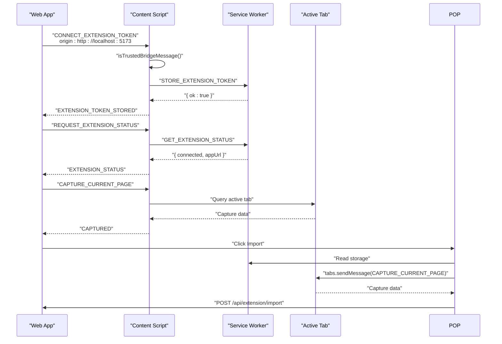
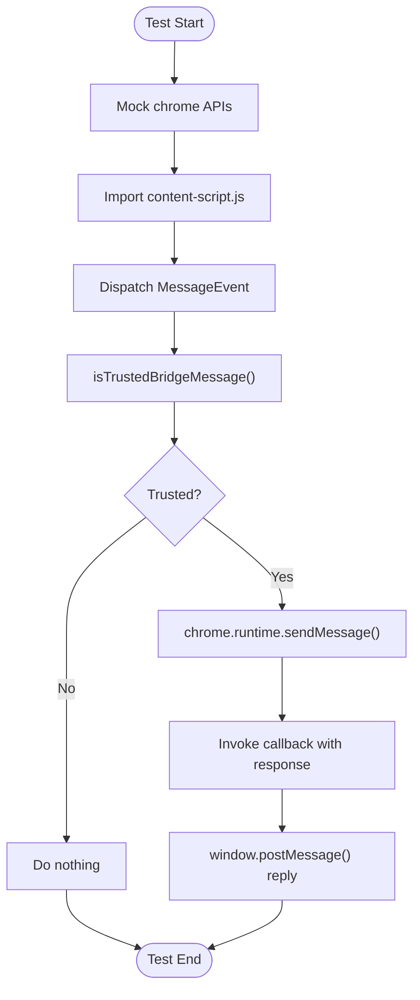
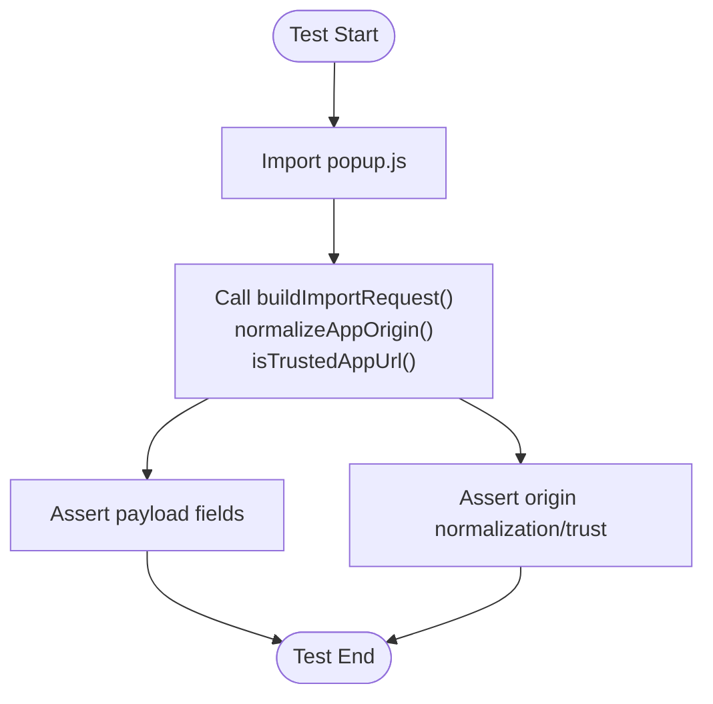
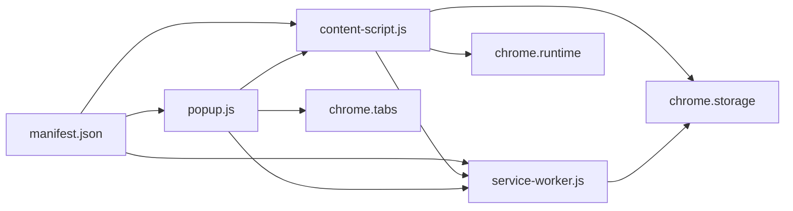

# Extension Testing and Validation

<cite>
**Referenced Files in This Document**
- [extension-bridge.test.ts](file://frontend/src/test/extension-bridge.test.ts)
- [extension-popup.test.ts](file://frontend/src/test/extension-popup.test.ts)
- [content-script.js](file://frontend/public/chrome-extension/content-script.js)
- [popup.js](file://frontend/public/chrome-extension/popup.js)
- [service-worker.js](file://frontend/public/chrome-extension/service-worker.js)
- [manifest.json](file://frontend/public/chrome-extension/manifest.json)
- [popup.html](file://frontend/public/chrome-extension/popup.html)
- [popup.css](file://frontend/public/chrome-extension/popup.css)
- [setup.ts](file://frontend/src/test/setup.ts)
- [package.json](file://frontend/package.json)
- [vite.config.ts](file://frontend/vite.config.ts)
- [chrome-extension-popup.d.ts](file://frontend/src/types/chrome-extension-popup.d.ts)
</cite>

## Table of Contents
1. [Introduction](#introduction)
2. [Project Structure](#project-structure)
3. [Core Components](#core-components)
4. [Architecture Overview](#architecture-overview)
5. [Detailed Component Analysis](#detailed-component-analysis)
6. [Dependency Analysis](#dependency-analysis)
7. [Performance Considerations](#performance-considerations)
8. [Troubleshooting Guide](#troubleshooting-guide)
9. [Conclusion](#conclusion)
10. [Appendices](#appendices)

## Introduction
This document provides comprehensive testing documentation for the Chrome Extension components. It focuses on:
- Extension bridge testing strategies for content script communication and message passing validation
- Popup interface testing covering user interaction simulation and state validation
- Testing utilities and mock strategies for extension APIs
- Debugging procedures including console logging, extension inspection, and network monitoring
- Common testing challenges such as async operations, cross-origin restrictions, and permission handling
- Examples of test scenarios, assertion patterns, and automated testing workflows
- Testing environment setup and continuous integration considerations

## Project Structure
The extension consists of three primary parts:
- Content Script: Handles secure message bridging between the web app and the extension
- Service Worker: Manages extension state via storage and responds to runtime messages
- Popup: Provides a user interface for capturing pages and importing data into the web app

```mermaid
graph TB
subgraph "Extension Bundle"
CS["content-script.js"]
SW["service-worker.js"]
POP["popup.js"]
HTML["popup.html"]
CSS["popup.css"]
MAN["manifest.json"]
end
subgraph "Web App"
WEB["Web App Origin<br/>http://localhost:5173"]
end
WEB <-- "postMessage / fetch" --> CS
CS < --> SW
POP < --> SW
POP --> HTML
HTML --> CSS
MAN --> CS
MAN --> SW
MAN --> POP
```

**Diagram sources**
- [content-script.js:1-118](file://frontend/public/chrome-extension/content-script.js#L1-L118)
- [service-worker.js:1-37](file://frontend/public/chrome-extension/service-worker.js#L1-L37)
- [popup.js:1-156](file://frontend/public/chrome-extension/popup.js#L1-L156)
- [popup.html:1-22](file://frontend/public/chrome-extension/popup.html#L1-L22)
- [popup.css:1-61](file://frontend/public/chrome-extension/popup.css#L1-L61)
- [manifest.json:1-24](file://frontend/public/chrome-extension/manifest.json#L1-L24)

**Section sources**
- [manifest.json:1-24](file://frontend/public/chrome-extension/manifest.json#L1-L24)
- [content-script.js:1-118](file://frontend/public/chrome-extension/content-script.js#L1-L118)
- [service-worker.js:1-37](file://frontend/public/chrome-extension/service-worker.js#L1-L37)
- [popup.js:1-156](file://frontend/public/chrome-extension/popup.js#L1-L156)
- [popup.html:1-22](file://frontend/public/chrome-extension/popup.html#L1-L22)
- [popup.css:1-61](file://frontend/public/chrome-extension/popup.css#L1-L61)

## Core Components
- Content Script: Implements origin-trust checks, runtime message handling, and bidirectional messaging with the web app
- Service Worker: Stores and retrieves extension state, exposes status queries, and manages token lifecycle
- Popup: Builds import requests, validates trusted origins, captures active tab content, and performs import actions

Key testing areas:
- Bridge message validation and origin checks
- Popup helper functions and UI state transitions
- Async flows and error handling paths
- Cross-origin and permission constraints

**Section sources**
- [content-script.js:40-58](file://frontend/public/chrome-extension/content-script.js#L40-L58)
- [service-worker.js:1-37](file://frontend/public/chrome-extension/service-worker.js#L1-L37)
- [popup.js:1-156](file://frontend/public/chrome-extension/popup.js#L1-L156)

## Architecture Overview
The extension uses a secure bridge pattern:
- Web app posts messages to the content script
- Content script validates origin and payload integrity
- Content script forwards validated messages to the service worker
- Service worker updates storage and responds
- Content script relays responses back to the web app
- Popup interacts with the service worker and web app via storage and runtime messages



**Diagram sources**
- [content-script.js:60-117](file://frontend/public/chrome-extension/content-script.js#L60-L117)
- [service-worker.js:1-37](file://frontend/public/chrome-extension/service-worker.js#L1-L37)
- [popup.js:44-136](file://frontend/public/chrome-extension/popup.js#L44-L136)

## Detailed Component Analysis

### Extension Bridge Testing (Content Script)
Focus: Validate secure message handling and origin checks.

Testing strategies:
- Mock global chrome APIs and storage state
- Simulate trusted and untrusted origins
- Verify runtime message forwarding and response behavior
- Assert that only validated messages reach the service worker

Key test scenarios:
- Ignore CONNECT messages from untrusted origins
- Accept localhost CONNECT messages during first-time setup
- Relay status queries and token revocation appropriately

Assertion patterns:
- Expect runtime.sendMessage to be called with expected payload and callback
- Expect no calls for ignored messages
- Validate message types and payload fields

Mock strategies:
- Replace chrome.runtime.sendMessage with a spy
- Replace chrome.storage.local.get with a mock returning controlled state
- Reset module state per test to avoid cross-test interference



**Diagram sources**
- [extension-bridge.test.ts:1-96](file://frontend/src/test/extension-bridge.test.ts#L1-L96)
- [content-script.js:40-117](file://frontend/public/chrome-extension/content-script.js#L40-L117)

**Section sources**
- [extension-bridge.test.ts:1-96](file://frontend/src/test/extension-bridge.test.ts#L1-L96)
- [content-script.js:40-117](file://frontend/public/chrome-extension/content-script.js#L40-L117)

### Popup Interface Testing
Focus: Validate helper functions and UI state transitions.

Testing strategies:
- Import built popup module as plain JS for MV3 loading
- Test helper functions independently
- Simulate storage state to drive UI state transitions
- Validate DOM interactions and button enable/disable behavior

Key test scenarios:
- Build import payload from captured page data
- Normalize and validate trusted app origins
- Ensure only trusted origins enable capture and open actions

Assertion patterns:
- Check payload fields (job_url, page_title, source_text, captured_at)
- Verify origin normalization and trust checks
- Confirm UI state reflects connection state



**Diagram sources**
- [extension-popup.test.ts:1-31](file://frontend/src/test/extension-popup.test.ts#L1-L31)
- [popup.js:1-33](file://frontend/public/chrome-extension/popup.js#L1-L33)

**Section sources**
- [extension-popup.test.ts:1-31](file://frontend/src/test/extension-popup.test.ts#L1-L31)
- [popup.js:1-33](file://frontend/public/chrome-extension/popup.js#L1-L33)
- [chrome-extension-popup.d.ts:1-20](file://frontend/src/types/chrome-extension-popup.d.ts#L1-L20)

### Service Worker State Management
Focus: Validate storage operations and status reporting.

Testing strategies:
- Mock chrome.storage.local set/get/remove
- Verify message routing for STORE, GET, and CLEAR operations
- Assert response shapes and error handling

Common assertions:
- Responses include ok flag and optional error field
- Status response includes connected flag and appUrl
- Clear removes tokens and connectedAt

**Section sources**
- [service-worker.js:1-37](file://frontend/public/chrome-extension/service-worker.js#L1-L37)

### Content Script Runtime Messaging
Focus: Validate capture requests and bidirectional messaging.

Testing strategies:
- Mock chrome.tabs.sendMessage for capture flow
- Verify capture data collection and response shape
- Assert message types and payload integrity

Common assertions:
- CAPTURE_CURRENT_PAGE returns url, title, visibleText, meta, jsonLd
- REQUEST_EXTENSION_STATUS returns connected and appUrl
- CONNECT/REVOKE messages trigger appropriate storage updates

**Section sources**
- [content-script.js:60-74](file://frontend/public/chrome-extension/content-script.js#L60-L74)
- [content-script.js:82-116](file://frontend/public/chrome-extension/content-script.js#L82-L116)

## Dependency Analysis
The extension components depend on:
- Manifest permissions: activeTab, storage, tabs
- Host permissions: all URLs for cross-origin capture
- Global chrome APIs: runtime, storage, tabs, windows



**Diagram sources**
- [manifest.json:6-22](file://frontend/public/chrome-extension/manifest.json#L6-L22)
- [content-script.js:1-118](file://frontend/public/chrome-extension/content-script.js#L1-L118)
- [service-worker.js:1-37](file://frontend/public/chrome-extension/service-worker.js#L1-L37)
- [popup.js:1-156](file://frontend/public/chrome-extension/popup.js#L1-L156)

**Section sources**
- [manifest.json:6-22](file://frontend/public/chrome-extension/manifest.json#L6-L22)

## Performance Considerations
- Minimize DOM parsing overhead in content script by limiting metadata and JSON-LD extraction
- Debounce repeated status queries to reduce runtime message churn
- Cache normalized origins to avoid repeated URL parsing
- Keep popup fetches synchronous to user actions to maintain responsiveness

## Troubleshooting Guide
Common testing challenges and resolutions:
- Async operations: Use Promise resolution steps to allow message handlers to settle before assertions
- Cross-origin restrictions: Ensure test origins match trusted local origins; simulate event.origin accordingly
- Permission handling: Verify activeTab and storage permissions are declared; test host_permissions for cross-origin access
- Mock cleanup: Reset module mocks and state between tests to prevent flakiness

Debugging procedures:
- Console logging: Add targeted logs around message dispatch and response handling
- Extension inspection: Open chrome://extensions, enable developer mode, inspect background/service worker and content script
- Network monitoring: Use DevTools Network panel to observe fetch requests and CORS behavior
- Storage inspection: Use DevTools Application panel to inspect chrome.storage.local keys

**Section sources**
- [extension-bridge.test.ts:52-54](file://frontend/src/test/extension-bridge.test.ts#L52-L54)
- [extension-bridge.test.ts:81-82](file://frontend/src/test/extension-bridge.test.ts#L81-L82)
- [manifest.json:6-7](file://frontend/public/chrome-extension/manifest.json#L6-L7)

## Conclusion
The testing suite validates the extension’s security model, message flows, and UI state transitions. By mocking chrome APIs, simulating trusted/untrusted origins, and asserting asynchronous behavior, the tests ensure robust operation across content scripts, service workers, and the popup interface. Adhering to the outlined strategies and troubleshooting steps will improve reliability and maintainability of the extension’s test coverage.

## Appendices

### Automated Testing Workflows
- Run unit tests: use the configured Vitest runner
- Watch mode: enable interactive test development
- Environment: jsdom for DOM APIs; globals enabled for expect utilities

**Section sources**
- [package.json:10-11](file://frontend/package.json#L10-L11)
- [vite.config.ts:18-22](file://frontend/vite.config.ts#L18-L22)
- [setup.ts:1-2](file://frontend/src/test/setup.ts#L1-L2)

### Example Test Scenarios and Assertion Patterns
- Bridge
  - Scenario: Untrusted origin CONNECT is ignored
  - Pattern: Expect no runtime.sendMessage call
- Bridge
  - Scenario: Trusted localhost CONNECT stores token
  - Pattern: Expect runtime.sendMessage with STORE message and callback response
- Popup helpers
  - Scenario: Import payload construction
  - Pattern: Assert payload fields and timestamps
- Popup helpers
  - Scenario: Origin trust validation
  - Pattern: Assert normalizeAppOrigin and isTrustedAppUrl behaviors

**Section sources**
- [extension-bridge.test.ts:34-56](file://frontend/src/test/extension-bridge.test.ts#L34-L56)
- [extension-bridge.test.ts:58-95](file://frontend/src/test/extension-bridge.test.ts#L58-L95)
- [extension-popup.test.ts:10-23](file://frontend/src/test/extension-popup.test.ts#L10-L23)
- [extension-popup.test.ts:25-29](file://frontend/src/test/extension-popup.test.ts#L25-L29)