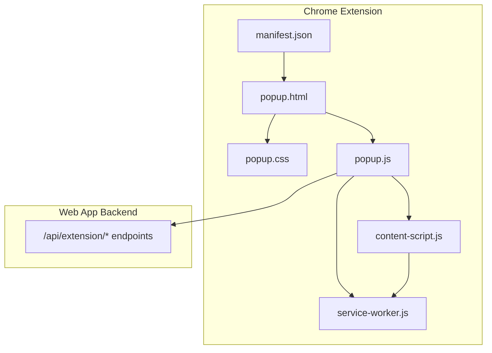
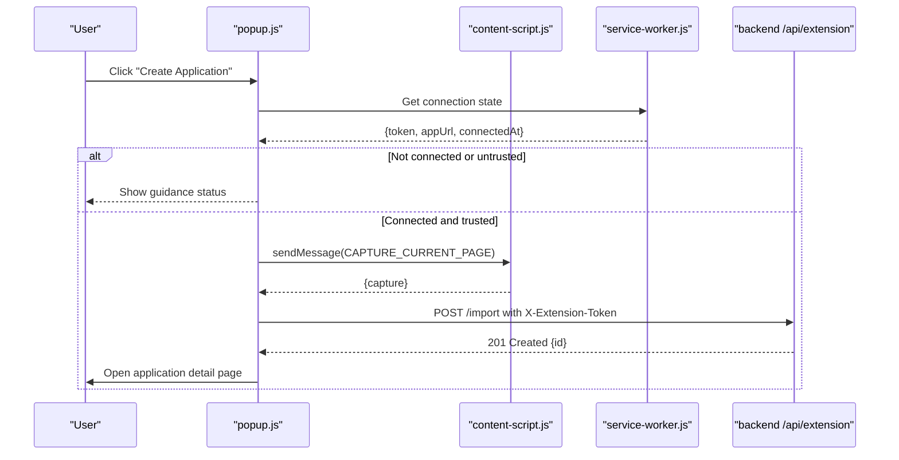
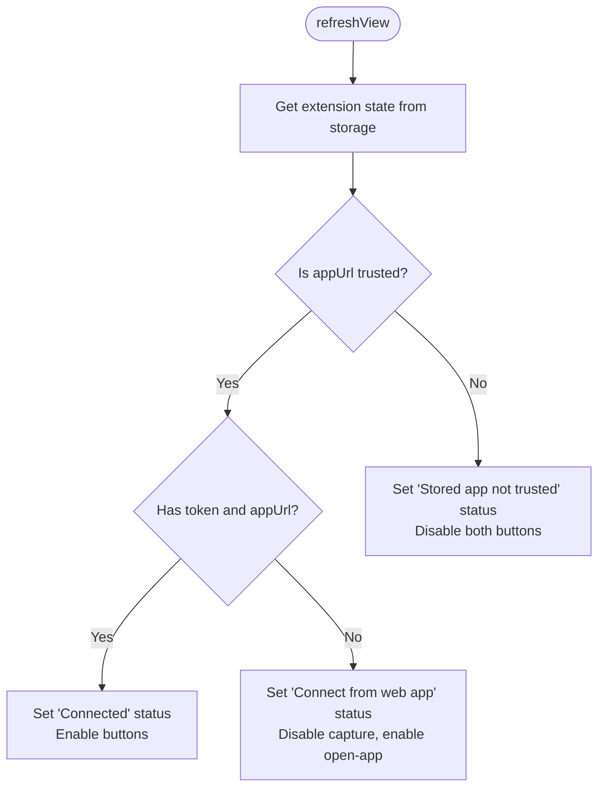
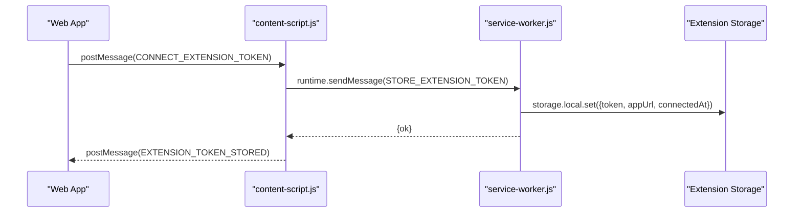
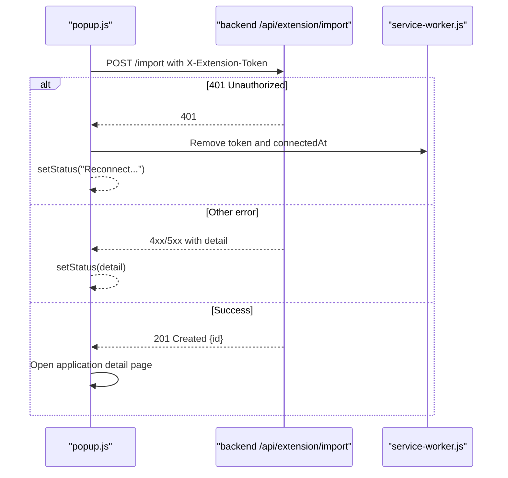
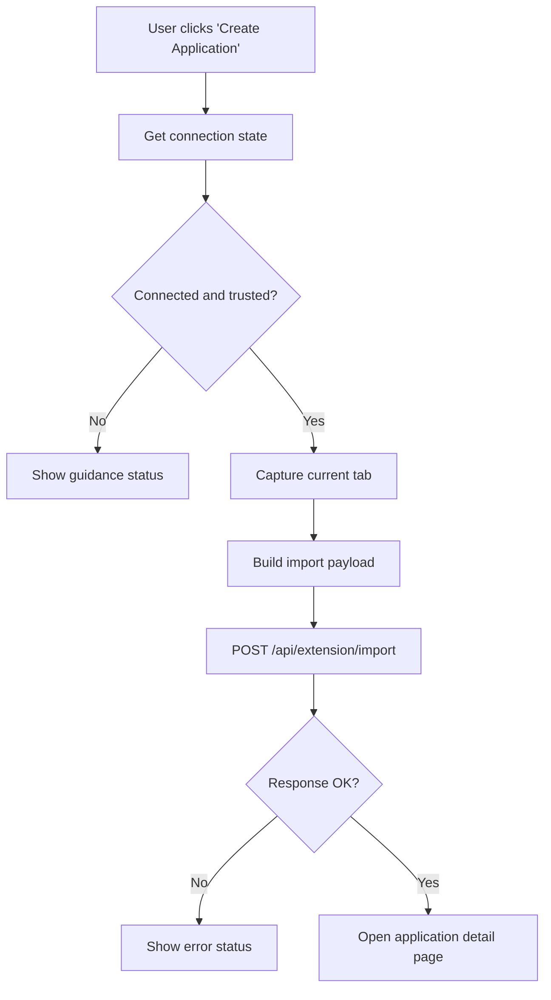
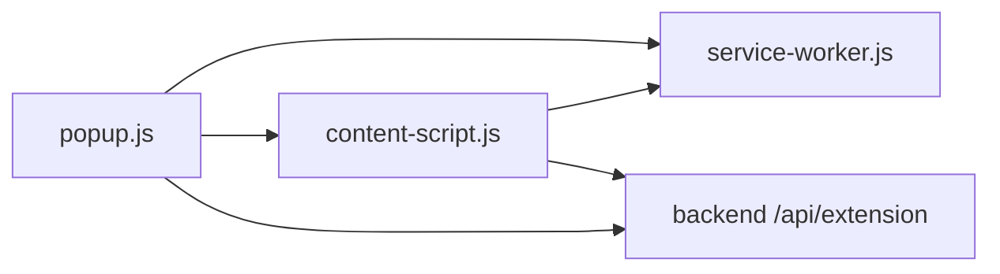

# Popup Interface

<cite>
**Referenced Files in This Document**
- [popup.html](file://frontend/public/chrome-extension/popup.html)
- [popup.css](file://frontend/public/chrome-extension/popup.css)
- [popup.js](file://frontend/public/chrome-extension/popup.js)
- [manifest.json](file://frontend/public/chrome-extension/manifest.json)
- [content-script.js](file://frontend/public/chrome-extension/content-script.js)
- [service-worker.js](file://frontend/public/chrome-extension/service-worker.js)
- [extension.py](file://backend/app/api/extension.py)
- [button.tsx](file://frontend/src/components/ui/button.tsx)
- [input.tsx](file://frontend/src/components/ui/input.tsx)
- [StatusBadge.tsx](file://frontend/src/components/StatusBadge.tsx)
- [tailwind.config.ts](file://frontend/tailwind.config.ts)
- [index.css](file://frontend/src/index.css)
- [extension-popup.test.ts](file://frontend/src/test/extension-popup.test.ts)
- [chrome-extension-popup.d.ts](file://frontend/src/types/chrome-extension-popup.d.ts)
</cite>

## Table of Contents
1. [Introduction](#introduction)
2. [Project Structure](#project-structure)
3. [Core Components](#core-components)
4. [Architecture Overview](#architecture-overview)
5. [Detailed Component Analysis](#detailed-component-analysis)
6. [Dependency Analysis](#dependency-analysis)
7. [Performance Considerations](#performance-considerations)
8. [Troubleshooting Guide](#troubleshooting-guide)
9. [Conclusion](#conclusion)
10. [Appendices](#appendices)

## Introduction
This document describes the Chrome Extension popup interface that enables users to capture the current browser tab and import the job posting into the web application as a new application. It covers the HTML/CSS structure, responsive and accessible presentation, user interaction handling, connection management, authentication via extension tokens, server communication, error handling, and the end-to-end import workflow from capture to application creation. It also documents state management, navigation patterns, and styling approaches using Tailwind CSS and custom styles.

## Project Structure
The popup is implemented as a static Chrome Extension page with minimal JavaScript for state and network interactions. The extension manifest defines permissions, background service worker, and the default popup. Content scripts and the service worker mediate between the web page and the extension runtime, enabling secure messaging and storage.

**Diagram sources**
- [manifest.json:1-24](file://frontend/public/chrome-extension/manifest.json#L1-L24)
- [popup.html:1-22](file://frontend/public/chrome-extension/popup.html#L1-L22)
- [popup.css:1-61](file://frontend/public/chrome-extension/popup.css#L1-L61)
- [popup.js:1-156](file://frontend/public/chrome-extension/popup.js#L1-L156)
- [content-script.js:1-118](file://frontend/public/chrome-extension/content-script.js#L1-L118)
- [service-worker.js:1-37](file://frontend/public/chrome-extension/service-worker.js#L1-L37)
- [extension.py:1-141](file://backend/app/api/extension.py#L1-L141)

**Section sources**
- [manifest.json:1-24](file://frontend/public/chrome-extension/manifest.json#L1-L24)
- [popup.html:1-22](file://frontend/public/chrome-extension/popup.html#L1-L22)
- [popup.css:1-61](file://frontend/public/chrome-extension/popup.css#L1-L61)
- [popup.js:1-156](file://frontend/public/chrome-extension/popup.js#L1-L156)
- [content-script.js:1-118](file://frontend/public/chrome-extension/content-script.js#L1-L118)
- [service-worker.js:1-37](file://frontend/public/chrome-extension/service-worker.js#L1-L37)
- [extension.py:1-141](file://backend/app/api/extension.py#L1-L141)

## Core Components
- Popup UI: Minimal HTML with a headline, status indicator, and two action buttons.
- Styles: Custom CSS for typography, spacing, and button variants.
- Logic: popup.js orchestrates connection state, capture, import, and navigation.
- Messaging: content-script.js captures the page and handles bridge messages; service-worker.js persists and exposes extension state.
- Backend: FastAPI endpoints validate and process import requests and manage extension tokens.

Key responsibilities:
- Connection state management and user guidance via status text.
- Secure origin checks for the web app URL.
- Page capture via content script and payload construction.
- Import request submission with extension token authentication.
- Navigation to the newly created application detail page.

**Section sources**
- [popup.html:10-18](file://frontend/public/chrome-extension/popup.html#L10-L18)
- [popup.css:8-61](file://frontend/public/chrome-extension/popup.css#L8-L61)
- [popup.js:35-93](file://frontend/public/chrome-extension/popup.js#L35-L93)
- [content-script.js:60-74](file://frontend/public/chrome-extension/content-script.js#L60-L74)
- [service-worker.js:1-37](file://frontend/public/chrome-extension/service-worker.js#L1-L37)
- [extension.py:114-141](file://backend/app/api/extension.py#L114-L141)

## Architecture Overview
The popup integrates three layers:
- Frontend popup: Presents actions and status, manages user interactions.
- Extension bridge: content-script.js captures page data; service-worker.js stores and retrieves extension state.
- Backend API: Validates and processes import requests using extension tokens.

**Diagram sources**
- [popup.js:95-136](file://frontend/public/chrome-extension/popup.js#L95-L136)
- [content-script.js:60-74](file://frontend/public/chrome-extension/content-script.js#L60-L74)
- [service-worker.js:14-25](file://frontend/public/chrome-extension/service-worker.js#L14-L25)
- [extension.py:114-141](file://backend/app/api/extension.py#L114-L141)

## Detailed Component Analysis

### HTML Structure and Accessibility
- The popup uses semantic headings and a single paragraph for status, ensuring screen reader compatibility.
- Buttons are native elements with clear labels and disabled states reflected visually.
- No dynamic ARIA attributes are set programmatically; the status text serves as the primary accessibility cue.

Accessibility considerations:
- Ensure sufficient color contrast for text and buttons.
- Keep button labels concise and actionable.
- Provide clear status updates for assistive technologies.

**Section sources**
- [popup.html:10-18](file://frontend/public/chrome-extension/popup.html#L10-L18)
- [popup.css:27-32](file://frontend/public/chrome-extension/popup.css#L27-L32)
- [popup.css:40-60](file://frontend/public/chrome-extension/popup.css#L40-L60)

### CSS Styling and Responsive Design
- Typography: Serif-based font stack for body text; uppercase eyebrow and large headline for hierarchy.
- Layout: Fixed panel width with padding; grid layout for action buttons.
- Colors: Custom palette with muted and accent colors; secondary button uses subtle borders.
- Responsiveness: Panel width is fixed; viewport meta tag ensures proper scaling on mobile devices.

Styling approach:
- Custom CSS for the popup surface.
- Tailwind-based UI components exist in the web app but are not used here.

**Section sources**
- [popup.css:1-61](file://frontend/public/chrome-extension/popup.css#L1-L61)
- [popup.html](file://frontend/public/chrome-extension/popup.html#L5)

### User Interaction Handling
- Event listeners attach to the two buttons after DOMContentLoaded.
- Clicking “Create Application” triggers capture and import; “Open App Setup” opens the extension configuration page.
- The status text is updated to reflect current state and outcomes.

UI components and DOM manipulation:
- Status element updated via textContent.
- Button enable/disable toggled based on connection state.
- New tab opened for navigation after successful import.

**Section sources**
- [popup.js:147-155](file://frontend/public/chrome-extension/popup.js#L147-L155)
- [popup.js:57-62](file://frontend/public/chrome-extension/popup.js#L57-L62)
- [popup.js:138-145](file://frontend/public/chrome-extension/popup.js#L138-L145)

### Connection Management Workflow
- Connection state is retrieved from extension storage and normalized to an origin.
- Trusted origins are restricted to local development URLs.
- Status messages guide the user to connect or reconnect depending on state.
- Buttons are enabled/disabled accordingly.

**Diagram sources**
- [popup.js:64-93](file://frontend/public/chrome-extension/popup.js#L64-L93)
- [popup.js:13-28](file://frontend/public/chrome-extension/popup.js#L13-L28)

**Section sources**
- [popup.js:35-93](file://frontend/public/chrome-extension/popup.js#L35-L93)
- [popup.js:13-28](file://frontend/public/chrome-extension/popup.js#L13-L28)

### Authentication and Token Handling
- The extension stores a long-lived token and associated metadata in extension storage.
- The service worker exposes GET/STORE/CLEAR operations for the token.
- The content script validates bridge messages and enforces trusted origins.

**Diagram sources**
- [content-script.js:96-111](file://frontend/public/chrome-extension/content-script.js#L96-L111)
- [service-worker.js:2-11](file://frontend/public/chrome-extension/service-worker.js#L2-L11)

**Section sources**
- [service-worker.js:1-37](file://frontend/public/chrome-extension/service-worker.js#L1-L37)
- [content-script.js:40-58](file://frontend/public/chrome-extension/content-script.js#L40-L58)
- [content-script.js:96-111](file://frontend/public/chrome-extension/content-script.js#L96-L111)

### Server Communication and Error Handling
- The import endpoint expects a validated payload and authenticates via extension token.
- On 401, the extension clears stored credentials and prompts reconnection.
- Non-OK responses return structured errors; otherwise, the created application ID is used to navigate.

**Diagram sources**
- [popup.js:109-136](file://frontend/public/chrome-extension/popup.js#L109-L136)
- [extension.py:114-141](file://backend/app/api/extension.py#L114-L141)

**Section sources**
- [popup.js:109-136](file://frontend/public/chrome-extension/popup.js#L109-L136)
- [extension.py:114-141](file://backend/app/api/extension.py#L114-L141)

### Import Workflow: From Capture to Application Creation
- Capture: The active tab is queried and a capture message is sent to the content script, which returns metadata, visible text, and structured data.
- Payload: The popup constructs an import request with timestamps and metadata.
- Validation: The backend validates presence of required fields and normalizes optional fields.
- Creation: The application service creates a new application from the capture and returns a detail view.

**Diagram sources**
- [popup.js:95-136](file://frontend/public/chrome-extension/popup.js#L95-L136)
- [content-script.js:60-74](file://frontend/public/chrome-extension/content-script.js#L60-L74)
- [extension.py:41-65](file://backend/app/api/extension.py#L41-L65)
- [extension.py:114-141](file://backend/app/api/extension.py#L114-L141)

**Section sources**
- [popup.js:1-11](file://frontend/public/chrome-extension/popup.js#L1-L11)
- [popup.js:44-55](file://frontend/public/chrome-extension/popup.js#L44-L55)
- [extension.py:41-65](file://backend/app/api/extension.py#L41-L65)

### Popup State Management and Navigation Patterns
- State is derived from extension storage and immediately reflected in the UI.
- Navigation is performed via chrome.tabs.create to open the web app’s application detail page.
- The popup remains focused on a single task: capturing and importing the current page.

Patterns:
- One-time initialization on DOMContentLoaded.
- Declarative event handlers per button.
- Centralized status updates for user feedback.

**Section sources**
- [popup.js:147-155](file://frontend/public/chrome-extension/popup.js#L147-L155)
- [popup.js:129-130](file://frontend/public/chrome-extension/popup.js#L129-L130)

### Styling Approach: Tailwind CSS vs. Custom Styles
- The popup uses custom CSS for typography, layout, and button variants.
- Tailwind-based UI components exist in the web app (Button, Input, StatusBadge) but are not used in the popup.
- Global Tailwind utilities are configured in the web app; the popup does not rely on them.

**Section sources**
- [popup.css:1-61](file://frontend/public/chrome-extension/popup.css#L1-L61)
- [tailwind.config.ts:1-25](file://frontend/tailwind.config.ts#L1-L25)
- [index.css:1-22](file://frontend/src/index.css#L1-L22)
- [button.tsx:1-23](file://frontend/src/components/ui/button.tsx#L1-L23)
- [input.tsx:1-15](file://frontend/src/components/ui/input.tsx#L1-L15)
- [StatusBadge.tsx:1-23](file://frontend/src/components/StatusBadge.tsx#L1-L23)

## Dependency Analysis
- popup.js depends on:
  - Extension storage via service-worker.js.
  - Content script for page capture.
  - Backend API for import.
- content-script.js depends on:
  - Extension storage via service-worker.js.
  - Window messaging for bridge communication.
- service-worker.js depends on:
  - Extension storage APIs.
- Backend depends on:
  - Extension token verification.
  - Application service for creation.

**Diagram sources**
- [popup.js:35-93](file://frontend/public/chrome-extension/popup.js#L35-L93)
- [content-script.js:60-74](file://frontend/public/chrome-extension/content-script.js#L60-L74)
- [service-worker.js:1-37](file://frontend/public/chrome-extension/service-worker.js#L1-L37)
- [extension.py:1-141](file://backend/app/api/extension.py#L1-L141)

**Section sources**
- [popup.js:35-93](file://frontend/public/chrome-extension/popup.js#L35-L93)
- [content-script.js:60-74](file://frontend/public/chrome-extension/content-script.js#L60-L74)
- [service-worker.js:1-37](file://frontend/public/chrome-extension/service-worker.js#L1-L37)
- [extension.py:1-141](file://backend/app/api/extension.py#L1-L141)

## Performance Considerations
- Minimize DOM queries: cache button and status nodes once during initialization.
- Debounce status updates to avoid rapid flicker.
- Limit capture payload size: the content script truncates collected metadata and JSON-LD to reasonable counts.
- Network requests: batch operations where possible; avoid unnecessary retries.

## Troubleshooting Guide
Common issues and resolutions:
- Not connected: Ensure the web app is open locally and the extension is connected. The popup will prompt to connect.
- Untrusted app URL: The extension only trusts local development origins. Change the web app URL to a trusted origin or use the local dev server.
- 401 Unauthorized after import: The extension token may have expired. Reconnect from the web app to refresh credentials.
- Import failures: Inspect the returned error detail and verify the page contains sufficient text content.
- Capture failures: Confirm the active tab is available and the content script is injected on the page.

**Section sources**
- [popup.js:88-92](file://frontend/public/chrome-extension/popup.js#L88-L92)
- [popup.js:118-126](file://frontend/public/chrome-extension/popup.js#L118-L126)
- [popup.js:131-133](file://frontend/public/chrome-extension/popup.js#L131-L133)
- [content-script.js:40-58](file://frontend/public/chrome-extension/content-script.js#L40-L58)

## Conclusion
The popup interface provides a focused, accessible, and efficient pathway to import job postings into the application. Its design emphasizes clarity of state, guarded connectivity, and robust error reporting. The integration with the content script and service worker ensures secure and reliable capture and token management, while the backend enforces validation and produces a navigable outcome.

## Appendices

### UI Components and Event Handlers Reference
- Status indicator: Element ID "status-text" for live updates.
- Action buttons: "capture-button" and "open-app-button".
- Event handlers: Click listeners attached on DOMContentLoaded.

**Section sources**
- [popup.html:13-17](file://frontend/public/chrome-extension/popup.html#L13-L17)
- [popup.js:147-155](file://frontend/public/chrome-extension/popup.js#L147-L155)

### Data Model for Import Requests
- Fields include job URL, source URL, page title, source text, metadata, JSON-LD fragments, and capture timestamp.
- Validation ensures non-empty source text and cleans optional fields.

**Section sources**
- [popup.js:1-11](file://frontend/public/chrome-extension/popup.js#L1-L11)
- [extension.py:41-65](file://backend/app/api/extension.py#L41-L65)

### Type Definitions for Helpers
- Helper functions exported by the popup module include payload builder and origin validators.

**Section sources**
- [chrome-extension-popup.d.ts:1-20](file://frontend/src/types/chrome-extension-popup.d.ts#L1-L20)
- [extension-popup.test.ts:9-30](file://frontend/src/test/extension-popup.test.ts#L9-L30)