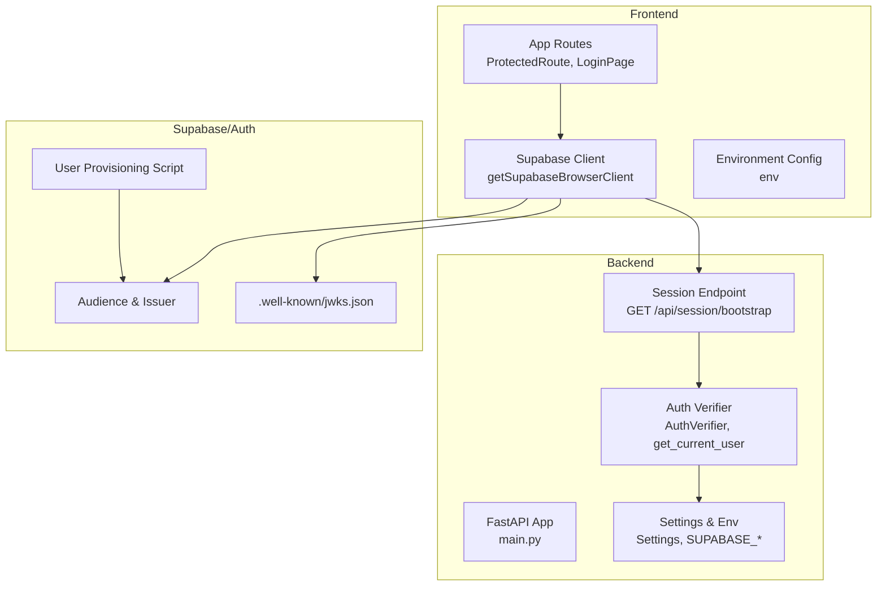
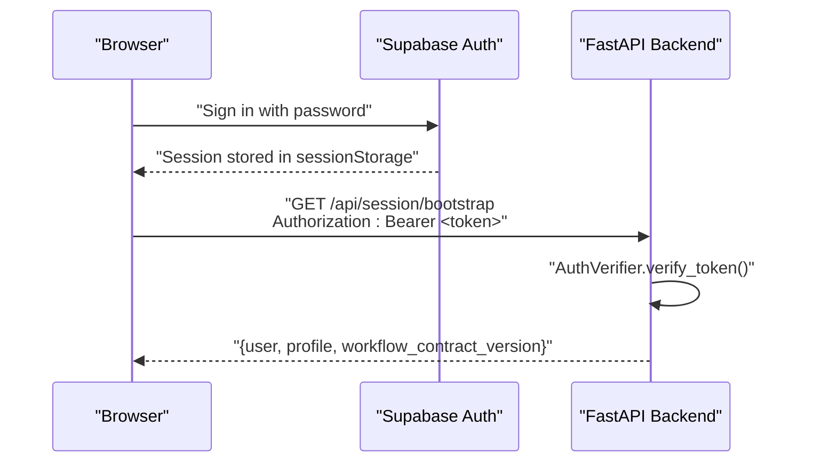
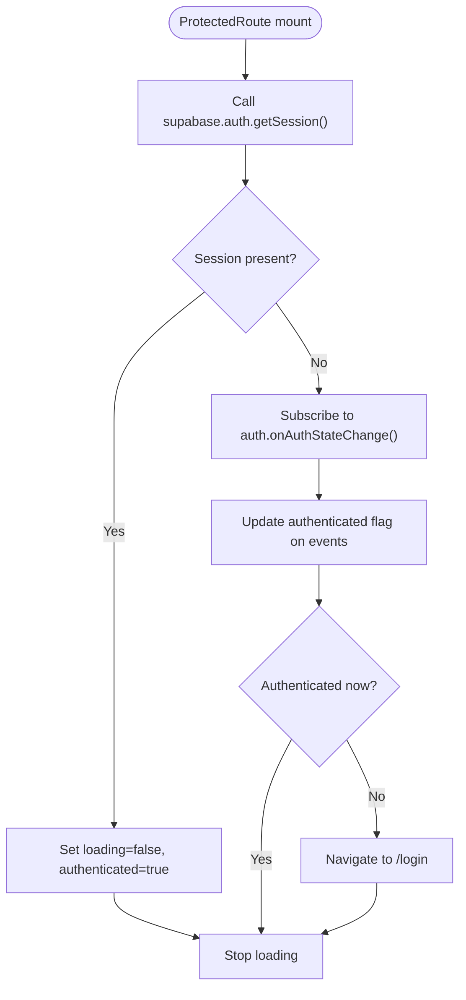
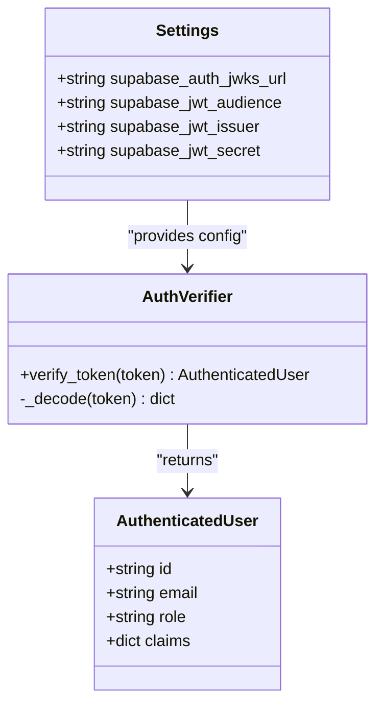
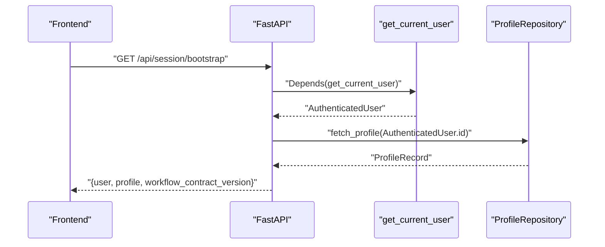
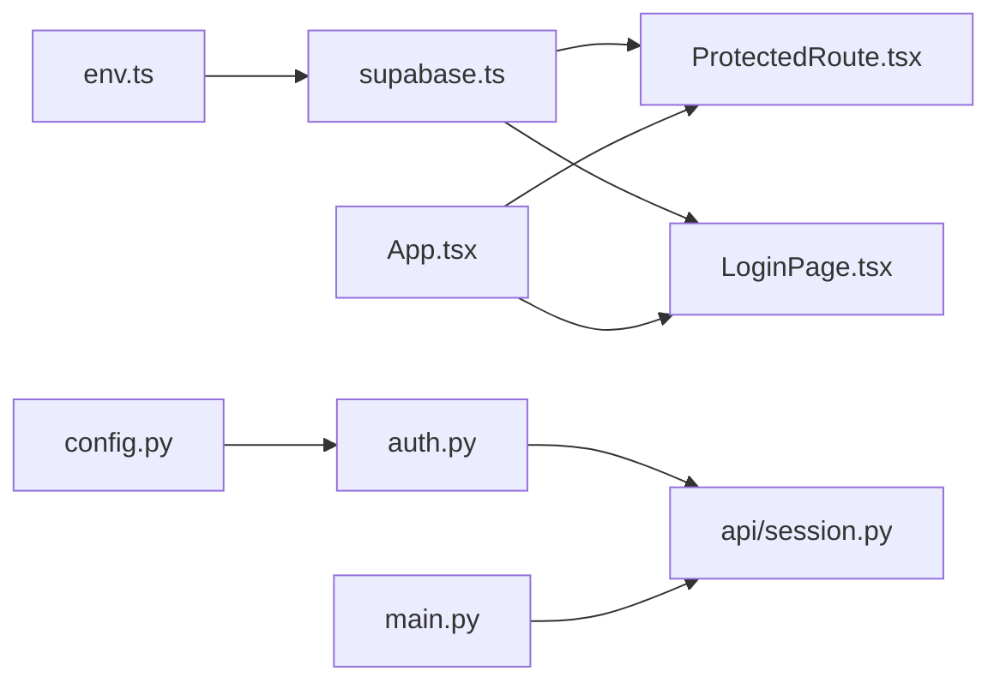

# Authentication System

<cite>
**Referenced Files in This Document**
- [backend/app/core/auth.py](file://backend/app/core/auth.py)
- [backend/app/core/config.py](file://backend/app/core/config.py)
- [backend/app/core/security.py](file://backend/app/core/security.py)
- [backend/app/api/session.py](file://backend/app/api/session.py)
- [backend/app/main.py](file://backend/app/main.py)
- [frontend/src/lib/supabase.ts](file://frontend/src/lib/supabase.ts)
- [frontend/src/lib/env.ts](file://frontend/src/lib/env.ts)
- [frontend/src/routes/ProtectedRoute.tsx](file://frontend/src/routes/ProtectedRoute.tsx)
- [frontend/src/routes/LoginPage.tsx](file://frontend/src/routes/LoginPage.tsx)
- [frontend/src/App.tsx](file://frontend/src/App.tsx)
- [scripts/seed_local_user.sh](file://scripts/seed_local_user.sh)
- [supabase/initdb/00-auth-schema.sql](file://supabase/initdb/00-auth-schema.sql)
- [backend/tests/test_auth.py](file://backend/tests/test_auth.py)
</cite>

## Table of Contents
1. [Introduction](#introduction)
2. [Project Structure](#project-structure)
3. [Core Components](#core-components)
4. [Architecture Overview](#architecture-overview)
5. [Detailed Component Analysis](#detailed-component-analysis)
6. [Dependency Analysis](#dependency-analysis)
7. [Performance Considerations](#performance-considerations)
8. [Troubleshooting Guide](#troubleshooting-guide)
9. [Conclusion](#conclusion)
10. [Appendices](#appendices)

## Introduction
This document explains the authentication system integrating Supabase Auth with a FastAPI backend using JWT-based tokens. It covers the end-to-end flow from the browser to the server, including Supabase client configuration, session detection and protection, backend middleware for token verification, and user context management. It also documents Supabase setup considerations, environment configuration, and operational scripts for seeding users.

## Project Structure
Authentication spans three layers:
- Frontend (React): Supabase client initialization, login, session protection, and routing.
- Backend (FastAPI): Token verification middleware, user context extraction, and session bootstrap endpoint.
- Supabase/Auth: JWKS/JWT configuration, audience/issuer, and user provisioning.

**Diagram sources**
- [frontend/src/App.tsx:12-35](file://frontend/src/App.tsx#L12-L35)
- [frontend/src/routes/ProtectedRoute.tsx:6-43](file://frontend/src/routes/ProtectedRoute.tsx#L6-L43)
- [frontend/src/routes/LoginPage.tsx:10-36](file://frontend/src/routes/LoginPage.tsx#L10-L36)
- [frontend/src/lib/supabase.ts:15-25](file://frontend/src/lib/supabase.ts#L15-L25)
- [frontend/src/lib/env.ts:3-14](file://frontend/src/lib/env.ts#L3-L14)
- [backend/app/main.py:14-36](file://backend/app/main.py#L14-L36)
- [backend/app/api/session.py:27-44](file://backend/app/api/session.py#L27-L44)
- [backend/app/core/auth.py:22-89](file://backend/app/core/auth.py#L22-L89)
- [backend/app/core/config.py:35-96](file://backend/app/core/config.py#L35-L96)
- [supabase/initdb/00-auth-schema.sql:1-2](file://supabase/initdb/00-auth-schema.sql#L1-L2)
- [scripts/seed_local_user.sh:27-60](file://scripts/seed_local_user.sh#L27-L60)

**Section sources**
- [frontend/src/App.tsx:12-35](file://frontend/src/App.tsx#L12-L35)
- [frontend/src/routes/ProtectedRoute.tsx:6-43](file://frontend/src/routes/ProtectedRoute.tsx#L6-L43)
- [frontend/src/routes/LoginPage.tsx:10-36](file://frontend/src/routes/LoginPage.tsx#L10-L36)
- [frontend/src/lib/supabase.ts:15-25](file://frontend/src/lib/supabase.ts#L15-L25)
- [frontend/src/lib/env.ts:3-14](file://frontend/src/lib/env.ts#L3-L14)
- [backend/app/main.py:14-36](file://backend/app/main.py#L14-L36)
- [backend/app/api/session.py:27-44](file://backend/app/api/session.py#L27-L44)
- [backend/app/core/auth.py:22-89](file://backend/app/core/auth.py#L22-L89)
- [backend/app/core/config.py:35-96](file://backend/app/core/config.py#L35-L96)
- [supabase/initdb/00-auth-schema.sql:1-2](file://supabase/initdb/00-auth-schema.sql#L1-L2)
- [scripts/seed_local_user.sh:27-60](file://scripts/seed_local_user.sh#L27-L60)

## Core Components
- Supabase client configuration and session persistence in the browser.
- Frontend protected route guard that checks session state and redirects unauthenticated users.
- Backend JWT verification using Supabase JWKS and optional shared secret fallback.
- Session bootstrap endpoint that returns user, profile, and workflow contract metadata.
- Environment-driven configuration for Supabase endpoints, audience, issuer, and secrets.

Key implementation references:
- Supabase client initialization and session persistence: [frontend/src/lib/supabase.ts:15-25](file://frontend/src/lib/supabase.ts#L15-L25)
- Protected route logic: [frontend/src/routes/ProtectedRoute.tsx:6-43](file://frontend/src/routes/ProtectedRoute.tsx#L6-L43)
- Login flow: [frontend/src/routes/LoginPage.tsx:17-36](file://frontend/src/routes/LoginPage.tsx#L17-L36)
- Backend auth verifier and user extractor: [backend/app/core/auth.py:22-89](file://backend/app/core/auth.py#L22-L89)
- Session bootstrap endpoint: [backend/app/api/session.py:27-44](file://backend/app/api/session.py#L27-L44)
- Settings and Supabase configuration: [backend/app/core/config.py:35-96](file://backend/app/core/config.py#L35-L96)

**Section sources**
- [frontend/src/lib/supabase.ts:15-25](file://frontend/src/lib/supabase.ts#L15-L25)
- [frontend/src/routes/ProtectedRoute.tsx:6-43](file://frontend/src/routes/ProtectedRoute.tsx#L6-L43)
- [frontend/src/routes/LoginPage.tsx:17-36](file://frontend/src/routes/LoginPage.tsx#L17-L36)
- [backend/app/core/auth.py:22-89](file://backend/app/core/auth.py#L22-L89)
- [backend/app/api/session.py:27-44](file://backend/app/api/session.py#L27-L44)
- [backend/app/core/config.py:35-96](file://backend/app/core/config.py#L35-L96)

## Architecture Overview
The authentication flow is a client-server handshake using Supabase JWTs:
- Frontend initializes a Supabase client with session persistence enabled.
- Users log in via the login page, obtaining a session stored in sessionStorage.
- Protected routes check the session and redirect to login if absent.
- Backend verifies incoming Bearer tokens against Supabase JWKS or a shared secret fallback.
- The session bootstrap endpoint returns user and profile data for the authenticated user.

**Diagram sources**
- [frontend/src/routes/LoginPage.tsx:23-26](file://frontend/src/routes/LoginPage.tsx#L23-L26)
- [frontend/src/lib/supabase.ts:6-11](file://frontend/src/lib/supabase.ts#L6-L11)
- [backend/app/api/session.py:27-44](file://backend/app/api/session.py#L27-L44)
- [backend/app/core/auth.py:27-38](file://backend/app/core/auth.py#L27-L38)

## Detailed Component Analysis

### Frontend Authentication Implementation
- Supabase client configuration enables session persistence and automatic token refresh, storing sessions in sessionStorage.
- The login page submits credentials to Supabase and navigates to the protected area upon success.
- ProtectedRoute fetches the current session on mount, subscribes to auth state changes, and redirects to login if no session exists.
- Environment variables define Supabase URL, anonymous key, and API URL.

Implementation references:
- Client initialization and options: [frontend/src/lib/supabase.ts:4-11](file://frontend/src/lib/supabase.ts#L4-L11), [frontend/src/lib/supabase.ts:15-25](file://frontend/src/lib/supabase.ts#L15-L25)
- Login submission: [frontend/src/routes/LoginPage.tsx:17-36](file://frontend/src/routes/LoginPage.tsx#L17-L36)
- Protected route logic: [frontend/src/routes/ProtectedRoute.tsx:10-26](file://frontend/src/routes/ProtectedRoute.tsx#L10-L26)
- Environment schema: [frontend/src/lib/env.ts:3-14](file://frontend/src/lib/env.ts#L3-L14)

**Diagram sources**
- [frontend/src/routes/ProtectedRoute.tsx:10-26](file://frontend/src/routes/ProtectedRoute.tsx#L10-L26)

**Section sources**
- [frontend/src/lib/supabase.ts:4-11](file://frontend/src/lib/supabase.ts#L4-L11)
- [frontend/src/lib/supabase.ts:15-25](file://frontend/src/lib/supabase.ts#L15-L25)
- [frontend/src/routes/LoginPage.tsx:17-36](file://frontend/src/routes/LoginPage.tsx#L17-L36)
- [frontend/src/routes/ProtectedRoute.tsx:10-26](file://frontend/src/routes/ProtectedRoute.tsx#L10-L26)
- [frontend/src/lib/env.ts:3-14](file://frontend/src/lib/env.ts#L3-L14)

### Backend Authentication Middleware and Token Validation
- The backend exposes a dependency that extracts and validates the Authorization header, expecting a Bearer token.
- AuthVerifier decodes the JWT using Supabase’s JWKS URL and supports multiple algorithms. If JWKS retrieval fails and a shared secret is configured, it falls back to symmetric verification.
- On successful verification, the dependency returns an AuthenticatedUser object populated from token claims.

Implementation references:
- Token extraction and verification: [backend/app/core/auth.py:72-89](file://backend/app/core/auth.py#L72-L89)
- Decoding and fallback logic: [backend/app/core/auth.py:40-64](file://backend/app/core/auth.py#L40-L64)
- Settings for Supabase JWKS, audience, issuer, and secret: [backend/app/core/config.py:52-58](file://backend/app/core/config.py#L52-L58)

**Diagram sources**
- [backend/app/core/config.py:35-96](file://backend/app/core/config.py#L35-L96)
- [backend/app/core/auth.py:22-38](file://backend/app/core/auth.py#L22-L38)

**Section sources**
- [backend/app/core/auth.py:22-89](file://backend/app/core/auth.py#L22-L89)
- [backend/app/core/config.py:35-96](file://backend/app/core/config.py#L35-L96)

### Session Bootstrap Endpoint
- The GET /api/session/bootstrap endpoint requires a valid Bearer token and returns user identity, profile, and workflow contract version.
- It depends on the authenticated user extracted by the dependency chain and the profile repository.

Implementation references:
- Endpoint definition and handler: [backend/app/api/session.py:27-44](file://backend/app/api/session.py#L27-L44)
- Dependency on get_current_user: [backend/app/api/session.py:29-32](file://backend/app/api/session.py#L29-L32)

**Diagram sources**
- [backend/app/api/session.py:27-44](file://backend/app/api/session.py#L27-L44)
- [backend/app/core/auth.py:72-89](file://backend/app/core/auth.py#L72-L89)

**Section sources**
- [backend/app/api/session.py:27-44](file://backend/app/api/session.py#L27-L44)
- [backend/app/core/auth.py:72-89](file://backend/app/core/auth.py#L72-L89)

### Supabase Authentication Setup and User Provisioning
- Supabase schema initialization creates the auth schema.
- The seed script provisions a local development user via Supabase Admin API after verifying the auth gateway health.
- Environment variables configure Supabase URLs and service role keys.

Implementation references:
- Auth schema creation: [supabase/initdb/00-auth-schema.sql:1-2](file://supabase/initdb/00-auth-schema.sql#L1-L2)
- User provisioning script: [scripts/seed_local_user.sh:27-60](file://scripts/seed_local_user.sh#L27-L60)
- Environment variables for Supabase and API: [frontend/src/lib/env.ts:9-11](file://frontend/src/lib/env.ts#L9-L11)

**Section sources**
- [supabase/initdb/00-auth-schema.sql:1-2](file://supabase/initdb/00-auth-schema.sql#L1-L2)
- [scripts/seed_local_user.sh:27-60](file://scripts/seed_local_user.sh#L27-L60)
- [frontend/src/lib/env.ts:9-11](file://frontend/src/lib/env.ts#L9-L11)

## Dependency Analysis
- Frontend depends on Supabase client configuration and environment variables for URLs and keys.
- ProtectedRoute depends on Supabase auth state and session persistence.
- Backend depends on Settings for Supabase JWKS, audience, issuer, and optional shared secret.
- Session bootstrap endpoint depends on the authenticated user and profile repository.

**Diagram sources**
- [frontend/src/lib/env.ts:3-14](file://frontend/src/lib/env.ts#L3-L14)
- [frontend/src/lib/supabase.ts:15-25](file://frontend/src/lib/supabase.ts#L15-L25)
- [frontend/src/routes/ProtectedRoute.tsx:6-43](file://frontend/src/routes/ProtectedRoute.tsx#L6-L43)
- [frontend/src/routes/LoginPage.tsx:10-36](file://frontend/src/routes/LoginPage.tsx#L10-L36)
- [frontend/src/App.tsx:12-35](file://frontend/src/App.tsx#L12-L35)
- [backend/app/core/config.py:35-96](file://backend/app/core/config.py#L35-L96)
- [backend/app/core/auth.py:22-89](file://backend/app/core/auth.py#L22-L89)
- [backend/app/api/session.py:27-44](file://backend/app/api/session.py#L27-L44)
- [backend/app/main.py:14-36](file://backend/app/main.py#L14-L36)

**Section sources**
- [frontend/src/lib/env.ts:3-14](file://frontend/src/lib/env.ts#L3-L14)
- [frontend/src/lib/supabase.ts:15-25](file://frontend/src/lib/supabase.ts#L15-L25)
- [frontend/src/routes/ProtectedRoute.tsx:6-43](file://frontend/src/routes/ProtectedRoute.tsx#L6-L43)
- [frontend/src/routes/LoginPage.tsx:10-36](file://frontend/src/routes/LoginPage.tsx#L10-L36)
- [frontend/src/App.tsx:12-35](file://frontend/src/App.tsx#L12-L35)
- [backend/app/core/config.py:35-96](file://backend/app/core/config.py#L35-L96)
- [backend/app/core/auth.py:22-89](file://backend/app/core/auth.py#L22-L89)
- [backend/app/api/session.py:27-44](file://backend/app/api/session.py#L27-L44)
- [backend/app/main.py:14-36](file://backend/app/main.py#L14-L36)

## Performance Considerations
- Token verification uses JWKS fetching followed by decoding; caching the JWK client reduces repeated network calls.
- Session persistence in sessionStorage avoids re-authentication across page reloads but relies on browser storage availability.
- Backend LRU-cached settings and verifier minimize repeated initialization overhead.

Recommendations:
- Keep the JWK client cached (already implemented).
- Ensure CORS and origin configurations match the frontend origin to avoid preflight overhead.
- Use symmetric secret fallback only when necessary; prefer JWKS for production-grade trust chains.

**Section sources**
- [backend/app/core/auth.py:67-69](file://backend/app/core/auth.py#L67-L69)
- [frontend/src/lib/supabase.ts:6-11](file://frontend/src/lib/supabase.ts#L6-L11)
- [backend/app/core/config.py:94-96](file://backend/app/core/config.py#L94-L96)

## Troubleshooting Guide
Common issues and resolutions:
- Missing or malformed Bearer token: The backend raises a 401 error when the Authorization header is missing or not prefixed with Bearer.
- Invalid or expired token: Token decoding failures trigger a 401 Unauthorized response.
- JWKS retrieval failure with no shared secret: The verifier rejects the token when JWKS is empty and no symmetric secret is configured.
- Session not detected in ProtectedRoute: Ensure session persistence is enabled and the auth state change listener updates the authenticated state.

References:
- Token extraction and errors: [backend/app/core/auth.py:72-89](file://backend/app/core/auth.py#L72-L89)
- JWKS fallback and errors: [backend/app/core/auth.py:40-64](file://backend/app/core/auth.py#L40-L64)
- Protected route session handling: [frontend/src/routes/ProtectedRoute.tsx:10-26](file://frontend/src/routes/ProtectedRoute.tsx#L10-L26)
- Test coverage for verifier behavior: [backend/tests/test_auth.py:29-66](file://backend/tests/test_auth.py#L29-L66)

**Section sources**
- [backend/app/core/auth.py:72-89](file://backend/app/core/auth.py#L72-L89)
- [backend/app/core/auth.py:40-64](file://backend/app/core/auth.py#L40-L64)
- [frontend/src/routes/ProtectedRoute.tsx:10-26](file://frontend/src/routes/ProtectedRoute.tsx#L10-L26)
- [backend/tests/test_auth.py:29-66](file://backend/tests/test_auth.py#L29-L66)

## Conclusion
The system integrates Supabase Auth with a FastAPI backend using JWT verification via JWKS and a symmetric secret fallback. Frontend session persistence and protected routing ensure seamless user experiences, while the backend enforces secure token validation and exposes a session bootstrap endpoint for authenticated contexts. Proper environment configuration and user provisioning support local development and production deployments.

## Appendices

### Environment Variables and Configuration
- Frontend environment schema defines Supabase URL, anonymous key, and API URL.
- Backend Settings define Supabase JWKS URL, audience, issuer, and optional shared secret.

References:
- Frontend env schema: [frontend/src/lib/env.ts:3-14](file://frontend/src/lib/env.ts#L3-L14)
- Backend settings: [backend/app/core/config.py:35-96](file://backend/app/core/config.py#L35-L96)

**Section sources**
- [frontend/src/lib/env.ts:3-14](file://frontend/src/lib/env.ts#L3-L14)
- [backend/app/core/config.py:35-96](file://backend/app/core/config.py#L35-L96)