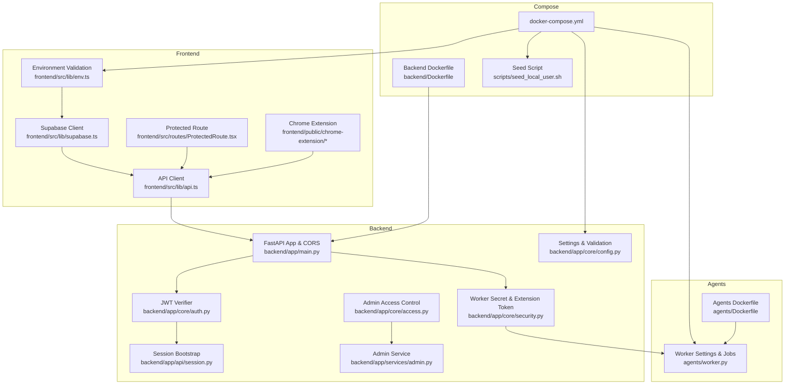
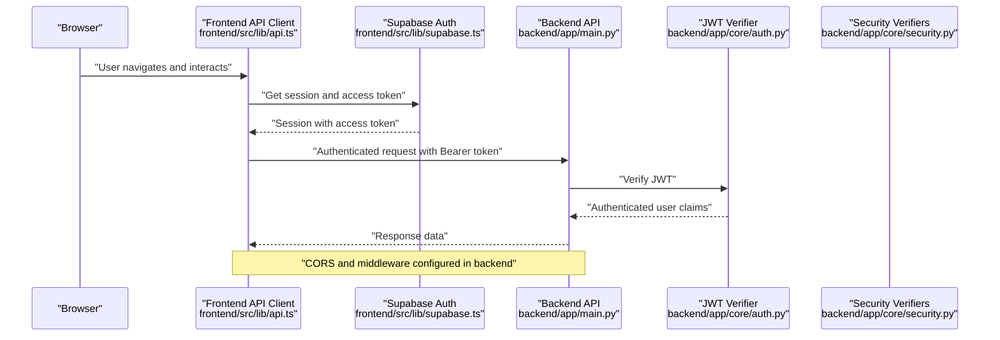
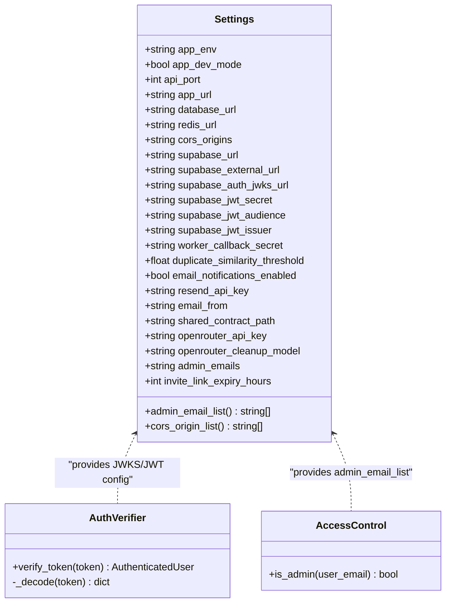
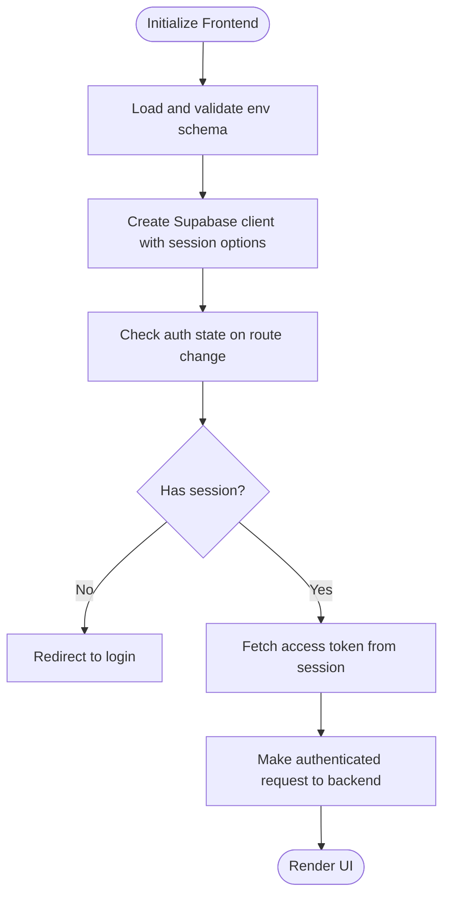
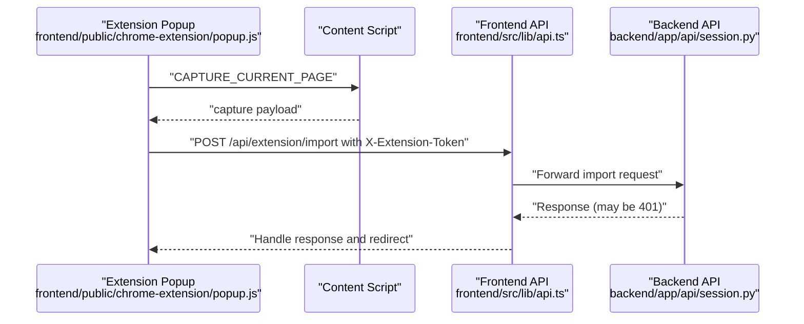
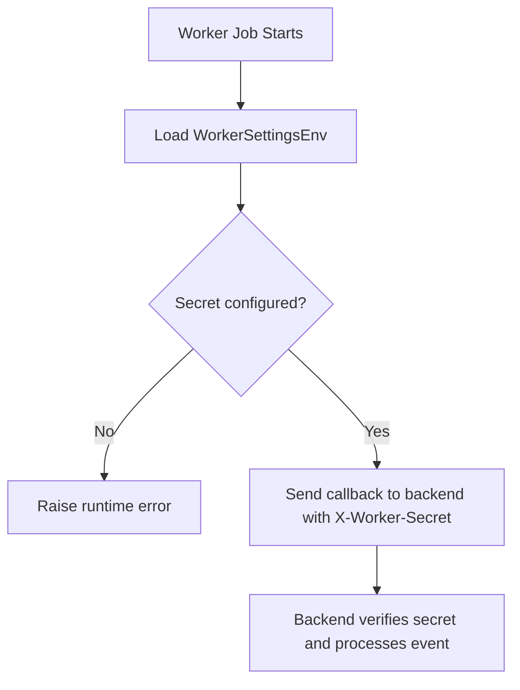
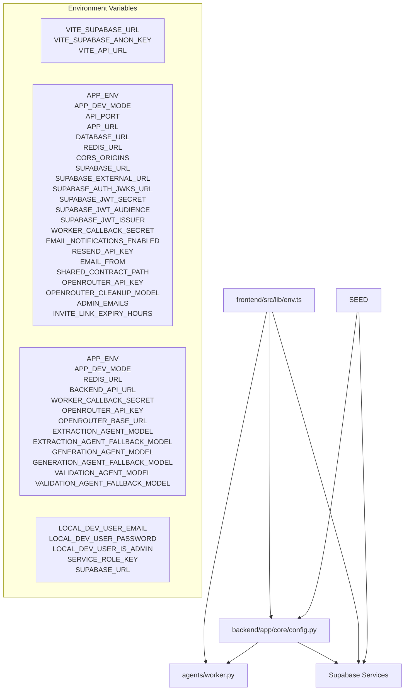

# Configuration and Environment

<cite>
**Referenced Files in This Document**
- [backend/app/core/config.py](file://backend/app/core/config.py)
- [backend/app/core/auth.py](file://backend/app/core/auth.py)
- [backend/app/core/security.py](file://backend/app/core/security.py)
- [backend/app/core/access.py](file://backend/app/core/access.py)
- [backend/app/main.py](file://backend/app/main.py)
- [backend/app/api/session.py](file://backend/app/api/session.py)
- [backend/app/services/admin.py](file://backend/app/services/admin.py)
- [frontend/src/lib/env.ts](file://frontend/src/lib/env.ts)
- [frontend/src/lib/supabase.ts](file://frontend/src/lib/supabase.ts)
- [frontend/src/routes/ProtectedRoute.tsx](file://frontend/src/routes/ProtectedRoute.tsx)
- [frontend/src/lib/api.ts](file://frontend/src/lib/api.ts)
- [frontend/public/chrome-extension/manifest.json](file://frontend/public/chrome-extension/manifest.json)
- [frontend/public/chrome-extension/popup.js](file://frontend/public/chrome-extension/popup.js)
- [docker-compose.yml](file://docker-compose.yml)
- [scripts/seed_local_user.sh](file://scripts/seed_local_user.sh)
- [backend/Dockerfile](file://backend/Dockerfile)
- [agents/Dockerfile](file://agents/Dockerfile)
- [agents/pyproject.toml](file://agents/pyproject.toml)
- [backend/pyproject.toml](file://backend/pyproject.toml)
- [frontend/package.json](file://frontend/package.json)
</cite>

## Update Summary
**Changes Made**
- Added documentation for new environment variables: SUPABASE_INTERNAL_URL, ADMIN_EMAILS, INVITE_LINK_EXPIRY_HOURS, and LOCAL_DEV_USER_IS_ADMIN
- Updated backend configuration section to include new admin email management and invite expiration settings
- Enhanced frontend environment validation to cover new admin-related configurations
- Added documentation for local development user administration features
- Updated dependency analysis to reflect new environment variable relationships

## Table of Contents
1. [Introduction](#introduction)
2. [Project Structure](#project-structure)
3. [Core Components](#core-components)
4. [Architecture Overview](#architecture-overview)
5. [Detailed Component Analysis](#detailed-component-analysis)
6. [Dependency Analysis](#dependency-analysis)
7. [Performance Considerations](#performance-considerations)
8. [Troubleshooting Guide](#troubleshooting-guide)
9. [Conclusion](#conclusion)
10. [Appendices](#appendices)

## Introduction
This document provides comprehensive configuration and environment documentation for the multi-component system. It covers:
- Environment configuration management, including settings management, environment variables, configuration validation, and secret management strategies
- Authentication integration with Supabase, including JWT configuration, session management, and role-based access control
- Security configuration including CORS policies, CSRF protection, and API security measures
- Frontend environment configuration including API endpoint configuration, feature flags, and development vs production settings
- Integration between frontend, backend, and AI agent components
- Best practices for environment setup, configuration validation, and security hardening
- Examples of common configuration scenarios and troubleshooting configuration issues

## Project Structure
The system comprises three primary components:
- Backend (FastAPI): Provides APIs, authentication verification, CORS configuration, and worker callback security
- Frontend (React/Vite): Manages environment variables, Supabase session handling, protected routing, and API requests
- Agents (Python/ARQ): Performs extraction and generation tasks, integrates with backend via callbacks and secrets

**Diagram sources**
- [frontend/src/lib/env.ts:1-15](file://frontend/src/lib/env.ts#L1-L15)
- [frontend/src/lib/supabase.ts:1-26](file://frontend/src/lib/supabase.ts#L1-L26)
- [frontend/src/routes/ProtectedRoute.tsx:1-44](file://frontend/src/routes/ProtectedRoute.tsx#L1-L44)
- [frontend/src/lib/api.ts:177-214](file://frontend/src/lib/api.ts#L177-L214)
- [frontend/public/chrome-extension/popup.js:109-135](file://frontend/public/chrome-extension/popup.js#L109-L135)
- [backend/app/main.py:14-22](file://backend/app/main.py#L14-L22)
- [backend/app/core/config.py:35-96](file://backend/app/core/config.py#L35-L96)
- [backend/app/core/auth.py:22-69](file://backend/app/core/auth.py#L22-L69)
- [backend/app/core/security.py:13-54](file://backend/app/core/security.py#L13-L54)
- [backend/app/core/access.py:20-30](file://backend/app/core/access.py#L20-L30)
- [backend/app/api/session.py:27-44](file://backend/app/api/session.py#L27-L44)
- [backend/app/services/admin.py:119-200](file://backend/app/services/admin.py#L119-L200)
- [agents/worker.py:290-305](file://agents/worker.py#L290-L305)
- [docker-compose.yml:1-194](file://docker-compose.yml#L1-L194)
- [scripts/seed_local_user.sh:64-96](file://scripts/seed_local_user.sh#L64-L96)
- [backend/Dockerfile:1-18](file://backend/Dockerfile#L1-L18)
- [agents/Dockerfile:1-14](file://agents/Dockerfile#L1-L14)

**Section sources**
- [docker-compose.yml:1-194](file://docker-compose.yml#L1-L194)
- [backend/app/core/config.py:35-96](file://backend/app/core/config.py#L35-L96)
- [frontend/src/lib/env.ts:1-15](file://frontend/src/lib/env.ts#L1-L15)

## Core Components
This section documents environment configuration management, validation, and secret handling across components.

- Backend Settings and Validation
  - Centralized settings model defines environment variables for app environment, dev mode, API port, app URL, database URL, Redis URL, CORS origins, Supabase URLs, JWT configuration, worker callback secret, duplicate similarity threshold, email notifications, shared contract path, OpenRouter configuration, admin emails, and invite link expiry hours.
  - Email settings are validated to ensure required keys are present when notifications are enabled.
  - CORS origins are parsed into a list for middleware configuration.
  - Settings are cached via a factory function for reuse.
  - **Updated**: New admin_email_list property parses comma-separated admin email addresses for access control.

- Frontend Environment Validation
  - Zod schema enforces presence and shape of environment variables for app environment, dev mode, Supabase URL, Supabase anonymous key, and API URL.
  - Parsing occurs at module initialization, ensuring early failures if variables are missing or invalid.

- Agent Settings and Secrets
  - Worker settings include app environment, dev mode, Redis URL, backend API URL, worker callback secret, shared contract path, OpenRouter configuration, and model names for extraction, generation, and validation.
  - Worker callback requires a shared secret header for backend callbacks.
  - OpenRouter API key and model names are validated to be present before use.

- Secret Management Strategies
  - Backend verifies worker callbacks using a shared secret header.
  - Extension-to-backend communication uses a hashed token stored in the database and verified via a dedicated endpoint.
  - Supabase JWT verification supports JWK-based verification and falls back to a shared secret when configured.

**Section sources**
- [backend/app/core/config.py:35-96](file://backend/app/core/config.py#L35-L96)
- [frontend/src/lib/env.ts:1-15](file://frontend/src/lib/env.ts#L1-L15)
- [agents/worker.py:54-71](file://agents/worker.py#L54-L71)
- [backend/app/core/security.py:13-54](file://backend/app/core/security.py#L13-L54)

## Architecture Overview
The system integrates frontend, backend, and agents through environment-driven configuration and secure communication channels.

**Diagram sources**
- [frontend/src/lib/api.ts:177-214](file://frontend/src/lib/api.ts#L177-L214)
- [frontend/src/lib/supabase.ts:15-25](file://frontend/src/lib/supabase.ts#L15-L25)
- [backend/app/main.py:14-22](file://backend/app/main.py#L14-L22)
- [backend/app/core/auth.py:22-69](file://backend/app/core/auth.py#L22-L69)

## Detailed Component Analysis

### Backend Configuration and Security
- Settings Model
  - Defines environment variables for app, database, Redis, CORS, Supabase, JWT, worker callback, email, shared contract, OpenRouter, admin emails, and invite link expiry hours.
  - Validates email settings when notifications are enabled.
  - Parses CORS origins into a list for middleware.
  - **Updated**: New admin_email_list property converts comma-separated admin emails to lowercase list for access control.

- CORS Middleware
  - Configured with allow_origins from settings, regex support for chrome-extension, credentials, and wildcard methods/headers.

- JWT Verification
  - Uses JWK client to verify Supabase access tokens with configurable audience and optional issuer.
  - Falls back to a shared JWT secret if provided.

- Worker Secret Verification
  - Enforces X-Worker-Secret header for internal worker callbacks.

- Extension Token Verification
  - Hashes extension token and validates against stored hashes in the database.

- Admin Access Control
  - **New**: Uses admin_email_list setting to determine administrative privileges for users.

**Diagram sources**
- [backend/app/core/config.py:35-96](file://backend/app/core/config.py#L35-L96)
- [backend/app/core/auth.py:22-69](file://backend/app/core/auth.py#L22-L69)
- [backend/app/core/access.py:20-30](file://backend/app/core/access.py#L20-L30)
- [backend/app/core/security.py:25-54](file://backend/app/core/security.py#L25-L54)

**Section sources**
- [backend/app/core/config.py:35-96](file://backend/app/core/config.py#L35-L96)
- [backend/app/main.py:14-22](file://backend/app/main.py#L14-L22)
- [backend/app/core/auth.py:22-69](file://backend/app/core/auth.py#L22-L69)
- [backend/app/core/security.py:13-54](file://backend/app/core/security.py#L13-L54)
- [backend/app/core/access.py:20-30](file://backend/app/core/access.py#L20-L30)

### Frontend Environment and Authentication
- Environment Validation
  - Enforces presence of VITE_APP_ENV, VITE_APP_DEV_MODE, VITE_SUPABASE_URL, VITE_SUPABASE_ANON_KEY, and VITE_API_URL.
  - Transforms VITE_APP_DEV_MODE to boolean.

- Supabase Client
  - Creates a Supabase client with session persistence, auto-refresh, and sessionStorage for auth state.

- Protected Routes
  - Checks session state and redirects unauthenticated users to login.

- API Client
  - Retrieves access token from Supabase session and attaches Authorization header to all requests to the backend API.

**Diagram sources**
- [frontend/src/lib/env.ts:1-15](file://frontend/src/lib/env.ts#L1-L15)
- [frontend/src/lib/supabase.ts:15-25](file://frontend/src/lib/supabase.ts#L15-L25)
- [frontend/src/routes/ProtectedRoute.tsx:6-43](file://frontend/src/routes/ProtectedRoute.tsx#L6-L43)
- [frontend/src/lib/api.ts:177-214](file://frontend/src/lib/api.ts#L177-L214)

**Section sources**
- [frontend/src/lib/env.ts:1-15](file://frontend/src/lib/env.ts#L1-L15)
- [frontend/src/lib/supabase.ts:1-26](file://frontend/src/lib/supabase.ts#L1-L26)
- [frontend/src/routes/ProtectedRoute.tsx:1-44](file://frontend/src/routes/ProtectedRoute.tsx#L1-L44)
- [frontend/src/lib/api.ts:177-214](file://frontend/src/lib/api.ts#L177-L214)

### Chrome Extension Integration
- Manifest Permissions
  - Declares permissions for activeTab, storage, tabs, and host access to all URLs.

- Popup Behavior
  - Captures current tab content via content script messaging.
  - Sends captured data to backend with X-Extension-Token header.
  - Handles unauthorized responses by clearing stored token and prompting reconnection.

**Diagram sources**
- [frontend/public/chrome-extension/manifest.json:1-24](file://frontend/public/chrome-extension/manifest.json#L1-L24)
- [frontend/public/chrome-extension/popup.js:109-135](file://frontend/public/chrome-extension/popup.js#L109-L135)
- [frontend/src/lib/api.ts:312-326](file://frontend/src/lib/api.ts#L312-L326)

**Section sources**
- [frontend/public/chrome-extension/manifest.json:1-24](file://frontend/public/chrome-extension/manifest.json#L1-L24)
- [frontend/public/chrome-extension/popup.js:1-156](file://frontend/public/chrome-extension/popup.js#L1-L156)
- [frontend/src/lib/api.ts:312-326](file://frontend/src/lib/api.ts#L312-L326)

### Agent Configuration and Callback Security
- Worker Settings
  - Loads environment variables for Redis, backend API URL, worker callback secret, shared contract path, OpenRouter configuration, and model names.
  - Validates presence of required OpenRouter and model configuration before use.

- Backend Callback Client
  - Sends callback events to backend with X-Worker-Secret header.
  - Requires WORKER_CALLBACK_SECRET to be configured.

**Diagram sources**
- [agents/worker.py:54-71](file://agents/worker.py#L54-L71)
- [agents/worker.py:290-305](file://agents/worker.py#L290-L305)

**Section sources**
- [agents/worker.py:54-71](file://agents/worker.py#L54-L71)
- [agents/worker.py:290-305](file://agents/worker.py#L290-L305)

### Local Development Administration
- **New**: Local development user administration enables automatic admin promotion during development setup.
- Seed script reads LOCAL_DEV_USER_IS_ADMIN environment variable to determine if created users should be promoted to admin status.
- Default behavior promotes local development users to administrators for streamlined testing.

**Section sources**
- [scripts/seed_local_user.sh:64-96](file://scripts/seed_local_user.sh#L64-L96)

## Dependency Analysis
This section maps environment variable dependencies across components and highlights integration points.

**Diagram sources**
- [frontend/src/lib/env.ts:1-15](file://frontend/src/lib/env.ts#L1-L15)
- [backend/app/core/config.py:35-96](file://backend/app/core/config.py#L35-L96)
- [agents/worker.py:54-71](file://agents/worker.py#L54-L71)
- [scripts/seed_local_user.sh:15-27](file://scripts/seed_local_user.sh#L15-L27)

**Section sources**
- [frontend/src/lib/env.ts:1-15](file://frontend/src/lib/env.ts#L1-L15)
- [backend/app/core/config.py:35-96](file://backend/app/core/config.py#L35-L96)
- [agents/worker.py:54-71](file://agents/worker.py#L54-L71)
- [scripts/seed_local_user.sh:15-27](file://scripts/seed_local_user.sh#L15-L27)

## Performance Considerations
- Environment caching
  - Backend settings are cached to avoid repeated parsing and validation overhead.
- CORS configuration
  - Allow regex for chrome-extension reduces unnecessary preflight checks for extension contexts.
- Session handling
  - Frontend uses sessionStorage for auth state and auto-refresh tokens to minimize re-authentication friction.
- Worker callbacks
  - Short timeouts and explicit error handling prevent long-running tasks from blocking the pipeline.
- **Updated**: Admin email list processing is optimized through cached property to avoid repeated string parsing.

## Troubleshooting Guide
Common configuration issues and resolutions:

- Missing or invalid environment variables
  - Frontend: Ensure VITE_SUPABASE_URL, VITE_SUPABASE_ANON_KEY, VITE_API_URL are present and valid. The Zod schema will fail early if missing.
  - Backend: Validate DATABASE_URL, REDIS_URL, SUPABASE_AUTH_JWKS_URL, SUPABASE_JWT_SECRET, WORKER_CALLBACK_SECRET, ADMIN_EMAILS, INVITE_LINK_EXPIRY_HOURS, and email notification settings when enabled.
  - Agents: Confirm OPENROUTER_API_KEY and model names are set; otherwise, runtime errors will occur during job execution.
  - **New**: Seed script requires LOCAL_DEV_USER_EMAIL, LOCAL_DEV_USER_PASSWORD, and SERVICE_ROLE_KEY for local development user creation.

- CORS errors
  - Verify CORS_ORIGINS includes the frontend origin and that APP_URL matches the frontend host. Backend CORS middleware uses allow_origins and allow_origin_regex.

- JWT verification failures
  - Ensure SUPABASE_AUTH_JWKS_URL is reachable and SUPABASE_JWT_SECRET is configured if JWK verification fails. The verifier attempts JWK verification first, then falls back to the shared secret.

- Worker callback unauthorized
  - Confirm WORKER_CALLBACK_SECRET is set consistently across agents and backend. Requests missing or mismatched X-Worker-Secret will be rejected.

- Extension token invalid
  - If the extension receives 401, the stored token is cleared. Reconnect the extension from the web app to issue a new token.

- Supabase service misconfiguration
  - Ensure GOTRUE_SITE_URL, GOTRUE_URI_ALLOW_LIST, and SUPABASE_URL align with APP_URL and APP_ENV. Kong gateway must be healthy and configured with the correct keys.

- **New**: Admin access denied
  - Verify ADMIN_EMAILS contains the user's email in lowercase format. Emails are automatically converted to lowercase for comparison.

- **New**: Invite link expiration issues
  - Check INVITE_LINK_EXPIRY_HOURS setting. Default is 168 hours (one week). Adjust based on organizational requirements.

- **New**: Local development user not promoted to admin
  - Ensure LOCAL_DEV_USER_IS_ADMIN is set to "true" in the .env.compose file. Default behavior promotes local users to administrators.

**Section sources**
- [frontend/src/lib/env.ts:1-15](file://frontend/src/lib/env.ts#L1-L15)
- [backend/app/core/config.py:35-96](file://backend/app/core/config.py#L35-L96)
- [backend/app/core/auth.py:22-69](file://backend/app/core/auth.py#L22-L69)
- [backend/app/core/security.py:13-54](file://backend/app/core/security.py#L13-L54)
- [agents/worker.py:290-305](file://agents/worker.py#L290-L305)
- [frontend/public/chrome-extension/popup.js:118-126](file://frontend/public/chrome-extension/popup.js#L118-L126)
- [backend/app/core/access.py:20-30](file://backend/app/core/access.py#L20-L30)
- [scripts/seed_local_user.sh:64-96](file://scripts/seed_local_user.sh#L64-L96)

## Conclusion
This document outlined the configuration and environment setup across the frontend, backend, and agents. By validating environment variables early, securing worker callbacks, enforcing CORS policies, and integrating Supabase authentication, the system achieves robust operation across development and production environments. The addition of admin email management, invite expiration controls, and local development administration enhances the system's operational capabilities while maintaining security and reliability.

## Appendices

### Environment Variable Reference

- Frontend (Vite)
  - VITE_APP_ENV: string, default "development"
  - VITE_APP_DEV_MODE: string transformed to boolean, default "false"
  - VITE_SUPABASE_URL: string, URL
  - VITE_SUPABASE_ANON_KEY: string, required
  - VITE_API_URL: string, URL

- Backend (Python)
  - APP_ENV: string, default "development"
  - APP_DEV_MODE: bool, default False
  - API_PORT: int, default 8000
  - APP_URL: string, default "http://localhost:5173"
  - DATABASE_URL: string, default local Postgres
  - REDIS_URL: string, default local Redis
  - CORS_ORIGINS: string, default frontend origin
  - SUPABASE_URL: string, default local Supabase
  - SUPABASE_EXTERNAL_URL: string, default local Supabase
  - SUPABASE_AUTH_JWKS_URL: string, default local JWKS
  - SUPABASE_JWT_SECRET: string, optional
  - SUPABASE_JWT_AUDIENCE: string, default "authenticated"
  - SUPABASE_JWT_ISSUER: string, optional
  - WORKER_CALLBACK_SECRET: string, optional
  - DUPLICATE_SIMILARITY_THRESHOLD: float, default 85.0
  - EMAIL_NOTIFICATIONS_ENABLED: bool, default False
  - RESEND_API_KEY: string, optional
  - EMAIL_FROM: string, optional
  - SHARED_CONTRACT_PATH: string, default shared path
  - OPENROUTER_API_KEY: string, optional
  - OPENROUTER_CLEANUP_MODEL: string, default model
  - **NEW**: ADMIN_EMAILS: string, default empty (comma-separated admin email addresses)
  - **NEW**: INVITE_LINK_EXPIRY_HOURS: int, default 168 (hours until invite links expire)

- Agents (Python)
  - APP_ENV: string, default "development"
  - APP_DEV_MODE: bool, default False
  - REDIS_URL: string, default local Redis
  - BACKEND_API_URL: string, default backend service URL
  - WORKER_CALLBACK_SECRET: string, optional
  - OPENROUTER_API_KEY: string, optional
  - OPENROUTER_BASE_URL: string, default OpenRouter base URL
  - EXTRACTION_AGENT_MODEL: string, optional
  - EXTRACTION_AGENT_FALLBACK_MODEL: string, optional
  - GENERATION_AGENT_MODEL: string, optional
  - GENERATION_AGENT_FALLBACK_MODEL: string, optional
  - VALIDATION_AGENT_MODEL: string, optional
  - VALIDATION_AGENT_FALLBACK_MODEL: string, optional

- **New**: Local Development
  - LOCAL_DEV_USER_EMAIL: string, required for seed script
  - LOCAL_DEV_USER_PASSWORD: string, required for seed script
  - LOCAL_DEV_USER_IS_ADMIN: string, default "true" (boolean as string)
  - SERVICE_ROLE_KEY: string, required for Supabase admin operations
  - SUPABASE_URL: string, default local Supabase URL

**Section sources**
- [frontend/src/lib/env.ts:1-15](file://frontend/src/lib/env.ts#L1-L15)
- [backend/app/core/config.py:35-96](file://backend/app/core/config.py#L35-L96)
- [agents/worker.py:54-71](file://agents/worker.py#L54-L71)
- [scripts/seed_local_user.sh:15-27](file://scripts/seed_local_user.sh#L15-L27)