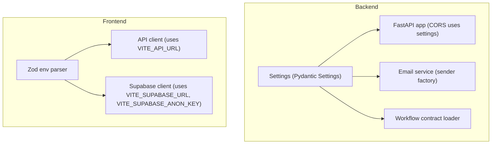
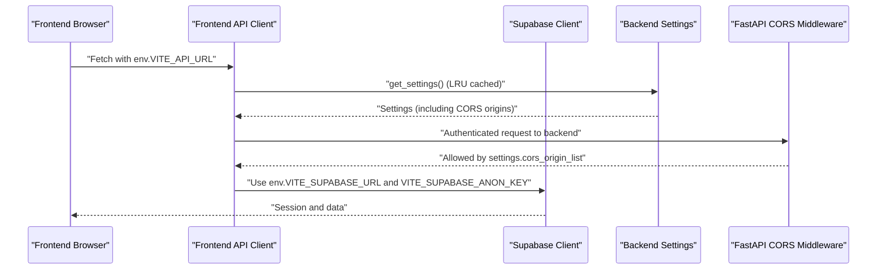
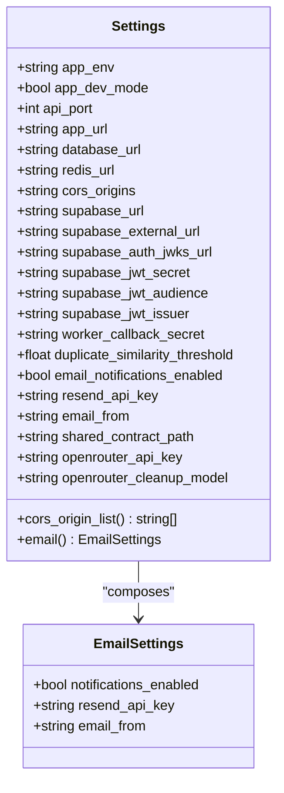
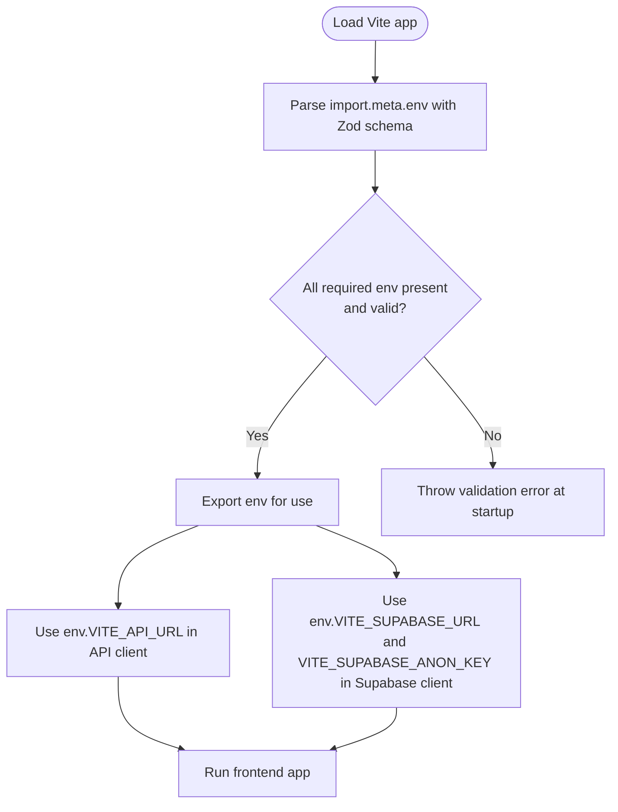
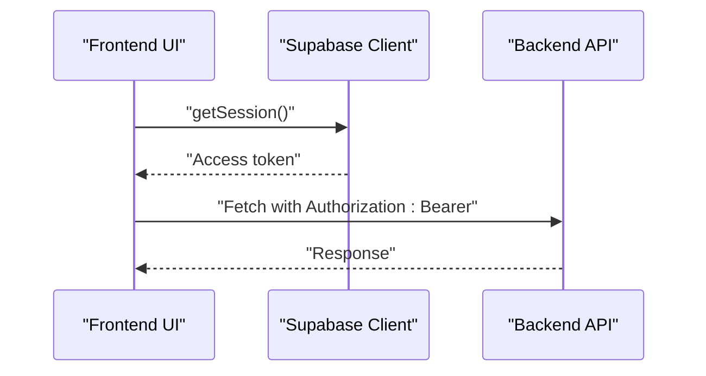
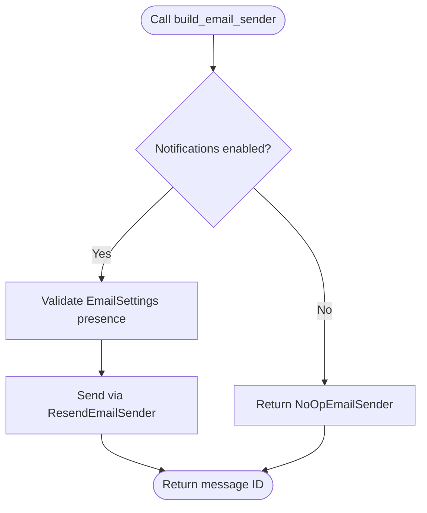
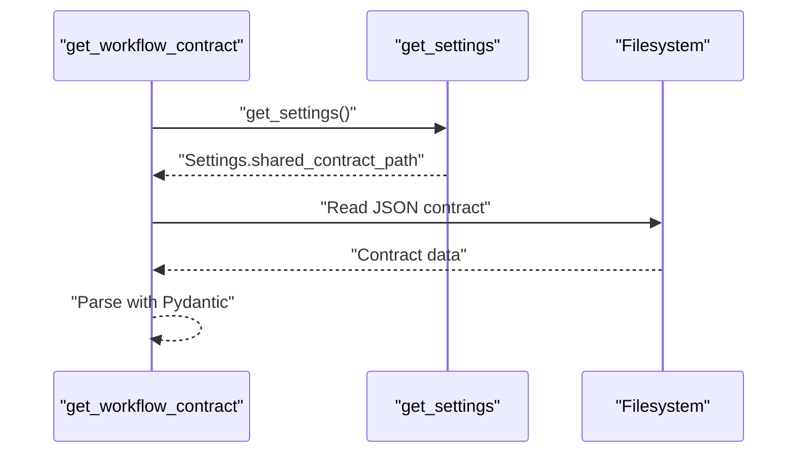
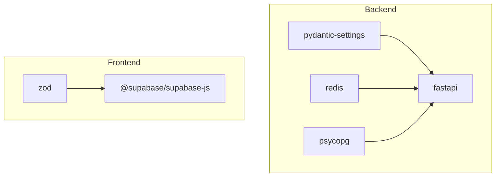

# Environment Configuration

<cite>
**Referenced Files in This Document**
- [backend/app/core/config.py](file://backend/app/core/config.py)
- [backend/app/main.py](file://backend/app/main.py)
- [backend/app/services/email.py](file://backend/app/services/email.py)
- [backend/app/core/workflow_contract.py](file://backend/app/core/workflow_contract.py)
- [backend/tests/test_config.py](file://backend/tests/test_config.py)
- [backend/pyproject.toml](file://backend/pyproject.toml)
- [frontend/src/lib/env.ts](file://frontend/src/lib/env.ts)
- [frontend/src/lib/api.ts](file://frontend/src/lib/api.ts)
- [frontend/src/lib/supabase.ts](file://frontend/src/lib/supabase.ts)
- [frontend/package.json](file://frontend/package.json)
- [frontend/vite.config.ts](file://frontend/vite.config.ts)
- [docs/task-output/2026-04-07-env-contract-simplification.md](file://docs/task-output/2026-04-07-env-contract-simplification.md)
- [Makefile](file://Makefile)
</cite>

## Table of Contents
1. [Introduction](#introduction)
2. [Project Structure](#project-structure)
3. [Core Components](#core-components)
4. [Architecture Overview](#architecture-overview)
5. [Detailed Component Analysis](#detailed-component-analysis)
6. [Dependency Analysis](#dependency-analysis)
7. [Performance Considerations](#performance-considerations)
8. [Troubleshooting Guide](#troubleshooting-guide)
9. [Conclusion](#conclusion)
10. [Appendices](#appendices)

## Introduction
This document explains the multi-layered environment configuration system used across the backend and frontend. It covers Pydantic-based settings management, environment variable mapping, validation, and type safety. It documents the Settings class structure, including database connections, Redis queues, CORS origins, Supabase integration, email notifications, and AI model settings. It also details frontend environment configuration, including API endpoint configuration, feature flags, and development versus production settings. Practical examples, environment-specific overrides, and best practices are included, along with configuration loading order, caching, and runtime update considerations.

## Project Structure
The configuration system spans two primary layers:
- Backend: Centralized settings via Pydantic Settings with environment file loading and LRU caching.
- Frontend: Zod-based runtime environment validation injected by Vite at build time.

**Diagram sources**
- [backend/app/core/config.py:35-96](file://backend/app/core/config.py#L35-L96)
- [backend/app/main.py:10-22](file://backend/app/main.py#L10-L22)
- [backend/app/services/email.py:77-84](file://backend/app/services/email.py#L77-L84)
- [backend/app/core/workflow_contract.py:32-39](file://backend/app/core/workflow_contract.py#L32-L39)
- [frontend/src/lib/env.ts:3-14](file://frontend/src/lib/env.ts#L3-L14)
- [frontend/src/lib/api.ts:190-238](file://frontend/src/lib/api.ts#L190-L238)
- [frontend/src/lib/supabase.ts:15-25](file://frontend/src/lib/supabase.ts#L15-L25)

**Section sources**
- [backend/app/core/config.py:35-96](file://backend/app/core/config.py#L35-L96)
- [frontend/src/lib/env.ts:3-14](file://frontend/src/lib/env.ts#L3-L14)

## Core Components
This section documents the backend Settings class and frontend environment configuration, including defaults, aliases, and validation rules.

- Backend Settings (Pydantic Settings)
  - Environment file: .env
  - Encoding: utf-8
  - Extra fields: ignored
  - Caching: LRU cached singleton via get_settings()

- Backend EmailSettings (Pydantic BaseModel)
  - Conditional validation: when notifications are enabled, requires Resend API key and sender email
  - Validation raises errors if required fields are missing while notifications are enabled

- Frontend env (Zod schema)
  - Strict validation of environment variables at runtime
  - Provides defaults for development mode flags
  - Enforces URL formats and non-empty keys

Key configuration categories and representative fields:
- Application lifecycle and URLs
  - APP_ENV, APP_DEV_MODE, API_PORT, APP_URL
- Database and queue
  - DATABASE_URL, REDIS_URL
- CORS
  - CORS_ORIGINS (comma-separated list parsed into a list)
- Supabase
  - SUPABASE_URL, SUPABASE_EXTERNAL_URL, SUPABASE_AUTH_JWKS_URL, SUPABASE_JWT_SECRET, SUPABASE_JWT_AUDIENCE, SUPABASE_JWT_ISSUER
- Worker callback
  - WORKER_CALLBACK_SECRET
- Duplicate detection
  - DUPLICATE_SIMILARITY_THRESHOLD
- Email notifications
  - EMAIL_NOTIFICATIONS_ENABLED, RESEND_API_KEY, EMAIL_FROM
- Shared resources
  - SHARED_CONTRACT_PATH
- AI model settings
  - OPENROUTER_API_KEY, OPENROUTER_CLEANUP_MODEL

Validation highlights:
- Email notifications require Resend credentials when enabled.
- CORS origins are split and stripped into a list for middleware configuration.
- Frontend environment variables are validated at runtime; invalid values cause immediate failures.

**Section sources**
- [backend/app/core/config.py:35-96](file://backend/app/core/config.py#L35-L96)
- [backend/app/core/config.py:10-33](file://backend/app/core/config.py#L10-L33)
- [frontend/src/lib/env.ts:3-14](file://frontend/src/lib/env.ts#L3-L14)
- [backend/tests/test_config.py:9-46](file://backend/tests/test_config.py#L9-L46)

## Architecture Overview
The configuration architecture integrates backend and frontend concerns:
- Backend loads settings once and caches them. FastAPI reads CORS origins from settings.
- Frontend validates environment variables and injects them into API and Supabase clients.
- Email service builds a sender based on backend settings; when notifications are disabled, it becomes a no-op.

**Diagram sources**
- [backend/app/main.py:10-22](file://backend/app/main.py#L10-L22)
- [backend/app/core/config.py:94-96](file://backend/app/core/config.py#L94-L96)
- [frontend/src/lib/api.ts:190-238](file://frontend/src/lib/api.ts#L190-L238)
- [frontend/src/lib/supabase.ts:15-25](file://frontend/src/lib/supabase.ts#L15-L25)

## Detailed Component Analysis

### Backend Settings and Email Validation
- Settings class encapsulates all backend configuration with Pydantic field aliases mapped to uppercase environment variables.
- EmailSettings enforces conditional validation: when notifications are enabled, both Resend API key and sender email must be present.
- get_settings() returns a cached instance to avoid repeated parsing and validation overhead.

**Diagram sources**
- [backend/app/core/config.py:35-96](file://backend/app/core/config.py#L35-L96)

**Section sources**
- [backend/app/core/config.py:35-96](file://backend/app/core/config.py#L35-L96)
- [backend/tests/test_config.py:9-46](file://backend/tests/test_config.py#L9-L46)

### Frontend Environment Validation and Usage
- Zod schema defines required and optional environment variables with defaults and transformations.
- The env object is parsed from import.meta.env and exported for use across the app.
- API client uses VITE_API_URL for all backend requests; Supabase client uses VITE_SUPABASE_URL and VITE_SUPABASE_ANON_KEY.

**Diagram sources**
- [frontend/src/lib/env.ts:3-14](file://frontend/src/lib/env.ts#L3-L14)
- [frontend/src/lib/api.ts:190-238](file://frontend/src/lib/api.ts#L190-L238)
- [frontend/src/lib/supabase.ts:15-25](file://frontend/src/lib/supabase.ts#L15-L25)

**Section sources**
- [frontend/src/lib/env.ts:3-14](file://frontend/src/lib/env.ts#L3-L14)
- [frontend/src/lib/api.ts:190-238](file://frontend/src/lib/api.ts#L190-L238)
- [frontend/src/lib/supabase.ts:15-25](file://frontend/src/lib/supabase.ts#L15-L25)

### Supabase Integration and Authentication
- Supabase client is created with URL and anonymous key from frontend environment.
- Authentication options enable session persistence and automatic token refresh.
- The API client obtains an access token from Supabase and attaches it to requests.

**Diagram sources**
- [frontend/src/lib/supabase.ts:15-25](file://frontend/src/lib/supabase.ts#L15-L25)
- [frontend/src/lib/api.ts:177-214](file://frontend/src/lib/api.ts#L177-L214)

**Section sources**
- [frontend/src/lib/supabase.ts:15-25](file://frontend/src/lib/supabase.ts#L15-L25)
- [frontend/src/lib/api.ts:177-214](file://frontend/src/lib/api.ts#L177-L214)

### Email Notification Sender Abstraction
- build_email_sender selects a sender based on Settings:
  - NoOpEmailSender when notifications are disabled
  - ResendEmailSender when notifications are enabled and credentials are present
- ResendEmailSender validates message content and posts to the Resend API with configured headers.

**Diagram sources**
- [backend/app/services/email.py:77-84](file://backend/app/services/email.py#L77-L84)
- [backend/app/services/email.py:43-74](file://backend/app/services/email.py#L43-L74)

**Section sources**
- [backend/app/services/email.py:77-84](file://backend/app/services/email.py#L77-L84)
- [backend/app/services/email.py:43-74](file://backend/app/services/email.py#L43-L74)

### Workflow Contract Loading
- The workflow contract is loaded from a shared path defined in Settings.
- get_workflow_contract caches the parsed contract for reuse.

**Diagram sources**
- [backend/app/core/workflow_contract.py:32-39](file://backend/app/core/workflow_contract.py#L32-L39)
- [backend/app/core/config.py:68-70](file://backend/app/core/config.py#L68-L70)

**Section sources**
- [backend/app/core/workflow_contract.py:32-39](file://backend/app/core/workflow_contract.py#L32-L39)
- [backend/app/core/config.py:68-70](file://backend/app/core/config.py#L68-L70)

## Dependency Analysis
- Backend dependencies include pydantic-settings for environment parsing and validation.
- Frontend depends on zod for runtime validation and @supabase/supabase-js for authentication and data access.
- The Makefile orchestrates Docker Compose with an environment file for orchestration-level configuration.

**Diagram sources**
- [backend/pyproject.toml:10-22](file://backend/pyproject.toml#L10-L22)
- [frontend/package.json:13-20](file://frontend/package.json#L13-L20)

**Section sources**
- [backend/pyproject.toml:10-22](file://backend/pyproject.toml#L10-L22)
- [frontend/package.json:13-20](file://frontend/package.json#L13-L20)

## Performance Considerations
- Settings are cached via LRU to avoid repeated parsing and validation overhead.
- Frontend environment validation occurs once at startup; invalid configurations fail fast.
- Email sender selection is conditional and avoids network calls when notifications are disabled.

[No sources needed since this section provides general guidance]

## Troubleshooting Guide
Common configuration issues and resolutions:
- Email notifications enabled but missing credentials
  - Symptom: Startup/validation error indicating missing Resend API key and sender email.
  - Resolution: Set EMAIL_NOTIFICATIONS_ENABLED=false or provide RESEND_API_KEY and EMAIL_FROM.
- Invalid frontend environment variables
  - Symptom: Runtime error during env parsing.
  - Resolution: Ensure VITE_SUPABASE_URL is a valid URL, VITE_SUPABASE_ANON_KEY is non-empty, and VITE_API_URL is a valid URL.
- CORS policy errors
  - Symptom: Requests blocked by CORS.
  - Resolution: Verify CORS_ORIGINS contains the frontend origin; the backend parses comma-separated origins into a list.
- Supabase authentication failures
  - Symptom: Missing or invalid session token.
  - Resolution: Confirm VITE_SUPABASE_URL and VITE_SUPABASE_ANON_KEY are correct and accessible.

**Section sources**
- [backend/tests/test_config.py:21-32](file://backend/tests/test_config.py#L21-L32)
- [frontend/src/lib/env.ts:3-14](file://frontend/src/lib/env.ts#L3-L14)
- [backend/app/main.py:15-22](file://backend/app/main.py#L15-L22)
- [frontend/src/lib/supabase.ts:15-25](file://frontend/src/lib/supabase.ts#L15-L25)

## Conclusion
The configuration system combines robust backend validation with strict frontend runtime checks. Pydantic ensures type-safe, validated settings with clear defaults and environment variable mapping. The frontend enforces environment correctness early, while the backend centralizes configuration and exposes it to FastAPI and services. Conditional features like email notifications are gated by explicit flags and validated to prevent misconfiguration.

[No sources needed since this section summarizes without analyzing specific files]

## Appendices

### Environment Variable Naming Conventions and Defaults
- Backend (uppercase, dot-ENV file):
  - APP_ENV: default "development"
  - APP_DEV_MODE: default false
  - API_PORT: default 8000
  - APP_URL: default "http://localhost:5173"
  - DATABASE_URL: default local Postgres
  - REDIS_URL: default local Redis
  - CORS_ORIGINS: default "http://localhost:5173"
  - SUPABASE_URL, SUPABASE_EXTERNAL_URL: defaults for local Supabase
  - SUPABASE_AUTH_JWKS_URL: default local JWKS URL
  - SUPABASE_JWT_SECRET, SUPABASE_JWT_ISSUER: optional
  - SUPABASE_JWT_AUDIENCE: default "authenticated"
  - WORKER_CALLBACK_SECRET: optional
  - DUPLICATE_SIMILARITY_THRESHOLD: default 85.0
  - EMAIL_NOTIFICATIONS_ENABLED: default false
  - RESEND_API_KEY: optional
  - EMAIL_FROM: optional
  - SHARED_CONTRACT_PATH: default "/workspace/shared/workflow-contract.json"
  - OPENROUTER_API_KEY: optional
  - OPENROUTER_CLEANUP_MODEL: default "openai/gpt-4o-mini"

- Frontend (VITE_ prefixed):
  - VITE_APP_ENV: default "development"
  - VITE_APP_DEV_MODE: default false (transformed from string)
  - VITE_SUPABASE_URL: required URL
  - VITE_SUPABASE_ANON_KEY: required non-empty string
  - VITE_API_URL: required URL

**Section sources**
- [backend/app/core/config.py:35-96](file://backend/app/core/config.py#L35-L96)
- [frontend/src/lib/env.ts:3-14](file://frontend/src/lib/env.ts#L3-L14)

### Configuration Loading Order and Overrides
- Backend:
  - Load .env with UTF-8 encoding
  - Parse with Pydantic Settings
  - Cache via LRU
  - Access via get_settings() across modules
- Frontend:
  - Vite injects import.meta.env at build time
  - Zod schema validates and normalizes values
  - Access via env exported from env.ts
- Orchestration:
  - Makefile uses docker compose with an environment file for service-level overrides

**Section sources**
- [backend/app/core/config.py:35-36](file://backend/app/core/config.py#L35-L36)
- [backend/app/core/config.py:94-96](file://backend/app/core/config.py#L94-L96)
- [frontend/src/lib/env.ts:14](file://frontend/src/lib/env.ts#L14)
- [Makefile:1-29](file://Makefile#L1-L29)

### Practical Examples and Best Practices
- Enable email notifications locally:
  - Set EMAIL_NOTIFICATIONS_ENABLED=true
  - Provide RESEND_API_KEY and EMAIL_FROM
- Disable email notifications:
  - Set EMAIL_NOTIFICATIONS_ENABLED=false (credentials optional)
- Configure CORS for multiple origins:
  - Set CORS_ORIGINS to a comma-separated list of origins
- Frontend development vs production:
  - VITE_APP_DEV_MODE controls UI messaging and behavior
  - VITE_API_URL should point to the backend under development or hosted deployment
- Feature flags:
  - APP_ENV and APP_DEV_MODE can be used to gate feature toggles in code
- Environment-specific overrides:
  - Use .env for local development
  - Use docker compose environment files for orchestrated environments
- Runtime updates:
  - Backend Settings are cached; restart the backend to reload changed environment variables
  - Frontend requires rebuild/reload to reflect environment changes

**Section sources**
- [docs/task-output/2026-04-07-env-contract-simplification.md:14-24](file://docs/task-output/2026-04-07-env-contract-simplification.md#L14-L24)
- [frontend/src/lib/env.ts:3-14](file://frontend/src/lib/env.ts#L3-L14)
- [backend/app/core/config.py:94-96](file://backend/app/core/config.py#L94-L96)