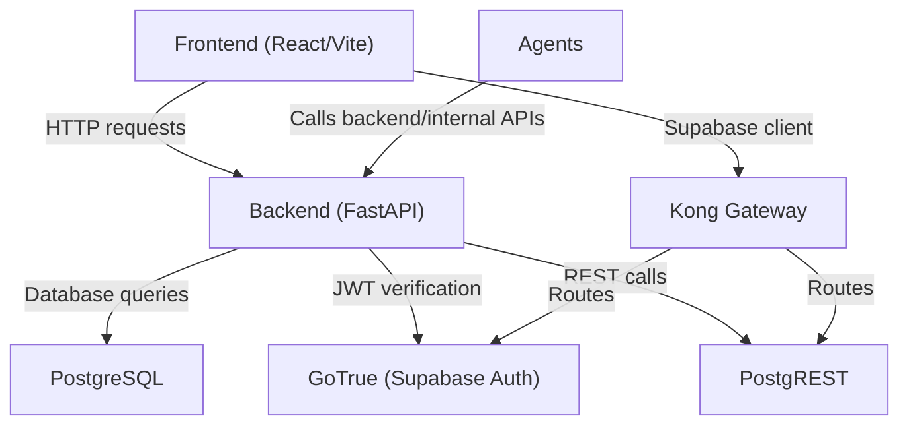
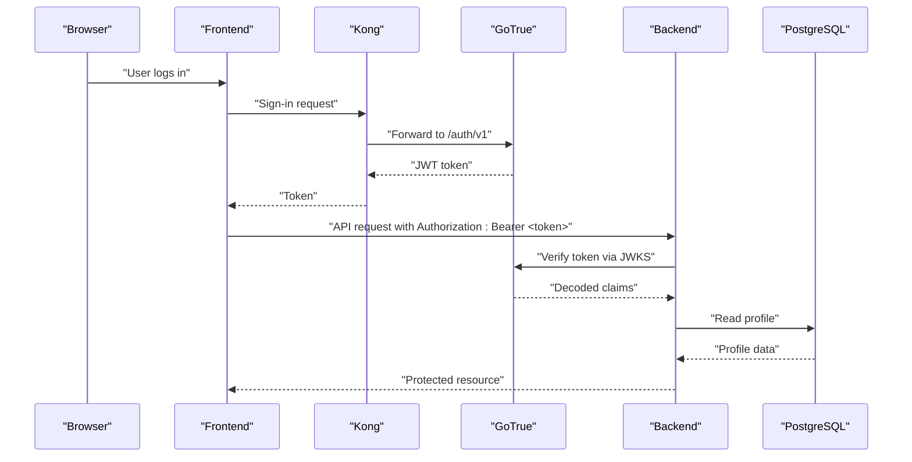
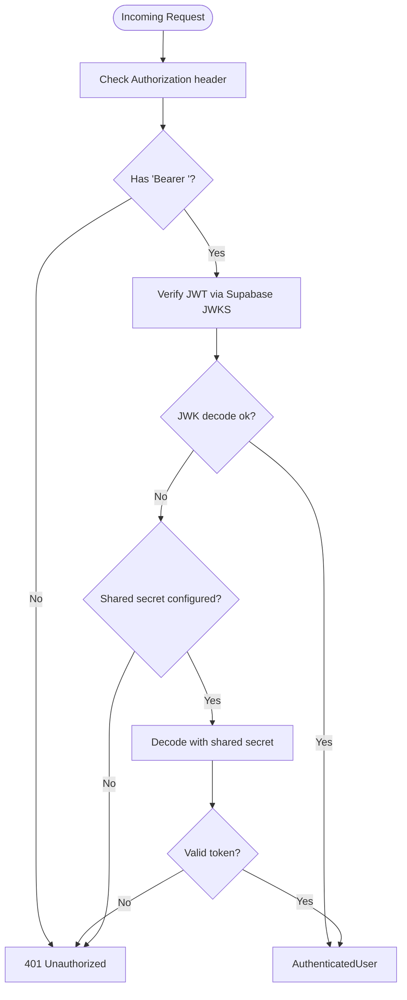
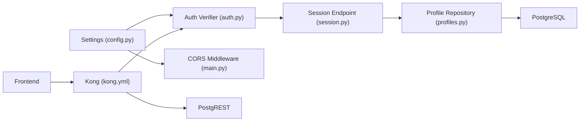

# Security Configuration

<cite>
**Referenced Files in This Document**
- [config.py](file://backend/app/core/config.py)
- [security.py](file://backend/app/core/security.py)
- [auth.py](file://backend/app/core/auth.py)
- [main.py](file://backend/app/main.py)
- [profiles.py](file://backend/app/db/profiles.py)
- [session.py](file://backend/app/api/session.py)
- [docker-compose.yml](file://docker-compose.yml)
- [kong.yml](file://supabase/kong/kong.yml)
- [supabase.ts](file://frontend/src/lib/supabase.ts)
- [AGENTS.md](file://frontend/AGENTS.md)
- [pyproject.toml (backend)](file://backend/pyproject.toml)
- [pyproject.toml (agents)](file://agents/pyproject.toml)
- [test_auth.py](file://backend/tests/test_auth.py)
</cite>

## Table of Contents
1. [Introduction](#introduction)
2. [Project Structure](#project-structure)
3. [Core Components](#core-components)
4. [Architecture Overview](#architecture-overview)
5. [Detailed Component Analysis](#detailed-component-analysis)
6. [Dependency Analysis](#dependency-analysis)
7. [Performance Considerations](#performance-considerations)
8. [Troubleshooting Guide](#troubleshooting-guide)
9. [Conclusion](#conclusion)
10. [Appendices](#appendices)

## Introduction
This document provides comprehensive security configuration documentation for the multi-component system. It covers CORS policy configuration, CSRF protection mechanisms, API security measures, input validation strategies, JWT security configuration, database security, AI agent security, and operational best practices for development and production environments. It also addresses common security threats and mitigation strategies specific to the application architecture.

## Project Structure
The system comprises:
- Backend (FastAPI): Authentication, CORS, JWT verification, database access, and API endpoints.
- Frontend (React/Vite): Supabase client configuration and security rules.
- Supabase stack (Kong, GoTrue, PostgREST): Identity, access control, and reverse proxy.
- Agents: AI generation pipeline with external API integrations.
- Shared configuration and orchestration via Docker Compose.

**Diagram sources**
- [docker-compose.yml:1-191](file://docker-compose.yml#L1-L191)
- [main.py:14-36](file://backend/app/main.py#L14-L36)
- [kong.yml:1-96](file://supabase/kong/kong.yml#L1-L96)

**Section sources**
- [docker-compose.yml:1-191](file://docker-compose.yml#L1-L191)
- [main.py:14-36](file://backend/app/main.py#L14-L36)

## Core Components
- CORS configuration is centrally defined in the backend and enforced at runtime.
- JWT verification is performed against Supabase’s JWKS endpoint with a fallback to a shared secret.
- Extension token authentication uses hashed tokens stored in the database.
- Supabase Kong gateway enforces CORS, API key authentication, ACLs, and request transformation.

Key security configuration locations:
- Backend CORS and middleware initialization.
- Settings for Supabase URLs, JWKS, JWT audience/issuer, and secrets.
- Kong declarative config for CORS, key-auth, ACL, and request transformer.

**Section sources**
- [main.py:14-22](file://backend/app/main.py#L14-L22)
- [config.py:35-96](file://backend/app/core/config.py#L35-L96)
- [kong.yml:49-95](file://supabase/kong/kong.yml#L49-L95)

## Architecture Overview
The authentication and authorization flow leverages Supabase’s identity stack behind Kong. The backend validates JWTs using Supabase’s JWKS and falls back to a shared secret when necessary. The frontend interacts with Supabase via Kong and stores sessions securely.

**Diagram sources**
- [kong.yml:49-95](file://supabase/kong/kong.yml#L49-L95)
- [auth.py:22-69](file://backend/app/core/auth.py#L22-L69)
- [session.py:27-44](file://backend/app/api/session.py#L27-L44)
- [profiles.py:47-68](file://backend/app/db/profiles.py#L47-L68)

## Detailed Component Analysis

### CORS Policy Configuration
- Origins: Configurable via environment variable and parsed into a list for FastAPI’s CORSMiddleware.
- Regex support: Allows Chrome extension origins.
- Credentials: Enabled.
- Methods and headers: Permissive (“*”) for development; adjust for production.

Operational notes:
- Ensure APP_URL and CORS_ORIGINS are aligned with frontend deployment domains.
- In production, restrict origins to known domains and limit exposed headers/methods.

**Section sources**
- [config.py:47-92](file://backend/app/core/config.py#L47-L92)
- [main.py:15-22](file://backend/app/main.py#L15-L22)

### CSRF Protection Mechanisms
- Supabase Kong enforces CORS and request transformation, ensuring proper origin validation.
- API endpoints rely on Authorization headers and JWT verification rather than cookie-based sessions.
- Frontend configuration avoids storing sensitive tokens in persistent storage.

Mitigations:
- Enforce strict SameSite cookies and secure flags for any cookie-based flows.
- Prefer token-based authentication with Authorization headers.
- Validate Origin and Referrer headers at the gateway and application layers.

**Section sources**
- [kong.yml:26-71](file://supabase/kong/kong.yml#L26-L71)
- [supabase.ts:4-11](file://frontend/src/lib/supabase.ts#L4-L11)
- [AGENTS.md:38-42](file://frontend/AGENTS.md#L38-L42)

### API Security Measures
- JWT verification: Backend verifies tokens against Supabase’s JWKS with fallback to a shared secret.
- Worker callback protection: Internal callbacks require a shared secret header.
- Extension token authentication: Uses hashed tokens stored in the database with usage tracking.

**Diagram sources**
- [auth.py:27-60](file://backend/app/core/auth.py#L27-L60)
- [test_auth.py:29-66](file://backend/tests/test_auth.py#L29-L66)

**Section sources**
- [auth.py:22-69](file://backend/app/core/auth.py#L22-L69)
- [security.py:13-22](file://backend/app/core/security.py#L13-L22)
- [security.py:34-53](file://backend/app/core/security.py#L34-L53)

### Input Validation Strategies
- Pydantic models define request/response schemas for API endpoints.
- Header parsing and validation occur at the FastAPI dependency level.
- Database queries use parameterized statements to prevent SQL injection.

Recommendations:
- Apply schema validation at the edges (request parsing).
- Sanitize and normalize inputs before persistence.
- Use least-privilege database roles and schema-level permissions.

**Section sources**
- [session.py:15-25](file://backend/app/api/session.py#L15-L25)
- [profiles.py:47-68](file://backend/app/db/profiles.py#L47-L68)

### JWT Security Configuration
- Algorithms supported: RS256, ES256, HS256.
- Audience and issuer validation: Controlled by settings; issuer verification is conditional.
- Fallback mechanism: If JWKS retrieval fails, tokens can be verified using a shared secret.
- Token lifecycle: Supabase sets JWT expiration; backend validates per settings.

Operational guidance:
- Configure SUPABASE_JWT_ISSUER and SUPABASE_JWT_AUDIENCE appropriately.
- Rotate SUPABASE_JWT_SECRET regularly and keep it secret.
- Monitor token expiration and refresh flows.

**Section sources**
- [auth.py:40-60](file://backend/app/core/auth.py#L40-L60)
- [config.py:56-58](file://backend/app/core/config.py#L56-L58)
- [docker-compose.yml:120-136](file://docker-compose.yml#L120-L136)

### Database Security
- Connection management: Uses psycopg with context-managed connections and dict_row factory.
- Parameterized queries: All database interactions use parameterized statements.
- Access controls: Supabase PostgREST manages roles and JWT-based access; schema-level permissions enforced.

Recommendations:
- Use dedicated database users per service.
- Enable TLS for database connections in production.
- Restrict network exposure of the database and Redis instances.

**Section sources**
- [profiles.py:42-45](file://backend/app/db/profiles.py#L42-L45)
- [profiles.py:64-68](file://backend/app/db/profiles.py#L64-L68)
- [docker-compose.yml:80-100](file://docker-compose.yml#L80-L100)

### AI Agent Security
- API key management: OpenRouter API key and base URL are configurable via environment variables.
- Communication: Agents communicate with backend and external LLM providers over HTTPS.
- Rate limiting: Not implemented in the provided code; consider adding at the gateway or application layer.

Recommendations:
- Store API keys in a secrets manager; avoid embedding in code.
- Enforce quotas and circuit breakers for external API calls.
- Log and monitor agent activity for anomalies.

**Section sources**
- [docker-compose.yml:58-71](file://docker-compose.yml#L58-L71)
- [pyproject.toml (agents):10-16](file://agents/pyproject.toml#L10-L16)

### Frontend Security
- Supabase client configuration: Uses sessionStorage for auth persistence; disables URL session detection.
- Security rules: Avoid localStorage for tokens; treat fetched data as private; fail safely on auth errors.

Recommendations:
- Enforce Content Security Policy (CSP) headers.
- Use HTTPS-only and secure cookies for any server-side sessions.
- Implement strict referrer policies.

**Section sources**
- [supabase.ts:4-11](file://frontend/src/lib/supabase.ts#L4-L11)
- [AGENTS.md:38-42](file://frontend/AGENTS.md#L38-L42)

## Dependency Analysis
The backend depends on Supabase for identity and JWT verification, and on PostgreSQL for persistence. Kong mediates traffic and applies security plugins.

**Diagram sources**
- [config.py:35-96](file://backend/app/core/config.py#L35-L96)
- [auth.py:22-69](file://backend/app/core/auth.py#L22-L69)
- [main.py:15-22](file://backend/app/main.py#L15-L22)
- [session.py:27-44](file://backend/app/api/session.py#L27-L44)
- [profiles.py:38-46](file://backend/app/db/profiles.py#L38-L46)
- [kong.yml:49-95](file://supabase/kong/kong.yml#L49-L95)

**Section sources**
- [pyproject.toml (backend):10-23](file://backend/pyproject.toml#L10-L23)
- [pyproject.toml (agents):10-16](file://agents/pyproject.toml#L10-L16)

## Performance Considerations
- JWT verification: Caching of the auth verifier reduces overhead.
- Database connections: Context-managed connections minimize leaks.
- CORS: Permissive defaults simplify development but should be tightened in production.

[No sources needed since this section provides general guidance]

## Troubleshooting Guide
Common issues and resolutions:
- 401 Unauthorized on JWT:
  - Verify SUPABASE_AUTH_JWKS_URL and SUPABASE_JWT_SECRET configuration.
  - Confirm issuer/audience settings and that the token is unexpired.
- CORS failures:
  - Ensure APP_URL and CORS_ORIGINS include the frontend origin.
  - Check Kong CORS plugin activation for relevant routes.
- Extension token invalid:
  - Confirm the token is hashed and stored in the profiles table.
  - Verify the token is not expired and that the profile has a matching hash.

**Section sources**
- [auth.py:50-60](file://backend/app/core/auth.py#L50-L60)
- [test_auth.py:29-66](file://backend/tests/test_auth.py#L29-L66)
- [security.py:34-53](file://backend/app/core/security.py#L34-L53)

## Conclusion
The system employs a layered security approach: Supabase identity and Kong gateway for access control, JWT verification with a fallback, hashed extension tokens, and secure database interactions. Production hardening requires tightening CORS, enforcing strict CSRF protections, securing secrets, and implementing rate limiting and monitoring.

[No sources needed since this section summarizes without analyzing specific files]

## Appendices

### Environment Variables and Secrets
- Backend:
  - APP_ENV, APP_DEV_MODE, API_PORT, APP_URL, DATABASE_URL, REDIS_URL, CORS_ORIGINS
  - SUPABASE_URL, SUPABASE_EXTERNAL_URL, SUPABASE_AUTH_JWKS_URL, SUPABASE_JWT_SECRET
  - SUPABASE_JWT_AUDIENCE, SUPABASE_JWT_ISSUER, WORKER_CALLBACK_SECRET
- Supabase:
  - ANON_KEY, SERVICE_ROLE_KEY, JWT_SECRET, POSTGRES_PASSWORD
- Agents:
  - OPENROUTER_API_KEY, OPENROUTER_BASE_URL, model selection variables

**Section sources**
- [docker-compose.yml:26-71](file://docker-compose.yml#L26-L71)
- [config.py:35-96](file://backend/app/core/config.py#L35-L96)