# Database Design

<cite>
**Referenced Files in This Document**
- [20260407_000001_phase_0_foundation.sql](file://supabase/migrations/20260407_000001_phase_0_foundation.sql)
- [20260407_000002_phase_1a_blocked_recovery_extension.sql](file://supabase/migrations/20260407_000002_phase_1a_blocked_recovery_extension.sql)
- [20260407_000003_phase_1a_extracted_reference_id.sql](file://supabase/migrations/20260407_000003_phase_1a_extracted_reference_id.sql)
- [20260407_000004_phase_2_base_resumes.sql](file://supabase/migrations/20260407_000004_phase_2_base_resumes.sql)
- [20260407_000005_phase_3_generation.sql](file://supabase/migrations/20260407_000005_phase_3_generation.sql)
- [00-auth-schema.sql](file://supabase/initdb/00-auth-schema.sql)
- [run_migrations.sh](file://scripts/run_migrations.sh)
- [database_schema.md](file://docs/database_schema.md)
- [backend-database-migration-runbook.md](file://docs/backend-database-migration-runbook.md)
- [docker-compose.yml](file://docker-compose.yml)
- [seed_local_user.sh](file://scripts/seed_local_user.sh)
- [profiles.py](file://backend/app/db/profiles.py)
- [base_resumes.py](file://backend/app/db/base_resumes.py)
- [applications.py](file://backend/app/db/applications.py)
- [resume_drafts.py](file://backend/app/db/resume_drafts.py)
- [notifications.py](file://backend/app/db/notifications.py)
</cite>

## Table of Contents
1. [Introduction](#introduction)
2. [Project Structure](#project-structure)
3. [Core Components](#core-components)
4. [Architecture Overview](#architecture-overview)
5. [Detailed Component Analysis](#detailed-component-analysis)
6. [Dependency Analysis](#dependency-analysis)
7. [Performance Considerations](#performance-considerations)
8. [Troubleshooting Guide](#troubleshooting-guide)
9. [Conclusion](#conclusion)
10. [Appendices](#appendices)

## Introduction
This document describes the PostgreSQL database design integrated with Supabase for the AI Resume Builder application. It covers the schema, relationships, constraints, migration system, Supabase integration (authentication, authorization, roles, policies), indexing and performance strategies, initialization and seeding, and operational practices for data lifecycle, backups, and disaster recovery. It also provides examples of common queries and data access patterns aligned with the application’s models.

## Project Structure
The database layer is composed of:
- Supabase-managed Postgres with Supabase Auth and PostgREST
- Versioned migrations under supabase/migrations
- Initialization script for the auth schema
- Backend repositories that encapsulate SQL access patterns
- Orchestration via docker-compose and a migration runner

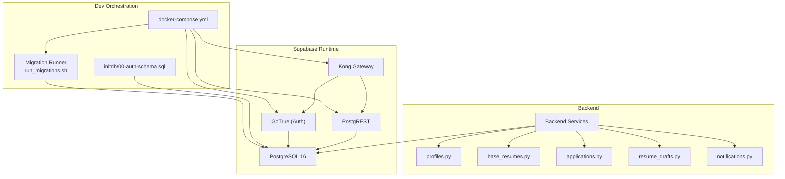

**Diagram sources**
- [docker-compose.yml:1-191](file://docker-compose.yml#L1-L191)
- [run_migrations.sh:1-39](file://scripts/run_migrations.sh#L1-L39)
- [00-auth-schema.sql:1-2](file://supabase/initdb/00-auth-schema.sql#L1-L2)

**Section sources**
- [docker-compose.yml:1-191](file://docker-compose.yml#L1-L191)
- [run_migrations.sh:1-39](file://scripts/run_migrations.sh#L1-L39)
- [00-auth-schema.sql:1-2](file://supabase/initdb/00-auth-schema.sql#L1-L2)

## Core Components
- Application tables
  - profiles: Application-owned extension of auth.users with preferences and optional extension token fields
  - base_resumes: User-owned Markdown source resumes
  - applications: Job application records with workflow states, duplicate signals, and origin normalization
  - resume_drafts: Single current Markdown draft per application with generation metadata
  - notifications: In-app notifications scoped to users and optionally to applications
- Enums and JSONB contracts are defined in the schema and documented in the schema doc
- Row Level Security (RLS) policies ensure per-user isolation
- Triggers maintain updated_at timestamps
- Indexes optimize common queries (lists, filters, search, notifications)

**Section sources**
- [20260407_000001_phase_0_foundation.sql:86-300](file://supabase/migrations/20260407_000001_phase_0_foundation.sql#L86-L300)
- [database_schema.md:46-230](file://docs/database_schema.md#L46-L230)

## Architecture Overview
The Supabase stack integrates:
- Postgres for persistence
- GoTrue for authentication and JWT issuance
- PostgREST for RESTful API over database views/functions
- Kong as the API gateway and router

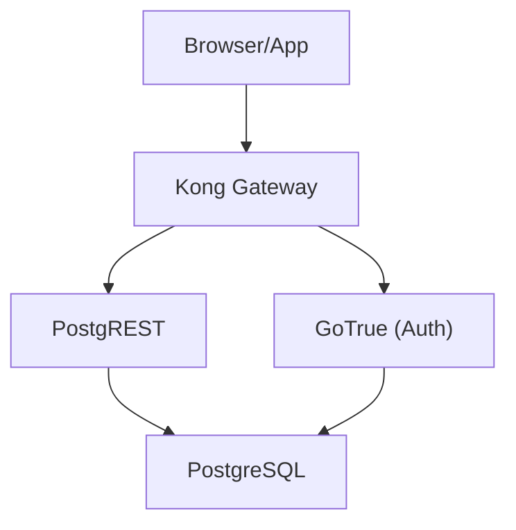

**Diagram sources**
- [docker-compose.yml:115-186](file://docker-compose.yml#L115-L186)

**Section sources**
- [docker-compose.yml:115-186](file://docker-compose.yml#L115-L186)

## Detailed Component Analysis

### Profiles
- Purpose: Extend auth.users with application-specific fields (preferences, contact info, default resume pointer, optional extension token fields)
- Ownership: One-to-one with auth.users via PK/FK
- RLS: Self-service read/update only for the authenticated user
- Indexes: Unique email, optional unique partial index on extension token hash
- Triggers: updated_at managed automatically

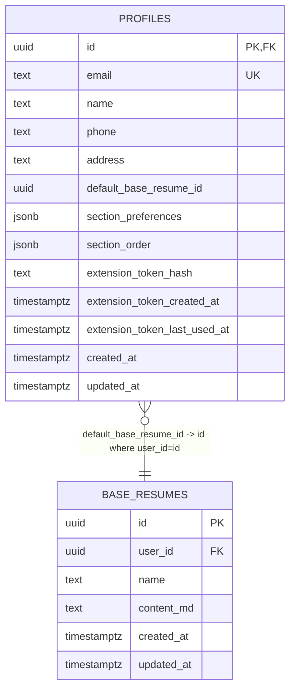

**Diagram sources**
- [20260407_000001_phase_0_foundation.sql:86-118](file://supabase/migrations/20260407_000001_phase_0_foundation.sql#L86-L118)

**Section sources**
- [20260407_000001_phase_0_foundation.sql:86-118](file://supabase/migrations/20260407_000001_phase_0_foundation.sql#L86-L118)
- [database_schema.md:48-83](file://docs/database_schema.md#L48-L83)

### Base Resumes
- Purpose: Store user-owned Markdown source resumes
- Ownership: Scoped by user_id
- Constraints: Non-empty name/content; composite unique with user_id
- RLS: Owner-only operations
- Indexes: List by updated_at desc, name lookup, standalone user_id index added in phase 2

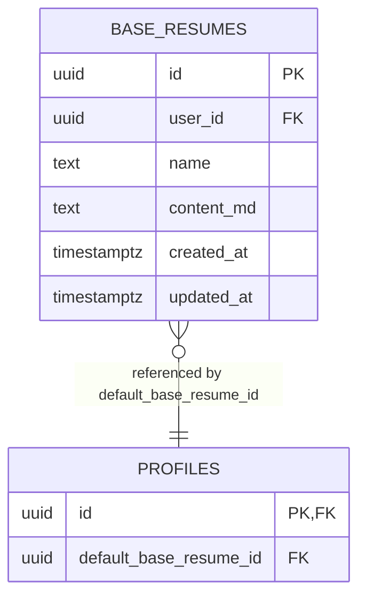

**Diagram sources**
- [20260407_000001_phase_0_foundation.sql:99-109](file://supabase/migrations/20260407_000001_phase_0_foundation.sql#L99-L109)
- [20260407_000001_phase_0_foundation.sql:111-118](file://supabase/migrations/20260407_000001_phase_0_foundation.sql#L111-L118)

**Section sources**
- [20260407_000001_phase_0_foundation.sql:99-118](file://supabase/migrations/20260407_000001_phase_0_foundation.sql#L99-L118)
- [20260407_000004_phase_2_base_resumes.sql:14-76](file://supabase/migrations/20260407_000004_phase_2_base_resumes.sql#L14-L76)
- [database_schema.md:84-113](file://docs/database_schema.md#L84-L113)

### Applications
- Purpose: Track job applications, workflow state, duplicate signals, origin normalization, and failure details
- Ownership: Scoped by user_id
- Constraints: Non-empty job_url; bounds for duplicate similarity; conditional validations for origin ‘other’
- RLS: Owner-only operations
- Indexes: Lists by updated_at desc, status-filtered lists, search GIN trigram, unresolved duplicate attention, extracted reference ID lookup

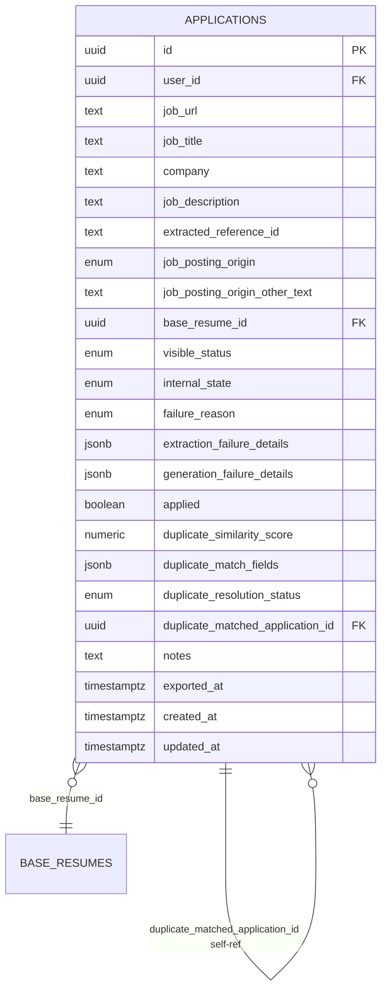

**Diagram sources**
- [20260407_000001_phase_0_foundation.sql:120-174](file://supabase/migrations/20260407_000001_phase_0_foundation.sql#L120-L174)
- [20260407_000003_phase_1a_extracted_reference_id.sql:3-8](file://supabase/migrations/20260407_000003_phase_1a_extracted_reference_id.sql#L3-L8)

**Section sources**
- [20260407_000001_phase_0_foundation.sql:120-174](file://supabase/migrations/20260407_000001_phase_0_foundation.sql#L120-L174)
- [20260407_000002_phase_1a_blocked_recovery_extension.sql:12-13](file://supabase/migrations/20260407_000002_phase_1a_blocked_recovery_extension.sql#L12-L13)
- [20260407_000005_phase_3_generation.sql:7-8](file://supabase/migrations/20260407_000005_phase_3_generation.sql#L7-L8)
- [database_schema.md:114-168](file://docs/database_schema.md#L114-L168)

### Resume Drafts
- Purpose: Store the single current Markdown draft per application with generation parameters and sections snapshot
- Ownership: Scoped by user_id; cascade delete with application
- Constraints: Non-empty content; unique per application
- RLS: Owner-only operations
- Indexes: Unique index on application_id

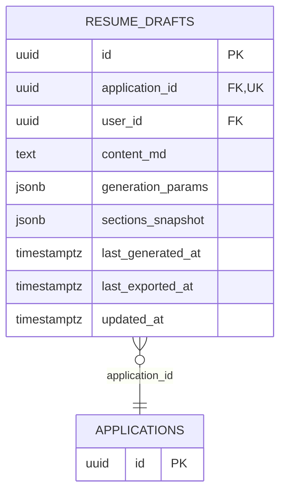

**Diagram sources**
- [20260407_000001_phase_0_foundation.sql:176-197](file://supabase/migrations/20260407_000001_phase_0_foundation.sql#L176-L197)

**Section sources**
- [20260407_000001_phase_0_foundation.sql:176-197](file://supabase/migrations/20260407_000001_phase_0_foundation.sql#L176-L197)
- [database_schema.md:169-200](file://docs/database_schema.md#L169-L200)

### Notifications
- Purpose: In-app notifications scoped to users and optionally to applications
- Ownership: Scoped by user_id
- Constraints: Non-empty message; optional application linkage
- RLS: Owner-only operations
- Indexes: Inbox queries by read and created_at; unread action-required attention

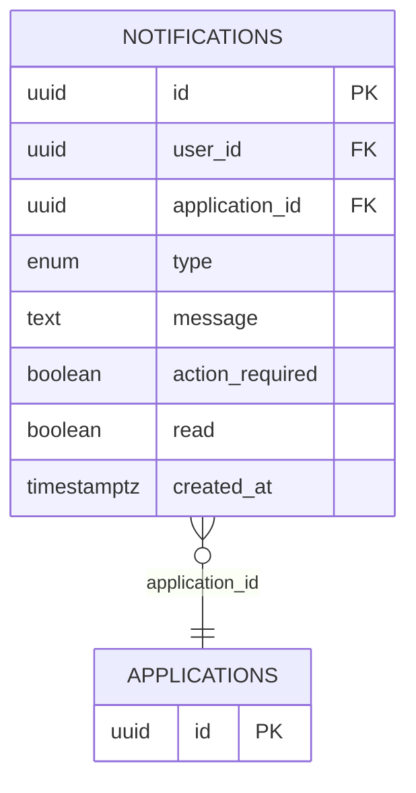

**Diagram sources**
- [20260407_000001_phase_0_foundation.sql:199-218](file://supabase/migrations/20260407_000001_phase_0_foundation.sql#L199-L218)

**Section sources**
- [20260407_000001_phase_0_foundation.sql:199-218](file://supabase/migrations/20260407_000001_phase_0_foundation.sql#L199-L218)
- [database_schema.md:201-230](file://docs/database_schema.md#L201-L230)

### Migration System
- Versioning: Migrations are named with a timestamp prefix and applied in order
- Metadata: app_meta.schema_migrations tracks applied versions
- Runner: Iterates through files, checks applied versions, applies SQL, and records completion
- Phases:
  - Phase 0: Foundation (tables, enums, triggers, RLS, indexes, auth profile sync)
  - Phase 1A: Blocked recovery and extension token fields
  - Phase 1A: Extracted reference ID for duplicate detection
  - Phase 2: Granular RLS policies and base_resumes user_id index
  - Phase 3: Generation failure details

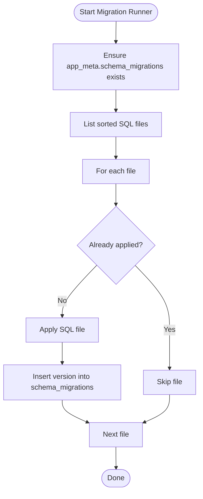

**Diagram sources**
- [run_migrations.sh:18-38](file://scripts/run_migrations.sh#L18-L38)

**Section sources**
- [run_migrations.sh:1-39](file://scripts/run_migrations.sh#L1-L39)
- [20260407_000001_phase_0_foundation.sql:1-343](file://supabase/migrations/20260407_000001_phase_0_foundation.sql#L1-L343)
- [20260407_000002_phase_1a_blocked_recovery_extension.sql:1-16](file://supabase/migrations/20260407_000002_phase_1a_blocked_recovery_extension.sql#L1-L16)
- [20260407_000003_phase_1a_extracted_reference_id.sql:1-11](file://supabase/migrations/20260407_000003_phase_1a_extracted_reference_id.sql#L1-L11)
- [20260407_000004_phase_2_base_resumes.sql:1-158](file://supabase/migrations/20260407_000004_phase_2_base_resumes.sql#L1-L158)
- [20260407_000005_phase_3_generation.sql:1-11](file://supabase/migrations/20260407_000005_phase_3_generation.sql#L1-L11)

### Supabase Integration
- Roles and Policies
  - Roles: anon, authenticated, service_role
  - Policies: per-table, per-operation policies enforcing ownership
- Authentication
  - Auth schema initialization
  - Service role JWT audience and admin roles configured
- Authorization
  - RLS enabled on all user-scoped tables
  - Policies restrict to auth.uid() = owner key
- Database Configuration
  - PostgREST configured with JWT secret and app settings
  - Kong configured with Supabase keys and plugins

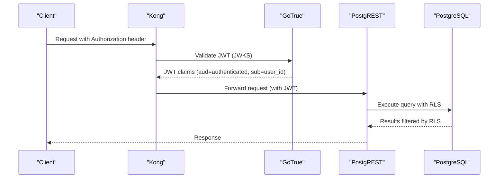

**Diagram sources**
- [docker-compose.yml:115-186](file://docker-compose.yml#L115-L186)

**Section sources**
- [20260407_000001_phase_0_foundation.sql:254-340](file://supabase/migrations/20260407_000001_phase_0_foundation.sql#L254-L340)
- [00-auth-schema.sql:1-2](file://supabase/initdb/00-auth-schema.sql#L1-L2)
- [docker-compose.yml:115-186](file://docker-compose.yml#L115-L186)

### Indexing Strategies and Performance
- Profiles: unique email; optional unique partial index on extension token hash
- Base Resumes: composite indexes for list/search; standalone user_id index
- Applications: list ordering, status filter, unresolved duplicates, GIN trigram search, extracted reference ID index
- Resume Drafts: unique index per application
- Notifications: inbox sort and unread/action-required attention index
- Triggers: set_updated_at on all tables

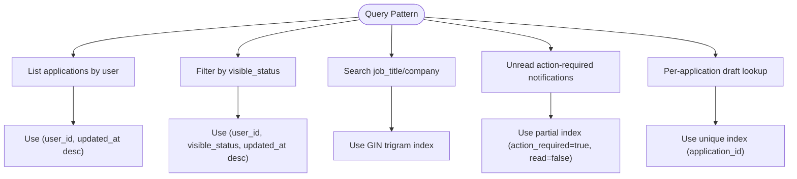

**Diagram sources**
- [20260407_000001_phase_0_foundation.sql:220-232](file://supabase/migrations/20260407_000001_phase_0_foundation.sql#L220-L232)
- [20260407_000004_phase_2_base_resumes.sql:155-155](file://supabase/migrations/20260407_000004_phase_2_base_resumes.sql#L155-L155)

**Section sources**
- [20260407_000001_phase_0_foundation.sql:220-232](file://supabase/migrations/20260407_000001_phase_0_foundation.sql#L220-L232)
- [20260407_000004_phase_2_base_resumes.sql:147-155](file://supabase/migrations/20260407_000004_phase_2_base_resumes.sql#L147-L155)
- [database_schema.md:248-265](file://docs/database_schema.md#L248-L265)

### Database Initialization and Access Control Setup
- Initialization
  - Auth schema created in initdb
  - Migrations applied by migration-runner container after DB and Auth are healthy
- Access control
  - Roles granted usage on schema and table/sequence privileges to authenticated/service_role
  - RLS enabled on all user-scoped tables
  - Per-operation policies for base_resumes and resume_drafts refined in phase 2

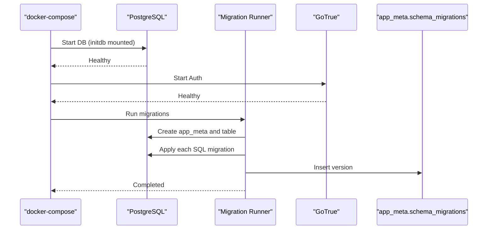

**Diagram sources**
- [docker-compose.yml:85-114](file://docker-compose.yml#L85-L114)
- [run_migrations.sh:18-38](file://scripts/run_migrations.sh#L18-L38)
- [00-auth-schema.sql:1-2](file://supabase/initdb/00-auth-schema.sql#L1-L2)

**Section sources**
- [docker-compose.yml:85-114](file://docker-compose.yml#L85-L114)
- [run_migrations.sh:18-38](file://scripts/run_migrations.sh#L18-L38)
- [00-auth-schema.sql:1-2](file://supabase/initdb/00-auth-schema.sql#L1-L2)

### Data Lifecycle Management, Backup, and Disaster Recovery
- Lifecycle
  - Additive-first migrations to preserve backward compatibility
  - Backfills in bounded batches when needed
  - Clear failure details on recoverable success
- Backup
  - Use Postgres native logical or physical backups
  - Schedule regular snapshots of supabase-db-data volume
- Disaster Recovery
  - Restore from latest backup to a new DB container
  - Re-run migrations via migration-runner
  - Recreate Kong/Auth/PostgREST if needed

[No sources needed since this section provides general guidance]

### Examples of Common Queries and Data Access Patterns
- Backend repositories encapsulate SQL and return Pydantic models
- Typical operations:
  - Fetch profile by user_id
  - Upsert extension token and rotate tokens
  - List base resumes by user_id ordered by updated_at desc
  - Create application and return hydrated record with base resume name and action-required flag
  - Upsert resume draft with ON CONFLICT handling
  - Create notification and clear action-required flags

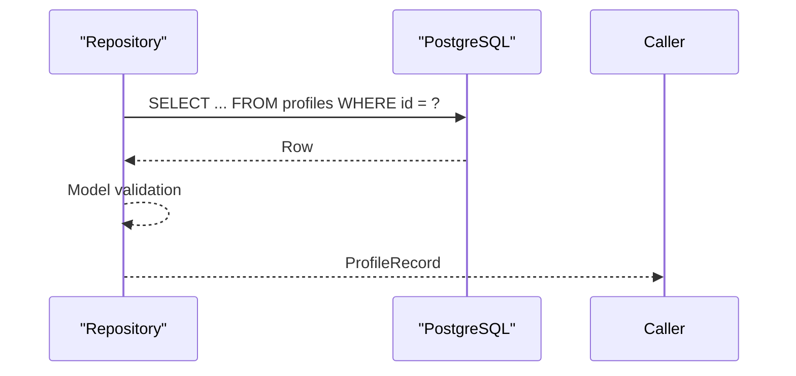

**Diagram sources**
- [profiles.py:47-68](file://backend/app/db/profiles.py#L47-L68)

**Section sources**
- [profiles.py:47-68](file://backend/app/db/profiles.py#L47-L68)
- [base_resumes.py:40-57](file://backend/app/db/base_resumes.py#L40-L57)
- [applications.py:132-160](file://backend/app/db/applications.py#L132-L160)
- [resume_drafts.py:62-118](file://backend/app/db/resume_drafts.py#L62-L118)
- [notifications.py:31-57](file://backend/app/db/notifications.py#L31-L57)

## Dependency Analysis
- Backend repositories depend on the database schema and RLS policies
- Supabase runtime (Auth, PostgREST, Kong) depends on database availability and proper configuration
- Migrations define schema contracts and must be applied before backend code that relies on new shapes

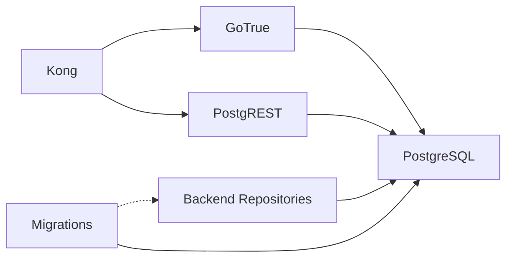

**Diagram sources**
- [docker-compose.yml:115-186](file://docker-compose.yml#L115-L186)

**Section sources**
- [docker-compose.yml:115-186](file://docker-compose.yml#L115-L186)

## Performance Considerations
- Prefer composite indexes that match common ORDER BY and WHERE clauses
- Use GIN trigram indexes for text search within user scope
- Keep JSONB shapes validated to avoid expensive parsing overhead
- Use ON CONFLICT WHERE for upserts that must respect ownership
- Maintain updated_at via triggers to support consistent list ordering

[No sources needed since this section provides general guidance]

## Troubleshooting Guide
- Migration issues
  - Verify app_meta.schema_migrations table exists and is populated
  - Check migration-runner logs for SQL errors
  - Ensure DB and Auth are healthy before running migrations
- Auth and RLS
  - Confirm JWT audience and service role configuration
  - Validate RLS policies are present and using auth.uid()
- Seed user
  - Use seed script with SERVICE_ROLE_KEY to create invited users
  - Ensure gateway health before attempting admin user creation

**Section sources**
- [run_migrations.sh:18-38](file://scripts/run_migrations.sh#L18-L38)
- [seed_local_user.sh:29-60](file://scripts/seed_local_user.sh#L29-L60)
- [docker-compose.yml:115-186](file://docker-compose.yml#L115-L186)

## Conclusion
The database design centers on strict per-user ownership with RLS, additive migrations, and pragmatic indexing to support dashboard and workflow operations. Supabase Auth and PostgREST provide secure, standards-based access, while the migration runner ensures deterministic schema evolution. The backend repositories translate application needs into efficient SQL, maintaining data integrity and performance.

[No sources needed since this section summarizes without analyzing specific files]

## Appendices

### Appendix A: Migration Runbook Highlights
- Define schema changes in the schema doc first
- Prefer additive changes; stage destructive changes carefully
- Add RLS, indexes, and constraints in the same migration
- Backfill in batches; keep readers defensive
- Verify auth, ownership, and status alignment post-deploy

**Section sources**
- [backend-database-migration-runbook.md:18-63](file://docs/backend-database-migration-runbook.md#L18-L63)

### Appendix B: Supabase Roles and Permissions Summary
- Roles: anon, authenticated, service_role
- Privileges: schema usage; table/sequence access for authenticated/service_role
- Policies: per-table, per-operation ownership enforcement

**Section sources**
- [20260407_000001_phase_0_foundation.sql:254-256](file://supabase/migrations/20260407_000001_phase_0_foundation.sql#L254-L256)
- [20260407_000001_phase_0_foundation.sql:302-340](file://supabase/migrations/20260407_000001_phase_0_foundation.sql#L302-L340)