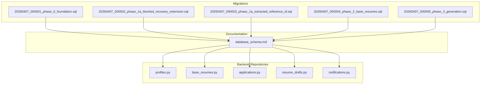
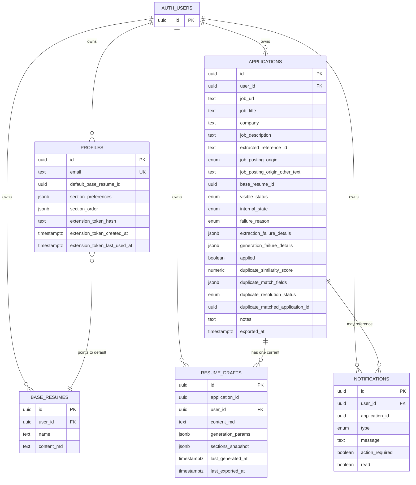
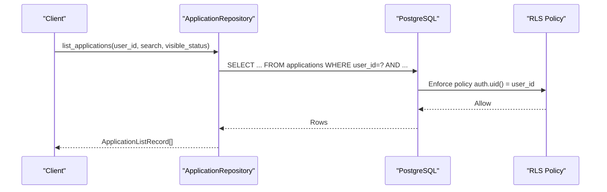
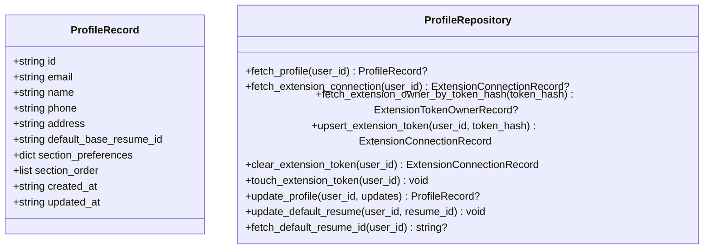
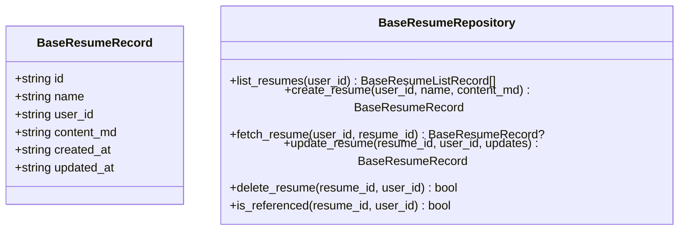
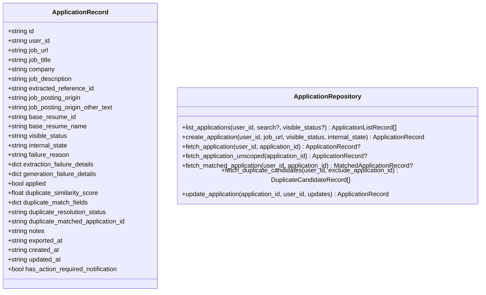
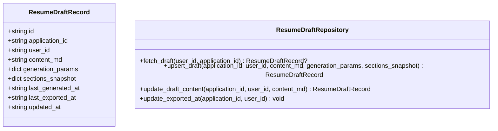
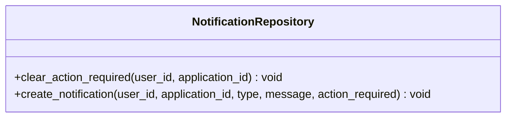
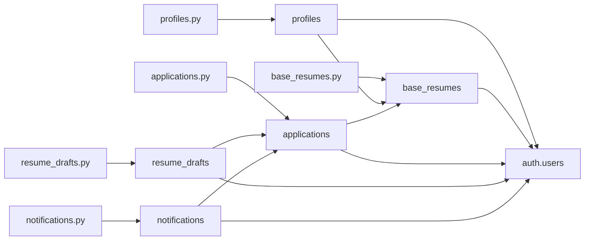

# Database Schema

<cite>
**Referenced Files in This Document**
- [20260407_000001_phase_0_foundation.sql](file://supabase/migrations/20260407_000001_phase_0_foundation.sql)
- [20260407_000002_phase_1a_blocked_recovery_extension.sql](file://supabase/migrations/20260407_000002_phase_1a_blocked_recovery_extension.sql)
- [20260407_000003_phase_1a_extracted_reference_id.sql](file://supabase/migrations/20260407_000003_phase_1a_extracted_reference_id.sql)
- [20260407_000004_phase_2_base_resumes.sql](file://supabase/migrations/20260407_000004_phase_2_base_resumes.sql)
- [20260407_000005_phase_3_generation.sql](file://supabase/migrations/20260407_000005_phase_3_generation.sql)
- [database_schema.md](file://docs/database_schema.md)
- [profiles.py](file://backend/app/db/profiles.py)
- [base_resumes.py](file://backend/app/db/base_resumes.py)
- [applications.py](file://backend/app/db/applications.py)
- [resume_drafts.py](file://backend/app/db/resume_drafts.py)
- [notifications.py](file://backend/app/db/notifications.py)
- [workflow-contract.json](file://shared/workflow-contract.json)
</cite>

## Table of Contents
1. [Introduction](#introduction)
2. [Project Structure](#project-structure)
3. [Core Components](#core-components)
4. [Architecture Overview](#architecture-overview)
5. [Detailed Component Analysis](#detailed-component-analysis)
6. [Dependency Analysis](#dependency-analysis)
7. [Performance Considerations](#performance-considerations)
8. [Troubleshooting Guide](#troubleshooting-guide)
9. [Conclusion](#conclusion)
10. [Appendices](#appendices)

## Introduction
This document provides comprehensive database schema documentation for the five core tables: profiles, base_resumes, applications, resume_drafts, and notifications. It covers column definitions, data types, constraints, relationships, canonical enums, and JSONB contract structures. It also explains the ownership model, delete semantics, cascade behaviors, and common data access patterns. Design rationales such as storing content as Markdown and maintaining a single current draft are documented alongside practical examples.

## Project Structure
The schema is defined and evolved through a series of migrations under the Supabase migrations directory. The authoritative specification and design principles are captured in the documentation file. Backend repositories demonstrate typical read/write patterns against these tables.

**Diagram sources**
- [20260407_000001_phase_0_foundation.sql:1-343](file://supabase/migrations/20260407_000001_phase_0_foundation.sql#L1-L343)
- [20260407_000002_phase_1a_blocked_recovery_extension.sql:1-16](file://supabase/migrations/20260407_000002_phase_1a_blocked_recovery_extension.sql#L1-L16)
- [20260407_000003_phase_1a_extracted_reference_id.sql:1-11](file://supabase/migrations/20260407_000003_phase_1a_extracted_reference_id.sql#L1-L11)
- [20260407_000004_phase_2_base_resumes.sql:1-158](file://supabase/migrations/20260407_000004_phase_2_base_resumes.sql#L1-L158)
- [20260407_000005_phase_3_generation.sql:1-11](file://supabase/migrations/20260407_000005_phase_3_generation.sql#L1-L11)
- [database_schema.md:1-289](file://docs/database_schema.md#L1-L289)
- [profiles.py:1-225](file://backend/app/db/profiles.py#L1-L225)
- [base_resumes.py:1-184](file://backend/app/db/base_resumes.py#L1-L184)
- [applications.py:1-328](file://backend/app/db/applications.py#L1-L328)
- [resume_drafts.py:1-173](file://backend/app/db/resume_drafts.py#L1-L173)
- [notifications.py:1-61](file://backend/app/db/notifications.py#L1-L61)

**Section sources**
- [20260407_000001_phase_0_foundation.sql:1-343](file://supabase/migrations/20260407_000001_phase_0_foundation.sql#L1-L343)
- [database_schema.md:1-289](file://docs/database_schema.md#L1-L289)

## Core Components
This section documents each of the five core tables with their columns, data types, constraints, and relationships. It also lists the canonical enums and JSONB contracts.

- Profiles
  - Primary key: id (uuid)
  - Foreign key: id references auth.users(id) with ON DELETE CASCADE
  - Columns:
    - id (uuid, primary key, references auth.users(id) on delete cascade)
    - email (text, not null, unique)
    - name (text)
    - phone (text)
    - address (text)
    - default_base_resume_id (uuid)
    - section_preferences (jsonb, not null, default: object map of section identifiers to booleans)
    - section_order (jsonb, not null, default: ordered array of section identifiers)
    - extension_token_hash (text)
    - extension_token_created_at (timestamptz)
    - extension_token_last_used_at (timestamptz)
    - created_at (timestamptz, not null, default: now())
    - updated_at (timestamptz, not null, default: now())
  - Constraints:
    - UNIQUE(email)
    - Unique partial index on extension_token_hash when present
  - RLS: SELECT, INSERT, UPDATE allowed only when auth.uid() = id

- Base Resumes
  - Primary key: id (uuid)
  - Columns:
    - id (uuid, primary key)
    - user_id (uuid, not null, references auth.users(id) on delete cascade)
    - name (text, not null)
    - content_md (text, not null)
    - created_at (timestamptz, not null, default: now())
    - updated_at (timestamptz, not null, default: now())
  - Constraints:
    - UNIQUE(id, user_id) to support same-user composite foreign keys
    - CHECK(btrim(name) <> '')
    - CHECK(btrim(content_md) <> '')
  - RLS: SELECT, INSERT, UPDATE, DELETE allowed only when auth.uid() = user_id
  - Delete behavior:
    - Deleting a base resume clears profiles.default_base_resume_id and applications.base_resume_id; existing applications remain valid after the reference is cleared

- Applications
  - Primary key: id (uuid)
  - Columns:
    - id (uuid, primary key)
    - user_id (uuid, not null, references auth.users(id) on delete cascade)
    - job_url (text, not null)
    - job_title (text)
    - company (text)
    - job_description (text)
    - extracted_reference_id (text)
    - job_posting_origin (job_posting_origin_enum)
    - job_posting_origin_other_text (text)
    - base_resume_id (uuid)
    - visible_status (visible_status_enum, not null, default: draft)
    - internal_state (internal_state_enum, not null, default: extraction_pending)
    - failure_reason (failure_reason_enum)
    - extraction_failure_details (jsonb)
    - generation_failure_details (jsonb)
    - applied (boolean, not null, default: false)
    - duplicate_similarity_score (numeric(5,2))
    - duplicate_match_fields (jsonb)
    - duplicate_resolution_status (duplicate_resolution_status_enum)
    - duplicate_matched_application_id (uuid)
    - notes (text)
    - exported_at (timestamptz)
    - created_at (timestamptz, not null, default: now())
    - updated_at (timestamptz, not null, default: now())
  - Constraints:
    - UNIQUE(id, user_id) to support same-user composite foreign keys
    - CHECK(btrim(job_url) <> '')
    - CHECK(duplicate_similarity_score IS NULL OR (duplicate_similarity_score BETWEEN 0 AND 100))
    - CHECK(job_posting_origin_other_text IS NULL OR btrim(job_posting_origin_other_text) <> '')
    - Database or backend validation must enforce: job_posting_origin_other_text is required when job_posting_origin = 'other' and must be NULL otherwise
  - RLS: SELECT, INSERT, UPDATE, DELETE allowed only when auth.uid() = user_id
  - Behavior notes:
    - applied must remain editable regardless of visible_status
    - job_posting_origin may remain NULL after extraction succeeds if origin classification is unknown
    - extraction_failure_details stores sanitized recoverable diagnostics for extraction failures
    - generation_failure_details stores generation and validation failure diagnostics including a user-visible message and optional validation errors
    - extracted_reference_id should be written from the extraction pipeline when present and reused by duplicate detection
    - Duplicate dismissal is stored on the application so the warning does not re-evaluate for that application after dismissal
    - Backend must clear stale failure_reason values when a recoverable workflow succeeds

- Resume Drafts
  - Primary key: id (uuid)
  - Columns:
    - id (uuid, primary key)
    - application_id (uuid, not null)
    - user_id (uuid, not null, references auth.users(id) on delete cascade)
    - content_md (text, not null)
    - generation_params (jsonb, not null)
    - sections_snapshot (jsonb, not null)
    - last_generated_at (timestamptz, not null)
    - last_exported_at (timestamptz)
    - updated_at (timestamptz, not null, default: now())
  - Constraints:
    - UNIQUE(application_id) enforces one current draft per application
    - CHECK(btrim(content_md) <> '')
  - RLS: SELECT, INSERT, UPDATE, DELETE allowed only when auth.uid() = user_id
  - Behavior notes:
    - MVP overwrites the current draft on full regeneration
    - Editing or regeneration after export returns the application to in_progress, but historical export timestamps may remain populated
    - applications.exported_at and resume_drafts.last_exported_at must be updated together on successful export while MVP keeps a single current draft

- Notifications
  - Primary key: id (uuid)
  - Columns:
    - id (uuid, primary key)
    - user_id (uuid, not null, references auth.users(id) on delete cascade)
    - application_id (uuid)
    - type (notification_type_enum, not null)
    - message (text, not null)
    - action_required (boolean, not null, default: false)
    - read (boolean, not null, default: false)
    - created_at (timestamptz, not null, default: now())
  - Constraints:
    - CHECK(btrim(message) <> '')
  - RLS: SELECT, INSERT, UPDATE, DELETE allowed only when auth.uid() = user_id
  - Behavior notes:
    - High-signal failures and unresolved duplicate review must create action_required = true notifications
    - action_required is an active-attention flag, not permanent history. Recovery flows should clear it when the underlying issue is resolved
    - Notifications may outlive deleted application references by keeping the row and nulling application_id

**Section sources**
- [20260407_000001_phase_0_foundation.sql:86-300](file://supabase/migrations/20260407_000001_phase_0_foundation.sql#L86-L300)
- [20260407_000002_phase_1a_blocked_recovery_extension.sql:1-16](file://supabase/migrations/20260407_000002_phase_1a_blocked_recovery_extension.sql#L1-L16)
- [20260407_000003_phase_1a_extracted_reference_id.sql:1-11](file://supabase/migrations/20260407_000003_phase_1a_extracted_reference_id.sql#L1-L11)
- [20260407_000004_phase_2_base_resumes.sql:1-158](file://supabase/migrations/20260407_000004_phase_2_base_resumes.sql#L1-L158)
- [20260407_000005_phase_3_generation.sql:1-11](file://supabase/migrations/20260407_000005_phase_3_generation.sql#L1-L11)
- [database_schema.md:46-230](file://docs/database_schema.md#L46-L230)

## Architecture Overview
The schema follows a strict ownership model where each user-scoped table references auth.users and enforces Row Level Security (RLS). The relationships and cascades are designed to preserve referential integrity while enabling clean deletion semantics.

**Diagram sources**
- [20260407_000001_phase_0_foundation.sql:86-300](file://supabase/migrations/20260407_000001_phase_0_foundation.sql#L86-L300)
- [20260407_000004_phase_2_base_resumes.sql:1-158](file://supabase/migrations/20260407_000004_phase_2_base_resumes.sql#L1-L158)

## Detailed Component Analysis

### Canonical Enums
- visible_status_enum: draft, needs_action, in_progress, complete
- internal_state_enum: extraction_pending, extracting, manual_entry_required, duplicate_review_required, generation_pending, generating, resume_ready, regenerating_section, regenerating_full, export_in_progress
- failure_reason_enum: extraction_failed, generation_failed, regeneration_failed, export_failed
- duplicate_resolution_status_enum: pending, dismissed, redirected
- job_posting_origin_enum: linkedin, indeed, google_jobs, glassdoor, ziprecruiter, monster, dice, company_website, other
- notification_type_enum: info, success, warning, error

These enums are created in the foundation migration and are used across multiple tables to maintain consistent state and categorization.

**Section sources**
- [20260407_000001_phase_0_foundation.sql:24-74](file://supabase/migrations/20260407_000001_phase_0_foundation.sql#L24-L74)
- [database_schema.md:18-29](file://docs/database_schema.md#L18-L29)

### JSONB Contract Structures
- profiles.section_preferences: object map of section identifier to boolean; default keys include summary, professional_experience, education, skills
- profiles.section_order: ordered JSON array of section identifiers; must contain enabled sections in the order used for future generations
- applications.extraction_failure_details: object with kind, provider, reference_id, blocked_url, detected_at
- applications.generation_failure_details: object with message and optional validation_errors array
- applications.extracted_reference_id: lowercase or normalized requisition/reference identifier
- applications.duplicate_match_fields: object with matched_fields array and match_basis string
- resume_drafts.generation_params: object with page_length, aggressiveness, additional_instructions
- resume_drafts.sections_snapshot: object with enabled_sections and section_order
- notifications.message: non-blank text used for user-visible notification copy

These contracts are validated by backend write paths before persistence.

**Section sources**
- [database_schema.md:31-45](file://docs/database_schema.md#L31-L45)
- [20260407_000002_phase_1a_blocked_recovery_extension.sql:12-13](file://supabase/migrations/20260407_000002_phase_1a_blocked_recovery_extension.sql#L12-L13)
- [20260407_000005_phase_3_generation.sql:7-8](file://supabase/migrations/20260407_000005_phase_3_generation.sql#L7-L8)

### Ownership Model and RLS
- Ownership: Each user-scoped table carries explicit ownership via user_id or id referencing auth.users and enforces RLS.
- RLS policies:
  - profiles: SELECT, INSERT, UPDATE allowed only when auth.uid() = id
  - base_resumes: SELECT, INSERT, UPDATE, DELETE allowed only when auth.uid() = user_id
  - applications: SELECT, INSERT, UPDATE, DELETE allowed only when auth.uid() = user_id
  - resume_drafts: SELECT, INSERT, UPDATE, DELETE allowed only when auth.uid() = user_id
  - notifications: SELECT, INSERT, UPDATE, DELETE allowed only when auth.uid() = user_id
- Service-role access is reserved for trusted provisioning and backend jobs that still scope writes by user_id.

**Section sources**
- [20260407_000001_phase_0_foundation.sql:296-340](file://supabase/migrations/20260407_000001_phase_0_foundation.sql#L296-L340)
- [20260407_000004_phase_2_base_resumes.sql:14-144](file://supabase/migrations/20260407_000004_phase_2_base_resumes.sql#L14-L144)
- [database_schema.md:266-281](file://docs/database_schema.md#L266-L281)

### Delete Semantics and Cascade Behaviors
- CASCADE:
  - profiles.id -> auth.users.id
  - base_resumes.user_id -> auth.users.id
  - applications.user_id -> auth.users.id
  - resume_drafts.user_id -> auth.users.id
  - notifications.user_id -> auth.users.id
- SET NULL:
  - profiles(default_base_resume_id, id) -> base_resumes(id, user_id)
  - applications(base_resume_id, user_id) -> base_resumes(id, user_id)
  - applications(duplicate_matched_application_id, user_id) -> applications(id, user_id)
  - notifications(application_id, user_id) -> applications(id, user_id)
- CASCADE:
  - resume_drafts(application_id, user_id) -> applications(id, user_id)

If implementation constraints require equivalent ownership validation outside a composite foreign key, the same-user invariant must still be enforced through a combination of RLS and backend validation.

**Section sources**
- [20260407_000001_phase_0_foundation.sql:111-197](file://supabase/migrations/20260407_000001_phase_0_foundation.sql#L111-L197)
- [database_schema.md:231-247](file://docs/database_schema.md#L231-L247)

### Index Strategy
- profiles.email unique index
- profiles.extension_token_hash unique partial index
- base_resumes(user_id, updated_at DESC)
- base_resumes(user_id, name)
- applications(user_id, updated_at DESC)
- applications(user_id, visible_status, updated_at DESC)
- applications(user_id, duplicate_resolution_status) with a partial index for unresolved duplicates
- applications search index over job_title and company within user scope
- resume_drafts(application_id) unique index
- notifications(user_id, read, created_at DESC)
- notifications(user_id, action_required, read, created_at DESC) with a partial index for unread action-required notifications

**Section sources**
- [20260407_000001_phase_0_foundation.sql:220-232](file://supabase/migrations/20260407_000001_phase_0_foundation.sql#L220-L232)
- [database_schema.md:248-265](file://docs/database_schema.md#L248-L265)

### Backend Repositories and Access Patterns
- profiles.py: Fetch profile, extension connection state, upsert/clear extension token, touch token, update profile, update default resume, fetch default resume id
- base_resumes.py: List resumes, create resume, fetch resume, update resume, delete resume, check if referenced
- applications.py: List applications with search and status filters, create application, fetch application, fetch matched application, fetch duplicate candidates, update application
- resume_drafts.py: Fetch draft, upsert draft (ON CONFLICT), update draft content, update exported_at
- notifications.py: Clear action_required, create notification

These repositories demonstrate typical CRUD operations and composite foreign key enforcement patterns.

**Section sources**
- [profiles.py:1-225](file://backend/app/db/profiles.py#L1-L225)
- [base_resumes.py:1-184](file://backend/app/db/base_resumes.py#L1-L184)
- [applications.py:1-328](file://backend/app/db/applications.py#L1-L328)
- [resume_drafts.py:1-173](file://backend/app/db/resume_drafts.py#L1-L173)
- [notifications.py:1-61](file://backend/app/db/notifications.py#L1-L61)

## Architecture Overview

**Diagram sources**
- [applications.py:132-160](file://backend/app/db/applications.py#L132-L160)
- [20260407_000001_phase_0_foundation.sql:324-328](file://supabase/migrations/20260407_000001_phase_0_foundation.sql#L324-L328)

## Detailed Component Analysis

### Profiles
- Responsibilities: Manage user profile, default base resume pointer, section preferences, section order, and Chrome extension token lifecycle.
- Key operations: Fetch profile, fetch extension connection, upsert/clear extension token, touch token, update profile, update default resume, fetch default resume id.
- JSONB contracts: section_preferences, section_order.

**Diagram sources**
- [profiles.py:14-25](file://backend/app/db/profiles.py#L14-L25)
- [profiles.py:38-221](file://backend/app/db/profiles.py#L38-L221)

**Section sources**
- [profiles.py:1-225](file://backend/app/db/profiles.py#L1-L225)
- [database_schema.md:48-83](file://docs/database_schema.md#L48-L83)

### Base Resumes
- Responsibilities: Store user-owned Markdown resumes, list, create, update, delete, and check references.
- Key operations: list_resumes, create_resume, fetch_resume, update_resume, delete_resume, is_referenced.
- Constraints: Non-blank name and content_md enforced.

**Diagram sources**
- [base_resumes.py:22-29](file://backend/app/db/base_resumes.py#L22-L29)
- [base_resumes.py:31-180](file://backend/app/db/base_resumes.py#L31-L180)

**Section sources**
- [base_resumes.py:1-184](file://backend/app/db/base_resumes.py#L1-L184)
- [database_schema.md:84-113](file://docs/database_schema.md#L84-L113)

### Applications
- Responsibilities: Track job applications, workflow state, duplicate detection, and failure details.
- Key operations: list_applications, create_application, fetch_application, fetch_matched_application, fetch_duplicate_candidates, update_application.
- Filters: Search by job title/company and filter by visible_status.
- Enum casts: visible_status, internal_state, failure_reason, job_posting_origin, duplicate_resolution_status.

**Diagram sources**
- [applications.py:34-61](file://backend/app/db/applications.py#L34-L61)
- [applications.py:123-327](file://backend/app/db/applications.py#L123-L327)

**Section sources**
- [applications.py:1-328](file://backend/app/db/applications.py#L1-L328)
- [database_schema.md:114-168](file://docs/database_schema.md#L114-L168)

### Resume Drafts
- Responsibilities: Maintain a single current Markdown draft per application with generation parameters and sections snapshot.
- Key operations: fetch_draft, upsert_draft (ON CONFLICT), update_draft_content, update_exported_at.
- Constraints: Non-blank content_md enforced; unique(application_id) ensures one current draft per application.

**Diagram sources**
- [resume_drafts.py:14-24](file://backend/app/db/resume_drafts.py#L14-L24)
- [resume_drafts.py:41-172](file://backend/app/db/resume_drafts.py#L41-L172)

**Section sources**
- [resume_drafts.py:1-173](file://backend/app/db/resume_drafts.py#L1-L173)
- [database_schema.md:169-199](file://docs/database_schema.md#L169-L199)

### Notifications
- Responsibilities: Manage in-app notifications for a single user, including action-required flags and read state.
- Key operations: clear_action_required, create_notification.
- Behavior: action_required is cleared when underlying issues are resolved; notifications may outlive deleted application references.

**Diagram sources**
- [notifications.py:11-60](file://backend/app/db/notifications.py#L11-L60)

**Section sources**
- [notifications.py:1-61](file://backend/app/db/notifications.py#L1-L61)
- [database_schema.md:201-230](file://docs/database_schema.md#L201-L230)

## Dependency Analysis

**Diagram sources**
- [profiles.py:1-225](file://backend/app/db/profiles.py#L1-L225)
- [base_resumes.py:1-184](file://backend/app/db/base_resumes.py#L1-L184)
- [applications.py:1-328](file://backend/app/db/applications.py#L1-L328)
- [resume_drafts.py:1-173](file://backend/app/db/resume_drafts.py#L1-L173)
- [notifications.py:1-61](file://backend/app/db/notifications.py#L1-L61)
- [20260407_000001_phase_0_foundation.sql:86-300](file://supabase/migrations/20260407_000001_phase_0_foundation.sql#L86-L300)

**Section sources**
- [20260407_000001_phase_0_foundation.sql:111-197](file://supabase/migrations/20260407_000001_phase_0_foundation.sql#L111-L197)
- [20260407_000004_phase_2_base_resumes.sql:14-144](file://supabase/migrations/20260407_000004_phase_2_base_resumes.sql#L14-L144)

## Performance Considerations
- Use timestamptz for all timestamps.
- Maintain updated_at automatically on write through triggers or backend discipline.
- Keep enum names and values aligned with the PRD status model.
- Preserve nullable fields until extraction or manual entry succeeds; allow job_posting_origin to remain NULL when source cannot be classified yet.
- Do not add persistent PDF storage columns or tables for MVP.
- Dashboard search uses an index strategy compatible with the final search behavior (trigram or full-text search).

**Section sources**
- [database_schema.md:282-289](file://docs/database_schema.md#L282-L289)

## Troubleshooting Guide
- If a profile update fails, verify that auth.uid() equals the id and that the update targets only allowed fields.
- If base resume operations fail, ensure user_id matches auth.uid() and that composite foreign keys are respected.
- If application updates fail, confirm enum casts and constraints are satisfied; check that job_posting_origin_other_text is required when job_posting_origin = 'other'.
- If resume draft upsert fails, ensure application_id uniqueness and that user_id matches the draft’s user_id.
- If notifications are not appearing, verify read/action_required flags and that user_id matches auth.uid().
- For duplicate detection issues, ensure extracted_reference_id is populated when available and that duplicate_match_fields reflects actual contributing signals.

**Section sources**
- [20260407_000001_phase_0_foundation.sql:296-340](file://supabase/migrations/20260407_000001_phase_0_foundation.sql#L296-L340)
- [20260407_000004_phase_2_base_resumes.sql:14-144](file://supabase/migrations/20260407_000004_phase_2_base_resumes.sql#L14-L144)
- [database_schema.md:144-163](file://docs/database_schema.md#L144-L163)

## Conclusion
The database schema establishes a robust, user-scoped model with strong ownership semantics, comprehensive RLS policies, and carefully designed relationships. The use of enums and JSONB contracts ensures consistency and extensibility. The design decisions—such as storing content as Markdown and maintaining a single current draft—align with MVP goals and simplify operational complexity.

## Appendices

### Workflow Contract Alignment
The workflow contract defines visible statuses, internal states, failure reasons, and mapping rules that govern status transitions. These align with the canonical enums and application state fields.

**Section sources**
- [workflow-contract.json:1-112](file://shared/workflow-contract.json#L1-L112)

### Common Queries and Data Access Patterns
- List applications with search and status filtering
- Upsert resume draft with ON CONFLICT
- Update application fields with enum casting
- Create notifications with action_required flags
- Fetch profile and extension token state

These patterns are demonstrated in the backend repositories and reflect the schema constraints and relationships.

**Section sources**
- [applications.py:132-160](file://backend/app/db/applications.py#L132-L160)
- [resume_drafts.py:62-118](file://backend/app/db/resume_drafts.py#L62-L118)
- [applications.py:270-308](file://backend/app/db/applications.py#L270-L308)
- [notifications.py:31-57](file://backend/app/db/notifications.py#L31-L57)
- [profiles.py:47-84](file://backend/app/db/profiles.py#L47-L84)