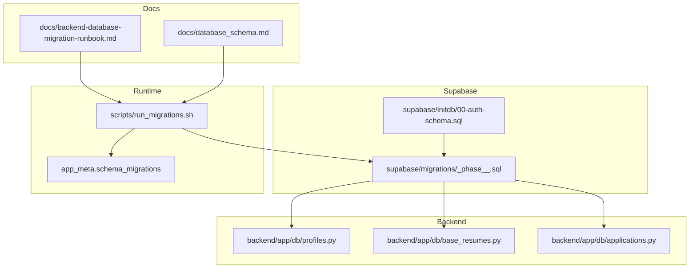
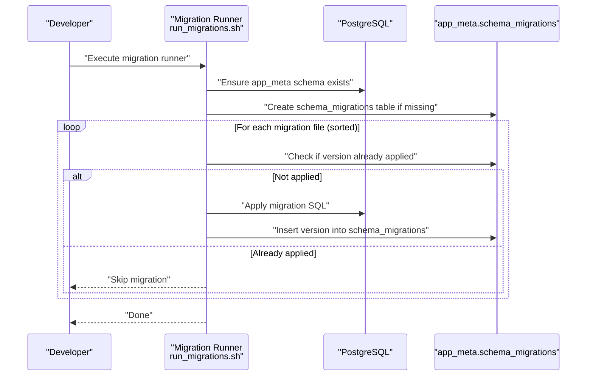
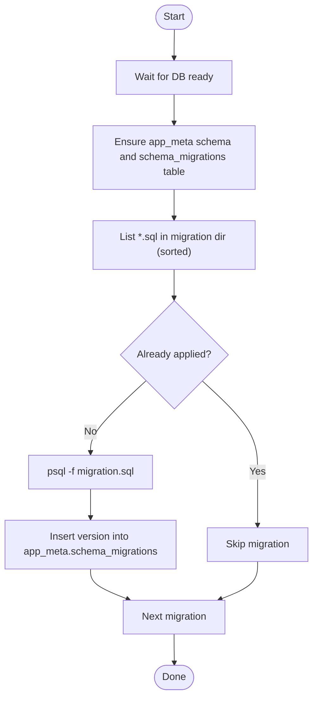
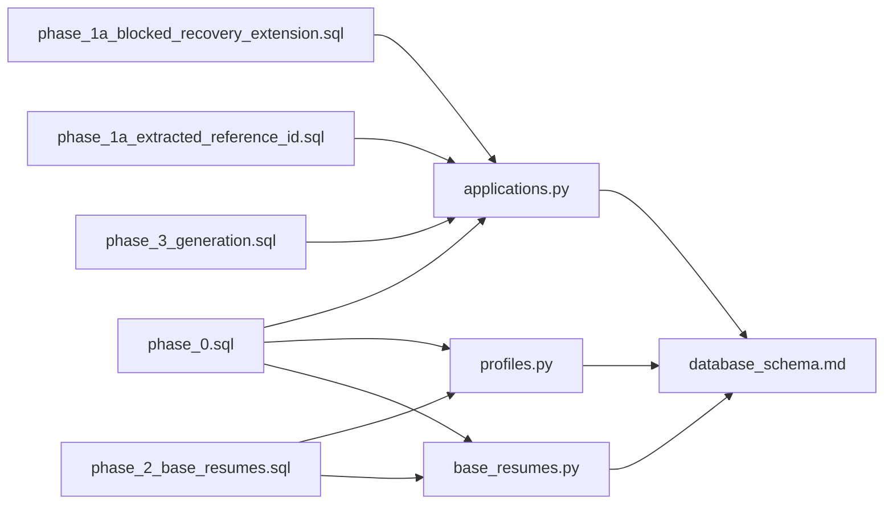

# Migration System

<cite>
**Referenced Files in This Document**
- [20260407_000001_phase_0_foundation.sql](file://supabase/migrations/20260407_000001_phase_0_foundation.sql)
- [20260407_000002_phase_1a_blocked_recovery_extension.sql](file://supabase/migrations/20260407_000002_phase_1a_blocked_recovery_extension.sql)
- [20260407_000003_phase_1a_extracted_reference_id.sql](file://supabase/migrations/20260407_000003_phase_1a_extracted_reference_id.sql)
- [20260407_000004_phase_2_base_resumes.sql](file://supabase/migrations/20260407_000004_phase_2_base_resumes.sql)
- [20260407_000005_phase_3_generation.sql](file://supabase/migrations/20260407_000005_phase_3_generation.sql)
- [backend-database-migration-runbook.md](file://docs/backend-database-migration-runbook.md)
- [database_schema.md](file://docs/database_schema.md)
- [run_migrations.sh](file://scripts/run_migrations.sh)
- [00-auth-schema.sql](file://supabase/initdb/00-auth-schema.sql)
- [profiles.py](file://backend/app/db/profiles.py)
- [base_resumes.py](file://backend/app/db/base_resumes.py)
- [applications.py](file://backend/app/db/applications.py)
</cite>

## Table of Contents
1. [Introduction](#introduction)
2. [Project Structure](#project-structure)
3. [Core Components](#core-components)
4. [Architecture Overview](#architecture-overview)
5. [Detailed Component Analysis](#detailed-component-analysis)
6. [Dependency Analysis](#dependency-analysis)
7. [Performance Considerations](#performance-considerations)
8. [Troubleshooting Guide](#troubleshooting-guide)
9. [Conclusion](#conclusion)
10. [Appendices](#appendices)

## Introduction
This document describes the versioned database migration system used by the project’s Supabase-managed PostgreSQL database. It explains the migration naming convention, the chronological evolution across phases 0 through 3, and the execution and rollback procedures. It also documents the schema changes introduced in each migration, the runbook for safe upgrades, and guidance for troubleshooting and emergency rollbacks.

## Project Structure
The migration system is organized around:
- Supabase-managed migrations under a dedicated migrations directory
- A centralized runbook and schema definition documents
- A lightweight migration runner script that applies migrations idempotently
- Backend repositories that rely on the schema contracts

**Diagram sources**
- [20260407_000001_phase_0_foundation.sql:1-343](file://supabase/migrations/20260407_000001_phase_0_foundation.sql#L1-L343)
- [20260407_000002_phase_1a_blocked_recovery_extension.sql:1-16](file://supabase/migrations/20260407_000002_phase_1a_blocked_recovery_extension.sql#L1-L16)
- [20260407_000003_phase_1a_extracted_reference_id.sql:1-11](file://supabase/migrations/20260407_000003_phase_1a_extracted_reference_id.sql#L1-L11)
- [20260407_000004_phase_2_base_resumes.sql:1-158](file://supabase/migrations/20260407_000004_phase_2_base_resumes.sql#L1-L158)
- [20260407_000005_phase_3_generation.sql:1-11](file://supabase/migrations/20260407_000005_phase_3_generation.sql#L1-L11)
- [run_migrations.sh:1-39](file://scripts/run_migrations.sh#L1-L39)
- [00-auth-schema.sql:1-2](file://supabase/initdb/00-auth-schema.sql#L1-L2)
- [profiles.py:1-225](file://backend/app/db/profiles.py#L1-L225)
- [base_resumes.py:1-184](file://backend/app/db/base_resumes.py#L1-L184)
- [applications.py:1-328](file://backend/app/db/applications.py#L1-L328)

**Section sources**
- [run_migrations.sh:1-39](file://scripts/run_migrations.sh#L1-L39)
- [00-auth-schema.sql:1-2](file://supabase/initdb/00-auth-schema.sql#L1-L2)

## Core Components
- Versioned migrations: Each migration file follows a strict naming pattern and is applied in timestamp order.
- Centralized runbook: Defines baseline rules, rollout posture, verification, and implementation notes for each phase.
- Schema contract: The authoritative schema definition ensures backend and migration alignment.
- Migration runner: Applies migrations idempotently and tracks applied versions.

Key responsibilities:
- Naming convention: YYYYMMDD_HHMMSS_phase_X_description.sql
- Execution: Runner connects to the database, ensures the metadata schema/table exist, and applies migrations in sorted order, marking each as applied.
- Rollback: Defined per migration in the runbook; generally additive changes are reversible via dropping added columns.

**Section sources**
- [backend-database-migration-runbook.md:18-47](file://docs/backend-database-migration-runbook.md#L18-L47)
- [database_schema.md:1-289](file://docs/database_schema.md#L1-L289)
- [run_migrations.sh:18-38](file://scripts/run_migrations.sh#L18-L38)

## Architecture Overview
The migration lifecycle spans planning, execution, and verification:

**Diagram sources**
- [run_migrations.sh:18-38](file://scripts/run_migrations.sh#L18-L38)

## Detailed Component Analysis

### Migration Naming Convention
- Pattern: YYYYMMDD_HHMMSS_phase_X_description.sql
- Ordering: Sorted lexicographically by filename; timestamp drives chronological order.
- Phases:
  - Phase 0: Foundation
  - Phase 1A: Blocked recovery and extension
  - Phase 1A (continued): Extracted reference ID
  - Phase 2: Base resumes and refined RLS
  - Phase 3: Generation

Examples from the repository:
- [20260407_000001_phase_0_foundation.sql:1-343](file://supabase/migrations/20260407_000001_phase_0_foundation.sql#L1-L343)
- [20260407_000002_phase_1a_blocked_recovery_extension.sql:1-16](file://supabase/migrations/20260407_000002_phase_1a_blocked_recovery_extension.sql#L1-L16)
- [20260407_000003_phase_1a_extracted_reference_id.sql:1-11](file://supabase/migrations/20260407_000003_phase_1a_extracted_reference_id.sql#L1-L11)
- [20260407_000004_phase_2_base_resumes.sql:1-158](file://supabase/migrations/20260407_000004_phase_2_base_resumes.sql#L1-L158)
- [20260407_000005_phase_3_generation.sql:1-11](file://supabase/migrations/20260407_000005_phase_3_generation.sql#L1-L11)

**Section sources**
- [run_migrations.sh:26-38](file://scripts/run_migrations.sh#L26-L38)

### Phase 0: Foundation
Scope:
- Creates required extensions and roles
- Defines enums and triggers
- Creates core tables: profiles, base_resumes, applications, resume_drafts, notifications
- Adds indexes and row-level security (RLS)
- Grants permissions
- Adds auth-triggered profile synchronization

Key schema artifacts:
- Enumerations for visible status, internal state, failure reason, duplicate resolution, job posting origin, and notification type
- Triggers to maintain updated_at timestamps
- Composite foreign keys and constraints
- RLS policies for owner-only access

Verification highlights:
- Auth profile sync on user insert/update
- Owner-only access across user-scoped tables
- Index coverage for dashboard and search

**Section sources**
- [20260407_000001_phase_0_foundation.sql:1-343](file://supabase/migrations/20260407_000001_phase_0_foundation.sql#L1-L343)
- [database_schema.md:46-230](file://docs/database_schema.md#L46-L230)
- [backend-database-migration-runbook.md:83-94](file://docs/backend-database-migration-runbook.md#L83-L94)

### Phase 1A: Blocked Recovery and Chrome Extension
Scope:
- Adds columns to profiles for extension token hashing and timestamps
- Adds a unique partial index on the token hash
- Adds extraction_failure_details to applications for storing sanitized diagnostics

Rollout posture:
- Additive-only changes; no backfill required
- Deploy schema, then backend/frontend, then extension

**Section sources**
- [20260407_000002_phase_1a_blocked_recovery_extension.sql:1-16](file://supabase/migrations/20260407_000002_phase_1a_blocked_recovery_extension.sql#L1-L16)
- [database_schema.md:35-45](file://docs/database_schema.md#L35-L45)
- [backend-database-migration-runbook.md:107-123](file://docs/backend-database-migration-runbook.md#L107-L123)

### Phase 1A: Extracted Reference ID
Scope:
- Adds extracted_reference_id to applications
- Adds a user-scoped partial index for efficient duplicate detection

Post-deploy behavior:
- Worker can persist reference IDs; duplicate detection can match on them

**Section sources**
- [20260407_000003_phase_1a_extracted_reference_id.sql:1-11](file://supabase/migrations/20260407_000003_phase_1a_extracted_reference_id.sql#L1-L11)
- [database_schema.md:35-45](file://docs/database_schema.md#L35-L45)
- [backend-database-migration-runbook.md:124-132](file://docs/backend-database-migration-runbook.md#L124-L132)

### Phase 2: Base Resumes and RLS Refinement
Scope:
- Replaces generic “owner all” policies with granular per-operation policies for base_resumes and resume_drafts
- Ensures RLS is enabled on both tables
- Adds a user_id index on base_resumes for performance

Impact:
- Tightens access control to per-operation policies
- Improves performance for user-scoped queries

**Section sources**
- [20260407_000004_phase_2_base_resumes.sql:1-158](file://supabase/migrations/20260407_000004_phase_2_base_resumes.sql#L1-L158)
- [database_schema.md:84-113](file://docs/database_schema.md#L84-L113)
- [backend-database-migration-runbook.md:133-144](file://docs/backend-database-migration-runbook.md#L133-L144)

### Phase 3: Generation
Scope:
- Adds generation_failure_details to applications for storing structured generation/validation diagnostics

Rollback:
- Drop the added column

**Section sources**
- [20260407_000005_phase_3_generation.sql:1-11](file://supabase/migrations/20260407_000005_phase_3_generation.sql#L1-L11)
- [database_schema.md:35-45](file://docs/database_schema.md#L35-L45)
- [backend-database-migration-runbook.md:145-156](file://docs/backend-database-migration-runbook.md#L145-L156)

### Execution Flow and Idempotency
The runner:
- Waits for database readiness
- Ensures the app_meta schema and schema_migrations table exist
- Iterates migrations in sorted filename order
- Skips already-applied migrations
- Applies each migration and records its version

**Diagram sources**
- [run_migrations.sh:13-38](file://scripts/run_migrations.sh#L13-L38)

**Section sources**
- [run_migrations.sh:1-39](file://scripts/run_migrations.sh#L1-L39)

### Data Integrity During Upgrades
- Additive-first policy: New nullable columns, indexes, and enums are preferred
- Backfill in bounded batches when needed; treat partial completion as expected
- Destructive changes are staged behind drains of old reads/writes
- RLS policies are updated alongside schema to prevent cross-user access
- Backend repositories enforce ownership and cast enums consistently

**Section sources**
- [backend-database-migration-runbook.md:18-47](file://docs/backend-database-migration-runbook.md#L18-L47)
- [database_schema.md:266-281](file://docs/database_schema.md#L266-L281)
- [applications.py:310-323](file://backend/app/db/applications.py#L310-L323)

## Dependency Analysis
The backend repositories depend on the schema contracts defined in the schema document and enforced by migrations. They cast enums and UUIDs appropriately and scope queries by user identifiers.

**Diagram sources**
- [applications.py:310-323](file://backend/app/db/applications.py#L310-L323)
- [profiles.py:190-194](file://backend/app/db/profiles.py#L190-L194)
- [base_resumes.py:123-141](file://backend/app/db/base_resumes.py#L123-L141)
- [database_schema.md:18-45](file://docs/database_schema.md#L18-L45)
- [20260407_000001_phase_0_foundation.sql:1-343](file://supabase/migrations/20260407_000001_phase_0_foundation.sql#L1-L343)
- [20260407_000002_phase_1a_blocked_recovery_extension.sql:1-16](file://supabase/migrations/20260407_000002_phase_1a_blocked_recovery_extension.sql#L1-L16)
- [20260407_000003_phase_1a_extracted_reference_id.sql:1-11](file://supabase/migrations/20260407_000003_phase_1a_extracted_reference_id.sql#L1-L11)
- [20260407_000004_phase_2_base_resumes.sql:1-158](file://supabase/migrations/20260407_000004_phase_2_base_resumes.sql#L1-L158)
- [20260407_000005_phase_3_generation.sql:1-11](file://supabase/migrations/20260407_000005_phase_3_generation.sql#L1-L11)

**Section sources**
- [applications.py:1-328](file://backend/app/db/applications.py#L1-L328)
- [profiles.py:1-225](file://backend/app/db/profiles.py#L1-L225)
- [base_resumes.py:1-184](file://backend/app/db/base_resumes.py#L1-L184)
- [database_schema.md:1-289](file://docs/database_schema.md#L1-L289)

## Performance Considerations
- Indexes: Composite indexes on user_id plus sort/select fields improve dashboard and duplicate-review performance.
- Partial indexes: Unique partial index on extension token hash enables fast scoped lookups.
- RLS overhead: Policies and indexes are designed to minimize performance impact while preserving isolation.
- Search: GIN trigram index on job title and company supports efficient dashboard search.

**Section sources**
- [database_schema.md:248-265](file://docs/database_schema.md#L248-L265)
- [20260407_000001_phase_0_foundation.sql:220-232](file://supabase/migrations/20260407_000001_phase_0_foundation.sql#L220-L232)
- [20260407_000002_phase_1a_blocked_recovery_extension.sql:8-10](file://supabase/migrations/20260407_000002_phase_1a_blocked_recovery_extension.sql#L8-L10)

## Troubleshooting Guide
Common issues and resolutions:
- Migration fails due to missing environment variables:
  - Ensure POSTGRES_PASSWORD is set; the runner requires it.
- Migration appears stuck:
  - Confirm database readiness and that the runner can connect.
- Duplicate column or type errors:
  - The runbook prescribes additive-only changes; verify the migration is additive and idempotent.
- RLS prevents access:
  - Confirm RLS policies are present and that the backend scopes queries by user_id.
- Extension token rotation:
  - The runbook specifies immediate invalidation of previous tokens; verify the backend rotates tokens and clears old hashes.
- Generation failure details not appearing:
  - Ensure the migration applied and the backend writes generation_failure_details; verify rollback instructions if needed.

Emergency rollback examples (per runbook):
- Phase 3 generation rollback: Drop the added column on applications.
- Phase 1A blocked recovery rollback: Drop the added columns on profiles and applications.
- Phase 1A extracted reference ID rollback: Drop the added column on applications.

Verification checklist:
- Authenticated users can only access their own rows
- RLS policies block cross-user access
- Application statuses and failure reasons align with the PRD
- Existing data loads correctly after schema changes
- Duplicate review, generation, regeneration, and export paths preserve recoverable failure handling

**Section sources**
- [run_migrations.sh:8-16](file://scripts/run_migrations.sh#L8-L16)
- [backend-database-migration-runbook.md:48-82](file://docs/backend-database-migration-runbook.md#L48-L82)
- [backend-database-migration-runbook.md:107-156](file://docs/backend-database-migration-runbook.md#L107-L156)

## Conclusion
The migration system enforces a strict naming convention, additive-first changes, and robust verification. The runbook and schema documents provide a consistent contract across phases, while the runner ensures idempotent application and tracking. Adhering to the runbook’s rollout posture and verification steps maintains data integrity and enables safe, incremental evolution to Phase 3 generation capabilities.

## Appendices

### Migration Runbook Highlights
- Baseline rules: Keep schema and PRD-aligned, fail closed on missing auth/data/config, preserve user scoping.
- Rollout posture: Prefer additive changes, backfill in batches, stage destructive changes.
- Verification: Confirm auth, ownership, status mapping, and failure recovery.
- Implementation notes: Phase-specific rollout order and post-deploy checks.

**Section sources**
- [backend-database-migration-runbook.md:10-82](file://docs/backend-database-migration-runbook.md#L10-L82)

### Safe Migration Practices and Testing Strategies
- Test locally: Apply migrations against a local Supabase instance managed by the project’s compose setup.
- Feature flags: Gate new write paths behind feature flags until schema and backfills are complete.
- Canary deploys: Roll out to a subset of users after verifying schema and backend compatibility.
- Validation suites: Include checks for RLS, ownership, and status transitions in automated tests.
- Backup and restore: Take snapshots before applying destructive changes; retain logs without sensitive content.

**Section sources**
- [backend-database-migration-runbook.md:18-47](file://docs/backend-database-migration-runbook.md#L18-L47)