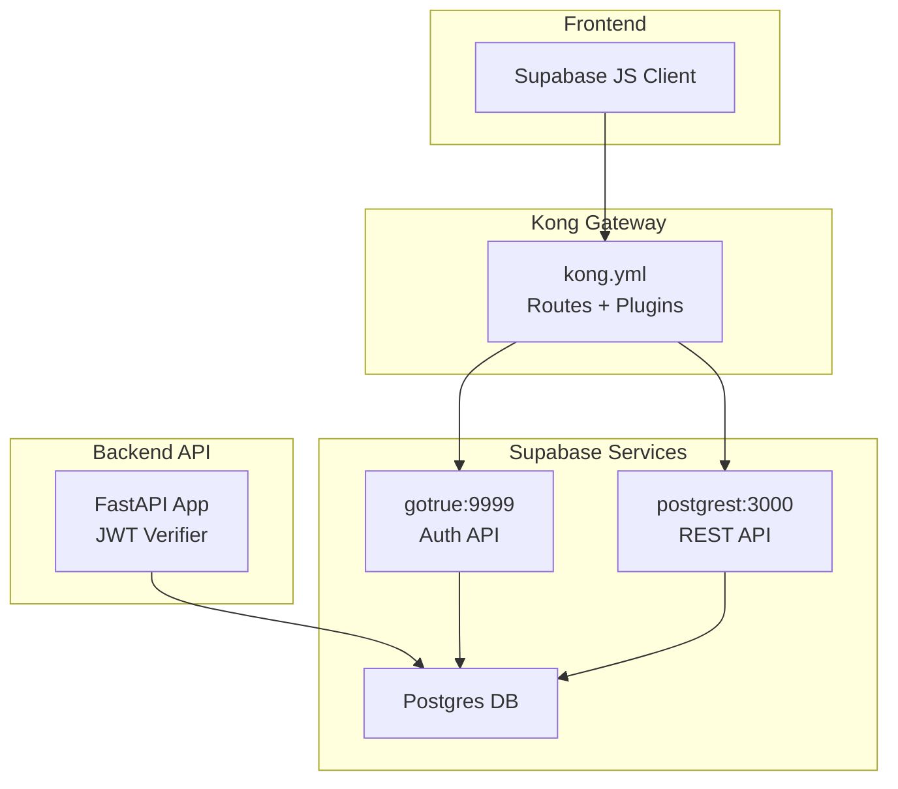
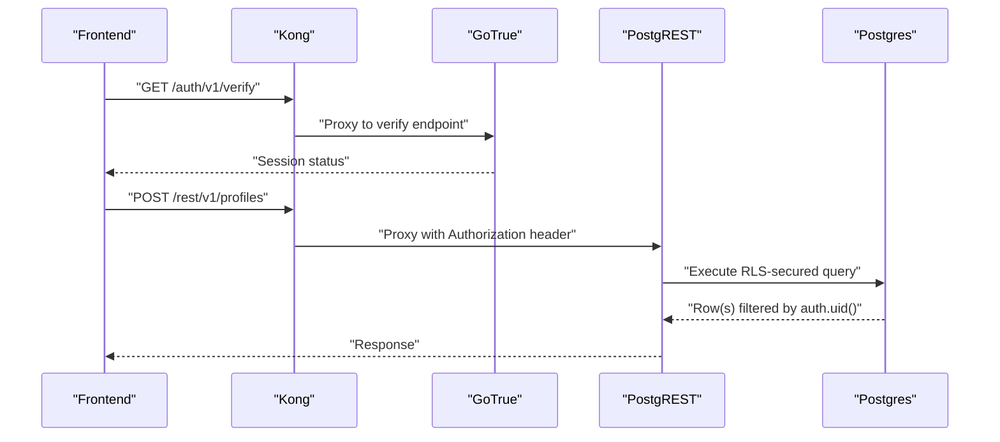
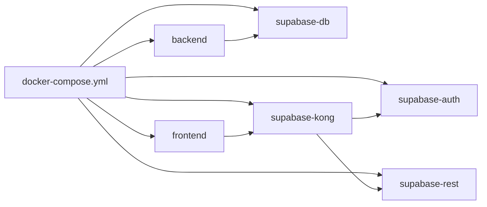

# Supabase Integration

<cite>
**Referenced Files in This Document**
- [00-auth-schema.sql](file://supabase/initdb/00-auth-schema.sql)
- [20260407_000001_phase_0_foundation.sql](file://supabase/migrations/20260407_000001_phase_0_foundation.sql)
- [20260407_000002_phase_1a_blocked_recovery_extension.sql](file://supabase/migrations/20260407_000002_phase_1a_blocked_recovery_extension.sql)
- [20260407_000003_phase_1a_extracted_reference_id.sql](file://supabase/migrations/20260407_000003_phase_1a_extracted_reference_id.sql)
- [20260407_000004_phase_2_base_resumes.sql](file://supabase/migrations/20260407_000004_phase_2_base_resumes.sql)
- [20260407_000005_phase_3_generation.sql](file://supabase/migrations/20260407_000005_phase_3_generation.sql)
- [kong.yml](file://supabase/kong/kong.yml)
- [kong-entrypoint.sh](file://supabase/kong/kong-entrypoint.sh)
- [docker-compose.yml](file://docker-compose.yml)
- [config.py](file://backend/app/core/config.py)
- [auth.py](file://backend/app/core/auth.py)
- [profiles.py](file://backend/app/db/profiles.py)
- [applications.py](file://backend/app/db/applications.py)
- [supabase.ts](file://frontend/src/lib/supabase.ts)
- [seed_local_user.sh](file://scripts/seed_local_user.sh)
</cite>

## Table of Contents
1. [Introduction](#introduction)
2. [Project Structure](#project-structure)
3. [Core Components](#core-components)
4. [Architecture Overview](#architecture-overview)
5. [Detailed Component Analysis](#detailed-component-analysis)
6. [Dependency Analysis](#dependency-analysis)
7. [Performance Considerations](#performance-considerations)
8. [Troubleshooting Guide](#troubleshooting-guide)
9. [Conclusion](#conclusion)
10. [Appendices](#appendices)

## Introduction
This document explains the Supabase integration for authentication, authorization, and database access across the stack. It covers:
- Authentication schema initialization and user lifecycle
- Row Level Security (RLS) policies binding permissions to auth.uid()
- Kong API gateway configuration for proxying, SSL termination, and access control
- Service role usage for trusted backend jobs
- Database initialization, user creation workflows, and access control setup
- Token management, refresh tokens, and session invalidation
- Environment configuration for local, staging, and production
- Monitoring, logging, and audit trail guidance

## Project Structure
The Supabase integration spans three layers:
- Database and Auth: Supabase Postgres, GoTrue, and PostgREST orchestrated via Kong
- Backend API: FastAPI service validating JWTs and accessing the database
- Frontend: Supabase JS client configured for session persistence and token refresh

**Diagram sources**
- [kong.yml:1-96](file://supabase/kong/kong.yml#L1-L96)
- [docker-compose.yml:115-186](file://docker-compose.yml#L115-L186)
- [auth.py:22-90](file://backend/app/core/auth.py#L22-L90)

**Section sources**
- [docker-compose.yml:1-191](file://docker-compose.yml#L1-L191)
- [kong.yml:1-96](file://supabase/kong/kong.yml#L1-L96)

## Core Components
- Authentication schema initialization: Creates the auth schema and sets up roles.
- Database foundation: Defines enums, tables, triggers, grants, and RLS policies.
- Kong gateway: Declarative config for auth and REST routes, ACL, and key-auth.
- Backend JWT verification: Validates access tokens against JWKS or secret.
- Frontend Supabase client: Session persistence and automatic token refresh.
- Local user seeding: Admin endpoint usage to provision users during dev.

**Section sources**
- [00-auth-schema.sql:1-2](file://supabase/initdb/00-auth-schema.sql#L1-L2)
- [20260407_000001_phase_0_foundation.sql:1-343](file://supabase/migrations/20260407_000001_phase_0_foundation.sql#L1-L343)
- [kong.yml:1-96](file://supabase/kong/kong.yml#L1-L96)
- [auth.py:22-90](file://backend/app/core/auth.py#L22-L90)
- [supabase.ts:1-26](file://frontend/src/lib/supabase.ts#L1-L26)
- [seed_local_user.sh:1-61](file://scripts/seed_local_user.sh#L1-L61)

## Architecture Overview
The Supabase stack is containerized and orchestrated by Docker Compose. Kong exposes declarative routes for auth and REST APIs, enforcing key-auth and ACL. GoTrue manages authentication, PostgREST exposes tables as REST endpoints, and Postgres stores data with RLS policies. The backend validates JWTs and accesses the database directly for privileged operations.

**Diagram sources**
- [kong.yml:18-96](file://supabase/kong/kong.yml#L18-L96)
- [docker-compose.yml:115-186](file://docker-compose.yml#L115-L186)

## Detailed Component Analysis

### Authentication Schema Initialization
- Creates the auth schema and sets its authorization to the postgres role.
- Ensures roles exist: anon, authenticated, service_role (with bypassrls).
- Defines enums and utility functions used across tables.
- Sets up a trigger and function to synchronize auth.users with public.profiles.

Key behaviors:
- Role provisioning ensures downstream services can operate under the correct identities.
- The auth-users-to-profiles trigger maintains a normalized profile record for each user.

**Section sources**
- [00-auth-schema.sql:1-2](file://supabase/initdb/00-auth-schema.sql#L1-L2)
- [20260407_000001_phase_0_foundation.sql:6-20](file://supabase/migrations/20260407_000001_phase_0_foundation.sql#L6-L20)
- [20260407_000001_phase_0_foundation.sql:258-295](file://supabase/migrations/20260407_000001_phase_0_foundation.sql#L258-L295)

### Database Foundation and RLS Policies
- Tables: profiles, base_resumes, applications, resume_drafts, notifications.
- Triggers: set_updated_at on all user-scoped tables.
- Grants: anon and authenticated have SELECT/INSERT/UPDATE/DELETE on public tables.
- RLS policies: All user-scoped tables enforce using auth.uid() = user_id.

Policy coverage:
- profiles: SELECT/INSERT/UPDATE bound to id = auth.uid()
- base_resumes: owner-level ALL bound to user_id = auth.uid()
- applications: owner-level ALL bound to user_id = auth.uid()
- resume_drafts: owner-level ALL bound to user_id = auth.uid()
- notifications: owner-level ALL bound to user_id = auth.uid()

Indexing:
- Composite indexes on (user_id, updated_at), (user_id, name), and others optimize RLS and queries.

**Section sources**
- [20260407_000001_phase_0_foundation.sql:86-341](file://supabase/migrations/20260407_000001_phase_0_foundation.sql#L86-L341)

### Kong API Gateway Configuration
- Consumers: anon (key: SUPABASE_ANON_KEY), service_role (key: SUPABASE_SERVICE_KEY)
- ACL groups: anon → anon, service_role → admin
- Services:
  - /auth/v1/* routed to GoTrue (health, jwks, verify, and all)
  - /rest/v1/* routed to PostgREST
- Plugins:
  - CORS enabled
  - key-auth for API key authentication
  - request-transformer adds Authorization header passthrough
  - ACL restricts routes to allowed groups

SSL/TLS:
- Kong runs in plain HTTP mode; external SSL termination is recommended at the edge load balancer or reverse proxy.

Rate limiting:
- Not configured in the provided Kong config; can be added via plugins (e.g., rtmp or custom rate-limit plugin) mounted into Kong.

**Section sources**
- [kong.yml:1-96](file://supabase/kong/kong.yml#L1-L96)
- [kong-entrypoint.sh:1-10](file://supabase/kong/kong-entrypoint.sh#L1-L10)

### Backend JWT Verification and Access Patterns
- The backend verifies access tokens using JWKS from Supabase or a shared JWT secret.
- Extracts subject (user ID), email, role, and claims.
- Provides a dependency to inject the current authenticated user into route handlers.

Service role access:
- For trusted backend jobs, use the service_role key via the admin endpoints to bypass RLS where appropriate.

**Section sources**
- [auth.py:22-90](file://backend/app/core/auth.py#L22-L90)
- [config.py:35-97](file://backend/app/core/config.py#L35-L97)

### Frontend Supabase Client
- Configured with session persistence, auto-refresh, and sessionStorage storage.
- Uses VITE_SUPABASE_URL and VITE_SUPABASE_ANON_KEY from environment.

**Section sources**
- [supabase.ts:1-26](file://frontend/src/lib/supabase.ts#L1-L26)

### Database Repositories and Ownership Boundaries
- Profiles repository: fetch/update profile, manage extension token linkage, and default resume selection.
- Applications repository: CRUD and search on applications scoped by user_id.

Both repositories operate under the authenticated role and rely on RLS to enforce ownership.

**Section sources**
- [profiles.py:38-225](file://backend/app/db/profiles.py#L38-L225)
- [applications.py:123-328](file://backend/app/db/applications.py#L123-L328)

### Local User Creation Workflow
- Waits for the auth gateway health endpoint.
- Calls the admin users endpoint with the service_role key to create a user.
- Handles success and duplicate cases.

**Section sources**
- [seed_local_user.sh:1-61](file://scripts/seed_local_user.sh#L1-L61)

## Dependency Analysis
- Docker Compose orchestrates:
  - supabase-db (Postgres)
  - supabase-auth (GoTrue)
  - supabase-rest (PostgREST)
  - supabase-kong (Kong)
  - backend (FastAPI)
  - frontend (Vite)
- Kong depends on environment variables for keys and routes to auth and REST.
- Backend depends on Supabase URLs and JWT settings.
- Frontend depends on Vite environment variables for Supabase client.

**Diagram sources**
- [docker-compose.yml:1-191](file://docker-compose.yml#L1-L191)

**Section sources**
- [docker-compose.yml:1-191](file://docker-compose.yml#L1-L191)

## Performance Considerations
- RLS performance: Composite indexes on (user_id, ...) improve policy evaluation speed.
- Triggers: set_updated_at reduces duplication and keeps timestamps consistent.
- Queries: repositories use parameterized statements and explicit casting to maintain safety and performance.
- Kong: Enable caching and consider adding rate-limiting plugins for high-throughput scenarios.

[No sources needed since this section provides general guidance]

## Troubleshooting Guide
Common issues and remedies:
- Auth gateway not ready: The seed script waits for /auth/v1/health; ensure supabase-auth is healthy before attempting admin calls.
- Invalid or missing bearer token: Backend requires Authorization: Bearer <token>; missing or malformed tokens cause 401.
- RLS denies access: Confirm the user_id matches auth.uid() and the table has owner-level policies enabled.
- Kong ACL errors: Verify consumers and ACL groups; ensure SUPABASE_ANON_KEY/SUPABASE_SERVICE_KEY are set and Kong has rendered the config.

**Section sources**
- [seed_local_user.sh:29-37](file://scripts/seed_local_user.sh#L29-L37)
- [auth.py:72-90](file://backend/app/core/auth.py#L72-L90)
- [kong.yml:12-16](file://supabase/kong/kong.yml#L12-L16)

## Conclusion
The Supabase integration establishes a secure, RLS-driven data access model with Kong as the API gateway, GoTrue for authentication, and PostgREST for RESTful access. The backend validates tokens and performs privileged operations using service_role keys, while the frontend benefits from persistent sessions and automatic token refresh. The provided configurations and scripts enable repeatable setups across environments.

[No sources needed since this section summarizes without analyzing specific files]

## Appendices

### Environment Variables and Configuration Examples
- Local development:
  - Set SUPABASE_URL, SUPABASE_EXTERNAL_URL, SUPABASE_AUTH_JWKS_URL, SUPABASE_JWT_SECRET, ANON_KEY, SERVICE_ROLE_KEY, JWT_SECRET.
  - Example keys: SUPABASE_ANON_KEY and SUPABASE_SERVICE_KEY injected into Kong and backend.
- Staging/Production:
  - External SSL termination at the edge; configure Kong to listen on HTTPS and mount certificates.
  - Rotate JWT secrets and rotate keys periodically; update Kong consumers accordingly.
- Backend:
  - Configure SUPABASE_URL, SUPABASE_AUTH_JWKS_URL, SUPABASE_JWT_SECRET, SUPABASE_JWT_AUDIENCE, SUPABASE_JWT_ISSUER.
- Frontend:
  - Configure VITE_SUPABASE_URL and VITE_SUPABASE_ANON_KEY.

**Section sources**
- [docker-compose.yml:26-42](file://docker-compose.yml#L26-L42)
- [config.py:35-97](file://backend/app/core/config.py#L35-L97)
- [kong.yml:162-171](file://supabase/kong/kong.yml#L162-L171)

### Security Model: Tokens, Refresh, and Session Invalidation
- Access tokens: validated by backend using JWKS or shared secret; audience/issuer verified when configured.
- Refresh tokens: frontend auto-refresh is enabled; ensure site URL and URI allow list are correct in GoTrue.
- Session invalidation: rely on token expiry and revocation via GoTrue; avoid long-lived tokens in production.

**Section sources**
- [auth.py:27-64](file://backend/app/core/auth.py#L27-L64)
- [supabase.ts:4-11](file://frontend/src/lib/supabase.ts#L4-L11)
- [docker-compose.yml:117-136](file://docker-compose.yml#L117-L136)

### Monitoring, Logging, and Audit Trail
- Kong logs: configured for stdout with combined format; forward to centralized logging in production.
- PostgREST: configure logs and consider enabling SQL audit logging at the database level.
- GoTrue: monitor auth events and failed verifications; consider exporting logs for compliance.
- Database audit: track DDL/DML changes via logical replication or WAL-level auditing tools.

**Section sources**
- [docker-compose.yml:166-167](file://docker-compose.yml#L166-L167)
- [20260407_000001_phase_0_foundation.sql:254-256](file://supabase/migrations/20260407_000001_phase_0_foundation.sql#L254-L256)