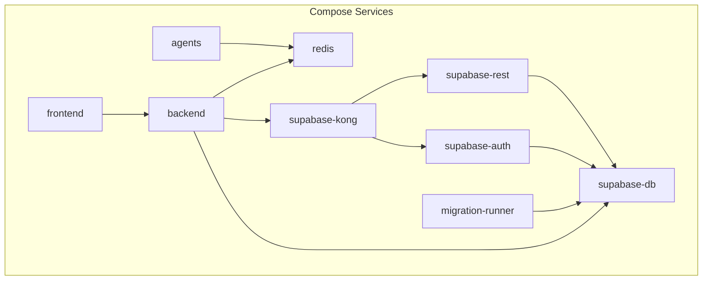
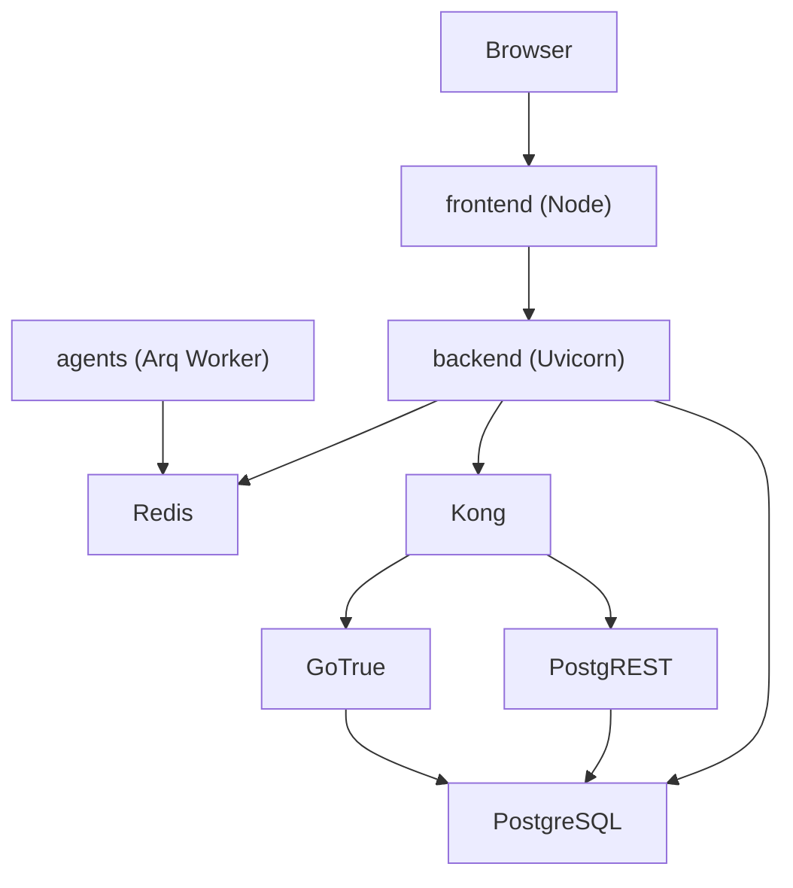
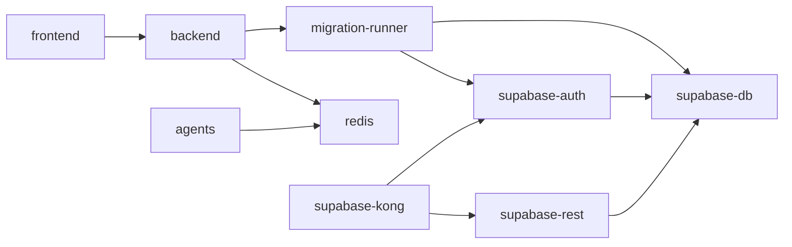

# Deployment and Operations

<cite>
**Referenced Files in This Document**
- [docker-compose.yml](file://docker-compose.yml)
- [Makefile](file://Makefile)
- [.env.compose.example](file://.env.compose.example)
- [backend/Dockerfile](file://backend/Dockerfile)
- [frontend/Dockerfile](file://frontend/Dockerfile)
- [agents/Dockerfile](file://agents/Dockerfile)
- [scripts/healthcheck.sh](file://scripts/healthcheck.sh)
- [scripts/run_migrations.sh](file://scripts/run_migrations.sh)
- [scripts/seed_local_user.sh](file://scripts/seed_local_user.sh)
- [supabase/kong/kong-entrypoint.sh](file://supabase/kong/kong-entrypoint.sh)
- [supabase/kong/kong.yml](file://supabase/kong/kong.yml)
- [supabase/initdb/00-auth-schema.sql](file://supabase/initdb/00-auth-schema.sql)
- [supabase/migrations/20260407_000001_phase_0_foundation.sql](file://supabase/migrations/20260407_000001_phase_0_foundation.sql)
- [supabase/migrations/20260407_000002_phase_1a_blocked_recovery_extension.sql](file://supabase/migrations/20260407_000002_phase_1a_blocked_recovery_extension.sql)
</cite>

## Table of Contents
1. [Introduction](#introduction)
2. [Project Structure](#project-structure)
3. [Core Components](#core-components)
4. [Architecture Overview](#architecture-overview)
5. [Detailed Component Analysis](#detailed-component-analysis)
6. [Dependency Analysis](#dependency-analysis)
7. [Performance Considerations](#performance-considerations)
8. [Troubleshooting Guide](#troubleshooting-guide)
9. [Conclusion](#conclusion)
10. [Appendices](#appendices)

## Introduction
This document provides comprehensive deployment and operations guidance for the containerized application. It covers Docker configuration, multi-service orchestration, volume management, network configuration, health checks, production deployment steps, database migrations, monitoring, deployment pipeline, operational procedures, scaling, performance monitoring, capacity planning, troubleshooting, rollback, and maintenance.

## Project Structure
The project uses Docker Compose to orchestrate frontend, backend, agents, Redis, Supabase components (PostgreSQL, GoTrue, PostgREST, Kong), and a dedicated migration runner. Environment variables are managed via a compose-specific environment file. Scripts support health checks, migrations, and seeding a local development user.

**Diagram sources**
- [docker-compose.yml:1-191](file://docker-compose.yml#L1-L191)

**Section sources**
- [docker-compose.yml:1-191](file://docker-compose.yml#L1-L191)
- [Makefile:1-30](file://Makefile#L1-L30)

## Core Components
- Frontend service: Node.js-based dev server, mounted with shared workspace and hot-reload enabled.
- Backend service: Python ASGI app exposing health and application endpoints, connected to PostgreSQL and Redis.
- Agents service: Python-based Arq worker for asynchronous tasks, Chromium installation included.
- Redis: In-memory cache/store for async tasks and rate limiting.
- Database: PostgreSQL with initialization and migration runner.
- Supabase stack: GoTrue (auth), PostgREST (REST API), Kong (gateway) with declarative config and key management.
- Migration runner: Applies SQL migrations idempotently and tracks applied versions.
- Healthcheck script: Validates external endpoints for auth, backend, and frontend.
- Seed script: Creates a local development user via Supabase admin API.

**Section sources**
- [docker-compose.yml:2-191](file://docker-compose.yml#L2-L191)
- [backend/Dockerfile:1-18](file://backend/Dockerfile#L1-L18)
- [frontend/Dockerfile:1-11](file://frontend/Dockerfile#L1-L11)
- [agents/Dockerfile:1-14](file://agents/Dockerfile#L1-L14)
- [scripts/healthcheck.sh:1-35](file://scripts/healthcheck.sh#L1-L35)
- [scripts/run_migrations.sh:1-39](file://scripts/run_migrations.sh#L1-L39)
- [scripts/seed_local_user.sh:1-61](file://scripts/seed_local_user.sh#L1-L61)
- [supabase/kong/kong-entrypoint.sh:1-10](file://supabase/kong/kong-entrypoint.sh#L1-L10)
- [supabase/kong/kong.yml:1-96](file://supabase/kong/kong.yml#L1-L96)

## Architecture Overview
The system is composed of:
- Web client (frontend) served by a Node dev server.
- API server (backend) built with Uvicorn/ASGI.
- Background workers (agents) powered by Arq and Redis.
- Data plane: PostgreSQL for relational data and auth metadata.
- Supabase gateway: Kong routes traffic to GoTrue and PostgREST with ACL and key-auth plugins.
- Orchestration: Docker Compose manages lifecycle, dependencies, and health checks.

**Diagram sources**
- [docker-compose.yml:1-191](file://docker-compose.yml#L1-L191)
- [supabase/kong/kong.yml:1-96](file://supabase/kong/kong.yml#L1-L96)

## Detailed Component Analysis

### Docker Compose Orchestration
- Multi-service composition with explicit dependency ordering and health checks.
- Environment-driven configuration for ports, secrets, and toggles.
- Named volumes for persistent data and isolated node_modules caching.
- Declarative Kong config with key substitution at startup.

Key orchestration highlights:
- Frontend depends on backend.
- Backend depends on migration-runner completion and Redis.
- Agents depend on Redis.
- Migration-runner depends on DB and GoTrue health.
- Kong depends on GoTrue and PostgREST readiness.

**Section sources**
- [docker-compose.yml:1-191](file://docker-compose.yml#L1-L191)
- [supabase/kong/kong-entrypoint.sh:1-10](file://supabase/kong/kong-entrypoint.sh#L1-L10)

### Volume Management
- Named volumes for persistent database storage and frontend node_modules isolation.
- Bind mounts for source code and shared workspace for hot reload and development ergonomics.

Operational impact:
- Use named volumes for production durability.
- Bind mounts simplify iteration but require careful change management in production.

**Section sources**
- [docker-compose.yml:14-17](file://docker-compose.yml#L14-L17)
- [docker-compose.yml:45-47](file://docker-compose.yml#L45-L47)
- [docker-compose.yml:72-74](file://docker-compose.yml#L72-L74)
- [docker-compose.yml:97-99](file://docker-compose.yml#L97-L99)
- [docker-compose.yml:188-191](file://docker-compose.yml#L188-L191)

### Network Configuration
- Internal Docker networks connect services by service name.
- External ports mapped for frontend, backend, Supabase gateway, and DB.
- Kong configured as reverse proxy with CORS, key-auth, ACL, and request-transformer plugins.
- Supabase URL endpoints exposed via Kong routes.

Security and routing:
- Kong enforces key-auth and ACL for consumers (anon/service_role).
- Request transformer forwards Authorization header to downstream services.

**Section sources**
- [docker-compose.yml:160-186](file://docker-compose.yml#L160-L186)
- [supabase/kong/kong.yml:1-96](file://supabase/kong/kong.yml#L1-L96)

### Health Checks
- Database healthcheck ensures readiness before migrations.
- GoTrue healthcheck validates auth service availability.
- Kong healthcheck verifies gateway liveness.
- CLI healthcheck script validates external endpoints.

Operational usage:
- Use the healthcheck script to validate end-to-end service readiness.
- Use Compose logs and healthchecks to troubleshoot startup order.

**Section sources**
- [docker-compose.yml:90-94](file://docker-compose.yml#L90-L94)
- [docker-compose.yml:140-144](file://docker-compose.yml#L140-L144)
- [docker-compose.yml:182-186](file://docker-compose.yml#L182-L186)
- [scripts/healthcheck.sh:1-35](file://scripts/healthcheck.sh#L1-L35)

### Production Deployment Process
- Prepare environment:
  - Copy and customize the compose environment file with production secrets and URLs.
  - Set required secrets: database password, JWT secret, worker callback secret, Supabase keys.
- Provision infrastructure:
  - Ensure external ports are open and DNS resolves to load balancer or ingress controller.
  - Configure persistent volumes for PostgreSQL data.
- Run migrations:
  - The migration runner applies SQL migrations idempotently and records applied versions.
- Start services:
  - Bring up services in dependency order; rely on health checks to gate dependent services.
- Verify:
  - Use the healthcheck script to confirm auth, backend, and frontend endpoints.
  - Confirm Kong routes and ACL/key-auth are functioning.

**Section sources**
- [.env.compose.example:1-46](file://.env.compose.example#L1-L46)
- [scripts/run_migrations.sh:1-39](file://scripts/run_migrations.sh#L1-L39)
- [docker-compose.yml:101-113](file://docker-compose.yml#L101-L113)
- [scripts/healthcheck.sh:1-35](file://scripts/healthcheck.sh#L1-L35)

### Database Migration Execution
- The migration runner waits for DB readiness, creates a metadata schema/table, and applies SQL files in versioned order.
- Applied migrations are tracked to avoid reapplication.
- Initial auth schema is created during DB initialization.

Operational guidance:
- Keep migration files ordered and versioned.
- Review migration runner logs for applied versions.
- For production, consider running migrations as a pre-deploy step outside of Compose.

**Section sources**
- [scripts/run_migrations.sh:1-39](file://scripts/run_migrations.sh#L1-L39)
- [supabase/initdb/00-auth-schema.sql:1-2](file://supabase/initdb/00-auth-schema.sql#L1-L2)
- [supabase/migrations/20260407_000001_phase_0_foundation.sql:1-343](file://supabase/migrations/20260407_000001_phase_0_foundation.sql#L1-L343)
- [supabase/migrations/20260407_000002_phase_1a_blocked_recovery_extension.sql:1-16](file://supabase/migrations/20260407_000002_phase_1a_blocked_recovery_extension.sql#L1-L16)

### Monitoring Setup
- Health endpoint for backend: use the healthcheck script to probe the backend health path.
- External auth health endpoint exposed via Kong route.
- Compose logs provide centralized logging for all services.

Recommended additions:
- Metrics and tracing for backend and agents.
- Database performance monitoring and alerting.
- Gateway metrics for Kong.

**Section sources**
- [scripts/healthcheck.sh:32-34](file://scripts/healthcheck.sh#L32-L34)
- [docker-compose.yml:43-44](file://docker-compose.yml#L43-L44)
- [docker-compose.yml:175-176](file://docker-compose.yml#L175-L176)

### Deployment Pipeline
- Build:
  - Use Docker Compose to build images from per-service Dockerfiles.
- Image management:
  - Tag and push images to a registry for production deployments.
- Release procedures:
  - Deploy migration runner first, then backend, followed by frontend and agents.
  - Validate with health checks before switching traffic.

**Section sources**
- [backend/Dockerfile:1-18](file://backend/Dockerfile#L1-L18)
- [frontend/Dockerfile:1-11](file://frontend/Dockerfile#L1-L11)
- [agents/Dockerfile:1-14](file://agents/Dockerfile#L1-L14)
- [docker-compose.yml:22-53](file://docker-compose.yml#L22-L53)

### Operational Procedures
- Service health monitoring:
  - Use the healthcheck script and Compose logs.
- Log management:
  - Tail logs with the Makefile target for ongoing inspection.
- Backup strategies:
  - Back up the PostgreSQL data volume regularly.
- Disaster recovery:
  - Restore DB from backups and re-run migrations if needed.
  - Recreate containers and re-seed users if required.

**Section sources**
- [Makefile:19-21](file://Makefile#L19-L21)
- [scripts/healthcheck.sh:1-35](file://scripts/healthcheck.sh#L1-L35)
- [docker-compose.yml:97-99](file://docker-compose.yml#L97-L99)

### Scaling Considerations
- Horizontal scaling:
  - Scale backend replicas behind a load balancer.
  - Scale agents workers as needed; ensure Redis availability.
- Resource planning:
  - Allocate CPU/memory for backend, agents, and database based on workload.
  - Monitor Redis memory usage and latency.

[No sources needed since this section provides general guidance]

### Performance Monitoring and Capacity Planning
- Track backend response times, agent queue depth, and DB query performance.
- Plan DB storage growth and connection limits.
- Monitor Kong throughput and latency.

[No sources needed since this section provides general guidance]

### Troubleshooting Guide
Common issues and resolutions:
- Database not ready:
  - Migration runner waits for DB readiness; check DB health and credentials.
- Auth gateway not healthy:
  - Verify Kong health and that GoTrue is reachable.
- Frontend cannot reach backend:
  - Confirm backend health endpoint and CORS configuration.
- Missing migrations:
  - Re-run migration runner or inspect applied versions table.
- Local user creation failures:
  - Ensure Supabase admin key is set and auth gateway is healthy.

Rollback procedures:
- Stop services, restore DB from backup, re-apply migrations up to target version, restart services.

Maintenance tasks:
- Regularly update base images and rebuild services.
- Rotate secrets and update environment variables accordingly.

**Section sources**
- [scripts/run_migrations.sh:13-16](file://scripts/run_migrations.sh#L13-L16)
- [docker-compose.yml:140-144](file://docker-compose.yml#L140-L144)
- [scripts/healthcheck.sh:32-34](file://scripts/healthcheck.sh#L32-L34)
- [scripts/seed_local_user.sh:29-37](file://scripts/seed_local_user.sh#L29-L37)

## Dependency Analysis
The following diagram shows service dependencies and health gating enforced by Compose.

**Diagram sources**
- [docker-compose.yml:18-53](file://docker-compose.yml#L18-L53)
- [docker-compose.yml:101-113](file://docker-compose.yml#L101-L113)
- [docker-compose.yml:115-144](file://docker-compose.yml#L115-L144)
- [docker-compose.yml:146-181](file://docker-compose.yml#L146-L181)

**Section sources**
- [docker-compose.yml:1-191](file://docker-compose.yml#L1-L191)

## Performance Considerations
- Optimize database queries and indexes; monitor slow queries.
- Tune Redis memory and eviction policies.
- Scale backend and agents based on observed queue depth and latency.
- Use connection pooling for database and Redis.

[No sources needed since this section provides general guidance]

## Troubleshooting Guide
- Healthcheck failures:
  - Use the healthcheck script to pinpoint failing service.
- Logs:
  - Use the Makefile logs target to inspect recent logs across services.
- Reset environment:
  - Use the Makefile reset target to clean volumes and rebuild.

**Section sources**
- [scripts/healthcheck.sh:1-35](file://scripts/healthcheck.sh#L1-L35)
- [Makefile:19-21](file://Makefile#L19-L21)
- [Makefile:15-17](file://Makefile#L15-L17)

## Conclusion
This guide consolidates deployment and operations practices for the containerized application. By leveraging Compose orchestration, health checks, migrations, and the provided scripts, teams can reliably deploy, operate, scale, and troubleshoot the system in production.

[No sources needed since this section summarizes without analyzing specific files]

## Appendices

### Environment Variables Reference
- Ports and URLs:
  - FRONTEND_PORT, BACKEND_HOST_PORT, SUPABASE_GATEWAY_PORT, SUPABASE_DB_HOST_PORT
  - APP_URL, API_URL, SUPABASE_URL
- Secrets:
  - POSTGRES_PASSWORD, JWT_SECRET, WORKER_CALLBACK_SECRET, ANON_KEY, SERVICE_ROLE_KEY
- Runtime toggles:
  - APP_ENV, DEV_MODE, DUPLICATE_SIMILARITY_THRESHOLD
- Agent configuration:
  - OPENROUTER_* and model selection variables
- Email notifications:
  - EMAIL_NOTIFICATIONS_ENABLED, RESEND_API_KEY, EMAIL_FROM
- Local seed user:
  - LOCAL_DEV_USER_EMAIL, LOCAL_DEV_USER_PASSWORD

**Section sources**
- [.env.compose.example:1-46](file://.env.compose.example#L1-L46)

### Example Commands
- Start services: make up
- Stop services: make down
- View logs: make logs
- Validate health: make health
- Reset environment: make reset
- Compose configuration validation: make compose-config

**Section sources**
- [Makefile:9-29](file://Makefile#L9-L29)

### Monitoring Dashboards
- Backend health: probe the backend health endpoint.
- Kong metrics: configure gateway metrics collection.
- Database metrics: track connection counts, replication lag, and query performance.

[No sources needed since this section provides general guidance]

### Operational Checklists
- Pre-deploy:
  - Verify environment variables and secrets.
  - Confirm DB connectivity and initial schema.
- Deploy:
  - Apply migrations, start backend, then frontend and agents.
  - Validate with healthcheck script.
- Post-deploy:
  - Confirm logs are clean and metrics are healthy.
  - Document applied migration versions.

[No sources needed since this section provides general guidance]