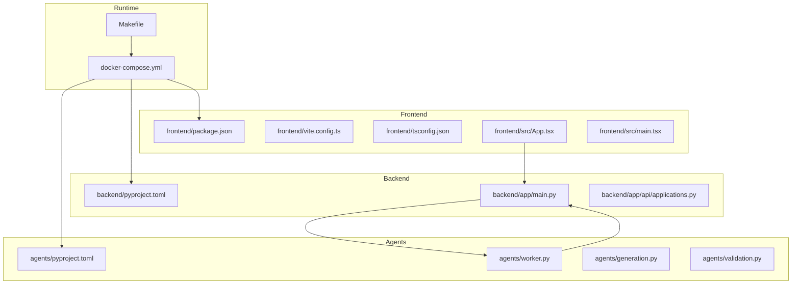
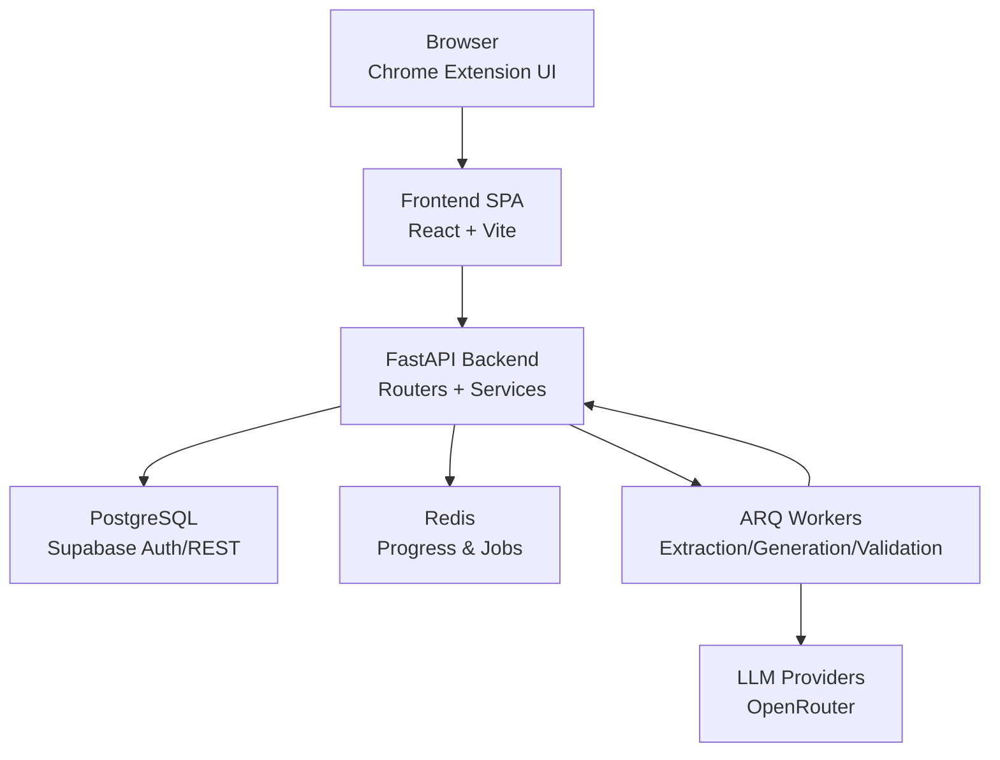
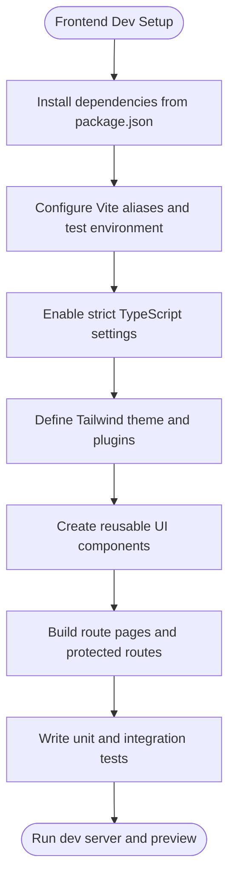
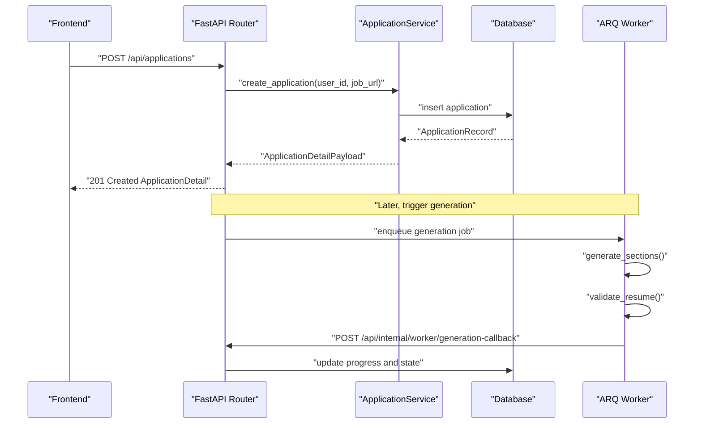
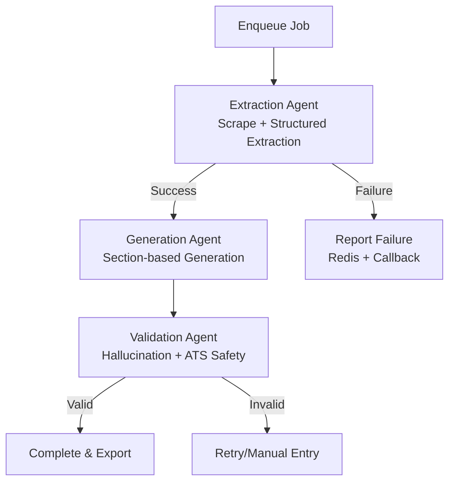
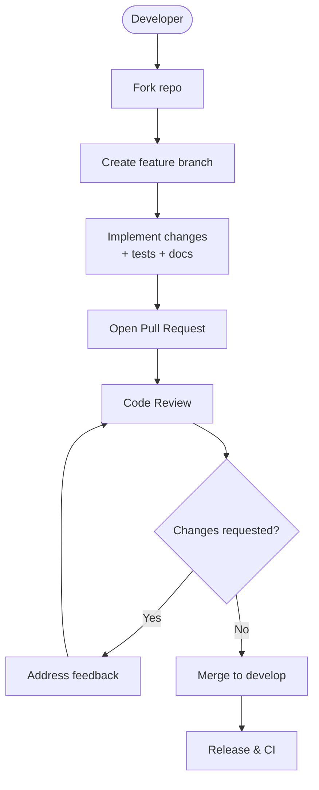
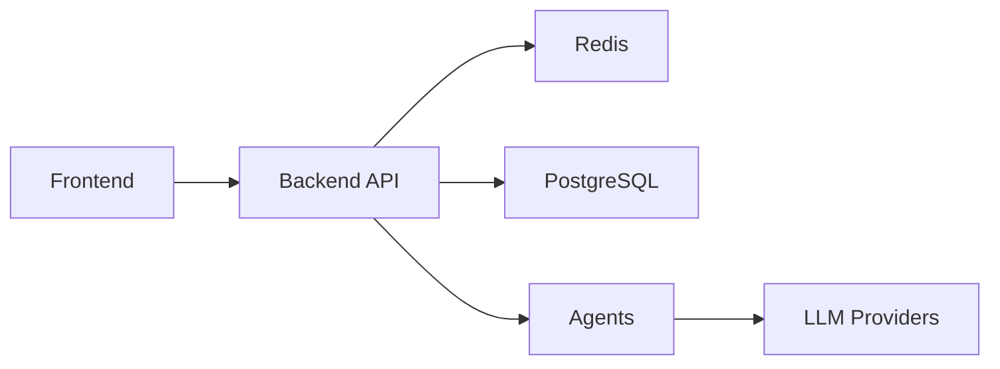

# Development Guidelines

<cite>
**Referenced Files in This Document**
- [package.json](file://frontend/package.json)
- [vite.config.ts](file://frontend/vite.config.ts)
- [tailwind.config.ts](file://frontend/tailwind.config.ts)
- [tsconfig.json](file://frontend/tsconfig.json)
- [App.tsx](file://frontend/src/App.tsx)
- [main.tsx](file://frontend/src/main.tsx)
- [pyproject.toml](file://backend/pyproject.toml)
- [main.py](file://backend/app/main.py)
- [applications.py](file://backend/app/api/applications.py)
- [pyproject.toml](file://agents/pyproject.toml)
- [worker.py](file://agents/worker.py)
- [generation.py](file://agents/generation.py)
- [validation.py](file://agents/validation.py)
- [docker-compose.yml](file://docker-compose.yml)
- [Makefile](file://Makefile)
</cite>

## Table of Contents
1. [Introduction](#introduction)
2. [Project Structure](#project-structure)
3. [Core Components](#core-components)
4. [Architecture Overview](#architecture-overview)
5. [Detailed Component Analysis](#detailed-component-analysis)
6. [Dependency Analysis](#dependency-analysis)
7. [Performance Considerations](#performance-considerations)
8. [Troubleshooting Guide](#troubleshooting-guide)
9. [Contribution Workflow](#contribution-workflow)
10. [Coding Standards](#coding-standards)
11. [Architectural Decision-Making](#architectural-decision-making)
12. [Project Governance](#project-governance)
13. [Mentorship Resources](#mentorship-resources)
14. [Conclusion](#conclusion)

## Introduction
This document provides comprehensive development guidelines for contributing to the AI Resume Builder project. It covers frontend React and TypeScript patterns, backend Python and FastAPI conventions, AI agent development with ARQ and asynchronous processing, Chrome extension architecture and security, and the end-to-end contribution workflow including setup, pull requests, code review, and testing. It also outlines coding standards, architectural decisions, governance, and mentorship resources to help new contributors succeed.

## Project Structure
The project is organized into four primary areas:
- Frontend: React + TypeScript SPA with Vite tooling, routing, and Tailwind CSS
- Backend: FastAPI application with modular routers, services, and database access
- Agents: ARQ-based asynchronous workers orchestrating extraction, generation, and validation
- Shared: Contract definitions and cross-service communication artifacts

**Diagram sources**
- [docker-compose.yml:1-191](file://docker-compose.yml#L1-L191)
- [Makefile:1-30](file://Makefile#L1-L30)
- [frontend/package.json:1-38](file://frontend/package.json#L1-L38)
- [frontend/vite.config.ts:1-24](file://frontend/vite.config.ts#L1-L24)
- [frontend/tsconfig.json:1-8](file://frontend/tsconfig.json#L1-L8)
- [frontend/src/App.tsx:1-36](file://frontend/src/App.tsx#L1-L36)
- [frontend/src/main.tsx:1-14](file://frontend/src/main.tsx#L1-L14)
- [backend/pyproject.toml:1-37](file://backend/pyproject.toml#L1-L37)
- [backend/app/main.py:1-36](file://backend/app/main.py#L1-L36)
- [backend/app/api/applications.py:1-661](file://backend/app/api/applications.py#L1-L661)
- [agents/pyproject.toml:1-26](file://agents/pyproject.toml#L1-L26)
- [agents/worker.py:1-1236](file://agents/worker.py#L1-L1236)
- [agents/generation.py:1-351](file://agents/generation.py#L1-L351)
- [agents/validation.py:1-292](file://agents/validation.py#L1-L292)

**Section sources**
- [docker-compose.yml:1-191](file://docker-compose.yml#L1-L191)
- [Makefile:1-30](file://Makefile#L1-L30)

## Core Components
- Frontend: Single-page application bootstrapped with React and Vite, TypeScript strictness, and Tailwind CSS for styling. Routing is handled by React Router DOM with protected routes and shell layout.
- Backend: FastAPI application exposing modular routers for sessions, profiles, applications, base resumes, extension, and internal worker callbacks. CORS is configured to support Chrome extension origins.
- Agents: ARQ worker module orchestrating extraction, generation, and validation with structured LLM prompts, fallback models, and progress reporting via Redis and callbacks to the backend.
- Runtime: Docker Compose defines services for frontend, backend, agents, Redis, Supabase Auth/REST/Kong, and database migrations; Makefile wraps common commands.

**Section sources**
- [frontend/src/App.tsx:1-36](file://frontend/src/App.tsx#L1-L36)
- [frontend/src/main.tsx:1-14](file://frontend/src/main.tsx#L1-L14)
- [backend/app/main.py:1-36](file://backend/app/main.py#L1-L36)
- [backend/app/api/applications.py:1-661](file://backend/app/api/applications.py#L1-L661)
- [agents/worker.py:1-1236](file://agents/worker.py#L1-L1236)
- [docker-compose.yml:1-191](file://docker-compose.yml#L1-L191)

## Architecture Overview
The system follows a layered architecture:
- Presentation Layer: React SPA with routing and UI components
- API Layer: FastAPI with modular routers and dependency injection
- Service Layer: Business logic encapsulated in services, validated by Pydantic models
- Data Access Layer: Database access via SQLAlchemy models and repositories
- Asynchronous Processing: ARQ workers handle long-running tasks and coordinate with the backend via callbacks and Redis progress storage
- Infrastructure: Docker Compose orchestrates frontend, backend, agents, Redis, and Supabase stack

**Diagram sources**
- [backend/app/main.py:1-36](file://backend/app/main.py#L1-L36)
- [agents/worker.py:1-1236](file://agents/worker.py#L1-L1236)
- [docker-compose.yml:1-191](file://docker-compose.yml#L1-L191)

## Detailed Component Analysis

### Frontend Development Guidelines
- React Patterns
  - Use functional components with hooks for state and effects
  - Keep components small and composable; centralize layout in a shell component
  - Prefer controlled components for forms and validation via Zod
- TypeScript Usage
  - Enable strict mode and type-safe props
  - Define request/response models as TypeScript interfaces aligned with backend schemas
  - Use discriminated unions for variant UI states
- Component Architecture
  - Organize reusable UI primitives under a dedicated UI folder
  - Separate route-level pages and shared components
  - Centralize environment variables via Vite and inject them at runtime
- Tooling
  - Vite for dev server, builds, and test environment
  - Tailwind for utility-first styling with a custom color palette and font families
  - Aliases for cleaner imports (e.g., @/ and @shared/)
- Testing
  - Vitest with jsdom; use Testing Library for component tests
  - Mock external services (e.g., Supabase, API) in unit tests

**Diagram sources**
- [frontend/package.json:1-38](file://frontend/package.json#L1-L38)
- [frontend/vite.config.ts:1-24](file://frontend/vite.config.ts#L1-L24)
- [frontend/tailwind.config.ts:1-25](file://frontend/tailwind.config.ts#L1-L25)
- [frontend/tsconfig.json:1-8](file://frontend/tsconfig.json#L1-L8)
- [frontend/src/App.tsx:1-36](file://frontend/src/App.tsx#L1-L36)
- [frontend/src/main.tsx:1-14](file://frontend/src/main.tsx#L1-L14)

**Section sources**
- [frontend/package.json:1-38](file://frontend/package.json#L1-L38)
- [frontend/vite.config.ts:1-24](file://frontend/vite.config.ts#L1-L24)
- [frontend/tailwind.config.ts:1-25](file://frontend/tailwind.config.ts#L1-L25)
- [frontend/tsconfig.json:1-8](file://frontend/tsconfig.json#L1-L8)
- [frontend/src/App.tsx:1-36](file://frontend/src/App.tsx#L1-L36)
- [frontend/src/main.tsx:1-14](file://frontend/src/main.tsx#L1-L14)

### Backend Development Guidelines (Python/FastAPI)
- FastAPI Conventions
  - Define routers per domain (applications, profiles, base_resumes, extension, internal_worker)
  - Use Pydantic models for request/response validation and normalization
  - Centralize dependency injection via Depends and annotated types
- Service Layer Organization
  - Encapsulate business logic in services; keep routers thin
  - Map domain exceptions to appropriate HTTP status codes
- Security and CORS
  - Configure CORS to allow Chrome extension origins
  - Use secure headers and secrets for internal callbacks
- Database Access
  - Use SQLAlchemy models and repositories; keep queries centralized
- Testing
  - Use pytest with async fixtures; mock external integrations

**Diagram sources**
- [backend/app/api/applications.py:1-661](file://backend/app/api/applications.py#L1-L661)
- [backend/app/main.py:1-36](file://backend/app/main.py#L1-L36)
- [agents/worker.py:1-1236](file://agents/worker.py#L1-L1236)
- [agents/generation.py:1-351](file://agents/generation.py#L1-L351)
- [agents/validation.py:1-292](file://agents/validation.py#L1-L292)

**Section sources**
- [backend/pyproject.toml:1-37](file://backend/pyproject.toml#L1-L37)
- [backend/app/main.py:1-36](file://backend/app/main.py#L1-L36)
- [backend/app/api/applications.py:1-661](file://backend/app/api/applications.py#L1-L661)

### AI Agent Development Guidelines (ARQ/Async)
- ARQ Patterns
  - Use ARQ workers for long-running tasks; define jobs with typed payloads
  - Implement fallback models for resilience; enforce timeouts
  - Report progress to Redis and notify backend via secret-protected callbacks
- Asynchronous Processing
  - Use asyncio for concurrent scraping, LLM calls, and validations
  - Apply structured output parsing with Pydantic models
- Agent Coordination
  - Orchestrate extraction → generation → validation with explicit state transitions
  - Normalize job posting origins and reference IDs; detect blocked pages
- Security
  - Enforce callback secret verification
  - Sanitize inputs and validate outputs rigorously

**Diagram sources**
- [agents/worker.py:1-1236](file://agents/worker.py#L1-L1236)
- [agents/generation.py:1-351](file://agents/generation.py#L1-L351)
- [agents/validation.py:1-292](file://agents/validation.py#L1-L292)

**Section sources**
- [agents/pyproject.toml:1-26](file://agents/pyproject.toml#L1-L26)
- [agents/worker.py:1-1236](file://agents/worker.py#L1-L1236)
- [agents/generation.py:1-351](file://agents/generation.py#L1-L351)
- [agents/validation.py:1-292](file://agents/validation.py#L1-L292)

### Chrome Extension Development Standards
- MV3 Patterns
  - Use service worker for background logic and persistent state
  - Use content script to interact with job posting pages
  - Use isolated world and CSP-compliant messaging
- Security Considerations
  - Restrict permissions to minimal required scope
  - Validate and sanitize all injected content
  - Enforce origin checks and secure transport
- Extension Architecture
  - Popup UI for quick actions and status
  - Manifest v3 with declarativeNetRequest and dynamic registrations as needed
  - Isolate extension assets and avoid inline scripts

[No sources needed since this section provides general guidance]

### Contribution Workflow
- Development Setup
  - Use Docker Compose to provision frontend, backend, agents, Redis, and Supabase stack
  - Run Make targets for up/down/reset/logs/health/test-prepare
- Pull Request Process
  - Branch from develop; include tests and documentation updates
  - Request reviews from maintainers; address feedback promptly
- Code Review Guidelines
  - Focus on correctness, readability, performance, and security
  - Ensure tests cover new logic and regressions are prevented
- Testing Requirements
  - Frontend: Vitest with jsdom; Testing Library assertions
  - Backend: pytest with async fixtures; mock external services
  - Agents: Unit tests for LLM prompts and validation logic; integration tests for callbacks

**Diagram sources**
- [docker-compose.yml:1-191](file://docker-compose.yml#L1-L191)
- [Makefile:1-30](file://Makefile#L1-L30)

**Section sources**
- [docker-compose.yml:1-191](file://docker-compose.yml#L1-L191)
- [Makefile:1-30](file://Makefile#L1-L30)

## Dependency Analysis
- Frontend
  - React 19, React Router DOM, Tailwind CSS, Vitest, TypeScript
  - Aliases and test environment configured in Vite
- Backend
  - FastAPI, ARQ, Redis, Uvicorn, Pydantic Settings, HTTPX, WeasyPrint, PDF-related libraries
- Agents
  - ARQ, LangChain OpenAI, Playwright, Pydantic Settings
- Runtime
  - Docker Compose orchestrates services and volumes; Makefile wraps lifecycle commands

**Diagram sources**
- [frontend/package.json:1-38](file://frontend/package.json#L1-L38)
- [backend/pyproject.toml:1-37](file://backend/pyproject.toml#L1-L37)
- [agents/pyproject.toml:1-26](file://agents/pyproject.toml#L1-L26)
- [docker-compose.yml:1-191](file://docker-compose.yml#L1-L191)

**Section sources**
- [frontend/package.json:1-38](file://frontend/package.json#L1-L38)
- [backend/pyproject.toml:1-37](file://backend/pyproject.toml#L1-L37)
- [agents/pyproject.toml:1-26](file://agents/pyproject.toml#L1-L26)
- [docker-compose.yml:1-191](file://docker-compose.yml#L1-L191)

## Performance Considerations
- Frontend
  - Lazy-load heavy components; minimize re-renders with memoization
  - Optimize Tailwind builds; remove unused styles
- Backend
  - Use connection pooling; batch database writes
  - Cache frequently accessed data; avoid N+1 queries
- Agents
  - Set timeouts for LLM calls; implement exponential backoff
  - Use Playwright headless efficiently; reuse contexts where safe
- Infrastructure
  - Scale Redis and PostgreSQL appropriately; monitor queue backlog

[No sources needed since this section provides general guidance]

## Troubleshooting Guide
- Health Checks
  - Use Makefile health target to probe services
- Logs
  - Stream container logs with Makefile logs target
- Environment
  - Ensure .env.compose exists and variables are set
- Common Issues
  - CORS errors: verify allow_origin_regex and Chrome extension origin
  - Redis connectivity: confirm Redis URL and network access
  - LLM failures: check API keys and fallback models configuration

**Section sources**
- [Makefile:1-30](file://Makefile#L1-L30)
- [docker-compose.yml:1-191](file://docker-compose.yml#L1-L191)
- [backend/app/main.py:1-36](file://backend/app/main.py#L1-L36)

## Coding Standards
- Frontend
  - Use PascalCase for components, camelCase for props and variables
  - Keep imports grouped and alphabetized
  - Write descriptive commit messages and PR descriptions
- Backend
  - Use snake_case for variables and functions; UPPER_CASE for constants
  - Favor immutability; validate inputs early with Pydantic
- Agents
  - Use descriptive function names; document prompt construction
  - Handle timeouts and retries gracefully; log meaningful errors
- General
  - Follow semantic versioning for releases
  - Maintain backward compatibility for APIs when possible

[No sources needed since this section provides general guidance]

## Architectural Decision-Making
- Domain-Driven Design
  - Routers represent bounded contexts; services encapsulate domain logic
- Separation of Concerns
  - Keep UI concerns separate from business logic; isolate data access
- Observability
  - Emit structured logs; track progress via Redis; expose health endpoints
- Security
  - Enforce CORS policies; protect internal callbacks with secrets
  - Sanitize inputs and outputs; restrict extension permissions

[No sources needed since this section provides general guidance]

## Project Governance
- Maintainers
  - Approve PRs; ensure tests and documentation are included
- Contributors
  - Follow contribution workflow; engage respectfully in discussions
- Releases
  - Tag releases; update changelogs; notify stakeholders

[No sources needed since this section provides general guidance]

## Mentorship Resources
- Getting Started
  - Review frontend, backend, and agents setup in Docker Compose
  - Run Make targets to bring up services locally
- Pair Programming
  - Work alongside experienced contributors on complex features
- Documentation
  - Keep docs updated with code changes; link to relevant sections

[No sources needed since this section provides general guidance]

## Conclusion
By adhering to these development guidelines—frontend React and TypeScript best practices, backend FastAPI and service-layer conventions, robust AI agent orchestration, secure Chrome extension architecture, and a clear contribution workflow—you will help maintain a high-quality, scalable, and secure AI Resume Builder platform. Focus on correctness, performance, and security, and leverage the provided tools and patterns to ship reliable features consistently.