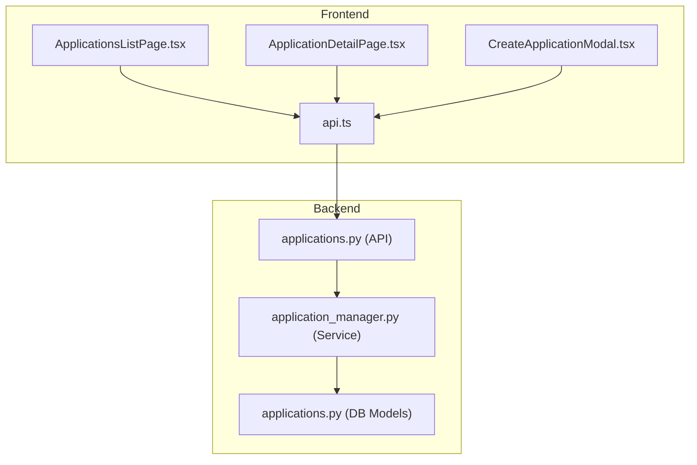
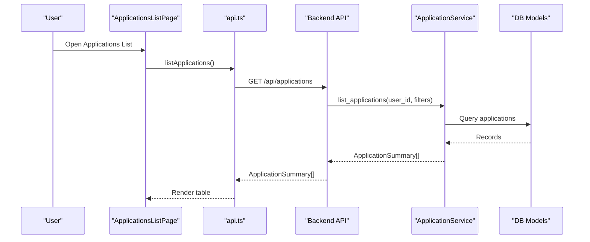
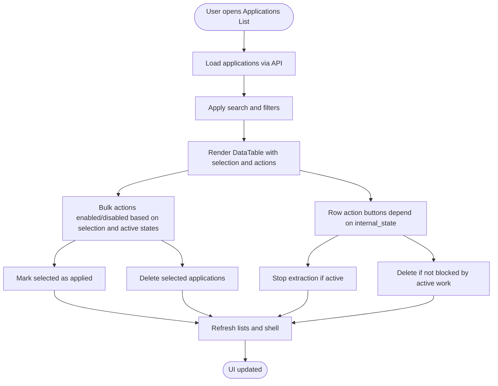
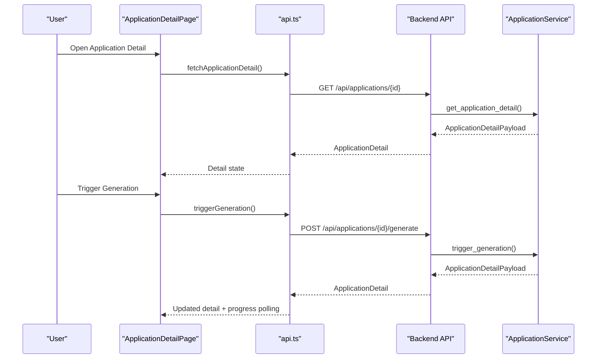
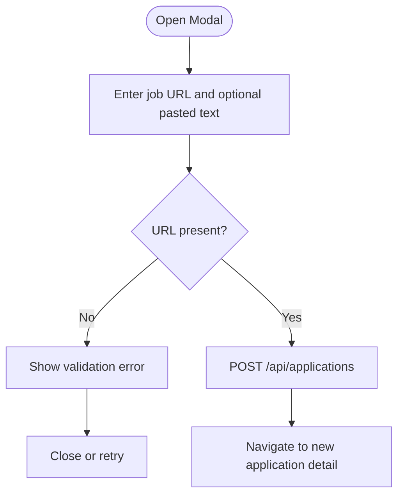
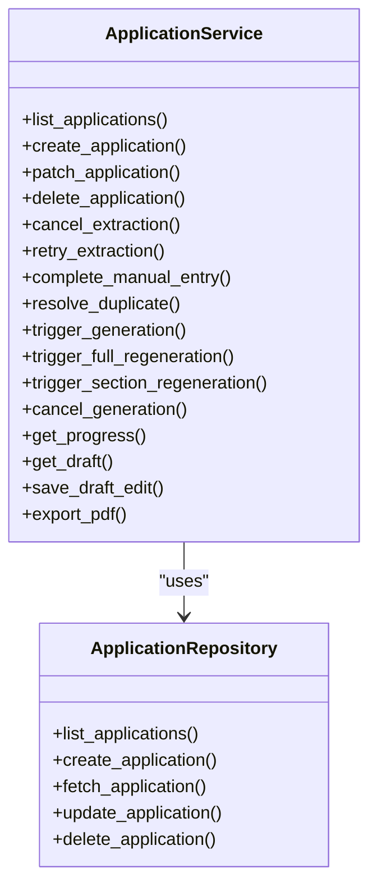
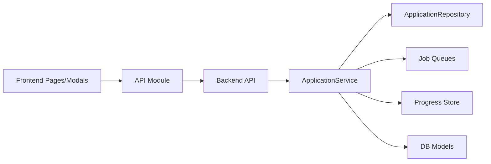

# Application Management Pages

<cite>
**Referenced Files in This Document**
- [ApplicationsListPage.tsx](file://frontend/src/routes/ApplicationsListPage.tsx)
- [ApplicationDetailPage.tsx](file://frontend/src/routes/ApplicationDetailPage.tsx)
- [CreateApplicationModal.tsx](file://frontend/src/components/applications/CreateApplicationModal.tsx)
- [api.ts](file://frontend/src/lib/api.ts)
- [applications.py](file://backend/app/api/applications.py)
- [applications.py](file://backend/app/db/applications.py)
- [application_manager.py](file://backend/app/services/application_manager.py)
</cite>

## Table of Contents
1. [Introduction](#introduction)
2. [Project Structure](#project-structure)
3. [Core Components](#core-components)
4. [Architecture Overview](#architecture-overview)
5. [Detailed Component Analysis](#detailed-component-analysis)
6. [Dependency Analysis](#dependency-analysis)
7. [Performance Considerations](#performance-considerations)
8. [Troubleshooting Guide](#troubleshooting-guide)
9. [Conclusion](#conclusion)

## Introduction
This document describes the Application Management Pages, which enable users to discover, manage, and operate on individual job applications. It covers the frontend pages for listing and viewing applications, the backend APIs and services that power these pages, and the integration points between the UI and the server-side workflow engine.

## Project Structure
The Application Management feature spans three layers:
- Frontend pages and modals that render the UI and orchestrate user interactions
- Frontend API module that encapsulates HTTP requests to the backend
- Backend FastAPI endpoints and service layer that implement application lifecycle operations

**Diagram sources**
- [ApplicationsListPage.tsx:1-698](file://frontend/src/routes/ApplicationsListPage.tsx#L1-L698)
- [ApplicationDetailPage.tsx:1-800](file://frontend/src/routes/ApplicationDetailPage.tsx#L1-L800)
- [CreateApplicationModal.tsx:1-292](file://frontend/src/components/applications/CreateApplicationModal.tsx#L1-L292)
- [api.ts:405-765](file://frontend/src/lib/api.ts#L405-L765)
- [applications.py:426-779](file://backend/app/api/applications.py#L426-L779)
- [application_manager.py:177-205](file://backend/app/services/application_manager.py#L177-L205)
- [applications.py:15-372](file://backend/app/db/applications.py#L15-L372)

**Section sources**
- [ApplicationsListPage.tsx:1-698](file://frontend/src/routes/ApplicationsListPage.tsx#L1-L698)
- [ApplicationDetailPage.tsx:1-800](file://frontend/src/routes/ApplicationDetailPage.tsx#L1-L800)
- [CreateApplicationModal.tsx:1-292](file://frontend/src/components/applications/CreateApplicationModal.tsx#L1-L292)
- [api.ts:405-765](file://frontend/src/lib/api.ts#L405-L765)
- [applications.py:426-779](file://backend/app/api/applications.py#L426-L779)
- [application_manager.py:177-205](file://backend/app/services/application_manager.py#L177-L205)
- [applications.py:15-372](file://backend/app/db/applications.py#L15-L372)

## Core Components
- Applications List Page: Displays paginated, filterable, and searchable application rows with selection capabilities, bulk actions, and row-level actions (mark applied, delete, stop extraction).
- Application Detail Page: Shows detailed job information, generation controls, draft editing, export, and recovery options.
- Create Application Modal: Provides a form to create new applications via job URL and optional pasted job text.
- Frontend API Module: Centralizes authenticated HTTP calls to backend endpoints for listing, creating, updating, deleting, and workflow operations.
- Backend API: Exposes endpoints for CRUD operations, progress polling, generation triggers, and exports.
- Application Service: Implements business logic for application lifecycle, progress tracking, duplicate detection, and workflow transitions.

**Section sources**
- [ApplicationsListPage.tsx:91-698](file://frontend/src/routes/ApplicationsListPage.tsx#L91-L698)
- [ApplicationDetailPage.tsx:133-800](file://frontend/src/routes/ApplicationDetailPage.tsx#L133-L800)
- [CreateApplicationModal.tsx:22-292](file://frontend/src/components/applications/CreateApplicationModal.tsx#L22-L292)
- [api.ts:405-765](file://frontend/src/lib/api.ts#L405-L765)
- [applications.py:426-779](file://backend/app/api/applications.py#L426-L779)
- [application_manager.py:177-205](file://backend/app/services/application_manager.py#L177-L205)

## Architecture Overview
The Application Management Pages follow a clean separation of concerns:
- UI renders state and user interactions
- API module handles authentication and request/response normalization
- Backend API validates and routes requests to the service layer
- Service orchestrates repositories, queues, and progress stores
- Database models define persistence contracts

**Diagram sources**
- [ApplicationsListPage.tsx:114-124](file://frontend/src/routes/ApplicationsListPage.tsx#L114-L124)
- [api.ts:405-407](file://frontend/src/lib/api.ts#L405-L407)
- [applications.py:426-438](file://backend/app/api/applications.py#L426-L438)
- [application_manager.py:206-217](file://backend/app/services/application_manager.py#L206-L217)
- [applications.py:139-167](file://backend/app/db/applications.py#L139-L167)

## Detailed Component Analysis

### Applications List Page
Responsibilities:
- Load and display applications with status badges, job/company metadata, base resume, and timestamps
- Filter by status and applied state; search by job title or company
- Bulk selection and actions (mark applied, delete)
- Row-level actions (stop extraction, delete) with safety checks against active workflows
- Real-time refresh via notifications and periodic progress polling

Key behaviors:
- Selection state management with visible page IDs and bulk applicability filtering
- Active workflow blocking sets delete availability and UX messaging
- Optimistic UI updates during bulk operations with error consolidation

**Diagram sources**
- [ApplicationsListPage.tsx:114-356](file://frontend/src/routes/ApplicationsListPage.tsx#L114-L356)
- [ApplicationsListPage.tsx:358-506](file://frontend/src/routes/ApplicationsListPage.tsx#L358-L506)

**Section sources**
- [ApplicationsListPage.tsx:91-698](file://frontend/src/routes/ApplicationsListPage.tsx#L91-L698)

### Application Detail Page
Responsibilities:
- Display detailed job information, status badges, and action-required indicators
- Manage job info edits, manual entry submission, and duplicate warnings
- Control generation lifecycle: start, cancel, full regeneration, section regeneration
- Draft editing and saving, PDF export, and recovery from source text
- Progress polling for extraction and generation workflows

Key behaviors:
- Derives visible status from internal state and failure reason
- Polls progress for extraction and generation until completion or terminal state
- Supports optimistic progress UI during generation triggers
- Handles export success/failure and updates application state accordingly

**Diagram sources**
- [ApplicationDetailPage.tsx:274-356](file://frontend/src/routes/ApplicationDetailPage.tsx#L274-L356)
- [ApplicationDetailPage.tsx:563-583](file://frontend/src/routes/ApplicationDetailPage.tsx#L563-L583)
- [api.ts:421-423](file://frontend/src/lib/api.ts#L421-L423)
- [api.ts:685-698](file://frontend/src/lib/api.ts#L685-L698)
- [applications.py:661-680](file://backend/app/api/applications.py#L661-L680)
- [application_manager.py:839-893](file://backend/app/services/application_manager.py#L839-L893)

**Section sources**
- [ApplicationDetailPage.tsx:133-800](file://frontend/src/routes/ApplicationDetailPage.tsx#L133-L800)
- [api.ts:421-423](file://frontend/src/lib/api.ts#L421-L423)
- [api.ts:685-698](file://frontend/src/lib/api.ts#L685-L698)
- [applications.py:661-680](file://backend/app/api/applications.py#L661-L680)
- [application_manager.py:839-893](file://backend/app/services/application_manager.py#L839-L893)

### Create Application Modal
Responsibilities:
- Collect job URL and optional pasted job text
- Validate inputs and surface errors
- Submit creation request and navigate to the new application detail

**Diagram sources**
- [CreateApplicationModal.tsx:81-104](file://frontend/src/components/applications/CreateApplicationModal.tsx#L81-L104)
- [api.ts:414-419](file://frontend/src/lib/api.ts#L414-L419)
- [applications.py:441-470](file://backend/app/api/applications.py#L441-L470)

**Section sources**
- [CreateApplicationModal.tsx:22-292](file://frontend/src/components/applications/CreateApplicationModal.tsx#L22-L292)
- [api.ts:414-419](file://frontend/src/lib/api.ts#L414-L419)
- [applications.py:441-470](file://backend/app/api/applications.py#L441-L470)

### Backend API and Service Layer
Endpoints and operations:
- List, create, update, delete applications
- Cancel/retry extraction
- Manual entry submission and duplicate resolution
- Progress retrieval and draft access
- Generation triggers (initial, full regeneration, section regeneration), cancellation
- Draft save and PDF export

Service responsibilities:
- Enforces state-based permissions (e.g., deletion blocked during active work)
- Manages progress store and synthesis of progress for terminal states
- Orchestrates job queues for extraction and generation
- Handles timeouts and recovery for stuck generation
- Updates notifications and usage metrics

**Diagram sources**
- [application_manager.py:177-205](file://backend/app/services/application_manager.py#L177-L205)
- [applications.py:130-372](file://backend/app/db/applications.py#L130-L372)

**Section sources**
- [applications.py:426-779](file://backend/app/api/applications.py#L426-L779)
- [application_manager.py:177-205](file://backend/app/services/application_manager.py#L177-L205)
- [applications.py:130-372](file://backend/app/db/applications.py#L130-L372)

## Dependency Analysis
- Frontend depends on the API module for all backend communication
- API module depends on Supabase for authentication and environment configuration
- Backend API depends on ApplicationService for business logic
- ApplicationService depends on repositories, job queues, progress store, and notification/email services
- Database models define the schema and relationships for applications, drafts, and related metadata

**Diagram sources**
- [api.ts:289-326](file://frontend/src/lib/api.ts#L289-L326)
- [applications.py:23-23](file://backend/app/api/applications.py#L23-L23)
- [application_manager.py:177-205](file://backend/app/services/application_manager.py#L177-L205)
- [applications.py:130-372](file://backend/app/db/applications.py#L130-L372)

**Section sources**
- [api.ts:289-326](file://frontend/src/lib/api.ts#L289-L326)
- [applications.py:23-23](file://backend/app/api/applications.py#L23-L23)
- [application_manager.py:177-205](file://backend/app/services/application_manager.py#L177-L205)
- [applications.py:130-372](file://backend/app/db/applications.py#L130-L372)

## Performance Considerations
- Pagination and virtualization: The list page uses a fixed page size and skeleton placeholders to keep rendering responsive under large datasets.
- Optimistic UI: Generation triggers and cancellations update the UI immediately, reducing perceived latency while awaiting server confirmation.
- Polling cadence: Progress polling runs at a fixed interval; avoid excessive polling by leveraging terminal progress states and notifications.
- Bulk operations: Batched requests reduce network overhead; ensure proper error consolidation and user feedback.
- Export timeouts: PDF generation has explicit timeout handling to prevent long-running operations from blocking the UI.

## Troubleshooting Guide
Common issues and resolutions:
- Unable to delete application: Occurs when the application is in an active workflow state. Wait for the operation to complete or cancel it before deleting.
- Generation stuck: The service detects idle/max timeouts and transitions the application to a terminal state with appropriate failure reasons and notifications.
- Export failures: Errors during PDF export are handled gracefully with notifications and state restoration.
- Progress desynchronization: The service synthesizes progress for terminal states and clears stale notifications to maintain consistency.

Operational checks:
- Verify active workflow states and disable conflicting actions (e.g., delete during generation).
- Monitor progress endpoints for terminal states and completion timestamps.
- Review notification events to identify action-required prompts.

**Section sources**
- [ApplicationsListPage.tsx:328-356](file://frontend/src/routes/ApplicationsListPage.tsx#L328-L356)
- [ApplicationDetailPage.tsx:563-583](file://frontend/src/routes/ApplicationDetailPage.tsx#L563-L583)
- [application_manager.py:569-642](file://backend/app/services/application_manager.py#L569-L642)
- [application_manager.py:1501-1541](file://backend/app/services/application_manager.py#L1501-L1541)

## Conclusion
The Application Management Pages provide a robust, user-friendly interface for discovering, managing, and operating on job applications. The frontend pages coordinate with a centralized API module, which delegates to backend services that enforce state-aware workflows, track progress, and integrate with job queues and persistence. Together, these components deliver a reliable experience for application lifecycle management, from initial intake through generation, editing, and export.