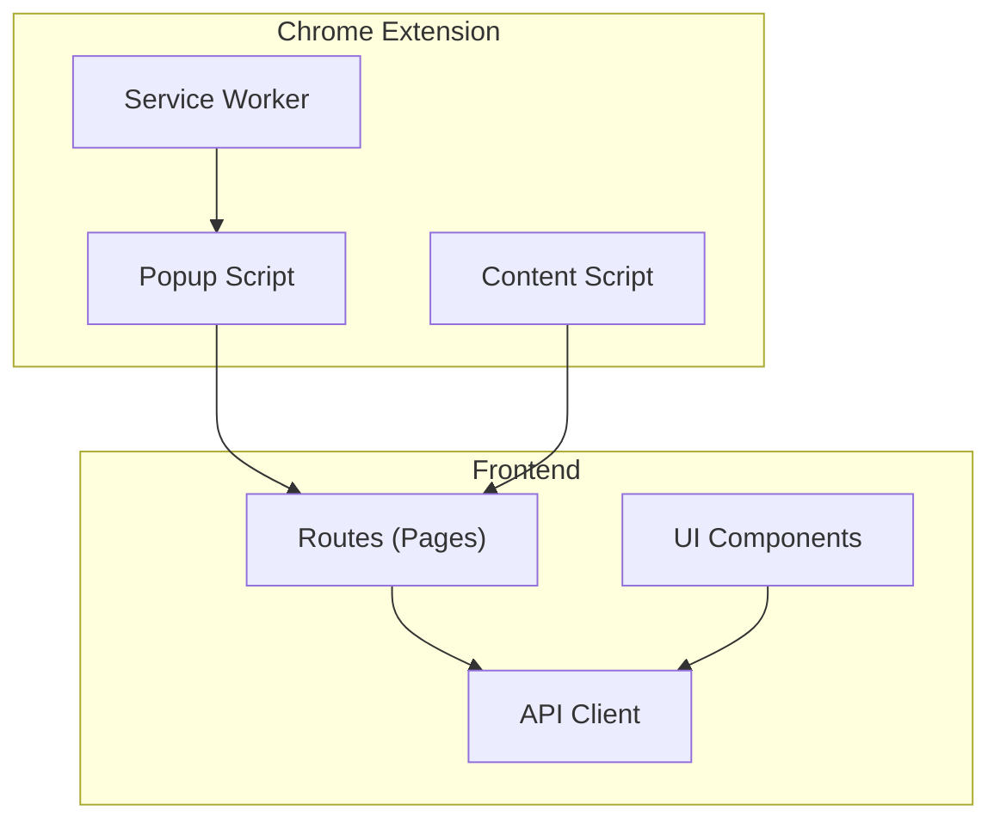
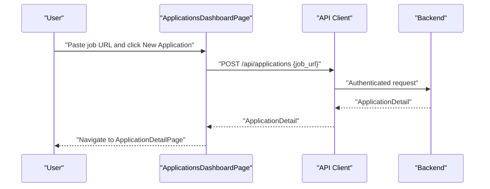
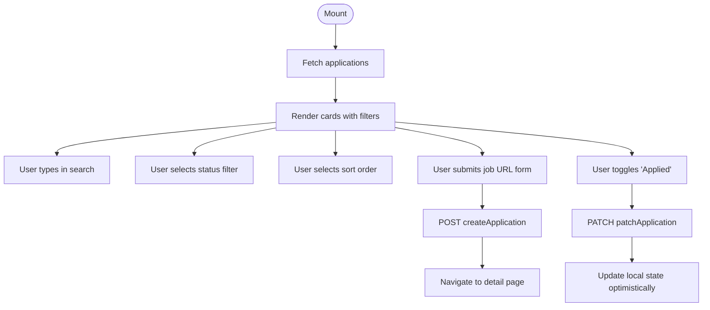
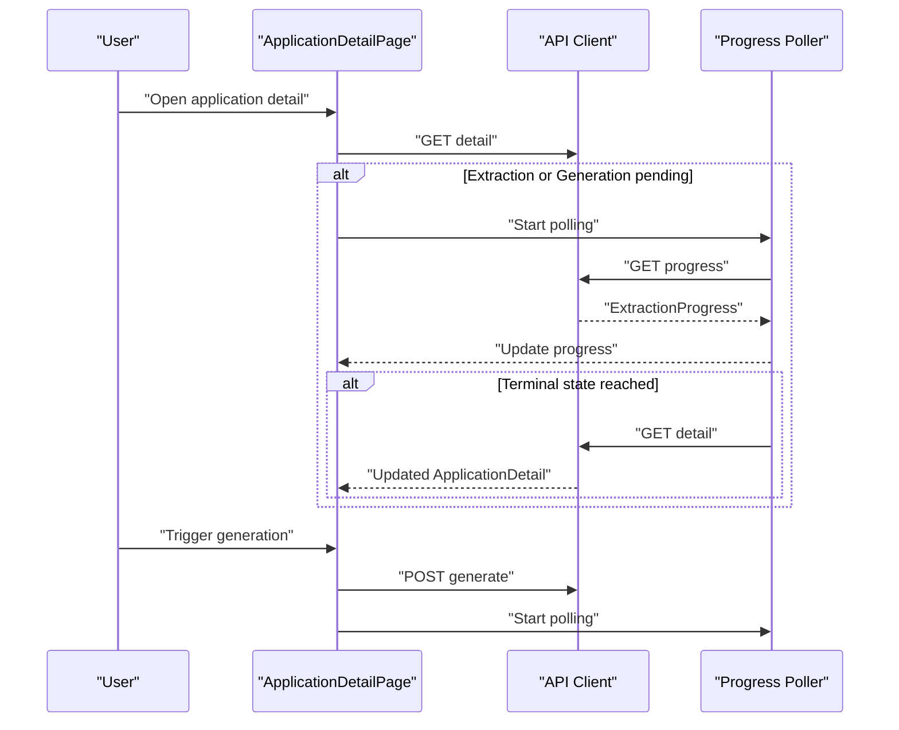
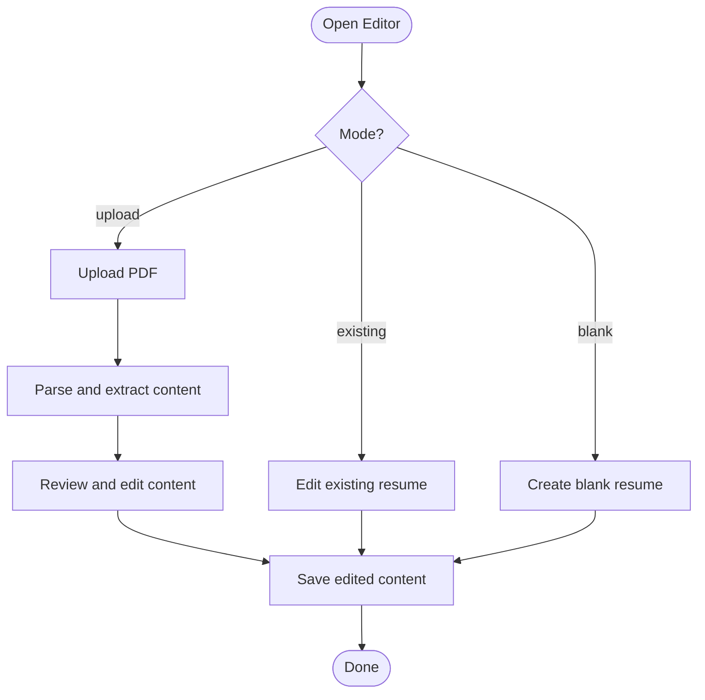
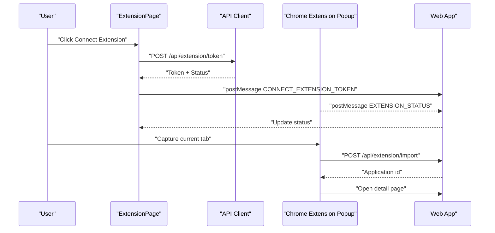
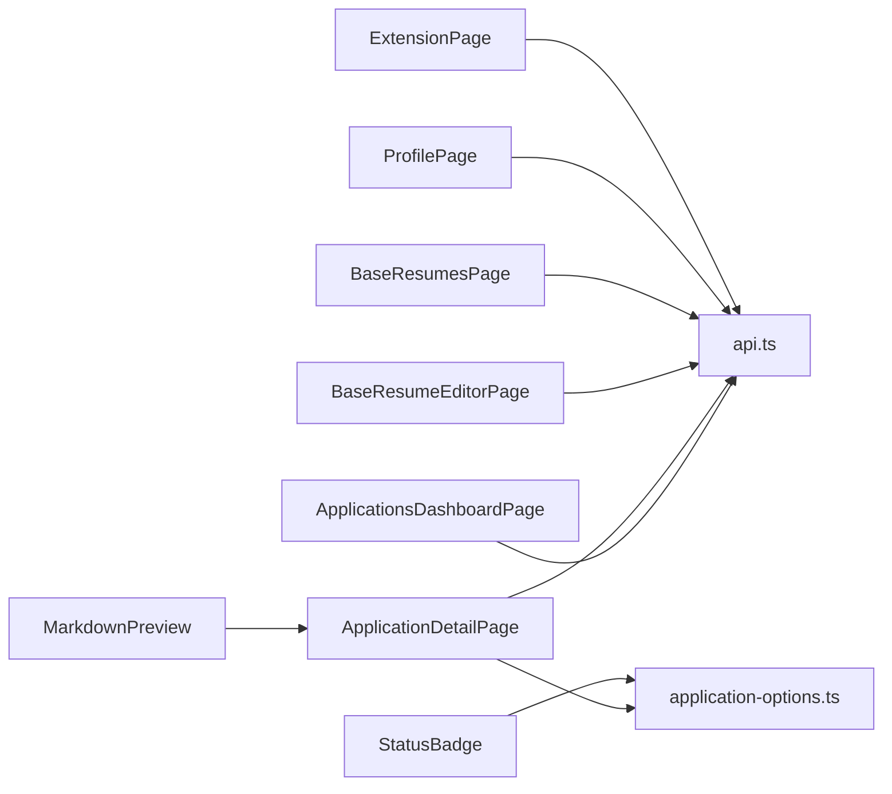

# Application Pages

<cite>
**Referenced Files in This Document**
- [ApplicationsDashboardPage.tsx](file://frontend/src/routes/ApplicationsDashboardPage.tsx)
- [ApplicationDetailPage.tsx](file://frontend/src/routes/ApplicationDetailPage.tsx)
- [BaseResumeEditorPage.tsx](file://frontend/src/routes/BaseResumeEditorPage.tsx)
- [BaseResumesPage.tsx](file://frontend/src/routes/BaseResumesPage.tsx)
- [ExtensionPage.tsx](file://frontend/src/routes/ExtensionPage.tsx)
- [ProfilePage.tsx](file://frontend/src/routes/ProfilePage.tsx)
- [api.ts](file://frontend/src/lib/api.ts)
- [application-options.ts](file://frontend/src/lib/application-options.ts)
- [StatusBadge.tsx](file://frontend/src/components/StatusBadge.tsx)
- [MarkdownPreview.tsx](file://frontend/src/components/MarkdownPreview.tsx)
- [popup.js](file://frontend/public/chrome-extension/popup.js)
- [content-script.js](file://frontend/public/chrome-extension/content-script.js)
- [service-worker.js](file://frontend/public/chrome-extension/service-worker.js)
</cite>

## Table of Contents
1. [Introduction](#introduction)
2. [Project Structure](#project-structure)
3. [Core Components](#core-components)
4. [Architecture Overview](#architecture-overview)
5. [Detailed Component Analysis](#detailed-component-analysis)
6. [Dependency Analysis](#dependency-analysis)
7. [Performance Considerations](#performance-considerations)
8. [Troubleshooting Guide](#troubleshooting-guide)
9. [Conclusion](#conclusion)

## Introduction
This document provides comprehensive documentation for all application pages and their functionality. It covers:
- ApplicationsDashboardPage: job application listings with filtering and sorting
- ApplicationDetailPage: individual application views including status tracking and progress indicators
- BaseResumeEditorPage: AI-generated resume editing with section-based content management
- BaseResumesPage: managing existing base resumes
- ProfilePage: user account settings and preferences
- ExtensionPage: Chrome extension integration and job capture workflow

It also documents page-specific state management, data fetching patterns, user interaction flows, and responsive/mobile optimization considerations.

## Project Structure
The application pages live under the frontend routes directory and rely on a shared API client for authenticated requests. UI components include reusable badge and markdown preview utilities. The Chrome extension resides under public/chrome-extension and communicates via postMessage and storage APIs.

**Diagram sources**
- [ApplicationsDashboardPage.tsx:1-264](file://frontend/src/routes/ApplicationsDashboardPage.tsx#L1-L264)
- [ApplicationDetailPage.tsx:1-800](file://frontend/src/routes/ApplicationDetailPage.tsx#L1-L800)
- [BaseResumeEditorPage.tsx:1-472](file://frontend/src/routes/BaseResumeEditorPage.tsx#L1-L472)
- [BaseResumesPage.tsx:1-185](file://frontend/src/routes/BaseResumesPage.tsx#L1-L185)
- [ExtensionPage.tsx:1-200](file://frontend/src/routes/ExtensionPage.tsx#L1-L200)
- [ProfilePage.tsx:1-264](file://frontend/src/routes/ProfilePage.tsx#L1-L264)
- [api.ts:1-489](file://frontend/src/lib/api.ts#L1-L489)
- [popup.js:1-156](file://frontend/public/chrome-extension/popup.js#L1-L156)
- [content-script.js:1-118](file://frontend/public/chrome-extension/content-script.js#L1-L118)
- [service-worker.js:1-37](file://frontend/public/chrome-extension/service-worker.js#L1-L37)

**Section sources**
- [ApplicationsDashboardPage.tsx:1-264](file://frontend/src/routes/ApplicationsDashboardPage.tsx#L1-L264)
- [ApplicationDetailPage.tsx:1-800](file://frontend/src/routes/ApplicationDetailPage.tsx#L1-L800)
- [BaseResumeEditorPage.tsx:1-472](file://frontend/src/routes/BaseResumeEditorPage.tsx#L1-L472)
- [BaseResumesPage.tsx:1-185](file://frontend/src/routes/BaseResumesPage.tsx#L1-L185)
- [ExtensionPage.tsx:1-200](file://frontend/src/routes/ExtensionPage.tsx#L1-L200)
- [ProfilePage.tsx:1-264](file://frontend/src/routes/ProfilePage.tsx#L1-L264)
- [api.ts:1-489](file://frontend/src/lib/api.ts#L1-L489)

## Core Components
- StatusBadge: renders status labels with color-coded styles based on visible status.
- MarkdownPreview: renders Markdown content with GitHub Flavored Markdown support.
- API client: centralized authenticated requests for applications, base resumes, profile, and extension operations.

Key responsibilities:
- StatusBadge: maps status keys to labels and applies Tailwind classes for visual distinction.
- MarkdownPreview: wraps react-markdown with remarkGfm for GFM compatibility.
- API client: handles bearer token acquisition, request dispatch, error parsing, and upload flows.

**Section sources**
- [StatusBadge.tsx:1-23](file://frontend/src/components/StatusBadge.tsx#L1-L23)
- [MarkdownPreview.tsx:1-16](file://frontend/src/components/MarkdownPreview.tsx#L1-L16)
- [api.ts:177-238](file://frontend/src/lib/api.ts#L177-L238)

## Architecture Overview
The pages follow a unidirectional data flow:
- Pages fetch data via the API client and manage local state.
- UI components render data and trigger actions that call API functions.
- For long-running operations, pages poll progress endpoints and update state accordingly.
- The Chrome extension communicates via postMessage to the web app and backend.

**Diagram sources**
- [ApplicationsDashboardPage.tsx:46-59](file://frontend/src/routes/ApplicationsDashboardPage.tsx#L46-L59)
- [api.ts:248-253](file://frontend/src/lib/api.ts#L248-L253)

**Section sources**
- [ApplicationsDashboardPage.tsx:1-264](file://frontend/src/routes/ApplicationsDashboardPage.tsx#L1-L264)
- [api.ts:244-253](file://frontend/src/lib/api.ts#L244-L253)

## Detailed Component Analysis

### ApplicationsDashboardPage
Purpose:
- Lists job applications with search, status filter, and sort controls.
- Creates new applications from a job URL.
- Shows status badges, duplicate warnings, and action-required indicators.
- Supports optimistic applied-state toggling with rollback on error.

State management:
- Local state for applications, filters (search, status, sort), and creation/loading flags.
- Deferred search using useDeferredValue for smoother UI during typing.
- Optimistic UI updates for applied toggle with server-side reconciliation.

Data fetching:
- Initial load via listApplications.
- Creation via createApplication; navigates to detail page upon success.

User interactions:
- Search by job title/company.
- Filter by visible status.
- Sort by newest/oldest updated.
- Toggle applied checkbox.
- Click application cards to view details.

Responsive/mobile:
- Flexbox and grid layouts adapt to narrow screens.
- Buttons and inputs scale appropriately; long lists wrap content.

**Diagram sources**
- [ApplicationsDashboardPage.tsx:16-96](file://frontend/src/routes/ApplicationsDashboardPage.tsx#L16-L96)
- [api.ts:248-267](file://frontend/src/lib/api.ts#L248-L267)

**Section sources**
- [ApplicationsDashboardPage.tsx:1-264](file://frontend/src/routes/ApplicationsDashboardPage.tsx#L1-L264)
- [api.ts:244-267](file://frontend/src/lib/api.ts#L244-L267)

### ApplicationDetailPage
Purpose:
- Displays detailed application state, progress, and controls.
- Manages job info editing, manual entry, duplicate review, generation, and PDF export.
- Polls progress for extraction and generation/regeneration states.
- Edits resume draft content and triggers targeted regeneration.

State management:
- Detail, progress, and draft state.
- Notes autosave with debounced persistence.
- Settings for base resume selection, page length, aggressiveness, and additional instructions.
- Edit mode for draft Markdown content.
- Optimistic progress display during generation.

Data fetching:
- fetchApplicationDetail on mount.
- fetchApplicationProgress on state transitions to pending/generating.
- fetchDraft when resume-ready or regenerating.
- listBaseResumes when generation settings become visible.

Actions:
- Save job info edits.
- Retry extraction.
- Recover from source text.
- Manual entry submission.
- Duplicate dismissal/open existing.
- Trigger generation/full regeneration/section regeneration.
- Save draft and export PDF.

**Diagram sources**
- [ApplicationDetailPage.tsx:89-154](file://frontend/src/routes/ApplicationDetailPage.tsx#L89-L154)
- [api.ts:255-300](file://frontend/src/lib/api.ts#L255-L300)
- [api.ts:414-427](file://frontend/src/lib/api.ts#L414-L427)

**Section sources**
- [ApplicationDetailPage.tsx:1-800](file://frontend/src/routes/ApplicationDetailPage.tsx#L1-L800)
- [api.ts:85-110](file://frontend/src/lib/api.ts#L85-L110)
- [api.ts:255-300](file://frontend/src/lib/api.ts#L255-L300)
- [api.ts:414-466](file://frontend/src/lib/api.ts#L414-L466)

### BaseResumeEditorPage
Purpose:
- Create/edit base resumes from scratch or via PDF upload.
- AI-assisted cleanup of extracted content.
- Set default resume and delete existing ones.
- Edit name and Markdown content; save changes.

Modes:
- New from blank: mode=blank
- New from upload: mode=upload, then review mode
- Edit existing: default mode

State management:
- Tracks name, content_md, save state, upload progress, deletion, default setting.
- Handles uploaded resume preview and subsequent save.

Data fetching:
- fetchBaseResume for existing.
- createBaseResume for blank mode.
- uploadBaseResume for PDF upload with optional LLM cleanup.
- updateBaseResume for saves.
- setDefaultBaseResume and deleteBaseResume.

**Diagram sources**
- [BaseResumeEditorPage.tsx:19-166](file://frontend/src/routes/BaseResumeEditorPage.tsx#L19-L166)
- [api.ts:334-353](file://frontend/src/lib/api.ts#L334-L353)
- [api.ts:385-397](file://frontend/src/lib/api.ts#L385-L397)

**Section sources**
- [BaseResumeEditorPage.tsx:1-472](file://frontend/src/routes/BaseResumeEditorPage.tsx#L1-L472)
- [api.ts:135-150](file://frontend/src/lib/api.ts#L135-L150)
- [api.ts:334-397](file://frontend/src/lib/api.ts#L334-L397)

### BaseResumesPage
Purpose:
- List base resumes with default indicator and metadata.
- Set default and delete resumes.
- Navigate to editor for each resume.

State management:
- Resumes array, error state, and action-in-progress flags.

Data fetching:
- listBaseResumes on mount.
- setDefaultBaseResume and deleteBaseResume with reload.

**Section sources**
- [BaseResumesPage.tsx:1-185](file://frontend/src/routes/BaseResumesPage.tsx#L1-L185)
- [api.ts:330-332](file://frontend/src/lib/api.ts#L330-L332)
- [api.ts:379-383](file://frontend/src/lib/api.ts#L379-L383)

### ProfilePage
Purpose:
- Manage personal information and resume section preferences.
- Configure section visibility and ordering.
- Persist changes via updateProfile.

State management:
- Profile data, section preferences, and section order.
- Dirty detection compares against original state.
- Save state (idle/saving/saved) with feedback.

Data fetching:
- fetchProfile on mount.
- updateProfile on save.

**Section sources**
- [ProfilePage.tsx:1-264](file://frontend/src/routes/ProfilePage.tsx#L1-L264)
- [api.ts:401-410](file://frontend/src/lib/api.ts#L401-L410)

### ExtensionPage
Purpose:
- Connect/disconnect the Chrome extension for current-tab capture.
- Issue/revoke scoped import tokens.
- Observe extension bridge status via postMessage.

State management:
- Extension status, bridge detection, messages, errors, and action flags.

Data fetching:
- fetchExtensionStatus on mount.
- issueExtensionToken and revokeExtensionToken for lifecycle management.

Chrome extension integration:
- PostMessage bridge: REQUEST_EXTENSION_STATUS, CONNECT_EXTENSION_TOKEN, REVOKE_EXTENSION_TOKEN.
- Popup captures current tab and posts import request to backend.

**Diagram sources**
- [ExtensionPage.tsx:26-125](file://frontend/src/routes/ExtensionPage.tsx#L26-L125)
- [popup.js:95-136](file://frontend/public/chrome-extension/popup.js#L95-L136)
- [content-script.js:76-117](file://frontend/public/chrome-extension/content-script.js#L76-L117)
- [service-worker.js:1-37](file://frontend/public/chrome-extension/service-worker.js#L1-L37)

**Section sources**
- [ExtensionPage.tsx:1-200](file://frontend/src/routes/ExtensionPage.tsx#L1-L200)
- [popup.js:1-156](file://frontend/public/chrome-extension/popup.js#L1-L156)
- [content-script.js:1-118](file://frontend/public/chrome-extension/content-script.js#L1-L118)
- [service-worker.js:1-37](file://frontend/public/chrome-extension/service-worker.js#L1-L37)

## Dependency Analysis
- Pages depend on the API client for all backend interactions.
- ApplicationDetailPage depends on application-options for generation settings and status labels.
- UI components (StatusBadge, MarkdownPreview) are reused across pages.
- ExtensionPage coordinates with Chrome extension scripts via postMessage and storage.

**Diagram sources**
- [ApplicationsDashboardPage.tsx:1-12](file://frontend/src/routes/ApplicationsDashboardPage.tsx#L1-L12)
- [ApplicationDetailPage.tsx:1-28](file://frontend/src/routes/ApplicationDetailPage.tsx#L1-L28)
- [BaseResumeEditorPage.tsx:1-15](file://frontend/src/routes/BaseResumeEditorPage.tsx#L1-L15)
- [BaseResumesPage.tsx:1-10](file://frontend/src/routes/BaseResumesPage.tsx#L1-L10)
- [ProfilePage.tsx:1-6](file://frontend/src/routes/ProfilePage.tsx#L1-L6)
- [ExtensionPage.tsx:1-10](file://frontend/src/routes/ExtensionPage.tsx#L1-L10)
- [StatusBadge.tsx:1-6](file://frontend/src/components/StatusBadge.tsx#L1-L6)
- [MarkdownPreview.tsx:1-7](file://frontend/src/components/MarkdownPreview.tsx#L1-L7)
- [application-options.ts:1-31](file://frontend/src/lib/application-options.ts#L1-L31)
- [api.ts:1-489](file://frontend/src/lib/api.ts#L1-L489)

**Section sources**
- [api.ts:1-489](file://frontend/src/lib/api.ts#L1-L489)
- [application-options.ts:1-31](file://frontend/src/lib/application-options.ts#L1-L31)

## Performance Considerations
- Deferred search: useDeferredValue reduces layout thrash during rapid typing in the dashboard.
- Optimistic UI: immediate applied-state toggles improve perceived responsiveness; server responses reconcile state.
- Polling intervals: progress polling runs at fixed intervals; stop polling when terminal states are reached.
- Debounced autosave: notes autosave uses a timeout to avoid frequent network requests.
- Conditional rendering: skeleton loaders reduce layout shifts while data loads.
- Mobile-first grids: responsive breakpoints ensure readable content on small screens.

## Troubleshooting Guide
Common issues and remedies:
- Authentication failures: ensure a valid session exists; the API client throws if access token is missing.
- Request errors: API client parses error details from JSON responses; display user-friendly messages.
- Extension connectivity: verify token issuance, bridge detection, and trusted app URL checks.
- Progress polling: ensure internal_state transitions out of pending/generating to stop polling.
- PDF uploads: confirm file type and size constraints; optional LLM cleanup flag can be toggled.

**Section sources**
- [api.ts:177-238](file://frontend/src/lib/api.ts#L177-L238)
- [ExtensionPage.tsx:35-72](file://frontend/src/routes/ExtensionPage.tsx#L35-L72)
- [ApplicationDetailPage.tsx:102-154](file://frontend/src/routes/ApplicationDetailPage.tsx#L102-L154)

## Conclusion
The application pages implement a cohesive, authenticated frontend with robust state management and clear user workflows. Filtering and sorting in the dashboard streamline discovery, while the detail page provides comprehensive controls for progress tracking, generation, and export. The base resume management supports flexible authoring and AI-assisted cleanup. The Chrome extension integration enables seamless job capture and navigation to application detail pages. Responsive design and optimistic UI patterns contribute to a smooth user experience across devices.