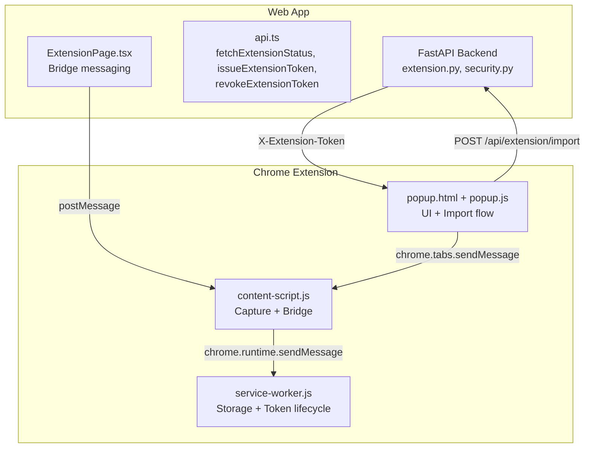
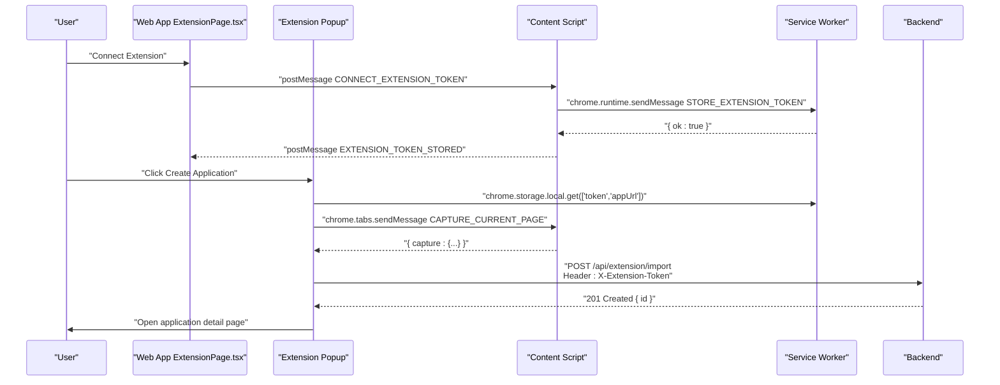
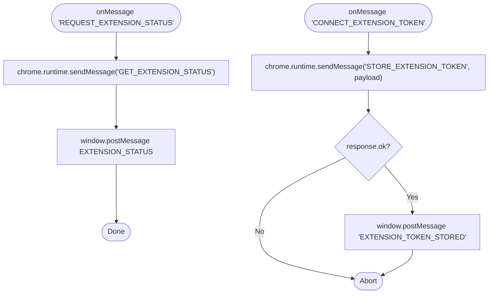
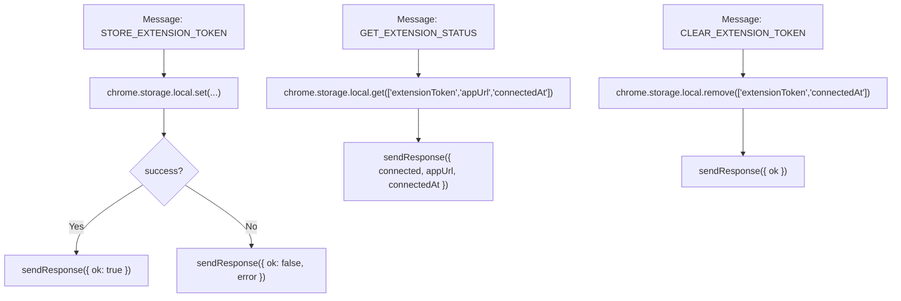
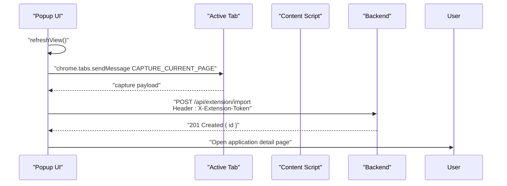
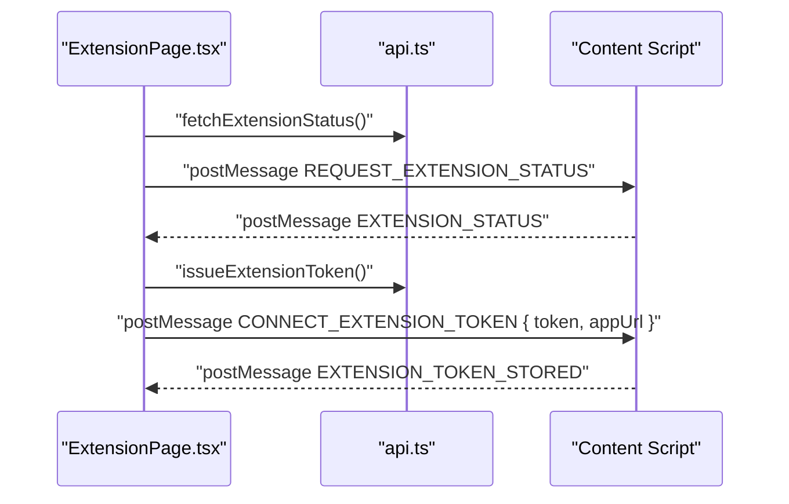
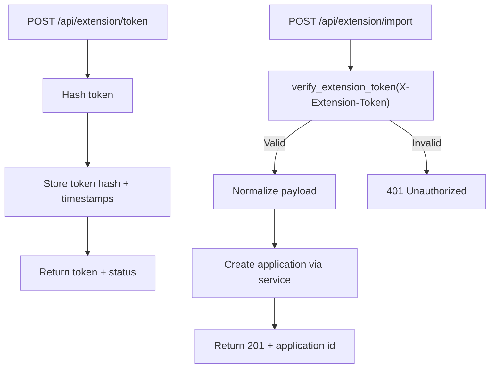
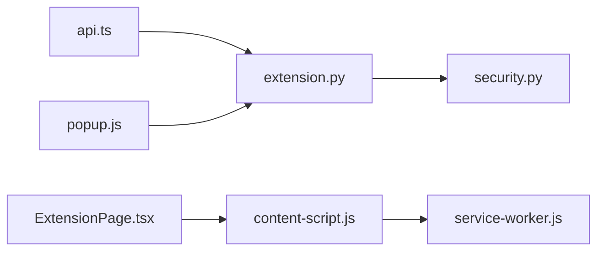

# Chrome Extension Integration

<cite>
**Referenced Files in This Document**
- [manifest.json](file://frontend/public/chrome-extension/manifest.json)
- [content-script.js](file://frontend/public/chrome-extension/content-script.js)
- [service-worker.js](file://frontend/public/chrome-extension/service-worker.js)
- [popup.html](file://frontend/public/chrome-extension/popup.html)
- [popup.js](file://frontend/public/chrome-extension/popup.js)
- [popup.css](file://frontend/public/chrome-extension/popup.css)
- [ExtensionPage.tsx](file://frontend/src/routes/ExtensionPage.tsx)
- [api.ts](file://frontend/src/lib/api.ts)
- [extension.py](file://backend/app/api/extension.py)
- [security.py](file://backend/app/core/security.py)
- [test_extension_api.py](file://backend/tests/test_extension_api.py)
- [extension-bridge.test.ts](file://frontend/src/test/extension-bridge.test.ts)
- [extension-popup.test.ts](file://frontend/src/test/extension-popup.test.ts)
- [chrome-extension-popup.d.ts](file://frontend/src/types/chrome-extension-popup.d.ts)
</cite>

## Table of Contents
1. [Introduction](#introduction)
2. [Project Structure](#project-structure)
3. [Core Components](#core-components)
4. [Architecture Overview](#architecture-overview)
5. [Detailed Component Analysis](#detailed-component-analysis)
6. [Dependency Analysis](#dependency-analysis)
7. [Performance Considerations](#performance-considerations)
8. [Troubleshooting Guide](#troubleshooting-guide)
9. [Conclusion](#conclusion)
10. [Appendices](#appendices)

## Introduction
This document explains the Chrome Extension integration for capturing job postings from a browser tab and creating applications in the web app. It covers the MV3 architecture (content script, background service worker, and popup UI), message passing between the web app and extension, token management, secure communication patterns, and the end-to-end job capture workflow. It also documents setup, permissions, lifecycle management, storage integration, error handling, and testing strategies.

## Project Structure
The integration spans three layers:
- Web app (React + FastAPI): Provides the Extension page, token issuance, and the import endpoint.
- Chrome Extension (MV3): Content script for page capture, service worker for token storage, and a popup UI for user actions.
- Cross-origin bridge: Secure messaging between the web app and the extension via postMessage with origin checks.

**Diagram sources**
- [ExtensionPage.tsx:1-200](file://frontend/src/routes/ExtensionPage.tsx#L1-L200)
- [api.ts:312-326](file://frontend/src/lib/api.ts#L312-L326)
- [extension.py:114-141](file://backend/app/api/extension.py#L114-L141)
- [content-script.js:60-117](file://frontend/public/chrome-extension/content-script.js#L60-L117)
- [service-worker.js:1-37](file://frontend/public/chrome-extension/service-worker.js#L1-L37)
- [popup.js:95-156](file://frontend/public/chrome-extension/popup.js#L95-L156)

**Section sources**
- [manifest.json:1-24](file://frontend/public/chrome-extension/manifest.json#L1-L24)
- [content-script.js:1-118](file://frontend/public/chrome-extension/content-script.js#L1-L118)
- [service-worker.js:1-37](file://frontend/public/chrome-extension/service-worker.js#L1-L37)
- [popup.html:1-22](file://frontend/public/chrome-extension/popup.html#L1-L22)
- [popup.js:1-156](file://frontend/public/chrome-extension/popup.js#L1-L156)
- [ExtensionPage.tsx:1-200](file://frontend/src/routes/ExtensionPage.tsx#L1-L200)
- [api.ts:312-326](file://frontend/src/lib/api.ts#L312-L326)
- [extension.py:114-141](file://backend/app/api/extension.py#L114-L141)

## Core Components
- Manifest v3 configuration defines permissions, host permissions, background service worker, action popup, and content script injection.
- Content script captures metadata and structured data from the current page and handles secure bridge messaging with the web app.
- Service worker persists tokens and app URLs in extension-local storage and responds to token lifecycle messages.
- Popup UI orchestrates connection state, captures the active tab, and posts import requests to the backend.
- Web app Extension page issues tokens, detects the extension bridge, and revokes access when needed.
- Backend validates extension tokens and creates applications from captured data.

**Section sources**
- [manifest.json:6-22](file://frontend/public/chrome-extension/manifest.json#L6-L22)
- [content-script.js:60-117](file://frontend/public/chrome-extension/content-script.js#L60-L117)
- [service-worker.js:1-37](file://frontend/public/chrome-extension/service-worker.js#L1-L37)
- [popup.js:35-156](file://frontend/public/chrome-extension/popup.js#L35-L156)
- [ExtensionPage.tsx:26-125](file://frontend/src/routes/ExtensionPage.tsx#L26-L125)
- [extension.py:93-141](file://backend/app/api/extension.py#L93-L141)

## Architecture Overview
The integration follows a strict separation of concerns:
- The web app remains the source of truth for authentication and token issuance.
- The extension is a scoped importer that stores only a hashed token and app origin.
- Cross-origin communication is mediated by postMessage with origin checks and optional stored origin enforcement.

**Diagram sources**
- [ExtensionPage.tsx:74-125](file://frontend/src/routes/ExtensionPage.tsx#L74-L125)
- [content-script.js:96-116](file://frontend/public/chrome-extension/content-script.js#L96-L116)
- [service-worker.js:2-12](file://frontend/public/chrome-extension/service-worker.js#L2-L12)
- [popup.js:95-136](file://frontend/public/chrome-extension/popup.js#L95-L136)
- [extension.py:114-141](file://backend/app/api/extension.py#L114-L141)

## Detailed Component Analysis

### Manifest v3 Configuration
- Permissions: activeTab, storage, tabs.
- Host permissions: all URLs for broad content script coverage.
- Background: service worker module with type module.
- Action: default popup HTML and title.
- Content script: injected into all URLs at document_start.

Security and privacy implications:
- activeTab allows tab access only when the extension action is invoked.
- storage is scoped to the extension’s local storage.
- host_permissions grants broad access to page content for capture.

**Section sources**
- [manifest.json:1-24](file://frontend/public/chrome-extension/manifest.json#L1-L24)

### Content Script: Capture and Bridge Messaging
Responsibilities:
- Capture current page metadata and structured data.
- Validate bridge messages from the web app using origin checks and stored app origin.
- Relay status queries and token operations to the service worker.

Key behaviors:
- Page capture uses DOM APIs to collect meta tags and JSON-LD.
- Bridge trust model:
  - Requires source header indicating the web app.
  - Validates that the payload appUrl origin matches the event origin.
  - Enforces stored appUrl origin if present; otherwise allows local dev origins.
- Responds to CAPTURE_CURRENT_PAGE by returning structured capture data.
- Bridges status and token operations to the service worker.

**Diagram sources**
- [content-script.js:76-117](file://frontend/public/chrome-extension/content-script.js#L76-L117)
- [service-worker.js:14-25](file://frontend/public/chrome-extension/service-worker.js#L14-L25)

**Section sources**
- [content-script.js:16-21](file://frontend/public/chrome-extension/content-script.js#L16-L21)
- [content-script.js:40-58](file://frontend/public/chrome-extension/content-script.js#L40-L58)
- [content-script.js:60-74](file://frontend/public/chrome-extension/content-script.js#L60-L74)
- [content-script.js:76-117](file://frontend/public/chrome-extension/content-script.js#L76-L117)

### Service Worker: Token Storage and Lifecycle
Responsibilities:
- Persist extension token, app URL, and connection timestamps.
- Provide status queries and token removal.

Behavior:
- STORE_EXTENSION_TOKEN writes token, appUrl, and connectedAt to local storage.
- GET_EXTENSION_STATUS reads persisted values and computes connection state.
- CLEAR_EXTENSION_TOKEN removes token and connectedAt.

**Diagram sources**
- [service-worker.js:1-37](file://frontend/public/chrome-extension/service-worker.js#L1-L37)

**Section sources**
- [service-worker.js:1-37](file://frontend/public/chrome-extension/service-worker.js#L1-L37)

### Popup UI: Connection State and Import Flow
Responsibilities:
- Display connection status and guide users.
- Capture the active tab and submit import requests.
- Open the web app’s Extension page or the newly created application.

Key logic:
- getConnectionState reads extension storage to determine UI state.
- getActiveTabCapture sends CAPTURE_CURRENT_PAGE to the content script.
- buildImportRequest packages capture data for the backend.
- handleCapture performs the import request with X-Extension-Token and navigates to the new application.

**Diagram sources**
- [popup.js:35-93](file://frontend/public/chrome-extension/popup.js#L35-L93)
- [popup.js:95-136](file://frontend/public/chrome-extension/popup.js#L95-L136)
- [popup.html:1-22](file://frontend/public/chrome-extension/popup.html#L1-L22)
- [popup.css:1-61](file://frontend/public/chrome-extension/popup.css#L1-L61)

**Section sources**
- [popup.js:1-156](file://frontend/public/chrome-extension/popup.js#L1-L156)
- [popup.html:1-22](file://frontend/public/chrome-extension/popup.html#L1-L22)
- [popup.css:1-61](file://frontend/public/chrome-extension/popup.css#L1-L61)

### Web App Extension Page: Issuance and Bridge Detection
Responsibilities:
- Issue scoped extension tokens and revoke access.
- Detect the extension bridge and reflect connection status.
- Communicate with the content script via postMessage.

Key logic:
- Uses api.ts functions to fetch status, issue token, and revoke token.
- Sends REQUEST_EXTENSION_STATUS and listens for EXTENSION_STATUS and EXTENSION_TOKEN_STORED.
- On successful connection, enables import actions.

**Diagram sources**
- [ExtensionPage.tsx:26-125](file://frontend/src/routes/ExtensionPage.tsx#L26-L125)
- [api.ts:312-326](file://frontend/src/lib/api.ts#L312-L326)
- [content-script.js:82-111](file://frontend/public/chrome-extension/content-script.js#L82-L111)

**Section sources**
- [ExtensionPage.tsx:1-200](file://frontend/src/routes/ExtensionPage.tsx#L1-L200)
- [api.ts:312-326](file://frontend/src/lib/api.ts#L312-L326)

### Backend: Token Verification and Import Endpoint
Responsibilities:
- Issue scoped extension tokens and manage their lifecycle.
- Verify extension tokens on import requests.
- Create applications from captured data.

Key logic:
- Token issuance hashes the plaintext token and stores the hash.
- verify_extension_token enforces presence and validity of X-Extension-Token.
- import_captured_application validates and normalizes payload, then delegates to application service.

**Diagram sources**
- [extension.py:93-141](file://backend/app/api/extension.py#L93-L141)
- [security.py:34-54](file://backend/app/core/security.py#L34-L54)

**Section sources**
- [extension.py:93-141](file://backend/app/api/extension.py#L93-L141)
- [security.py:34-54](file://backend/app/core/security.py#L34-L54)

## Dependency Analysis
- Frontend depends on Supabase for authentication and on api.ts for backend calls.
- Extension depends on chrome.* APIs for messaging, storage, and tab operations.
- Backend depends on profile repository for token storage and application service for creation.

**Diagram sources**
- [api.ts:312-326](file://frontend/src/lib/api.ts#L312-L326)
- [extension.py:93-141](file://backend/app/api/extension.py#L93-L141)
- [security.py:34-54](file://backend/app/core/security.py#L34-L54)
- [popup.js:95-136](file://frontend/public/chrome-extension/popup.js#L95-L136)
- [content-script.js:76-117](file://frontend/public/chrome-extension/content-script.js#L76-L117)
- [service-worker.js:1-37](file://frontend/public/chrome-extension/service-worker.js#L1-L37)
- [ExtensionPage.tsx:26-125](file://frontend/src/routes/ExtensionPage.tsx#L26-L125)

**Section sources**
- [api.ts:312-326](file://frontend/src/lib/api.ts#L312-L326)
- [extension.py:93-141](file://backend/app/api/extension.py#L93-L141)
- [security.py:34-54](file://backend/app/core/security.py#L34-L54)
- [popup.js:95-136](file://frontend/public/chrome-extension/popup.js#L95-L136)
- [content-script.js:76-117](file://frontend/public/chrome-extension/content-script.js#L76-L117)
- [service-worker.js:1-37](file://frontend/public/chrome-extension/service-worker.js#L1-L37)
- [ExtensionPage.tsx:26-125](file://frontend/src/routes/ExtensionPage.tsx#L26-L125)

## Performance Considerations
- Content script capture limits metadata and JSON-LD extraction to reduce overhead.
- Service worker operations are asynchronous and avoid blocking the UI thread.
- Popup import requests are single-shot per capture; batching is not implemented.
- Consider debouncing repeated captures and caching recent captures locally in the extension.

## Troubleshooting Guide
Common issues and resolutions:
- Extension not connecting:
  - Ensure the Extension page is open and the web app origin is trusted.
  - Confirm the content script bridge receives the CONNECT message and the service worker stores the token.
- Import fails with 401:
  - The extension token may have expired; revoke and re-issue from the Extension page.
- Import fails with validation errors:
  - The backend validates non-empty source_text and trims optional strings; ensure the page capture includes sufficient text.
- Cross-origin mismatch:
  - The content script enforces that the payload appUrl origin matches the event origin or equals the stored origin; adjust the web app origin accordingly.

Testing and debugging tips:
- Use browser developer tools to inspect extension messaging and storage state.
- Run unit tests for the bridge and popup helpers to validate origin checks and payload construction.
- Backend tests verify token issuance, revocation, and import rejection scenarios.

**Section sources**
- [popup.js:118-135](file://frontend/public/chrome-extension/popup.js#L118-L135)
- [extension.py:50-64](file://backend/app/api/extension.py#L50-L64)
- [extension-bridge.test.ts:34-95](file://frontend/src/test/extension-bridge.test.ts#L34-L95)
- [extension-popup.test.ts:9-30](file://frontend/src/test/extension-popup.test.ts#L9-L30)
- [test_extension_api.py:177-204](file://backend/tests/test_extension_api.py#L177-L204)

## Conclusion
The Chrome Extension integration provides a secure, scoped pathway to import job postings into the web app. By isolating token storage in the extension, enforcing origin checks, and using explicit bridge messaging, the system minimizes risk while enabling a smooth user experience. The backend validates tokens and payloads rigorously, ensuring data integrity and preventing misuse.

## Appendices

### Setup Instructions for Extension Development
- Load the unpacked extension from the repository:
  - Path: frontend/public/chrome-extension
  - Enable Developer mode in Chrome Extensions settings.
- Ensure the web app is running locally and accessible at http://localhost:5173.
- Navigate to the Extension page in the web app and connect the extension.
- Use the extension popup to capture the current tab and create a new application.

**Section sources**
- [ExtensionPage.tsx:187-194](file://frontend/src/routes/ExtensionPage.tsx#L187-L194)

### Manifest Permissions and Security Notes
- activeTab: Grants access to the active tab only when the extension action is clicked.
- storage: Scoped to the extension’s local storage.
- tabs: Required to query the active tab and open links.
- host_permissions: Allows content script injection on all URLs for capture.

**Section sources**
- [manifest.json:6-7](file://frontend/public/chrome-extension/manifest.json#L6-L7)

### Cross-Origin Communication Security
- Origin checks:
  - Payload appUrl origin must match the event origin.
  - Stored appUrl origin overrides and restricts further connections.
  - Local development origins are allowed during initial setup.
- Bridge message validation:
  - Requires a specific source header indicating the web app.
  - Ensures only trusted origins can issue or revoke tokens.

**Section sources**
- [content-script.js:40-58](file://frontend/public/chrome-extension/content-script.js#L40-L58)
- [content-script.js:96-116](file://frontend/public/chrome-extension/content-script.js#L96-L116)

### Token Management and Storage Integration
- Token lifecycle:
  - Issued by the web app and sent to the content script.
  - Stored in extension local storage by the service worker.
  - Verified server-side using a hashed token lookup.
- Storage keys:
  - extensionToken, appUrl, connectedAt.

**Section sources**
- [service-worker.js:2-12](file://frontend/public/chrome-extension/service-worker.js#L2-L12)
- [security.py:30-31](file://backend/app/core/security.py#L30-L31)
- [extension.py:98-103](file://backend/app/api/extension.py#L98-L103)

### Job Capture Workflow Details
- Capture phase:
  - Content script collects meta tags and JSON-LD from the current page.
  - Returns structured data to the popup.
- Import phase:
  - Popup constructs the import payload and sends it to the backend with X-Extension-Token.
  - Backend validates and creates the application, returning the new ID.
  - Popup opens the application detail page.

**Section sources**
- [content-script.js:16-21](file://frontend/public/chrome-extension/content-script.js#L16-L21)
- [popup.js:109-130](file://frontend/public/chrome-extension/popup.js#L109-L130)
- [extension.py:120-138](file://backend/app/api/extension.py#L120-L138)

### Testing Approaches
- Unit tests for the bridge:
  - Validate origin checks and message routing.
- Unit tests for the popup:
  - Validate payload construction and origin trust logic.
- Backend tests:
  - Verify token issuance, revocation, and import rejection with invalid tokens.

**Section sources**
- [extension-bridge.test.ts:1-97](file://frontend/src/test/extension-bridge.test.ts#L1-L97)
- [extension-popup.test.ts:1-31](file://frontend/src/test/extension-popup.test.ts#L1-L31)
- [test_extension_api.py:157-204](file://backend/tests/test_extension_api.py#L157-L204)