# Frontend Application

<cite>
**Referenced Files in This Document**
- [main.tsx](file://frontend/src/main.tsx)
- [App.tsx](file://frontend/src/App.tsx)
- [AppShell.tsx](file://frontend/src/routes/AppShell.tsx)
- [ProtectedRoute.tsx](file://frontend/src/routes/ProtectedRoute.tsx)
- [ApplicationsDashboardPage.tsx](file://frontend/src/routes/ApplicationsDashboardPage.tsx)
- [ApplicationDetailPage.tsx](file://frontend/src/routes/ApplicationDetailPage.tsx)
- [ExtensionPage.tsx](file://frontend/src/routes/ExtensionPage.tsx)
- [ProfilePage.tsx](file://frontend/src/routes/ProfilePage.tsx)
- [LoginPage.tsx](file://frontend/src/routes/LoginPage.tsx)
- [MarkdownPreview.tsx](file://frontend/src/components/MarkdownPreview.tsx)
- [ResumeRenderPreview.tsx](file://frontend/src/components/ResumeRenderPreview.tsx)
- [StatusBadge.tsx](file://frontend/src/components/StatusBadge.tsx)
- [button.tsx](file://frontend/src/components/ui/button.tsx)
- [card.tsx](file://frontend/src/components/ui/card.tsx)
- [input.tsx](file://frontend/src/components/ui/input.tsx)
- [label.tsx](file://frontend/src/components/ui/label.tsx)
- [api.ts](file://frontend/src/lib/api.ts)
- [supabase.ts](file://frontend/src/lib/supabase.ts)
- [env.ts](file://frontend/src/lib/env.ts)
- [utils.ts](file://frontend/src/lib/utils.ts)
- [application-options.ts](file://frontend/src/lib/application-options.ts)
- [use-application-event-stream.ts](file://frontend/src/lib/use-application-event-stream.ts)
- [package.json](file://frontend/package.json)
- [vite.config.ts](file://frontend/vite.config.ts)
- [tailwind.config.ts](file://frontend/tailwind.config.ts)
- [index.html](file://frontend/index.html)
- [chrome-extension manifest.json](file://frontend/public/chrome-extension/manifest.json)
- [chrome-extension content-script.js](file://frontend/public/chrome-extension/content-script.js)
- [chrome-extension service-worker.js](file://frontend/public/chrome-extension/service-worker.js)
- [chrome-extension popup.js](file://frontend/public/chrome-extension/popup.js)
- [chrome-extension popup.html](file://frontend/public/chrome-extension/popup.html)
- [chrome-extension popup.css](file://frontend/public/chrome-extension/popup.css)
- [chrome-extension-popup.d.ts](file://frontend/src/types/chrome-extension-popup.d.ts)
- [deploy-railway-main.yml](file://.github/workflows/deploy-railway-main.yml)
- [Dockerfile](file://frontend/Dockerfile)
- [dev-entrypoint.sh](file://frontend/dev-entrypoint.sh)
</cite>

## Update Summary
**Changes Made**
- Updated ApplicationDetailPage documentation to reflect new streaming APIs and real-time communication
- Added comprehensive coverage of ResumeRenderPreview component for structured resume rendering
- Enhanced state management documentation with new useApplicationEventStream hook
- Updated architecture diagrams to show streaming event handling and real-time updates
- Added new section on real-time communication patterns and event streaming

## Table of Contents
1. [Introduction](#introduction)
2. [Project Structure](#project-structure)
3. [Core Components](#core-components)
4. [Architecture Overview](#architecture-overview)
5. [Detailed Component Analysis](#detailed-component-analysis)
6. [Dependency Analysis](#dependency-analysis)
7. [Performance Considerations](#performance-considerations)
8. [Production Deployment and Configuration](#production-deployment-and-configuration)
9. [Troubleshooting Guide](#troubleshooting-guide)
10. [Conclusion](#conclusion)
11. [Appendices](#appendices)

## Introduction
This document describes the React 19-based frontend application for the AI Resume Builder. It covers the application structure, routing with React Router DOM, state management patterns, component architecture, styling with Tailwind CSS, Chrome extension integration, authentication and session management, responsive design, accessibility, cross-browser compatibility, and integration with the backend API.

**Updated** The application now features major modernization with streaming APIs, improved state management, new ResumeRenderPreview component, enhanced ApplicationDetailPage with streaming progress updates, and new hooks for real-time communication.

## Project Structure
The frontend is a Vite-powered React application configured with TypeScript and Tailwind CSS. It uses React Router DOM for client-side routing and @supabase/supabase-js for authentication and session persistence. The application is organized into:
- Routes: Page-level components under src/routes
- Components: Reusable UI primitives under src/components/ui and specialized components like ResumeRenderPreview
- Library: API clients, environment configuration, utilities, and new streaming hooks under src/lib
- Public assets: Chrome extension code under frontend/public/chrome-extension

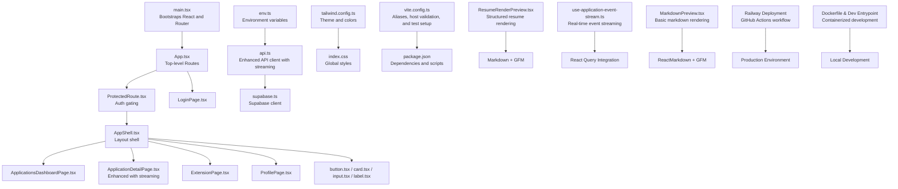

**Diagram sources**
- [main.tsx:1-14](file://frontend/src/main.tsx#L1-L14)
- [App.tsx:1-36](file://frontend/src/App.tsx#L1-L36)
- [ProtectedRoute.tsx:1-44](file://frontend/src/routes/ProtectedRoute.tsx#L1-L44)
- [AppShell.tsx:1-89](file://frontend/src/routes/AppShell.tsx#L1-L89)
- [ApplicationsDashboardPage.tsx:1-264](file://frontend/src/routes/ApplicationsDashboardPage.tsx#L1-L264)
- [ApplicationDetailPage.tsx:1-2832](file://frontend/src/routes/ApplicationDetailPage.tsx#L1-L2832)
- [ExtensionPage.tsx:1-200](file://frontend/src/routes/ExtensionPage.tsx#L1-L200)
- [ProfilePage.tsx:1-264](file://frontend/src/routes/ProfilePage.tsx#L1-L264)
- [LoginPage.tsx:1-111](file://frontend/src/routes/LoginPage.tsx#L1-L111)
- [ResumeRenderPreview.tsx:1-125](file://frontend/src/components/ResumeRenderPreview.tsx#L1-L125)
- [use-application-event-stream.ts:1-171](file://frontend/src/lib/use-application-event-stream.ts#L1-L171)
- [MarkdownPreview.tsx:1-16](file://frontend/src/components/MarkdownPreview.tsx#L1-L16)
- [button.tsx:1-23](file://frontend/src/components/ui/button.tsx#L1-L23)
- [card.tsx](file://frontend/src/components/ui/card.tsx)
- [input.tsx](file://frontend/src/components/ui/input.tsx)
- [label.tsx](file://frontend/src/components/ui/label.tsx)
- [api.ts:1-495](file://frontend/src/lib/api.ts#L1-L495)
- [supabase.ts:1-26](file://frontend/src/lib/supabase.ts#L1-L26)
- [env.ts](file://frontend/src/lib/env.ts)
- [utils.ts](file://frontend/src/lib/utils.ts)
- [application-options.ts:1-31](file://frontend/src/lib/application-options.ts#L1-L31)
- [tailwind.config.ts:1-25](file://frontend/tailwind.config.ts#L1-L25)
- [vite.config.ts:1-28](file://frontend/vite.config.ts#L1-L28)
- [package.json:1-42](file://frontend/package.json#L1-L42)
- [deploy-railway-main.yml:1-134](file://.github/workflows/deploy-railway-main.yml#L1-L134)
- [Dockerfile:1-11](file://frontend/Dockerfile#L1-L11)
- [dev-entrypoint.sh:1-24](file://frontend/dev-entrypoint.sh#L1-L24)

**Section sources**
- [main.tsx:1-14](file://frontend/src/main.tsx#L1-L14)
- [App.tsx:1-36](file://frontend/src/App.tsx#L1-L36)
- [vite.config.ts:1-28](file://frontend/vite.config.ts#L1-L28)
- [tailwind.config.ts:1-25](file://frontend/tailwind.config.ts#L1-L25)
- [package.json:1-42](file://frontend/package.json#L1-L42)

## Core Components
- AppShell: Provides the main layout, navigation, session bootstrap, and sign-out flow.
- ProtectedRoute: Guards protected routes using Supabase auth state.
- UI primitives: Button, Card, Input, Label provide consistent styling and behavior.
- Pages: Dashboard, Application Detail, Extension, Profile, Login.
- **Enhanced ApplicationDetailPage**: Comprehensive resume generation UI with draft preview/editing, section-specific regeneration, PDF export, and real-time streaming updates.
- **ResumeRenderPreview**: New component for structured resume rendering with specialized formatting for professional experience and education sections.
- **useApplicationEventStream**: New hook for real-time event streaming with automatic reconnection and stale detection.

Key patterns:
- Centralized API client with bearer token injection via Supabase session.
- Deferred UI updates using useDeferredValue for search performance.
- Controlled forms with optimistic UI updates and rollback on errors.
- **Enhanced**: Real-time event streaming with automatic reconnection and stale detection for extraction/generation progress.
- **Enhanced**: Structured resume rendering with specialized components for different section types.
- **Enhanced**: Improved state management with React Query integration and streaming event handling.

**Section sources**
- [AppShell.tsx:1-89](file://frontend/src/routes/AppShell.tsx#L1-L89)
- [ProtectedRoute.tsx:1-44](file://frontend/src/routes/ProtectedRoute.tsx#L1-L44)
- [button.tsx:1-23](file://frontend/src/components/ui/button.tsx#L1-L23)
- [ApplicationsDashboardPage.tsx:1-264](file://frontend/src/routes/ApplicationsDashboardPage.tsx#L1-L264)
- [ApplicationDetailPage.tsx:1-2832](file://frontend/src/routes/ApplicationDetailPage.tsx#L1-L2832)
- [ExtensionPage.tsx:1-200](file://frontend/src/routes/ExtensionPage.tsx#L1-L200)
- [ProfilePage.tsx:1-264](file://frontend/src/routes/ProfilePage.tsx#L1-L264)
- [ResumeRenderPreview.tsx:1-125](file://frontend/src/components/ResumeRenderPreview.tsx#L1-L125)
- [use-application-event-stream.ts:1-171](file://frontend/src/lib/use-application-event-stream.ts#L1-L171)
- [MarkdownPreview.tsx:1-16](file://frontend/src/components/MarkdownPreview.tsx#L1-L16)
- [api.ts:414-495](file://frontend/src/lib/api.ts#L414-L495)

## Architecture Overview
The frontend follows a layered architecture with enhanced real-time capabilities:
- Presentation layer: React components and pages with enhanced resume generation and streaming updates
- Routing layer: React Router DOM with nested routes and guards
- State layer: React hooks for local component state; Supabase for auth session; React Query for data caching
- Streaming layer: Real-time event streaming with automatic reconnection and stale detection
- Data layer: Enhanced API module with comprehensive resume generation endpoints and streaming support
- Infrastructure: Tailwind CSS for styling, Vite for build tooling, and Railway for deployment

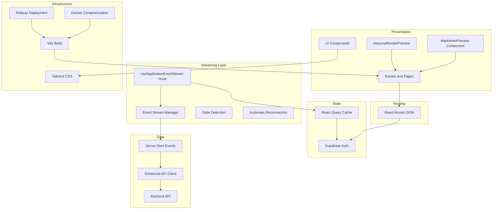

**Diagram sources**
- [App.tsx:1-36](file://frontend/src/App.tsx#L1-L36)
- [ProtectedRoute.tsx:1-44](file://frontend/src/routes/ProtectedRoute.tsx#L1-L44)
- [ResumeRenderPreview.tsx:97-125](file://frontend/src/components/ResumeRenderPreview.tsx#L97-L125)
- [use-application-event-stream.ts:33-171](file://frontend/src/lib/use-application-event-stream.ts#L33-L171)
- [MarkdownPreview.tsx:1-16](file://frontend/src/components/MarkdownPreview.tsx#L1-L16)
- [api.ts:414-495](file://frontend/src/lib/api.ts#L414-L495)
- [supabase.ts:1-26](file://frontend/src/lib/supabase.ts#L1-L26)
- [tailwind.config.ts:1-25](file://frontend/tailwind.config.ts#L1-L25)
- [vite.config.ts:1-28](file://frontend/vite.config.ts#L1-L28)
- [deploy-railway-main.yml:1-134](file://.github/workflows/deploy-railway-main.yml#L1-L134)
- [Dockerfile:1-11](file://frontend/Dockerfile#L1-L11)

## Detailed Component Analysis

### Authentication and Session Management
- Supabase client is initialized once and configured for session persistence and token refresh.
- ProtectedRoute checks session state on mount and subscribes to auth state changes.
- LoginPage signs in with email/password and redirects to the app shell.
- AppShell fetches session bootstrap data and exposes sign-out.

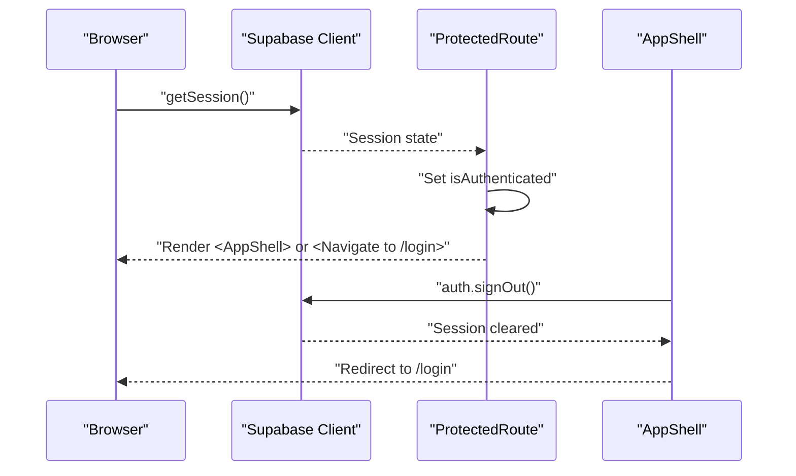

**Diagram sources**
- [ProtectedRoute.tsx:10-26](file://frontend/src/routes/ProtectedRoute.tsx#L10-L26)
- [supabase.ts:15-25](file://frontend/src/lib/supabase.ts#L15-L25)
- [AppShell.tsx:24-28](file://frontend/src/routes/AppShell.tsx#L24-L28)
- [LoginPage.tsx:17-36](file://frontend/src/routes/LoginPage.tsx#L17-L36)

**Section sources**
- [supabase.ts:1-26](file://frontend/src/lib/supabase.ts#L1-L26)
- [ProtectedRoute.tsx:1-44](file://frontend/src/routes/ProtectedRoute.tsx#L1-L44)
- [LoginPage.tsx:1-111](file://frontend/src/routes/LoginPage.tsx#L1-L111)
- [AppShell.tsx:1-89](file://frontend/src/routes/AppShell.tsx#L1-L89)

### Routing Configuration
- Top-level routes define login and the protected app shell.
- AppShell nests dashboard, application detail, extension, profile, and resume routes.
- ProtectedRoute ensures only authenticated users can access nested routes.

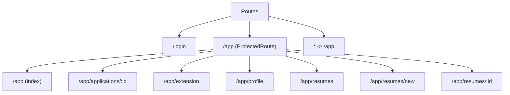

**Diagram sources**
- [App.tsx:12-34](file://frontend/src/App.tsx#L12-L34)

**Section sources**
- [App.tsx:1-36](file://frontend/src/App.tsx#L1-L36)
- [ProtectedRoute.tsx:1-44](file://frontend/src/routes/ProtectedRoute.tsx#L1-L44)

### Applications Dashboard
- Lists applications with filtering, sorting, and search.
- Creates new applications from job URLs.
- Toggles applied state with optimistic updates and rollback on error.
- Shows status badges and action-required indicators.

**Diagram sources**
- [ApplicationsDashboardPage.tsx:27-96](file://frontend/src/routes/ApplicationsDashboardPage.tsx#L27-L96)
- [api.ts:244-267](file://frontend/src/lib/api.ts#L244-L267)

**Section sources**
- [ApplicationsDashboardPage.tsx:1-264](file://frontend/src/routes/ApplicationsDashboardPage.tsx#L1-L264)
- [api.ts:244-267](file://frontend/src/lib/api.ts#L244-L267)

### Application Detail with Streaming Updates
- **Enhanced**: Real-time event streaming with automatic reconnection and stale detection.
- **Enhanced**: Structured resume rendering with ResumeRenderPreview component.
- **Enhanced**: Comprehensive resume generation UI with draft preview/editing, section-specific regeneration, and PDF export.
- **Enhanced**: Improved state management with React Query integration and streaming event handling.

**Updated** Major modernization with streaming APIs, improved state management, new ResumeRenderPreview component, enhanced ApplicationDetailPage with streaming progress updates, and new hooks for real-time communication.

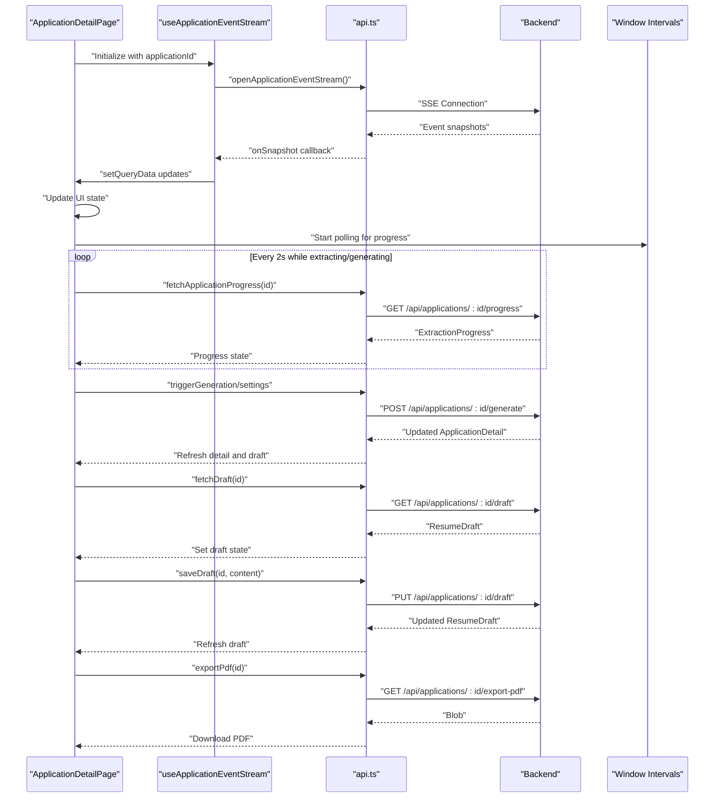

**Diagram sources**
- [ApplicationDetailPage.tsx:442-447](file://frontend/src/routes/ApplicationDetailPage.tsx#L442-L447)
- [use-application-event-stream.ts:129-153](file://frontend/src/lib/use-application-event-stream.ts#L129-L153)
- [api.ts:414-495](file://frontend/src/lib/api.ts#L414-L495)
- [api.ts:429-441](file://frontend/src/lib/api.ts#L429-L441)
- [api.ts:474-494](file://frontend/src/lib/api.ts#L474-L494)

**Section sources**
- [ApplicationDetailPage.tsx:1-2832](file://frontend/src/routes/ApplicationDetailPage.tsx#L1-L2832)
- [use-application-event-stream.ts:1-171](file://frontend/src/lib/use-application-event-stream.ts#L1-L171)
- [ResumeRenderPreview.tsx:1-125](file://frontend/src/components/ResumeRenderPreview.tsx#L1-L125)
- [api.ts:414-495](file://frontend/src/lib/api.ts#L414-L495)

### Resume Rendering and Draft Management
- **ResumeRenderPreview**: New component for structured resume rendering with specialized formatting for professional experience and education sections.
- **Draft Preview Mode**: Renders markdown content using the new ResumeRenderPreview component with GitHub Flavored Markdown support.
- **Edit Mode**: Allows direct markdown editing with syntax highlighting and real-time preview.
- **Section-specific Regeneration**: Dropdown selection for specific resume sections (summary, professional experience, education, skills, certifications, projects) with instruction-based regeneration.
- **Full Regeneration**: Complete resume regeneration with current settings.
- **PDF Export**: Direct PDF generation and download with automatic detail refresh.

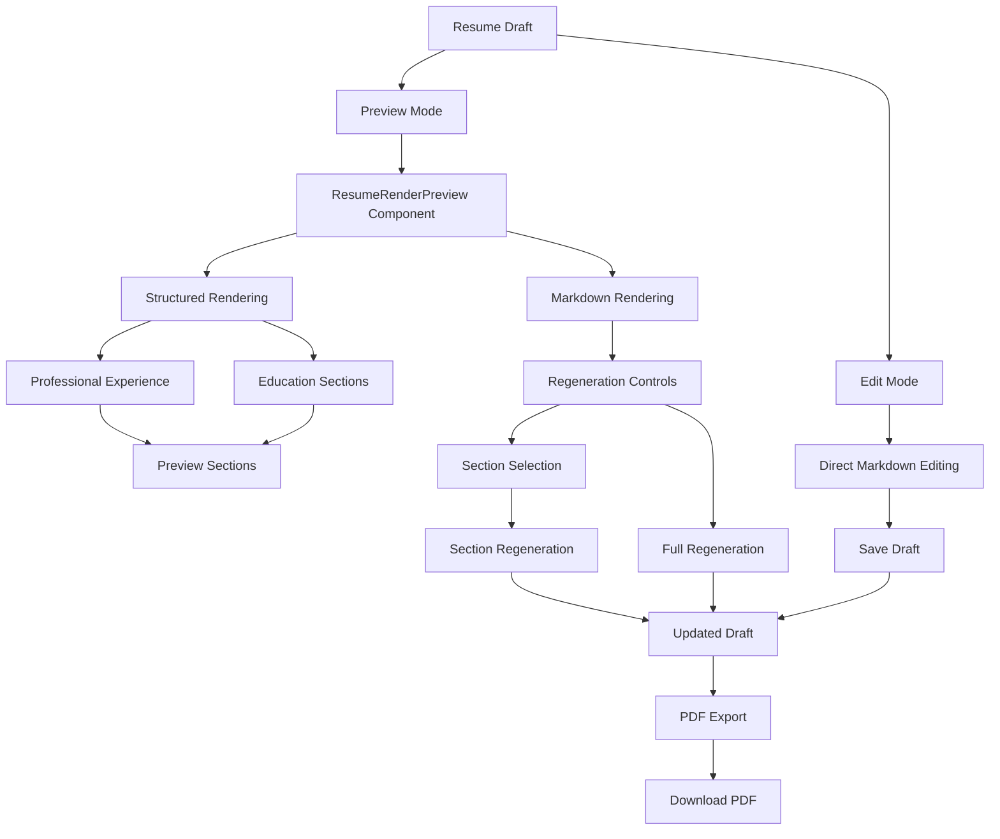

**Diagram sources**
- [ApplicationDetailPage.tsx:1726-1733](file://frontend/src/routes/ApplicationDetailPage.tsx#L1726-L1733)
- [ResumeRenderPreview.tsx:97-125](file://frontend/src/components/ResumeRenderPreview.tsx#L97-L125)
- [api.ts:429-441](file://frontend/src/lib/api.ts#L429-L441)
- [api.ts:443-466](file://frontend/src/lib/api.ts#L443-L466)
- [api.ts:474-494](file://frontend/src/lib/api.ts#L474-L494)

**Section sources**
- [ApplicationDetailPage.tsx:1726-1733](file://frontend/src/routes/ApplicationDetailPage.tsx#L1726-L1733)
- [ResumeRenderPreview.tsx:1-125](file://frontend/src/components/ResumeRenderPreview.tsx#L1-L125)
- [api.ts:429-494](file://frontend/src/lib/api.ts#L429-L494)

### Real-Time Event Streaming
- **useApplicationEventStream**: New hook for managing real-time event streams with automatic reconnection and stale detection.
- **Event Handling**: Supports snapshots, progress updates, detail updates, and heartbeats.
- **Connection Management**: Automatic reconnection with exponential backoff and stale timer.
- **React Query Integration**: Seamless integration with React Query for state synchronization.

**New** Comprehensive real-time communication system with automatic reconnection and stale detection.

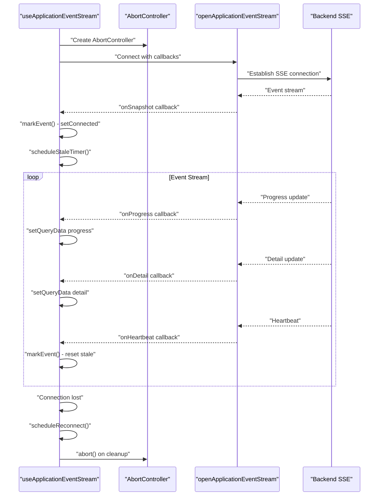

**Diagram sources**
- [use-application-event-stream.ts:129-153](file://frontend/src/lib/use-application-event-stream.ts#L129-L153)
- [use-application-event-stream.ts:114-127](file://frontend/src/lib/use-application-event-stream.ts#L114-L127)
- [use-application-event-stream.ts:44-56](file://frontend/src/lib/use-application-event-stream.ts#L44-L56)

**Section sources**
- [use-application-event-stream.ts:1-171](file://frontend/src/lib/use-application-event-stream.ts#L1-L171)

### Chrome Extension Integration
- ExtensionPage manages connection lifecycle: issue token, revoke token, and listen for bridge messages.
- Uses postMessage to communicate with the extension popup and content script.
- Demonstrates scoped token usage without exposing Supabase session.

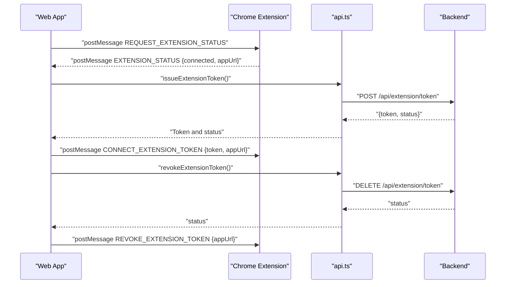

**Diagram sources**
- [ExtensionPage.tsx:35-125](file://frontend/src/routes/ExtensionPage.tsx#L35-L125)
- [api.ts:312-326](file://frontend/src/lib/api.ts#L312-L326)
- [chrome-extension manifest.json](file://frontend/public/chrome-extension/manifest.json)
- [chrome-extension content-script.js](file://frontend/public/chrome-extension/content-script.js)
- [chrome-extension service-worker.js](file://frontend/public/chrome-extension/service-worker.js)
- [chrome-extension popup.js](file://frontend/public/chrome-extension/popup.js)
- [chrome-extension popup.html](file://frontend/public/chrome-extension/popup.html)
- [chrome-extension popup.css](file://frontend/public/chrome-extension/popup.css)

**Section sources**
- [ExtensionPage.tsx:1-200](file://frontend/src/routes/ExtensionPage.tsx#L1-L200)
- [api.ts:312-326](file://frontend/src/lib/api.ts#L312-L326)
- [chrome-extension manifest.json](file://frontend/public/chrome-extension/manifest.json)
- [chrome-extension content-script.js](file://frontend/public/chrome-extension/content-script.js)
- [chrome-extension service-worker.js](file://frontend/public/chrome-extension/service-worker.js)
- [chrome-extension popup.js](file://frontend/public/chrome-extension/popup.js)
- [chrome-extension popup.html](file://frontend/public/chrome-extension/popup.html)
- [chrome-extension popup.css](file://frontend/public/chrome-extension/popup.css)

### Profile Management
- Loads profile data on mount and supports updating personal info and section preferences.
- Tracks dirty state and provides save/cancel behavior with optimistic updates.

**Section sources**
- [ProfilePage.tsx:1-264](file://frontend/src/routes/ProfilePage.tsx#L1-L264)
- [api.ts:401-410](file://frontend/src/lib/api.ts#L401-L410)

### Styling Approach
- Tailwind CSS with custom theme tokens for colors, fonts, and shadows.
- Utility-first classes applied directly in components for rapid iteration.
- Responsive breakpoints and spacing scales ensure consistent layouts across devices.
- **Enhanced**: Custom prose styling for markdown preview with controlled typography and spacing.
- **Enhanced**: Specialized styling for ResumeRenderPreview with structured section formatting.

**Section sources**
- [tailwind.config.ts:1-25](file://frontend/tailwind.config.ts#L1-L25)
- [button.tsx:1-23](file://frontend/src/components/ui/button.tsx#L1-L23)
- [card.tsx](file://frontend/src/components/ui/card.tsx)
- [input.tsx](file://frontend/src/components/ui/input.tsx)
- [label.tsx](file://frontend/src/components/ui/label.tsx)
- [ResumeRenderPreview.tsx:31-95](file://frontend/src/components/ResumeRenderPreview.tsx#L31-L95)
- [MarkdownPreview.tsx:9-14](file://frontend/src/components/MarkdownPreview.tsx#L9-L14)

## Dependency Analysis
- React 19 and React Router DOM power the UI and routing.
- @supabase/supabase-js handles authentication and session persistence.
- Tailwind CSS provides styling; Vite builds the app and aliases paths.
- The API module centralizes authenticated requests and error handling.
- **Enhanced**: New dependencies for real-time communication and structured rendering.
- **Enhanced**: React Query for data caching and state synchronization.

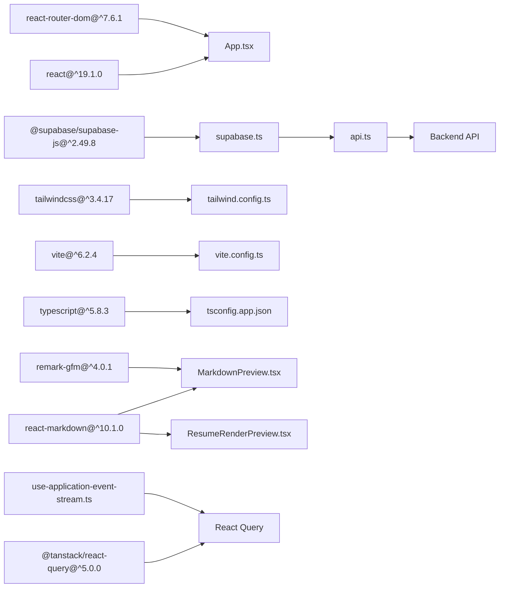

**Diagram sources**
- [package.json:13-25](file://frontend/package.json#L13-L25)
- [api.ts:1-2](file://frontend/src/lib/api.ts#L1-L2)
- [supabase.ts:1-2](file://frontend/src/lib/supabase.ts#L1-L2)
- [tailwind.config.ts:1-25](file://frontend/tailwind.config.ts#L1-L25)
- [vite.config.ts:1-28](file://frontend/vite.config.ts#L1-L28)
- [MarkdownPreview.tsx:1-2](file://frontend/src/components/MarkdownPreview.tsx#L1-L2)
- [ResumeRenderPreview.tsx:1-4](file://frontend/src/components/ResumeRenderPreview.tsx#L1-L4)
- [use-application-event-stream.ts:1-11](file://frontend/src/lib/use-application-event-stream.ts#L1-L11)

**Section sources**
- [package.json:1-42](file://frontend/package.json#L1-L42)
- [vite.config.ts:1-28](file://frontend/vite.config.ts#L1-L28)
- [tailwind.config.ts:1-25](file://frontend/tailwind.config.ts#L1-L25)

## Performance Considerations
- useDeferredValue for search input reduces re-renders during typing.
- Optimistic UI updates followed by server sync improve perceived responsiveness.
- **Enhanced**: Real-time event streaming with automatic reconnection and stale detection.
- **Enhanced**: React Query integration for efficient data caching and synchronization.
- **Enhanced**: Structured resume rendering with specialized components for better performance.
- Polling intervals are conservative (every 2 seconds) to balance UX and resource usage.
- Tailwind JIT compilation and minimal CSS reduce bundle size.
- **Enhanced**: Debounced autosave for notes and efficient markdown rendering with memoization.

## Production Deployment and Configuration

### Vite Configuration for Railway Environments
The Vite configuration has been enhanced to support Railway's dynamic production environment. The key improvement involves allowing Railway's `.up.railway.app` hostname in both server and preview configurations to prevent host validation blocking.

**Updated** Added `.up.railway.app` to both `server.allowedHosts` and `preview.allowedHosts` arrays to resolve production access issues where Railway's dynamic hostnames were being blocked by Vite's host validation.

**Section sources**
- [vite.config.ts:13-21](file://frontend/vite.config.ts#L13-L21)

### Railway Deployment Pipeline
The application uses GitHub Actions to deploy to Railway with selective service detection. The workflow automatically detects changes and deploys only the affected services (backend, frontend, or agents).

**Updated** Enhanced deployment pipeline with improved service detection and selective deployment based on file changes.

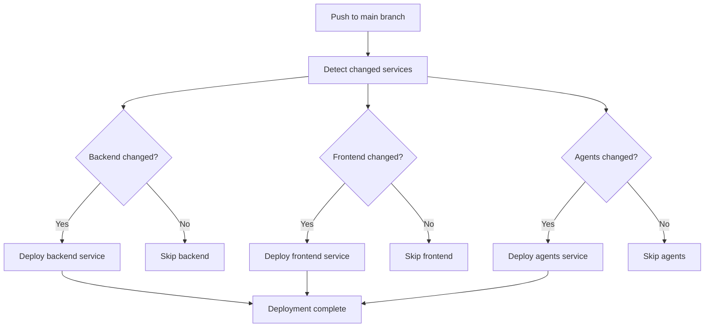

**Diagram sources**
- [deploy-railway-main.yml:12-134](file://.github/workflows/deploy-railway-main.yml#L12-L134)

**Section sources**
- [deploy-railway-main.yml:1-134](file://.github/workflows/deploy-railway-main.yml#L1-L134)

### Containerized Development Environment
The frontend uses Docker for consistent development environments with optimized package installation caching.

**Section sources**
- [Dockerfile:1-11](file://frontend/Dockerfile#L1-L11)
- [dev-entrypoint.sh:1-24](file://frontend/dev-entrypoint.sh#L1-L24)

## Troubleshooting Guide
Common issues and resolutions:
- Authentication failures: Verify Supabase credentials and session persistence. Check auth state change subscriptions and token availability.
- API request errors: Inspect network tab for 4xx/5xx responses; the API module surfaces detailed error messages from the backend.
- Extension bridge not detected: Confirm manifest permissions, service worker registration, and popup messaging setup.
- Styling inconsistencies: Ensure Tailwind content paths include all component files and rebuild the project.
- **Enhanced**: Markdown rendering issues: Verify react-markdown and remark-gfm dependencies are properly installed and configured.
- **Enhanced**: Production access blocked: Verify `.up.railway.app` is included in Vite's allowed hosts configuration for both server and preview modes.
- **Enhanced**: Real-time streaming issues: Check browser console for SSE connection errors and verify backend streaming endpoints.
- **Enhanced**: Resume rendering problems: Verify ResumeRenderPreview props and ensure render_model structure matches expected format.

**Section sources**
- [api.ts:190-214](file://frontend/src/lib/api.ts#L190-L214)
- [ExtensionPage.tsx:43-72](file://frontend/src/routes/ExtensionPage.tsx#L43-L72)
- [tailwind.config.ts:4-5](file://frontend/tailwind.config.ts#L4-L5)
- [MarkdownPreview.tsx:1-16](file://frontend/src/components/MarkdownPreview.tsx#L1-L16)
- [ResumeRenderPreview.tsx:1-125](file://frontend/src/components/ResumeRenderPreview.tsx#L1-L125)
- [use-application-event-stream.ts:114-127](file://frontend/src/lib/use-application-event-stream.ts#L114-L127)
- [vite.config.ts:13-21](file://frontend/vite.config.ts#L13-L21)

## Conclusion
The frontend application is a modular, authenticated React 19 app with clear separation of concerns. It leverages Supabase for authentication, React Router for navigation, and a centralized API client for backend integration. The UI is built with reusable components and Tailwind CSS, ensuring a consistent and responsive design. The Chrome extension integration demonstrates secure, scoped communication for job capture. **The enhanced ApplicationDetailPage now provides comprehensive resume generation capabilities with draft preview/editing, section-specific regeneration controls, PDF export functionality, and real-time streaming updates, making it a complete solution for AI-powered resume creation.** The new ResumeRenderPreview component offers specialized structured rendering for professional experience and education sections. The useApplicationEventStream hook enables robust real-time communication with automatic reconnection and stale detection. The recent Vite configuration improvements ensure seamless operation in Railway's production environment with proper host validation for dynamic hostnames.

## Appendices

### Component Class Diagram
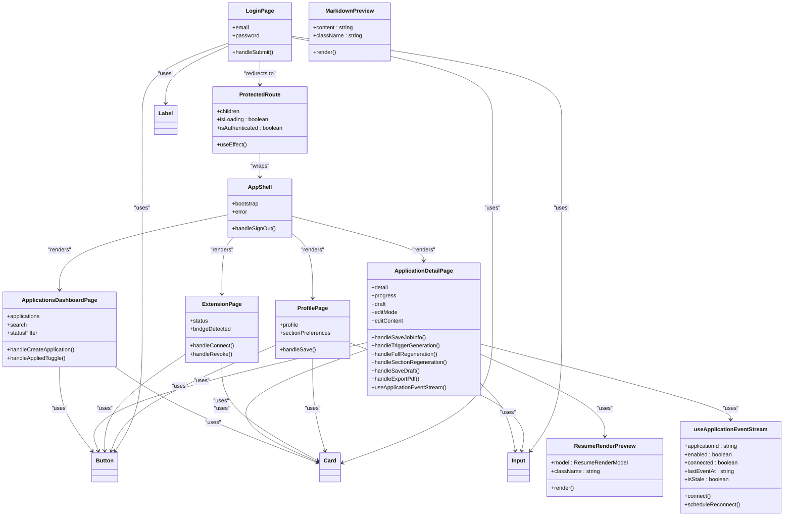

**Diagram sources**
- [ProtectedRoute.tsx:6-43](file://frontend/src/routes/ProtectedRoute.tsx#L6-L43)
- [AppShell.tsx:8-88](file://frontend/src/routes/AppShell.tsx#L8-L88)
- [ApplicationsDashboardPage.tsx:16-263](file://frontend/src/routes/ApplicationsDashboardPage.tsx#L16-L263)
- [ApplicationDetailPage.tsx:373-2832](file://frontend/src/routes/ApplicationDetailPage.tsx#L373-L2832)
- [ExtensionPage.tsx:26-199](file://frontend/src/routes/ExtensionPage.tsx#L26-L199)
- [ProfilePage.tsx:17-263](file://frontend/src/routes/ProfilePage.tsx#L17-L263)
- [LoginPage.tsx:10-110](file://frontend/src/routes/LoginPage.tsx#L10-L110)
- [ResumeRenderPreview.tsx:6-125](file://frontend/src/components/ResumeRenderPreview.tsx#L6-L125)
- [MarkdownPreview.tsx:4-15](file://frontend/src/components/MarkdownPreview.tsx#L4-L15)
- [use-application-event-stream.ts:33-171](file://frontend/src/lib/use-application-event-stream.ts#L33-L171)
- [button.tsx:8-22](file://frontend/src/components/ui/button.tsx#L8-L22)
- [card.tsx](file://frontend/src/components/ui/card.tsx)
- [input.tsx](file://frontend/src/components/ui/input.tsx)
- [label.tsx](file://frontend/src/components/ui/label.tsx)

### Accessibility and Responsive Design
- Semantic HTML and proper labeling via Label components.
- Keyboard navigable buttons and form controls.
- Sufficient color contrast and readable typography scales.
- Responsive grids and flexible layouts adapt to mobile and desktop.
- **Enhanced**: Proper markdown accessibility with semantic HTML rendering and screen reader support.
- **Enhanced**: Structured resume rendering with accessible section formatting and ARIA attributes.

**Section sources**
- [button.tsx:1-23](file://frontend/src/components/ui/button.tsx#L1-L23)
- [input.tsx](file://frontend/src/components/ui/input.tsx)
- [label.tsx](file://frontend/src/components/ui/label.tsx)
- [tailwind.config.ts:6-21](file://frontend/tailwind.config.ts#L6-L21)
- [ResumeRenderPreview.tsx:31-95](file://frontend/src/components/ResumeRenderPreview.tsx#L31-L95)
- [MarkdownPreview.tsx:9-14](file://frontend/src/components/MarkdownPreview.tsx#L9-L14)

### Cross-Browser Compatibility
- Modern JavaScript features supported by Vite and React 19.
- Tailwind utilities provide consistent rendering across browsers.
- PostCSS and autoprefixer ensure vendor prefixes where needed.
- **Enhanced**: React Markdown compatibility across modern browsers with fallbacks for older versions.
- **Enhanced**: Server-Sent Events compatibility with polyfills for older browsers.

**Section sources**
- [package.json:29-35](file://frontend/package.json#L29-L35)
- [tailwind.config.ts:1-25](file://frontend/tailwind.config.ts#L1-L25)

### Enhanced API Endpoints
The API module now includes comprehensive resume generation endpoints:

- **triggerGeneration**: Start resume generation with base resume, target length, aggressiveness, and additional instructions
- **fetchDraft**: Retrieve current resume draft content
- **saveDraft**: Persist draft changes with markdown content
- **triggerFullRegeneration**: Complete resume regeneration with current settings
- **triggerSectionRegeneration**: Section-specific regeneration with instruction-based customization
- **cancelGeneration**: Cancel ongoing generation processes
- **exportPdf**: Generate and download PDF resume with automatic detail refresh
- **openApplicationEventStream**: New streaming endpoint for real-time progress updates

**Section sources**
- [api.ts:414-495](file://frontend/src/lib/api.ts#L414-L495)

### Vite Configuration Details
The Vite configuration includes several key settings for optimal development and production performance:

- **Path Aliases**: `@` for `src` and `@shared` for `../shared` for cleaner imports
- **Host Validation**: `.up.railway.app` allowed in both server and preview modes for production access
- **File System Security**: Root directory allowed for Vite operations
- **Test Environment**: jsdom with Vitest for comprehensive testing

**Section sources**
- [vite.config.ts:5-27](file://frontend/vite.config.ts#L5-L27)

### Real-Time Communication Architecture
The new streaming architecture provides robust real-time updates:

- **Automatic Reconnection**: Exponential backoff with maximum 5-second delay
- **Stale Detection**: 20-second timeout for detecting disconnected streams
- **Event Types**: Support for snapshots, progress updates, detail changes, and heartbeats
- **React Query Integration**: Seamless state synchronization with React Query cache
- **Error Handling**: Graceful degradation with fallback polling mechanisms

**Section sources**
- [use-application-event-stream.ts:13-171](file://frontend/src/lib/use-application-event-stream.ts#L13-L171)