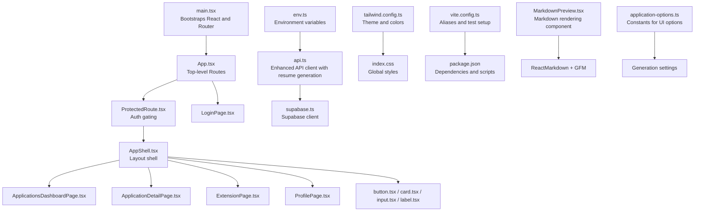
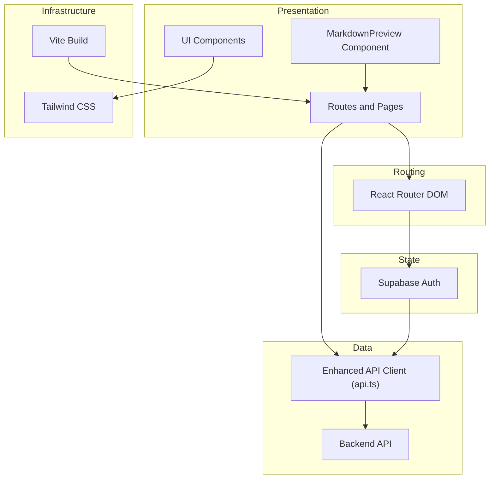
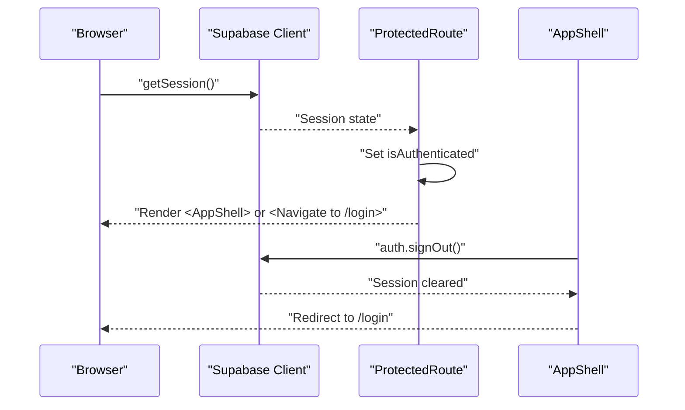
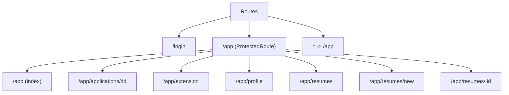
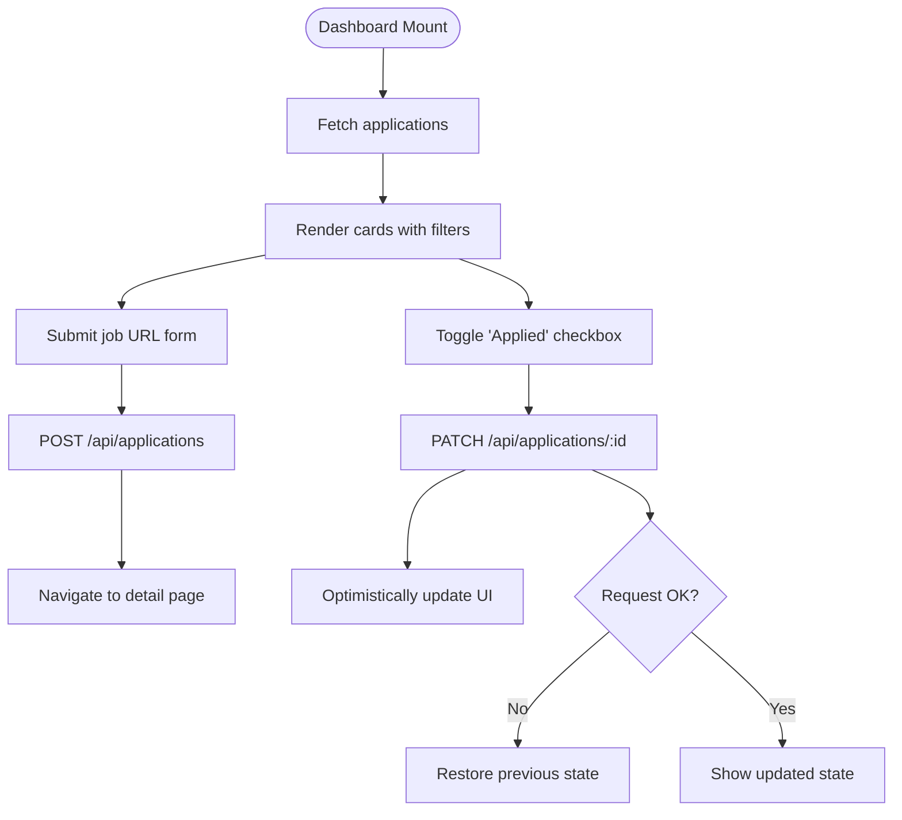
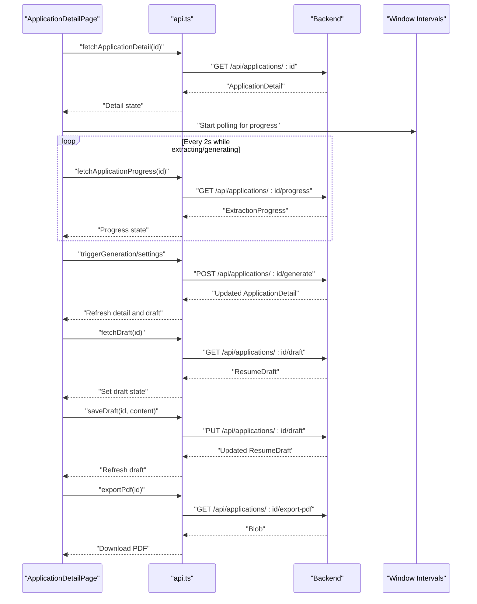
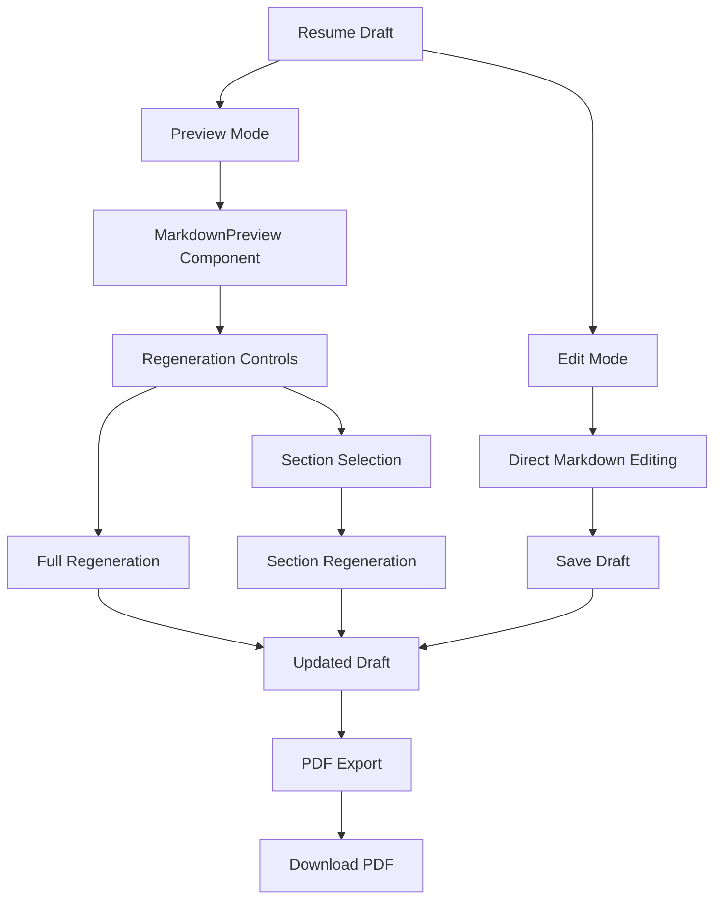
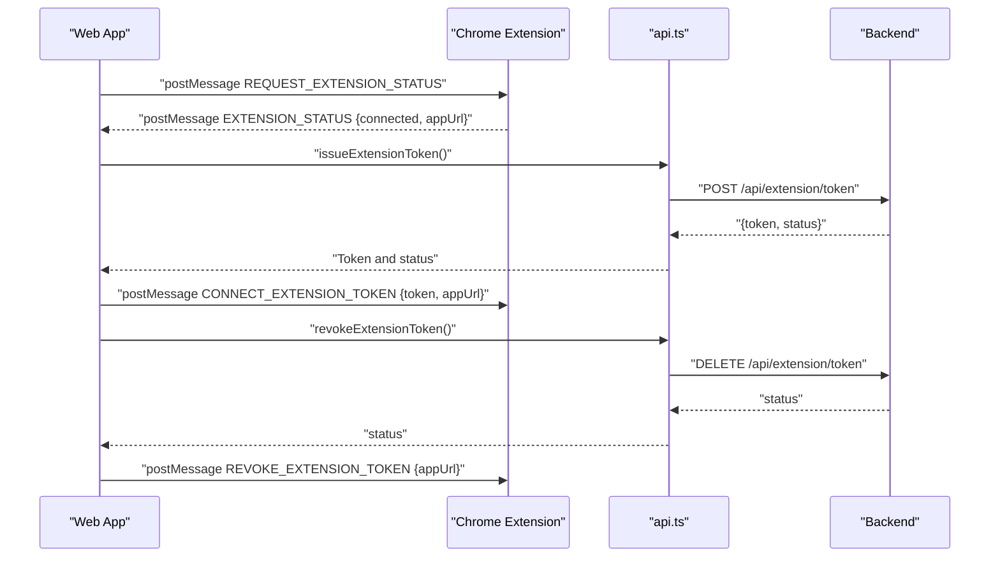
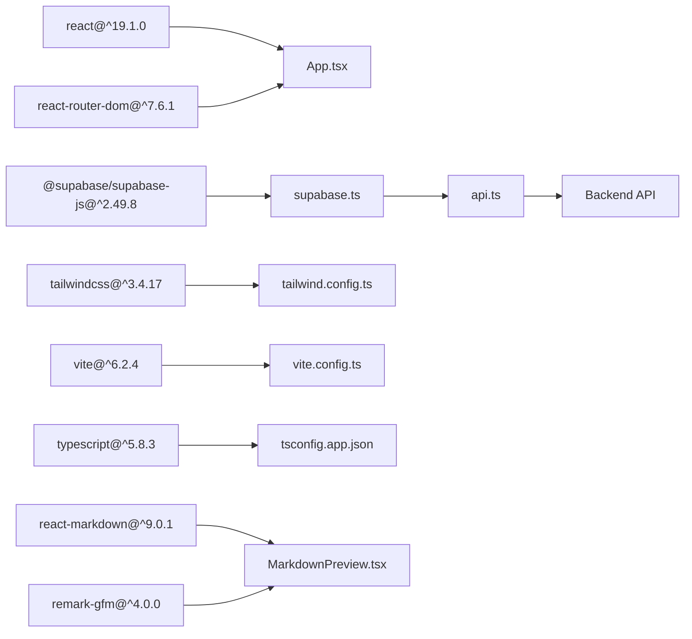
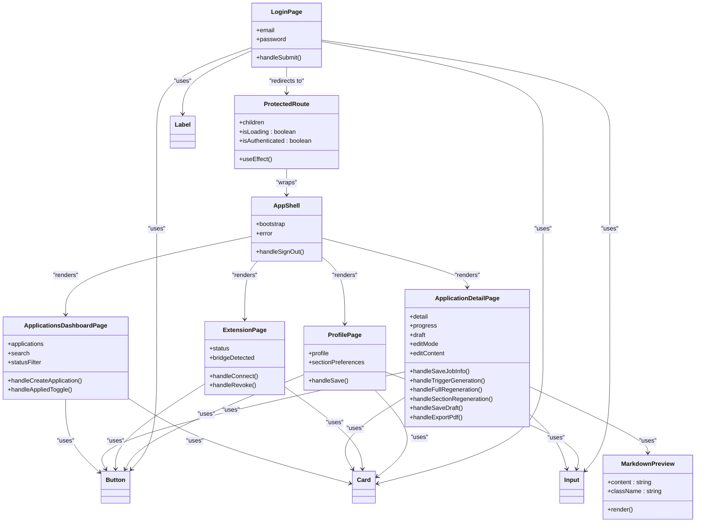

# Frontend Application

<cite>
**Referenced Files in This Document**
- [main.tsx](file://frontend/src/main.tsx)
- [App.tsx](file://frontend/src/App.tsx)
- [AppShell.tsx](file://frontend/src/routes/AppShell.tsx)
- [ProtectedRoute.tsx](file://frontend/src/routes/ProtectedRoute.tsx)
- [ApplicationsDashboardPage.tsx](file://frontend/src/routes/ApplicationsDashboardPage.tsx)
- [ApplicationDetailPage.tsx](file://frontend/src/routes/ApplicationDetailPage.tsx)
- [ExtensionPage.tsx](file://frontend/src/routes/ExtensionPage.tsx)
- [ProfilePage.tsx](file://frontend/src/routes/ProfilePage.tsx)
- [LoginPage.tsx](file://frontend/src/routes/LoginPage.tsx)
- [MarkdownPreview.tsx](file://frontend/src/components/MarkdownPreview.tsx)
- [StatusBadge.tsx](file://frontend/src/components/StatusBadge.tsx)
- [button.tsx](file://frontend/src/components/ui/button.tsx)
- [card.tsx](file://frontend/src/components/ui/card.tsx)
- [input.tsx](file://frontend/src/components/ui/input.tsx)
- [label.tsx](file://frontend/src/components/ui/label.tsx)
- [api.ts](file://frontend/src/lib/api.ts)
- [supabase.ts](file://frontend/src/lib/supabase.ts)
- [env.ts](file://frontend/src/lib/env.ts)
- [utils.ts](file://frontend/src/lib/utils.ts)
- [application-options.ts](file://frontend/src/lib/application-options.ts)
- [package.json](file://frontend/package.json)
- [vite.config.ts](file://frontend/vite.config.ts)
- [tailwind.config.ts](file://frontend/tailwind.config.ts)
- [index.html](file://frontend/index.html)
- [chrome-extension manifest.json](file://frontend/public/chrome-extension/manifest.json)
- [chrome-extension content-script.js](file://frontend/public/chrome-extension/content-script.js)
- [chrome-extension service-worker.js](file://frontend/public/chrome-extension/service-worker.js)
- [chrome-extension popup.js](file://frontend/public/chrome-extension/popup.js)
- [chrome-extension popup.html](file://frontend/public/chrome-extension/popup.html)
- [chrome-extension popup.css](file://frontend/public/chrome-extension/popup.css)
- [chrome-extension-popup.d.ts](file://frontend/src/types/chrome-extension-popup.d.ts)
</cite>

## Table of Contents
1. [Introduction](#introduction)
2. [Project Structure](#project-structure)
3. [Core Components](#core-components)
4. [Architecture Overview](#architecture-overview)
5. [Detailed Component Analysis](#detailed-component-analysis)
6. [Dependency Analysis](#dependency-analysis)
7. [Performance Considerations](#performance-considerations)
8. [Troubleshooting Guide](#troubleshooting-guide)
9. [Conclusion](#conclusion)
10. [Appendices](#appendices)

## Introduction
This document describes the React 19-based frontend application for the AI Resume Builder. It covers the application structure, routing with React Router DOM, state management patterns, component architecture, styling with Tailwind CSS, Chrome extension integration, authentication and session management, responsive design, accessibility, cross-browser compatibility, and integration with the backend API.

## Project Structure
The frontend is a Vite-powered React application configured with TypeScript and Tailwind CSS. It uses React Router DOM for client-side routing and @supabase/supabase-js for authentication and session persistence. The application is organized into:
- Routes: Page-level components under src/routes
- Components: Reusable UI primitives under src/components/ui and specialized components like MarkdownPreview
- Library: API clients, environment configuration, and utilities under src/lib
- Public assets: Chrome extension code under frontend/public/chrome-extension

**Diagram sources**
- [main.tsx:1-14](file://frontend/src/main.tsx#L1-L14)
- [App.tsx:1-36](file://frontend/src/App.tsx#L1-L36)
- [ProtectedRoute.tsx:1-44](file://frontend/src/routes/ProtectedRoute.tsx#L1-L44)
- [AppShell.tsx:1-89](file://frontend/src/routes/AppShell.tsx#L1-L89)
- [ApplicationsDashboardPage.tsx:1-264](file://frontend/src/routes/ApplicationsDashboardPage.tsx#L1-L264)
- [ApplicationDetailPage.tsx:1-1289](file://frontend/src/routes/ApplicationDetailPage.tsx#L1-L1289)
- [ExtensionPage.tsx:1-200](file://frontend/src/routes/ExtensionPage.tsx#L1-L200)
- [ProfilePage.tsx:1-264](file://frontend/src/routes/ProfilePage.tsx#L1-L264)
- [LoginPage.tsx:1-111](file://frontend/src/routes/LoginPage.tsx#L1-L111)
- [MarkdownPreview.tsx:1-16](file://frontend/src/components/MarkdownPreview.tsx#L1-L16)
- [button.tsx:1-23](file://frontend/src/components/ui/button.tsx#L1-L23)
- [card.tsx](file://frontend/src/components/ui/card.tsx)
- [input.tsx](file://frontend/src/components/ui/input.tsx)
- [label.tsx](file://frontend/src/components/ui/label.tsx)
- [api.ts:1-495](file://frontend/src/lib/api.ts#L1-L495)
- [supabase.ts:1-26](file://frontend/src/lib/supabase.ts#L1-L26)
- [env.ts](file://frontend/src/lib/env.ts)
- [utils.ts](file://frontend/src/lib/utils.ts)
- [application-options.ts:1-31](file://frontend/src/lib/application-options.ts#L1-L31)
- [tailwind.config.ts:1-25](file://frontend/tailwind.config.ts#L1-L25)
- [vite.config.ts:1-24](file://frontend/vite.config.ts#L1-L24)
- [package.json:1-38](file://frontend/package.json#L1-L38)

**Section sources**
- [main.tsx:1-14](file://frontend/src/main.tsx#L1-L14)
- [App.tsx:1-36](file://frontend/src/App.tsx#L1-L36)
- [vite.config.ts:1-24](file://frontend/vite.config.ts#L1-L24)
- [tailwind.config.ts:1-25](file://frontend/tailwind.config.ts#L1-L25)
- [package.json:1-38](file://frontend/package.json#L1-L38)

## Core Components
- AppShell: Provides the main layout, navigation, session bootstrap, and sign-out flow.
- ProtectedRoute: Guards protected routes using Supabase auth state.
- UI primitives: Button, Card, Input, Label provide consistent styling and behavior.
- Pages: Dashboard, Application Detail, Extension, Profile, Login.
- **Enhanced ApplicationDetailPage**: Comprehensive resume generation UI with draft preview/editing, section-specific regeneration, and PDF export.
- **MarkdownPreview**: Dedicated component for rendering markdown content with GitHub Flavored Markdown support.

Key patterns:
- Centralized API client with bearer token injection via Supabase session.
- Deferred UI updates using useDeferredValue for search performance.
- Controlled forms with optimistic UI updates and rollback on errors.
- Polling for long-running operations (extraction and generation progress).
- **Enhanced state management**: Complex state handling for resume drafts, edit modes, and regeneration workflows.

**Section sources**
- [AppShell.tsx:1-89](file://frontend/src/routes/AppShell.tsx#L1-L89)
- [ProtectedRoute.tsx:1-44](file://frontend/src/routes/ProtectedRoute.tsx#L1-L44)
- [button.tsx:1-23](file://frontend/src/components/ui/button.tsx#L1-L23)
- [ApplicationsDashboardPage.tsx:1-264](file://frontend/src/routes/ApplicationsDashboardPage.tsx#L1-L264)
- [ApplicationDetailPage.tsx:1-1289](file://frontend/src/routes/ApplicationDetailPage.tsx#L1-L1289)
- [ExtensionPage.tsx:1-200](file://frontend/src/routes/ExtensionPage.tsx#L1-L200)
- [ProfilePage.tsx:1-264](file://frontend/src/routes/ProfilePage.tsx#L1-L264)
- [MarkdownPreview.tsx:1-16](file://frontend/src/components/MarkdownPreview.tsx#L1-L16)
- [api.ts:414-495](file://frontend/src/lib/api.ts#L414-L495)

## Architecture Overview
The frontend follows a layered architecture:
- Presentation layer: React components and pages with enhanced resume generation capabilities
- Routing layer: React Router DOM with nested routes and guards
- State layer: React hooks for local component state; Supabase for auth session
- Data layer: Enhanced API module with comprehensive resume generation endpoints
- Infrastructure: Tailwind CSS for styling, Vite for build tooling

**Diagram sources**
- [App.tsx:1-36](file://frontend/src/App.tsx#L1-L36)
- [ProtectedRoute.tsx:1-44](file://frontend/src/routes/ProtectedRoute.tsx#L1-L44)
- [MarkdownPreview.tsx:1-16](file://frontend/src/components/MarkdownPreview.tsx#L1-L16)
- [api.ts:414-495](file://frontend/src/lib/api.ts#L414-L495)
- [supabase.ts:1-26](file://frontend/src/lib/supabase.ts#L1-L26)
- [tailwind.config.ts:1-25](file://frontend/tailwind.config.ts#L1-L25)
- [vite.config.ts:1-24](file://frontend/vite.config.ts#L1-L24)

## Detailed Component Analysis

### Authentication and Session Management
- Supabase client is initialized once and configured for session persistence and token refresh.
- ProtectedRoute checks session state on mount and subscribes to auth state changes.
- LoginPage signs in with email/password and redirects to the app shell.
- AppShell fetches session bootstrap data and exposes sign-out.

**Diagram sources**
- [ProtectedRoute.tsx:10-26](file://frontend/src/routes/ProtectedRoute.tsx#L10-L26)
- [supabase.ts:15-25](file://frontend/src/lib/supabase.ts#L15-L25)
- [AppShell.tsx:24-28](file://frontend/src/routes/AppShell.tsx#L24-L28)
- [LoginPage.tsx:17-36](file://frontend/src/routes/LoginPage.tsx#L17-L36)

**Section sources**
- [supabase.ts:1-26](file://frontend/src/lib/supabase.ts#L1-L26)
- [ProtectedRoute.tsx:1-44](file://frontend/src/routes/ProtectedRoute.tsx#L1-L44)
- [LoginPage.tsx:1-111](file://frontend/src/routes/LoginPage.tsx#L1-L111)
- [AppShell.tsx:1-89](file://frontend/src/routes/AppShell.tsx#L1-L89)

### Routing Configuration
- Top-level routes define login and the protected app shell.
- AppShell nests dashboard, application detail, extension, profile, and resume routes.
- ProtectedRoute ensures only authenticated users can access nested routes.

**Diagram sources**
- [App.tsx:12-34](file://frontend/src/App.tsx#L12-L34)

**Section sources**
- [App.tsx:1-36](file://frontend/src/App.tsx#L1-L36)
- [ProtectedRoute.tsx:1-44](file://frontend/src/routes/ProtectedRoute.tsx#L1-L44)

### Applications Dashboard
- Lists applications with filtering, sorting, and search.
- Creates new applications from job URLs.
- Toggles applied state with optimistic updates and rollback on error.
- Shows status badges and action-required indicators.

**Diagram sources**
- [ApplicationsDashboardPage.tsx:27-96](file://frontend/src/routes/ApplicationsDashboardPage.tsx#L27-L96)
- [api.ts:244-267](file://frontend/src/lib/api.ts#L244-L267)

**Section sources**
- [ApplicationsDashboardPage.tsx:1-264](file://frontend/src/routes/ApplicationsDashboardPage.tsx#L1-L264)
- [api.ts:244-267](file://frontend/src/lib/api.ts#L244-L267)

### Application Detail
- Loads application detail and progress, polls for extraction/generation updates.
- Handles manual entry, retry extraction, duplicate review, and generation controls.
- **Enhanced**: Manages comprehensive resume draft editing with preview/edit modes, section-specific regeneration, and PDF export.

**Updated** Enhanced with comprehensive resume generation UI, draft preview/editing capabilities, section-specific regeneration controls, and PDF export functionality.

**Diagram sources**
- [ApplicationDetailPage.tsx:88-152](file://frontend/src/routes/ApplicationDetailPage.tsx#L88-L152)
- [api.ts:414-495](file://frontend/src/lib/api.ts#L414-L495)
- [api.ts:429-441](file://frontend/src/lib/api.ts#L429-L441)
- [api.ts:474-494](file://frontend/src/lib/api.ts#L474-L494)

**Section sources**
- [ApplicationDetailPage.tsx:1-1289](file://frontend/src/routes/ApplicationDetailPage.tsx#L1-L1289)
- [api.ts:414-495](file://frontend/src/lib/api.ts#L414-L495)

### Resume Generation and Draft Management
- **Draft Preview Mode**: Renders markdown content using the new MarkdownPreview component with GitHub Flavored Markdown support.
- **Edit Mode**: Allows direct markdown editing with syntax highlighting and real-time preview.
- **Section-specific Regeneration**: Dropdown selection for specific resume sections (summary, professional experience, education, skills, certifications, projects) with instruction-based regeneration.
- **Full Regeneration**: Complete resume regeneration with current settings.
- **PDF Export**: Direct PDF generation and download with automatic detail refresh.

**Diagram sources**
- [ApplicationDetailPage.tsx:1149-1283](file://frontend/src/routes/ApplicationDetailPage.tsx#L1149-L1283)
- [MarkdownPreview.tsx:1-16](file://frontend/src/components/MarkdownPreview.tsx#L1-L16)
- [api.ts:429-441](file://frontend/src/lib/api.ts#L429-L441)
- [api.ts:443-466](file://frontend/src/lib/api.ts#L443-L466)
- [api.ts:474-494](file://frontend/src/lib/api.ts#L474-L494)

**Section sources**
- [ApplicationDetailPage.tsx:1149-1283](file://frontend/src/routes/ApplicationDetailPage.tsx#L1149-L1283)
- [MarkdownPreview.tsx:1-16](file://frontend/src/components/MarkdownPreview.tsx#L1-L16)
- [api.ts:429-494](file://frontend/src/lib/api.ts#L429-L494)

### Chrome Extension Integration
- ExtensionPage manages connection lifecycle: issue token, revoke token, and listen for bridge messages.
- Uses postMessage to communicate with the extension popup and content script.
- Demonstrates scoped token usage without exposing Supabase session.

**Diagram sources**
- [ExtensionPage.tsx:35-125](file://frontend/src/routes/ExtensionPage.tsx#L35-L125)
- [api.ts:312-326](file://frontend/src/lib/api.ts#L312-L326)
- [chrome-extension manifest.json](file://frontend/public/chrome-extension/manifest.json)
- [chrome-extension content-script.js](file://frontend/public/chrome-extension/content-script.js)
- [chrome-extension service-worker.js](file://frontend/public/chrome-extension/service-worker.js)
- [chrome-extension popup.js](file://frontend/public/chrome-extension/popup.js)
- [chrome-extension popup.html](file://frontend/public/chrome-extension/popup.html)
- [chrome-extension popup.css](file://frontend/public/chrome-extension/popup.css)

**Section sources**
- [ExtensionPage.tsx:1-200](file://frontend/src/routes/ExtensionPage.tsx#L1-L200)
- [api.ts:312-326](file://frontend/src/lib/api.ts#L312-L326)
- [chrome-extension manifest.json](file://frontend/public/chrome-extension/manifest.json)
- [chrome-extension content-script.js](file://frontend/public/chrome-extension/content-script.js)
- [chrome-extension service-worker.js](file://frontend/public/chrome-extension/service-worker.js)
- [chrome-extension popup.js](file://frontend/public/chrome-extension/popup.js)
- [chrome-extension popup.html](file://frontend/public/chrome-extension/popup.html)
- [chrome-extension popup.css](file://frontend/public/chrome-extension/popup.css)

### Profile Management
- Loads profile data on mount and supports updating personal info and section preferences.
- Tracks dirty state and provides save/cancel behavior with optimistic updates.

**Section sources**
- [ProfilePage.tsx:1-264](file://frontend/src/routes/ProfilePage.tsx#L1-L264)
- [api.ts:401-410](file://frontend/src/lib/api.ts#L401-L410)

### Styling Approach
- Tailwind CSS with custom theme tokens for colors, fonts, and shadows.
- Utility-first classes applied directly in components for rapid iteration.
- Responsive breakpoints and spacing scales ensure consistent layouts across devices.
- **Enhanced**: Custom prose styling for markdown preview with controlled typography and spacing.

**Section sources**
- [tailwind.config.ts:1-25](file://frontend/tailwind.config.ts#L1-L25)
- [button.tsx:1-23](file://frontend/src/components/ui/button.tsx#L1-L23)
- [card.tsx](file://frontend/src/components/ui/card.tsx)
- [input.tsx](file://frontend/src/components/ui/input.tsx)
- [label.tsx](file://frontend/src/components/ui/label.tsx)
- [MarkdownPreview.tsx:9-14](file://frontend/src/components/MarkdownPreview.tsx#L9-L14)

## Dependency Analysis
- React 19 and React Router DOM power the UI and routing.
- @supabase/supabase-js handles authentication and session persistence.
- Tailwind CSS provides styling; Vite builds the app and aliases paths.
- The API module centralizes authenticated requests and error handling.
- **Enhanced**: New dependencies for markdown rendering and processing.

**Diagram sources**
- [package.json:13-21](file://frontend/package.json#L13-L21)
- [api.ts:1-2](file://frontend/src/lib/api.ts#L1-L2)
- [supabase.ts:1-2](file://frontend/src/lib/supabase.ts#L1-L2)
- [tailwind.config.ts:1-25](file://frontend/tailwind.config.ts#L1-L25)
- [vite.config.ts:1-24](file://frontend/vite.config.ts#L1-L24)
- [MarkdownPreview.tsx:1-2](file://frontend/src/components/MarkdownPreview.tsx#L1-L2)

**Section sources**
- [package.json:1-38](file://frontend/package.json#L1-L38)
- [vite.config.ts:1-24](file://frontend/vite.config.ts#L1-L24)
- [tailwind.config.ts:1-25](file://frontend/tailwind.config.ts#L1-L25)

## Performance Considerations
- useDeferredValue for search input reduces re-renders during typing.
- Optimistic UI updates followed by server sync improve perceived responsiveness.
- Polling intervals are conservative (every 2 seconds) to balance UX and resource usage.
- Tailwind JIT compilation and minimal CSS reduce bundle size.
- **Enhanced**: Debounced autosave for notes and efficient markdown rendering with memoization.

## Troubleshooting Guide
Common issues and resolutions:
- Authentication failures: Verify Supabase credentials and session persistence. Check auth state change subscriptions and token availability.
- API request errors: Inspect network tab for 4xx/5xx responses; the API module surfaces detailed error messages from the backend.
- Extension bridge not detected: Confirm manifest permissions, service worker registration, and popup messaging setup.
- Styling inconsistencies: Ensure Tailwind content paths include all component files and rebuild the project.
- **Enhanced**: Markdown rendering issues: Verify react-markdown and remark-gfm dependencies are properly installed and configured.

**Section sources**
- [api.ts:190-214](file://frontend/src/lib/api.ts#L190-L214)
- [ExtensionPage.tsx:43-72](file://frontend/src/routes/ExtensionPage.tsx#L43-L72)
- [tailwind.config.ts:4-5](file://frontend/tailwind.config.ts#L4-L5)
- [MarkdownPreview.tsx:1-16](file://frontend/src/components/MarkdownPreview.tsx#L1-L16)

## Conclusion
The frontend application is a modular, authenticated React 19 app with clear separation of concerns. It leverages Supabase for authentication, React Router for navigation, and a centralized API client for backend integration. The UI is built with reusable components and Tailwind CSS, ensuring a consistent and responsive design. The Chrome extension integration demonstrates secure, scoped communication for job capture. **The enhanced ApplicationDetailPage now provides comprehensive resume generation capabilities with draft preview/editing, section-specific regeneration controls, and PDF export functionality, making it a complete solution for AI-powered resume creation.**

## Appendices

### Component Class Diagram

**Diagram sources**
- [ProtectedRoute.tsx:6-43](file://frontend/src/routes/ProtectedRoute.tsx#L6-L43)
- [AppShell.tsx:8-88](file://frontend/src/routes/AppShell.tsx#L8-L88)
- [ApplicationsDashboardPage.tsx:16-263](file://frontend/src/routes/ApplicationsDashboardPage.tsx#L16-L263)
- [ApplicationDetailPage.tsx:38-1289](file://frontend/src/routes/ApplicationDetailPage.tsx#L38-L1289)
- [ExtensionPage.tsx:26-199](file://frontend/src/routes/ExtensionPage.tsx#L26-L199)
- [ProfilePage.tsx:17-263](file://frontend/src/routes/ProfilePage.tsx#L17-L263)
- [LoginPage.tsx:10-110](file://frontend/src/routes/LoginPage.tsx#L10-L110)
- [MarkdownPreview.tsx:4-15](file://frontend/src/components/MarkdownPreview.tsx#L4-L15)
- [button.tsx:8-22](file://frontend/src/components/ui/button.tsx#L8-L22)
- [card.tsx](file://frontend/src/components/ui/card.tsx)
- [input.tsx](file://frontend/src/components/ui/input.tsx)
- [label.tsx](file://frontend/src/components/ui/label.tsx)

### Accessibility and Responsive Design
- Semantic HTML and proper labeling via Label components.
- Keyboard navigable buttons and form controls.
- Sufficient color contrast and readable typography scales.
- Responsive grids and flexible layouts adapt to mobile and desktop.
- **Enhanced**: Proper markdown accessibility with semantic HTML rendering and screen reader support.

**Section sources**
- [button.tsx:1-23](file://frontend/src/components/ui/button.tsx#L1-L23)
- [input.tsx](file://frontend/src/components/ui/input.tsx)
- [label.tsx](file://frontend/src/components/ui/label.tsx)
- [tailwind.config.ts:6-21](file://frontend/tailwind.config.ts#L6-L21)
- [MarkdownPreview.tsx:9-14](file://frontend/src/components/MarkdownPreview.tsx#L9-L14)

### Cross-Browser Compatibility
- Modern JavaScript features supported by Vite and React 19.
- Tailwind utilities provide consistent rendering across browsers.
- PostCSS and autoprefixer ensure vendor prefixes where needed.
- **Enhanced**: React Markdown compatibility across modern browsers with fallbacks for older versions.

**Section sources**
- [package.json:29-35](file://frontend/package.json#L29-L35)
- [tailwind.config.ts:1-25](file://frontend/tailwind.config.ts#L1-L25)

### Enhanced API Endpoints
The API module now includes comprehensive resume generation endpoints:

- **triggerGeneration**: Start resume generation with base resume, target length, aggressiveness, and additional instructions
- **fetchDraft**: Retrieve current resume draft content
- **saveDraft**: Persist draft changes with markdown content
- **triggerFullRegeneration**: Complete resume regeneration with current settings
- **triggerSectionRegeneration**: Section-specific regeneration with instruction-based customization
- **cancelGeneration**: Cancel ongoing generation processes
- **exportPdf**: Generate and download PDF resume with automatic detail refresh

**Section sources**
- [api.ts:414-495](file://frontend/src/lib/api.ts#L414-L495)