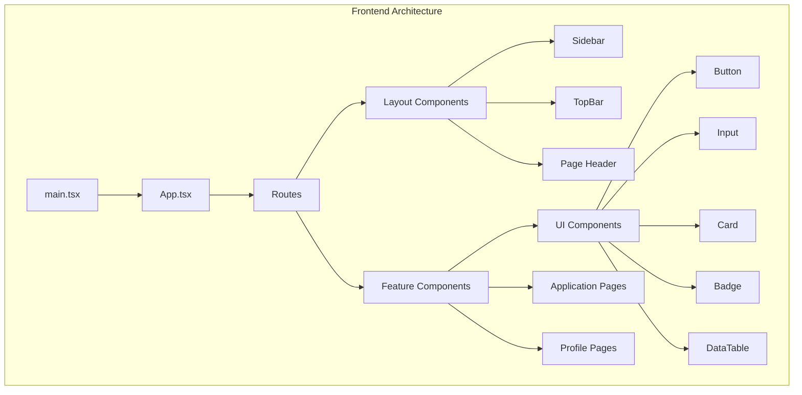
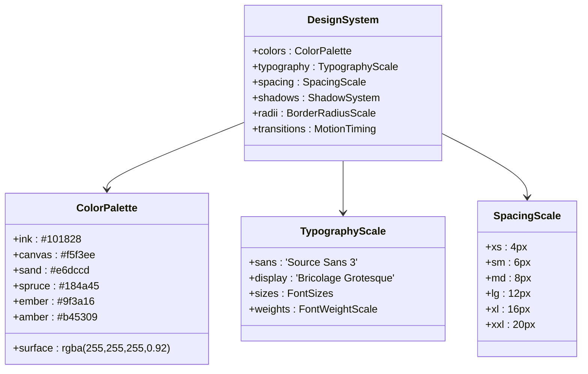
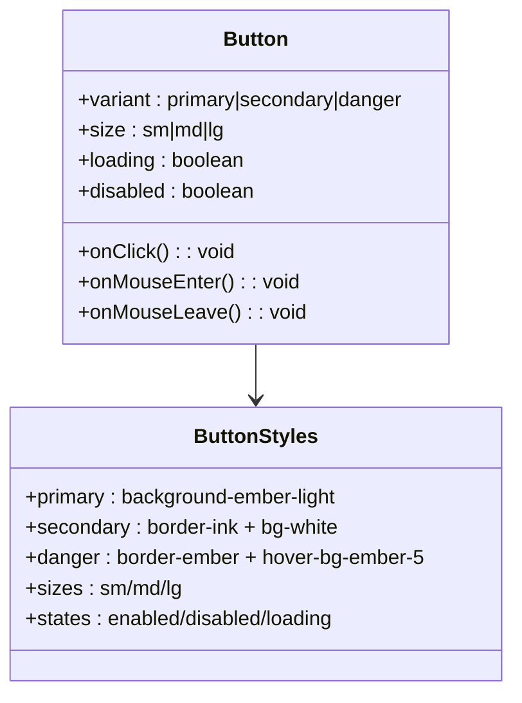
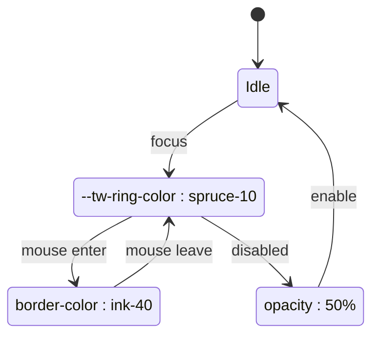
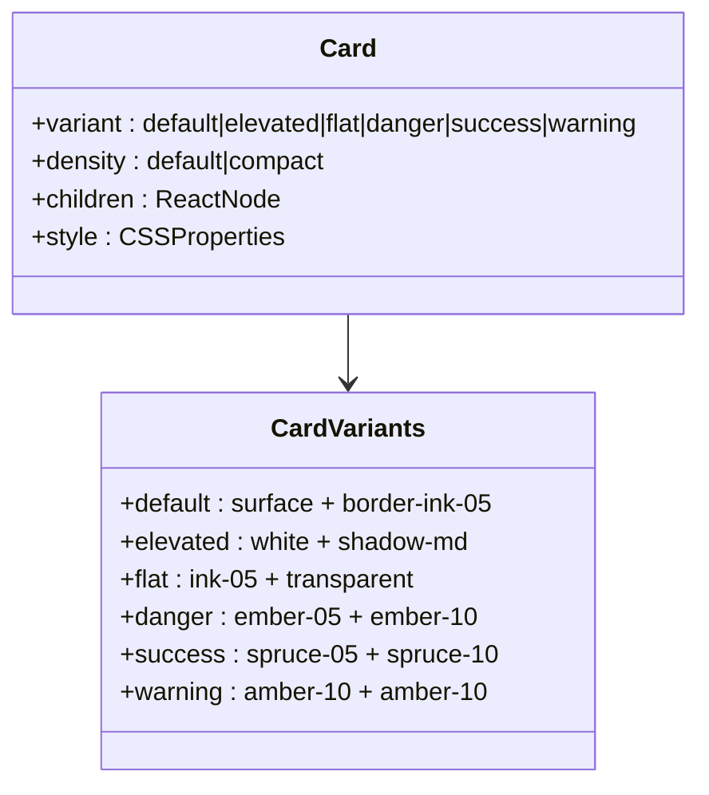
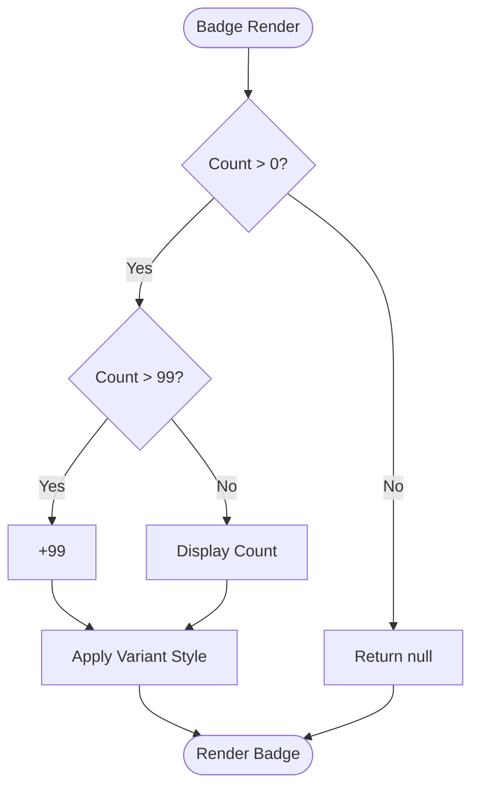
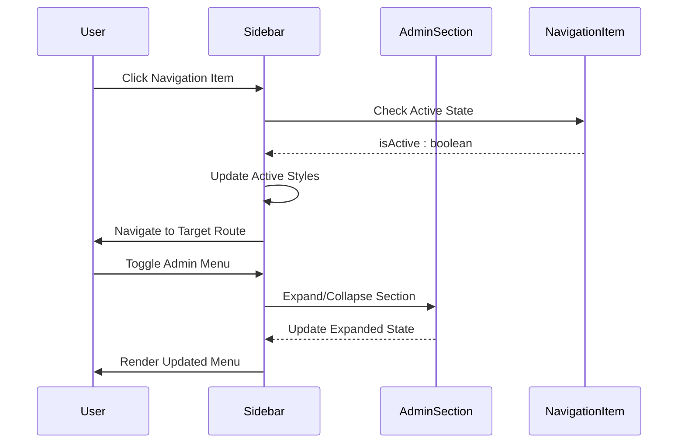
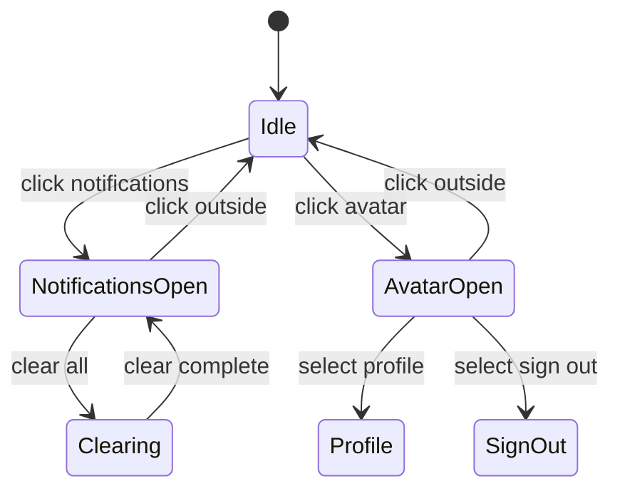
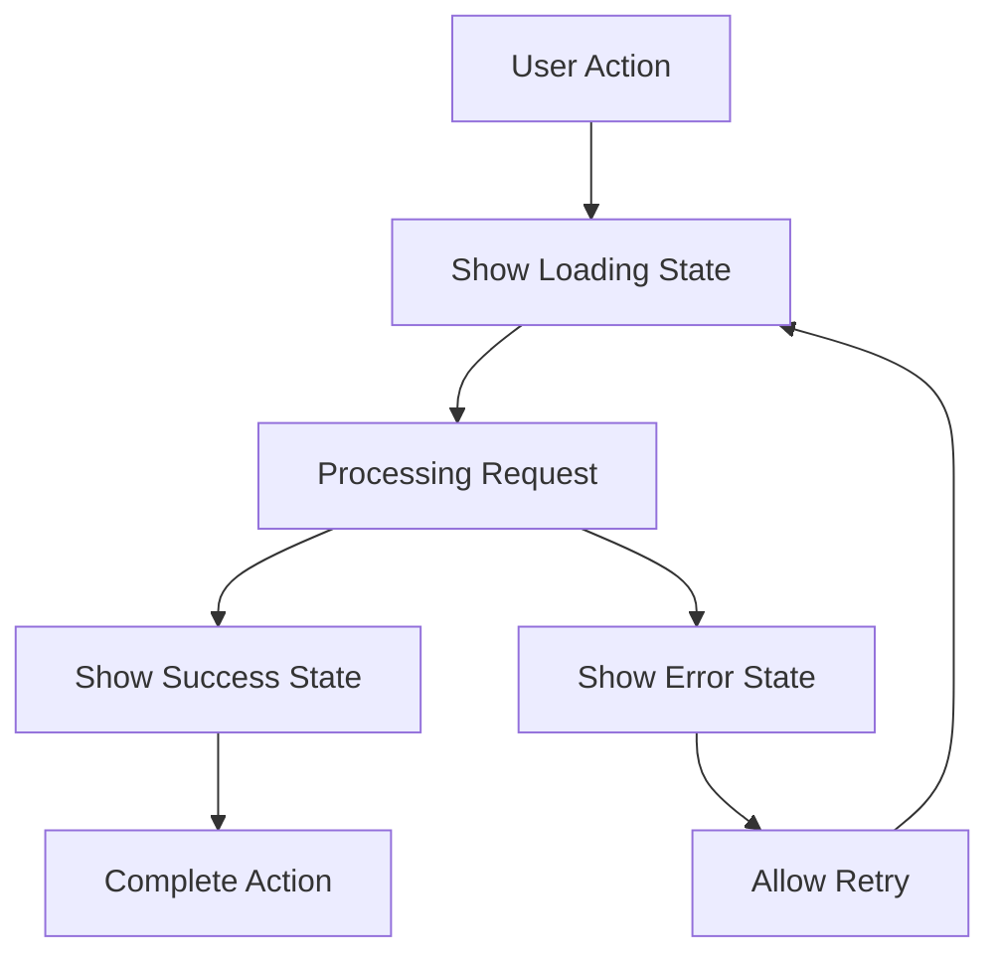
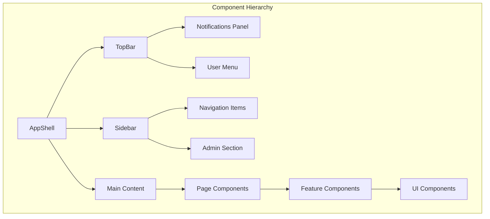

# Frontend UI Components and Design System

<cite>
**Referenced Files in This Document**
- [package.json](file://frontend/package.json)
- [tailwind.config.ts](file://frontend/tailwind.config.ts)
- [index.css](file://frontend/src/index.css)
- [utils.ts](file://frontend/src/lib/utils.ts)
- [App.tsx](file://frontend/src/App.tsx)
- [main.tsx](file://frontend/src/main.tsx)
- [button.tsx](file://frontend/src/components/ui/button.tsx)
- [input.tsx](file://frontend/src/components/ui/input.tsx)
- [card.tsx](file://frontend/src/components/ui/card.tsx)
- [badge.tsx](file://frontend/src/components/ui/badge.tsx)
- [select.tsx](file://frontend/src/components/ui/select.tsx)
- [data-table.tsx](file://frontend/src/components/ui/data-table.tsx)
- [Sidebar.tsx](file://frontend/src/components/layout/Sidebar.tsx)
- [TopBar.tsx](file://frontend/src/components/layout/TopBar.tsx)
</cite>

## Table of Contents
1. [Introduction](#introduction)
2. [Project Structure](#project-structure)
3. [Design System Foundation](#design-system-foundation)
4. [Core UI Components](#core-ui-components)
5. [Layout System](#layout-system)
6. [Typography and Spacing](#typography-and-spacing)
7. [Color System](#color-system)
8. [Interactive States](#interactive-states)
9. [Component Architecture](#component-architecture)
10. [Accessibility Features](#accessibility-features)
11. [Performance Considerations](#performance-considerations)
12. [Best Practices](#best-practices)
13. [Troubleshooting Guide](#troubleshooting-guide)
14. [Conclusion](#conclusion)

## Introduction

The frontend UI components and design system represent a comprehensive React-based interface for an AI-powered job application platform. This system emphasizes consistency, accessibility, and performance while providing a cohesive user experience across various job application workflows. The design system is built on modern web standards with a focus on maintainability and scalability.

## Project Structure

The frontend architecture follows a modular component-based structure with clear separation of concerns:

**Diagram sources**
- [main.tsx:1-14](file://frontend/src/main.tsx#L1-L14)
- [App.tsx:17-58](file://frontend/src/App.tsx#L17-L58)

**Section sources**
- [main.tsx:1-14](file://frontend/src/main.tsx#L1-L14)
- [App.tsx:17-58](file://frontend/src/App.tsx#L17-L58)

## Design System Foundation

The design system is built on a foundation of CSS custom properties, Tailwind CSS, and TypeScript, providing a robust framework for consistent styling and component development.

### CSS Custom Properties System

The design system utilizes a comprehensive CSS custom properties approach for maintaining design consistency:

**Diagram sources**
- [index.css:8-77](file://frontend/src/index.css#L8-L77)
- [tailwind.config.ts:5-35](file://frontend/tailwind.config.ts#L5-L35)

### Tailwind CSS Configuration

The Tailwind configuration extends the base design system with custom properties for seamless integration:

| Property Category | Configuration | Purpose |
|-------------------|---------------|---------|
| Colors | CSS Variables | Dynamic color theming |
| Typography | Custom Fonts | Consistent font scaling |
| Shadows | CSS Variables | Unified shadow system |
| Border Radius | CSS Variables | Consistent corner radii |
| Spacing | CSS Variables | Flexible spacing scale |

**Section sources**
- [tailwind.config.ts:1-39](file://frontend/tailwind.config.ts#L1-L39)
- [index.css:8-77](file://frontend/src/index.css#L8-L77)

## Core UI Components

The UI component library provides reusable, accessible, and customizable building blocks for the application interface.

### Button Component

The Button component offers multiple variants, sizes, and states with consistent styling:

**Diagram sources**
- [button.tsx:10-71](file://frontend/src/components/ui/button.tsx#L10-L71)

#### Button Variants and Behaviors

| Variant | Visual Style | Interaction | Use Case |
|---------|--------------|-------------|----------|
| Primary | Solid ember background | Darkens on hover | Primary actions |
| Secondary | White background with border | Spruce text on hover | Secondary actions |
| Danger | Transparent with ember border | Light ember background | Destructive actions |

**Section sources**
- [button.tsx:1-71](file://frontend/src/components/ui/button.tsx#L1-L71)

### Input Component

The Input component provides consistent styling with focus states and validation feedback:

**Diagram sources**
- [input.tsx:4-27](file://frontend/src/components/ui/input.tsx#L4-L27)

**Section sources**
- [input.tsx:1-27](file://frontend/src/components/ui/input.tsx#L1-L27)

### Card Component

The Card component supports multiple visual states and density levels:

**Diagram sources**
- [card.tsx:20-36](file://frontend/src/components/ui/card.tsx#L20-L36)

**Section sources**
- [card.tsx:1-36](file://frontend/src/components/ui/card.tsx#L1-L36)

### Badge Component

The Badge component displays numerical counts with adaptive styling:

**Diagram sources**
- [badge.tsx:15-30](file://frontend/src/components/ui/badge.tsx#L15-L30)

**Section sources**
- [badge.tsx:1-30](file://frontend/src/components/ui/badge.tsx#L1-L30)

### Select Component

The Select component maintains native browser functionality while enhancing visual consistency:

**Section sources**
- [select.tsx:1-25](file://frontend/src/components/ui/select.tsx#L1-L25)

## Layout System

The layout system provides a responsive, accessible navigation structure with consistent spacing and visual hierarchy.

### Sidebar Navigation

The Sidebar component implements collapsible navigation with admin-specific sections:

**Diagram sources**
- [Sidebar.tsx:94-276](file://frontend/src/components/layout/Sidebar.tsx#L94-L276)

#### Navigation Structure

| Section | Items | Access Control | Features |
|---------|-------|----------------|----------|
| Main Navigation | Dashboard, Applications, Resumes, Extension | All Users | Badge indicators, active state highlighting |
| Admin Section | Metrics, User Management | Admin Users | Collapsible expansion, nested navigation |
| User Actions | Sign Out | All Users | Avatar-based dropdown menu |

**Section sources**
- [Sidebar.tsx:1-276](file://frontend/src/components/layout/Sidebar.tsx#L1-L276)

### Top Bar Interface

The Top Bar provides contextual navigation, notifications, and user management:

**Diagram sources**
- [TopBar.tsx:67-473](file://frontend/src/components/layout/TopBar.tsx#L67-L473)

**Section sources**
- [TopBar.tsx:1-473](file://frontend/src/components/layout/TopBar.tsx#L1-L473)

## Typography and Spacing

The typography system provides consistent font scaling and spacing across the interface.

### Font System

| Font Family | Usage | Properties |
|-------------|-------|------------|
| Source Sans 3 | Body text, interface elements | Regular, Medium, SemiBold weights |
| Bricolage Grotesque | Display headings, branding | Clean geometric proportions |
| JetBrains Mono | Code blocks, technical content | Monospaced for readability |

### Spacing Scale

The spacing system uses a consistent 4px increment scale:

| Size | Pixels | Usage |
|------|--------|-------|
| xs | 4px | Small gaps, minimal padding |
| sm | 6px | Form elements, small components |
| md | 8px | Standard gaps, base padding |
| lg | 12px | Large gaps, section spacing |
| xl | 16px | Major sections, spacing |
| xxl | 20px | Large containers, spacing |

**Section sources**
- [index.css:16-34](file://frontend/src/index.css#L16-L34)
- [tailwind.config.ts:16-34](file://frontend/tailwind.config.ts#L16-L34)

## Color System

The color palette consists of carefully selected hues optimized for accessibility and visual hierarchy.

### Core Color Palette

| Color Name | Hex Value | Usage | Accessibility |
|------------|-----------|-------|---------------|
| Ink | #101828 | Primary text, darkest elements | WCAG AA compliant |
| Canvas | #f5f3ee | Background surfaces | Excellent contrast |
| Sand | #e6dccd | Subtle backgrounds, borders | Good contrast |
| Spruce | #184a45 | Primary brand, success states | WCAG AA compliant |
| Ember | #9f3a16 | Danger states, accents | WCAG AA compliant |
| Amber | #b45309 | Warning states, highlights | WCAG AA compliant |
| Surface | rgba(255,255,255,0.92) | Card surfaces | High contrast |

### Semantic Color Usage

| Semantic Purpose | Color | Variants | Use Cases |
|------------------|-------|----------|-----------|
| Success | Spruce | Light variants | Form completion, positive feedback |
| Warning | Amber | Light variants | Caution messages, pending actions |
| Danger | Ember | Light variants | Error states, destructive actions |
| Info | Ink | Light variants | Neutral information, tooltips |
| Brand | Spruce | Dark/light variants | Primary actions, branding elements |

**Section sources**
- [index.css:9-36](file://frontend/src/index.css#L9-L36)

## Interactive States

The interactive system provides consistent feedback across all user interface elements.

### Hover and Focus States

| Element Type | State | Visual Change | Purpose |
|-------------|-------|---------------|---------|
| Buttons | Hover | Background color change | Action indication |
| Links | Hover | Underline appearance | Navigation hint |
| Cards | Hover | Background tint | Selection feedback |
| Inputs | Focus | Ring highlight | Focus indication |
| Navigation | Active | Accent border | Location awareness |

### Loading States

The system implements consistent loading indicators:

**Diagram sources**
- [button.tsx:62-66](file://frontend/src/components/ui/button.tsx#L62-L66)

**Section sources**
- [button.tsx:41-58](file://frontend/src/components/ui/button.tsx#L41-L58)

## Component Architecture

The component architecture follows React best practices with TypeScript integration and composition patterns.

### Component Composition Pattern

**Diagram sources**
- [App.tsx:22-54](file://frontend/src/App.tsx#L22-L54)

### Props and State Management

Components utilize a consistent pattern for props and state:

| Component Type | Props Pattern | State Management | Event Handling |
|----------------|---------------|------------------|----------------|
| Presentational | TypeScript interfaces | Local state | Callback props |
| Container | Data fetching | Context providers | Event delegation |
| Composite | Composition patterns | Controlled/uncontrolled | Event bubbling |

**Section sources**
- [App.tsx:17-58](file://frontend/src/App.tsx#L17-L58)

## Accessibility Features

The design system incorporates comprehensive accessibility features following WCAG guidelines.

### Keyboard Navigation

| Feature | Implementation | Testing |
|---------|----------------|---------|
| Focus Management | Automatic focus trapping | Tab order verification |
| Keyboard Shortcuts | Arrow key navigation | Screen reader compatibility |
| ARIA Labels | Descriptive labels | VoiceOver testing |
| Screen Reader | Semantic markup | NVDA compatibility |

### Color Contrast

All components maintain minimum 4.5:1 contrast ratios for normal text and 3:1 for large text, ensuring accessibility compliance.

### Responsive Design

The system adapts to various screen sizes with breakpoint-specific adjustments for optimal user experience.

**Section sources**
- [index.css:448-480](file://frontend/src/index.css#L448-L480)

## Performance Considerations

The design system prioritizes performance through efficient rendering and resource management.

### Rendering Optimization

| Optimization Technique | Benefit | Implementation |
|----------------------|---------|----------------|
| CSS-in-JS with variables | Reduced bundle size | Tailwind CSS integration |
| Component memoization | Faster re-renders | React.memo usage |
| Lazy loading | Initial load speed | Dynamic imports |
| Virtual scrolling | Large dataset performance | Windowing technique |

### Bundle Size Management

The system maintains a lean bundle size through strategic dependency selection and tree shaking optimization.

**Section sources**
- [package.json:13-25](file://frontend/package.json#L13-L25)

## Best Practices

### Component Development Guidelines

1. **Consistency**: Always use design system tokens for colors, spacing, and typography
2. **Accessibility**: Include proper ARIA attributes and keyboard navigation support
3. **Performance**: Implement appropriate memoization and lazy loading strategies
4. **Testing**: Write comprehensive unit tests with visual regression coverage

### Styling Conventions

- Use CSS custom properties for all design tokens
- Leverage Tailwind utility classes for consistent spacing and typography
- Implement component-specific styles only when necessary
- Maintain consistent naming conventions for CSS classes

### State Management

- Keep component state local when possible
- Use context providers for cross-component data sharing
- Implement proper cleanup for event listeners and subscriptions
- Handle asynchronous operations with proper loading and error states

## Troubleshooting Guide

### Common Issues and Solutions

| Issue | Symptoms | Solution |
|-------|----------|----------|
| Styling conflicts | Unexpected component appearance | Check CSS specificity and ordering |
| Performance issues | Slow rendering or animations | Implement React.memo and optimize heavy components |
| Accessibility problems | Screen reader issues | Add proper ARIA attributes and keyboard navigation |
| Responsive problems | Layout breaks on mobile | Verify media queries and viewport settings |

### Debugging Tools

- Browser DevTools for CSS inspection
- React Developer Tools for component hierarchy
- Accessibility testing tools for compliance verification
- Performance profiling for optimization opportunities

**Section sources**
- [utils.ts:1-4](file://frontend/src/lib/utils.ts#L1-L4)

## Conclusion

The frontend UI components and design system provide a robust, accessible, and performant foundation for the job application platform. The system's emphasis on consistency, maintainability, and user experience ensures scalability across future feature additions while maintaining high standards for accessibility and performance.

The modular architecture, comprehensive design tokens, and thoughtful component patterns create a developer-friendly environment that promotes code quality and reduces technical debt. The integration of modern web standards with practical implementation patterns positions the system for long-term success and evolution.