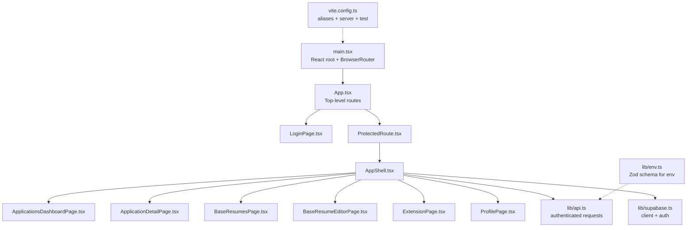
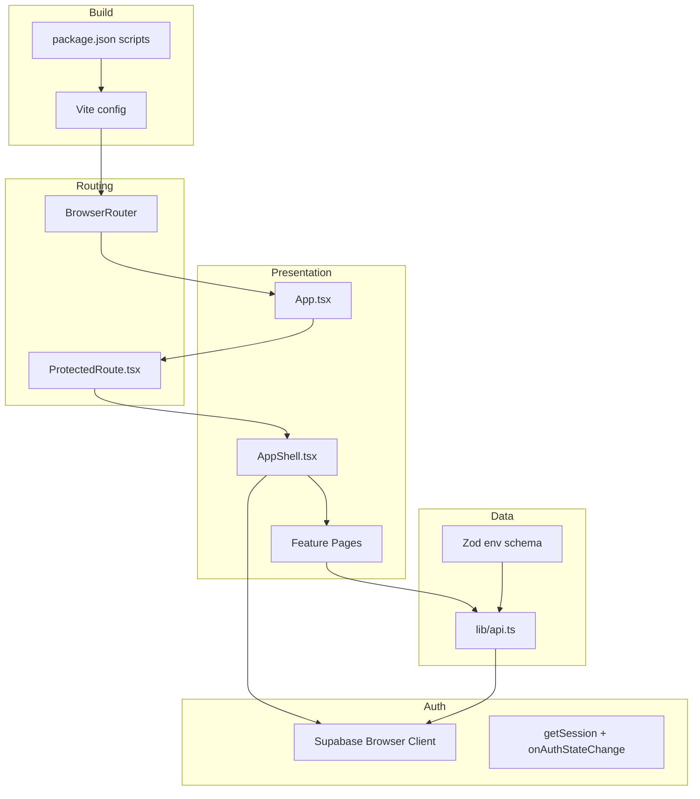
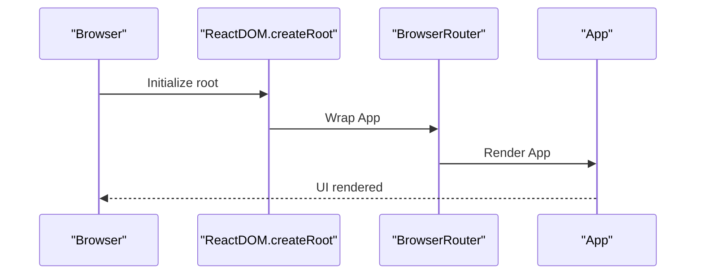
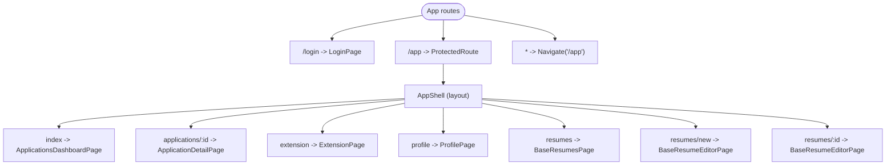
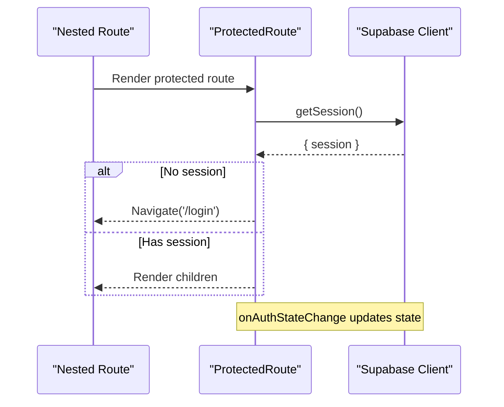
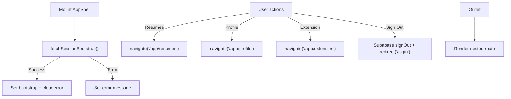
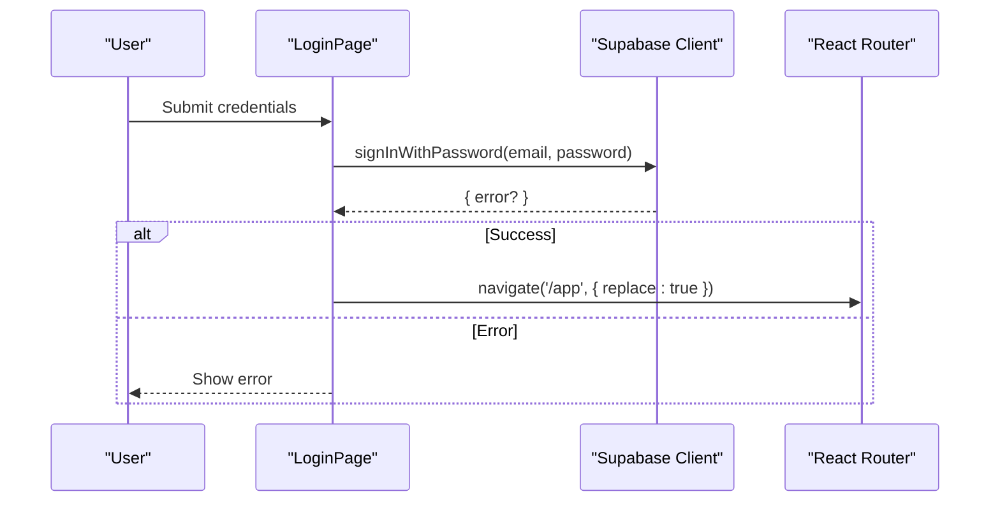
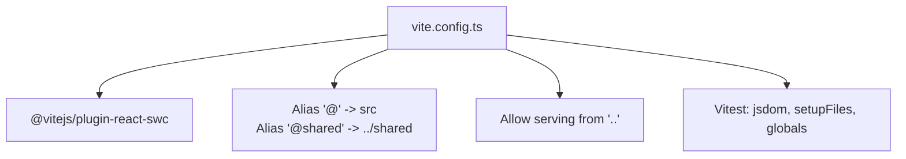
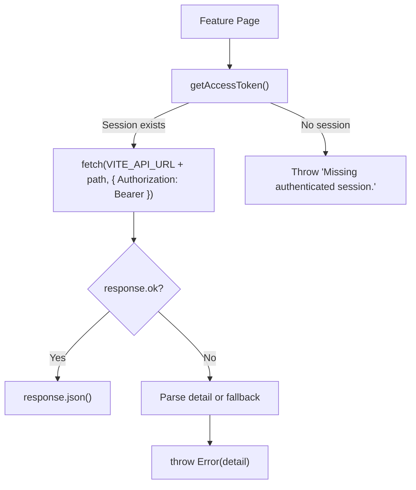
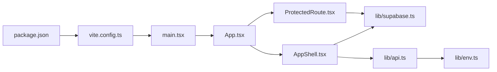

# React Application Structure

<cite>
**Referenced Files in This Document**
- [main.tsx](file://frontend/src/main.tsx)
- [App.tsx](file://frontend/src/App.tsx)
- [AppShell.tsx](file://frontend/src/routes/AppShell.tsx)
- [ProtectedRoute.tsx](file://frontend/src/routes/ProtectedRoute.tsx)
- [LoginPage.tsx](file://frontend/src/routes/LoginPage.tsx)
- [ApplicationsDashboardPage.tsx](file://frontend/src/routes/ApplicationsDashboardPage.tsx)
- [ApplicationDetailPage.tsx](file://frontend/src/routes/ApplicationDetailPage.tsx)
- [BaseResumesPage.tsx](file://frontend/src/routes/BaseResumesPage.tsx)
- [BaseResumeEditorPage.tsx](file://frontend/src/routes/BaseResumeEditorPage.tsx)
- [ExtensionPage.tsx](file://frontend/src/routes/ExtensionPage.tsx)
- [ProfilePage.tsx](file://frontend/src/routes/ProfilePage.tsx)
- [supabase.ts](file://frontend/src/lib/supabase.ts)
- [api.ts](file://frontend/src/lib/api.ts)
- [env.ts](file://frontend/src/lib/env.ts)
- [vite.config.ts](file://frontend/vite.config.ts)
- [package.json](file://frontend/package.json)
</cite>

## Table of Contents
1. [Introduction](#introduction)
2. [Project Structure](#project-structure)
3. [Core Components](#core-components)
4. [Architecture Overview](#architecture-overview)
5. [Detailed Component Analysis](#detailed-component-analysis)
6. [Dependency Analysis](#dependency-analysis)
7. [Performance Considerations](#performance-considerations)
8. [Troubleshooting Guide](#troubleshooting-guide)
9. [Conclusion](#conclusion)

## Introduction
This document explains the React 19 application structure and configuration for the frontend. It covers the application entry point, routing with React Router DOM, the shell component architecture, route protection, and the Vite build and development setup. It also describes how the application initializes, how global providers and contexts are established, and how routing integrates with authentication and session bootstrapping.

## Project Structure
The frontend is organized around a clear separation of concerns:
- Entry point initializes the React root, strict mode, router, and global styles.
- Routing is centralized in App.tsx with nested routes under /app protected by authentication.
- Shell layout is provided by AppShell.tsx, rendering the main header and navigation alongside a content outlet.
- Feature pages are grouped under routes/ and consume shared APIs via lib/.
- Vite handles builds, aliases, and testing configuration.

**Diagram sources**
- [main.tsx:1-14](file://frontend/src/main.tsx#L1-L14)
- [App.tsx:1-36](file://frontend/src/App.tsx#L1-L36)
- [AppShell.tsx:1-89](file://frontend/src/routes/AppShell.tsx#L1-L89)
- [ProtectedRoute.tsx:1-44](file://frontend/src/routes/ProtectedRoute.tsx#L1-L44)
- [LoginPage.tsx:1-111](file://frontend/src/routes/LoginPage.tsx#L1-L111)
- [ApplicationsDashboardPage.tsx:1-264](file://frontend/src/routes/ApplicationsDashboardPage.tsx#L1-L264)
- [ApplicationDetailPage.tsx:1-800](file://frontend/src/routes/ApplicationDetailPage.tsx#L1-L800)
- [BaseResumesPage.tsx:1-185](file://frontend/src/routes/BaseResumesPage.tsx#L1-L185)
- [BaseResumeEditorPage.tsx:1-472](file://frontend/src/routes/BaseResumeEditorPage.tsx#L1-L472)
- [ExtensionPage.tsx:1-200](file://frontend/src/routes/ExtensionPage.tsx#L1-L200)
- [ProfilePage.tsx:1-264](file://frontend/src/routes/ProfilePage.tsx#L1-L264)
- [api.ts:1-489](file://frontend/src/lib/api.ts#L1-L489)
- [supabase.ts:1-26](file://frontend/src/lib/supabase.ts#L1-L26)
- [vite.config.ts:1-24](file://frontend/vite.config.ts#L1-L24)
- [env.ts:1-15](file://frontend/src/lib/env.ts#L1-L15)

**Section sources**
- [main.tsx:1-14](file://frontend/src/main.tsx#L1-L14)
- [App.tsx:1-36](file://frontend/src/App.tsx#L1-L36)
- [vite.config.ts:1-24](file://frontend/vite.config.ts#L1-L24)

## Core Components
- Application entry point: Creates the React root and wraps the app in BrowserRouter.
- Top-level routing: Declares login and protected /app routes with nested pages.
- Authentication guard: Protects /app routes using Supabase session state.
- Shell layout: Provides branding, navigation, sign-out, and session bootstrap status.
- Feature pages: Dashboard, detail, resumes, editor, extension, and profile.
- API client: Centralizes authenticated requests and uploads with bearer tokens.
- Supabase client: Singleton browser client with persisted session configuration.
- Environment validation: Zod-based schema for Vite environment variables.

**Section sources**
- [main.tsx:1-14](file://frontend/src/main.tsx#L1-L14)
- [App.tsx:1-36](file://frontend/src/App.tsx#L1-L36)
- [ProtectedRoute.tsx:1-44](file://frontend/src/routes/ProtectedRoute.tsx#L1-L44)
- [AppShell.tsx:1-89](file://frontend/src/routes/AppShell.tsx#L1-L89)
- [api.ts:1-489](file://frontend/src/lib/api.ts#L1-L489)
- [supabase.ts:1-26](file://frontend/src/lib/supabase.ts#L1-L26)
- [env.ts:1-15](file://frontend/src/lib/env.ts#L1-L15)

## Architecture Overview
The application follows a layered architecture:
- Presentation layer: React components and pages.
- Routing layer: React Router DOM with nested routes and guards.
- Authentication layer: Supabase auth session management and state change subscriptions.
- Data layer: Shared API module handles authenticated fetch and upload helpers.
- Configuration layer: Vite for bundling, aliases, dev server, and test environment.

**Diagram sources**
- [main.tsx:1-14](file://frontend/src/main.tsx#L1-L14)
- [App.tsx:1-36](file://frontend/src/App.tsx#L1-L36)
- [ProtectedRoute.tsx:1-44](file://frontend/src/routes/ProtectedRoute.tsx#L1-L44)
- [AppShell.tsx:1-89](file://frontend/src/routes/AppShell.tsx#L1-L89)
- [api.ts:1-489](file://frontend/src/lib/api.ts#L1-L489)
- [supabase.ts:1-26](file://frontend/src/lib/supabase.ts#L1-L26)
- [env.ts:1-15](file://frontend/src/lib/env.ts#L1-L15)
- [vite.config.ts:1-24](file://frontend/vite.config.ts#L1-L24)
- [package.json:1-38](file://frontend/package.json#L1-L38)

## Detailed Component Analysis

### Application Entry Point and Initialization
- The entry point creates the React root and mounts the App inside BrowserRouter.
- Global CSS is imported to ensure consistent styling across the app.
- Strict Mode is enabled to surface potential issues early.

**Diagram sources**
- [main.tsx:1-14](file://frontend/src/main.tsx#L1-L14)

**Section sources**
- [main.tsx:1-14](file://frontend/src/main.tsx#L1-L14)

### Routing Configuration and Nested Structure
- Top-level routes:
  - /login renders LoginPage.
  - /app is guarded by ProtectedRoute and renders AppShell as layout.
- AppShell hosts nested routes:
  - index → ApplicationsDashboardPage
  - applications/:applicationId → ApplicationDetailPage
  - extension → ExtensionPage
  - profile → ProfilePage
  - resumess → BaseResumesPage
  - resumess/new and resumess/:resumeId → BaseResumeEditorPage
- Catch-all route navigates to /app.

**Diagram sources**
- [App.tsx:1-36](file://frontend/src/App.tsx#L1-L36)
- [ApplicationsDashboardPage.tsx:1-264](file://frontend/src/routes/ApplicationsDashboardPage.tsx#L1-L264)
- [ApplicationDetailPage.tsx:1-800](file://frontend/src/routes/ApplicationDetailPage.tsx#L1-L800)
- [BaseResumesPage.tsx:1-185](file://frontend/src/routes/BaseResumesPage.tsx#L1-L185)
- [BaseResumeEditorPage.tsx:1-472](file://frontend/src/routes/BaseResumeEditorPage.tsx#L1-L472)
- [ExtensionPage.tsx:1-200](file://frontend/src/routes/ExtensionPage.tsx#L1-L200)
- [ProfilePage.tsx:1-264](file://frontend/src/routes/ProfilePage.tsx#L1-L264)

**Section sources**
- [App.tsx:1-36](file://frontend/src/App.tsx#L1-L36)

### Route Protection with ProtectedRoute
- On mount, retrieves the current session from Supabase.
- Subscribes to auth state changes to keep protection synchronized.
- While loading, displays a centered loader UI.
- If not authenticated, redirects to /login.

**Diagram sources**
- [ProtectedRoute.tsx:1-44](file://frontend/src/routes/ProtectedRoute.tsx#L1-L44)
- [supabase.ts:1-26](file://frontend/src/lib/supabase.ts#L1-L26)

**Section sources**
- [ProtectedRoute.tsx:1-44](file://frontend/src/routes/ProtectedRoute.tsx#L1-L44)
- [supabase.ts:1-26](file://frontend/src/lib/supabase.ts#L1-L26)

### AppShell Component and Layout Management
- Fetches session bootstrap data on mount to display user info and manage errors.
- Provides quick navigation to key areas (/resumes, /profile, /extension).
- Exposes a sign-out handler that calls Supabase auth signOut and redirects to /login.
- Renders the Outlet for nested route content.

**Diagram sources**
- [AppShell.tsx:1-89](file://frontend/src/routes/AppShell.tsx#L1-L89)
- [api.ts:240-242](file://frontend/src/lib/api.ts#L240-L242)
- [supabase.ts:1-26](file://frontend/src/lib/supabase.ts#L1-L26)

**Section sources**
- [AppShell.tsx:1-89](file://frontend/src/routes/AppShell.tsx#L1-L89)
- [api.ts:240-242](file://frontend/src/lib/api.ts#L240-L242)

### Authentication Flow and Session Bootstrapping
- LoginPage uses Supabase to sign in with email/password and navigates to /app upon success.
- ProtectedRoute ensures only authenticated users can access /app routes.
- AppShell fetches session bootstrap data to present user context and handle failures.

**Diagram sources**
- [LoginPage.tsx:1-111](file://frontend/src/routes/LoginPage.tsx#L1-L111)
- [ProtectedRoute.tsx:1-44](file://frontend/src/routes/ProtectedRoute.tsx#L1-L44)
- [AppShell.tsx:1-89](file://frontend/src/routes/AppShell.tsx#L1-L89)

**Section sources**
- [LoginPage.tsx:1-111](file://frontend/src/routes/LoginPage.tsx#L1-L111)
- [ProtectedRoute.tsx:1-44](file://frontend/src/routes/ProtectedRoute.tsx#L1-L44)
- [AppShell.tsx:1-89](file://frontend/src/routes/AppShell.tsx#L1-L89)

### Vite Configuration and Build Settings
- Plugins: @vitejs/plugin-react-swc for fast React transforms.
- Aliases: @ resolves to src, @shared to ../shared for cross-package imports.
- Dev server: Allows serving from parent directory for monorepo-like setups.
- Test environment: jsdom with Vitest, setup files, and globals enabled.

**Diagram sources**
- [vite.config.ts:1-24](file://frontend/vite.config.ts#L1-L24)

**Section sources**
- [vite.config.ts:1-24](file://frontend/vite.config.ts#L1-L24)
- [package.json:1-38](file://frontend/package.json#L1-L38)

### Environment Variables and Validation
- Environment variables are validated at runtime using Zod schema.
- Required variables include VITE_SUPABASE_URL, VITE_SUPABASE_ANON_KEY, VITE_API_URL, plus optional flags like VITE_APP_ENV and VITE_APP_DEV_MODE.
- The schema enforces URL formats and boolean parsing for flags.

**Section sources**
- [env.ts:1-15](file://frontend/src/lib/env.ts#L1-L15)

### API Layer and Data Access Patterns
- Centralized authenticated requests and uploads:
  - getAccessToken reads the current session token from Supabase.
  - authenticatedRequest performs fetch with Authorization: Bearer header and parses JSON.
  - authenticatedUpload posts multipart/form-data with Authorization header.
  - Specific endpoints for sessions, applications, base resumes, profile, and extension.
- Error handling: Non-2xx responses parse a detail field from JSON or fall back to generic messages.

**Diagram sources**
- [api.ts:177-214](file://frontend/src/lib/api.ts#L177-L214)
- [api.ts:216-238](file://frontend/src/lib/api.ts#L216-L238)
- [supabase.ts:1-26](file://frontend/src/lib/supabase.ts#L1-L26)
- [env.ts:1-15](file://frontend/src/lib/env.ts#L1-L15)

**Section sources**
- [api.ts:1-489](file://frontend/src/lib/api.ts#L1-L489)
- [supabase.ts:1-26](file://frontend/src/lib/supabase.ts#L1-L26)
- [env.ts:1-15](file://frontend/src/lib/env.ts#L1-L15)

### Feature Pages Overview
- ApplicationsDashboardPage: Lists, filters, sorts, and creates applications; navigates to detail on creation.
- ApplicationDetailPage: Comprehensive workflow page with extraction progress, manual entry, duplicate review, generation controls, draft editing, and PDF export.
- BaseResumesPage: Lists, sets default, and deletes base resumes; navigates to editor.
- BaseResumeEditorPage: Supports upload, review, blank creation, editing, deletion, and setting default.
- ExtensionPage: Manages Chrome extension connection via token issuance and revocation, with messaging to the extension bridge.
- ProfilePage: Loads and updates personal information and section preferences.

**Section sources**
- [ApplicationsDashboardPage.tsx:1-264](file://frontend/src/routes/ApplicationsDashboardPage.tsx#L1-L264)
- [ApplicationDetailPage.tsx:1-800](file://frontend/src/routes/ApplicationDetailPage.tsx#L1-L800)
- [BaseResumesPage.tsx:1-185](file://frontend/src/routes/BaseResumesPage.tsx#L1-L185)
- [BaseResumeEditorPage.tsx:1-472](file://frontend/src/routes/BaseResumeEditorPage.tsx#L1-L472)
- [ExtensionPage.tsx:1-200](file://frontend/src/routes/ExtensionPage.tsx#L1-L200)
- [ProfilePage.tsx:1-264](file://frontend/src/routes/ProfilePage.tsx#L1-L264)

## Dependency Analysis
- Entry point depends on React, ReactDOM, and BrowserRouter.
- App composes route components and ProtectedRoute.
- ProtectedRoute depends on Supabase client for session checks and auth state subscriptions.
- AppShell depends on Supabase client for sign-out and on API for session bootstrap.
- Feature pages depend on lib/api for data operations.
- Vite configuration influences module resolution and test environment.

**Diagram sources**
- [main.tsx:1-14](file://frontend/src/main.tsx#L1-L14)
- [App.tsx:1-36](file://frontend/src/App.tsx#L1-L36)
- [ProtectedRoute.tsx:1-44](file://frontend/src/routes/ProtectedRoute.tsx#L1-L44)
- [AppShell.tsx:1-89](file://frontend/src/routes/AppShell.tsx#L1-L89)
- [api.ts:1-489](file://frontend/src/lib/api.ts#L1-L489)
- [supabase.ts:1-26](file://frontend/src/lib/supabase.ts#L1-L26)
- [env.ts:1-15](file://frontend/src/lib/env.ts#L1-L15)
- [vite.config.ts:1-24](file://frontend/vite.config.ts#L1-L24)
- [package.json:1-38](file://frontend/package.json#L1-L38)

**Section sources**
- [main.tsx:1-14](file://frontend/src/main.tsx#L1-L14)
- [App.tsx:1-36](file://frontend/src/App.tsx#L1-L36)
- [ProtectedRoute.tsx:1-44](file://frontend/src/routes/ProtectedRoute.tsx#L1-L44)
- [AppShell.tsx:1-89](file://frontend/src/routes/AppShell.tsx#L1-L89)
- [api.ts:1-489](file://frontend/src/lib/api.ts#L1-L489)
- [supabase.ts:1-26](file://frontend/src/lib/supabase.ts#L1-L26)
- [env.ts:1-15](file://frontend/src/lib/env.ts#L1-L15)
- [vite.config.ts:1-24](file://frontend/vite.config.ts#L1-L24)
- [package.json:1-38](file://frontend/package.json#L1-L38)

## Performance Considerations
- Prefer deferred values for search inputs to avoid unnecessary re-renders during typing.
- Use optimistic UI updates for generation triggers and clear them when polling completes.
- Debounce autosaves to reduce network requests.
- Keep heavy computations off the render path; memoize derived data where appropriate.
- Lazy-load large components if needed, though current pages appear self-contained.

## Troubleshooting Guide
- Authentication issues:
  - Verify VITE_SUPABASE_URL and VITE_SUPABASE_ANON_KEY are set and valid.
  - ProtectedRoute displays a centered loader while checking session; ensure Supabase auth state changes are firing.
  - LoginPage shows error messages returned by Supabase; confirm credentials and network connectivity.
- API errors:
  - Non-2xx responses parse a detail field; check backend logs for the exact cause.
  - Missing access token throws an explicit error; ensure the user is signed in.
- Environment validation:
  - Zod schema enforces URL formats and boolean flags; fix invalid values to prevent runtime errors.
- Vite configuration:
  - Aliases must resolve correctly; ensure @ and @shared paths align with your project structure.
  - Test environment uses jsdom; confirm setup files and globals are configured as expected.

**Section sources**
- [ProtectedRoute.tsx:1-44](file://frontend/src/routes/ProtectedRoute.tsx#L1-L44)
- [LoginPage.tsx:1-111](file://frontend/src/routes/LoginPage.tsx#L1-L111)
- [api.ts:177-214](file://frontend/src/lib/api.ts#L177-L214)
- [env.ts:1-15](file://frontend/src/lib/env.ts#L1-L15)
- [vite.config.ts:1-24](file://frontend/vite.config.ts#L1-L24)

## Conclusion
The application is structured around a clean React 19 + Vite setup with robust routing, authentication, and a shared API layer. AppShell centralizes layout and session state, while ProtectedRoute ensures secure access to authenticated routes. The configuration supports efficient development and testing, and the API module encapsulates authenticated data access with clear error handling.