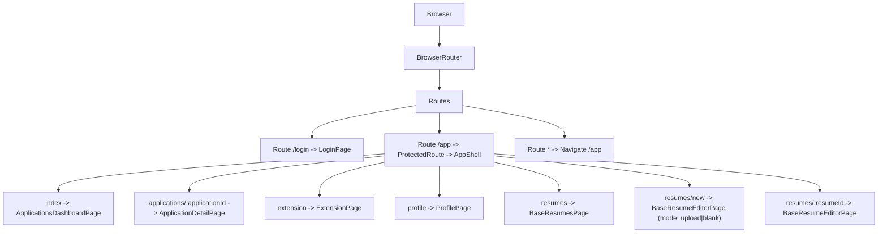
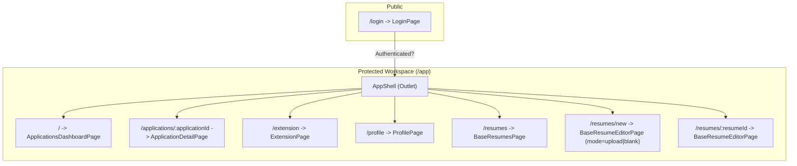
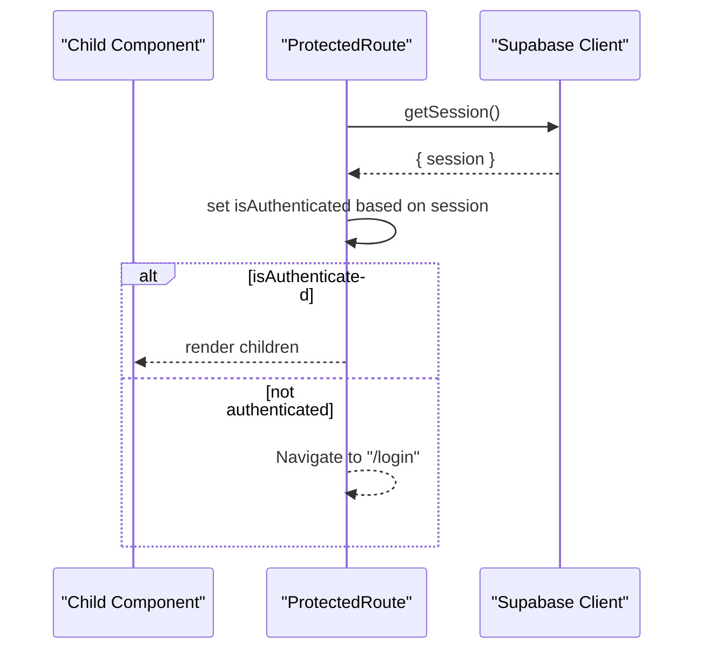
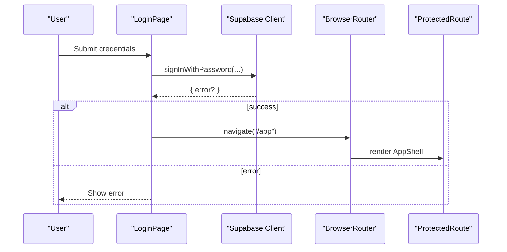
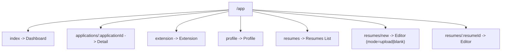
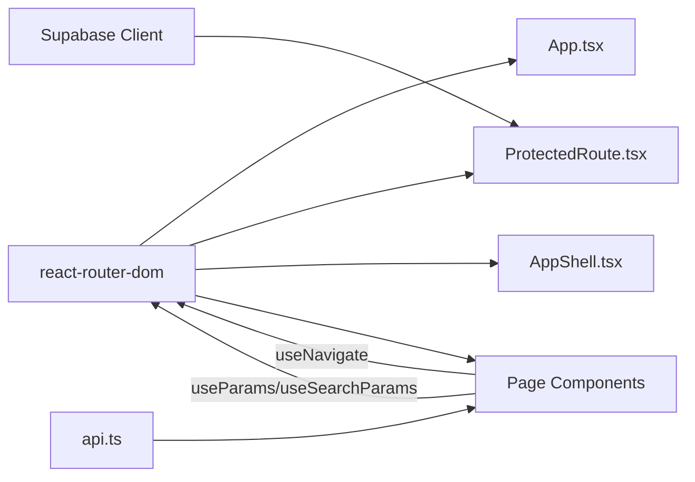

# Routing and Navigation

<cite>
**Referenced Files in This Document**
- [App.tsx](file://frontend/src/App.tsx)
- [main.tsx](file://frontend/src/main.tsx)
- [ProtectedRoute.tsx](file://frontend/src/routes/ProtectedRoute.tsx)
- [AppShell.tsx](file://frontend/src/routes/AppShell.tsx)
- [LoginPage.tsx](file://frontend/src/routes/LoginPage.tsx)
- [ApplicationsDashboardPage.tsx](file://frontend/src/routes/ApplicationsDashboardPage.tsx)
- [ApplicationDetailPage.tsx](file://frontend/src/routes/ApplicationDetailPage.tsx)
- [ExtensionPage.tsx](file://frontend/src/routes/ExtensionPage.tsx)
- [ProfilePage.tsx](file://frontend/src/routes/ProfilePage.tsx)
- [BaseResumesPage.tsx](file://frontend/src/routes/BaseResumesPage.tsx)
- [BaseResumeEditorPage.tsx](file://frontend/src/routes/BaseResumeEditorPage.tsx)
- [api.ts](file://frontend/src/lib/api.ts)
- [package.json](file://frontend/package.json)
- [vite.config.ts](file://frontend/vite.config.ts)
</cite>

## Table of Contents
1. [Introduction](#introduction)
2. [Project Structure](#project-structure)
3. [Core Components](#core-components)
4. [Architecture Overview](#architecture-overview)
5. [Detailed Component Analysis](#detailed-component-analysis)
6. [Dependency Analysis](#dependency-analysis)
7. [Performance Considerations](#performance-considerations)
8. [Troubleshooting Guide](#troubleshooting-guide)
9. [Conclusion](#conclusion)
10. [Appendices](#appendices)

## Introduction
This document explains the React Router DOM implementation and navigation system for the job application project. It covers all application routes, authentication guards, nested routing under the /app path, route parameters and query strings, programmatic navigation, and strategies for route-based code splitting and lazy loading. It also provides guidance on implementing breadcrumbs and managing navigation state.

## Project Structure
The routing is configured at the root level and composed of:
- A top-level router that defines public and protected routes
- A protected shell that enforces authentication for the application workspace
- Nested routes under /app for dashboards, details, extensions, profiles, and resume management
- Programmatic navigation via React Router hooks and API-driven actions

**Diagram sources**
- [App.tsx:12-35](file://frontend/src/App.tsx#L12-L35)
- [main.tsx:7-13](file://frontend/src/main.tsx#L7-L13)

**Section sources**
- [App.tsx:12-35](file://frontend/src/App.tsx#L12-L35)
- [main.tsx:7-13](file://frontend/src/main.tsx#L7-L13)

## Core Components
- BrowserRouter bootstraps routing for the app.
- Routes and Route define the route tree.
- ProtectedRoute enforces authentication for the /app workspace.
- AppShell renders the application shell and nested outlet for child routes.
- Individual page components implement route-specific logic and programmatic navigation.

Key implementation references:
- Router initialization and routing tree: [main.tsx:7-13](file://frontend/src/main.tsx#L7-L13), [App.tsx:12-35](file://frontend/src/App.tsx#L12-L35)
- Authentication guard: [ProtectedRoute.tsx:6-43](file://frontend/src/routes/ProtectedRoute.tsx#L6-L43)
- App shell and nested outlet: [AppShell.tsx:8-87](file://frontend/src/routes/AppShell.tsx#L8-L87)
- Page components: [ApplicationsDashboardPage.tsx:16-263](file://frontend/src/routes/ApplicationsDashboardPage.tsx#L16-L263), [ApplicationDetailPage.tsx:38-800](file://frontend/src/routes/ApplicationDetailPage.tsx#L38-L800), [ExtensionPage.tsx:26-199](file://frontend/src/routes/ExtensionPage.tsx#L26-L199), [ProfilePage.tsx:17-263](file://frontend/src/routes/ProfilePage.tsx#L17-L263), [BaseResumesPage.tsx:12-184](file://frontend/src/routes/BaseResumesPage.tsx#L12-L184), [BaseResumeEditorPage.tsx:19-471](file://frontend/src/routes/BaseResumeEditorPage.tsx#L19-L471)

**Section sources**
- [main.tsx:7-13](file://frontend/src/main.tsx#L7-L13)
- [App.tsx:12-35](file://frontend/src/App.tsx#L12-L35)
- [ProtectedRoute.tsx:6-43](file://frontend/src/routes/ProtectedRoute.tsx#L6-L43)
- [AppShell.tsx:8-87](file://frontend/src/routes/AppShell.tsx#L8-L87)
- [ApplicationsDashboardPage.tsx:16-263](file://frontend/src/routes/ApplicationsDashboardPage.tsx#L16-L263)
- [ApplicationDetailPage.tsx:38-800](file://frontend/src/routes/ApplicationDetailPage.tsx#L38-L800)
- [ExtensionPage.tsx:26-199](file://frontend/src/routes/ExtensionPage.tsx#L26-L199)
- [ProfilePage.tsx:17-263](file://frontend/src/routes/ProfilePage.tsx#L17-L263)
- [BaseResumesPage.tsx:12-184](file://frontend/src/routes/BaseResumesPage.tsx#L12-L184)
- [BaseResumeEditorPage.tsx:19-471](file://frontend/src/routes/BaseResumeEditorPage.tsx#L19-L471)

## Architecture Overview
The routing architecture separates concerns:
- Public routes: login
- Protected routes: application workspace under /app
- Nested routes: dashboard, application detail, extension, profile, and resume management

**Diagram sources**
- [App.tsx:16-31](file://frontend/src/App.tsx#L16-L31)
- [AppShell.tsx:84](file://frontend/src/routes/AppShell.tsx#L84)

**Section sources**
- [App.tsx:16-31](file://frontend/src/App.tsx#L16-L31)
- [AppShell.tsx:84](file://frontend/src/routes/AppShell.tsx#L84)

## Detailed Component Analysis

### ProtectedRoute Component
ProtectedRoute checks the Supabase session and either:
- Renders a loading state while checking
- Redirects to /login if unauthenticated
- Renders children (the AppShell) if authenticated

**Diagram sources**
- [ProtectedRoute.tsx:10-26](file://frontend/src/routes/ProtectedRoute.tsx#L10-L26)
- [ProtectedRoute.tsx:38-42](file://frontend/src/routes/ProtectedRoute.tsx#L38-L42)

**Section sources**
- [ProtectedRoute.tsx:6-43](file://frontend/src/routes/ProtectedRoute.tsx#L6-L43)

### Authentication Guards and Redirects
- LoginPage signs in via Supabase and navigates to /app upon success.
- ProtectedRoute redirects unauthenticated users to /login.

**Diagram sources**
- [LoginPage.tsx:17-36](file://frontend/src/routes/LoginPage.tsx#L17-L36)
- [ProtectedRoute.tsx:38-42](file://frontend/src/routes/ProtectedRoute.tsx#L38-L42)

**Section sources**
- [LoginPage.tsx:17-36](file://frontend/src/routes/LoginPage.tsx#L17-L36)
- [ProtectedRoute.tsx:38-42](file://frontend/src/routes/ProtectedRoute.tsx#L38-L42)

### Nested Routing Under /app
Nested routes are declared under the /app route and rendered inside AppShell’s outlet. Child routes include:
- Dashboard: index route
- Application detail: applications/:applicationId
- Extension: extension
- Profile: profile
- Resumes: resumes, resumes/new, resumes/:resumeId

**Diagram sources**
- [App.tsx:24-31](file://frontend/src/App.tsx#L24-L31)

**Section sources**
- [App.tsx:24-31](file://frontend/src/App.tsx#L24-L31)

### Route Parameters and Query Strings
- Route parameters:
  - applications/:applicationId in ApplicationDetailPage
  - resumes/:resumeId in BaseResumeEditorPage
- Query strings:
  - mode in BaseResumeEditorPage (e.g., mode=upload, mode=blank)

Usage references:
- Parameter extraction and navigation: [ApplicationDetailPage.tsx:40](file://frontend/src/routes/ApplicationDetailPage.tsx#L40)
- Query parsing and mode handling: [BaseResumeEditorPage.tsx:22-26](file://frontend/src/routes/BaseResumeEditorPage.tsx#L22-L26)

**Section sources**
- [ApplicationDetailPage.tsx:40](file://frontend/src/routes/ApplicationDetailPage.tsx#L40)
- [BaseResumeEditorPage.tsx:22-26](file://frontend/src/routes/BaseResumeEditorPage.tsx#L22-L26)

### Programmatic Navigation
Programmatic navigation is implemented across components:
- Navigate to /app after successful login
- Navigate to application detail after creation
- Navigate between dashboard, detail, extension, profile, and resumes
- Navigate back to parent routes within editors

Examples:
- Login redirect: [LoginPage.tsx:35](file://frontend/src/routes/LoginPage.tsx#L35)
- Create application and navigate to detail: [ApplicationsDashboardPage.tsx:53](file://frontend/src/routes/ApplicationsDashboardPage.tsx#L53)
- Back navigation in detail: [ApplicationDetailPage.tsx:485](file://frontend/src/routes/ApplicationDetailPage.tsx#L485)
- Back navigation in extension: [ExtensionPage.tsx:129](file://frontend/src/routes/ExtensionPage.tsx#L129)
- Back navigation in resumes: [BaseResumesPage.tsx:155](file://frontend/src/routes/BaseResumesPage.tsx#L155)
- Back navigation in editor: [BaseResumeEditorPage.tsx:368](file://frontend/src/routes/BaseResumeEditorPage.tsx#L368)

**Section sources**
- [LoginPage.tsx:35](file://frontend/src/routes/LoginPage.tsx#L35)
- [ApplicationsDashboardPage.tsx:53](file://frontend/src/routes/ApplicationsDashboardPage.tsx#L53)
- [ApplicationDetailPage.tsx:485](file://frontend/src/routes/ApplicationDetailPage.tsx#L485)
- [ExtensionPage.tsx:129](file://frontend/src/routes/ExtensionPage.tsx#L129)
- [BaseResumesPage.tsx:155](file://frontend/src/routes/BaseResumesPage.tsx#L155)
- [BaseResumeEditorPage.tsx:368](file://frontend/src/routes/BaseResumeEditorPage.tsx#L368)

### Route Transitions and State Management
- Route transitions are handled by React Router DOM. There is no explicit transition animation configured in the provided code.
- Navigation state is primarily managed via:
  - useNavigate for imperative navigation
  - useParams and useSearchParams for declarative route state
  - Local component state for UI and form state
- No global navigation state store is present in the provided code.

References:
- Imperative navigation: [ApplicationsDashboardPage.tsx:53](file://frontend/src/routes/ApplicationsDashboardPage.tsx#L53), [ApplicationDetailPage.tsx:485](file://frontend/src/routes/ApplicationDetailPage.tsx#L485)
- Declarative route state: [ApplicationDetailPage.tsx:40](file://frontend/src/routes/ApplicationDetailPage.tsx#L40), [BaseResumeEditorPage.tsx:22](file://frontend/src/routes/BaseResumeEditorPage.tsx#L22)

**Section sources**
- [ApplicationsDashboardPage.tsx:53](file://frontend/src/routes/ApplicationsDashboardPage.tsx#L53)
- [ApplicationDetailPage.tsx:485](file://frontend/src/routes/ApplicationDetailPage.tsx#L485)
- [ApplicationDetailPage.tsx:40](file://frontend/src/routes/ApplicationDetailPage.tsx#L40)
- [BaseResumeEditorPage.tsx:22](file://frontend/src/routes/BaseResumeEditorPage.tsx#L22)

### Breadcrumb Implementation
There is no explicit breadcrumb component in the provided code. To implement breadcrumbs:
- Derive path segments from location.pathname
- Map route segments to human-readable labels
- Render a hierarchical navigation bar above page content
- Optionally integrate with a state management solution for dynamic labels

[No sources needed since this section provides general guidance]

### Route-Based Code Splitting and Lazy Loading
The provided code does not implement route-based code splitting or lazy loading. Strategies to adopt:
- Use React.lazy and Suspense around heavy route components
- Split routes into separate chunks and load on demand
- Consider React Router v6+ lazy() with dynamic imports
- Ensure Suspense boundaries wrap lazy-loaded components

[No sources needed since this section provides general guidance]

## Dependency Analysis
- React Router DOM is the primary dependency for routing.
- Supabase client is used for authentication state and session management.
- API module abstracts authenticated requests and is used by page components.

**Diagram sources**
- [package.json:18](file://frontend/package.json#L18)
- [ProtectedRoute.tsx:4](file://frontend/src/routes/ProtectedRoute.tsx#L4)
- [api.ts:177-214](file://frontend/src/lib/api.ts#L177-L214)

**Section sources**
- [package.json:18](file://frontend/package.json#L18)
- [ProtectedRoute.tsx:4](file://frontend/src/routes/ProtectedRoute.tsx#L4)
- [api.ts:177-214](file://frontend/src/lib/api.ts#L177-L214)

## Performance Considerations
- Avoid unnecessary re-renders by memoizing derived values from route params and query strings.
- Use deferred rendering for heavy lists (already present in dashboard with useDeferredValue).
- Debounce autosave operations to reduce API churn.
- Consider lazy loading for large route components to improve initial load performance.

[No sources needed since this section provides general guidance]

## Troubleshooting Guide
Common issues and resolutions:
- Authentication redirect loops:
  - Ensure Supabase session is established before ProtectedRoute renders.
  - Verify that login flow sets session and navigates to /app.
- Navigation errors:
  - Confirm route parameters are present before fetching data.
  - Validate that navigate() destinations exist in the route tree.
- API failures:
  - Inspect error handling in page components and display user-friendly messages.
  - Ensure authenticatedRequest wraps all API calls and surfaces meaningful errors.

**Section sources**
- [ProtectedRoute.tsx:38-42](file://frontend/src/routes/ProtectedRoute.tsx#L38-L42)
- [ApplicationsDashboardPage.tsx:16-263](file://frontend/src/routes/ApplicationsDashboardPage.tsx#L16-L263)
- [ApplicationDetailPage.tsx:38-800](file://frontend/src/routes/ApplicationDetailPage.tsx#L38-L800)
- [api.ts:177-214](file://frontend/src/lib/api.ts#L177-L214)

## Conclusion
The routing system uses React Router DOM with a clean separation between public and protected routes. Authentication is enforced via ProtectedRoute, and the /app workspace organizes related functionality through nested routes. Programmatic navigation is consistently implemented across components, and route parameters and query strings support flexible UI behavior. For scalability, consider adopting route-based code splitting and adding a breadcrumb component.

## Appendices

### Route Reference Summary
- /login: LoginPage
- /app:
  - /: ApplicationsDashboardPage (index)
  - /applications/:applicationId: ApplicationDetailPage
  - /extension: ExtensionPage
  - /profile: ProfilePage
  - /resumes: BaseResumesPage
  - /resumes/new: BaseResumeEditorPage (mode=upload|blank)
  - /resumes/:resumeId: BaseResumeEditorPage

**Section sources**
- [App.tsx:15-32](file://frontend/src/App.tsx#L15-L32)
- [ApplicationsDashboardPage.tsx:16-263](file://frontend/src/routes/ApplicationsDashboardPage.tsx#L16-L263)
- [ApplicationDetailPage.tsx:38-800](file://frontend/src/routes/ApplicationDetailPage.tsx#L38-L800)
- [ExtensionPage.tsx:26-199](file://frontend/src/routes/ExtensionPage.tsx#L26-L199)
- [ProfilePage.tsx:17-263](file://frontend/src/routes/ProfilePage.tsx#L17-L263)
- [BaseResumesPage.tsx:12-184](file://frontend/src/routes/BaseResumesPage.tsx#L12-L184)
- [BaseResumeEditorPage.tsx:19-471](file://frontend/src/routes/BaseResumeEditorPage.tsx#L19-L471)