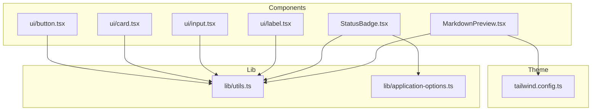
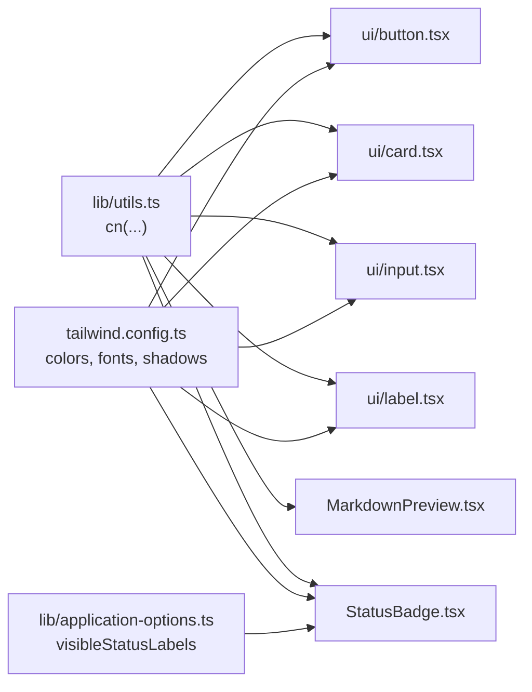
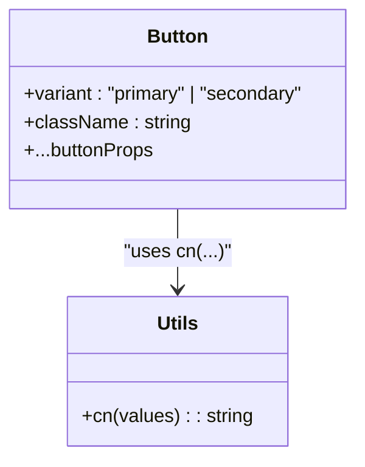
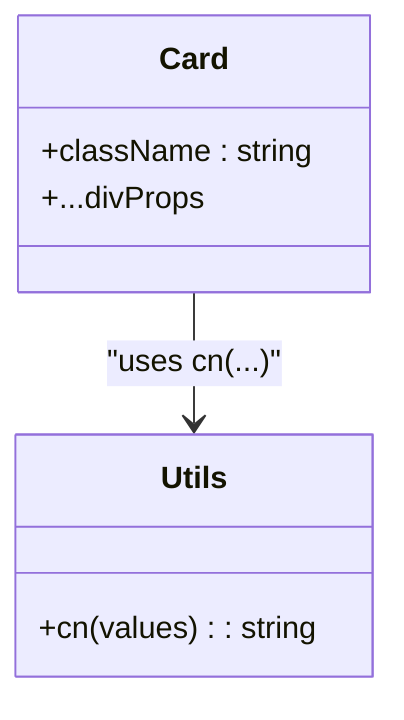
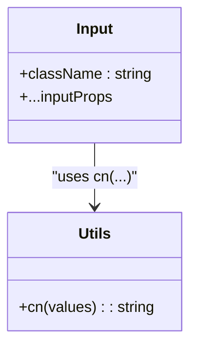
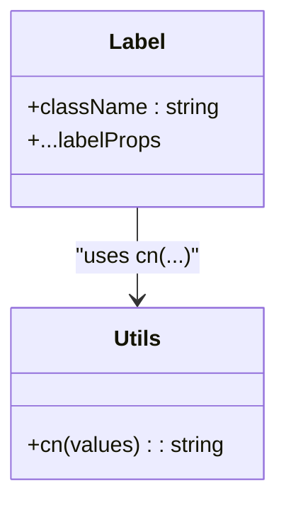
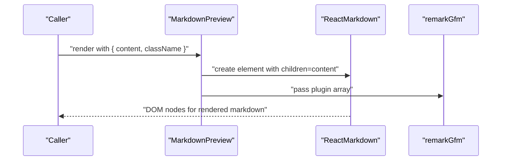
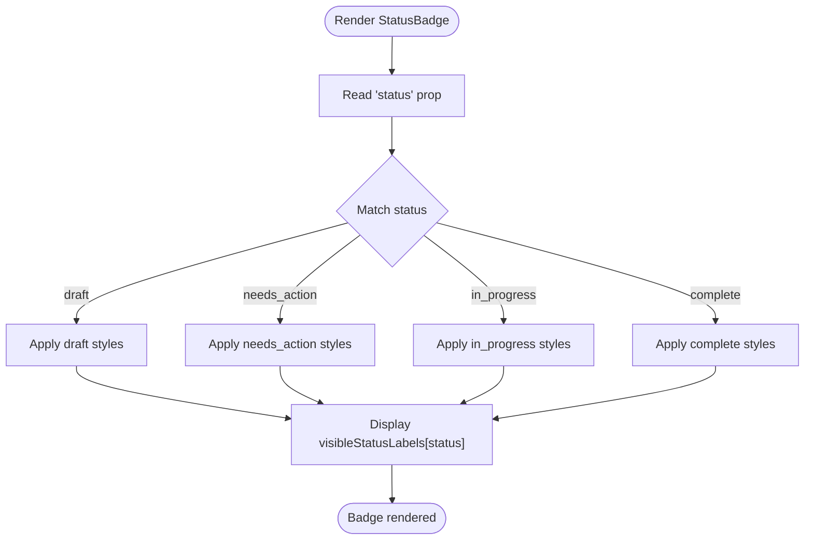
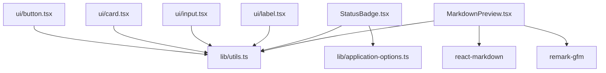

# UI Components

<cite>
**Referenced Files in This Document**
- [button.tsx](file://frontend/src/components/ui/button.tsx)
- [card.tsx](file://frontend/src/components/ui/card.tsx)
- [input.tsx](file://frontend/src/components/ui/input.tsx)
- [label.tsx](file://frontend/src/components/ui/label.tsx)
- [MarkdownPreview.tsx](file://frontend/src/components/MarkdownPreview.tsx)
- [StatusBadge.tsx](file://frontend/src/components/StatusBadge.tsx)
- [utils.ts](file://frontend/src/lib/utils.ts)
- [application-options.ts](file://frontend/src/lib/application-options.ts)
- [tailwind.config.ts](file://frontend/tailwind.config.ts)
- [setup.ts](file://frontend/src/test/setup.ts)
- [package.json](file://frontend/package.json)
</cite>

## Table of Contents
1. [Introduction](#introduction)
2. [Project Structure](#project-structure)
3. [Core Components](#core-components)
4. [Architecture Overview](#architecture-overview)
5. [Detailed Component Analysis](#detailed-component-analysis)
6. [Dependency Analysis](#dependency-analysis)
7. [Performance Considerations](#performance-considerations)
8. [Accessibility Features](#accessibility-features)
9. [Testing Strategies](#testing-strategies)
10. [Troubleshooting Guide](#troubleshooting-guide)
11. [Conclusion](#conclusion)

## Introduction
This document describes the reusable UI component library used in the frontend. It covers primitive components (Button, Card, Input, Label), specialized components (MarkdownPreview, StatusBadge), the design system and theme integration with Tailwind CSS, customization patterns, composition strategies, accessibility considerations, and testing approaches. The goal is to help developers consistently build accessible, maintainable, and visually coherent user interfaces.

## Project Structure
The UI components live under the frontend/src/components directory, grouped by domain:
- Primitive components: Button, Card, Input, Label under ui/.
- Specialized components: MarkdownPreview, StatusBadge under components/.
Utility and theme integration are centralized in lib/ and tailwind.config.ts. Testing is configured via Vite + Vitest and @testing-library.

**Diagram sources**
- [button.tsx:1-23](file://frontend/src/components/ui/button.tsx#L1-L23)
- [card.tsx:1-15](file://frontend/src/components/ui/card.tsx#L1-L15)
- [input.tsx:1-15](file://frontend/src/components/ui/input.tsx#L1-L15)
- [label.tsx:1-12](file://frontend/src/components/ui/label.tsx#L1-L12)
- [MarkdownPreview.tsx:1-16](file://frontend/src/components/MarkdownPreview.tsx#L1-L16)
- [StatusBadge.tsx:1-23](file://frontend/src/components/StatusBadge.tsx#L1-L23)
- [utils.ts:1-4](file://frontend/src/lib/utils.ts#L1-L4)
- [application-options.ts:1-31](file://frontend/src/lib/application-options.ts#L1-L31)
- [tailwind.config.ts:1-25](file://frontend/tailwind.config.ts#L1-L25)

**Section sources**
- [button.tsx:1-23](file://frontend/src/components/ui/button.tsx#L1-L23)
- [card.tsx:1-15](file://frontend/src/components/ui/card.tsx#L1-L15)
- [input.tsx:1-15](file://frontend/src/components/ui/input.tsx#L1-L15)
- [label.tsx:1-12](file://frontend/src/components/ui/label.tsx#L1-L12)
- [MarkdownPreview.tsx:1-16](file://frontend/src/components/MarkdownPreview.tsx#L1-L16)
- [StatusBadge.tsx:1-23](file://frontend/src/components/StatusBadge.tsx#L1-L23)
- [utils.ts:1-4](file://frontend/src/lib/utils.ts#L1-L4)
- [application-options.ts:1-31](file://frontend/src/lib/application-options.ts#L1-L31)
- [tailwind.config.ts:1-25](file://frontend/tailwind.config.ts#L1-L25)

## Core Components
This section documents the primitive UI components and their props, variants, and usage patterns.

- Button
  - Purpose: Standard action element with primary and secondary variants.
  - Props:
    - className: Optional string to extend base styles.
    - variant: "primary" | "secondary".
    - Inherits all button attributes (e.g., onClick, disabled).
  - Variants:
    - primary: Solid color background with white text; hover transitions to a darker shade.
    - secondary: Outlined appearance with bordered background; hover adjusts border and text color.
  - Composition pattern: Accepts children and forwards all native button props. Combine with className for overrides.
  - Accessibility: Inherits native button semantics; ensure meaningful text or aria-label.

- Card
  - Purpose: Container with elevated, rounded appearance and subtle backdrop blur.
  - Props:
    - className: Optional string to extend base styles.
    - Inherits all div attributes.
  - Composition pattern: Wrap content blocks; use className to adjust padding or spacing.

- Input
  - Purpose: Text input with consistent rounded styling, focus states, and placeholder treatment.
  - Props:
    - className: Optional string to extend base styles.
    - Inherits all input attributes (e.g., type, value, onChange, placeholder).
  - Composition pattern: Use with Label for accessible forms; combine className for width or alignment.

- Label
  - Purpose: Label element for form controls with consistent typography and spacing.
  - Props:
    - className: Optional string to extend base styles.
    - Inherits all label attributes.
  - Composition pattern: Pair with Input or Select; use htmlFor to associate with inputs.

Usage examples (described):
- Button with variant="secondary" and disabled state.
- Card wrapping a form with inner spacing and shadow.
- Input with placeholder and controlled value; combined with Label.
- Label with uppercase, spaced typography for form sections.

**Section sources**
- [button.tsx:4-22](file://frontend/src/components/ui/button.tsx#L4-L22)
- [card.tsx:4-14](file://frontend/src/components/ui/card.tsx#L4-L14)
- [input.tsx:4-14](file://frontend/src/components/ui/input.tsx#L4-L14)
- [label.tsx:4-11](file://frontend/src/components/ui/label.tsx#L4-L11)

## Architecture Overview
The components share a common styling approach:
- Utility function cn(...) merges conditional Tailwind classes safely.
- Theme tokens (colors, fonts, shadows) are defined centrally in Tailwind config.
- Specialized components integrate with external libraries (e.g., react-markdown) and internal constants.

**Diagram sources**
- [utils.ts:1-4](file://frontend/src/lib/utils.ts#L1-L4)
- [button.tsx:1-2](file://frontend/src/components/ui/button.tsx#L1-L2)
- [card.tsx:1-2](file://frontend/src/components/ui/card.tsx#L1-L2)
- [input.tsx:1-2](file://frontend/src/components/ui/input.tsx#L1-L2)
- [label.tsx:1-2](file://frontend/src/components/ui/label.tsx#L1-L2)
- [MarkdownPreview.tsx:1-2](file://frontend/src/components/MarkdownPreview.tsx#L1-L2)
- [StatusBadge.tsx:1-2](file://frontend/src/components/StatusBadge.tsx#L1-L2)
- [tailwind.config.ts:7-20](file://frontend/tailwind.config.ts#L7-L20)
- [application-options.ts:13-18](file://frontend/src/lib/application-options.ts#L13-L18)

## Detailed Component Analysis

### Button
- Design system alignment:
  - Uses theme colors for backgrounds and hover states.
  - Rounded-full shape and consistent paddings for touch-friendly targets.
- Props interface:
  - Extends button attributes and adds optional variant and className.
- Variants:
  - primary: solid fill with white text; hover darkens background.
  - secondary: outlined with bordered background; hover adjusts border and text color.
- Composition:
  - Accepts children; forwards all props to underlying button element.
- Accessibility:
  - Inherits button semantics; ensure text or aria-label is meaningful.

**Diagram sources**
- [button.tsx:4-22](file://frontend/src/components/ui/button.tsx#L4-L22)
- [utils.ts:1-4](file://frontend/src/lib/utils.ts#L1-L4)

**Section sources**
- [button.tsx:4-22](file://frontend/src/components/ui/button.tsx#L4-L22)
- [utils.ts:1-4](file://frontend/src/lib/utils.ts#L1-L4)

### Card
- Design system alignment:
  - Large border radius, soft border, white background, and subtle shadow.
- Props interface:
  - Accepts className and forwards standard div attributes.
- Composition:
  - Ideal container for grouping related UI elements; override spacing via className.

**Diagram sources**
- [card.tsx:4-14](file://frontend/src/components/ui/card.tsx#L4-L14)
- [utils.ts:1-4](file://frontend/src/lib/utils.ts#L1-L4)

**Section sources**
- [card.tsx:4-14](file://frontend/src/components/ui/card.tsx#L4-L14)
- [utils.ts:1-4](file://frontend/src/lib/utils.ts#L1-L4)

### Input
- Design system alignment:
  - Consistent rounded corners, border, focus ring, and placeholder styling.
- Props interface:
  - Accepts className and forwards standard input attributes.
- Composition:
  - Pair with Label for accessible forms; combine className for layout adjustments.

**Diagram sources**
- [input.tsx:4-14](file://frontend/src/components/ui/input.tsx#L4-L14)
- [utils.ts:1-4](file://frontend/src/lib/utils.ts#L1-L4)

**Section sources**
- [input.tsx:4-14](file://frontend/src/components/ui/input.tsx#L4-L14)
- [utils.ts:1-4](file://frontend/src/lib/utils.ts#L1-L4)

### Label
- Design system alignment:
  - Small, uppercase, spaced typography for form labels.
- Props interface:
  - Accepts className and forwards standard label attributes.
- Composition:
  - Use htmlFor to associate with inputs; pair with Input.

**Diagram sources**
- [label.tsx:4-11](file://frontend/src/components/ui/label.tsx#L4-L11)
- [utils.ts:1-4](file://frontend/src/lib/utils.ts#L1-L4)

**Section sources**
- [label.tsx:4-11](file://frontend/src/components/ui/label.tsx#L4-L11)
- [utils.ts:1-4](file://frontend/src/lib/utils.ts#L1-L4)

### MarkdownPreview
- Purpose: Render Markdown content with GitHub Flavored Markdown support.
- Props:
  - content: string to render.
  - className: optional string to extend prose styles.
- Behavior:
  - Wraps react-markdown with remark-gfm plugin.
  - Applies prose-sm and max-w-none utilities for readable widths and full-width rendering.
- Composition:
  - Use for rich text previews; pass className to tweak typography or spacing.

**Diagram sources**
- [MarkdownPreview.tsx:1-16](file://frontend/src/components/MarkdownPreview.tsx#L1-L16)

**Section sources**
- [MarkdownPreview.tsx:4-15](file://frontend/src/components/MarkdownPreview.tsx#L4-L15)

### StatusBadge
- Purpose: Display application state with color-coded badges.
- Props:
  - status: keyof typeof visibleStatusLabels.
- Behavior:
  - Renders a span with rounded pill styling and variant-specific background/text colors.
  - Uses visibleStatusLabels to translate keys to display text.
- Composition:
  - Use to indicate statuses like draft, needs_action, in_progress, complete.

**Diagram sources**
- [StatusBadge.tsx:4-22](file://frontend/src/components/StatusBadge.tsx#L4-L22)
- [application-options.ts:13-18](file://frontend/src/lib/application-options.ts#L13-L18)

**Section sources**
- [StatusBadge.tsx:4-22](file://frontend/src/components/StatusBadge.tsx#L4-L22)
- [application-options.ts:13-18](file://frontend/src/lib/application-options.ts#L13-L18)

## Dependency Analysis
- Internal dependencies:
  - All primitive components depend on cn(...) from lib/utils.ts.
  - StatusBadge depends on visibleStatusLabels from lib/application-options.ts.
  - MarkdownPreview integrates react-markdown and remark-gfm.
- Theme integration:
  - Tailwind theme extends colors, fonts, and box-shadow tokens used by components.
- External libraries:
  - react-markdown and remark-gfm for MarkdownPreview.
  - @testing-library/react and vitest for testing stack.

**Diagram sources**
- [button.tsx:1-2](file://frontend/src/components/ui/button.tsx#L1-L2)
- [card.tsx:1-2](file://frontend/src/components/ui/card.tsx#L1-L2)
- [input.tsx:1-2](file://frontend/src/components/ui/input.tsx#L1-L2)
- [label.tsx:1-2](file://frontend/src/components/ui/label.tsx#L1-L2)
- [StatusBadge.tsx:1-2](file://frontend/src/components/StatusBadge.tsx#L1-L2)
- [MarkdownPreview.tsx:1-2](file://frontend/src/components/MarkdownPreview.tsx#L1-L2)
- [utils.ts:1-4](file://frontend/src/lib/utils.ts#L1-L4)
- [application-options.ts:1-31](file://frontend/src/lib/application-options.ts#L1-L31)
- [package.json:13-21](file://frontend/package.json#L13-L21)

**Section sources**
- [button.tsx:1-2](file://frontend/src/components/ui/button.tsx#L1-L2)
- [card.tsx:1-2](file://frontend/src/components/ui/card.tsx#L1-L2)
- [input.tsx:1-2](file://frontend/src/components/ui/input.tsx#L1-L2)
- [label.tsx:1-2](file://frontend/src/components/ui/label.tsx#L1-L2)
- [StatusBadge.tsx:1-2](file://frontend/src/components/StatusBadge.tsx#L1-L2)
- [MarkdownPreview.tsx:1-2](file://frontend/src/components/MarkdownPreview.tsx#L1-L2)
- [utils.ts:1-4](file://frontend/src/lib/utils.ts#L1-L4)
- [application-options.ts:1-31](file://frontend/src/lib/application-options.ts#L1-L31)
- [package.json:13-21](file://frontend/package.json#L13-L21)

## Performance Considerations
- Prefer minimal className overrides to reduce style recalculations.
- Use Card for grouping content to avoid deep DOM nesting.
- For MarkdownPreview, keep content reasonably sized to limit render cost.
- Reuse StatusBadge with memoization if used frequently in lists.

## Accessibility Features
- Button:
  - Native button semantics; ensure text or aria-label is meaningful.
- Input + Label:
  - Associate label with input using htmlFor to improve screen reader support.
- StatusBadge:
  - Presentational badge; ensure context is provided by surrounding content.
- General:
  - Maintain sufficient color contrast using theme tokens.
  - Avoid relying solely on color to convey meaning.

## Testing Strategies
- Test setup:
  - Vitest runs with jsdom and @testing-library/jest-dom for DOM assertions.
  - Global setup imports jest-dom matchers.
- Recommended patterns:
  - Render components with @testing-library/react and assert on text content, roles, and attributes.
  - For Button, test variant classes and disabled state.
  - For Input, test value updates and placeholder presence.
  - For StatusBadge, verify text matches visibleStatusLabels and variant classes.
  - For MarkdownPreview, verify rendered elements reflect markdown content.
- Prop validation:
  - Use TypeScript types to enforce required props and literal variants.
  - Add unit tests to confirm invalid props are rejected by type checker.

**Section sources**
- [setup.ts:1-2](file://frontend/src/test/setup.ts#L1-L2)
- [package.json:10-11](file://frontend/package.json#L10-L11)

## Troubleshooting Guide
- Styles not applying:
  - Verify Tailwind content paths include component files and that theme tokens are defined.
- Button hover or disabled states:
  - Confirm variant prop is set correctly and className does not override critical states.
- Input focus ring or placeholder:
  - Ensure className does not unintentionally remove focus or placeholder utilities.
- StatusBadge text mismatch:
  - Check that status prop matches a key in visibleStatusLabels.
- MarkdownPreview not rendering:
  - Confirm content is a non-empty string and remark-gfm plugin is included.

**Section sources**
- [tailwind.config.ts:3-24](file://frontend/tailwind.config.ts#L3-L24)
- [button.tsx:11-18](file://frontend/src/components/ui/button.tsx#L11-L18)
- [input.tsx:7-10](file://frontend/src/components/ui/input.tsx#L7-L10)
- [StatusBadge.tsx:11-17](file://frontend/src/components/StatusBadge.tsx#L11-L17)
- [MarkdownPreview.tsx:11-12](file://frontend/src/components/MarkdownPreview.tsx#L11-L12)

## Conclusion
The UI component library provides a cohesive set of primitives and specialized components built on a consistent design system. By leveraging Tailwind CSS tokens, a shared cn(...) utility, and TypeScript interfaces, components remain predictable, accessible, and easy to compose. Following the documented patterns ensures maintainable UI development across the application.