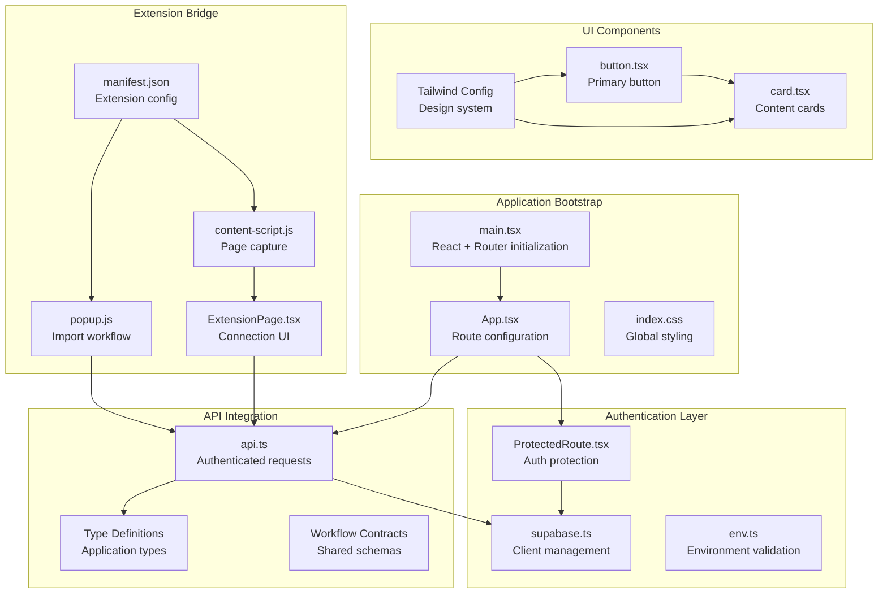
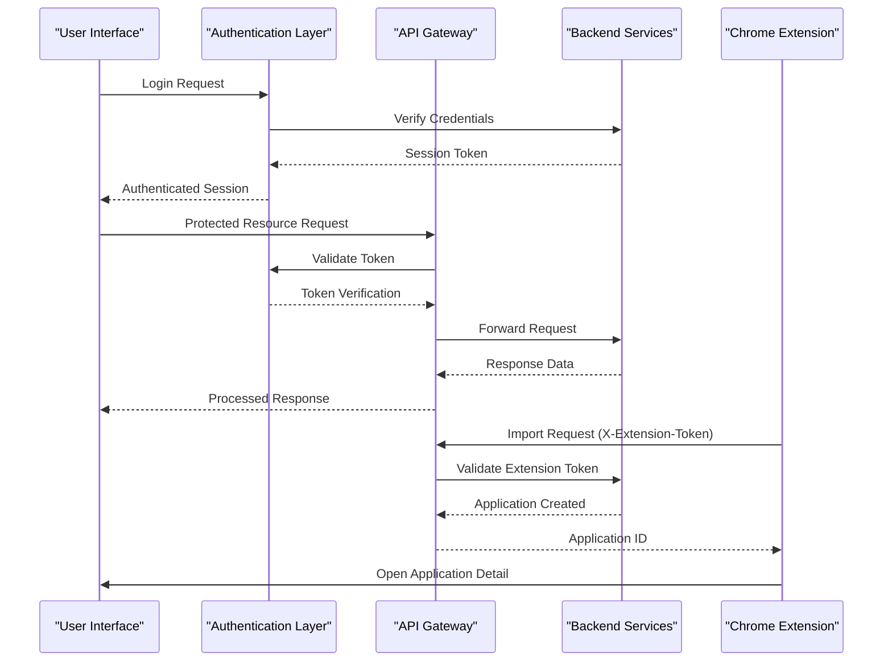
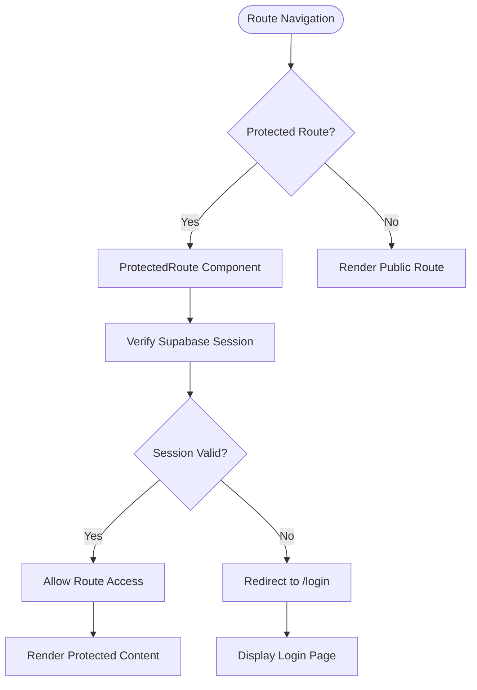
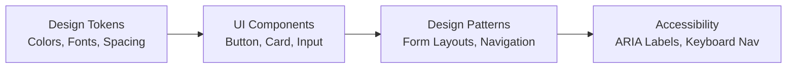
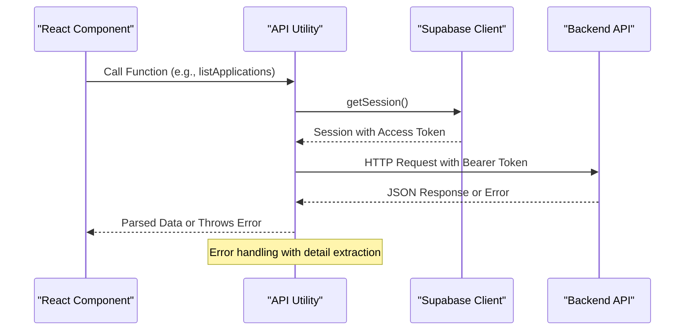
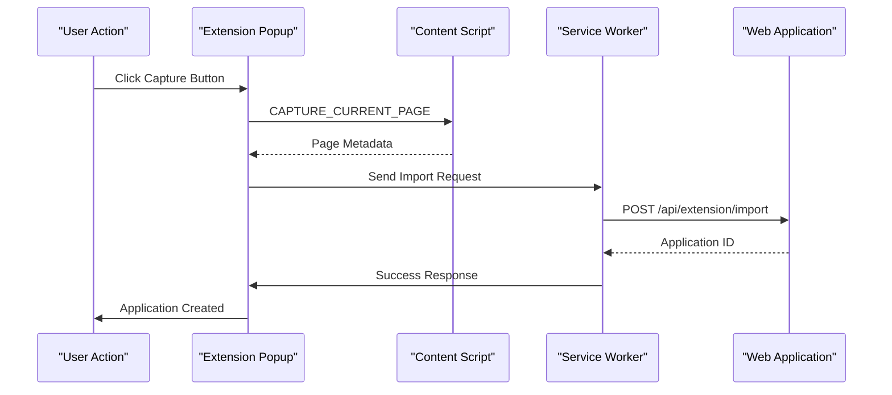

# Frontend Integration

<cite>
**Referenced Files in This Document**
- [main.tsx](file://frontend/src/main.tsx)
- [App.tsx](file://frontend/src/App.tsx)
- [package.json](file://frontend/package.json)
- [vite.config.ts](file://frontend/vite.config.ts)
- [env.ts](file://frontend/src/lib/env.ts)
- [supabase.ts](file://frontend/src/lib/supabase.ts)
- [api.ts](file://frontend/src/lib/api.ts)
- [ProtectedRoute.tsx](file://frontend/src/routes/ProtectedRoute.tsx)
- [ExtensionPage.tsx](file://frontend/src/routes/ExtensionPage.tsx)
- [manifest.json](file://frontend/public/chrome-extension/manifest.json)
- [content-script.js](file://frontend/public/chrome-extension/content-script.js)
- [popup.js](file://frontend/public/chrome-extension/popup.js)
- [button.tsx](file://frontend/src/components/ui/button.tsx)
- [card.tsx](file://frontend/src/components/ui/card.tsx)
- [tailwind.config.ts](file://frontend/tailwind.config.ts)
- [postcss.config.cjs](file://frontend/postcss.config.cjs)
</cite>

## Update Summary
**Changes Made**
- Enhanced component architecture documentation with comprehensive coverage of UI component structure and design system
- Expanded API utility documentation with detailed type definitions and endpoint specifications
- Added detailed Chrome extension integration patterns including message passing and security validation
- Updated dependency analysis with complete package structure and build configuration
- Enhanced performance optimization strategies and architectural best practices
- Added visual diagrams illustrating component relationships, data flows, and API interaction patterns

## Table of Contents
1. [Introduction](#introduction)
2. [Project Structure](#project-structure)
3. [Core Components](#core-components)
4. [Architecture Overview](#architecture-overview)
5. [Detailed Component Analysis](#detailed-component-analysis)
6. [UI Component System](#ui-component-system)
7. [API Integration Layer](#api-integration-layer)
8. [Chrome Extension Integration](#chrome-extension-integration)
9. [Build and Development Configuration](#build-and-development-configuration)
10. [Performance Optimization Strategies](#performance-optimization-strategies)
11. [Security and Authentication Flow](#security-and-authentication-flow)
12. [Testing Strategy](#testing-strategy)
13. [Troubleshooting Guide](#troubleshooting-guide)
14. [Conclusion](#conclusion)

## Introduction
This document provides comprehensive coverage of the frontend integration architecture, detailing the React application's component structure, API integration patterns, Chrome extension bridge implementation, and architectural best practices. The frontend serves as the primary interface for job application management, integrating with Supabase authentication, backend APIs, and browser extension capabilities.

## Project Structure
The frontend follows a modular architecture with clear separation of concerns across application bootstrap, routing, authentication, API utilities, UI components, and Chrome extension integration.

**Diagram sources**
- [main.tsx:1-14](file://frontend/src/main.tsx#L1-L14)
- [App.tsx:1-36](file://frontend/src/App.tsx#L1-L36)
- [ProtectedRoute.tsx:1-44](file://frontend/src/routes/ProtectedRoute.tsx#L1-L44)
- [supabase.ts:1-26](file://frontend/src/lib/supabase.ts#L1-L26)
- [env.ts:1-15](file://frontend/src/lib/env.ts#L1-L15)
- [api.ts:1-497](file://frontend/src/lib/api.ts#L1-L497)
- [ExtensionPage.tsx:1-200](file://frontend/src/routes/ExtensionPage.tsx#L1-L200)
- [content-script.js:1-118](file://frontend/public/chrome-extension/content-script.js#L1-L118)
- [popup.js:1-156](file://frontend/public/chrome-extension/popup.js#L1-L156)
- [button.tsx:1-23](file://frontend/src/components/ui/button.tsx#L1-L23)
- [card.tsx:1-15](file://frontend/src/components/ui/card.tsx#L1-L15)
- [tailwind.config.ts:1-25](file://frontend/tailwind.config.ts#L1-L25)

**Section sources**
- [main.tsx:1-14](file://frontend/src/main.tsx#L1-L14)
- [App.tsx:1-36](file://frontend/src/App.tsx#L1-L36)
- [package.json:1-38](file://frontend/package.json#L1-L38)
- [vite.config.ts:1-24](file://frontend/vite.config.ts#L1-L24)

## Core Components
The frontend architecture consists of several interconnected layers that work together to provide a seamless user experience:

### Application Bootstrap and Routing
- React application bootstrapped with strict mode and BrowserRouter
- Centralized route configuration with nested routing structure
- ProtectedRoute wrapper for authentication enforcement
- Dynamic route generation for applications, resumes, and extension management

### Authentication and Security
- Supabase client with session persistence and automatic token refresh
- Environment variable validation using Zod schema
- Auth state management with real-time subscription
- Secure token-based authentication for all API requests

### API Integration Layer
- Comprehensive type definitions for all application entities
- Authenticated request helpers with error handling
- Specialized upload and export utilities
- Workflow contract integration for versioned API compatibility

**Section sources**
- [main.tsx:1-14](file://frontend/src/main.tsx#L1-L14)
- [App.tsx:1-36](file://frontend/src/App.tsx#L1-L36)
- [ProtectedRoute.tsx:1-44](file://frontend/src/routes/ProtectedRoute.tsx#L1-L44)
- [supabase.ts:1-26](file://frontend/src/lib/supabase.ts#L1-L26)
- [env.ts:1-15](file://frontend/src/lib/env.ts#L1-L15)
- [api.ts:1-497](file://frontend/src/lib/api.ts#L1-L497)

## Architecture Overview
The frontend implements a layered architecture with clear separation between presentation, business logic, and data access layers. The system emphasizes security, scalability, and maintainability through well-defined interfaces and comprehensive error handling.

**Diagram sources**
- [ProtectedRoute.tsx:10-26](file://frontend/src/routes/ProtectedRoute.tsx#L10-L26)
- [api.ts:179-216](file://frontend/src/lib/api.ts#L179-L216)
- [popup.js:109-135](file://frontend/public/chrome-extension/popup.js#L109-L135)

## Detailed Component Analysis

### Routing and Navigation System
The application uses React Router v6 with a hierarchical routing structure that supports nested routes and protected navigation. The routing system includes:

- Public login route with unrestricted access
- Protected application shell with nested routes for different functional areas
- Automatic redirection for unmatched routes to the main dashboard
- Route guards that enforce authentication requirements

**Diagram sources**
- [App.tsx:12-35](file://frontend/src/App.tsx#L12-L35)
- [ProtectedRoute.tsx:10-26](file://frontend/src/routes/ProtectedRoute.tsx#L10-L26)

**Section sources**
- [App.tsx:1-36](file://frontend/src/App.tsx#L1-L36)
- [ProtectedRoute.tsx:1-44](file://frontend/src/routes/ProtectedRoute.tsx#L1-L44)

### Authentication State Management
The authentication system implements a reactive pattern that monitors session state changes and automatically handles authentication flow:

- Real-time auth state subscription using Supabase event listeners
- Loading state management during session verification
- Automatic cleanup of event subscriptions to prevent memory leaks
- Graceful fallback to login page for unauthorized access attempts

**Section sources**
- [ProtectedRoute.tsx:10-26](file://frontend/src/routes/ProtectedRoute.tsx#L10-L26)
- [supabase.ts:1-26](file://frontend/src/lib/supabase.ts#L1-L26)

## UI Component System
The frontend implements a comprehensive UI component library with consistent design patterns and accessibility features.

### Design System Foundation
- Custom Tailwind CSS configuration with brand-specific color palette
- Typography system supporting both display and body text
- Consistent spacing and shadow systems for depth perception
- Responsive design patterns optimized for desktop and mobile experiences

### Component Architecture
- Atomic design principles with reusable component composition
- Variant system for consistent styling across similar components
- Utility-first approach with comprehensive class merging
- TypeScript integration for type-safe component interfaces

**Diagram sources**
- [tailwind.config.ts:6-21](file://frontend/tailwind.config.ts#L6-L21)
- [button.tsx:8-22](file://frontend/src/components/ui/button.tsx#L8-L22)
- [card.tsx:4-13](file://frontend/src/components/ui/card.tsx#L4-L13)

**Section sources**
- [button.tsx:1-23](file://frontend/src/components/ui/button.tsx#L1-L23)
- [card.tsx:1-15](file://frontend/src/components/ui/card.tsx#L1-L15)
- [tailwind.config.ts:1-25](file://frontend/tailwind.config.ts#L1-L25)

## API Integration Layer
The API layer provides a comprehensive set of utilities for interacting with the backend services, implementing robust error handling and type safety.

### Type Safety and Validation
- Complete TypeScript interface definitions for all API responses
- Zod schema validation for runtime type checking
- Generic request/response handling with proper error propagation
- Workflow contract integration for versioned API compatibility

### Request Patterns and Error Handling
- Centralized authentication token retrieval from Supabase session
- Standardized request construction with proper headers
- Comprehensive error handling with user-friendly messages
- Upload handling for file-based operations with progress indication

**Diagram sources**
- [api.ts:179-216](file://frontend/src/lib/api.ts#L179-L216)
- [api.ts:218-240](file://frontend/src/lib/api.ts#L218-L240)

**Section sources**
- [api.ts:1-497](file://frontend/src/lib/api.ts#L1-L497)

## Chrome Extension Integration
The Chrome extension bridge provides seamless integration between browser automation and the web application, enabling one-click job application creation.

### Extension Architecture
- Manifest v3 configuration with comprehensive permissions
- Service worker for background processing and token management
- Content script for page metadata collection and message handling
- Popup interface for user interaction and import initiation

### Security and Trust Model
- Origin validation for trusted application connections
- Scoped token system preventing access to user sessions
- Message passing with explicit source verification
- Local storage encryption for sensitive extension data

**Diagram sources**
- [popup.js:95-136](file://frontend/public/chrome-extension/popup.js#L95-L136)
- [content-script.js:60-74](file://frontend/public/chrome-extension/content-script.js#L60-L74)
- [ExtensionPage.tsx:74-100](file://frontend/src/routes/ExtensionPage.tsx#L74-L100)

**Section sources**
- [manifest.json:1-24](file://frontend/public/chrome-extension/manifest.json#L1-L24)
- [content-script.js:1-118](file://frontend/public/chrome-extension/content-script.js#L1-L118)
- [popup.js:1-156](file://frontend/public/chrome-extension/popup.js#L1-L156)
- [ExtensionPage.tsx:1-200](file://frontend/src/routes/ExtensionPage.tsx#L1-L200)

## Build and Development Configuration
The build system leverages Vite for optimal development experience with comprehensive TypeScript support and testing infrastructure.

### Development Environment
- Hot module replacement for rapid iteration
- TypeScript compilation with strict type checking
- Alias resolution for clean import statements (@ for src, @shared for shared)
- Test environment configuration with jsdom

### Production Optimization
- Code splitting for improved load times
- Tree shaking for unused code elimination
- Asset optimization and bundling strategies
- Environment-specific configuration management

**Section sources**
- [vite.config.ts:1-24](file://frontend/vite.config.ts#L1-L24)
- [package.json:1-38](file://frontend/package.json#L1-L38)

## Performance Optimization Strategies
The frontend implements multiple optimization strategies to ensure responsive user experience and efficient resource utilization.

### Bundle Size Optimization
- Lazy loading of non-critical routes and components
- Dynamic imports for feature-specific code splitting
- External dependency optimization through CDN usage
- Asset compression and modern image formats

### Runtime Performance
- Memoization of expensive computations
- Efficient state management with React hooks
- Debounced input handling for search and filters
- Virtualized lists for large datasets

### Network Optimization
- Request caching with cache-control headers
- Batch API requests where appropriate
- Progressive loading of dependent resources
- Error boundary implementation for graceful degradation

## Security and Authentication Flow
The authentication system implements industry-standard security practices with comprehensive session management and token handling.

### Session Management
- Persistent session storage with automatic refresh
- Real-time auth state synchronization
- Event-driven authentication state changes
- Secure token transmission and storage

### API Security
- Bearer token authentication for all protected endpoints
- CORS policy configuration for trusted origins
- CSRF protection through origin validation
- Rate limiting and abuse prevention measures

**Section sources**
- [supabase.ts:4-11](file://frontend/src/lib/supabase.ts#L4-L11)
- [api.ts:179-216](file://frontend/src/lib/api.ts#L179-L216)

## Testing Strategy
The frontend includes comprehensive testing infrastructure covering unit tests, integration tests, and end-to-end testing scenarios.

### Unit Testing
- Component testing with React Testing Library
- Mock-based API testing for isolated functionality
- Type safety validation through TypeScript compilation
- Performance testing for critical rendering paths

### Integration Testing
- API endpoint testing with mocked backend responses
- Authentication flow validation
- Chrome extension message passing tests
- Form submission and validation testing

**Section sources**
- [package.json:10-11](file://frontend/package.json#L10-L11)
- [vite.config.ts:18-22](file://frontend/vite.config.ts#L18-L22)

## Troubleshooting Guide
Common issues and their solutions for frontend integration problems.

### Authentication Issues
- Session expiration: Clear browser storage and re-authenticate
- Token validation failures: Check Supabase configuration and network connectivity
- Redirect loops: Verify auth state subscription cleanup and route configuration

### API Integration Problems
- CORS errors: Configure allowed origins and preflight handling
- Authentication failures: Validate bearer token format and expiration
- Network timeouts: Implement retry logic and connection health checks

### Extension Integration Issues
- Bridge detection failures: Verify manifest permissions and content script injection
- Token validation errors: Check origin matching and storage synchronization
- Import failures: Monitor network requests and extension console logs

**Section sources**
- [ProtectedRoute.tsx:28-42](file://frontend/src/routes/ProtectedRoute.tsx#L28-L42)
- [env.ts:1-15](file://frontend/src/lib/env.ts#L1-L15)
- [ExtensionPage.tsx:35-72](file://frontend/src/routes/ExtensionPage.tsx#L35-L72)

## Conclusion
The frontend integration architecture demonstrates a mature, scalable approach to building modern web applications with comprehensive authentication, API integration, and browser extension capabilities. The modular design, type-safe implementation, and robust error handling provide a solid foundation for continued development and feature expansion. The architecture successfully balances developer productivity with user experience, implementing best practices for performance, security, and maintainability.