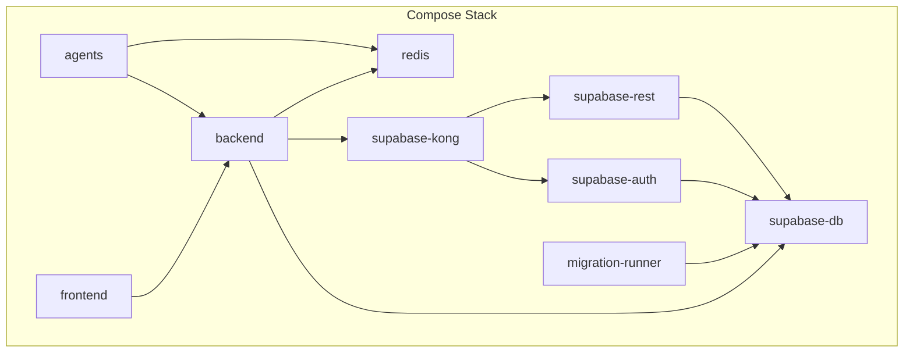
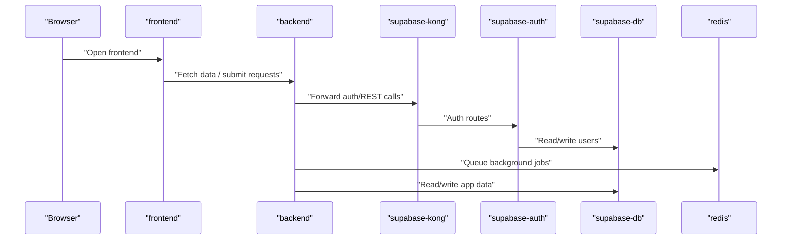

# Getting Started

<cite>
**Referenced Files in This Document**
- [docker-compose.yml](file://docker-compose.yml)
- [Makefile](file://Makefile)
- [backend/pyproject.toml](file://backend/pyproject.toml)
- [frontend/package.json](file://frontend/package.json)
- [agents/pyproject.toml](file://agents/pyproject.toml)
- [scripts/healthcheck.sh](file://scripts/healthcheck.sh)
- [scripts/run_migrations.sh](file://scripts/run_migrations.sh)
- [scripts/seed_local_user.sh](file://scripts/seed_local_user.sh)
- [backend/app/core/config.py](file://backend/app/core/config.py)
- [frontend/src/lib/env.ts](file://frontend/src/lib/env.ts)
- [supabase/kong/kong.yml](file://supabase/kong/kong.yml)
- [supabase/migrations/20260407_000001_phase_0_foundation.sql](file://supabase/migrations/20260407_000001_phase_0_foundation.sql)
- [AGENTS.md](file://AGENTS.md)
- [backend/AGENTS.md](file://backend/AGENTS.md)
- [frontend/AGENTS.md](file://frontend/AGENTS.md)
</cite>

## Table of Contents
1. [Introduction](#introduction)
2. [Prerequisites](#prerequisites)
3. [Project Structure](#project-structure)
4. [Core Components](#core-components)
5. [Architecture Overview](#architecture-overview)
6. [Installation and Setup](#installation-and-setup)
7. [Environment Variables](#environment-variables)
8. [Local Development Setup](#local-development-setup)
9. [First-Time User Setup](#first-time-user-setup)
10. [Verification and Health Checks](#verification-and-health-checks)
11. [Troubleshooting Guide](#troubleshooting-guide)
12. [Conclusion](#conclusion)

## Introduction
This guide helps you install and run the AI Resume Builder locally using Docker Compose. It covers prerequisites, environment setup, dependency installation, database initialization, service orchestration, and first-time user configuration. It also includes verification steps and troubleshooting tips to resolve common setup issues.

## Prerequisites
Ensure the following tools are installed and available on your machine:
- Docker Engine and Docker Compose v2.x
- Node.js (for local frontend development outside Docker)
- Python 3.9+ (for backend and agents)
- Git (to clone the repository)

Notes:
- The project is designed to run primarily inside containers. Node.js and Python are optional for local development if you use the Dockerized frontend and backend.
- Docker Desktop or equivalent Docker environment is required.

**Section sources**
- [docker-compose.yml:1-191](file://docker-compose.yml#L1-L191)
- [backend/pyproject.toml:9](file://backend/pyproject.toml#L9)
- [agents/pyproject.toml:9](file://agents/pyproject.toml#L9)
- [frontend/package.json:1-38](file://frontend/package.json#L1-L38)

## Project Structure
The repository is organized into modular services:
- frontend: React application with Vite and TypeScript
- backend: FastAPI application
- agents: Python-based ARQ workers for AI orchestration
- supabase/: Supabase-compatible services (PostgreSQL, GoTrue, PostgREST, Kong)
- scripts/: Helper scripts for migrations, health checks, and seeding
- docs/: Product and architecture documentation
- shared/: Shared workflow contract

**Diagram sources**
- [docker-compose.yml:1-191](file://docker-compose.yml#L1-L191)

**Section sources**
- [docker-compose.yml:1-191](file://docker-compose.yml#L1-L191)

## Core Components
- Frontend (React/Vite): Provides the user interface and integrates with Supabase for authentication and with the backend API for application data and workflows.
- Backend (FastAPI): Exposes REST endpoints, manages database connections, orchestrates background tasks via Redis, and integrates with Supabase Auth and Kong.
- Agents (Python/ARQ): AI orchestration workers that communicate with the backend and Redis, optionally using OpenRouter for model inference.
- Supabase stack: PostgreSQL database, GoTrue auth, PostgREST, and Kong gateway configured for local development.
- Scripts: Migration runner, health checker, and local user seeder.

**Section sources**
- [frontend/package.json:1-38](file://frontend/package.json#L1-L38)
- [backend/pyproject.toml:10-23](file://backend/pyproject.toml#L10-L23)
- [agents/pyproject.toml:10-16](file://agents/pyproject.toml#L10-L16)
- [supabase/kong/kong.yml:1-96](file://supabase/kong/kong.yml#L1-L96)

## Architecture Overview
The system runs as a Docker Compose stack with explicit dependencies and health checks. The frontend communicates with the backend over HTTP, while the backend interacts with Supabase services via Kong. Background jobs are queued in Redis and processed by agents.

**Diagram sources**
- [docker-compose.yml:1-191](file://docker-compose.yml#L1-L191)
- [supabase/kong/kong.yml:18-96](file://supabase/kong/kong.yml#L18-L96)

## Installation and Setup
Follow these steps to set up the project locally:

1. Clone the repository
   - Use your preferred Git client to clone the repository to your machine.

2. Prepare the environment file
   - Create the environment file used by Docker Compose:
     - Copy the example environment file to the expected location and fill in the required values.
     - The Makefile expects an environment file named according to the variable defined in the Makefile.

3. Build and start services
   - Use the Makefile targets to manage the stack:
     - Bring up the stack in detached mode with builds and orphan cleanup:
       - make up
     - View logs for recent activity:
       - make logs
     - Verify the compose configuration:
       - make compose-config

4. Install dependencies (optional)
   - Frontend dependencies:
     - Install Node.js dependencies in the frontend directory.
   - Backend dependencies:
     - Install Python dependencies in the backend directory.
   - Agents dependencies:
     - Install Python dependencies in the agents directory.

Notes:
- The Docker Compose services mount source code volumes for live reload and iteration.
- The backend and agents images are built from their respective Dockerfiles.

**Section sources**
- [Makefile:6-29](file://Makefile#L6-L29)
- [frontend/package.json:6-12](file://frontend/package.json#L6-L12)
- [backend/pyproject.toml:1-37](file://backend/pyproject.toml#L1-L37)
- [agents/pyproject.toml:1-26](file://agents/pyproject.toml#L1-L26)

## Environment Variables
Configure the environment file consumed by Docker Compose. The following variables are required or commonly used:

- Database
  - POSTGRES_PASSWORD: Password for the PostgreSQL database container.
  - SUPABASE_DB_HOST_PORT: Host port mapped to the database container’s port.

- Supabase
  - SUPABASE_URL: Public URL for the Kong gateway.
  - SUPABASE_ANON_KEY: Anonymous key for Supabase.
  - SUPABASE_SERVICE_KEY: Service role key for administrative operations.
  - SUPABASE_GATEWAY_PORT: Host port mapped to Kong’s gateway.

- Backend
  - APP_URL: Frontend URL for CORS and redirects.
  - API_URL: Backend API URL for frontend.
  - FRONTEND_PORT: Host port mapped to the frontend container.
  - BACKEND_HOST_PORT: Host port mapped to the backend container.
  - JWT_SECRET: Secret used by Supabase services.
  - WORKER_CALLBACK_SECRET: Secret used by agents to authenticate callbacks.
  - DUPLICATE_SIMILARITY_THRESHOLD: Threshold for duplicate detection.
  - EMAIL_NOTIFICATIONS_ENABLED: Enable email notifications.
  - RESEND_API_KEY: API key for email provider.
  - EMAIL_FROM: Sender email address for notifications.

- Agents
  - OPENROUTER_API_KEY: API key for OpenRouter.
  - OPENROUTER_BASE_URL: Base URL for OpenRouter.
  - EXTRACTION_AGENT_MODEL: Model identifier for extraction.
  - EXTRACTION_AGENT_FALLBACK_MODEL: Fallback model for extraction.
  - GENERATION_AGENT_MODEL: Model identifier for generation.
  - GENERATION_AGENT_FALLBACK_MODEL: Fallback model for generation.
  - VALIDATION_AGENT_MODEL: Model identifier for validation.
  - VALIDATION_AGENT_FALLBACK_MODEL: Fallback model for validation.

- Redis
  - REDIS_URL: Redis connection URL used by backend and agents.

- Frontend
  - VITE_SUPABASE_URL: Supabase URL for the frontend.
  - VITE_SUPABASE_ANON_KEY: Supabase anonymous key for the frontend.
  - VITE_API_URL: Backend API URL for the frontend.

Notes:
- The backend validates email settings when notifications are enabled.
- The frontend validates environment variables at runtime.

**Section sources**
- [docker-compose.yml:6-71](file://docker-compose.yml#L6-L71)
- [backend/app/core/config.py:35-87](file://backend/app/core/config.py#L35-L87)
- [frontend/src/lib/env.ts:3-14](file://frontend/src/lib/env.ts#L3-L14)

## Local Development Setup
Perform the following steps to initialize the local environment:

1. Initialize the database and run migrations
   - The migration runner waits for the database to be healthy and applies SQL migrations found in the migrations directory.
   - The script creates a metadata schema and tracks applied migrations.

2. Start the stack
   - Use the Makefile target to bring up all services with builds and dependency ordering:
     - make up

3. Confirm service health
   - Use the health check script to verify Supabase Auth, backend API, and frontend:
     - make health

4. Configure CORS and origins
   - Ensure APP_URL and CORS_ORIGINS match the frontend URL to avoid cross-origin issues.

5. Optional: Seed local user
   - Use the seed script to create a local user via Supabase Admin API:
     - make test-prepare

**Section sources**
- [scripts/run_migrations.sh:1-39](file://scripts/run_migrations.sh#L1-L39)
- [scripts/healthcheck.sh:15-35](file://scripts/healthcheck.sh#L15-L35)
- [scripts/seed_local_user.sh:15-61](file://scripts/seed_local_user.sh#L15-L61)
- [docker-compose.yml:101-114](file://docker-compose.yml#L101-L114)

## First-Time User Setup
To create a local user for development:

1. Prepare environment variables
   - Ensure the environment file contains the Supabase service role key and local user credentials.

2. Seed the user
   - Run the seed script to create a user via the Supabase Admin API:
     - make test-prepare

3. Authenticate
   - Open the frontend and sign in with the seeded user credentials.

Notes:
- The seed script requires the Supabase gateway to be healthy before attempting to create the user.
- The Supabase Admin API endpoint requires the service role key.

**Section sources**
- [scripts/seed_local_user.sh:15-61](file://scripts/seed_local_user.sh#L15-L61)
- [supabase/kong/kong.yml:4-16](file://supabase/kong/kong.yml#L4-L16)

## Verification and Health Checks
Use the following steps to verify that all components are running correctly:

1. Health checks
   - Run the health check script to probe Supabase Auth, backend API, and frontend:
     - make health

2. Compose configuration
   - Validate the compose configuration before bringing up services:
     - make compose-config

3. Logs
   - Inspect recent logs for errors or warnings:
     - make logs

4. Database schema
   - Review the foundation migration to confirm schema expectations:
     - supabase/migrations/20260407_000001_phase_0_foundation.sql

5. Frontend environment validation
   - Confirm frontend environment variables are present and valid:
     - frontend/src/lib/env.ts

6. Backend configuration validation
   - Confirm backend settings and email configuration:
     - backend/app/core/config.py

**Section sources**
- [scripts/healthcheck.sh:15-35](file://scripts/healthcheck.sh#L15-L35)
- [Makefile:22-29](file://Makefile#L22-L29)
- [supabase/migrations/20260407_000001_phase_0_foundation.sql:1-200](file://supabase/migrations/20260407_000001_phase_0_foundation.sql#L1-L200)
- [frontend/src/lib/env.ts:3-14](file://frontend/src/lib/env.ts#L3-L14)
- [backend/app/core/config.py:35-87](file://backend/app/core/config.py#L35-L87)

## Troubleshooting Guide
Common setup issues and resolutions:

- Docker Compose fails to start services
  - Ensure the environment file exists and is readable by the Makefile.
  - Validate compose configuration:
    - make compose-config

- Database not ready or migrations failing
  - Confirm the database container is healthy and migrations are applied in the correct order.
  - Check the migration runner logs for errors.

- Supabase Auth gateway not responding
  - Verify the Supabase gateway is healthy and the service role key is set.
  - Confirm the Kong configuration and ACLs.

- Frontend cannot reach backend
  - Ensure APP_URL and API_URL are set consistently across environment variables.
  - Confirm CORS_ORIGINS includes the frontend URL.

- Redis connectivity issues
  - Verify REDIS_URL is reachable from both backend and agents containers.

- Email notifications not working
  - When enabling notifications, ensure RESEND_API_KEY and EMAIL_FROM are set.

- Local user creation fails
  - Confirm the Supabase Admin API is reachable and the service role key is correct.

- Frontend environment validation errors
  - Ensure VITE_SUPABASE_URL, VITE_SUPABASE_ANON_KEY, and VITE_API_URL are set and valid.

**Section sources**
- [Makefile:6-29](file://Makefile#L6-L29)
- [scripts/run_migrations.sh:13-16](file://scripts/run_migrations.sh#L13-L16)
- [supabase/kong/kong.yml:160-186](file://supabase/kong/kong.yml#L160-L186)
- [backend/app/core/config.py:15-32](file://backend/app/core/config.py#L15-L32)
- [frontend/src/lib/env.ts:3-14](file://frontend/src/lib/env.ts#L3-L14)
- [scripts/seed_local_user.sh:29-37](file://scripts/seed_local_user.sh#L29-L37)

## Conclusion
You now have a complete understanding of how to install, configure, and run the AI Resume Builder locally. Use the Makefile targets to manage the stack, the health check script to verify services, and the seed script to provision a local user. If you encounter issues, consult the troubleshooting section and review the referenced configuration files.