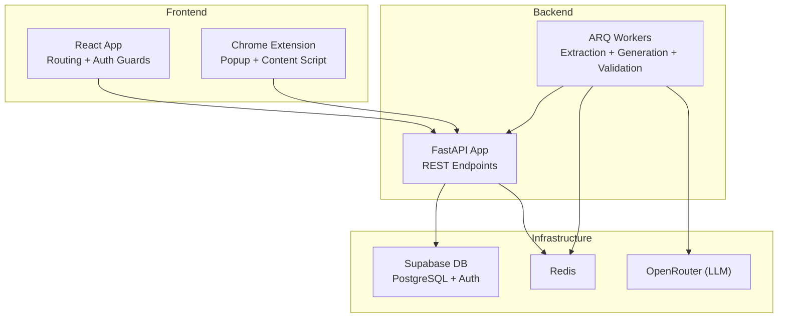
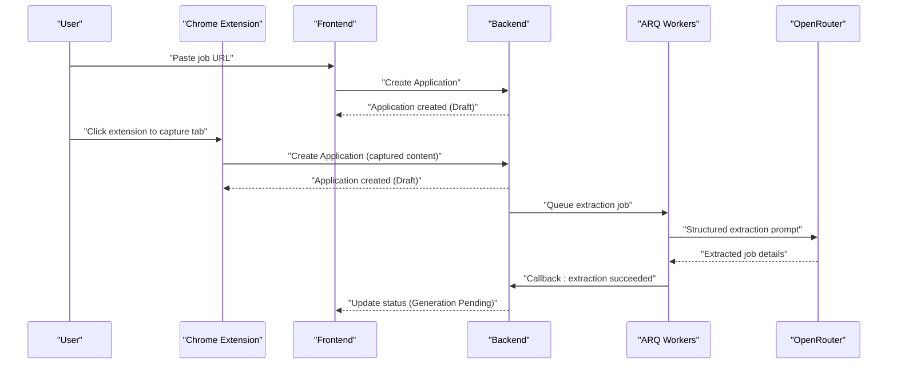
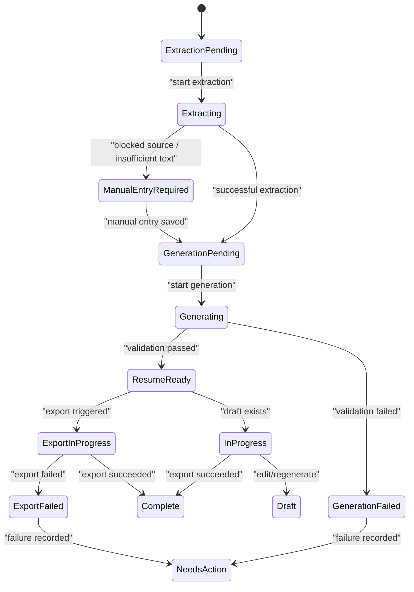
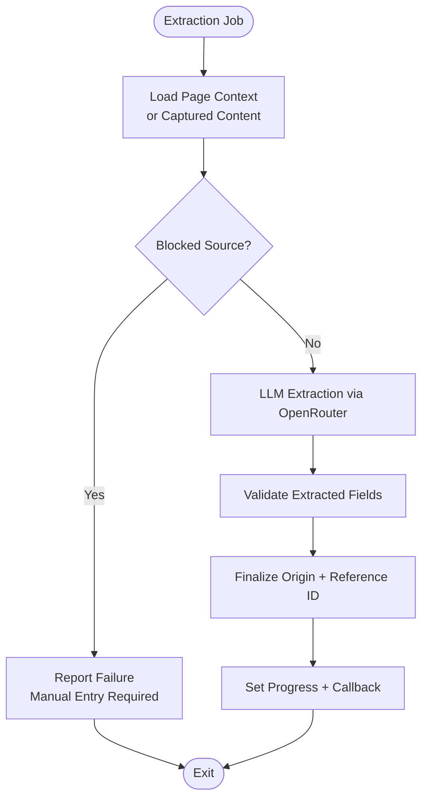
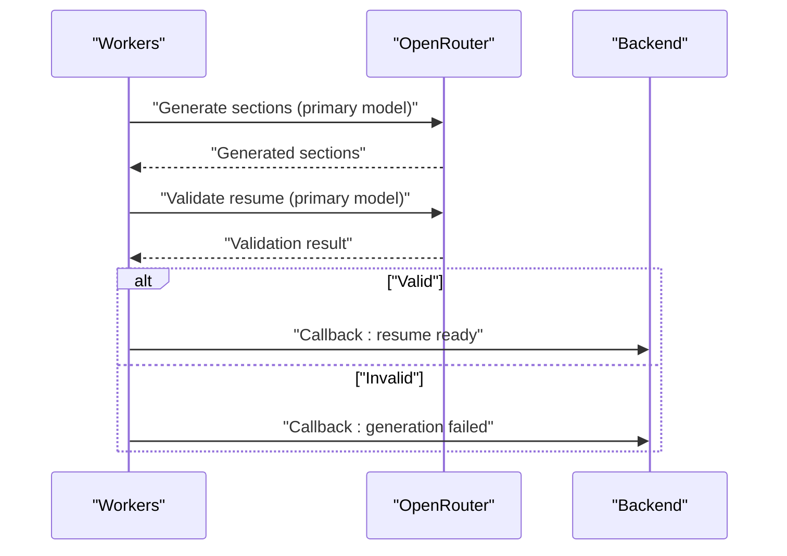
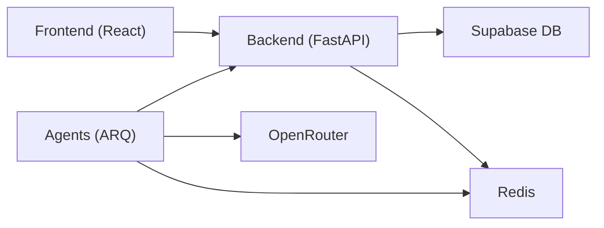
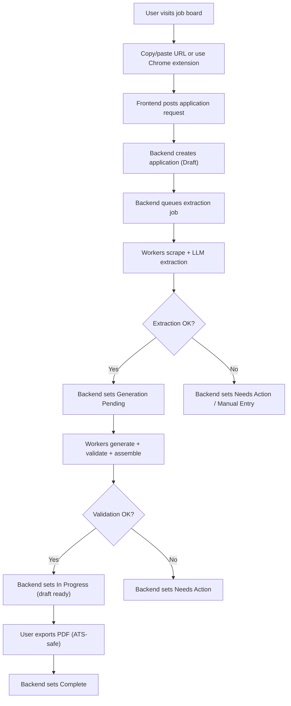

# Project Overview

<cite>
**Referenced Files in This Document**
- [resume_builder_PRD_v3.md](file://docs/resume_builder_PRD_v3.md)
- [database_schema.md](file://docs/database_schema.md)
- [workflow-contract.json](file://shared/workflow-contract.json)
- [backend main.py](file://backend/app/main.py)
- [backend workflow contract loader](file://backend/app/core/workflow_contract.py)
- [agents worker.py](file://agents/worker.py)
- [agents Dockerfile](file://agents/Dockerfile)
- [backend Dockerfile](file://backend/Dockerfile)
- [frontend App.tsx](file://frontend/src/App.tsx)
- [Chrome extension manifest.json](file://frontend/public/chrome-extension/manifest.json)
- [docker-compose.yml](file://docker-compose.yml)
- [backend pyproject.toml](file://backend/pyproject.toml)
- [agents pyproject.toml](file://agents/pyproject.toml)
- [frontend package.json](file://frontend/package.json)
</cite>

## Table of Contents
1. [Introduction](#introduction)
2. [Project Structure](#project-structure)
3. [Core Components](#core-components)
4. [Architecture Overview](#architecture-overview)
5. [Detailed Component Analysis](#detailed-component-analysis)
6. [Dependency Analysis](#dependency-analysis)
7. [Performance Considerations](#performance-considerations)
8. [Troubleshooting Guide](#troubleshooting-guide)
9. [Conclusion](#conclusion)
10. [Appendices](#appendices)

## Introduction
AI Resume Builder is an AI-powered job application management system designed to automate the end-to-end process of preparing tailored resumes for specific job postings. Its core value proposition is to reduce friction for job seekers by intelligently extracting job details, detecting duplicates, generating ATS-friendly Markdown resumes using AI, and enabling seamless PDF export. The system targets job seekers who want a streamlined, reliable workflow with strong progress visibility and minimal manual effort.

Key benefits:
- Intelligent job extraction from job boards and Chrome tab captures
- Automatic duplicate detection with user-friendly resolution
- AI-driven, section-based resume generation with adjustable aggressiveness and length
- Real-time progress and notifications during async operations
- Single-click PDF export with ATS-safe formatting
- Editable Markdown drafts with instant preview and regeneration

## Project Structure
The project is organized into distinct components that collaborate through APIs, background workers, and a shared workflow contract:
- Frontend React application (React 19, Vite, Tailwind CSS) with routing and authentication guards
- Backend FastAPI service exposing REST endpoints for applications, profiles, sessions, and internal worker callbacks
- AI agent system (ARQ workers) orchestrating extraction, generation, validation, and assembly
- Chrome extension for capturing current tabs and creating new applications
- Database and auth powered by Supabase (PostgreSQL + Supabase Auth)
- Shared workflow contract defining visible statuses, internal states, failure reasons, and mapping rules

**Diagram sources**
- [frontend App.tsx:12-35](file://frontend/src/App.tsx#L12-L35)
- [backend main.py:1-36](file://backend/app/main.py#L1-L36)
- [agents worker.py:526-667](file://agents/worker.py#L526-L667)
- [docker-compose.yml:1-191](file://docker-compose.yml#L1-L191)

**Section sources**
- [frontend App.tsx:12-35](file://frontend/src/App.tsx#L12-L35)
- [backend main.py:1-36](file://backend/app/main.py#L1-L36)
- [docker-compose.yml:1-191](file://docker-compose.yml#L1-L191)

## Core Components
- Frontend (React 19)
  - Routes: Login, Applications Dashboard, Application Detail, Profile, Base Resumes, Extension Page
  - ProtectedRoute wrapper ensures only authenticated users access protected routes
  - Uses Supabase JS for auth and API integration
- Backend (FastAPI)
  - Exposes routers for sessions, profiles, applications, base resumes, extension, and internal worker callbacks
  - Configures CORS to allow Chrome extension origins
  - Includes health checks and modular endpoint grouping
- AI Agent System (ARQ-based workers)
  - Extraction: Playwright-based page capture, blocked-source detection, structured LLM extraction via OpenRouter
  - Generation: Section-based resume generation with configurable aggressiveness and length
  - Validation: Validator ensures ATS-safe Markdown, grounded content, and structural correctness
  - Assembly: Injects personal info and builds final Markdown draft
- Chrome Extension
  - Manifest v3 with background service worker, content script, and popup
  - Permissions: activeTab, storage, tabs; content scripts run on all URLs
- Database and Auth (Supabase)
  - Logical data model defines profiles, base_resumes, applications, resume_drafts, and notifications
  - Canonical enums and JSONB contracts ensure consistent state and data shapes
  - Row-level security (RLS) enforces per-user isolation

**Section sources**
- [frontend App.tsx:12-35](file://frontend/src/App.tsx#L12-L35)
- [backend main.py:1-36](file://backend/app/main.py#L1-L36)
- [agents worker.py:526-667](file://agents/worker.py#L526-L667)
- [Chrome extension manifest.json:1-24](file://frontend/public/chrome-extension/manifest.json#L1-L24)
- [database_schema.md:46-230](file://docs/database_schema.md#L46-L230)

## Architecture Overview
The system follows a multi-service architecture:
- Frontend communicates with the backend via REST APIs
- Background jobs are queued and executed by ARQ workers
- Workers interact with LLM providers (OpenRouter) and report progress to Redis
- Backend receives callbacks from workers and updates application state
- Supabase provides authentication, row-level security, and relational data storage

**Diagram sources**
- [agents worker.py:526-667](file://agents/worker.py#L526-L667)
- [backend main.py:1-36](file://backend/app/main.py#L1-L36)
- [Chrome extension manifest.json:1-24](file://frontend/public/chrome-extension/manifest.json#L1-L24)

## Detailed Component Analysis

### Workflow State Machine
The system defines a clear mapping between internal processing states and user-visible statuses. The shared workflow contract enumerates:
- Visible statuses: draft, needs_action, in_progress, complete
- Internal states: extraction_pending, extracting, manual_entry_required, duplicate_review_required, generation_pending, generating, resume_ready, regenerating_section, regenerating_full, export_in_progress
- Failure reasons: extraction_failed, generation_failed, regeneration_failed, export_failed
- Mapping rules translate internal states and failure conditions into user-facing statuses

**Diagram sources**
- [workflow-contract.json:3-111](file://shared/workflow-contract.json#L3-L111)
- [database_schema.md:18-45](file://docs/database_schema.md#L18-L45)

**Section sources**
- [workflow-contract.json:3-111](file://shared/workflow-contract.json#L3-L111)
- [database_schema.md:18-45](file://docs/database_schema.md#L18-L45)

### Extraction Pipeline (ARQ Worker)
The extraction job performs:
- Optional browser capture from extension-provided content or direct URL scraping
- Blocked-source detection (e.g., Cloudflare, Indeed challenges)
- Structured LLM extraction via OpenRouter with primary and fallback models
- Finalized job details normalization and validation
- Progress updates to Redis and callback to backend

**Diagram sources**
- [agents worker.py:526-667](file://agents/worker.py#L526-L667)

**Section sources**
- [agents worker.py:526-667](file://agents/worker.py#L526-L667)

### Generation and Validation Pipeline
Generation is section-based and configurable:
- Inputs: base resume Markdown, job description, enabled sections, section order, target length, aggressiveness, additional instructions
- Each section is generated independently for easy regeneration
- Validation ensures ATS-safe Markdown, grounded content, and structural correctness
- Assembly injects personal info and persists the final draft

**Diagram sources**
- [agents worker.py:682-806](file://agents/worker.py#L682-L806)

**Section sources**
- [agents worker.py:682-806](file://agents/worker.py#L682-L806)

### Frontend Routing and Authentication
The React application uses React Router DOM with a ProtectedRoute wrapper. Routes include:
- Login page
- Applications dashboard
- Application detail page
- Profile page
- Base resumes management
- Extension page
- Nested routes for resume creation/editing

ProtectedRoute ensures only authenticated users can access protected routes.

**Section sources**
- [frontend App.tsx:12-35](file://frontend/src/App.tsx#L12-L35)

### Backend API Surface
The FastAPI application registers routers for:
- Session management
- Profiles
- Applications
- Base resumes
- Extension bridge
- Internal worker callbacks

CORS is configured to allow Chrome extension origins, and a health check endpoint is provided.

**Section sources**
- [backend main.py:1-36](file://backend/app/main.py#L1-L36)

### Database Schema and Data Contracts
The logical schema defines:
- Enumerations for statuses, states, failure reasons, origins, and notification types
- JSONB contracts for section preferences, section order, extraction failure details, generation failure details, duplicate match fields, and generation parameters
- Canonical tables: profiles, base_resumes, applications, resume_drafts, notifications
- RLS policies and indexes to enforce privacy and optimize queries

**Section sources**
- [database_schema.md:18-289](file://docs/database_schema.md#L18-L289)

## Dependency Analysis
Technology stack overview:
- Backend: Python, FastAPI, ARQ, Redis, PostgreSQL, Uvicorn, Pydantic, HTTPX, WeasyPrint, markdown
- Agents: Python, ARQ, Playwright, LangChain OpenAI, Pydantic Settings
- Frontend: React 19, React Router DOM, Supabase JS, Tailwind CSS, Vitest
- Infrastructure: Docker, Docker Compose, Supabase (Postgres, Gotrue, PostgREST, Kong)

Containerization:
- Backend Dockerfile installs Cairo/Pango libraries for PDF rendering and runs Uvicorn
- Agents Dockerfile installs Playwright Chromium and runs ARQ worker

**Diagram sources**
- [backend Dockerfile:1-18](file://backend/Dockerfile#L1-L18)
- [agents Dockerfile:1-14](file://agents/Dockerfile#L1-L14)
- [docker-compose.yml:1-191](file://docker-compose.yml#L1-L191)

**Section sources**
- [backend pyproject.toml:10-23](file://backend/pyproject.toml#L10-L23)
- [agents pyproject.toml:10-16](file://agents/pyproject.toml#L10-L16)
- [frontend package.json:13-21](file://frontend/package.json#L13-L21)
- [backend Dockerfile:1-18](file://backend/Dockerfile#L1-L18)
- [agents Dockerfile:1-14](file://agents/Dockerfile#L1-L14)
- [docker-compose.yml:1-191](file://docker-compose.yml#L1-L191)

## Performance Considerations
- Async processing: Extraction and generation run as background jobs to avoid blocking the UI
- Timeouts: Explicit timeouts for Playwright extraction (30s), full generation (90s), single-section regeneration (45s), and PDF export (20s)
- Headless browser: Playwright runs Chromium in headless mode for extraction
- PDF rendering: Cairo/Pango libraries installed in backend image for WeasyPrint-based rendering
- Progress reporting: Workers publish progress to Redis for real-time UI updates

[No sources needed since this section provides general guidance]

## Troubleshooting Guide
Common issues and recovery paths:
- Extraction failures
  - Blocked source: Workers detect Cloudflare/Indeed challenges and mark the application for manual entry; UI surfaces recovery steps
  - Insufficient source text: Workers reject very limited captured text and require manual entry
  - Timeout: Extraction job times out and transitions to manual entry required
- Generation/validation failures
  - Validation rejects hallucinations or missing sections; application moves to Needs Action with actionable notifications
- Export failures
  - PDF generation errors mark the application as Needs Action with high-signal email notifications

Operational tips:
- Verify OpenRouter API key and model configuration in agents environment
- Ensure Redis connectivity for progress updates and job queues
- Confirm Supabase auth and database connectivity via health checks
- Use the shared workflow contract to validate status/state mappings

**Section sources**
- [agents worker.py:580-666](file://agents/worker.py#L580-L666)
- [workflow-contract.json:34-87](file://shared/workflow-contract.json#L34-L87)
- [docker-compose.yml:80-186](file://docker-compose.yml#L80-L186)

## Conclusion
AI Resume Builder delivers a cohesive, AI-enhanced workflow for job seekers to manage applications, extract job details, avoid duplicates, generate ATS-friendly resumes, and export polished PDFs. Its modular architecture—React frontend, FastAPI backend, ARQ-based agents, Chrome extension, and Supabase infrastructure—enables scalability, reliability, and a smooth user experience with robust progress tracking and failure recovery.

[No sources needed since this section summarizes without analyzing specific files]

## Appendices

### System Context: User Interaction Flow

**Diagram sources**
- [resume_builder_PRD_v3.md:89-104](file://docs/resume_builder_PRD_v3.md#L89-L104)
- [agents worker.py:526-667](file://agents/worker.py#L526-L667)
- [workflow-contract.json:34-87](file://shared/workflow-contract.json#L34-L87)