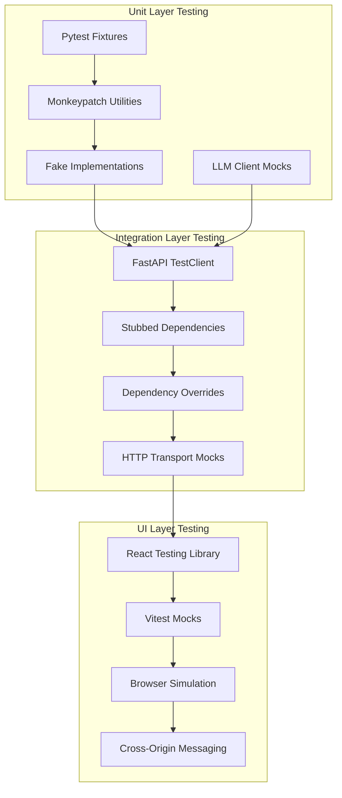
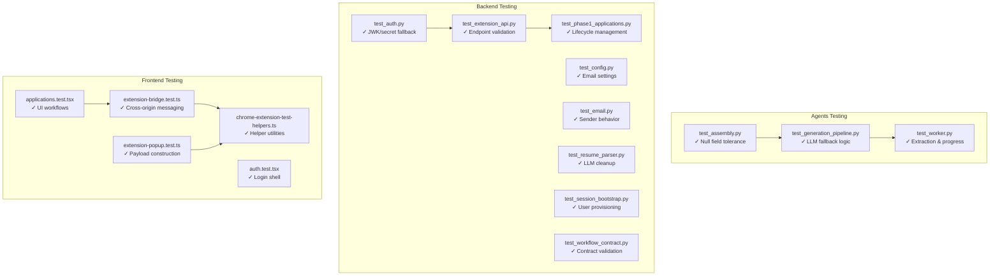
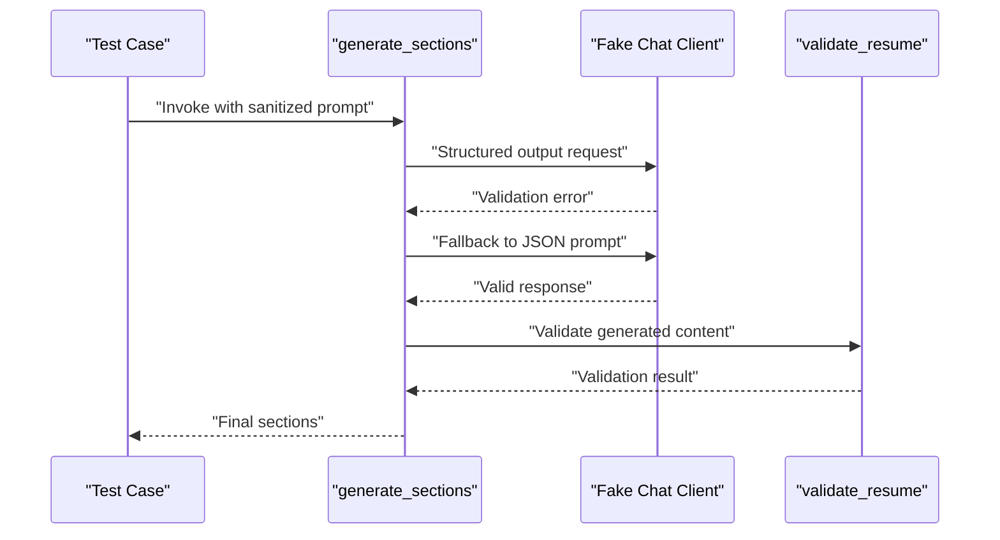
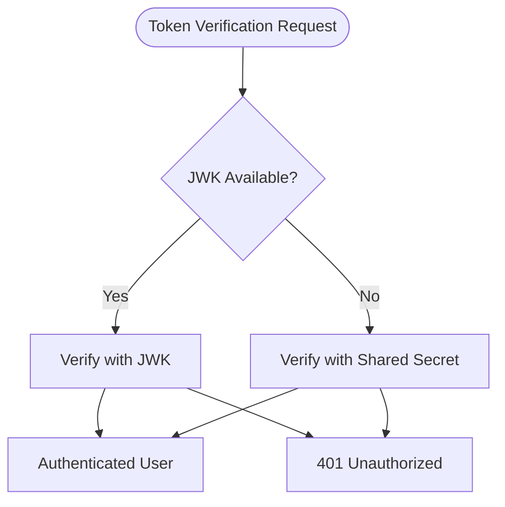
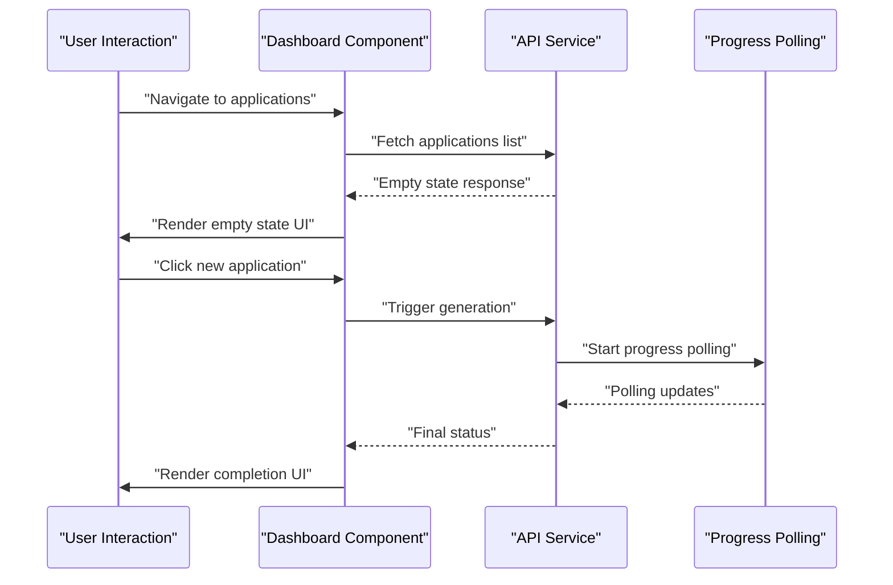
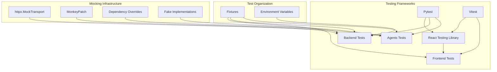

# Testing Infrastructure

<cite>
**Referenced Files in This Document**
- [test_assembly.py](file://agents/tests/test_assembly.py)
- [test_generation_pipeline.py](file://agents/tests/test_generation_pipeline.py)
- [test_worker.py](file://agents/tests/test_worker.py)
- [test_auth.py](file://backend/tests/test_auth.py)
- [test_config.py](file://backend/tests/test_config.py)
- [test_email.py](file://backend/tests/test_email.py)
- [test_extension_api.py](file://backend/tests/test_extension_api.py)
- [test_phase1_applications.py](file://backend/tests/test_phase1_applications.py)
- [test_resume_parser.py](file://backend/tests/test_resume_parser.py)
- [test_session_bootstrap.py](file://backend/tests/test_session_bootstrap.py)
- [test_workflow_contract.py](file://backend/tests/test_workflow_contract.py)
- [applications.test.tsx](file://frontend/src/test/applications.test.tsx)
- [auth.test.tsx](file://frontend/src/test/auth.test.tsx)
- [extension-bridge.test.ts](file://frontend/src/test/extension-bridge.test.ts)
- [extension-popup.test.ts](file://frontend/src/test/extension-popup.test.ts)
- [chrome-extension-test-helpers.ts](file://frontend/src/test/chrome-extension-test-helpers.ts)
</cite>

## Update Summary
**Changes Made**
- Expanded testing infrastructure documentation with detailed multi-layered testing approach
- Enhanced framework selection rationale explaining Pytest, FastAPI TestClient, React Testing Library, and Vitest usage
- Added comprehensive mocking methodologies covering LLM clients, HTTP transports, and dependency injection
- Improved test organization strategies with clear layer separation and isolation techniques
- Included guidelines for extending the test suite with practical examples for test case creation and mock implementation
- Added integration testing approaches for cross-module testing scenarios

## Table of Contents
1. [Introduction](#introduction)
2. [Framework Selection and Rationale](#framework-selection-and-rationale)
3. [Multi-Layered Testing Architecture](#multi-layered-testing-architecture)
4. [Project Structure](#project-structure)
5. [Core Components](#core-components)
6. [Detailed Component Analysis](#detailed-component-analysis)
7. [Mocking and Stubbing Strategies](#mocking-and-stubbing-strategies)
8. [Test Organization and Isolation](#test-organization-and-isolation)
9. [Integration Testing Approaches](#integration-testing-approaches)
10. [Guidelines for Extending the Test Suite](#guidelines-for-extending-the-test-suite)
11. [Dependency Analysis](#dependency-analysis)
12. [Performance Considerations](#performance-considerations)
13. [Troubleshooting Guide](#troubleshooting-guide)
14. [Conclusion](#conclusion)

## Introduction
This document describes the comprehensive testing infrastructure across the agents, backend, and frontend components of the job application system. The testing approach follows a multi-layered methodology combining unit, integration, and UI tests to ensure reliability, maintainability, and confidence in code changes. The infrastructure leverages Pytest for agents and backend, FastAPI TestClient for endpoint validation, and React Testing Library with Vitest for frontend UI testing, all supported by sophisticated mocking and stubbing strategies.

## Framework Selection and Rationale

### Pytest for Agents and Backend
Pytest was selected for its superior fixture management, parametric testing capabilities, and extensive plugin ecosystem. The framework provides:
- Automatic test discovery and execution
- Rich fixture system for dependency injection
- Monkeypatching capabilities for comprehensive mocking
- Async support through pytest-asyncio plugin
- Structured assertion messages and debugging support

### FastAPI TestClient for Backend Integration
FastAPI TestClient offers native integration with the application's dependency injection system, enabling:
- Real HTTP endpoint testing without external dependencies
- Automatic dependency override cleanup
- Seamless integration with Pydantic models and validation
- Comprehensive status code and response validation

### React Testing Library and Vitest for Frontend
React Testing Library paired with Vitest provides:
- DOM-focused testing that mirrors user interactions
- Virtual DOM rendering for fast test execution
- Comprehensive async testing utilities
- Mock module system for isolating component dependencies
- Type-safe testing with TypeScript integration

**Section sources**
- [test_assembly.py:1-27](file://agents/tests/test_assembly.py#L1-L27)
- [test_generation_pipeline.py:1-479](file://agents/tests/test_generation_pipeline.py#L1-L479)
- [test_worker.py:1-251](file://agents/tests/test_worker.py#L1-L251)
- [test_auth.py:1-67](file://backend/tests/test_auth.py#L1-L67)
- [test_config.py:1-47](file://backend/tests/test_config.py#L1-L47)
- [test_email.py:1-59](file://backend/tests/test_email.py#L1-L59)
- [test_extension_api.py:1-204](file://backend/tests/test_extension_api.py#L1-L204)
- [test_phase1_applications.py:1-1073](file://backend/tests/test_phase1_applications.py#L1-L1073)
- [test_resume_parser.py:1-166](file://backend/tests/test_resume_parser.py#L1-L166)
- [test_session_bootstrap.py:1-124](file://backend/tests/test_session_bootstrap.py#L1-L124)
- [applications.test.tsx:1-508](file://frontend/src/test/applications.test.tsx#L1-L508)
- [auth.test.tsx:1-44](file://frontend/src/test/auth.test.tsx#L1-L44)
- [extension-bridge.test.ts:1-99](file://frontend/src/test/extension-bridge.test.ts#L1-L99)
- [extension-popup.test.ts:1-30](file://frontend/src/test/extension-popup.test.ts#L1-L30)
- [chrome-extension-test-helpers.ts:1-40](file://frontend/src/test/chrome-extension-test-helpers.ts#L1-L40)

## Multi-Layered Testing Architecture

The testing architecture follows a three-tier approach designed for maximum isolation and reliability:

### Unit Layer
- **Purpose**: Test individual functions and classes in isolation
- **Techniques**: Mock external dependencies, use monkeypatching, and fake implementations
- **Coverage**: Core business logic, utility functions, and algorithmic components
- **Examples**: LLM client mocking, repository stubs, and service layer validation

### Integration Layer
- **Purpose**: Validate component interactions and API endpoints
- **Techniques**: Stubbed repositories/services, FastAPI TestClient, and dependency overrides
- **Coverage**: Database interactions, external service communication, and workflow orchestration
- **Examples**: Authentication flows, application lifecycle, and callback mechanisms

### UI Layer
- **Purpose**: Test user interactions and interface behavior
- **Techniques**: React Testing Library, Vitest mocks, and browser simulation
- **Coverage**: User workflows, form validation, and cross-origin messaging
- **Examples**: Application dashboards, authentication flows, and Chrome extension integration

**Diagram sources**
- [test_generation_pipeline.py:17-45](file://agents/tests/test_generation_pipeline.py#L17-L45)
- [test_extension_api.py:26-74](file://backend/tests/test_extension_api.py#L26-L74)
- [applications.test.tsx:9-32](file://frontend/src/test/applications.test.tsx#L9-L32)

## Project Structure
The repository organizes tests by module with clear separation of concerns:

### Agents Module Tests
- **Assembly Tests**: Validate resume composition with tolerant null field handling
- **Generation Pipeline Tests**: Comprehensive LLM interaction testing with fallback logic
- **Worker Tests**: Extraction agent behavior, progress tracking, and callback mechanisms

### Backend Module Tests  
- **Authentication Tests**: Token verification with JWK and shared secret fallback
- **Configuration Tests**: Environment variable validation and email settings
- **Service Tests**: Email delivery, resume parsing, and application management
- **API Tests**: Extension endpoints, session bootstrap, and workflow contracts

### Frontend Module Tests
- **Application UI Tests**: Dashboard flows, duplicate handling, and generation polling
- **Authentication Tests**: Login shell and Supabase session management
- **Chrome Extension Tests**: Bridge communication and popup helper functions

**Diagram sources**
- [test_assembly.py:11-27](file://agents/tests/test_assembly.py#L11-L27)
- [test_generation_pipeline.py:49-108](file://agents/tests/test_generation_pipeline.py#L49-L108)
- [test_worker.py:44-88](file://agents/tests/test_worker.py#L44-L88)
- [test_auth.py:29-47](file://backend/tests/test_auth.py#L29-L47)
- [test_config.py:9-18](file://backend/tests/test_config.py#L9-L18)
- [test_email.py:12-21](file://backend/tests/test_email.py#L12-L21)
- [test_extension_api.py:149-175](file://backend/tests/test_extension_api.py#L149-L175)
- [test_phase1_applications.py:29-77](file://backend/tests/test_phase1_applications.py#L29-L77)
- [test_resume_parser.py:32-61](file://backend/tests/test_resume_parser.py#L32-L61)
- [test_session_bootstrap.py:93-109](file://backend/tests/test_session_bootstrap.py#L93-L109)
- [applications.test.tsx:45-56](file://frontend/src/test/applications.test.tsx#L45-L56)
- [auth.test.tsx:18-33](file://frontend/src/test/auth.test.tsx#L18-L33)
- [extension-bridge.test.ts:36-58](file://frontend/src/test/extension-bridge.test.ts#L36-L58)
- [extension-popup.test.ts:9-22](file://frontend/src/test/extension-popup.test.ts#L9-L22)
- [chrome-extension-test-helpers.ts:25-39](file://frontend/src/test/chrome-extension-test-helpers.ts#L25-L39)

**Section sources**
- [test_assembly.py:11-27](file://agents/tests/test_assembly.py#L11-L27)
- [test_generation_pipeline.py:49-108](file://agents/tests/test_generation_pipeline.py#L49-L108)
- [test_worker.py:44-88](file://agents/tests/test_worker.py#L44-L88)
- [test_auth.py:29-47](file://backend/tests/test_auth.py#L29-L47)
- [test_config.py:9-18](file://backend/tests/test_config.py#L9-L18)
- [test_email.py:12-21](file://backend/tests/test_email.py#L12-L21)
- [test_extension_api.py:149-175](file://backend/tests/test_extension_api.py#L149-L175)
- [test_phase1_applications.py:29-77](file://backend/tests/test_phase1_applications.py#L29-L77)
- [test_resume_parser.py:32-61](file://backend/tests/test_resume_parser.py#L32-L61)
- [test_session_bootstrap.py:93-109](file://backend/tests/test_session_bootstrap.py#L93-L109)
- [applications.test.tsx:45-56](file://frontend/src/test/applications.test.tsx#L45-L56)
- [auth.test.tsx:18-33](file://frontend/src/test/auth.test.tsx#L18-L33)
- [extension-bridge.test.ts:36-58](file://frontend/src/test/extension-bridge.test.ts#L36-L58)
- [extension-popup.test.ts:9-22](file://frontend/src/test/extension-popup.test.ts#L9-L22)
- [chrome-extension-test-helpers.ts:25-39](file://frontend/src/test/chrome-extension-test-helpers.ts#L25-L39)

## Core Components

### Agents Testing Validation
- **Assembly Testing**: Ensures null personal info fields are tolerated while maintaining content integrity
- **Generation Pipeline Testing**: Verifies single LLM call usage, fallback logic, sanitization, truncation, and validation
- **Worker Testing**: Validates URL normalization, reference ID extraction, blocked page detection, progress updates, and callback retries

### Backend Testing Validation
- **Authentication Testing**: Validates JWK-based token verification with shared secret fallback mechanism
- **Configuration Testing**: Ensures email settings validation in both disabled and enabled modes
- **Service Testing**: Confirms email sender behavior with mocked HTTP transport and LLM cleanup processes
- **API Testing**: Validates extension endpoints with stubbed repositories and services
- **Workflow Testing**: Ensures complete status mapping and failure reason coverage

### Frontend Testing Validation
- **Application UI Testing**: Covers dashboard flows, duplicate review actions, blocked-source recovery, and generation polling
- **Authentication Shell Testing**: Verifies invite-only login surface and Supabase session storage configuration
- **Chrome Extension Testing**: Validates secure cross-origin messaging and payload construction helpers

**Section sources**
- [test_assembly.py:11-27](file://agents/tests/test_assembly.py#L11-L27)
- [test_generation_pipeline.py:49-108](file://agents/tests/test_generation_pipeline.py#L49-L108)
- [test_worker.py:44-88](file://agents/tests/test_worker.py#L44-L88)
- [test_auth.py:29-47](file://backend/tests/test_auth.py#L29-L47)
- [test_config.py:9-18](file://backend/tests/test_config.py#L9-L18)
- [test_email.py:12-21](file://backend/tests/test_email.py#L12-L21)
- [test_extension_api.py:149-175](file://backend/tests/test_extension_api.py#L149-L175)
- [test_phase1_applications.py:29-77](file://backend/tests/test_phase1_applications.py#L29-L77)
- [test_resume_parser.py:32-61](file://backend/tests/test_resume_parser.py#L32-L61)
- [test_session_bootstrap.py:93-109](file://backend/tests/test_session_bootstrap.py#L93-L109)
- [applications.test.tsx:45-56](file://frontend/src/test/applications.test.tsx#L45-L56)
- [auth.test.tsx:18-33](file://frontend/src/test/auth.test.tsx#L18-L33)
- [extension-bridge.test.ts:36-58](file://frontend/src/test/extension-bridge.test.ts#L36-L58)
- [extension-popup.test.ts:9-22](file://frontend/src/test/extension-popup.test.ts#L9-L22)
- [chrome-extension-test-helpers.ts:25-39](file://frontend/src/test/chrome-extension-test-helpers.ts#L25-L39)

## Detailed Component Analysis

### Agents Testing Deep Dive

#### Generation Pipeline Testing Strategy
The generation pipeline tests employ sophisticated mocking techniques to validate complex LLM interaction patterns:

**Diagram sources**
- [test_generation_pipeline.py:110-154](file://agents/tests/test_generation_pipeline.py#L110-L154)
- [test_generation_pipeline.py:208-251](file://agents/tests/test_generation_pipeline.py#L208-L251)

#### Worker Testing Implementation
Worker tests validate extraction agent behavior and progress tracking:

- **Extraction Agent Fallback**: Tests primary model failure followed by fallback model activation
- **Progress Tracking**: Validates stale job filtering and progress update mechanisms
- **Callback Retry Logic**: Ensures transient server errors are handled gracefully

**Section sources**
- [test_generation_pipeline.py:49-108](file://agents/tests/test_generation_pipeline.py#L49-L108)
- [test_generation_pipeline.py:110-154](file://agents/tests/test_generation_pipeline.py#L110-L154)
- [test_generation_pipeline.py:158-204](file://agents/tests/test_generation_pipeline.py#L158-L204)
- [test_worker.py:128-133](file://agents/tests/test_worker.py#L128-L133)
- [test_worker.py:172-208](file://agents/tests/test_worker.py#L172-L208)
- [test_worker.py:211-250](file://agents/tests/test_worker.py#L211-L250)

### Backend Testing Deep Dive

#### Authentication Testing Architecture
Authentication tests implement comprehensive token verification scenarios:

**Diagram sources**
- [test_auth.py:29-47](file://backend/tests/test_auth.py#L29-L47)
- [test_auth.py:50-66](file://backend/tests/test_auth.py#L50-L66)

#### Extension API Testing Strategy
Extension API tests utilize dependency injection overrides for comprehensive endpoint validation:

- **Authentication Flow**: Validates bearer token requirements and user authorization
- **Token Lifecycle**: Tests token issuance, status checking, and revocation processes
- **Import Flow**: Validates job capture processing with proper error handling

**Section sources**
- [test_auth.py:29-47](file://backend/tests/test_auth.py#L29-L47)
- [test_extension_api.py:149-175](file://backend/tests/test_extension_api.py#L149-L175)
- [test_extension_api.py:177-204](file://backend/tests/test_extension_api.py#L177-L204)

### Frontend Testing Deep Dive

#### Application UI Testing Patterns
Frontend tests implement realistic user interaction scenarios:

**Diagram sources**
- [applications.test.tsx:293-373](file://frontend/src/test/applications.test.tsx#L293-L373)

#### Chrome Extension Testing Approach
Extension tests validate secure cross-origin communication:

- **Bridge Communication**: Tests CONNECT_EXTENSION_TOKEN message handling
- **Security Validation**: Ensures untrusted origins are ignored
- **Payload Construction**: Validates import request formatting and validation

**Section sources**
- [applications.test.tsx:45-56](file://frontend/src/test/applications.test.tsx#L45-L56)
- [applications.test.tsx:172-200](file://frontend/src/test/applications.test.tsx#L172-L200)
- [extension-bridge.test.ts:36-58](file://frontend/src/test/extension-bridge.test.ts#L36-L58)
- [extension-bridge.test.ts:60-97](file://frontend/src/test/extension-bridge.test.ts#L60-L97)
- [extension-popup.test.ts:9-22](file://frontend/src/test/extension-popup.test.ts#L9-L22)

## Mocking and Stubbing Strategies

### LLM Client Mocking Techniques
Sophisticated fake implementations replace external AI services:

- **Structured Output Testing**: Validates response model validation and error handling
- **Fallback Logic Testing**: Simulates model unavailability and automatic fallback
- **Prompt Sanitization Testing**: Ensures sensitive data removal and content preservation

### HTTP Transport Mocking
Comprehensive HTTP client mocking enables reliable network testing:

- **Email Service Mocking**: Uses httpx.MockTransport for Resend API simulation
- **Resume Parser Mocking**: Implements custom AsyncClient for OpenRouter API
- **Callback Client Mocking**: Tests retry logic with configurable error responses

### Dependency Injection Stubs
Systematic dependency replacement ensures test isolation:

- **Repository Stubs**: Fake implementations replace database interactions
- **Service Stubs**: Mock services simulate external API behavior
- **Configuration Stubs**: Environment variable overrides control test behavior

**Section sources**
- [test_generation_pipeline.py:17-45](file://agents/tests/test_generation_pipeline.py#L17-L45)
- [test_email.py:25-58](file://backend/tests/test_email.py#L25-L58)
- [test_resume_parser.py:32-61](file://backend/tests/test_resume_parser.py#L32-L61)
- [test_worker.py:211-250](file://agents/tests/test_worker.py#L211-L250)

## Test Organization and Isolation

### Fixture Management
Centralized fixture definitions provide consistent test setup:

- **Database Fixtures**: Mock repositories with predefined test data
- **Authentication Fixtures**: Stub verifiers with controlled token validation
- **Environment Fixtures**: Configure test-specific environment variables

### Monkeypatching Strategy
Systematic monkeypatching replaces external dependencies:

- **Global Replacement**: Uses pytest monkeypatch for module-level mocking
- **Selective Patching**: Targets specific function calls without affecting others
- **Cleanup Management**: Automatic restoration prevents test interference

### Test Data Management
Structured test data ensures reproducible results:

- **Factory Functions**: Generate consistent test objects
- **Data Seeding**: Predefined datasets for complex scenarios
- **State Management**: Controlled test state transitions

**Section sources**
- [test_generation_pipeline.py:49-108](file://agents/tests/test_generation_pipeline.py#L49-L108)
- [test_extension_api.py:142-146](file://backend/tests/test_extension_api.py#L142-L146)
- [test_session_bootstrap.py:65-69](file://backend/tests/test_session_bootstrap.py#L65-L69)

## Integration Testing Approaches

### Cross-Module Testing
Integration tests validate component interactions:

- **Agents-Backend Integration**: Tests worker callback mechanisms and data flow
- **Backend-Frontend Integration**: Validates API endpoints and data synchronization
- **Chrome Extension Integration**: Tests cross-origin communication and data exchange

### End-to-End Workflow Testing
Complete user journey validation:

- **Application Creation**: From job URL capture to draft generation
- **Duplicate Detection**: Validates matching algorithms and resolution workflows
- **Generation Process**: Tests full lifecycle from extraction to completion

### Dependency Override Patterns
Systematic dependency replacement enables integration testing:

- **FastAPI Dependency Overrides**: Replaces production dependencies during tests
- **Repository Overrides**: Provides controlled data access for integration scenarios
- **Service Overrides**: Simulates external service behavior for comprehensive testing

**Section sources**
- [test_phase1_applications.py:29-77](file://backend/tests/test_phase1_applications.py#L29-L77)
- [test_extension_api.py:149-175](file://backend/tests/test_extension_api.py#L149-L175)
- [applications.test.tsx:45-56](file://frontend/src/test/applications.test.tsx#L45-L56)

## Guidelines for Extending the Test Suite

### Test Case Creation Best Practices
When adding new tests, follow these guidelines:

1. **Test Naming Conventions**: Use descriptive names that explain the scenario being tested
2. **Arrange-Act-Assert Pattern**: Structure tests with clear setup, execution, and validation steps
3. **Edge Case Coverage**: Include boundary conditions and error scenarios
4. **Isolation Principles**: Ensure tests don't depend on external state or other test execution order

### Mock Strategy Implementation
Implement mocking consistently across all layers:

1. **Fake Implementations**: Create lightweight fake classes for complex dependencies
2. **HTTP Mocking**: Use appropriate transport layers for different service types
3. **Async Mocking**: Handle async operations with proper await patterns
4. **Error Simulation**: Test error handling with realistic failure scenarios

### Integration Testing Approaches
For cross-module testing:

1. **Dependency Injection**: Use FastAPI's dependency override system for clean separation
2. **State Management**: Control test state through fixtures and setup/teardown methods
3. **Data Consistency**: Ensure test data doesn't leak between test runs
4. **Performance Considerations**: Minimize test execution time through efficient mocking

### Test Organization Strategies
Maintain clean and organized test suites:

1. **Logical Grouping**: Organize tests by feature area and complexity level
2. **Shared Fixtures**: Create reusable fixtures for common setup scenarios
3. **Documentation**: Include clear comments explaining test purpose and expected outcomes
4. **Maintenance**: Regularly review and refactor tests to maintain readability and reliability

**Section sources**
- [test_assembly.py:11-27](file://agents/tests/test_assembly.py#L11-L27)
- [test_generation_pipeline.py:49-108](file://agents/tests/test_generation_pipeline.py#L49-L108)
- [test_worker.py:128-133](file://agents/tests/test_worker.py#L128-L133)
- [test_email.py:25-58](file://backend/tests/test_email.py#L25-L58)
- [applications.test.tsx:45-56](file://frontend/src/test/applications.test.tsx#L45-L56)

## Dependency Analysis
The testing infrastructure relies on a carefully orchestrated set of dependencies:

### Core Testing Frameworks
- **Pytest**: Primary testing framework for agents and backend modules
- **FastAPI TestClient**: Native HTTP testing for backend endpoints
- **React Testing Library**: DOM-focused testing for frontend components
- **Vitest**: High-performance test runner for frontend testing

### Mocking and Stubbing Infrastructure
- **httpx.MockTransport**: HTTP client mocking for external service testing
- **MonkeyPatch Utilities**: Systematic dependency replacement across modules
- **Fake Implementations**: Lightweight alternatives to complex dependencies
- **Async Mocking**: Support for asynchronous operation testing

### Test Organization Tools
- **Fixtures**: Reusable test setup and teardown logic
- **Dependency Overrides**: Clean separation of test and production dependencies
- **Environment Variables**: Configurable test behavior through environment settings

**Diagram sources**
- [test_generation_pipeline.py:17-45](file://agents/tests/test_generation_pipeline.py#L17-L45)
- [test_email.py:25-58](file://backend/tests/test_email.py#L25-L58)
- [test_extension_api.py:142-146](file://backend/tests/test_extension_api.py#L142-L146)

**Section sources**
- [test_assembly.py:1-27](file://agents/tests/test_assembly.py#L1-L27)
- [test_generation_pipeline.py:1-479](file://agents/tests/test_generation_pipeline.py#L1-L479)
- [test_worker.py:1-251](file://agents/tests/test_worker.py#L1-L251)
- [test_auth.py:1-67](file://backend/tests/test_auth.py#L1-L67)
- [test_config.py:1-47](file://backend/tests/test_config.py#L1-L47)
- [test_email.py:1-59](file://backend/tests/test_email.py#L1-L59)
- [test_extension_api.py:1-204](file://backend/tests/test_extension_api.py#L1-L204)
- [test_phase1_applications.py:1-1073](file://backend/tests/test_phase1_applications.py#L1-L1073)
- [test_resume_parser.py:1-166](file://backend/tests/test_resume_parser.py#L1-L166)
- [test_session_bootstrap.py:1-124](file://backend/tests/test_session_bootstrap.py#L1-L124)
- [applications.test.tsx:1-508](file://frontend/src/test/applications.test.tsx#L1-L508)
- [auth.test.tsx:1-44](file://frontend/src/test/auth.test.tsx#L1-L44)
- [extension-bridge.test.ts:1-99](file://frontend/src/test/extension-bridge.test.ts#L1-L99)
- [extension-popup.test.ts:1-30](file://frontend/src/test/extension-popup.test.ts#L1-L30)
- [chrome-extension-test-helpers.ts:1-40](file://frontend/src/test/chrome-extension-test-helpers.ts#L1-L40)

## Performance Considerations
Optimizing test performance and reliability:

### Mocking Strategy Optimization
- **Prefer Mocking Over Real Services**: Replace external dependencies with lightweight mocks
- **Use Targeted Monkeypatching**: Replace only necessary dependencies to minimize overhead
- **Cache Mock Objects**: Reuse mock instances across similar test scenarios

### Test Execution Optimization
- **Minimize Test Fixtures**: Keep test setup data minimal to reduce initialization time
- **Avoid Real Timers**: Use fake timers in UI tests to eliminate unnecessary delays
- **Parallel Test Execution**: Leverage Pytest's parallel execution capabilities where safe

### Resource Management
- **Proper Cleanup**: Ensure all mocks and stubs are properly cleaned up after tests
- **Memory Management**: Avoid memory leaks by properly disposing of test resources
- **Database Connection Management**: Use connection pooling and proper cleanup in integration tests

## Troubleshooting Guide
Common issues and their solutions:

### Authentication and Authorization Issues
- **Token Verification Failures**: Verify JWK configuration and shared secret settings
- **Dependency Override Problems**: Ensure proper cleanup of FastAPI dependency overrides
- **Session State Issues**: Check authentication token validity and expiration

### Mocking and Stubbing Problems
- **HTTP Client Mocking Failures**: Verify MockTransport configuration and request/response patterns
- **Async Operation Issues**: Ensure proper await patterns and async context management
- **Monkeypatch Scope Issues**: Check that patches are applied before imports and cleaned up properly

### Integration Test Failures
- **Database Mock Issues**: Verify repository stub implementations and data consistency
- **Cross-Origin Communication**: Check extension bridge security configurations and message handling
- **Environment Variable Conflicts**: Ensure test environment variables don't interfere with each other

**Section sources**
- [test_auth.py:50-66](file://backend/tests/test_auth.py#L50-L66)
- [test_config.py:21-33](file://backend/tests/test_config.py#L21-L33)
- [test_email.py:25-58](file://backend/tests/test_email.py#L25-L58)
- [test_extension_api.py:177-204](file://backend/tests/test_extension_api.py#L177-L204)
- [applications.test.tsx:375-438](file://frontend/src/test/applications.test.tsx#L375-L438)

## Conclusion
The testing infrastructure provides a comprehensive, multi-layered approach to ensuring code quality and reliability across all components of the job application system. Through careful framework selection, sophisticated mocking strategies, and systematic test organization, the suite maintains stability while enabling rapid development and confident refactoring. The documented patterns and guidelines provide a foundation for extending the test suite effectively, ensuring that new features and modifications can be thoroughly validated before deployment.