# Backend Testing

<cite>
**Referenced Files in This Document**
- [backend/pyproject.toml](file://backend/pyproject.toml)
- [backend/app/main.py](file://backend/app/main.py)
- [backend/app/core/auth.py](file://backend/app/core/auth.py)
- [backend/app/core/config.py](file://backend/app/core/config.py)
- [backend/app/core/access.py](file://backend/app/core/access.py)
- [backend/app/api/session.py](file://backend/app/api/session.py)
- [backend/app/api/applications.py](file://backend/app/api/applications.py)
- [backend/app/api/extension.py](file://backend/app/api/extension.py)
- [backend/app/api/admin.py](file://backend/app/api/admin.py)
- [backend/app/api/notifications.py](file://backend/app/api/notifications.py)
- [backend/app/db/applications.py](file://backend/app/db/applications.py)
- [backend/app/db/admin.py](file://backend/app/db/admin.py)
- [backend/app/db/notifications.py](file://backend/app/db/notifications.py)
- [backend/app/services/application_manager.py](file://backend/app/services/application_manager.py)
- [backend/app/services/admin.py](file://backend/app/services/admin.py)
- [backend/app/services/pdf_export.py](file://backend/app/services/pdf_export.py)
- [backend/tests/test_admin_api.py](file://backend/tests/test_admin_api.py)
- [backend/tests/test_admin_service.py](file://backend/tests/test_admin_service.py)
- [backend/tests/test_application_request_validation.py](file://backend/tests/test_application_request_validation.py)
- [backend/tests/test_notifications_api.py](file://backend/tests/test_notifications_api.py)
- [backend/tests/test_pdf_export.py](file://backend/tests/test_pdf_export.py)
- [backend/tests/test_auth.py](file://backend/tests/test_auth.py)
- [backend/tests/test_config.py](file://backend/tests/test_config.py)
- [backend/tests/test_email.py](file://backend/tests/test_email.py)
- [backend/tests/test_session_bootstrap.py](file://backend/tests/test_session_bootstrap.py)
- [backend/tests/test_extension_api.py](file://backend/tests/test_extension_api.py)
- [backend/tests/test_phase1_applications.py](file://backend/tests/test_phase1_applications.py)
- [backend/tests/test_workflow_contract.py](file://backend/tests/test_workflow_contract.py)
</cite>

## Update Summary
**Changes Made**
- Added comprehensive testing documentation for new admin API and service components
- Documented notifications API testing with user-scoped notification management
- Added PDF export functionality testing with markdown normalization and layout presets
- Enhanced application request validation testing for security-focused input sanitization
- Updated testing patterns to include new admin-specific authentication and authorization flows

## Table of Contents
1. [Introduction](#introduction)
2. [Project Structure](#project-structure)
3. [Core Components](#core-components)
4. [Architecture Overview](#architecture-overview)
5. [Detailed Component Analysis](#detailed-component-analysis)
6. [Dependency Analysis](#dependency-analysis)
7. [Performance Considerations](#performance-considerations)
8. [Troubleshooting Guide](#troubleshooting-guide)
9. [Conclusion](#conclusion)
10. [Appendices](#appendices)

## Introduction
This document provides comprehensive backend testing guidance for the FastAPI application. It covers unit testing for individual functions and classes, integration testing for API endpoints, and workflow testing for complex business processes. It also explains test configuration and setup, including database testing with pytest fixtures, authentication testing, and external service mocking. The document details testing patterns for async operations, database transactions, and error handling scenarios, and includes examples of testing FastAPI dependencies, middleware, and background tasks. Guidance is provided on test coverage requirements, performance testing, and debugging backend test failures.

**Updated** Added comprehensive testing coverage for new admin functionality, notifications system, PDF export capabilities, and enhanced application request validation.

## Project Structure
The backend is organized around a FastAPI application with clear separation of concerns:
- Core: configuration, authentication, and security utilities
- API: routers and endpoint handlers
- DB: repositories and database operations
- Services: business logic and orchestration
- Tests: focused unit and integration tests

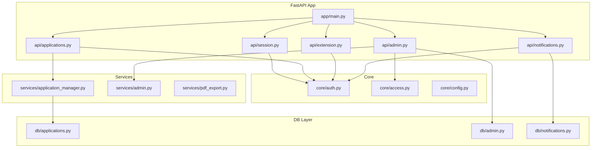

**Diagram sources**
- [backend/app/main.py:1-36](file://backend/app/main.py#L1-L36)
- [backend/app/api/session.py:1-45](file://backend/app/api/session.py#L1-L45)
- [backend/app/api/applications.py:1-661](file://backend/app/api/applications.py#L1-L661)
- [backend/app/api/extension.py:1-141](file://backend/app/api/extension.py#L1-L141)
- [backend/app/api/admin.py:1-242](file://backend/app/api/admin.py#L1-L242)
- [backend/app/api/notifications.py:1-43](file://backend/app/api/notifications.py#L1-L43)
- [backend/app/core/auth.py:1-90](file://backend/app/core/auth.py#L1-L90)
- [backend/app/core/access.py:1-90](file://backend/app/core/access.py#L1-L90)
- [backend/app/core/config.py:1-97](file://backend/app/core/config.py#L1-L97)
- [backend/app/services/application_manager.py:1-800](file://backend/app/services/application_manager.py#L1-L800)
- [backend/app/services/admin.py:1-471](file://backend/app/services/admin.py#L1-L471)
- [backend/app/services/pdf_export.py:1-642](file://backend/app/services/pdf_export.py#L1-L642)
- [backend/app/db/applications.py:1-328](file://backend/app/db/applications.py#L1-L328)
- [backend/app/db/admin.py:1-328](file://backend/app/db/admin.py#L1-L328)
- [backend/app/db/notifications.py:1-328](file://backend/app/db/notifications.py#L1-L328)

**Section sources**
- [backend/app/main.py:1-36](file://backend/app/main.py#L1-L36)
- [backend/pyproject.toml:1-37](file://backend/pyproject.toml#L1-L37)

## Core Components
This section outlines the primary backend components under test and their roles in the system.

- Authentication and Authorization
  - AuthVerifier and get_current_user enforce JWT verification and bearer token checks.
  - Admin access control through get_current_admin_user for privileged operations.
  - Security utilities support extension token hashing and verification.
- Configuration
  - Settings encapsulate environment-driven configuration, including email and CORS settings.
- API Routers
  - Session, Applications, Extension, Admin, and Notifications routers expose endpoints with request/response models and validation.
- Database Repositories
  - ApplicationRepository manages CRUD operations with PostgreSQL via psycopg, including transactional updates and enum casts.
  - AdminRepository handles user management, invitations, and usage tracking.
  - NotificationRepository manages user-scoped notifications with privacy controls.
- Services
  - ApplicationService orchestrates application lifecycle, duplicate detection, job queues, progress tracking, and notifications.
  - AdminService provides user management, invitation workflows, and administrative metrics.
  - PDFExportService converts markdown to ATS-compliant PDFs with layout optimization.

Key testing areas include:
- Unit tests for AuthVerifier behavior and Settings validation
- Integration tests for API endpoints using TestClient and dependency overrides
- Workflow tests validating complex business logic and error handling
- Admin-specific testing for user permissions and invitation flows
- PDF export testing for markdown normalization and layout presets

**Section sources**
- [backend/app/core/auth.py:1-90](file://backend/app/core/auth.py#L1-L90)
- [backend/app/core/access.py:1-90](file://backend/app/core/access.py#L1-L90)
- [backend/app/core/config.py:1-97](file://backend/app/core/config.py#L1-L97)
- [backend/app/api/session.py:1-45](file://backend/app/api/session.py#L1-L45)
- [backend/app/api/applications.py:1-661](file://backend/app/api/applications.py#L1-L661)
- [backend/app/api/extension.py:1-141](file://backend/app/api/extension.py#L1-L141)
- [backend/app/api/admin.py:1-242](file://backend/app/api/admin.py#L1-L242)
- [backend/app/api/notifications.py:1-43](file://backend/app/api/notifications.py#L1-L43)
- [backend/app/db/applications.py:1-328](file://backend/app/db/applications.py#L1-L328)
- [backend/app/db/admin.py:1-328](file://backend/app/db/admin.py#L1-L328)
- [backend/app/db/notifications.py:1-328](file://backend/app/db/notifications.py#L1-L328)
- [backend/app/services/application_manager.py:1-800](file://backend/app/services/application_manager.py#L1-L800)
- [backend/app/services/admin.py:1-471](file://backend/app/services/admin.py#L1-L471)
- [backend/app/services/pdf_export.py:1-642](file://backend/app/services/pdf_export.py#L1-L642)

## Architecture Overview
The testing architecture leverages pytest with FastAPI's TestClient for integration tests and dependency injection overrides for isolation. Async endpoints are tested with pytest-asyncio. Mock transports emulate external services (e.g., email provider). Fixtures manage cleanup of dependency overrides to avoid cross-test interference.

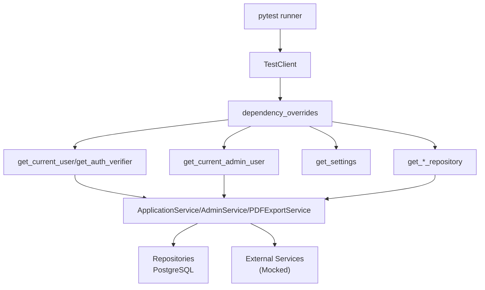

**Diagram sources**
- [backend/tests/test_session_bootstrap.py:65-69](file://backend/tests/test_session_bootstrap.py#L65-L69)
- [backend/tests/test_extension_api.py:142-146](file://backend/tests/test_extension_api.py#L142-L146)
- [backend/tests/test_phase1_applications.py:259-282](file://backend/tests/test_phase1_applications.py#L259-L282)
- [backend/tests/test_admin_api.py:106-128](file://backend/tests/test_admin_api.py#L106-L128)
- [backend/tests/test_notifications_api.py:109-139](file://backend/tests/test_notifications_api.py#L109-L139)
- [backend/tests/test_pdf_export.py:75-95](file://backend/tests/test_pdf_export.py#L75-L95)
- [backend/app/core/auth.py:72-90](file://backend/app/core/auth.py#L72-L90)
- [backend/app/core/access.py:72-90](file://backend/app/core/access.py#L72-L90)
- [backend/app/core/config.py:94-97](file://backend/app/core/config.py#L94-L97)
- [backend/app/db/applications.py:326-328](file://backend/app/db/applications.py#L326-L328)
- [backend/app/services/application_manager.py:143-168](file://backend/app/services/application_manager.py#L143-L168)

## Detailed Component Analysis

### Authentication Testing
Testing focuses on token verification, fallback mechanisms, and error propagation.

- AuthVerifier behavior
  - Validates token decoding via JWKS and falls back to shared secret when JWKS is empty.
  - Raises appropriate HTTP exceptions when verification fails and no fallback is available.
- Admin access control
  - get_current_admin_user enforces admin role requirements for privileged endpoints.
  - Tests verify 403 Forbidden responses for non-admin users attempting admin operations.
- Monkeypatching environment variables to simulate misconfiguration.
- Verifying Unauthorized responses for missing or invalid bearer tokens.

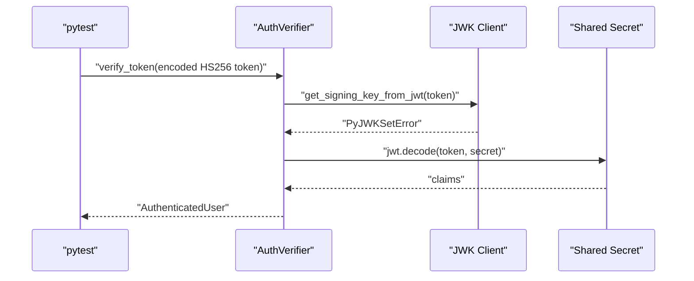

**Diagram sources**
- [backend/tests/test_auth.py:29-48](file://backend/tests/test_auth.py#L29-L48)
- [backend/app/core/auth.py:40-64](file://backend/app/core/auth.py#L40-L64)

**Section sources**
- [backend/tests/test_auth.py:1-67](file://backend/tests/test_auth.py#L1-L67)
- [backend/app/core/auth.py:1-90](file://backend/app/core/auth.py#L1-L90)

### Admin API Testing
Comprehensive testing for administrative operations including metrics retrieval, user management, and invitation workflows.

- Admin metrics endpoint requires admin authentication and returns comprehensive operational metrics.
- User invitation flow validates email format, creates temporary accounts, and sends invitation emails.
- User management operations include listing, updating, deactivating/reactivating, and deleting users.
- Permission testing ensures non-admin users receive 403 Forbidden responses.

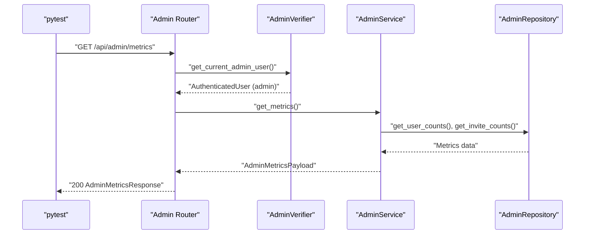

**Diagram sources**
- [backend/tests/test_admin_api.py:117-128](file://backend/tests/test_admin_api.py#L117-L128)
- [backend/app/api/admin.py:148-154](file://backend/app/api/admin.py#L148-L154)

**Section sources**
- [backend/tests/test_admin_api.py:1-146](file://backend/tests/test_admin_api.py#L1-L146)
- [backend/app/api/admin.py:1-242](file://backend/app/api/admin.py#L1-L242)

### Admin Service Testing
Unit testing for administrative service logic including invitation workflows, user management, and error handling.

- Invitation flow testing validates email notifications configuration, user creation, and usage event recording.
- Error handling tests cover disabled email notifications, failed email delivery, and validation errors.
- Password strength validation ensures compliance with security requirements.
- Usage event tracking verifies proper logging of administrative actions.

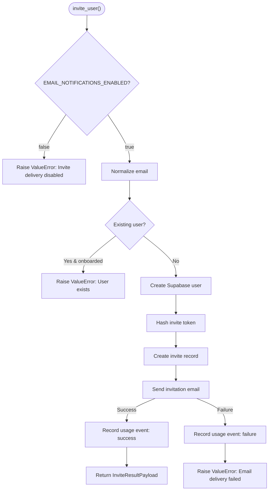

**Diagram sources**
- [backend/tests/test_admin_service.py:114-141](file://backend/tests/test_admin_service.py#L114-L141)
- [backend/app/services/admin.py:119-208](file://backend/app/services/admin.py#L119-L208)

**Section sources**
- [backend/tests/test_admin_service.py:1-142](file://backend/tests/test_admin_service.py#L1-L142)
- [backend/app/services/admin.py:1-471](file://backend/app/services/admin.py#L1-L471)

### Notifications API Testing
Testing for user-scoped notification management with privacy controls and ordering.

- Authentication testing ensures protected endpoints require valid bearer tokens.
- Notification listing returns user-scoped results ordered by creation time (newest first).
- Clear notifications operation preserves action-required items and removes others.
- Privacy testing prevents cross-user notification leakage.

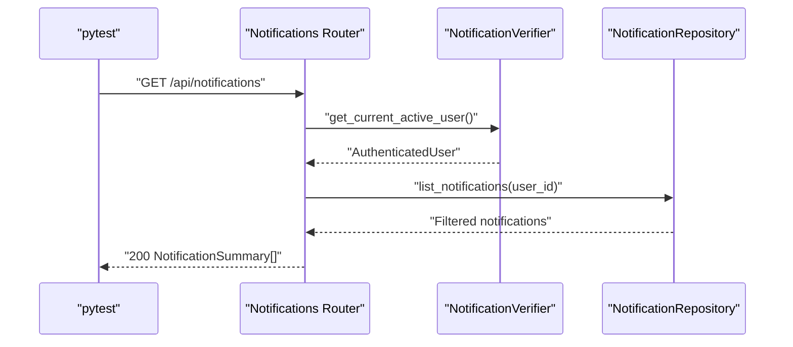

**Diagram sources**
- [backend/tests/test_notifications_api.py:109-139](file://backend/tests/test_notifications_api.py#L109-L139)
- [backend/app/api/notifications.py:25-33](file://backend/app/api/notifications.py#L25-L33)

**Section sources**
- [backend/tests/test_notifications_api.py:1-156](file://backend/tests/test_notifications_api.py#L1-L156)
- [backend/app/api/notifications.py:1-43](file://backend/app/api/notifications.py#L1-L43)

### PDF Export Functionality Testing
Comprehensive testing for markdown-to-PDF conversion with layout optimization and page fitting.

- Markdown normalization tests cover legacy placeholder replacement and profile-based header generation.
- HTML building tests validate layout presets, spacing units, and professional experience formatting.
- Autofit algorithm testing ensures optimal page count achievement through preset iteration.
- One-page validation testing optimizes density before font size reduction.
- Section spacing enhancement testing improves readability without exceeding page limits.

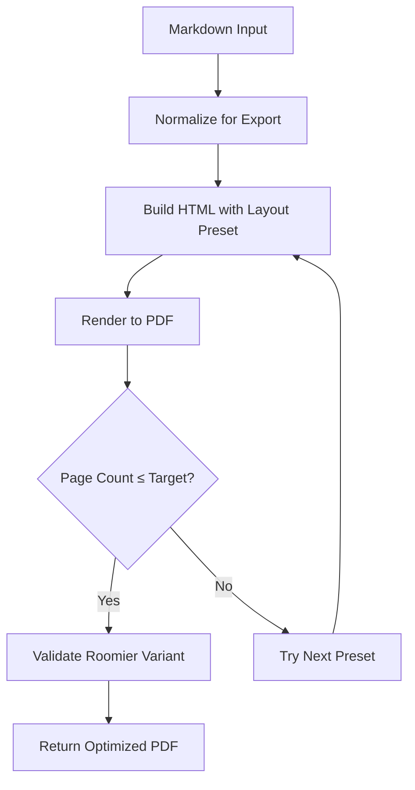

**Diagram sources**
- [backend/tests/test_pdf_export.py:75-95](file://backend/tests/test_pdf_export.py#L75-L95)
- [backend/app/services/pdf_export.py:599-622](file://backend/app/services/pdf_export.py#L599-L622)

**Section sources**
- [backend/tests/test_pdf_export.py:1-228](file://backend/tests/test_pdf_export.py#L1-L228)
- [backend/app/services/pdf_export.py:1-642](file://backend/app/services/pdf_export.py#L1-L642)

### Application Request Validation Testing
Security-focused validation testing for application-related requests preventing prompt injection and unauthorized modifications.

- Additional instructions validation prevents fact injection attempts and multiline override commands.
- Full regeneration requests reject company injection instructions.
- Section regeneration requests block override attempts.
- Safe instruction patterns are validated for legitimate use cases.

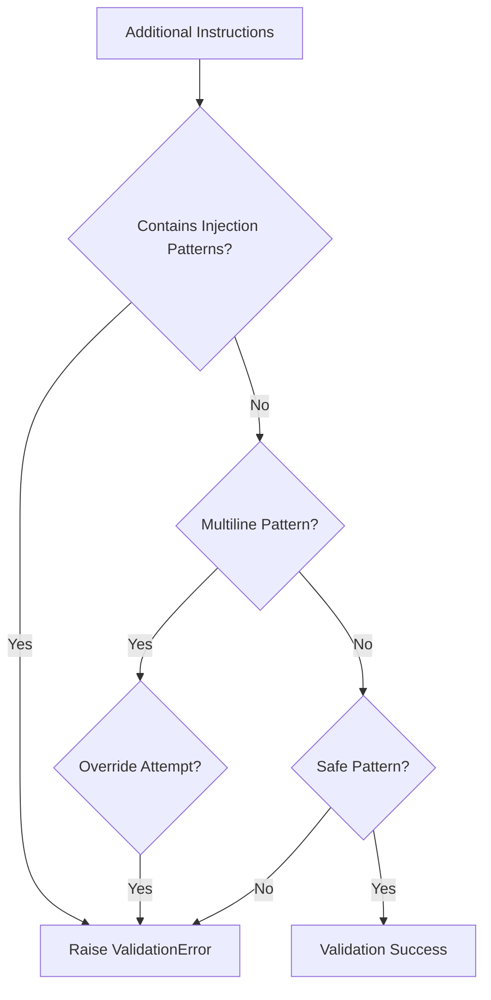

**Diagram sources**
- [backend/tests/test_application_request_validation.py:36-48](file://backend/tests/test_application_request_validation.py#L36-L48)
- [backend/app/api/applications.py:1-661](file://backend/app/api/applications.py#L1-L661)

**Section sources**
- [backend/tests/test_application_request_validation.py:1-72](file://backend/tests/test_application_request_validation.py#L1-L72)

### Configuration Testing
Validates Settings behavior for email notifications and environment-driven configuration.

- Disabled mode without credentials is accepted.
- Enabled mode without required credentials raises validation errors.
- Enabled mode with credentials is accepted.

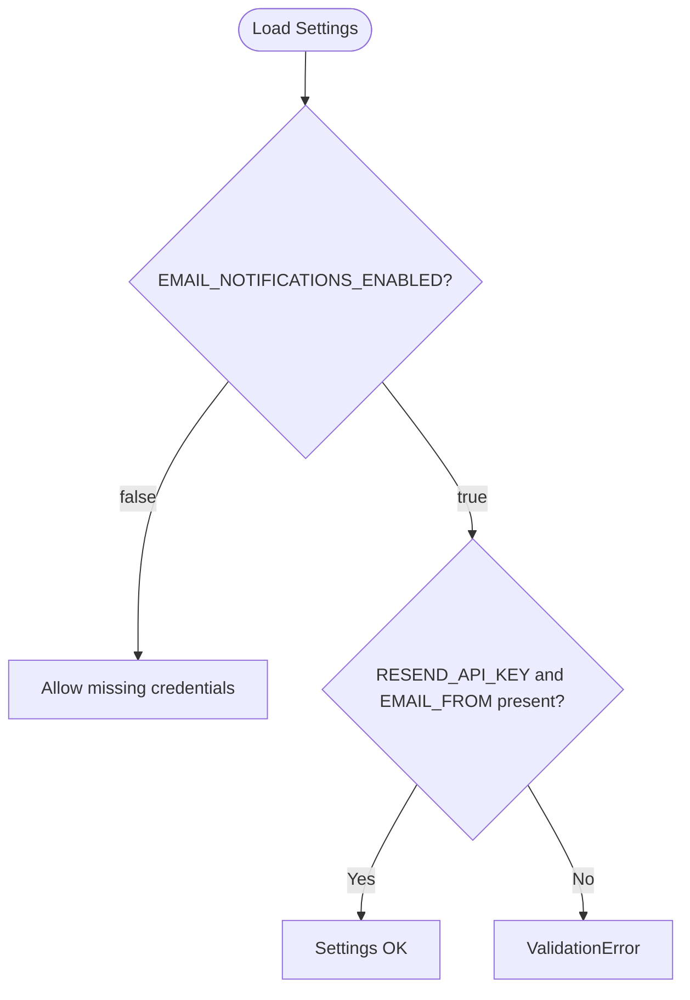

**Diagram sources**
- [backend/tests/test_config.py:9-32](file://backend/tests/test_config.py#L9-L32)
- [backend/tests/test_config.py:21-32](file://backend/tests/test_config.py#L21-L32)
- [backend/tests/test_config.py:35-46](file://backend/tests/test_config.py#L35-L46)
- [backend/app/core/config.py:15-32](file://backend/app/core/config.py#L15-L32)

**Section sources**
- [backend/tests/test_config.py:1-47](file://backend/tests/test_config.py#L1-L47)
- [backend/app/core/config.py:1-97](file://backend/app/core/config.py#L1-L97)

### Email Service Testing
Tests asynchronous email sending behavior and payload construction.

- Notifications disabled: No-op sender used; send returns None.
- Notifications enabled: ResendEmailSender posts expected payload; validates URL, headers, and JSON body.
- Uses httpx.AsyncClient with MockTransport to intercept requests.

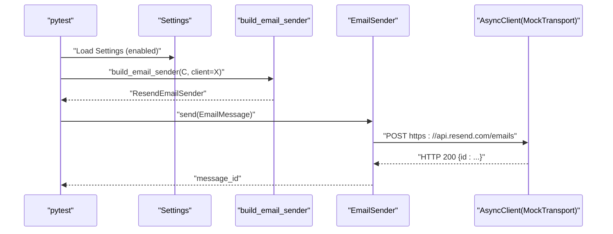

**Diagram sources**
- [backend/tests/test_email.py:24-58](file://backend/tests/test_email.py#L24-L58)
- [backend/app/services/email.py:1-200](file://backend/app/services/email.py#L1-L200)

**Section sources**
- [backend/tests/test_email.py:1-59](file://backend/tests/test_email.py#L1-L59)

### Session Bootstrap Endpoint Testing
Validates authentication, profile availability, and workflow contract version exposure.

- Missing token returns 401.
- Invalid token returns 401.
- Valid token returns user, profile, and workflow contract version.
- Missing profile returns 503.

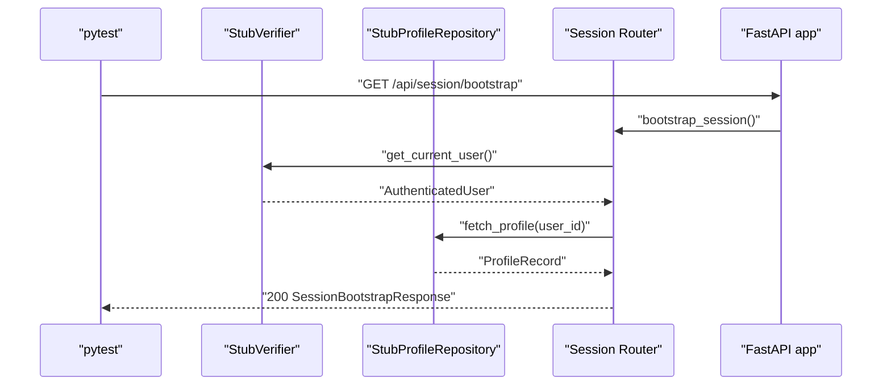

**Diagram sources**
- [backend/tests/test_session_bootstrap.py:93-109](file://backend/tests/test_session_bootstrap.py#L93-L109)
- [backend/app/api/session.py:27-44](file://backend/app/api/session.py#L27-L44)

**Section sources**
- [backend/tests/test_session_bootstrap.py:1-124](file://backend/tests/test_session_bootstrap.py#L1-L124)
- [backend/app/api/session.py:1-45](file://backend/app/api/session.py#L1-L45)

### Extension API Testing
End-to-end testing of extension token lifecycle and import flow.

- Authentication: Missing token yields 401.
- Token issue and revoke: Returns token and status transitions.
- Import: Requires extension token; missing or invalid token yields 401.
- Uses dependency overrides to inject stubs for repository and service.

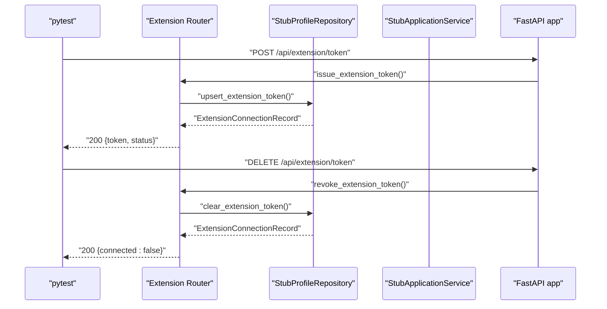

**Diagram sources**
- [backend/tests/test_extension_api.py:157-175](file://backend/tests/test_extension_api.py#L157-L175)
- [backend/app/api/extension.py:93-112](file://backend/app/api/extension.py#L93-L112)

**Section sources**
- [backend/tests/test_extension_api.py:1-204](file://backend/tests/test_extension_api.py#L1-L204)
- [backend/app/api/extension.py:1-141](file://backend/app/api/extension.py#L1-L141)

### Phase 1 Applications Workflow Testing
Validates complex business workflows for application creation, duplicate detection, manual entry, retries, and recovery.

- Fake repositories and stores isolate DB and external dependencies.
- Validates state transitions, duplicate warnings, notifications, and progress persistence.
- Tests error handling paths including queue failures and blocked sources.

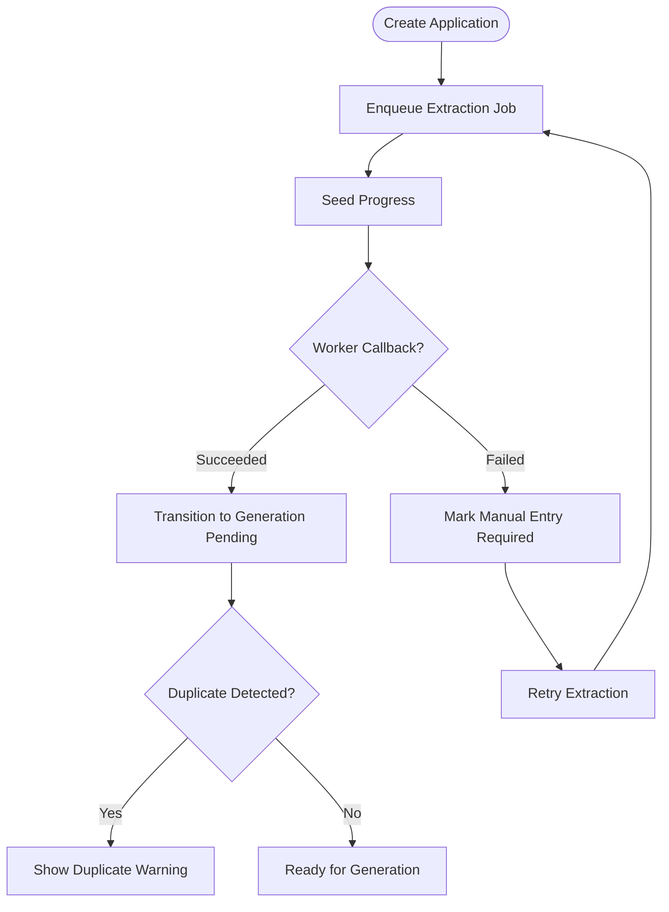

**Diagram sources**
- [backend/tests/test_phase1_applications.py:286-308](file://backend/tests/test_phase1_applications.py#L286-L308)
- [backend/tests/test_phase1_applications.py:492-528](file://backend/tests/test_phase1_applications.py#L492-L528)
- [backend/app/services/application_manager.py:183-225](file://backend/app/services/application_manager.py#L183-L225)

**Section sources**
- [backend/tests/test_phase1_applications.py:1-641](file://backend/tests/test_phase1_applications.py#L1-L641)
- [backend/app/services/application_manager.py:1-800](file://backend/app/services/application_manager.py#L1-L800)

### Workflow Contract Testing
Ensures the workflow contract defines expected statuses, internal states, failure reasons, and progress schema.

- Validates visible statuses and internal states.
- Confirms failure reasons and required fields in polling progress schema.

**Section sources**
- [backend/tests/test_workflow_contract.py:1-21](file://backend/tests/test_workflow_contract.py#L1-L21)

## Dependency Analysis
This section maps test-time dependencies and their overrides to ensure isolated and deterministic tests.

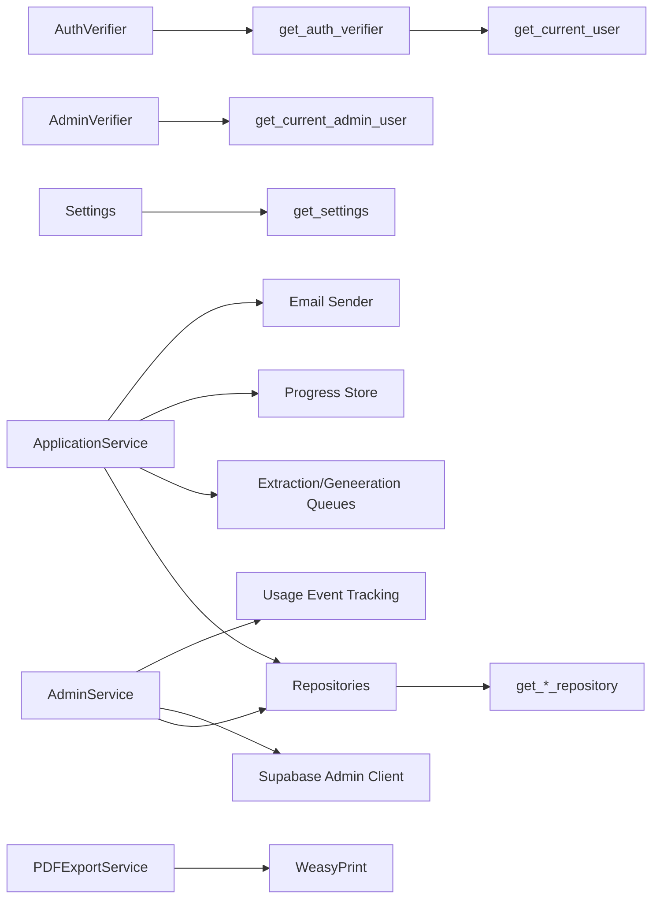

**Diagram sources**
- [backend/app/core/auth.py:67-90](file://backend/app/core/auth.py#L67-L90)
- [backend/app/core/access.py:67-90](file://backend/app/core/access.py#L67-L90)
- [backend/app/core/config.py:94-97](file://backend/app/core/config.py#L94-L97)
- [backend/app/db/applications.py:326-328](file://backend/app/db/applications.py#L326-L328)
- [backend/app/services/application_manager.py:143-168](file://backend/app/services/application_manager.py#L143-L168)
- [backend/app/services/admin.py:459-470](file://backend/app/services/admin.py#L459-L470)
- [backend/app/services/pdf_export.py:537-543](file://backend/app/services/pdf_export.py#L537-L543)

**Section sources**
- [backend/app/core/auth.py:1-90](file://backend/app/core/auth.py#L1-L90)
- [backend/app/core/access.py:1-90](file://backend/app/core/access.py#L1-L90)
- [backend/app/core/config.py:1-97](file://backend/app/core/config.py#L1-L97)
- [backend/app/db/applications.py:1-328](file://backend/app/db/applications.py#L1-L328)
- [backend/app/services/application_manager.py:1-800](file://backend/app/services/application_manager.py#L1-L800)
- [backend/app/services/admin.py:1-471](file://backend/app/services/admin.py#L1-L471)
- [backend/app/services/pdf_export.py:1-642](file://backend/app/services/pdf_export.py#L1-L642)

## Performance Considerations
- Prefer TestClient for synchronous endpoints and pytest-asyncio for async endpoints to avoid overhead.
- Use lightweight in-memory mocks for external services to reduce flakiness and speed up tests.
- Minimize database round-trips by batching operations in tests where feasible.
- Keep fixtures minimal and scoped to avoid long-lived connections.
- PDF export testing uses monkeypatched rendering to avoid actual PDF generation during tests.

**Updated** Added performance considerations for new PDF export functionality and admin service testing.

## Troubleshooting Guide
Common issues and resolutions:
- Missing bearer token or invalid token
  - Symptom: 401 responses from protected endpoints.
  - Resolution: Ensure dependency overrides inject stub verifiers and include Authorization header in requests.
- Admin permission errors
  - Symptom: 403 Forbidden when accessing admin endpoints.
  - Resolution: Verify admin user authentication and proper admin role assignment in test stubs.
- Dependency override leakage
  - Symptom: Tests interfere with each other.
  - Resolution: Use autouse fixture to restore app.dependency_overrides after each test.
- Database transaction anomalies
  - Symptom: State persists across tests.
  - Resolution: Use separate test databases or wrap tests in transactions rolled back after completion.
- Async test failures
  - Symptom: Runtime errors for async calls.
  - Resolution: Mark tests with pytest.mark.asyncio and ensure proper event loop configuration.
- PDF export timeouts
  - Symptom: PDF generation tests timing out.
  - Resolution: Verify monkeypatched rendering functions and appropriate timeout values.

**Updated** Added troubleshooting guidance for admin-specific issues, PDF export problems, and application request validation failures.

**Section sources**
- [backend/tests/test_session_bootstrap.py:65-69](file://backend/tests/test_session_bootstrap.py#L65-L69)
- [backend/tests/test_extension_api.py:142-146](file://backend/tests/test_extension_api.py#L142-L146)
- [backend/tests/test_phase1_applications.py:259-282](file://backend/tests/test_phase1_applications.py#L259-L282)
- [backend/tests/test_admin_api.py:106-114](file://backend/tests/test_admin_api.py#L106-L114)
- [backend/tests/test_pdf_export.py:14-18](file://backend/tests/test_pdf_export.py#L14-L18)

## Conclusion
The backend employs a robust testing strategy combining unit, integration, and workflow tests. Dependencies are isolated via TestClient and dependency overrides, while async operations and external services are mocked. Configuration validation and authentication behavior are explicitly covered. The addition of admin functionality, notifications system, and PDF export capabilities expands the testing scope to include security-focused validation, administrative workflows, and complex layout optimization scenarios. The provided patterns and examples enable consistent testing across endpoints, services, and complex business workflows.

**Updated** Enhanced conclusion to reflect expanded testing coverage for new admin, notifications, and PDF export components.

## Appendices

### Test Configuration and Setup
- Pytest configuration
  - Python path and test discovery configured in project settings.
- Dev dependencies
  - pytest and pytest-asyncio included for testing async endpoints.
- Environment variables
  - Use monkeypatch to set environment variables for Settings validation tests.
- Admin testing setup
  - Specialized stub verifiers and repositories for admin functionality testing.
- PDF export testing setup
  - Monkeypatched WeasyPrint rendering to avoid actual PDF generation.

**Updated** Added configuration details for new admin and PDF export testing components.

**Section sources**
- [backend/pyproject.toml:31-37](file://backend/pyproject.toml#L31-L37)
- [backend/tests/test_config.py:9-18](file://backend/tests/test_config.py#L9-L18)
- [backend/tests/test_admin_api.py:99-104](file://backend/tests/test_admin_api.py#L99-L104)
- [backend/tests/test_pdf_export.py:75-84](file://backend/tests/test_pdf_export.py#L75-L84)

### Testing Patterns Summary
- Unit testing
  - Functions: AuthVerifier, Settings validators, email sender selection, admin service logic.
  - Classes: Pydantic models and repositories with minimal dependencies.
- Integration testing
  - Endpoints: Session, Applications, Extension, Admin, Notifications routers using TestClient.
  - Dependencies: Override get_* functions to inject stubs.
- Workflow testing
  - Business logic: ApplicationService orchestrations with fake stores and repositories.
  - Error handling: Simulate queue failures, blocked sources, and permission errors.
  - Admin workflows: User management, invitation flows, and metrics collection.
  - PDF export workflows: Layout optimization and page fitting algorithms.
- Async operations
  - Use pytest-asyncio; mock external async clients with httpx.AsyncClient and MockTransport.
- Database transactions
  - Use repository methods that commit within context managers; consider test isolation strategies.
- Security and validation
  - Authentication: Verify 401 responses for missing/invalid tokens.
  - Data validation: Confirm request validators raise appropriate errors for malformed inputs.
  - Admin permissions: Verify 403 responses for non-admin users.
  - Input sanitization: Test prompt injection prevention mechanisms.
- Background tasks
  - Mock job queues and progress stores; assert enqueue calls and state transitions.
- PDF export testing
  - Use monkeypatched rendering functions to test layout algorithms without actual PDF generation.
  - Validate markdown normalization and HTML building processes.

**Updated** Expanded testing patterns to include admin-specific workflows, notifications privacy testing, and PDF export algorithm validation.