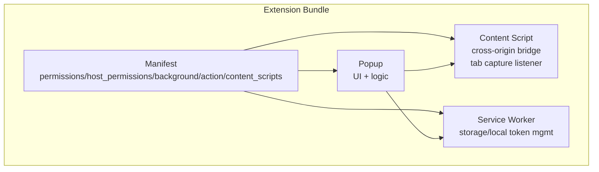
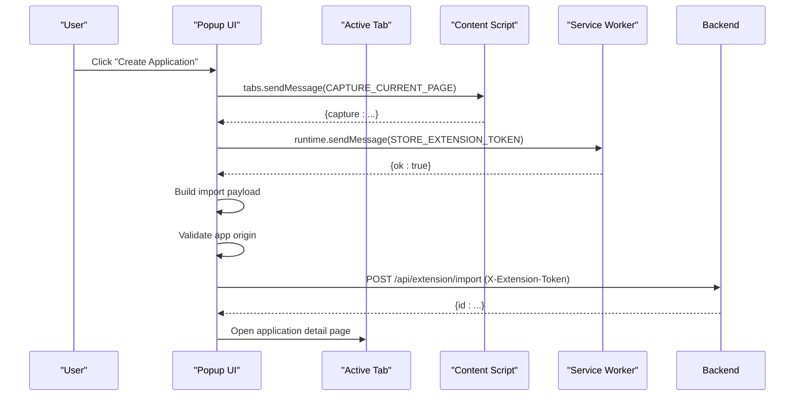
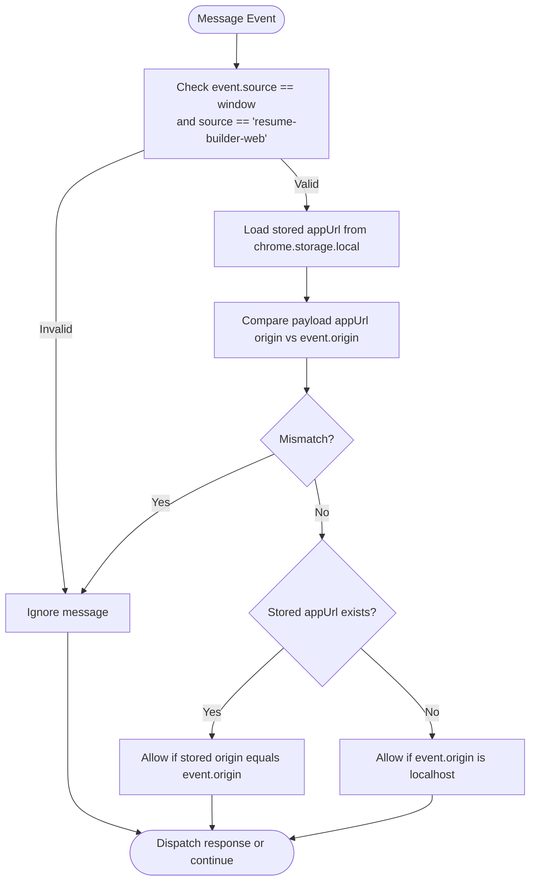
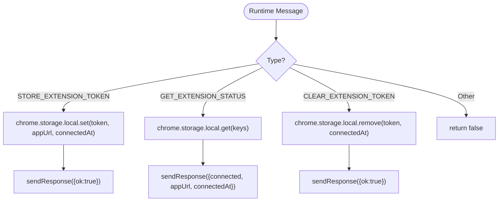
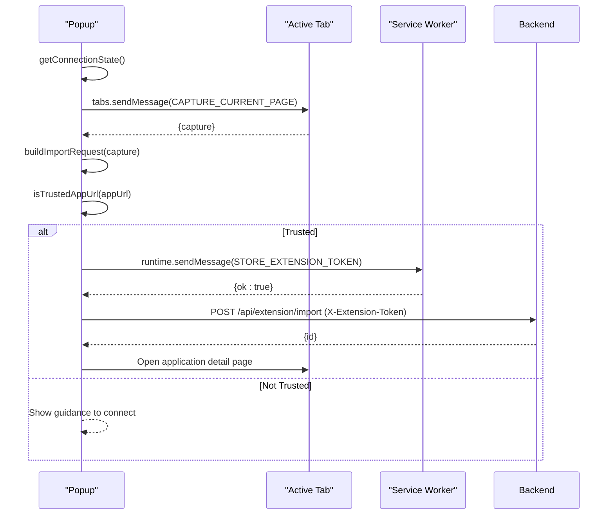
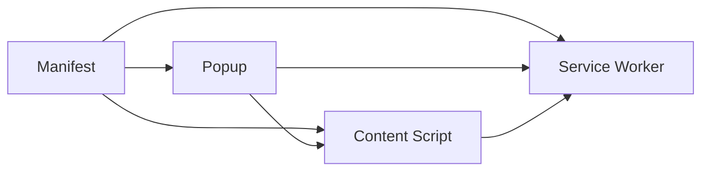

# Chrome Extension Testing

<cite>
**Referenced Files in This Document**
- [manifest.json](file://frontend/public/chrome-extension/manifest.json)
- [content-script.js](file://frontend/public/chrome-extension/content-script.js)
- [service-worker.js](file://frontend/public/chrome-extension/service-worker.js)
- [popup.js](file://frontend/public/chrome-extension/popup.js)
- [popup.html](file://frontend/public/chrome-extension/popup.html)
- [popup.css](file://frontend/public/chrome-extension/popup.css)
- [extension-bridge.test.ts](file://frontend/src/test/extension-bridge.test.ts)
- [extension-popup.test.ts](file://frontend/src/test/extension-popup.test.ts)
- [setup.ts](file://frontend/src/test/setup.ts)
- [vite.config.ts](file://frontend/vite.config.ts)
- [chrome-extension-popup.d.ts](file://frontend/src/types/chrome-extension-popup.d.ts)
</cite>

## Table of Contents
1. [Introduction](#introduction)
2. [Project Structure](#project-structure)
3. [Core Components](#core-components)
4. [Architecture Overview](#architecture-overview)
5. [Detailed Component Analysis](#detailed-component-analysis)
6. [Dependency Analysis](#dependency-analysis)
7. [Performance Considerations](#performance-considerations)
8. [Security Testing Strategies](#security-testing-strategies)
9. [Testing Utilities and Mock Strategies](#testing-utilities-and-mock-strategies)
10. [Examples of Testing Extension Functionality](#examples-of-testing-extension-functionality)
11. [Debugging Extension Tests](#debugging-extension-tests)
12. [Cross-Browser Compatibility and Lifecycle Testing](#cross-browser-compatibility-and-lifecycle-testing)
13. [Troubleshooting Guide](#troubleshooting-guide)
14. [Conclusion](#conclusion)

## Introduction
This document provides comprehensive testing guidance for the Chrome Extension MV3 implementation. It covers testing strategies for the extension bridge (content script), popup interface, content script, and service worker. It explains security testing approaches for cross-origin communication, token management, and message passing between extension components. It also documents testing patterns for browser extension lifecycle events, storage management, and background processing, along with utilities and mock strategies for browser APIs, extension permissions, and security contexts. Practical examples demonstrate tab capture, job data extraction, and user interaction handling, and the document addresses testing challenges specific to browser extensions, including sandbox environments, permission testing, and cross-browser compatibility.

## Project Structure
The Chrome extension is packaged under the public extension directory and consists of:
- Manifest v3 configuration declaring permissions, host permissions, background service worker, action popup, and content script.
- Content script implementing cross-origin message validation, tab capture request handling, and token storage coordination via the service worker.
- Service worker managing token persistence and status queries using local storage.
- Popup UI and logic for capturing the active tab, building import requests, validating app origins, and interacting with the web app backend.
- Test suites validating the bridge’s security checks and popup helper functions, configured with Vitest and jsdom.

**Diagram sources**
- [manifest.json:1-24](file://frontend/public/chrome-extension/manifest.json#L1-L24)
- [content-script.js:1-118](file://frontend/public/chrome-extension/content-script.js#L1-L118)
- [service-worker.js:1-37](file://frontend/public/chrome-extension/service-worker.js#L1-L37)
- [popup.js:1-156](file://frontend/public/chrome-extension/popup.js#L1-L156)

**Section sources**
- [manifest.json:1-24](file://frontend/public/chrome-extension/manifest.json#L1-L24)
- [popup.html:1-22](file://frontend/public/chrome-extension/popup.html#L1-L22)
- [popup.css:1-61](file://frontend/public/chrome-extension/popup.css#L1-L61)

## Core Components
- Manifest: Declares permissions (activeTab, storage, tabs), host permissions (<all_urls>), background service worker type module, default popup, and content script matches.
- Content Script: Implements cross-origin message validation, listens for CAPTURE_CURRENT_PAGE, and coordinates token storage and revocation via the service worker.
- Service Worker: Handles STORE_EXTENSION_TOKEN, GET_EXTENSION_STATUS, and CLEAR_EXTENSION_TOKEN messages, persisting tokens and app URLs in local storage.
- Popup: Queries the active tab, captures page metadata, builds import payloads, validates trusted origins, and posts to the backend with extension token headers.

**Section sources**
- [manifest.json:6-22](file://frontend/public/chrome-extension/manifest.json#L6-L22)
- [content-script.js:40-117](file://frontend/public/chrome-extension/content-script.js#L40-L117)
- [service-worker.js:1-36](file://frontend/public/chrome-extension/service-worker.js#L1-L36)
- [popup.js:35-155](file://frontend/public/chrome-extension/popup.js#L35-L155)

## Architecture Overview
The extension follows a layered MV3 architecture:
- UI layer: Popup triggers actions and displays status.
- Messaging layer: Popup communicates with the active tab via content script, which relays secure messages to the service worker.
- Storage layer: Service worker persists tokens and app URLs in local storage.
- Security layer: Cross-origin validation ensures only trusted origins can establish connections.

**Diagram sources**
- [popup.js:95-136](file://frontend/public/chrome-extension/popup.js#L95-L136)
- [content-script.js:60-74](file://frontend/public/chrome-extension/content-script.js#L60-L74)
- [service-worker.js:1-12](file://frontend/public/chrome-extension/service-worker.js#L1-L12)

## Detailed Component Analysis

### Content Script Bridge
Key responsibilities:
- Validates cross-origin messages using origin checks and stored app URL.
- Responds to CAPTURE_CURRENT_PAGE by collecting page metadata.
- Relays token storage and revocation requests to the service worker.

Security validations:
- Ensures message source matches the expected bridge origin.
- Compares payload appUrl origin against event origin and stored appUrl.
- Allows localhost origins for initial setup.

**Diagram sources**
- [content-script.js:40-58](file://frontend/public/chrome-extension/content-script.js#L40-L58)

**Section sources**
- [content-script.js:40-117](file://frontend/public/chrome-extension/content-script.js#L40-L117)

### Service Worker Token Management
Responsibilities:
- Store extension token and app URL on CONNECT.
- Retrieve connection status (connected, appUrl, connectedAt).
- Clear tokens on REVOKE.

**Diagram sources**
- [service-worker.js:1-36](file://frontend/public/chrome-extension/service-worker.js#L1-L36)

**Section sources**
- [service-worker.js:1-36](file://frontend/public/chrome-extension/service-worker.js#L1-L36)

### Popup Interaction and Import Flow
Responsibilities:
- Query active tab and request capture.
- Build import request payload from capture data.
- Validate trusted app origins before proceeding.
- Send import request to backend with extension token header.
- Open application detail page upon successful creation.

**Diagram sources**
- [popup.js:35-155](file://frontend/public/chrome-extension/popup.js#L35-L155)

**Section sources**
- [popup.js:1-156](file://frontend/public/chrome-extension/popup.js#L1-L156)

### Popup Helpers and UI
- Helper functions: buildImportRequest, normalizeAppOrigin, isTrustedAppUrl.
- UI elements: status text, capture button, open app button.
- CSS styling for panel layout and button states.

**Section sources**
- [popup.js:1-33](file://frontend/public/chrome-extension/popup.js#L1-L33)
- [popup.html:9-19](file://frontend/public/chrome-extension/popup.html#L9-L19)
- [popup.css:1-61](file://frontend/public/chrome-extension/popup.css#L1-L61)

## Dependency Analysis
- Manifest declares permissions and host permissions, enabling the extension to access active tab, storage, and all URLs.
- Content script depends on chrome.runtime and chrome.storage for messaging and persistence.
- Service worker depends on chrome.runtime and chrome.storage for message handling and local storage.
- Popup depends on chrome.tabs for tab capture, chrome.storage for connection state, and DOM APIs for UI updates.

**Diagram sources**
- [manifest.json:6-22](file://frontend/public/chrome-extension/manifest.json#L6-L22)
- [content-script.js:40-117](file://frontend/public/chrome-extension/content-script.js#L40-L117)
- [service-worker.js:1-36](file://frontend/public/chrome-extension/service-worker.js#L1-L36)
- [popup.js:35-155](file://frontend/public/chrome-extension/popup.js#L35-L155)

**Section sources**
- [manifest.json:6-22](file://frontend/public/chrome-extension/manifest.json#L6-L22)

## Performance Considerations
- Minimize DOM parsing in content script: limit meta tag collection and JSON-LD extraction to reasonable thresholds.
- Debounce or batch message handling to avoid excessive runtime overhead.
- Use efficient origin normalization and set membership checks for trusted origins.
- Keep popup computations synchronous where possible; defer network calls to background tasks.

## Security Testing Strategies
Cross-origin communication:
- Validate that messages from untrusted origins are ignored during CONNECT and STATUS requests.
- Ensure payload appUrl origin matches event.origin and stored appUrl origin.

Token management:
- Verify that STORE_EXTENSION_TOKEN stores token, appUrl, and connectedAt.
- Verify that GET_EXTENSION_STATUS returns connected state and appUrl.
- Verify that CLEAR_EXTENSION_TOKEN removes tokens and connectedAt.

Message passing:
- Confirm that runtime.sendMessage returns appropriate responses for each message type.
- Ensure that content script only dispatches EXTENSION_TOKEN_STORED after successful storage.

**Section sources**
- [content-script.js:40-117](file://frontend/public/chrome-extension/content-script.js#L40-L117)
- [service-worker.js:1-36](file://frontend/public/chrome-extension/service-worker.js#L1-L36)
- [extension-bridge.test.ts:34-95](file://frontend/src/test/extension-bridge.test.ts#L34-L95)

## Testing Utilities and Mock Strategies
Test environment:
- Vitest with jsdom environment configured in Vite.
- Global setup for DOM matchers.

Mock strategies:
- Replace chrome.runtime.sendMessage with a spy to assert calls and inject responses.
- Replace chrome.storage.local.get/set/remove with spies to simulate storage state transitions.
- Dispatch MessageEvent with controlled origin and data to validate cross-origin checks.

TypeScript declarations:
- Define module exports for popup helpers to enable type-safe imports in tests.

**Section sources**
- [vite.config.ts:18-22](file://frontend/vite.config.ts#L18-L22)
- [setup.ts:1-2](file://frontend/src/test/setup.ts#L1-L2)
- [chrome-extension-popup.d.ts:1-19](file://frontend/src/types/chrome-extension-popup.d.ts#L1-L19)
- [extension-bridge.test.ts:16-32](file://frontend/src/test/extension-bridge.test.ts#L16-L32)

## Examples of Testing Extension Functionality
- Bridge security checks:
  - Untrusted origin messages are ignored.
  - Localhost origin messages trigger token storage.
- Popup helper functions:
  - Import payload construction from capture data.
  - Origin normalization and trusted origin validation.

**Section sources**
- [extension-bridge.test.ts:34-95](file://frontend/src/test/extension-bridge.test.ts#L34-L95)
- [extension-popup.test.ts:9-30](file://frontend/src/test/extension-popup.test.ts#L9-L30)

## Debugging Extension Tests
- Use console logging within mocks to inspect received messages and arguments.
- Leverage Vitest spies to assert call counts and argument shapes.
- Validate async flows by awaiting Promise resolution between event dispatch and assertions.
- Inspect DOM updates in popup tests using jsdom utilities.

## Cross-Browser Compatibility and Lifecycle Testing
- Permissions and host permissions: ensure activeTab, storage, tabs, and <all_urls> are declared and tested across browsers.
- Service worker lifecycle: verify message handlers remain responsive after extension reloads.
- Content script injection: confirm run_at timing and injection across different page loads.
- Storage migration: test persistence across extension updates.

## Troubleshooting Guide
Common issues and resolutions:
- Messages ignored due to origin mismatch: verify event.origin and stored appUrl alignment.
- Storage failures: mock chrome.storage.local methods to simulate errors and assert fallback behavior.
- Popup disabled states: ensure trusted origin checks enable/disable buttons appropriately.
- Network errors: simulate backend 401 to test token expiration cleanup and user messaging.

**Section sources**
- [popup.js:118-135](file://frontend/public/chrome-extension/popup.js#L118-L135)
- [service-worker.js:27-33](file://frontend/public/chrome-extension/service-worker.js#L27-L33)

## Conclusion
The Chrome extension MV3 implementation includes a secure bridge between the content script and service worker, robust popup interactions, and clear separation of concerns. The existing test suite demonstrates effective mocking of browser APIs and validation of security checks. Extending tests to cover lifecycle events, storage management, and cross-browser scenarios will further improve reliability and maintainability across different browser versions.