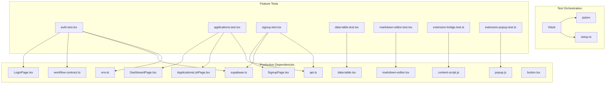
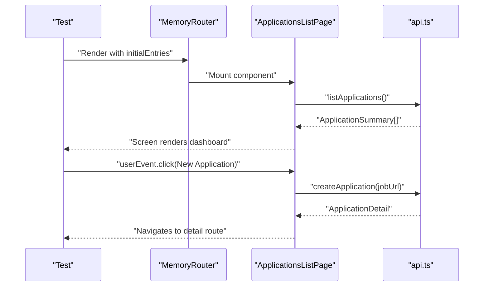
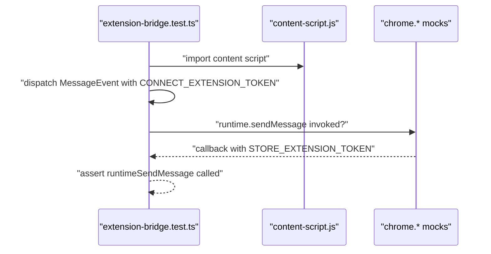
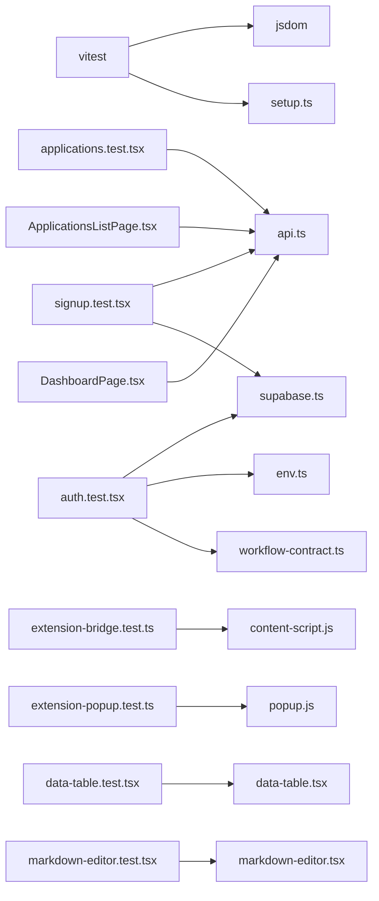

# Frontend Testing

<cite>
**Referenced Files in This Document**
- [package.json](file://frontend/package.json)
- [vite.config.ts](file://frontend/vite.config.ts)
- [setup.ts](file://frontend/src/test/setup.ts)
- [applications.test.tsx](file://frontend/src/test/applications.test.tsx)
- [auth.test.tsx](file://frontend/src/test/auth.test.tsx)
- [signup.test.tsx](file://frontend/src/test/signup.test.tsx)
- [extension-bridge.test.ts](file://frontend/src/test/extension-bridge.test.ts)
- [extension-popup.test.ts](file://frontend/src/test/extension-popup.test.ts)
- [data-table.test.tsx](file://frontend/src/test/data-table.test.tsx)
- [markdown-editor.test.tsx](file://frontend/src/test/markdown-editor.test.tsx)
- [chrome-extension-test-helpers.ts](file://frontend/src/test/chrome-extension-test-helpers.ts)
- [api.ts](file://frontend/src/lib/api.ts)
- [supabase.ts](file://frontend/src/lib/supabase.ts)
- [env.ts](file://frontend/src/lib/env.ts)
- [workflow-contract.ts](file://frontend/src/lib/workflow-contract.ts)
- [LoginPage.tsx](file://frontend/src/routes/LoginPage.tsx)
- [ApplicationsListPage.tsx](file://frontend/src/routes/ApplicationsListPage.tsx)
- [DashboardPage.tsx](file://frontend/src/routes/DashboardPage.tsx)
- [SignupPage.tsx](file://frontend/src/routes/SignupPage.tsx)
- [content-script.js](file://frontend/public/chrome-extension/content-script.js)
- [popup.js](file://frontend/public/chrome-extension/popup.js)
- [data-table.tsx](file://frontend/src/components/ui/data-table.tsx)
- [markdown-editor.tsx](file://frontend/src/components/ui/markdown-editor.tsx)
- [button.tsx](file://frontend/src/components/ui/button.tsx)
</cite>

## Update Summary
**Changes Made**
- Added comprehensive testing documentation for new UI component tests: data-table.test.tsx and markdown-editor.test.tsx
- Enhanced application and authentication testing documentation with expanded coverage
- Updated component testing patterns to include advanced UI components
- Added detailed testing strategies for complex interactions and edge cases
- Expanded integration testing patterns for enhanced application workflows

## Table of Contents
1. [Introduction](#introduction)
2. [Project Structure](#project-structure)
3. [Core Components](#core-components)
4. [Architecture Overview](#architecture-overview)
5. [Detailed Component Analysis](#detailed-component-analysis)
6. [Dependency Analysis](#dependency-analysis)
7. [Performance Considerations](#performance-considerations)
8. [Troubleshooting Guide](#troubleshooting-guide)
9. [Conclusion](#conclusion)
10. [Appendices](#appendices)

## Introduction
This document provides comprehensive frontend testing guidance for the React application. It covers the testing setup using Vitest and React Testing Library, test environment configuration, and patterns for component, integration, and cross-context testing. The testing suite now includes extensive coverage for UI components, enhanced application workflows, and sophisticated authentication flows. It documents mocking strategies for API calls, authentication, and browser extension integrations, along with best practices for organizing tests, naming conventions, and maintaining reliability. Debugging strategies and performance considerations for test execution are included.

## Project Structure
The frontend testing setup is organized under the frontend directory with:
- Test runner and environment configured via Vite and Vitest
- React Testing Library utilities and DOM assertions
- Test files grouped by feature or domain (e.g., applications, auth, UI components, extension)
- Shared test setup for global environment and DOM matchers
- Comprehensive UI component testing for data tables and markdown editors

```mermaid
graph TB
subgraph "Testing Tools"
vitest["Vitest Runner"]
rtl["@testing-library/react"]
userEvent["@testing-library/user-event"]
jsdom["jsdom Environment"]
end
subgraph "Test Files"
appsTest["applications.test.tsx"]
authTest["auth.test.tsx"]
signupTest["signup.test.tsx"]
dataTableTest["data-table.test.tsx"]
markdownEditorTest["markdown-editor.test.tsx"]
extBridgeTest["extension-bridge.test.ts"]
extPopupTest["extension-popup.test.ts"]
setupFile["setup.ts"]
end
subgraph "Application Code Under Test"
apiLib["api.ts"]
supabaseLib["supabase.ts"]
envLib["env.ts"]
workflowContract["workflow-contract.ts"]
loginPage["LoginPage.tsx"]
appsListPage["ApplicationsListPage.tsx"]
dashboardPage["DashboardPage.tsx"]
signupPage["SignupPage.tsx"]
contentScript["content-script.js"]
popupJS["popup.js"]
dataTable["data-table.tsx"]
markdownEditor["markdown-editor.tsx"]
buttonComp["button.tsx"]
end
vitest --> jsdom
vitest --> rtl
vitest --> userEvent
vitest --> appsTest
vitest --> authTest
vitest --> signupTest
vitest --> dataTableTest
vitest --> markdownEditorTest
vitest --> extBridgeTest
vitest --> extPopupTest
appsTest --> apiLib
authTest --> supabaseLib
authTest --> envLib
authTest --> workflowContract
appsTest --> loginPage
appsTest --> appsListPage
appsTest --> dashboardPage
signupTest --> signupPage
extBridgeTest --> contentScript
extPopupTest --> popupJS
dataTableTest --> dataTable
markdownEditorTest --> markdownEditor
setupFile --> vitest
```

**Diagram sources**
- [vite.config.ts:18-22](file://frontend/vite.config.ts#L18-L22)
- [setup.ts:1-2](file://frontend/src/test/setup.ts#L1-L2)
- [applications.test.tsx:1-800](file://frontend/src/test/applications.test.tsx#L1-L800)
- [auth.test.tsx:1-50](file://frontend/src/test/auth.test.tsx#L1-L50)
- [signup.test.tsx:1-105](file://frontend/src/test/signup.test.tsx#L1-L105)
- [data-table.test.tsx:1-140](file://frontend/src/test/data-table.test.tsx#L1-L140)
- [markdown-editor.test.tsx:1-50](file://frontend/src/test/markdown-editor.test.tsx#L1-L50)
- [extension-bridge.test.ts:1-99](file://frontend/src/test/extension-bridge.test.ts#L1-L99)
- [extension-popup.test.ts:1-38](file://frontend/src/test/extension-popup.test.ts#L1-L38)
- [api.ts:1-489](file://frontend/src/lib/api.ts#L1-L489)
- [supabase.ts:1-26](file://frontend/src/lib/supabase.ts#L1-L26)
- [env.ts:1-15](file://frontend/src/lib/env.ts#L1-L15)
- [workflow-contract.ts:1-200](file://frontend/src/lib/workflow-contract.ts#L1-L200)
- [LoginPage.tsx:1-111](file://frontend/src/routes/LoginPage.tsx#L1-L111)
- [ApplicationsListPage.tsx:1-264](file://frontend/src/routes/ApplicationsListPage.tsx#L1-L264)
- [DashboardPage.tsx:1-300](file://frontend/src/routes/DashboardPage.tsx#L1-L300)
- [SignupPage.tsx:1-150](file://frontend/src/routes/SignupPage.tsx#L1-L150)
- [content-script.js:1-118](file://frontend/public/chrome-extension/content-script.js#L1-L118)
- [popup.js:1-156](file://frontend/public/chrome-extension/popup.js#L1-L156)
- [data-table.tsx:1-277](file://frontend/src/components/ui/data-table.tsx#L1-L277)
- [markdown-editor.tsx:1-66](file://frontend/src/components/ui/markdown-editor.tsx#L1-L66)
- [button.tsx:1-71](file://frontend/src/components/ui/button.tsx#L1-L71)

**Section sources**
- [package.json:10-11](file://frontend/package.json#L10-L11)
- [vite.config.ts:18-22](file://frontend/vite.config.ts#L18-L22)
- [setup.ts:1-2](file://frontend/src/test/setup.ts#L1-L2)

## Core Components
- Test runner and environment
  - Vitest runs tests with jsdom as the DOM environment and enables global matchers via setup.ts.
  - Scripts for running tests in CI or locally are defined in package.json.
- React Testing Library
  - Render components, query DOM nodes, and simulate user interactions using user events.
- Mocking strategy
  - Hoisted mocks for API modules isolate tests from network calls.
  - Browser APIs (e.g., chrome.*) are mocked by defining global properties per test suite.
  - Comprehensive mocking for Supabase authentication and workflow contracts.

Key testing utilities and helpers:
- Global setup: jest-dom matchers for accessibility and semantic assertions.
- Feature-specific mocks: environment variables, Supabase client behavior, workflow contracts, and extension bridge globals.
- Advanced UI component testing utilities for complex interactions.

**Section sources**
- [package.json:10-11](file://frontend/package.json#L10-L11)
- [vite.config.ts:18-22](file://frontend/vite.config.ts#L18-L22)
- [setup.ts:1-2](file://frontend/src/test/setup.ts#L1-L2)
- [applications.test.tsx:20-56](file://frontend/src/test/applications.test.tsx#L20-L56)
- [auth.test.tsx:8-16](file://frontend/src/test/auth.test.tsx#L8-L16)
- [signup.test.tsx:7-24](file://frontend/src/test/signup.test.tsx#L7-L24)

## Architecture Overview
The testing architecture separates concerns across:
- Unit-like tests for pure logic and small utilities
- Component tests for UI rendering and user interactions
- Cross-context tests for browser extension bridges and popup helpers
- Integration tests for route-driven flows and API interactions
- Advanced UI component testing for complex data visualization and editing interfaces

**Diagram sources**
- [vite.config.ts:18-22](file://frontend/vite.config.ts#L18-L22)
- [setup.ts:1-2](file://frontend/src/test/setup.ts#L1-L2)
- [auth.test.tsx:1-50](file://frontend/src/test/auth.test.tsx#L1-L50)
- [applications.test.tsx:1-800](file://frontend/src/test/applications.test.tsx#L1-L800)
- [signup.test.tsx:1-105](file://frontend/src/test/signup.test.tsx#L1-L105)
- [data-table.test.tsx:1-140](file://frontend/src/test/data-table.test.tsx#L1-L140)
- [markdown-editor.test.tsx:1-50](file://frontend/src/test/markdown-editor.test.tsx#L1-L50)
- [extension-bridge.test.ts:1-99](file://frontend/src/test/extension-bridge.test.ts#L1-L99)
- [extension-popup.test.ts:1-38](file://frontend/src/test/extension-popup.test.ts#L1-L38)
- [env.ts:1-15](file://frontend/src/lib/env.ts#L1-L15)
- [supabase.ts:1-26](file://frontend/src/lib/supabase.ts#L1-L26)
- [api.ts:1-489](file://frontend/src/lib/api.ts#L1-L489)
- [workflow-contract.ts:1-200](file://frontend/src/lib/workflow-contract.ts#L1-L200)
- [LoginPage.tsx:1-111](file://frontend/src/routes/LoginPage.tsx#L1-L111)
- [ApplicationsListPage.tsx:1-264](file://frontend/src/routes/ApplicationsListPage.tsx#L1-L264)
- [DashboardPage.tsx:1-300](file://frontend/src/routes/DashboardPage.tsx#L1-L300)
- [SignupPage.tsx:1-150](file://frontend/src/routes/SignupPage.tsx#L1-L150)
- [content-script.js:1-118](file://frontend/public/chrome-extension/content-script.js#L1-L118)
- [popup.js:1-156](file://frontend/public/chrome-extension/popup.js#L1-L156)
- [data-table.tsx:1-277](file://frontend/src/components/ui/data-table.tsx#L1-L277)
- [markdown-editor.tsx:1-66](file://frontend/src/components/ui/markdown-editor.tsx#L1-L66)
- [button.tsx:1-71](file://frontend/src/components/ui/button.tsx#L1-L71)

## Detailed Component Analysis

### React Testing Library Configuration and Test Environment
- Vitest configuration sets jsdom as the test environment, enabling DOM APIs in tests.
- Global matchers are registered via setup.ts to support accessibility and semantic assertions.
- Scripts for running tests in watch and run modes are defined in package.json.

Best practices:
- Keep setup minimal and deterministic.
- Use beforeEach to reset mocks and module state when needed.
- Leverage hoisted mocks for consistent API testing across multiple test files.

**Section sources**
- [vite.config.ts:18-22](file://frontend/vite.config.ts#L18-L22)
- [setup.ts:1-2](file://frontend/src/test/setup.ts#L1-L2)
- [package.json:10-11](file://frontend/package.json#L10-L11)

### Component Testing Patterns: Individual Components
- LoginPage
  - Renders sign-in form with invite-only workspace access.
  - Uses Supabase client for authentication and navigates on success.
  - Tests assert presence of headings, buttons, and session storage behavior.
  - Validates workflow contract loading and environment variable usage.

- ApplicationsListPage and DashboardPage
  - Comprehensive testing of application listing, filtering, and bulk operations.
  - Validates complex UI states including notifications, loading states, and error conditions.
  - Tests routing, navigation, and state management across multiple application workflows.
  - Includes extensive coverage of bulk actions, status updates, and workflow transitions.

- SignupPage
  - Tests invite-based registration flow with password validation.
  - Validates client-side form validation and server-side integration.
  - Ensures proper authentication flow after successful registration.

Patterns:
- Use MemoryRouter for route-based tests.
- Mock API functions with hoisted vi.fn() and restore between tests.
- Assert rendered text and roles using screen queries.
- Test complex user workflows with multiple steps and conditional logic.

**Section sources**
- [auth.test.tsx:18-49](file://frontend/src/test/auth.test.tsx#L18-L49)
- [applications.test.tsx:151-800](file://frontend/src/test/applications.test.tsx#L151-L800)
- [signup.test.tsx:37-105](file://frontend/src/test/signup.test.tsx#L37-L105)
- [LoginPage.tsx:10-36](file://frontend/src/routes/LoginPage.tsx#L10-L36)
- [ApplicationsListPage.tsx:16-96](file://frontend/src/routes/ApplicationsListPage.tsx#L16-L96)
- [DashboardPage.tsx:1-300](file://frontend/src/routes/DashboardPage.tsx#L1-L300)
- [SignupPage.tsx:1-150](file://frontend/src/routes/SignupPage.tsx#L1-L150)

### Advanced UI Component Testing: Data Tables and Editors
- DataTable Component
  - Comprehensive testing of pagination, sorting, filtering, and row selection.
  - Validates complex state management including page clamping and data synchronization.
  - Tests custom event handling through onVisibleRowsChange callbacks.
  - Includes edge case testing for empty states, large datasets, and dynamic column configurations.

- MarkdownEditor Component
  - Tests syntax highlighting for markdown headers and body content.
  - Validates textarea change events and value propagation.
  - Ensures proper scrolling synchronization between editor and highlight layers.
  - Tests placeholder rendering and content-aware line highlighting.

Patterns:
- Use custom test utilities for complex DOM queries and state assertions.
- Test both user interactions and programmatic state changes.
- Validate accessibility attributes and keyboard navigation support.
- Test performance characteristics with large datasets and complex rendering.

**Section sources**
- [data-table.test.tsx:56-140](file://frontend/src/test/data-table.test.tsx#L56-L140)
- [markdown-editor.test.tsx:6-50](file://frontend/src/test/markdown-editor.test.tsx#L6-L50)
- [data-table.tsx:28-277](file://frontend/src/components/ui/data-table.tsx#L28-L277)
- [markdown-editor.tsx:15-66](file://frontend/src/components/ui/markdown-editor.tsx#L15-L66)

### Integration Testing: Component Interactions and Routing
- Route-driven flows:
  - MemoryRouter wraps pages to simulate navigation with complex nested routes.
  - Tests assert that clicking various UI elements navigates to appropriate detail pages.
  - Validates breadcrumb navigation and route parameter handling.
- Controlled interactions:
  - userEvent is used to simulate typing, selecting options, and clicking buttons.
  - Asynchronous UI updates are awaited using findBy* queries and waitFor.
  - Complex workflows involving multiple API calls and state transitions are thoroughly tested.

**Diagram sources**
- [applications.test.tsx:235-256](file://frontend/src/test/applications.test.tsx#L235-L256)
- [ApplicationsListPage.tsx:46-59](file://frontend/src/routes/ApplicationsListPage.tsx#L46-L59)
- [api.ts:244-253](file://frontend/src/lib/api.ts#L244-L253)

**Section sources**
- [applications.test.tsx:235-256](file://frontend/src/test/applications.test.tsx#L235-L256)
- [applications.test.tsx:477-503](file://frontend/src/test/applications.test.tsx#L477-L503)
- [ApplicationsListPage.tsx:46-59](file://frontend/src/routes/ApplicationsListPage.tsx#L46-L59)

### End-to-End Style Testing: Cross-Context Interactions
- Chrome extension bridge
  - Tests simulate message passing between the web app and extension with origin validation.
  - Mock chrome.* APIs globally and dispatch MessageEvent to validate trust checks and token storage.
  - Tests cover both trusted and untrusted origin scenarios with appropriate security measures.
- Extension popup helpers
  - Tests validate payload construction and origin validation for local development.
  - Ensures proper normalization of application URLs and trusted origin checking.

**Diagram sources**
- [extension-bridge.test.ts:36-97](file://frontend/src/test/extension-bridge.test.ts#L36-L97)
- [content-script.js:76-117](file://frontend/public/chrome-extension/content-script.js#L76-L117)

**Section sources**
- [extension-bridge.test.ts:1-99](file://frontend/src/test/extension-bridge.test.ts#L1-L99)
- [extension-popup.test.ts:1-38](file://frontend/src/test/extension-popup.test.ts#L1-L38)
- [chrome-extension-test-helpers.ts:1-40](file://frontend/src/test/chrome-extension-test-helpers.ts#L1-L40)
- [content-script.js:1-118](file://frontend/public/chrome-extension/content-script.js#L1-L118)
- [popup.js:1-156](file://frontend/public/chrome-extension/popup.js#L1-L156)

### Mock Strategies: API Calls, Authentication, and External Dependencies
- API mocking
  - Hoist a mock object and vi.mock("@/lib/api", () => api) to replace all imports.
  - Reset mocks per test to avoid cross-test interference.
  - Comprehensive API coverage including all application workflows and error scenarios.
- Authentication and environment
  - Mock environment variables for test runs with proper type safety.
  - Verify Supabase session storage behavior (sessionStorage vs localStorage).
  - Test workflow contract loading and validation.
- Browser APIs
  - Define global chrome object with mocked runtime and storage APIs per test suite.
  - Test both development and production origin validation scenarios.

**Diagram sources**
- [applications.test.tsx:20-56](file://frontend/src/test/applications.test.tsx#L20-L56)
- [auth.test.tsx:8-16](file://frontend/src/test/auth.test.tsx#L8-L16)
- [signup.test.tsx:7-24](file://frontend/src/test/signup.test.tsx#L7-L24)
- [extension-bridge.test.ts:18-34](file://frontend/src/test/extension-bridge.test.ts#L18-L34)

**Section sources**
- [applications.test.tsx:20-56](file://frontend/src/test/applications.test.tsx#L20-L56)
- [auth.test.tsx:8-16](file://frontend/src/test/auth.test.tsx#L8-L16)
- [auth.test.tsx:36-39](file://frontend/src/test/auth.test.tsx#L36-L39)
- [signup.test.tsx:7-24](file://frontend/src/test/signup.test.tsx#L7-L24)
- [extension-bridge.test.ts:18-34](file://frontend/src/test/extension-bridge.test.ts#L18-L34)

### Testing Utilities and Helper Functions
- Global setup
  - Import jest-dom matchers in setup.ts to enable semantic assertions and accessibility testing.
- Feature-specific helpers
  - Environment parsing ensures typed access to Vite environment variables.
  - Supabase client configuration centralizes auth storage behavior.
  - Chrome extension test helpers provide reusable functionality for extension testing.
  - Custom test utilities for complex UI interactions and state assertions.

**Section sources**
- [setup.ts:1-2](file://frontend/src/test/setup.ts#L1-L2)
- [env.ts:1-15](file://frontend/src/lib/env.ts#L1-L15)
- [supabase.ts:4-11](file://frontend/src/lib/supabase.ts#L4-L11)
- [chrome-extension-test-helpers.ts:19-40](file://frontend/src/test/chrome-extension-test-helpers.ts#L19-L40)

### Examples: Hooks, Custom Components, and Complex UI Interactions
- Custom components
  - StatusBadge and UI primitives are used within pages; tests assert presence and state.
  - Button component testing validates variant styling, size variations, and loading states.
  - Advanced UI components like DataTable and MarkdownEditor require specialized testing approaches.
- Complex interactions
  - Conditional UI reveals (e.g., "other source" input) require selecting dropdown options and asserting multiple inputs.
  - Bulk operations on application lists test selection logic and API integration.
  - Duplicate review and blocked-source recovery surfaces rely on detailed API responses and state transitions.
  - Pagination and sorting interactions require careful state management testing.

**Section sources**
- [applications.test.tsx:477-610](file://frontend/src/test/applications.test.tsx#L477-L610)
- [applications.test.tsx:612-643](file://frontend/src/test/applications.test.tsx#L612-L643)
- [data-table.test.tsx:56-140](file://frontend/src/test/data-table.test.tsx#L56-L140)
- [markdown-editor.test.tsx:6-50](file://frontend/src/test/markdown-editor.test.tsx#L6-L50)
- [button.tsx:10-71](file://frontend/src/components/ui/button.tsx#L10-L71)

### Best Practices: State Management, Routing, and Form Handling
- State management
  - Prefer deterministic state updates and revert on errors (as seen in applied toggle).
  - Test complex state transitions in multi-step workflows.
  - Validate that UI state reflects API responses and user interactions.
- Routing
  - Use MemoryRouter for isolated route tests; ensure navigation targets are reachable.
  - Test route parameters, query strings, and nested routing scenarios.
- Forms
  - Validate submission handlers and error rendering; disable controls during async operations.
  - Test client-side validation and server-side error handling.
  - Ensure proper form cleanup and state reset between tests.

**Section sources**
- [applications.test.tsx:505-543](file://frontend/src/test/applications.test.tsx#L505-L543)
- [applications.test.tsx:235-280](file://frontend/src/test/applications.test.tsx#L235-L280)
- [auth.test.tsx:36-48](file://frontend/src/test/auth.test.tsx#L36-L48)
- [signup.test.tsx:38-59](file://frontend/src/test/signup.test.tsx#L38-L59)

### Test Organization, Naming Conventions, and Reliability
- Organization
  - Group tests by feature (e.g., applications, auth, UI components, extension).
  - Place setup files under src/test and keep them minimal.
  - Separate unit tests from integration tests and end-to-end style tests.
- Naming
  - Use descriptive filenames ending with .test.tsx and concise describe/it blocks.
  - Follow BDD-style test descriptions that read like specifications.
- Reliability
  - Reset mocks and module state between tests.
  - Prefer findBy* queries for asynchronous UI updates.
  - Use hoisted mocks for consistent API testing across multiple test files.
  - Implement proper cleanup for global mocks and test utilities.

**Section sources**
- [applications.test.tsx:27-29](file://frontend/src/test/applications.test.tsx#L27-L29)
- [auth.test.tsx:18-28](file://frontend/src/test/auth.test.tsx#L18-L28)
- [data-table.test.tsx:56-57](file://frontend/src/test/data-table.test.tsx#L56-L57)
- [markdown-editor.test.tsx:6-7](file://frontend/src/test/markdown-editor.test.tsx#L6-L7)

## Dependency Analysis
Testing dependencies and their relationships:
- Vitest depends on jsdom for DOM simulation and setup.ts for global matchers.
- Feature tests depend on production modules (api.ts, supabase.ts, env.ts, workflow-contract.ts) via mocks.
- Extension tests depend on public JavaScript bundles and browser APIs.
- UI component tests depend on custom components with complex rendering logic.
- Advanced testing utilities provide reusable functionality across multiple test suites.

**Diagram sources**
- [vite.config.ts:18-22](file://frontend/vite.config.ts#L18-L22)
- [setup.ts:1-2](file://frontend/src/test/setup.ts#L1-L2)
- [applications.test.tsx:1-800](file://frontend/src/test/applications.test.tsx#L1-L800)
- [auth.test.tsx:1-50](file://frontend/src/test/auth.test.tsx#L1-L50)
- [signup.test.tsx:1-105](file://frontend/src/test/signup.test.tsx#L1-L105)
- [extension-bridge.test.ts:1-99](file://frontend/src/test/extension-bridge.test.ts#L1-L99)
- [extension-popup.test.ts:1-38](file://frontend/src/test/extension-popup.test.ts#L1-L38)
- [data-table.test.tsx:1-140](file://frontend/src/test/data-table.test.tsx#L1-L140)
- [markdown-editor.test.tsx:1-50](file://frontend/src/test/markdown-editor.test.tsx#L1-L50)
- [api.ts:1-489](file://frontend/src/lib/api.ts#L1-L489)
- [supabase.ts:1-26](file://frontend/src/lib/supabase.ts#L1-L26)
- [env.ts:1-15](file://frontend/src/lib/env.ts#L1-L15)
- [workflow-contract.ts:1-200](file://frontend/src/lib/workflow-contract.ts#L1-L200)
- [ApplicationsListPage.tsx:1-264](file://frontend/src/routes/ApplicationsListPage.tsx#L1-L264)
- [DashboardPage.tsx:1-300](file://frontend/src/routes/DashboardPage.tsx#L1-L300)
- [SignupPage.tsx:1-150](file://frontend/src/routes/SignupPage.tsx#L1-L150)
- [content-script.js:1-118](file://frontend/public/chrome-extension/content-script.js#L1-L118)
- [popup.js:1-156](file://frontend/public/chrome-extension/popup.js#L1-L156)
- [data-table.tsx:1-277](file://frontend/src/components/ui/data-table.tsx#L1-L277)
- [markdown-editor.tsx:1-66](file://frontend/src/components/ui/markdown-editor.tsx#L1-L66)

**Section sources**
- [vite.config.ts:18-22](file://frontend/vite.config.ts#L18-L22)
- [applications.test.tsx:1-800](file://frontend/src/test/applications.test.tsx#L1-L800)
- [auth.test.tsx:1-50](file://frontend/src/test/auth.test.tsx#L1-L50)
- [signup.test.tsx:1-105](file://frontend/src/test/signup.test.tsx#L1-L105)
- [extension-bridge.test.ts:1-99](file://frontend/src/test/extension-bridge.test.ts#L1-L99)
- [extension-popup.test.ts:1-38](file://frontend/src/test/extension-popup.test.ts#L1-L38)
- [data-table.test.tsx:1-140](file://frontend/src/test/data-table.test.tsx#L1-L140)
- [markdown-editor.test.tsx:1-50](file://frontend/src/test/markdown-editor.test.tsx#L1-L50)

## Performance Considerations
- Use hoisted mocks to avoid repeated module instantiation and improve test performance.
- Limit DOM queries and focus on targeted assertions to reduce flakiness and improve speed.
- Prefer userEvent over direct DOM manipulation for realistic interactions that are easier to debug.
- Keep tests focused on single responsibilities to improve maintainability and speed.
- Use waitFor and findBy queries judiciously to avoid unnecessary delays in test execution.
- Test component rendering performance with large datasets using synthetic data generators.
- Implement proper cleanup of global mocks and test utilities to prevent memory leaks.

## Troubleshooting Guide
Common issues and resolutions:
- Missing DOM matchers
  - Ensure setup.ts is loaded by Vitest configuration and contains proper jest-dom imports.
- Unstable async UI
  - Use findBy* queries and waitFor for asynchronous updates with appropriate timeouts.
  - Test complex state transitions with multiple async operations carefully.
- Module mocking not applied
  - Confirm vi.mock is declared before imports and mocks are reset between tests.
  - Use hoisted mocks for consistent API testing across multiple test files.
- Extension bridge failures
  - Verify global chrome mocks are defined before importing content script and that origins match expectations.
  - Test both trusted and untrusted origin scenarios to ensure proper security validation.
- UI component rendering issues
  - Test complex rendering logic with DataTable and MarkdownEditor components separately.
  - Validate accessibility attributes and keyboard navigation support in advanced components.
- State management problems
  - Ensure proper cleanup of component state between tests.
  - Test complex state transitions in multi-step workflows with proper isolation.

**Section sources**
- [setup.ts:1-2](file://frontend/src/test/setup.ts#L1-L2)
- [applications.test.tsx:27-29](file://frontend/src/test/applications.test.tsx#L27-L29)
- [extension-bridge.test.ts:18-34](file://frontend/src/test/extension-bridge.test.ts#L18-L34)
- [data-table.test.tsx:56-57](file://frontend/src/test/data-table.test.tsx#L56-L57)
- [markdown-editor.test.tsx:6-7](file://frontend/src/test/markdown-editor.test.tsx#L6-L7)

## Conclusion
The frontend testing setup leverages Vitest and React Testing Library with jsdom to provide a robust environment for component, integration, and cross-context testing. The expanded test suite now includes comprehensive coverage for advanced UI components, enhanced application workflows, and sophisticated authentication flows. By adopting hoisted mocks, controlled browser API simulations, and disciplined test organization, the suite remains reliable and maintainable. Following the outlined patterns and best practices ensures consistent coverage across UI interactions, routing, authentication, extension integrations, and complex data visualization components.

## Appendices
- Running tests
  - Use the test scripts defined in package.json for run/watch modes.
  - Test individual components or suites using Vitest CLI options.
- Adding new tests
  - Place test files under src/test with descriptive names following BDD patterns.
  - Import and configure mocks at the top of the file; reset state in beforeEach.
  - Use hoisted mocks for API testing to ensure consistency across test files.
  - Leverage existing test utilities and helpers for common testing patterns.

**Section sources**
- [package.json:10-11](file://frontend/package.json#L10-L11)
- [data-table.test.tsx:56-57](file://frontend/src/test/data-table.test.tsx#L56-L57)
- [markdown-editor.test.tsx:6-7](file://frontend/src/test/markdown-editor.test.tsx#L6-L7)