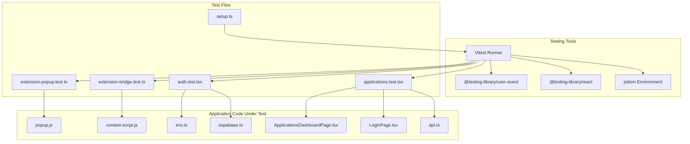
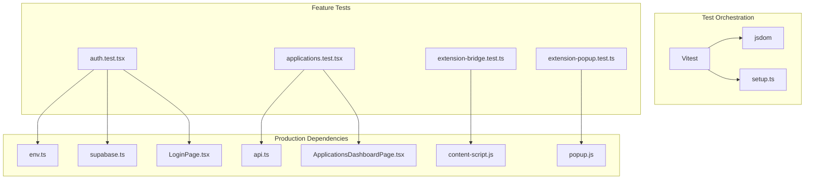
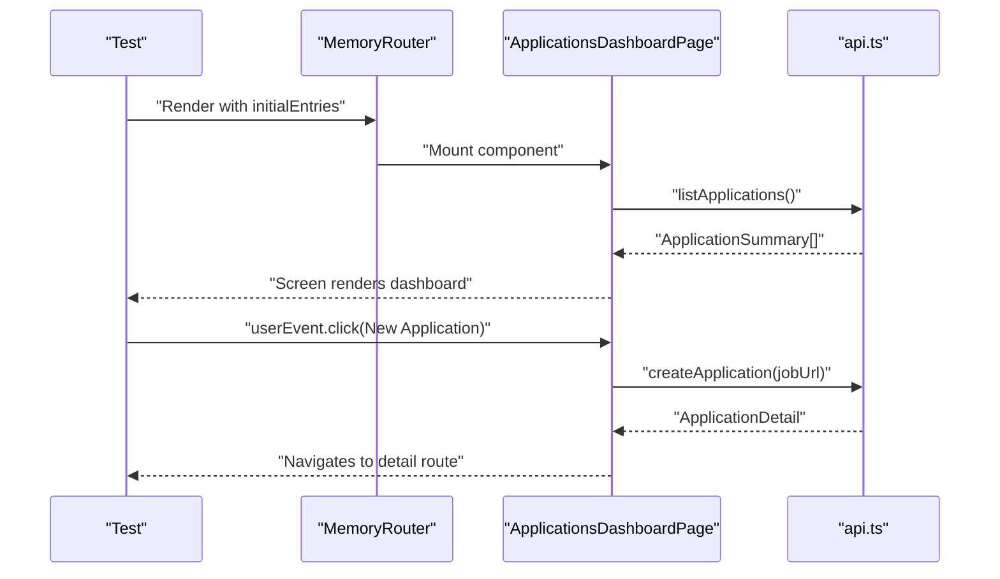
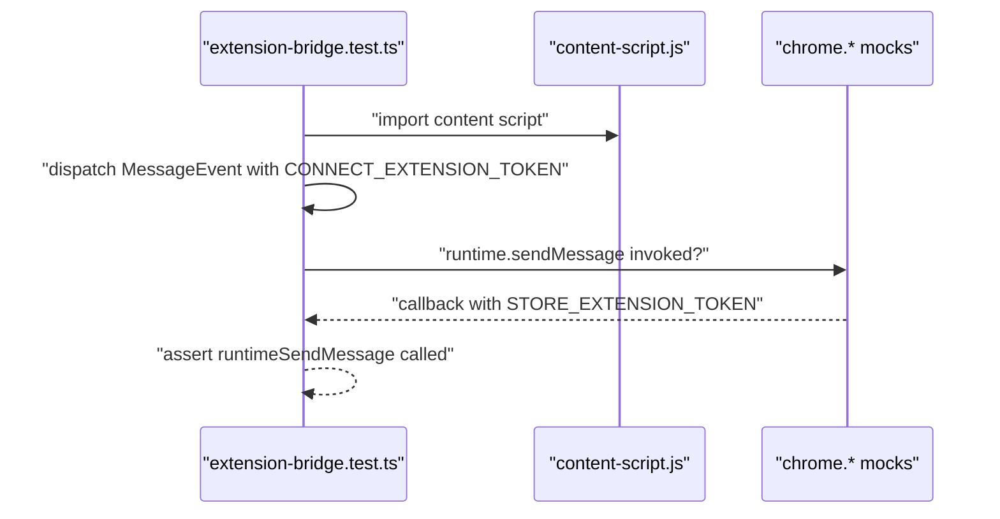
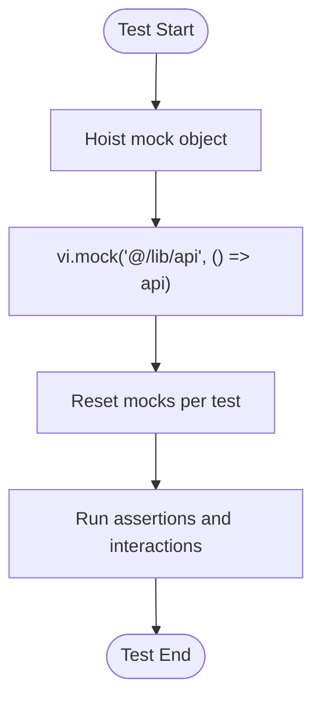
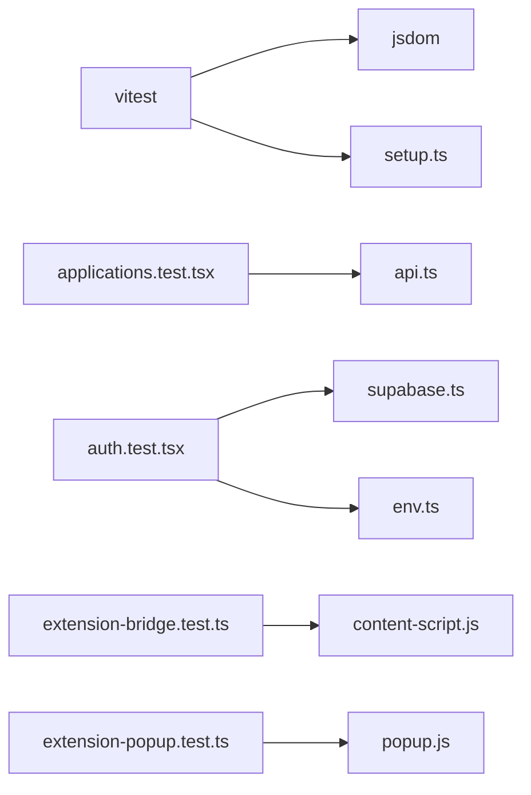

# Frontend Testing

<cite>
**Referenced Files in This Document**
- [package.json](file://frontend/package.json)
- [vite.config.ts](file://frontend/vite.config.ts)
- [setup.ts](file://frontend/src/test/setup.ts)
- [applications.test.tsx](file://frontend/src/test/applications.test.tsx)
- [auth.test.tsx](file://frontend/src/test/auth.test.tsx)
- [extension-bridge.test.ts](file://frontend/src/test/extension-bridge.test.ts)
- [extension-popup.test.ts](file://frontend/src/test/extension-popup.test.ts)
- [api.ts](file://frontend/src/lib/api.ts)
- [supabase.ts](file://frontend/src/lib/supabase.ts)
- [env.ts](file://frontend/src/lib/env.ts)
- [LoginPage.tsx](file://frontend/src/routes/LoginPage.tsx)
- [ApplicationsDashboardPage.tsx](file://frontend/src/routes/ApplicationsDashboardPage.tsx)
- [content-script.js](file://frontend/public/chrome-extension/content-script.js)
- [popup.js](file://frontend/public/chrome-extension/popup.js)
</cite>

## Table of Contents
1. [Introduction](#introduction)
2. [Project Structure](#project-structure)
3. [Core Components](#core-components)
4. [Architecture Overview](#architecture-overview)
5. [Detailed Component Analysis](#detailed-component-analysis)
6. [Dependency Analysis](#dependency-analysis)
7. [Performance Considerations](#performance-considerations)
8. [Troubleshooting Guide](#troubleshooting-guide)
9. [Conclusion](#conclusion)
10. [Appendices](#appendices)

## Introduction
This document provides comprehensive frontend testing guidance for the React application. It covers the testing setup using Vitest and React Testing Library, test environment configuration, and patterns for component, integration, and cross-context testing. It also documents mocking strategies for API calls, authentication, and browser extension integrations, along with best practices for organizing tests, naming conventions, and maintaining reliability. Debugging strategies and performance considerations for test execution are included.

## Project Structure
The frontend testing setup is organized under the frontend directory with:
- Test runner and environment configured via Vite and Vitest
- React Testing Library utilities and DOM assertions
- Test files grouped by feature or domain (e.g., applications, auth, extension)
- Shared test setup for global environment and DOM matchers

**Diagram sources**
- [vite.config.ts:18-22](file://frontend/vite.config.ts#L18-L22)
- [setup.ts:1-2](file://frontend/src/test/setup.ts#L1-L2)
- [applications.test.tsx:1-234](file://frontend/src/test/applications.test.tsx#L1-L234)
- [auth.test.tsx:1-44](file://frontend/src/test/auth.test.tsx#L1-L44)
- [extension-bridge.test.ts:1-97](file://frontend/src/test/extension-bridge.test.ts#L1-L97)
- [extension-popup.test.ts:1-31](file://frontend/src/test/extension-popup.test.ts#L1-L31)
- [api.ts:1-489](file://frontend/src/lib/api.ts#L1-L489)
- [supabase.ts:1-26](file://frontend/src/lib/supabase.ts#L1-L26)
- [env.ts:1-15](file://frontend/src/lib/env.ts#L1-L15)
- [LoginPage.tsx:1-111](file://frontend/src/routes/LoginPage.tsx#L1-L111)
- [ApplicationsDashboardPage.tsx:1-264](file://frontend/src/routes/ApplicationsDashboardPage.tsx#L1-L264)
- [content-script.js:1-118](file://frontend/public/chrome-extension/content-script.js#L1-L118)
- [popup.js:1-156](file://frontend/public/chrome-extension/popup.js#L1-L156)

**Section sources**
- [package.json:10-11](file://frontend/package.json#L10-L11)
- [vite.config.ts:18-22](file://frontend/vite.config.ts#L18-L22)
- [setup.ts:1-2](file://frontend/src/test/setup.ts#L1-L2)

## Core Components
- Test runner and environment
  - Vitest runs tests with jsdom as the DOM environment and enables global matchers via setup.ts.
  - Scripts for running tests in CI or locally are defined in package.json.
- React Testing Library
  - Render components, query DOM nodes, and simulate user interactions using user events.
- Mocking strategy
  - Hoisted mocks for API modules isolate tests from network calls.
  - Browser APIs (e.g., chrome.*) are mocked by defining global properties per test suite.

Key testing utilities and helpers:
- Global setup: jest-dom matchers for accessibility and semantic assertions.
- Feature-specific mocks: environment variables, Supabase client behavior, and extension bridge globals.

**Section sources**
- [package.json:10-11](file://frontend/package.json#L10-L11)
- [vite.config.ts:18-22](file://frontend/vite.config.ts#L18-L22)
- [setup.ts:1-2](file://frontend/src/test/setup.ts#L1-L2)
- [applications.test.tsx:9-24](file://frontend/src/test/applications.test.tsx#L9-L24)
- [auth.test.tsx:8-16](file://frontend/src/test/auth.test.tsx#L8-L16)

## Architecture Overview
The testing architecture separates concerns across:
- Unit-like tests for pure logic and small utilities
- Component tests for UI rendering and user interactions
- Cross-context tests for browser extension bridges and popup helpers
- Integration tests for route-driven flows and API interactions

**Diagram sources**
- [vite.config.ts:18-22](file://frontend/vite.config.ts#L18-L22)
- [setup.ts:1-2](file://frontend/src/test/setup.ts#L1-L2)
- [auth.test.tsx:1-44](file://frontend/src/test/auth.test.tsx#L1-L44)
- [applications.test.tsx:1-234](file://frontend/src/test/applications.test.tsx#L1-L234)
- [extension-bridge.test.ts:1-97](file://frontend/src/test/extension-bridge.test.ts#L1-L97)
- [extension-popup.test.ts:1-31](file://frontend/src/test/extension-popup.test.ts#L1-L31)
- [env.ts:1-15](file://frontend/src/lib/env.ts#L1-L15)
- [supabase.ts:1-26](file://frontend/src/lib/supabase.ts#L1-L26)
- [api.ts:1-489](file://frontend/src/lib/api.ts#L1-L489)
- [LoginPage.tsx:1-111](file://frontend/src/routes/LoginPage.tsx#L1-L111)
- [ApplicationsDashboardPage.tsx:1-264](file://frontend/src/routes/ApplicationsDashboardPage.tsx#L1-L264)
- [content-script.js:1-118](file://frontend/public/chrome-extension/content-script.js#L1-L118)
- [popup.js:1-156](file://frontend/public/chrome-extension/popup.js#L1-L156)

## Detailed Component Analysis

### React Testing Library Configuration and Test Environment
- Vitest configuration sets jsdom as the test environment, enabling DOM APIs in tests.
- Global matchers are registered via setup.ts to support accessibility and semantic assertions.
- Scripts for running tests in watch and run modes are defined in package.json.

Best practices:
- Keep setup minimal and deterministic.
- Use beforeEach to reset mocks and module state when needed.

**Section sources**
- [vite.config.ts:18-22](file://frontend/vite.config.ts#L18-L22)
- [setup.ts:1-2](file://frontend/src/test/setup.ts#L1-L2)
- [package.json:10-11](file://frontend/package.json#L10-L11)

### Component Testing Patterns: Individual Components
- LoginPage
  - Renders sign-in form and environment branding.
  - Uses Supabase client for authentication and navigates on success.
  - Tests assert presence of headings, buttons, and session storage behavior.

- ApplicationsDashboardPage
  - Renders application cards, filters, and sorting controls.
  - Handles creation of new applications and toggling applied state.
  - Tests validate UI states, filtering, and navigation behavior.

Patterns:
- Use MemoryRouter for route-based tests.
- Mock API functions with hoisted vi.fn() and restore between tests.
- Assert rendered text and roles using screen queries.

**Section sources**
- [auth.test.tsx:18-43](file://frontend/src/test/auth.test.tsx#L18-L43)
- [LoginPage.tsx:10-36](file://frontend/src/routes/LoginPage.tsx#L10-L36)
- [ApplicationsDashboardPage.tsx:16-96](file://frontend/src/routes/ApplicationsDashboardPage.tsx#L16-L96)
- [applications.test.tsx:31-42](file://frontend/src/test/applications.test.tsx#L31-L42)
- [applications.test.tsx:158-212](file://frontend/src/test/applications.test.tsx#L158-L212)

### Integration Testing: Component Interactions and Routing
- Route-driven flows:
  - MemoryRouter wraps pages to simulate navigation.
  - Tests assert that clicking a card navigates to the detail page.
- Controlled interactions:
  - userEvent is used to simulate typing, selecting options, and clicking buttons.
  - Asynchronous UI updates are awaited using findBy* queries.

**Diagram sources**
- [applications.test.tsx:31-42](file://frontend/src/test/applications.test.tsx#L31-L42)
- [applications.test.tsx:44-95](file://frontend/src/test/applications.test.tsx#L44-L95)
- [ApplicationsDashboardPage.tsx:46-59](file://frontend/src/routes/ApplicationsDashboardPage.tsx#L46-L59)
- [api.ts:244-253](file://frontend/src/lib/api.ts#L244-L253)

**Section sources**
- [applications.test.tsx:31-42](file://frontend/src/test/applications.test.tsx#L31-L42)
- [applications.test.tsx:44-95](file://frontend/src/test/applications.test.tsx#L44-L95)
- [ApplicationsDashboardPage.tsx:46-59](file://frontend/src/routes/ApplicationsDashboardPage.tsx#L46-L59)

### End-to-End Style Testing: Cross-Context Interactions
- Chrome extension bridge
  - Tests simulate message passing between the web app and extension.
  - Mock chrome.* APIs globally and dispatch MessageEvent to validate trust checks and token storage.
- Extension popup helpers
  - Tests validate payload construction and origin validation for local development.

**Diagram sources**
- [extension-bridge.test.ts:34-95](file://frontend/src/test/extension-bridge.test.ts#L34-L95)
- [content-script.js:76-117](file://frontend/public/chrome-extension/content-script.js#L76-L117)

**Section sources**
- [extension-bridge.test.ts:1-97](file://frontend/src/test/extension-bridge.test.ts#L1-L97)
- [extension-popup.test.ts:1-31](file://frontend/src/test/extension-popup.test.ts#L1-L31)
- [content-script.js:1-118](file://frontend/public/chrome-extension/content-script.js#L1-L118)
- [popup.js:1-156](file://frontend/public/chrome-extension/popup.js#L1-L156)

### Mock Strategies: API Calls, Authentication, and External Dependencies
- API mocking
  - Hoist a mock object and vi.mock("@/lib/api", () => api) to replace all imports.
  - Reset mocks per test to avoid cross-test interference.
- Authentication and environment
  - Mock environment variables for test runs.
  - Verify Supabase session storage behavior (sessionStorage vs localStorage).
- Browser APIs
  - Define global chrome object with mocked runtime and storage APIs per test suite.

**Diagram sources**
- [applications.test.tsx:9-24](file://frontend/src/test/applications.test.tsx#L9-L24)
- [auth.test.tsx:8-16](file://frontend/src/test/auth.test.tsx#L8-L16)
- [extension-bridge.test.ts:11-32](file://frontend/src/test/extension-bridge.test.ts#L11-L32)

**Section sources**
- [applications.test.tsx:9-24](file://frontend/src/test/applications.test.tsx#L9-L24)
- [auth.test.tsx:8-16](file://frontend/src/test/auth.test.tsx#L8-L16)
- [auth.test.tsx:30-33](file://frontend/src/test/auth.test.tsx#L30-L33)
- [extension-bridge.test.ts:11-32](file://frontend/src/test/extension-bridge.test.ts#L11-L32)

### Testing Utilities and Helper Functions
- Global setup
  - Import jest-dom matchers in setup.ts to enable semantic assertions.
- Feature-specific helpers
  - Environment parsing ensures typed access to Vite environment variables.
  - Supabase client configuration centralizes auth storage behavior.

**Section sources**
- [setup.ts:1-2](file://frontend/src/test/setup.ts#L1-L2)
- [env.ts:1-15](file://frontend/src/lib/env.ts#L1-L15)
- [supabase.ts:4-11](file://frontend/src/lib/supabase.ts#L4-L11)

### Examples: Hooks, Custom Components, and Complex UI Interactions
- Custom components
  - StatusBadge and UI primitives are used within pages; tests assert presence and state.
- Complex interactions
  - Conditional UI reveals (e.g., “other source” input) require selecting dropdown options and asserting multiple inputs.
  - Duplicate review and blocked-source recovery surfaces rely on detailed API responses and state transitions.

**Section sources**
- [applications.test.tsx:44-95](file://frontend/src/test/applications.test.tsx#L44-L95)
- [applications.test.tsx:97-156](file://frontend/src/test/applications.test.tsx#L97-L156)
- [applications.test.tsx:158-212](file://frontend/src/test/applications.test.tsx#L158-L212)

### Best Practices: State Management, Routing, and Form Handling
- State management
  - Prefer deterministic state updates and revert on errors (as seen in applied toggle).
- Routing
  - Use MemoryRouter for isolated route tests; ensure navigation targets are reachable.
- Forms
  - Validate submission handlers and error rendering; disable controls during async operations.

**Section sources**
- [ApplicationsDashboardPage.tsx:61-96](file://frontend/src/routes/ApplicationsDashboardPage.tsx#L61-L96)
- [LoginPage.tsx:17-36](file://frontend/src/routes/LoginPage.tsx#L17-L36)

### Test Organization, Naming Conventions, and Reliability
- Organization
  - Group tests by feature (e.g., applications, auth, extension).
  - Place setup files under src/test and keep them minimal.
- Naming
  - Use descriptive filenames ending with .test.tsx and concise describe/it blocks.
- Reliability
  - Reset mocks and module state between tests.
  - Prefer findBy* queries for asynchronous UI updates.

**Section sources**
- [applications.test.tsx:27-29](file://frontend/src/test/applications.test.tsx#L27-L29)
- [auth.test.tsx:18-28](file://frontend/src/test/auth.test.tsx#L18-L28)
- [extension-bridge.test.ts:11-14](file://frontend/src/test/extension-bridge.test.ts#L11-L14)

## Dependency Analysis
Testing dependencies and their relationships:
- Vitest depends on jsdom for DOM simulation and setup.ts for global matchers.
- Feature tests depend on production modules (api.ts, supabase.ts, env.ts) via mocks.
- Extension tests depend on public JavaScript bundles and browser APIs.

**Diagram sources**
- [vite.config.ts:18-22](file://frontend/vite.config.ts#L18-L22)
- [setup.ts:1-2](file://frontend/src/test/setup.ts#L1-L2)
- [applications.test.tsx:1-234](file://frontend/src/test/applications.test.tsx#L1-L234)
- [auth.test.tsx:1-44](file://frontend/src/test/auth.test.tsx#L1-L44)
- [extension-bridge.test.ts:1-97](file://frontend/src/test/extension-bridge.test.ts#L1-L97)
- [extension-popup.test.ts:1-31](file://frontend/src/test/extension-popup.test.ts#L1-L31)
- [api.ts:1-489](file://frontend/src/lib/api.ts#L1-L489)
- [supabase.ts:1-26](file://frontend/src/lib/supabase.ts#L1-L26)
- [env.ts:1-15](file://frontend/src/lib/env.ts#L1-L15)
- [content-script.js:1-118](file://frontend/public/chrome-extension/content-script.js#L1-L118)
- [popup.js:1-156](file://frontend/public/chrome-extension/popup.js#L1-L156)

**Section sources**
- [vite.config.ts:18-22](file://frontend/vite.config.ts#L18-L22)
- [applications.test.tsx:1-234](file://frontend/src/test/applications.test.tsx#L1-L234)
- [auth.test.tsx:1-44](file://frontend/src/test/auth.test.tsx#L1-L44)
- [extension-bridge.test.ts:1-97](file://frontend/src/test/extension-bridge.test.ts#L1-L97)
- [extension-popup.test.ts:1-31](file://frontend/src/test/extension-popup.test.ts#L1-L31)

## Performance Considerations
- Use hoisted mocks to avoid repeated module instantiation.
- Limit DOM queries and focus on targeted assertions to reduce flakiness.
- Prefer userEvent over direct DOM manipulation for realistic interactions.
- Keep tests focused on single responsibilities to improve maintainability and speed.

## Troubleshooting Guide
Common issues and resolutions:
- Missing DOM matchers
  - Ensure setup.ts is loaded by Vitest configuration.
- Unstable async UI
  - Use findBy* queries and waitFor for asynchronous updates.
- Module mocking not applied
  - Confirm vi.mock is declared before imports and mocks are reset between tests.
- Extension bridge failures
  - Verify global chrome mocks are defined before importing content script and that origins match expectations.

**Section sources**
- [setup.ts:1-2](file://frontend/src/test/setup.ts#L1-L2)
- [applications.test.tsx:27-29](file://frontend/src/test/applications.test.tsx#L27-L29)
- [extension-bridge.test.ts:11-32](file://frontend/src/test/extension-bridge.test.ts#L11-L32)

## Conclusion
The frontend testing setup leverages Vitest and React Testing Library with jsdom to provide a robust environment for component, integration, and cross-context testing. By adopting hoisted mocks, controlled browser API simulations, and disciplined test organization, the suite remains reliable and maintainable. Following the outlined patterns and best practices ensures consistent coverage across UI interactions, routing, authentication, and extension integrations.

## Appendices
- Running tests
  - Use the test scripts defined in package.json for run/watch modes.
- Adding new tests
  - Place test files under src/test with descriptive names.
  - Import and configure mocks at the top of the file; reset state in beforeEach.

**Section sources**
- [package.json:10-11](file://frontend/package.json#L10-L11)