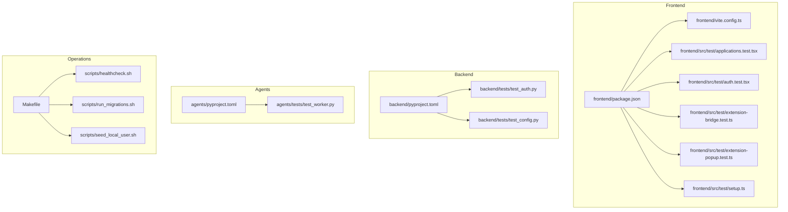
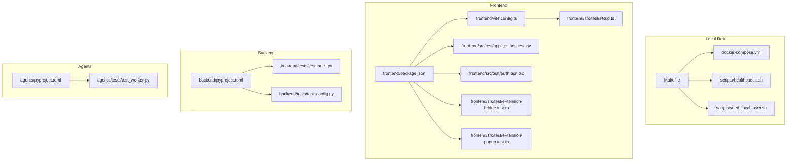
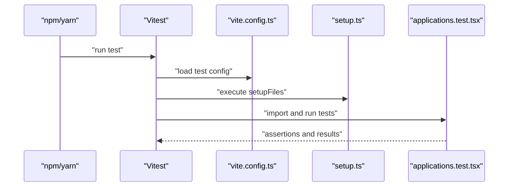
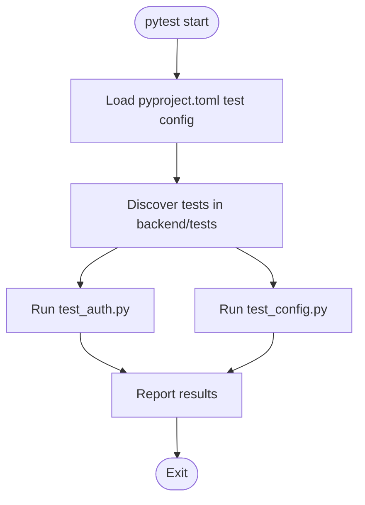
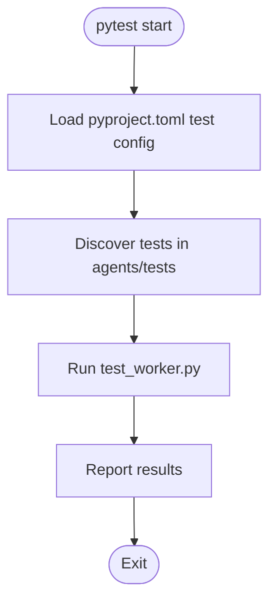
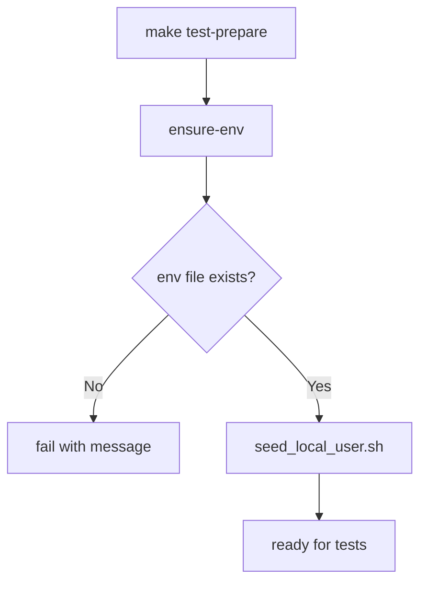
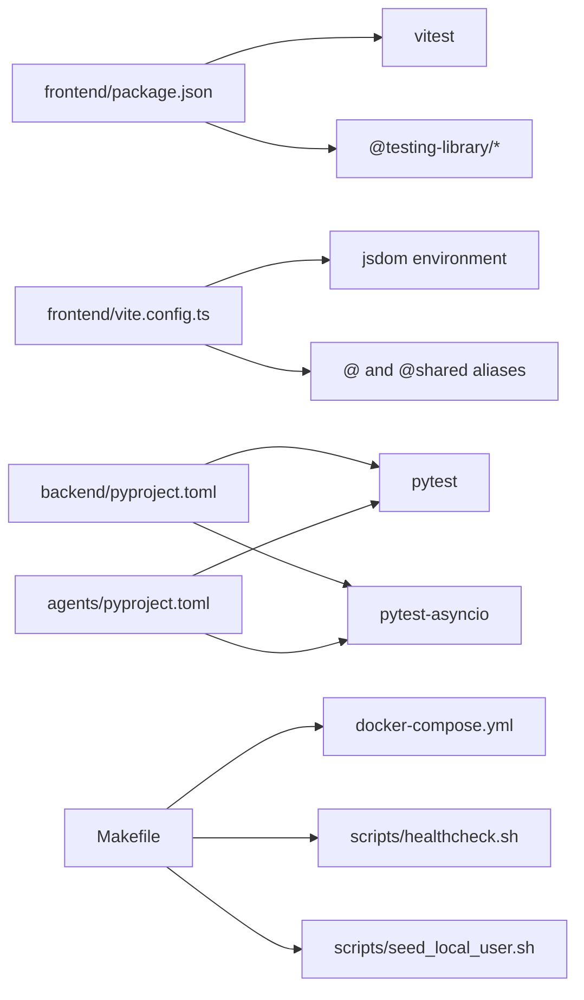

# Test Configuration and CI/CD

<cite>
**Referenced Files in This Document**
- [Makefile](file://Makefile)
- [docker-compose.yml](file://docker-compose.yml)
- [frontend/vite.config.ts](file://frontend/vite.config.ts)
- [frontend/package.json](file://frontend/package.json)
- [frontend/src/test/setup.ts](file://frontend/src/test/setup.ts)
- [frontend/src/test/applications.test.tsx](file://frontend/src/test/applications.test.tsx)
- [frontend/src/test/auth.test.tsx](file://frontend/src/test/auth.test.tsx)
- [frontend/src/test/extension-bridge.test.ts](file://frontend/src/test/extension-bridge.test.ts)
- [frontend/src/test/extension-popup.test.ts](file://frontend/src/test/extension-popup.test.ts)
- [backend/pyproject.toml](file://backend/pyproject.toml)
- [backend/tests/test_auth.py](file://backend/tests/test_auth.py)
- [backend/tests/test_config.py](file://backend/tests/test_config.py)
- [agents/pyproject.toml](file://agents/pyproject.toml)
- [agents/tests/test_worker.py](file://agents/tests/test_worker.py)
- [scripts/healthcheck.sh](file://scripts/healthcheck.sh)
- [scripts/run_migrations.sh](file://scripts/run_migrations.sh)
- [scripts/seed_local_user.sh](file://scripts/seed_local_user.sh)
</cite>

## Table of Contents
1. [Introduction](#introduction)
2. [Project Structure](#project-structure)
3. [Core Components](#core-components)
4. [Architecture Overview](#architecture-overview)
5. [Detailed Component Analysis](#detailed-component-analysis)
6. [Dependency Analysis](#dependency-analysis)
7. [Performance Considerations](#performance-considerations)
8. [Troubleshooting Guide](#troubleshooting-guide)
9. [Conclusion](#conclusion)
10. [Appendices](#appendices)

## Introduction
This document describes the complete testing infrastructure for the project, including frontend Vitest configuration, backend Python testing via pytest, agents unit tests, Makefile-driven automation, and operational scripts for local and CI environments. It also outlines test data management, database testing strategies, and guidance for parallelization, selective execution, and debugging.

## Project Structure
The repository organizes tests per component:
- Frontend tests under frontend/src/test
- Backend tests under backend/tests
- Agents tests under agents/tests
- Operational scripts under scripts/
- Makefile orchestrates environment setup and test preparation

**Diagram sources**
- [Makefile:1-30](file://Makefile#L1-L30)
- [frontend/vite.config.ts:1-24](file://frontend/vite.config.ts#L1-L24)
- [frontend/package.json:1-38](file://frontend/package.json#L1-L38)
- [frontend/src/test/setup.ts:1-2](file://frontend/src/test/setup.ts#L1-L2)
- [frontend/src/test/applications.test.tsx:1-234](file://frontend/src/test/applications.test.tsx#L1-L234)
- [frontend/src/test/auth.test.tsx:1-44](file://frontend/src/test/auth.test.tsx#L1-L44)
- [frontend/src/test/extension-bridge.test.ts:1-97](file://frontend/src/test/extension-bridge.test.ts#L1-L97)
- [frontend/src/test/extension-popup.test.ts:1-31](file://frontend/src/test/extension-popup.test.ts#L1-L31)
- [backend/pyproject.toml:1-37](file://backend/pyproject.toml#L1-L37)
- [backend/tests/test_auth.py:1-67](file://backend/tests/test_auth.py#L1-L67)
- [backend/tests/test_config.py:1-47](file://backend/tests/test_config.py#L1-L47)
- [agents/pyproject.toml:1-26](file://agents/pyproject.toml#L1-L26)
- [agents/tests/test_worker.py:1-127](file://agents/tests/test_worker.py#L1-L127)

**Section sources**
- [Makefile:1-30](file://Makefile#L1-L30)
- [frontend/vite.config.ts:1-24](file://frontend/vite.config.ts#L1-L24)
- [frontend/package.json:1-38](file://frontend/package.json#L1-L38)
- [backend/pyproject.toml:1-37](file://backend/pyproject.toml#L1-L37)
- [agents/pyproject.toml:1-26](file://agents/pyproject.toml#L1-L26)

## Core Components
- Frontend Vitest configuration defines the jsdom environment, global setup, and aliases for imports.
- Frontend tests leverage Testing Library and Vitest mocks to isolate UI and browser bridge logic.
- Backend pytest configuration is declared via pyproject metadata; tests validate auth and settings logic.
- Agents tests validate extraction and normalization logic with mocked dependencies.
- Makefile targets orchestrate environment setup, health checks, and test preparation.

Key capabilities:
- Frontend test runner: Vitest with jsdom and global setup
- Backend test runner: pytest with asyncio support
- Agents test runner: pytest with asyncio support
- Environment bootstrapping: docker compose with Makefile targets

**Section sources**
- [frontend/vite.config.ts:18-23](file://frontend/vite.config.ts#L18-L23)
- [frontend/src/test/setup.ts:1-2](file://frontend/src/test/setup.ts#L1-L2)
- [frontend/package.json:10-11](file://frontend/package.json#L10-L11)
- [backend/pyproject.toml:31-33](file://backend/pyproject.toml#L31-L33)
- [agents/pyproject.toml:18-22](file://agents/pyproject.toml#L18-L22)
- [Makefile:25-26](file://Makefile#L25-L26)

## Architecture Overview
The testing architecture integrates component-specific runners with shared operational scripts and dockerized services.

**Diagram sources**
- [Makefile:1-30](file://Makefile#L1-L30)
- [docker-compose.yml](file://docker-compose.yml)
- [frontend/vite.config.ts:1-24](file://frontend/vite.config.ts#L1-L24)
- [frontend/package.json:1-38](file://frontend/package.json#L1-L38)
- [frontend/src/test/setup.ts:1-2](file://frontend/src/test/setup.ts#L1-L2)
- [frontend/src/test/applications.test.tsx:1-234](file://frontend/src/test/applications.test.tsx#L1-L234)
- [frontend/src/test/auth.test.tsx:1-44](file://frontend/src/test/auth.test.tsx#L1-L44)
- [frontend/src/test/extension-bridge.test.ts:1-97](file://frontend/src/test/extension-bridge.test.ts#L1-L97)
- [frontend/src/test/extension-popup.test.ts:1-31](file://frontend/src/test/extension-popup.test.ts#L1-L31)
- [backend/pyproject.toml:1-37](file://backend/pyproject.toml#L1-L37)
- [backend/tests/test_auth.py:1-67](file://backend/tests/test_auth.py#L1-L67)
- [backend/tests/test_config.py:1-47](file://backend/tests/test_config.py#L1-L47)
- [agents/pyproject.toml:1-26](file://agents/pyproject.toml#L1-L26)
- [agents/tests/test_worker.py:1-127](file://agents/tests/test_worker.py#L1-L127)

## Detailed Component Analysis

### Frontend Testing Infrastructure
- Test runner: Vitest invoked via npm script
- Environment: jsdom with global setup for DOM extensions
- Aliases: @ and @shared resolved for imports
- Setup: global polyfills for Testing Library assertions
- Tests:
  - UI rendering and routing scenarios
  - Authentication shell and environment overrides
  - Chrome extension bridge message handling and trust checks
  - Extension popup helpers for payload building and origin validation

**Diagram sources**
- [frontend/package.json:10-11](file://frontend/package.json#L10-L11)
- [frontend/vite.config.ts:18-23](file://frontend/vite.config.ts#L18-L23)
- [frontend/src/test/setup.ts:1-2](file://frontend/src/test/setup.ts#L1-L2)
- [frontend/src/test/applications.test.tsx:1-234](file://frontend/src/test/applications.test.tsx#L1-L234)

**Section sources**
- [frontend/package.json:10-11](file://frontend/package.json#L10-L11)
- [frontend/vite.config.ts:18-23](file://frontend/vite.config.ts#L18-L23)
- [frontend/src/test/setup.ts:1-2](file://frontend/src/test/setup.ts#L1-L2)
- [frontend/src/test/applications.test.tsx:1-234](file://frontend/src/test/applications.test.tsx#L1-L234)
- [frontend/src/test/auth.test.tsx:1-44](file://frontend/src/test/auth.test.tsx#L1-L44)
- [frontend/src/test/extension-bridge.test.ts:1-97](file://frontend/src/test/extension-bridge.test.ts#L1-L97)
- [frontend/src/test/extension-popup.test.ts:1-31](file://frontend/src/test/extension-popup.test.ts#L1-L31)

### Backend Testing Infrastructure
- Test runner: pytest configured via pyproject metadata
- Test paths and pythonpath are declared centrally
- Tests cover:
  - Auth verification fallback and rejection logic
  - Email settings validation for enabled/disabled modes

**Diagram sources**
- [backend/pyproject.toml:31-33](file://backend/pyproject.toml#L31-L33)
- [backend/tests/test_auth.py:1-67](file://backend/tests/test_auth.py#L1-L67)
- [backend/tests/test_config.py:1-47](file://backend/tests/test_config.py#L1-L47)

**Section sources**
- [backend/pyproject.toml:31-33](file://backend/pyproject.toml#L31-L33)
- [backend/tests/test_auth.py:1-67](file://backend/tests/test_auth.py#L1-L67)
- [backend/tests/test_config.py:1-47](file://backend/tests/test_config.py#L1-L47)

### Agents Testing Infrastructure
- Test runner: pytest with asyncio support
- Tests validate:
  - Origin normalization
  - Reference ID extraction
  - Blocked page detection
  - Page context construction
  - Extraction agent fallback behavior

**Diagram sources**
- [agents/pyproject.toml:18-22](file://agents/pyproject.toml#L18-L22)
- [agents/tests/test_worker.py:1-127](file://agents/tests/test_worker.py#L1-L127)

**Section sources**
- [agents/pyproject.toml:18-22](file://agents/pyproject.toml#L18-L22)
- [agents/tests/test_worker.py:1-127](file://agents/tests/test_worker.py#L1-L127)

### Makefile Targets and Automation
- Environment safety: ensure-env validates presence of .env.compose
- Lifecycle: up, down, reset, logs, health
- Test preparation: test-prepare seeds a local user
- Compose inspection: compose-config prints effective compose config

**Diagram sources**
- [Makefile:6-26](file://Makefile#L6-L26)
- [scripts/seed_local_user.sh](file://scripts/seed_local_user.sh)

**Section sources**
- [Makefile:1-30](file://Makefile#L1-L30)

### Test Data Management and Database Strategies
- Local user seeding: executed via Makefile target to prepare test users
- Health checks: orchestrated by Makefile to verify service readiness
- Migrations: run via script to align database schema with tests

Operational scripts:
- Health check: verifies service availability
- Migrations: applies schema updates
- Seed user: initializes test account

**Section sources**
- [Makefile:22-26](file://Makefile#L22-L26)
- [scripts/healthcheck.sh](file://scripts/healthcheck.sh)
- [scripts/run_migrations.sh](file://scripts/run_migrations.sh)
- [scripts/seed_local_user.sh](file://scripts/seed_local_user.sh)

## Dependency Analysis
- Frontend depends on Vitest and Testing Library; aliases enable clean imports
- Backend and Agents depend on pytest with asyncio support
- Makefile coordinates dockerized services and test prep scripts

**Diagram sources**
- [frontend/package.json:22-35](file://frontend/package.json#L22-L35)
- [frontend/vite.config.ts:18-23](file://frontend/vite.config.ts#L18-L23)
- [backend/pyproject.toml:26-29](file://backend/pyproject.toml#L26-L29)
- [agents/pyproject.toml:18-22](file://agents/pyproject.toml#L18-L22)
- [Makefile:1-30](file://Makefile#L1-L30)

**Section sources**
- [frontend/package.json:22-35](file://frontend/package.json#L22-L35)
- [backend/pyproject.toml:26-29](file://backend/pyproject.toml#L26-L29)
- [agents/pyproject.toml:18-22](file://agents/pyproject.toml#L18-L22)
- [Makefile:1-30](file://Makefile#L1-L30)

## Performance Considerations
- Prefer mocking external services to avoid network overhead in unit tests
- Use isolated test modules to reduce cross-test interference
- Leverage Vitest’s built-in caching and watch mode for rapid feedback during development
- Keep database-backed tests minimal; use fixtures and deterministic seeds
- Parallelize independent tests where supported by the runtime

## Troubleshooting Guide
Common issues and resolutions:
- Missing environment file: ensure .env.compose exists before running targets
- Test failures due to missing services: run health checks and migrations prior to tests
- Frontend test errors related to DOM or environment: verify jsdom environment and setup files
- Backend settings validation errors: confirm environment variables for email settings match expected constraints

Actions:
- Validate environment: make ensure-env
- Prepare environment: make test-prepare
- Inspect compose config: make compose-config
- Verify services: make health

**Section sources**
- [Makefile:6-29](file://Makefile#L6-L29)
- [backend/tests/test_config.py:9-46](file://backend/tests/test_config.py#L9-L46)

## Conclusion
The project’s testing infrastructure combines component-specific runners with shared operational scripts and dockerized services. Frontend tests use Vitest with jsdom and global setup, backend and agents tests use pytest with asyncio support, and Makefile targets automate environment preparation and health checks. By following the guidance here, teams can maintain reliable, fast, and predictable test execution across local and CI environments.

## Appendices

### Test Coverage Reporting
- Current configuration does not declare a coverage reporter in the frontend Vitest setup
- Backend and agents test suites do not include coverage configuration in their project metadata
- Recommendation: add coverage reporters to each suite and integrate with CI quality gates

[No sources needed since this section provides general guidance]

### Continuous Integration Guidance
- Define GitHub Actions workflows to:
  - Install dependencies for each component
  - Run docker compose for integration tests
  - Execute frontend, backend, and agents tests
  - Collect coverage and enforce thresholds
  - Gate merges on passing tests and coverage

[No sources needed since this section provides general guidance]

### Selective Test Execution and Debugging
- Frontend: use Vitest’s watch mode and filename filters
- Backend: use pytest markers and selective discovery
- Agents: use pytest markers and module-level filtering
- Debugging: add console logging, inspect mocks, and run individual test files

[No sources needed since this section provides general guidance]