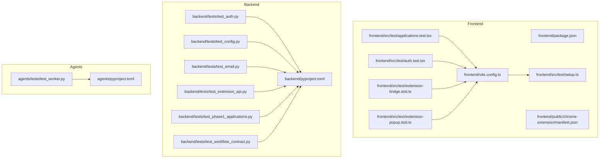
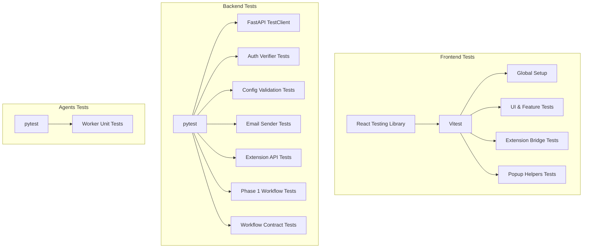
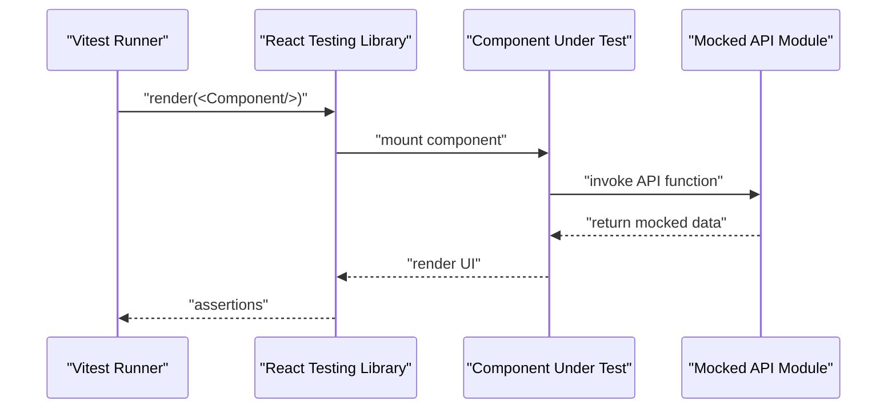
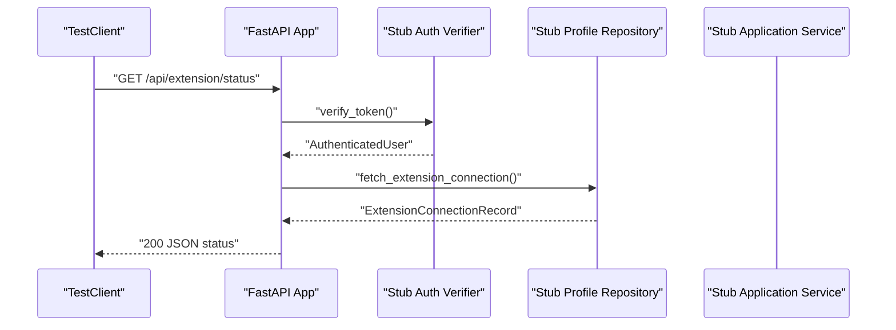
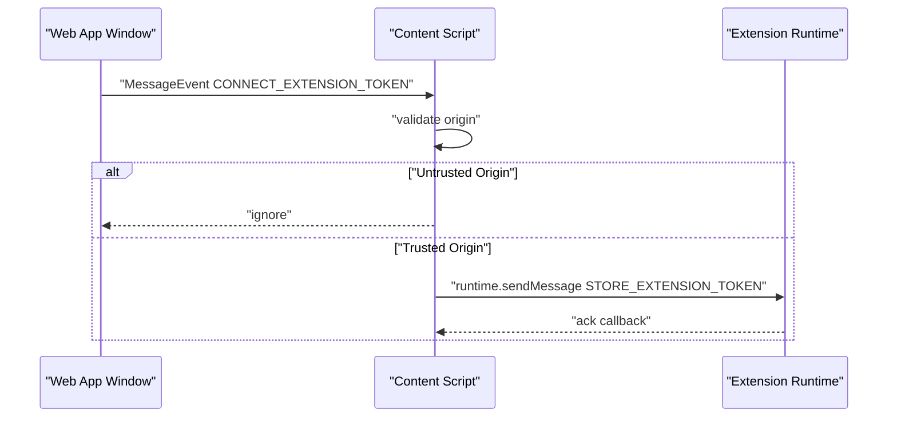
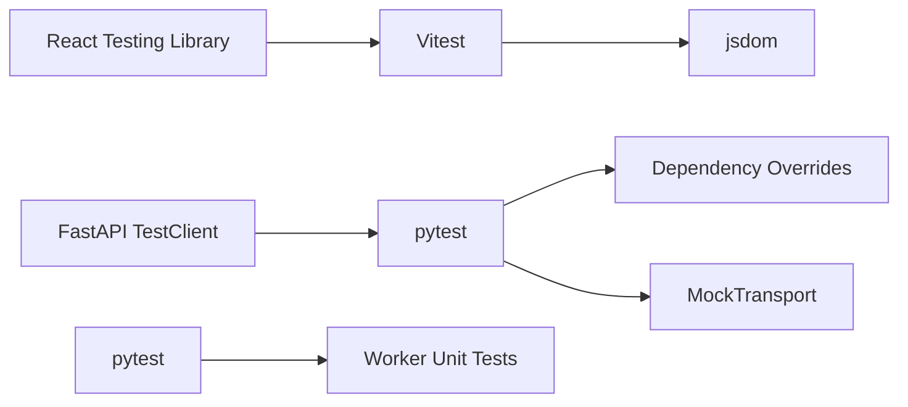

# Testing Strategy

<cite>
**Referenced Files in This Document**
- [package.json](file://frontend/package.json)
- [vite.config.ts](file://frontend/vite.config.ts)
- [setup.ts](file://frontend/src/test/setup.ts)
- [applications.test.tsx](file://frontend/src/test/applications.test.tsx)
- [auth.test.tsx](file://frontend/src/test/auth.test.tsx)
- [extension-bridge.test.ts](file://frontend/src/test/extension-bridge.test.ts)
- [extension-popup.test.ts](file://frontend/src/test/extension-popup.test.ts)
- [manifest.json](file://frontend/public/chrome-extension/manifest.json)
- [pyproject.toml](file://backend/pyproject.toml)
- [test_auth.py](file://backend/tests/test_auth.py)
- [test_config.py](file://backend/tests/test_config.py)
- [test_email.py](file://backend/tests/test_email.py)
- [test_extension_api.py](file://backend/tests/test_extension_api.py)
- [test_phase1_applications.py](file://backend/tests/test_phase1_applications.py)
- [test_workflow_contract.py](file://backend/tests/test_workflow_contract.py)
- [pyproject.toml](file://agents/pyproject.toml)
- [test_worker.py](file://agents/tests/test_worker.py)
</cite>

## Table of Contents
1. [Introduction](#introduction)
2. [Project Structure](#project-structure)
3. [Core Components](#core-components)
4. [Architecture Overview](#architecture-overview)
5. [Detailed Component Analysis](#detailed-component-analysis)
6. [Dependency Analysis](#dependency-analysis)
7. [Performance Considerations](#performance-considerations)
8. [Troubleshooting Guide](#troubleshooting-guide)
9. [Conclusion](#conclusion)
10. [Appendices](#appendices)

## Introduction
This document defines a comprehensive testing strategy for the multi-component application. It covers frontend testing with React Testing Library and Vitest, backend testing with pytest, agent testing, and Chrome extension testing. It also documents testing configuration, CI considerations, best practices, coverage expectations, debugging strategies, and practical implementation patterns for each component type.

## Project Structure
The repository is organized into three primary areas:
- Frontend: React application with Vite and Vitest for component and integration testing.
- Backend: FastAPI application with pytest for unit and integration tests.
- Agents: Python ARQ worker module with pytest for unit tests.
- Shared assets: Chrome extension manifests and public JS bundles used by tests.

**Diagram sources**
- [package.json:1-38](file://frontend/package.json#L1-L38)
- [vite.config.ts:1-24](file://frontend/vite.config.ts#L1-L24)
- [setup.ts:1-2](file://frontend/src/test/setup.ts#L1-L2)
- [applications.test.tsx:1-234](file://frontend/src/test/applications.test.tsx#L1-L234)
- [auth.test.tsx:1-44](file://frontend/src/test/auth.test.tsx#L1-L44)
- [extension-bridge.test.ts:1-97](file://frontend/src/test/extension-bridge.test.ts#L1-L97)
- [extension-popup.test.ts:1-31](file://frontend/src/test/extension-popup.test.ts#L1-L31)
- [manifest.json:1-24](file://frontend/public/chrome-extension/manifest.json#L1-L24)
- [pyproject.toml:1-37](file://backend/pyproject.toml#L1-L37)
- [test_auth.py:1-67](file://backend/tests/test_auth.py#L1-L67)
- [test_config.py:1-47](file://backend/tests/test_config.py#L1-L47)
- [test_email.py:1-59](file://backend/tests/test_email.py#L1-L59)
- [test_extension_api.py:1-204](file://backend/tests/test_extension_api.py#L1-L204)
- [test_phase1_applications.py:1-641](file://backend/tests/test_phase1_applications.py#L1-L641)
- [test_workflow_contract.py:1-21](file://backend/tests/test_workflow_contract.py#L1-L21)
- [pyproject.toml:1-26](file://agents/pyproject.toml#L1-L26)
- [test_worker.py:1-127](file://agents/tests/test_worker.py#L1-L127)

**Section sources**
- [package.json:1-38](file://frontend/package.json#L1-L38)
- [vite.config.ts:1-24](file://frontend/vite.config.ts#L1-L24)
- [pyproject.toml:1-37](file://backend/pyproject.toml#L1-L37)
- [pyproject.toml:1-26](file://agents/pyproject.toml#L1-L26)

## Core Components
- Frontend testing stack:
  - Vitest with jsdom environment for DOM simulation.
  - React Testing Library for component-centric assertions.
  - Setup hooks for global test utilities.
- Backend testing stack:
  - pytest with asyncio support for async endpoints and services.
  - FastAPI TestClient for integration-style endpoint tests.
  - Mock transports for external HTTP integrations.
- Agent testing stack:
  - pytest for pure unit tests of extraction and normalization logic.
  - Async fallback behavior validated via controlled exceptions.

Key testing configuration highlights:
- Frontend: Vitest configured with jsdom, setup files, and aliases.
- Backend: pytest configured via pyproject with dev dependencies and test paths.
- Agents: pytest configured via pyproject with dev dependencies.

**Section sources**
- [vite.config.ts:18-23](file://frontend/vite.config.ts#L18-L23)
- [setup.ts:1-2](file://frontend/src/test/setup.ts#L1-L2)
- [package.json:10-11](file://frontend/package.json#L10-L11)
- [pyproject.toml:25-36](file://backend/pyproject.toml#L25-L36)
- [pyproject.toml:18-22](file://agents/pyproject.toml#L18-L22)

## Architecture Overview
This section maps the testing architecture across components and highlights how tests exercise different layers.

**Diagram sources**
- [vite.config.ts:18-23](file://frontend/vite.config.ts#L18-L23)
- [setup.ts:1-2](file://frontend/src/test/setup.ts#L1-L2)
- [applications.test.tsx:1-234](file://frontend/src/test/applications.test.tsx#L1-L234)
- [extension-bridge.test.ts:1-97](file://frontend/src/test/extension-bridge.test.ts#L1-L97)
- [extension-popup.test.ts:1-31](file://frontend/src/test/extension-popup.test.ts#L1-L31)
- [pyproject.toml:25-36](file://backend/pyproject.toml#L25-L36)
- [test_auth.py:1-67](file://backend/tests/test_auth.py#L1-L67)
- [test_config.py:1-47](file://backend/tests/test_config.py#L1-L47)
- [test_email.py:1-59](file://backend/tests/test_email.py#L1-L59)
- [test_extension_api.py:1-204](file://backend/tests/test_extension_api.py#L1-L204)
- [test_phase1_applications.py:1-641](file://backend/tests/test_phase1_applications.py#L1-L641)
- [test_workflow_contract.py:1-21](file://backend/tests/test_workflow_contract.py#L1-L21)
- [pyproject.toml:18-22](file://agents/pyproject.toml#L18-L22)
- [test_worker.py:1-127](file://agents/tests/test_worker.py#L1-L127)

## Detailed Component Analysis

### Frontend Testing Strategy
- Component testing:
  - Use React Testing Library to render pages and interact with UI under MemoryRouter.
  - Mock API modules to isolate UI from network concerns.
  - Assert presence/absence of UI elements and state-dependent rendering.
- Integration testing:
  - Simulate user flows across pages (dashboard, detail, extension).
  - Validate conditional UI behavior (e.g., duplicate warnings, blocked-source recovery).
- Mock strategies:
  - Hoist mocks for API functions and reset per test.
  - Mock environment variables for auth and API endpoints.
- Test utilities:
  - Global setup registers jest-dom matchers for accessibility and DOM assertions.
- Security and messaging:
  - Verify extension bridge rejects untrusted origins and accepts localhost during setup.
  - Validate popup helpers for building import requests and origin trust checks.
- Best practices:
  - Prefer user-centric assertions over implementation details.
  - Keep tests deterministic by resetting mocks and avoiding real network calls.
  - Use waitFor for asynchronous UI updates.

**Diagram sources**
- [applications.test.tsx:1-234](file://frontend/src/test/applications.test.tsx#L1-L234)
- [auth.test.tsx:1-44](file://frontend/src/test/auth.test.tsx#L1-L44)
- [setup.ts:1-2](file://frontend/src/test/setup.ts#L1-L2)

**Section sources**
- [applications.test.tsx:1-234](file://frontend/src/test/applications.test.tsx#L1-L234)
- [auth.test.tsx:1-44](file://frontend/src/test/auth.test.tsx#L1-L44)
- [extension-bridge.test.ts:1-97](file://frontend/src/test/extension-bridge.test.ts#L1-L97)
- [extension-popup.test.ts:1-31](file://frontend/src/test/extension-popup.test.ts#L1-L31)
- [setup.ts:1-2](file://frontend/src/test/setup.ts#L1-L2)
- [vite.config.ts:18-23](file://frontend/vite.config.ts#L18-L23)

### Backend Testing Strategy
- Unit testing:
  - Validate JWT verification fallback behavior and error paths.
  - Validate configuration parsing and environment-driven behavior.
- Integration testing:
  - Use TestClient to hit FastAPI endpoints and assert HTTP status and JSON payloads.
  - Override dependencies to inject stub repositories/services for isolation.
- Workflow testing:
  - Exercise application lifecycle transitions (creation, manual entry, duplicate review, recovery).
  - Validate error propagation, notifications, and progress stores.
- Mock strategies:
  - Use MockTransport for HTTP clients to intercept outbound emails.
  - Replace auth verifier and repositories with stub implementations.
- Best practices:
  - Keep tests focused on single responsibilities.
  - Use fixtures to reset dependency overrides after each test.
  - Validate both success paths and explicit error conditions.

**Diagram sources**
- [test_extension_api.py:149-175](file://backend/tests/test_extension_api.py#L149-L175)

**Section sources**
- [test_auth.py:1-67](file://backend/tests/test_auth.py#L1-L67)
- [test_config.py:1-47](file://backend/tests/test_config.py#L1-L47)
- [test_email.py:1-59](file://backend/tests/test_email.py#L1-L59)
- [test_extension_api.py:1-204](file://backend/tests/test_extension_api.py#L1-L204)
- [test_phase1_applications.py:1-641](file://backend/tests/test_phase1_applications.py#L1-L641)
- [test_workflow_contract.py:1-21](file://backend/tests/test_workflow_contract.py#L1-L21)
- [pyproject.toml:25-36](file://backend/pyproject.toml#L25-L36)

### Agent Testing Strategy
- Unit testing:
  - Validate normalization of origins, reference ID extraction, and blocked-page detection.
  - Validate page context construction from captured payloads.
  - Validate fallback model selection when primary extraction fails.
- Mock strategies:
  - Use controlled exceptions to simulate failures and verify fallback behavior.
- Best practices:
  - Keep tests deterministic by providing synthetic contexts and captures.
  - Validate side effects (e.g., calls to extraction models) via call tracking.

**Diagram sources**
- [test_worker.py:98-127](file://agents/tests/test_worker.py#L98-L127)

**Section sources**
- [test_worker.py:1-127](file://agents/tests/test_worker.py#L1-L127)
- [pyproject.toml:18-22](file://agents/pyproject.toml#L18-L22)

### Chrome Extension Testing Strategy
- Extension bridge testing:
  - Validate message handling from web app to extension runtime.
  - Enforce origin checks to reject untrusted connections.
  - Confirm storage of tokens for trusted origins (including localhost).
- Popup testing:
  - Validate payload construction from captured page data.
  - Validate origin normalization and trust checks for popup helpers.
- Security testing:
  - Ensure CONNECT messages are ignored from untrusted origins.
  - Allow trusted origins (e.g., localhost development) for first-time setup.
- Message flow testing:
  - Dispatch MessageEvent to simulate cross-frame communication.
  - Assert runtime.sendMessage invocations and payloads.

**Diagram sources**
- [extension-bridge.test.ts:34-95](file://frontend/src/test/extension-bridge.test.ts#L34-L95)
- [manifest.json:1-24](file://frontend/public/chrome-extension/manifest.json#L1-L24)

**Section sources**
- [extension-bridge.test.ts:1-97](file://frontend/src/test/extension-bridge.test.ts#L1-L97)
- [extension-popup.test.ts:1-31](file://frontend/src/test/extension-popup.test.ts#L1-L31)
- [manifest.json:1-24](file://frontend/public/chrome-extension/manifest.json#L1-L24)

## Dependency Analysis
- Frontend:
  - Vitest depends on jsdom for DOM simulation.
  - React Testing Library integrates with Vitest for component assertions.
  - Tests mock API modules to avoid real network calls.
- Backend:
  - pytest runs tests under asyncio for async endpoints.
  - TestClient drives HTTP-level integration tests.
  - Dependency overrides decouple tests from external services.
- Agents:
  - pytest runs unit tests for extraction and normalization logic.
  - Controlled exceptions validate fallback behavior.

**Diagram sources**
- [vite.config.ts:18-23](file://frontend/vite.config.ts#L18-L23)
- [setup.ts:1-2](file://frontend/src/test/setup.ts#L1-L2)
- [pyproject.toml:25-36](file://backend/pyproject.toml#L25-L36)
- [test_email.py:24-58](file://backend/tests/test_email.py#L24-L58)
- [test_extension_api.py:142-147](file://backend/tests/test_extension_api.py#L142-L147)
- [pyproject.toml:18-22](file://agents/pyproject.toml#L18-L22)

**Section sources**
- [vite.config.ts:18-23](file://frontend/vite.config.ts#L18-L23)
- [pyproject.toml:25-36](file://backend/pyproject.toml#L25-L36)
- [pyproject.toml:18-22](file://agents/pyproject.toml#L18-L22)

## Performance Considerations
- Prefer isolated unit tests over heavy integration tests to keep feedback loops fast.
- Use hoisted mocks and reset per test to avoid shared mutable state.
- Limit reliance on real HTTP clients; prefer MockTransport for outbound integrations.
- Keep browser simulation minimal; focus on critical UI flows and security boundaries.

## Troubleshooting Guide
- Frontend:
  - If DOM assertions fail, ensure jsdom is configured and setup.ts is loaded.
  - If API mocks are not applied, verify hoisted mock declarations and reset between tests.
- Backend:
  - If endpoints require authentication, confirm stub auth verifier and bearer tokens.
  - If HTTP mocks do not intercept, verify MockTransport is passed to the client under test.
- Agents:
  - If fallback behavior is not triggered, confirm controlled exceptions are raised in the fake agent.
- General:
  - Use watch mode for rapid iteration during test development.
  - Add targeted logs in failing tests to inspect intermediate states.

**Section sources**
- [vite.config.ts:18-23](file://frontend/vite.config.ts#L18-L23)
- [setup.ts:1-2](file://frontend/src/test/setup.ts#L1-L2)
- [test_email.py:24-58](file://backend/tests/test_email.py#L24-L58)
- [test_worker.py:98-127](file://agents/tests/test_worker.py#L98-L127)

## Conclusion
This testing strategy emphasizes component-focused testing with React Testing Library and Vitest for the frontend, robust unit and integration tests with pytest for the backend, and precise unit tests for the agents. It leverages mocking, dependency overrides, and controlled environments to ensure reliability, security, and maintainability across the system.

## Appendices
- Example patterns:
  - Frontend: Mock API module hoisting and reset per test.
  - Backend: Dependency override fixture pattern and TestClient usage.
  - Agents: Controlled exception pattern for fallback validation.
- Coverage expectations:
  - Aim for high coverage in critical paths (auth, workflow transitions, email delivery, extension token handling).
- Continuous integration:
  - Run frontend tests via Vitest, backend tests via pytest, and agent tests via pytest in CI.
  - Configure separate jobs for each component to parallelize execution.