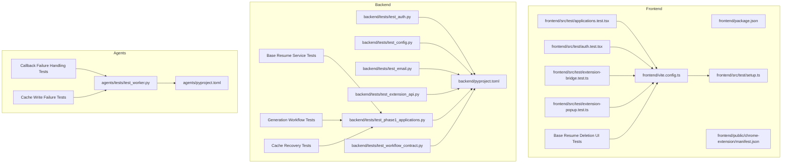
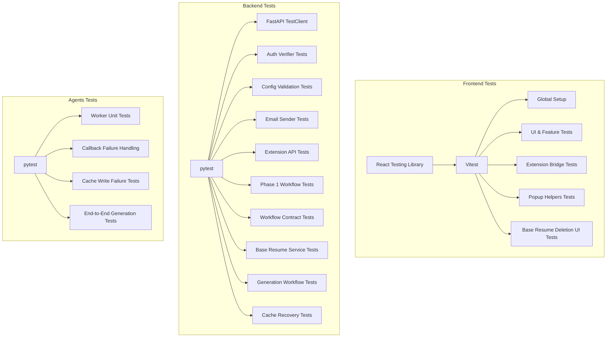
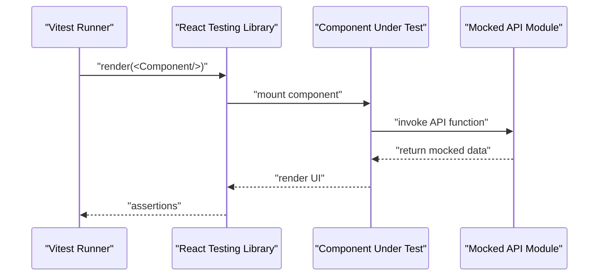
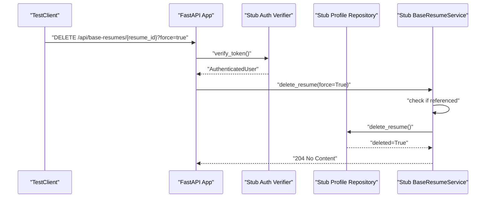
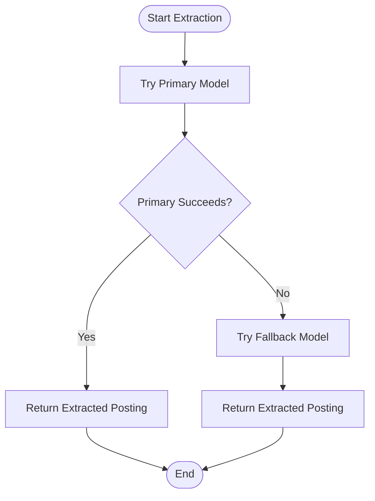
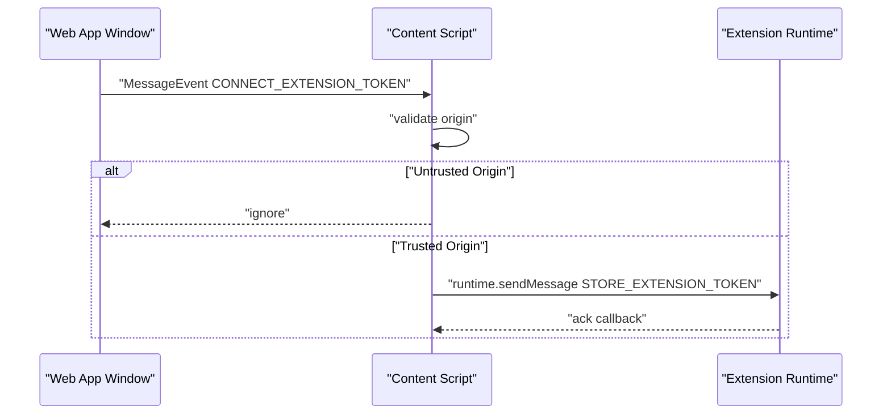
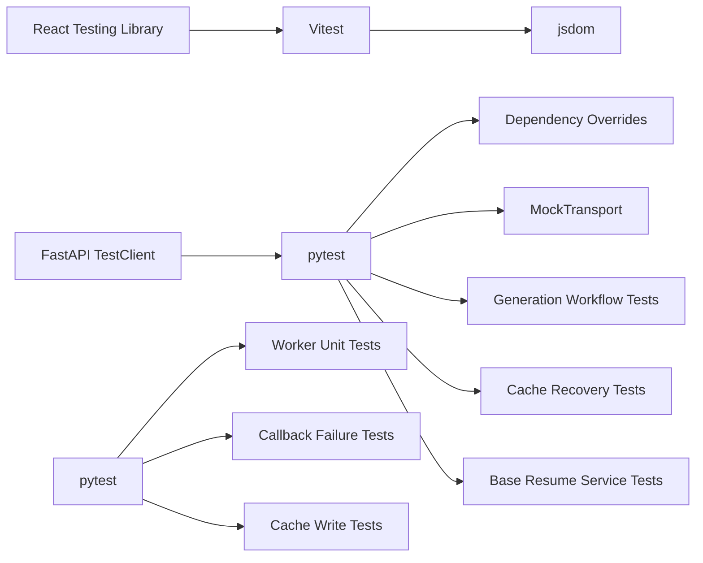

# Testing Strategy

<cite>
**Referenced Files in This Document**
- [package.json](file://frontend/package.json)
- [vite.config.ts](file://frontend/vite.config.ts)
- [setup.ts](file://frontend/src/test/setup.ts)
- [applications.test.tsx](file://frontend/src/test/applications.test.tsx)
- [auth.test.tsx](file://frontend/src/test/auth.test.tsx)
- [extension-bridge.test.ts](file://frontend/src/test/extension-bridge.test.ts)
- [extension-popup.test.ts](file://frontend/src/test/extension-popup.test.ts)
- [manifest.json](file://frontend/public/chrome-extension/manifest.json)
- [pyproject.toml](file://backend/pyproject.toml)
- [test_auth.py](file://backend/tests/test_auth.py)
- [test_config.py](file://backend/tests/test_config.py)
- [test_email.py](file://backend/tests/test_email.py)
- [test_extension_api.py](file://backend/tests/test_extension_api.py)
- [test_phase1_applications.py](file://backend/tests/test_phase1_applications.py)
- [test_workflow_contract.py](file://backend/tests/test_workflow_contract.py)
- [test_base_resume_service.py](file://backend/tests/test_base_resume_service.py)
- [pyproject.toml](file://agents/pyproject.toml)
- [test_worker.py](file://agents/tests/test_worker.py)
- [application_manager.py](file://backend/app/services/application_manager.py)
- [worker.py](file://agents/worker.py)
- [base_resumes.py](file://backend/app/services/base_resumes.py)
- [base_resumes.py](file://backend/app/api/base_resumes.py)
- [api.ts](file://frontend/src/lib/api.ts)
- [BaseResumesPage.tsx](file://frontend/src/routes/BaseResumesPage.tsx)
- [BaseResumeEditorPage.tsx](file://frontend/src/routes/BaseResumeEditorPage.tsx)
</cite>

## Update Summary
**Changes Made**
- Added comprehensive test coverage for base resume service deletion functionality
- Enhanced backend testing strategy with blocking deletion attempts, force deletion scenarios, and error handling validation
- Updated frontend testing strategy to include base resume deletion UI testing
- Added detailed coverage of force parameter handling and foreign key violation mapping
- Expanded error handling validation for referenced vs non-referenced resumes

## Table of Contents
1. [Introduction](#introduction)
2. [Project Structure](#project-structure)
3. [Core Components](#core-components)
4. [Architecture Overview](#architecture-overview)
5. [Detailed Component Analysis](#detailed-component-analysis)
6. [Base Resume Deletion Testing](#base-resume-deletion-testing)
7. [Generation Workflow Testing](#generation-workflow-testing)
8. [Cache Recovery Testing](#cache-recovery-testing)
9. [Dependency Analysis](#dependency-analysis)
10. [Performance Considerations](#performance-considerations)
11. [Troubleshooting Guide](#troubleshooting-guide)
12. [Conclusion](#conclusion)
13. [Appendices](#appendices)

## Introduction
This document defines a comprehensive testing strategy for the multi-component application. It covers frontend testing with React Testing Library and Vitest, backend testing with pytest, agent testing, and Chrome extension testing. The strategy has been enhanced to include comprehensive coverage of generation workflow functionality, validation of callback failure handling, cache recovery scenarios, and **newly added** base resume service deletion functionality with blocking deletion attempts, force deletion scenarios, and comprehensive error handling validation.

## Project Structure
The repository is organized into three primary areas:
- Frontend: React application with Vite and Vitest for component and integration testing, including base resume deletion UI testing.
- Backend: FastAPI application with pytest for unit and integration tests, including comprehensive generation workflow testing and **new base resume service deletion testing**.
- Agents: Python ARQ worker module with pytest for unit tests, featuring advanced error handling and cache recovery.
- Shared assets: Chrome extension manifests and public JS bundles used by tests.

**Diagram sources**
- [package.json:1-43](file://frontend/package.json#L1-L43)
- [vite.config.ts:1-24](file://frontend/vite.config.ts#L1-L24)
- [setup.ts:1-2](file://frontend/src/test/setup.ts#L1-L2)
- [applications.test.tsx:1-3783](file://frontend/src/test/applications.test.tsx#L1-L3783)
- [auth.test.tsx:1-44](file://frontend/src/test/auth.test.tsx#L1-L44)
- [extension-bridge.test.ts:1-97](file://frontend/src/test/extension-bridge.test.ts#L1-L97)
- [extension-popup.test.ts:1-31](file://frontend/src/test/extension-popup.test.ts#L1-L31)
- [manifest.json:1-24](file://frontend/public/chrome-extension/manifest.json#L1-L24)
- [pyproject.toml:1-37](file://backend/pyproject.toml#L1-L37)
- [test_auth.py:1-67](file://backend/tests/test_auth.py#L1-L67)
- [test_config.py:1-47](file://backend/tests/test_config.py#L1-L47)
- [test_email.py:1-59](file://backend/tests/test_email.py#L1-L59)
- [test_extension_api.py:1-204](file://backend/tests/test_extension_api.py#L1-L204)
- [test_phase1_applications.py:1-1509](file://backend/tests/test_phase1_applications.py#L1-L1509)
- [test_workflow_contract.py:1-21](file://backend/tests/test_workflow_contract.py#L1-L21)
- [test_base_resume_service.py:1-105](file://backend/tests/test_base_resume_service.py#L1-L105)
- [pyproject.toml:1-26](file://agents/pyproject.toml#L1-L26)
- [test_worker.py:1-127](file://agents/tests/test_worker.py#L1-L127)

**Section sources**
- [package.json:1-43](file://frontend/package.json#L1-L43)
- [vite.config.ts:1-24](file://frontend/vite.config.ts#L1-L24)
- [pyproject.toml:1-37](file://backend/pyproject.toml#L1-L37)
- [pyproject.toml:1-26](file://agents/pyproject.toml#L1-L26)

## Core Components
- Frontend testing stack:
  - Vitest with jsdom environment for DOM simulation.
  - React Testing Library for component-centric assertions.
  - Setup hooks for global test utilities.
  - **Enhanced**: Base resume deletion UI testing with confirm modals and error handling.
- Backend testing stack:
  - pytest with asyncio support for async endpoints and services.
  - FastAPI TestClient for integration-style endpoint tests.
  - Mock transports for external HTTP integrations.
  - **Enhanced**: Comprehensive base resume service deletion testing with blocking scenarios and force parameter validation.
  - Comprehensive generation workflow testing with cache recovery validation.
- Agent testing stack:
  - pytest for pure unit tests of extraction and normalization logic.
  - Advanced error handling validation including callback failure and cache write failures.
  - Async fallback behavior validated via controlled exceptions.

Key testing configuration highlights:
- Frontend: Vitest configured with jsdom, setup files, and aliases.
- Backend: pytest configured via pyproject with dev dependencies and test paths, including generation workflow test suites and **new base resume service tests**.
- Agents: pytest configured via pyproject with dev dependencies, featuring comprehensive error handling tests.

**Section sources**
- [vite.config.ts:18-23](file://frontend/vite.config.ts#L18-L23)
- [setup.ts:1-2](file://frontend/src/test/setup.ts#L1-L2)
- [package.json:10-11](file://frontend/package.json#L10-L11)
- [pyproject.toml:25-36](file://backend/pyproject.toml#L25-L36)
- [pyproject.toml:18-22](file://agents/pyproject.toml#L18-L22)

## Architecture Overview
This section maps the testing architecture across components and highlights how tests exercise different layers, with enhanced focus on generation workflow, recovery mechanisms, and **newly added** base resume deletion functionality.

**Diagram sources**
- [vite.config.ts:18-23](file://frontend/vite.config.ts#L18-L23)
- [setup.ts:1-2](file://frontend/src/test/setup.ts#L1-L2)
- [applications.test.tsx:1-3783](file://frontend/src/test/applications.test.tsx#L1-L3783)
- [extension-bridge.test.ts:1-97](file://frontend/src/test/extension-bridge.test.ts#L1-L97)
- [extension-popup.test.ts:1-31](file://frontend/src/test/extension-popup.test.ts#L1-L31)
- [pyproject.toml:25-36](file://backend/pyproject.toml#L25-L36)
- [test_auth.py:1-67](file://backend/tests/test_auth.py#L1-L67)
- [test_config.py:1-47](file://backend/tests/test_config.py#L1-L47)
- [test_email.py:1-59](file://backend/tests/test_email.py#L1-L59)
- [test_extension_api.py:1-204](file://backend/tests/test_extension_api.py#L1-L204)
- [test_phase1_applications.py:1-1509](file://backend/tests/test_phase1_applications.py#L1-L1509)
- [test_workflow_contract.py:1-21](file://backend/tests/test_workflow_contract.py#L1-L21)
- [test_base_resume_service.py:1-105](file://backend/tests/test_base_resume_service.py#L1-L105)
- [pyproject.toml:18-22](file://agents/pyproject.toml#L18-L22)
- [test_worker.py:1-127](file://agents/tests/test_worker.py#L1-L127)

## Detailed Component Analysis

### Frontend Testing Strategy
- Component testing:
  - Use React Testing Library to render pages and interact with UI under MemoryRouter.
  - Mock API modules to isolate UI from network concerns.
  - Assert presence/absence of UI elements and state-dependent rendering.
  - **Enhanced**: Test base resume deletion flows including confirm modals and error handling.
- Integration testing:
  - Simulate user flows across pages (dashboard, detail, extension, base resumes).
  - Validate conditional UI behavior (e.g., duplicate warnings, blocked-source recovery, **base resume deletion confirmations**).
- Mock strategies:
  - Hoist mocks for API functions and reset per test.
  - Mock environment variables for auth and API endpoints.
  - **Enhanced**: Mock deleteBaseResume function with various error scenarios.
- Test utilities:
  - Global setup registers jest-dom matchers for accessibility and DOM assertions.
- Security and messaging:
  - Verify extension bridge rejects untrusted origins and accepts localhost during setup.
  - Validate popup helpers for building import requests and origin trust checks.
- Best practices:
  - Prefer user-centric assertions over implementation details.
  - Keep tests deterministic by resetting mocks and avoiding real network calls.
  - Use waitFor for asynchronous UI updates.
  - **Enhanced**: Test both success and error paths for base resume deletion operations.

**Diagram sources**
- [applications.test.tsx:1-3783](file://frontend/src/test/applications.test.tsx#L1-L3783)
- [auth.test.tsx:1-44](file://frontend/src/test/auth.test.tsx#L1-L44)
- [setup.ts:1-2](file://frontend/src/test/setup.ts#L1-L2)

**Section sources**
- [applications.test.tsx:1-3783](file://frontend/src/test/applications.test.tsx#L1-L3783)
- [auth.test.tsx:1-44](file://frontend/src/test/auth.test.tsx#L1-L44)
- [extension-bridge.test.ts:1-97](file://frontend/src/test/extension-bridge.test.ts#L1-L97)
- [extension-popup.test.ts:1-31](file://frontend/src/test/extension-popup.test.ts#L1-L31)
- [setup.ts:1-2](file://frontend/src/test/setup.ts#L1-L2)
- [vite.config.ts:18-23](file://frontend/vite.config.ts#L18-L23)

### Backend Testing Strategy
- Unit testing:
  - Validate JWT verification fallback behavior and error paths.
  - Validate configuration parsing and environment-driven behavior.
- Integration testing:
  - Use TestClient to hit FastAPI endpoints and assert HTTP status and JSON payloads.
  - Override dependencies to inject stub repositories/services for isolation.
- Workflow testing:
  - Exercise application lifecycle transitions (creation, manual entry, duplicate review, recovery).
  - Validate error propagation, notifications, and progress stores.
  - **Enhanced**: Comprehensive generation workflow testing including cache recovery scenarios.
  - **New**: Base resume service deletion testing with blocking scenarios and force parameter validation.
- Mock strategies:
  - Use MockTransport for HTTP clients to intercept outbound emails.
  - Replace auth verifier and repositories with stub implementations.
  - **Enhanced**: Comprehensive stub repository testing for base resume deletion scenarios.
- Best practices:
  - Keep tests focused on single responsibilities.
  - Use fixtures to reset dependency overrides after each test.
  - Validate both success paths and explicit error conditions.
  - **Enhanced**: Test both referenced and non-referenced resume deletion scenarios.

**Diagram sources**
- [test_base_resume_service.py:70-79](file://backend/tests/test_base_resume_service.py#L70-L79)

**Section sources**
- [test_auth.py:1-67](file://backend/tests/test_auth.py#L1-L67)
- [test_config.py:1-47](file://backend/tests/test_config.py#L1-L47)
- [test_email.py:1-59](file://backend/tests/test_email.py#L1-L59)
- [test_extension_api.py:1-204](file://backend/tests/test_extension_api.py#L1-L204)
- [test_phase1_applications.py:1-1509](file://backend/tests/test_phase1_applications.py#L1-L1509)
- [test_workflow_contract.py:1-21](file://backend/tests/test_workflow_contract.py#L1-L21)
- [test_base_resume_service.py:1-105](file://backend/tests/test_base_resume_service.py#L1-L105)
- [pyproject.toml:25-36](file://backend/pyproject.toml#L25-L36)

### Agent Testing Strategy
- Unit testing:
  - Validate normalization of origins, reference ID extraction, and blocked-page detection.
  - Validate page context construction from captured payloads.
  - Validate fallback model selection when primary extraction fails.
  - **Enhanced**: Comprehensive callback failure handling validation with best-effort delivery.
  - **Enhanced**: Cache write failure handling with graceful degradation and logging.
- Mock strategies:
  - Use controlled exceptions to simulate failures and verify fallback behavior.
  - Implement fake writers and callbacks to test error scenarios.
- Best practices:
  - Keep tests deterministic by providing synthetic contexts and captures.
  - Validate side effects (e.g., calls to extraction models) via call tracking.
  - Test both success paths and failure recovery mechanisms.

**Diagram sources**
- [test_worker.py:98-127](file://agents/tests/test_worker.py#L98-L127)

**Section sources**
- [test_worker.py:1-127](file://agents/tests/test_worker.py#L1-L127)
- [pyproject.toml:18-22](file://agents/pyproject.toml#L18-L22)

### Chrome Extension Testing Strategy
- Extension bridge testing:
  - Validate message handling from web app to extension runtime.
  - Enforce origin checks to reject untrusted connections.
  - Confirm storage of tokens for trusted origins (including localhost).
- Popup testing:
  - Validate payload construction from captured page data.
  - Validate origin normalization and trust checks for popup helpers.
- Security testing:
  - Ensure CONNECT messages are ignored from untrusted origins.
  - Allow trusted origins (e.g., localhost development) for first-time setup.
- Message flow testing:
  - Dispatch MessageEvent to simulate cross-frame communication.
  - Assert runtime.sendMessage invocations and payloads.

**Diagram sources**
- [extension-bridge.test.ts:34-95](file://frontend/src/test/extension-bridge.test.ts#L34-L95)
- [manifest.json:1-24](file://frontend/public/chrome-extension/manifest.json#L1-L24)

**Section sources**
- [extension-bridge.test.ts:1-97](file://frontend/src/test/extension-bridge.test.ts#L1-L97)
- [extension-popup.test.ts:1-31](file://frontend/src/test/extension-popup.test.ts#L1-L31)
- [manifest.json:1-24](file://frontend/public/chrome-extension/manifest.json#L1-L24)

## Base Resume Deletion Testing

### Base Resume Service Deletion Testing
The backend now includes comprehensive testing for base resume service deletion functionality with blocking deletion attempts, force deletion scenarios, and error handling validation. This ensures that resume deletion operations are secure and properly validated.

**Key Testing Scenarios:**
- Blocking deletion attempts for referenced resumes without force parameter
- Allowing deletion of referenced resumes with force=true parameter
- Handling non-existent resume records with LookupError
- Mapping PostgreSQL foreign key violations to PermissionError
- Validating service method behavior and error propagation

**Test Implementation Patterns:**
- Stub repository with configurable referenced status and error scenarios
- Force parameter validation for deletion operations
- Error type validation and message matching
- Database constraint violation simulation using psycopg errors

**Section sources**
- [test_base_resume_service.py:57-104](file://backend/tests/test_base_resume_service.py#L57-L104)
- [base_resumes.py:109-137](file://backend/app/services/base_resumes.py#L109-L137)

### Frontend Base Resume Deletion UI Testing
The frontend includes comprehensive UI testing for base resume deletion functionality, covering user interaction flows and error handling.

**Key Testing Scenarios:**
- Resume deletion from the resumes list page with confirm modal
- Resume deletion from the editor page header action
- Search filtering functionality for resumes
- Icon-only delete controls on resume cards
- Error handling and toast notifications for failed deletions

**Test Implementation Patterns:**
- Mock API functions for deleteBaseResume and fetchBaseResume
- User interaction simulation with userEvent
- Modal confirmation flow testing
- Route navigation validation after successful deletion
- Error state rendering and user feedback

**Section sources**
- [applications.test.tsx:1315-1388](file://frontend/src/test/applications.test.tsx#L1315-L1388)
- [BaseResumesPage.tsx:51-66](file://frontend/src/routes/BaseResumesPage.tsx#L51-L66)
- [BaseResumeEditorPage.tsx:122-135](file://frontend/src/routes/BaseResumeEditorPage.tsx#L122-L135)

### API Endpoint Testing
The backend API includes comprehensive testing for the base resume deletion endpoint with proper query parameter handling and error mapping.

**Key Testing Scenarios:**
- DELETE endpoint with force query parameter
- Authentication and authorization validation
- Error mapping from service exceptions to HTTP responses
- Proper HTTP status codes for successful and failed operations

**Test Implementation Patterns:**
- TestClient usage for HTTP-level endpoint testing
- Query parameter validation and parsing
- Exception mapping validation using _map_service_error
- Response validation and status code assertions

**Section sources**
- [base_resumes.py:225-239](file://backend/app/api/base_resumes.py#L225-L239)

## Generation Workflow Testing

### Generation Success Recovery Testing
The backend now includes comprehensive testing for generation workflow success recovery through progress cache reconciliation. This ensures that successful generation outcomes can be recovered even if callback delivery fails.

**Key Testing Scenarios:**
- Cache-based success recovery validation
- Progress store reconciliation logic
- Draft repository upsert operations
- Notification and email delivery coordination
- Workflow state transitions and cleanup

**Test Implementation Patterns:**
- Mock progress store with cached generation results
- Validate payload validation and model conversion
- Test draft repository operations and cleanup
- Verify notification creation and usage event recording

**Section sources**
- [application_manager.py:992-1079](file://backend/app/services/application_manager.py#L992-L1079)

### Callback Failure Handling Testing
The agents module includes sophisticated callback failure handling with best-effort delivery mechanisms. Tests validate that the system continues operation even when callback delivery fails.

**Key Testing Scenarios:**
- Callback delivery failure simulation
- Best-effort retry logic validation
- Logging and warning message verification
- Graceful degradation to progress/cache reconciliation

**Test Implementation Patterns:**
- Controlled exception injection for callback failures
- Fake callback client with event tracking
- Progress store validation after failure
- Warning log verification with error details

**Section sources**
- [worker.py:722-741](file://agents/worker.py#L722-L741)
- [test_worker.py:626-713](file://agents/tests/test_worker.py#L626-L713)

### Cache Write Failure Testing
The system includes comprehensive cache write failure handling to ensure generation results can still be processed even when Redis caching fails.

**Key Testing Scenarios:**
- Redis cache write failure simulation
- Progress store fallback validation
- Generation result processing without cache
- Error logging and warning message verification

**Test Implementation Patterns:**
- Fake writer with controlled cache write failures
- Event-driven progress validation
- Callback event tracking despite cache failures
- State validation after cache write errors

**Section sources**
- [worker.py:743-765](file://agents/worker.py#L743-L765)
- [test_worker.py:626-713](file://agents/tests/test_worker.py#L626-L713)

## Cache Recovery Testing

### Progress Store Reconciliation Testing
The backend implements sophisticated cache recovery mechanisms through progress store reconciliation, ensuring system resilience against partial failures.

**Key Testing Scenarios:**
- Terminal generation progress reconciliation
- Success/failure state detection and handling
- Target state calculation and validation
- Failure reason normalization and persistence

**Test Implementation Patterns:**
- Mock progress records with various states
- Terminal state detection validation
- Target state calculation testing
- Failure details normalization and persistence

**Section sources**
- [application_manager.py:682-800](file://backend/app/services/application_manager.py#L682-L800)

### Extraction Result Cache Recovery Testing
The system includes dedicated cache recovery for extraction results, enabling seamless recovery from partial extraction failures.

**Key Testing Scenarios:**
- Cached extraction result validation
- Job ID and workflow kind matching
- Payload model validation and conversion
- Application state updates and cleanup

**Test Implementation Patterns:**
- Mock extraction result cache entries
- Payload validation testing with model conversion
- State transition validation and cleanup
- Duplicate resolution flow integration testing

**Section sources**
- [application_manager.py:936-990](file://backend/app/services/application_manager.py#L936-L990)

## Dependency Analysis
- Frontend:
  - Vitest depends on jsdom for DOM simulation.
  - React Testing Library integrates with Vitest for component assertions.
  - Tests mock API modules to avoid real network calls.
  - **Enhanced**: Base resume deletion UI tests with confirm modals and error handling.
- Backend:
  - pytest runs tests under asyncio for async endpoints.
  - TestClient drives HTTP-level integration tests.
  - Dependency overrides decouple tests from external services.
  - **Enhanced**: Generation workflow and cache recovery testing dependencies.
  - **New**: Base resume service deletion testing with comprehensive stub repositories.
- Agents:
  - pytest runs unit tests for extraction and normalization logic.
  - Controlled exceptions validate fallback behavior.
  - **Enhanced**: Callback failure handling and cache write failure testing.

**Diagram sources**
- [vite.config.ts:18-23](file://frontend/vite.config.ts#L18-L23)
- [setup.ts:1-2](file://frontend/src/test/setup.ts#L1-L2)
- [pyproject.toml:25-36](file://backend/pyproject.toml#L25-L36)
- [test_email.py:24-58](file://backend/tests/test_email.py#L24-L58)
- [test_extension_api.py:142-147](file://backend/tests/test_extension_api.py#L142-L147)
- [pyproject.toml:18-22](file://agents/pyproject.toml#L18-L22)

**Section sources**
- [vite.config.ts:18-23](file://frontend/vite.config.ts#L18-L23)
- [pyproject.toml:25-36](file://backend/pyproject.toml#L25-L36)
- [pyproject.toml:18-22](file://agents/pyproject.toml#L18-L22)

## Performance Considerations
- Prefer isolated unit tests over heavy integration tests to keep feedback loops fast.
- Use hoisted mocks and reset per test to avoid shared mutable state.
- Limit reliance on real HTTP clients; prefer MockTransport for outbound integrations.
- Keep browser simulation minimal; focus on critical UI flows and security boundaries.
- **Enhanced**: Optimize generation workflow tests to minimize Redis dependencies in unit tests.
- **Enhanced**: Use fake implementations for cache operations in callback failure tests.
- **New**: Minimize database calls in base resume deletion tests by using stub repositories effectively.

## Troubleshooting Guide
- Frontend:
  - If DOM assertions fail, ensure jsdom is configured and setup.ts is loaded.
  - If API mocks are not applied, verify hoisted mock declarations and reset between tests.
  - **Enhanced**: For base resume deletion UI tests, verify confirm modal interactions and route navigation.
- Backend:
  - If endpoints require authentication, confirm stub auth verifier and bearer tokens.
  - If HTTP mocks do not intercept, verify MockTransport is passed to the client under test.
  - **Enhanced**: For generation workflow tests, verify progress store mock configurations.
  - **Enhanced**: For cache recovery tests, ensure cache entries are properly formatted.
  - **New**: For base resume service tests, verify stub repository configurations and error scenarios.
- Agents:
  - If fallback behavior is not triggered, confirm controlled exceptions are raised in the fake agent.
  - **Enhanced**: For callback failure tests, verify warning logs are captured.
  - **Enhanced**: For cache write failure tests, confirm graceful degradation occurs.
- General:
  - Use watch mode for rapid iteration during test development.
  - Add targeted logs in failing tests to inspect intermediate states.
  - **New**: For base resume deletion tests, verify force parameter handling and error type validation.

**Section sources**
- [vite.config.ts:18-23](file://frontend/vite.config.ts#L18-L23)
- [setup.ts:1-2](file://frontend/src/test/setup.ts#L1-L2)
- [test_email.py:24-58](file://backend/tests/test_email.py#L24-L58)
- [test_worker.py:98-127](file://agents/tests/test_worker.py#L98-L127)
- [test_base_resume_service.py:57-104](file://backend/tests/test_base_resume_service.py#L57-L104)

## Conclusion
This testing strategy emphasizes component-focused testing with React Testing Library and Vitest for the frontend, robust unit and integration tests with pytest for the backend including comprehensive generation workflow and cache recovery testing, and precise unit tests for the agents with advanced error handling validation. It leverages mocking, dependency overrides, and controlled environments to ensure reliability, security, and maintainability across the system, with enhanced focus on resilient generation workflows, recovery mechanisms, and **newly added** comprehensive base resume service deletion functionality with blocking scenarios, force parameter validation, and comprehensive error handling.

## Appendices
- Example patterns:
  - Frontend: Mock API module hoisting and reset per test, **base resume deletion UI testing patterns**.
  - Backend: Dependency override fixture pattern, TestClient usage, generation workflow testing, **base resume service deletion testing**.
  - Agents: Controlled exception pattern for fallback validation, callback failure handling, and cache write failure testing.
- Coverage expectations:
  - Aim for high coverage in critical paths (auth, workflow transitions, email delivery, extension token handling).
  - **Enhanced**: Generate comprehensive coverage for generation workflow success recovery, callback failure handling, and cache write failure scenarios.
  - **New**: Achieve comprehensive coverage for base resume deletion functionality including blocking scenarios, force parameter handling, and error mapping.
- Continuous integration:
  - Run frontend tests via Vitest, backend tests via pytest, and agent tests via pytest in CI.
  - Configure separate jobs for each component to parallelize execution.
  - **Enhanced**: Include dedicated test jobs for generation workflow and cache recovery scenarios.
  - **New**: Add base resume service deletion tests to CI pipeline for comprehensive coverage validation.