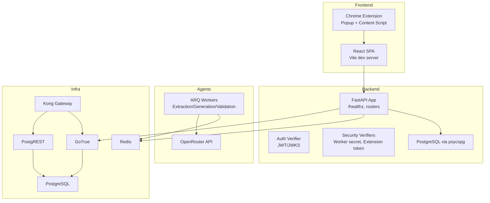
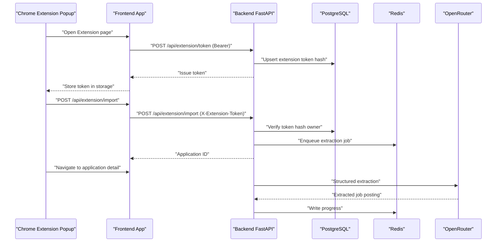
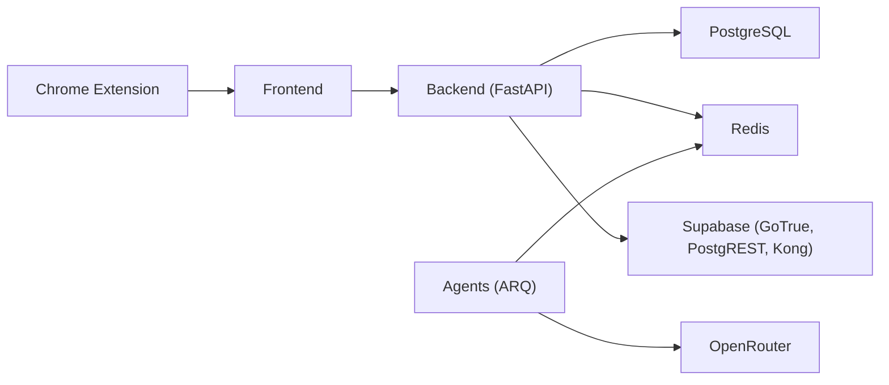

# Troubleshooting and FAQ

<cite>
**Referenced Files in This Document**
- [docker-compose.yml](file://docker-compose.yml)
- [backend/app/main.py](file://backend/app/main.py)
- [backend/app/core/config.py](file://backend/app/core/config.py)
- [backend/app/core/auth.py](file://backend/app/core/auth.py)
- [backend/app/core/security.py](file://backend/app/core/security.py)
- [backend/app/api/session.py](file://backend/app/api/session.py)
- [backend/app/db/profiles.py](file://backend/app/db/profiles.py)
- [backend/pyproject.toml](file://backend/pyproject.toml)
- [agents/pyproject.toml](file://agents/pyproject.toml)
- [frontend/src/lib/env.ts](file://frontend/src/lib/env.ts)
- [frontend/src/lib/api.ts](file://frontend/src/lib/api.ts)
- [frontend/public/chrome-extension/manifest.json](file://frontend/public/chrome-extension/manifest.json)
- [frontend/public/chrome-extension/content-script.js](file://frontend/public/chrome-extension/content-script.js)
- [frontend/public/chrome-extension/popup.js](file://frontend/public/chrome-extension/popup.js)
- [scripts/healthcheck.sh](file://scripts/healthcheck.sh)
- [agents/worker.py](file://agents/worker.py)
</cite>

## Table of Contents
1. [Introduction](#introduction)
2. [Project Structure](#project-structure)
3. [Core Components](#core-components)
4. [Architecture Overview](#architecture-overview)
5. [Detailed Component Analysis](#detailed-component-analysis)
6. [Dependency Analysis](#dependency-analysis)
7. [Performance Considerations](#performance-considerations)
8. [Troubleshooting Guide](#troubleshooting-guide)
9. [Conclusion](#conclusion)
10. [Appendices](#appendices)

## Introduction
This document provides a comprehensive troubleshooting and FAQ guide for the AI Resume Builder application. It focuses on diagnosing and resolving common setup, configuration, connectivity, and runtime issues across the frontend, backend, AI agents, and Chrome extension. It also covers performance optimization, security considerations, diagnostics, monitoring, escalation steps, and preventive best practices.

## Project Structure
The system is composed of:
- Frontend (React + Vite) with a Chrome extension UI and bridge
- Backend (FastAPI) with authentication, session bootstrapping, and extension token management
- Agents (ARQ workers) orchestrating AI-driven extraction and generation
- Supabase stack (PostgreSQL, PostgREST, GoTrue, Kong) for auth and gateway
- Redis for progress tracking and inter-service messaging

**Diagram sources**
- [docker-compose.yml:1-191](file://docker-compose.yml#L1-L191)
- [backend/app/main.py:1-36](file://backend/app/main.py#L1-L36)
- [agents/worker.py:1-120](file://agents/worker.py#L1-L120)

**Section sources**
- [docker-compose.yml:1-191](file://docker-compose.yml#L1-L191)

## Core Components
- Environment and configuration
  - Backend reads environment variables for database, Redis, Supabase URLs, JWT settings, and worker secrets.
  - Frontend validates Vite environment variables at runtime.
- Authentication and authorization
  - Backend verifies Supabase JWTs via JWKS or symmetric secret fallback.
  - Internal worker callbacks are protected by a shared secret header.
  - Extension token authentication uses hashed tokens stored in user profiles.
- Data persistence
  - PostgreSQL via psycopg with explicit row factory and JSONB handling.
- AI agents
  - ARQ workers orchestrate extraction, generation, and validation using OpenRouter APIs.
- Chrome extension
  - Manifest defines permissions and background/service worker.
  - Content script captures page metadata and communicates with the extension popup.
  - Popup issues requests to the backend using X-Extension-Token.

**Section sources**
- [backend/app/core/config.py:35-96](file://backend/app/core/config.py#L35-L96)
- [frontend/src/lib/env.ts:1-15](file://frontend/src/lib/env.ts#L1-L15)
- [backend/app/core/auth.py:22-90](file://backend/app/core/auth.py#L22-L90)
- [backend/app/core/security.py:13-54](file://backend/app/core/security.py#L13-L54)
- [backend/app/db/profiles.py:38-224](file://backend/app/db/profiles.py#L38-L224)
- [agents/worker.py:54-71](file://agents/worker.py#L54-L71)

## Architecture Overview
The system relies on:
- CORS allowing both web app origin and Chrome extension scheme
- Supabase for auth and JWT verification
- Redis for progress storage and inter-process communication
- OpenRouter for AI processing
- Health checks for service readiness

**Diagram sources**
- [frontend/public/chrome-extension/popup.js:109-130](file://frontend/public/chrome-extension/popup.js#L109-L130)
- [backend/app/api/session.py:27-44](file://backend/app/api/session.py#L27-L44)
- [backend/app/core/security.py:34-53](file://backend/app/core/security.py#L34-L53)
- [agents/worker.py:526-667](file://agents/worker.py#L526-L667)

## Detailed Component Analysis

### Frontend Troubleshooting
Common issues:
- Missing or invalid environment variables
  - Symptoms: Blank app, auth errors, inability to call backend
  - Resolution: Ensure VITE_SUPABASE_URL, VITE_SUPABASE_ANON_KEY, VITE_API_URL are set and valid
- CORS errors when calling backend
  - Symptoms: Fetch failures from browser console
  - Resolution: Confirm APP_URL/CORS_ORIGINS matches frontend origin; verify backend CORS middleware allows the origin
- Authentication failures
  - Symptoms: 401 Unauthorized on protected routes
  - Resolution: Verify Supabase auth is healthy and JWT audience/issuer match backend settings

Diagnostic checklist:
- Verify environment variables are loaded at runtime
- Check network tab for failed preflight or blocked requests
- Confirm Supabase auth health endpoint responds

**Section sources**
- [frontend/src/lib/env.ts:1-15](file://frontend/src/lib/env.ts#L1-L15)
- [frontend/src/lib/api.ts:177-214](file://frontend/src/lib/api.ts#L177-L214)
- [backend/app/main.py:15-22](file://backend/app/main.py#L15-L22)
- [scripts/healthcheck.sh:32-34](file://scripts/healthcheck.sh#L32-L34)

### Backend Troubleshooting
Common issues:
- Health check failing
  - Symptoms: /healthz returns error or container restarts
  - Resolution: Inspect logs; verify database and Redis connectivity; confirm environment variables
- CORS misconfiguration
  - Symptoms: Browser blocks requests from extension or web app
  - Resolution: Ensure APP_URL/CORS_ORIGINS include both web origin and chrome-extension scheme
- Authentication failures
  - Symptoms: 401 on protected endpoints
  - Resolution: Verify SUPABASE_AUTH_JWKS_URL, SUPABASE_JWT_SECRET, SUPABASE_JWT_AUDIENCE; check JWKS availability
- Extension token authentication failures
  - Symptoms: 401 when importing from extension
  - Resolution: Ensure token hash exists in profile; verify token rotation and last-used timestamps
- Worker callback failures
  - Symptoms: Internal worker endpoints reject requests
  - Resolution: Set WORKER_CALLBACK_SECRET and pass X-Worker-Secret header

Operational checks:
- Run healthcheck script against Supabase, backend, and frontend
- Review backend logs for CORS and auth exceptions

**Section sources**
- [backend/app/main.py:25-36](file://backend/app/main.py#L25-L36)
- [backend/app/core/config.py:35-96](file://backend/app/core/config.py#L35-L96)
- [backend/app/core/auth.py:22-90](file://backend/app/core/auth.py#L22-L90)
- [backend/app/core/security.py:13-54](file://backend/app/core/security.py#L13-L54)
- [scripts/healthcheck.sh:1-35](file://scripts/healthcheck.sh#L1-L35)

### AI Agent and Worker Troubleshooting
Common issues:
- Missing OpenRouter configuration
  - Symptoms: Extraction/Generation jobs fail immediately
  - Resolution: Set OPENROUTER_API_KEY and appropriate model variables
- Blocked pages or timeouts
  - Symptoms: Extraction fails with blocked_source or timeout
  - Resolution: Retry with manual entry; adjust timeouts; verify site accessibility
- Progress not updating
  - Symptoms: UI shows stale progress
  - Resolution: Confirm Redis connectivity and keyspace; verify ARQ worker is running
- Callback secret mismatch
  - Symptoms: Internal worker callback rejected
  - Resolution: Set WORKER_CALLBACK_SECRET consistently across backend and agents

Debugging tips:
- Inspect Redis keys for progress updates
- Monitor agent logs for model errors and timeouts
- Validate callback payloads and headers

**Section sources**
- [agents/worker.py:290-305](file://agents/worker.py#L290-L305)
- [agents/worker.py:307-370](file://agents/worker.py#L307-L370)
- [agents/worker.py:526-667](file://agents/worker.py#L526-L667)
- [agents/worker.py:682-806](file://agents/worker.py#L682-L806)

### Chrome Extension Integration Troubleshooting
Common issues:
- Cannot capture current page
  - Symptoms: Extension popup reports “Unable to capture”
  - Resolution: Ensure active tab is available; verify content script injection
- Import fails with 401
  - Symptoms: “Extension access expired” error
  - Resolution: Re-issue token from the web app; ensure token stored and trusted origin
- Not connecting to local app
  - Symptoms: “Open the web app Extension page...”
  - Resolution: Open the Extension page in the local web app and connect; ensure appUrl is trusted
- Bridge message validation failures
  - Symptoms: Messages ignored due to origin mismatch
  - Resolution: Verify appUrl origin normalization and stored origin matching

**Section sources**
- [frontend/public/chrome-extension/content-script.js:60-74](file://frontend/public/chrome-extension/content-script.js#L60-L74)
- [frontend/public/chrome-extension/popup.js:95-136](file://frontend/public/chrome-extension/popup.js#L95-L136)
- [frontend/public/chrome-extension/manifest.json:1-24](file://frontend/public/chrome-extension/manifest.json#L1-L24)

## Dependency Analysis
Key external dependencies and their roles:
- Backend
  - FastAPI, uvicorn, psycopg, redis, PyJWT, httpx
- Agents
  - ARQ, httpx, langchain-openai, playwright, pydantic-settings
- Frontend
  - React, react-router, @supabase/supabase-js, vitest

**Diagram sources**
- [backend/pyproject.toml:10-22](file://backend/pyproject.toml#L10-L22)
- [agents/pyproject.toml:10-16](file://agents/pyproject.toml#L10-L16)
- [docker-compose.yml:1-191](file://docker-compose.yml#L1-L191)

**Section sources**
- [backend/pyproject.toml:10-22](file://backend/pyproject.toml#L10-L22)
- [agents/pyproject.toml:10-16](file://agents/pyproject.toml#L10-L16)

## Performance Considerations
- Database queries
  - Use prepared statements and limit returned fields; avoid N+1 selects
  - Indexes on foreign keys and frequent filters (e.g., user_id, application_id)
- API response times
  - Enable gzip/HTTP compression at the gateway (Kong) if not already enabled
  - Cache static assets and reduce payload sizes
- AI processing bottlenecks
  - Tune model selection and fallbacks; batch work where safe
  - Limit concurrent Playwright instances; monitor timeouts
- Memory usage
  - Monitor ARQ worker memory; scale down concurrent tasks or increase resources
  - Use streaming responses for large PDF exports

[No sources needed since this section provides general guidance]

## Troubleshooting Guide

### Setup and Environment Issues
Symptoms
- Backend fails to start or health check fails
- Frontend loads blank or throws environment errors
- Agents crash immediately

Resolution steps
- Verify environment variables in compose and .env files
- Confirm ports are free and mapped correctly
- Run healthcheck script to validate Supabase, backend, and frontend
- Check service dependencies order and healthchecks

Escalation
- Share compose logs and healthcheck output
- Provide backend logs around startup and auth initialization

**Section sources**
- [scripts/healthcheck.sh:1-35](file://scripts/healthcheck.sh#L1-L35)
- [docker-compose.yml:1-191](file://docker-compose.yml#L1-L191)

### Configuration Errors
Symptoms
- CORS errors in browser console
- JWT verification failures
- Worker callback rejections

Resolution steps
- Align APP_URL and CORS_ORIGINS with frontend origin
- Verify SUPABASE_AUTH_JWKS_URL and JWT audience/issuer
- Set WORKER_CALLBACK_SECRET and propagate to agents

Escalation
- Provide backend logs for auth decoding and CORS middleware
- Include agent logs for callback secret mismatches

**Section sources**
- [backend/app/main.py:15-22](file://backend/app/main.py#L15-L22)
- [backend/app/core/config.py:35-96](file://backend/app/core/config.py#L35-L96)
- [backend/app/core/auth.py:40-64](file://backend/app/core/auth.py#L40-L64)
- [backend/app/core/security.py:13-22](file://backend/app/core/security.py#L13-L22)

### Database Connectivity Problems
Symptoms
- Session bootstrap returns 503
- Profile fetch fails or returns empty
- Extension token operations fail

Resolution steps
- Confirm DATABASE_URL format and credentials
- Check PostgreSQL healthcheck and migration runner completion
- Validate schema presence and table permissions

Escalation
- Provide backend logs for DB connection and query errors
- Include migration runner logs

**Section sources**
- [backend/app/api/session.py:33-38](file://backend/app/api/session.py#L33-L38)
- [backend/app/db/profiles.py:47-68](file://backend/app/db/profiles.py#L47-L68)
- [docker-compose.yml:101-113](file://docker-compose.yml#L101-L113)

### Service Startup Failures
Symptoms
- Containers restart rapidly
- Health checks fail intermittently

Resolution steps
- Inspect container logs for import/runtime errors
- Verify dependency readiness (migration runner, Redis, DB)
- Reduce startup concurrency and retry limits if needed

Escalation
- Provide container logs and compose config
- Include healthcheck script output

**Section sources**
- [docker-compose.yml:89-94](file://docker-compose.yml#L89-L94)
- [docker-compose.yml:140-144](file://docker-compose.yml#L140-L144)
- [scripts/healthcheck.sh:21-30](file://scripts/healthcheck.sh#L21-L30)

### Frontend Issues
Symptoms
- Blank screen or environment validation errors
- Auth errors on protected routes
- Network failures to backend

Resolution steps
- Validate VITE_SUPABASE_URL, VITE_SUPABASE_ANON_KEY, VITE_API_URL
- Check CORS and Supabase auth health
- Inspect network tab for blocked requests

Escalation
- Provide browser console logs and network panel captures
- Share frontend environment parsing logs

**Section sources**
- [frontend/src/lib/env.ts:1-15](file://frontend/src/lib/env.ts#L1-L15)
- [frontend/src/lib/api.ts:177-214](file://frontend/src/lib/api.ts#L177-L214)
- [scripts/healthcheck.sh:32-34](file://scripts/healthcheck.sh#L32-L34)

### Backend API Problems
Symptoms
- 401 Unauthorized on session/profile routes
- CORS preflight blocked
- Extension token endpoints fail

Resolution steps
- Confirm Authorization Bearer token presence and validity
- Verify Supabase JWT audience/issuer and JWKS availability
- Ensure X-Extension-Token is present and hashed token exists in profile

Escalation
- Provide backend auth and security middleware logs
- Include Supabase auth logs

**Section sources**
- [backend/app/core/auth.py:72-90](file://backend/app/core/auth.py#L72-L90)
- [backend/app/core/security.py:34-53](file://backend/app/core/security.py#L34-L53)
- [backend/app/main.py:15-22](file://backend/app/main.py#L15-L22)

### AI Agent Processing Failures
Symptoms
- Extraction/Generation jobs fail immediately
- Blocked pages or timeouts reported
- No progress updates in Redis

Resolution steps
- Set OPENROUTER_API_KEY and model variables
- Increase timeouts and retry logic cautiously
- Verify Redis connectivity and ARQ worker logs

Escalation
- Provide agent logs for model errors and callback failures
- Include Redis connectivity logs

**Section sources**
- [agents/worker.py:307-370](file://agents/worker.py#L307-L370)
- [agents/worker.py:526-667](file://agents/worker.py#L526-L667)
- [agents/worker.py:682-806](file://agents/worker.py#L682-L806)

### Chrome Extension Integration Issues
Symptoms
- Cannot capture current page
- Import fails with 401
- Extension not connecting to local app

Resolution steps
- Ensure active tab is available and content script injected
- Re-issue token from the Extension page and verify stored origin
- Confirm appUrl is trusted and normalized

Escalation
- Provide extension popup and content script logs
- Include Supabase auth and backend extension token logs

**Section sources**
- [frontend/public/chrome-extension/popup.js:95-136](file://frontend/public/chrome-extension/popup.js#L95-L136)
- [frontend/public/chrome-extension/content-script.js:60-74](file://frontend/public/chrome-extension/content-script.js#L60-L74)
- [backend/app/core/security.py:34-53](file://backend/app/core/security.py#L34-L53)

### Security Considerations
- Authentication failures
  - Ensure SUPABASE_AUTH_JWKS_URL is reachable and JWT audience/issuer match
  - Verify symmetric JWT secret fallback only when necessary
- CORS issues
  - Allow both web app origin and chrome-extension scheme
  - Avoid wildcard origins in production
- Extension security
  - Enforce X-Extension-Token header and hashed token validation
  - Rotate tokens and track last-used timestamps

**Section sources**
- [backend/app/core/auth.py:40-64](file://backend/app/core/auth.py#L40-L64)
- [backend/app/main.py:15-22](file://backend/app/main.py#L15-L22)
- [backend/app/core/security.py:34-53](file://backend/app/core/security.py#L34-L53)

### Diagnostic Procedures and Monitoring
- Health checks
  - Use the provided healthcheck script to probe Supabase, backend, and frontend
- Log analysis
  - Backend: filter auth, security, and database errors
  - Agents: filter model errors, timeouts, and callback failures
  - Frontend: inspect environment parsing and fetch error messages
- Monitoring
  - Track Redis progress keys and ARQ queue depth
  - Observe Supabase auth and Kong gateway logs

**Section sources**
- [scripts/healthcheck.sh:1-35](file://scripts/healthcheck.sh#L1-L35)
- [agents/worker.py:272-288](file://agents/worker.py#L272-L288)

### Preventive Measures and Best Practices
- Environment hygiene
  - Keep separate .env files per service; validate at startup
- Dependency management
  - Pin versions in pyproject.toml; run pytest locally
- Operational safety
  - Use healthchecks and readiness probes
  - Separate secrets for Supabase and worker callbacks
- Extension trust model
  - Validate appUrl origin and enforce chrome-extension scheme allowance

**Section sources**
- [backend/pyproject.toml:10-22](file://backend/pyproject.toml#L10-L22)
- [agents/pyproject.toml:10-16](file://agents/pyproject.toml#L10-L16)
- [backend/app/main.py:15-22](file://backend/app/main.py#L15-L22)

## Conclusion
This guide consolidates actionable steps to diagnose and resolve common issues across the frontend, backend, agents, and Chrome extension. By validating environment configuration, ensuring secure and correct authentication, monitoring health and logs, and applying performance and security best practices, most problems can be quickly identified and resolved.

[No sources needed since this section summarizes without analyzing specific files]

## Appendices

### Quick Reference: Common Error Codes and Causes
- 401 Unauthorized
  - Missing or invalid Authorization Bearer token
  - Invalid or expired Supabase JWT
  - Missing or invalid X-Extension-Token
- 403 Forbidden
  - Worker secret mismatch for internal callbacks
- 503 Service Unavailable
  - Profile not found during session bootstrap
- CORS blocked
  - Origin not included in CORS_ORIGINS or chrome-extension scheme not allowed

**Section sources**
- [backend/app/core/auth.py:72-90](file://backend/app/core/auth.py#L72-L90)
- [backend/app/core/security.py:13-22](file://backend/app/core/security.py#L13-L22)
- [backend/app/api/session.py:33-38](file://backend/app/api/session.py#L33-L38)
- [backend/app/main.py:15-22](file://backend/app/main.py#L15-L22)