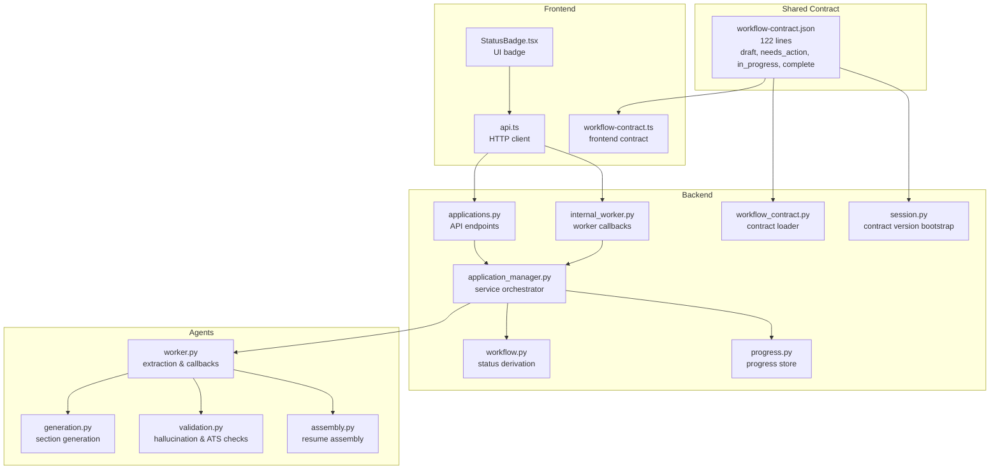
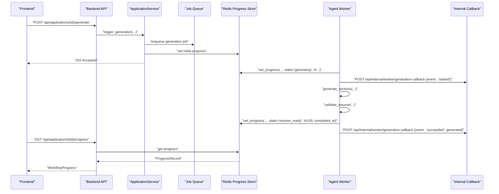
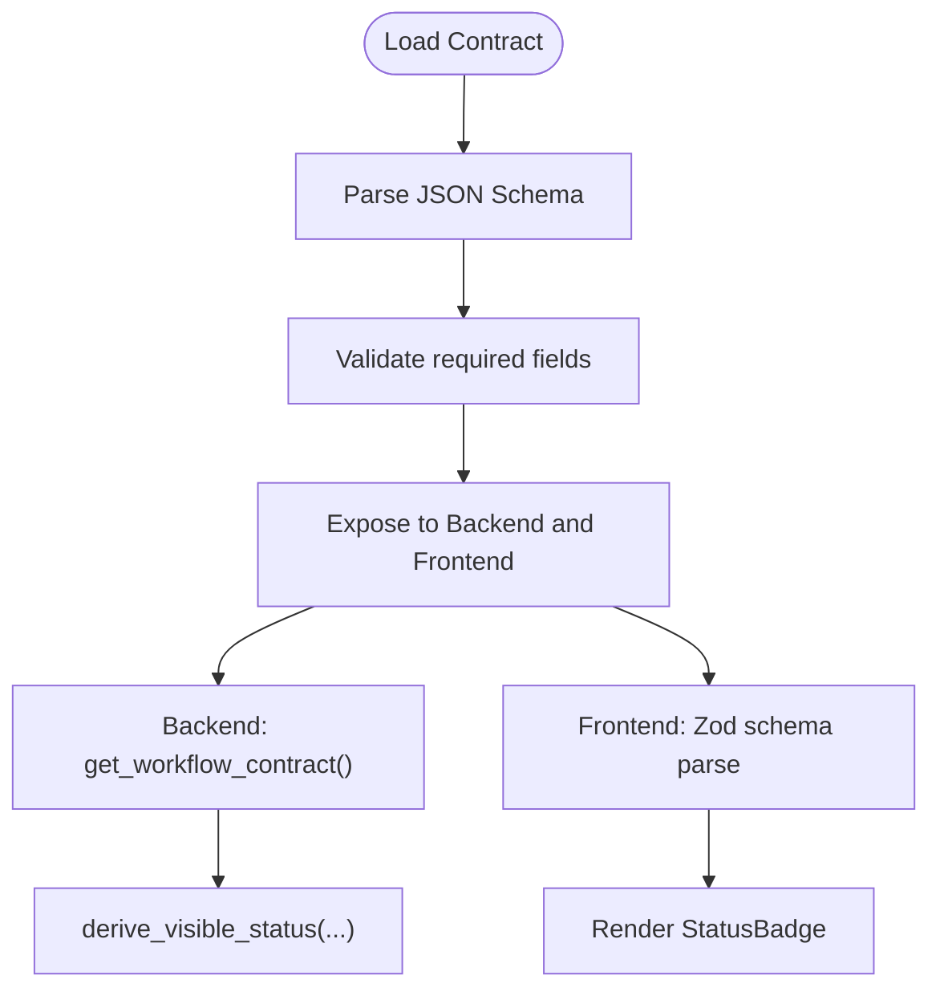
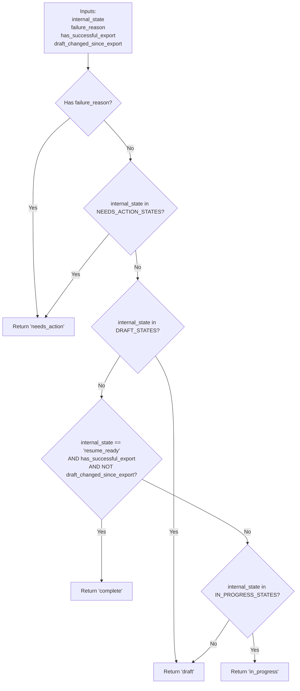
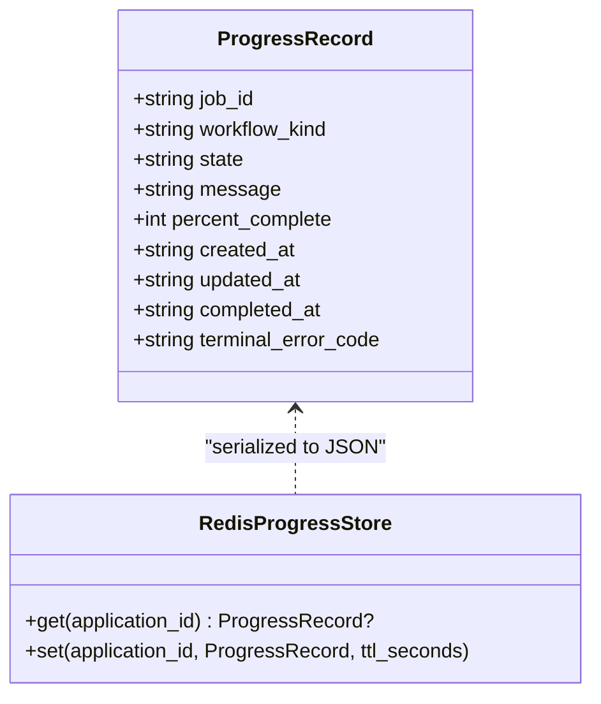
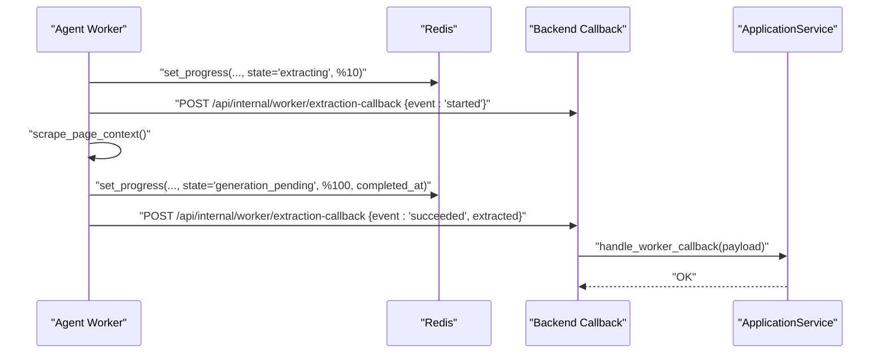
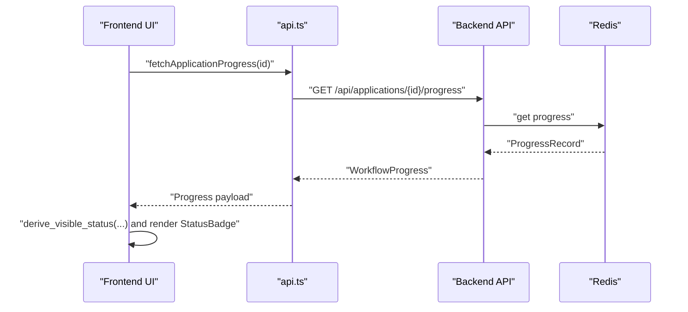
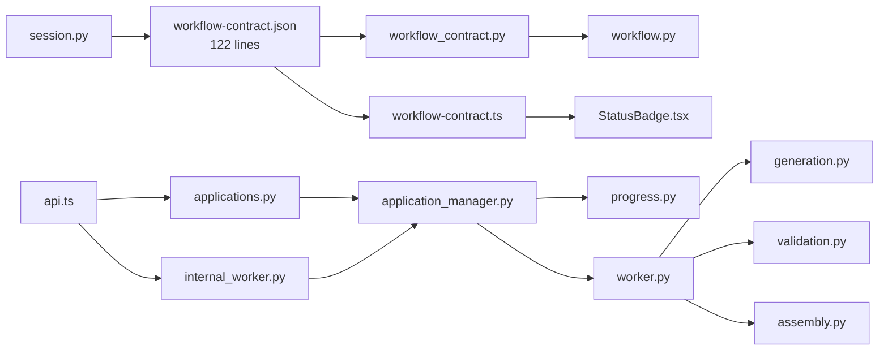

# Workflow Management

<cite>
**Referenced Files in This Document**
- [workflow-contract.json](file://backend/app/core/workflow-contract.json)
- [workflow-contract.json](file://shared/workflow-contract.json)
- [workflow_contract.py](file://backend/app/core/workflow_contract.py)
- [workflow-contract.ts](file://frontend/src/lib/workflow-contract.ts)
- [workflow.py](file://backend/app/services/workflow.py)
- [progress.py](file://backend/app/services/progress.py)
- [applications.py](file://backend/app/api/applications.py)
- [internal_worker.py](file://backend/app/api/internal_worker.py)
- [application_manager.py](file://backend/app/services/application_manager.py)
- [worker.py](file://agents/worker.py)
- [generation.py](file://agents/generation.py)
- [validation.py](file://agents/validation.py)
- [assembly.py](file://agents/assembly.py)
- [api.ts](file://frontend/src/lib/api.ts)
- [StatusBadge.tsx](file://frontend/src/components/StatusBadge.tsx)
- [test_workflow_contract.py](file://backend/tests/test_workflow_contract.py)
- [session.py](file://backend/app/api/session.py)
</cite>

## Update Summary
**Changes Made**
- Added comprehensive documentation for the new 122-line workflow contract system
- Documented the standardized status tracking across four states (draft, needs_action, in_progress, complete)
- Updated workflow contract implementation details including mapping rules and failure handling
- Enhanced progress tracking system documentation with new polling schema
- Added integration points for the new contract system across frontend, backend, and agents

## Table of Contents
1. [Introduction](#introduction)
2. [Project Structure](#project-structure)
3. [Core Components](#core-components)
4. [Architecture Overview](#architecture-overview)
5. [Detailed Component Analysis](#detailed-component-analysis)
6. [Dependency Analysis](#dependency-analysis)
7. [Performance Considerations](#performance-considerations)
8. [Troubleshooting Guide](#troubleshooting-guide)
9. [Conclusion](#conclusion)
10. [Appendices](#appendices)

## Introduction
This document explains the workflow management system that orchestrates application state transitions, progress reporting, and AI agent processing across the frontend and backend. The system is built around a comprehensive 122-line JSON workflow contract that establishes standardized status tracking across four states: draft, needs_action, in_progress, and complete. The contract defines internal states, failure reasons, workflow kinds, mapping rules, and progress schema that ensure consistency across distributed components.

## Project Structure
The workflow system spans three layers with the new contract system as the central coordination mechanism:
- Shared contract: Defines statuses, internal states, failure reasons, workflow kinds, mapping rules, and progress schema in a 122-line JSON file.
- Backend: Implements state machines, progress persistence, API endpoints, and worker callbacks using the contract.
- Agents: Execute extraction, generation, and validation tasks, reporting progress and outcomes according to contract specifications.
- Frontend: Renders status badges, polls progress, and triggers workflow actions based on contract-defined states.

**Diagram sources**
- [workflow-contract.json:1-122](file://backend/app/core/workflow-contract.json#L1-L122)
- [workflow-contract.json:1-122](file://shared/workflow-contract.json#L1-L122)
- [workflow_contract.py:1-52](file://backend/app/core/workflow_contract.py#L1-L52)
- [workflow-contract.ts:1-33](file://frontend/src/lib/workflow-contract.ts#L1-L33)
- [workflow.py:1-36](file://backend/app/services/workflow.py#L1-L36)
- [progress.py:1-82](file://backend/app/services/progress.py#L1-L82)
- [applications.py:1-779](file://backend/app/api/applications.py#L1-L779)
- [internal_worker.py:1-71](file://backend/app/api/internal_worker.py#L1-L71)
- [application_manager.py:1-2225](file://backend/app/services/application_manager.py#L1-L2225)
- [worker.py:1-800](file://agents/worker.py#L1-L800)
- [generation.py:1-351](file://agents/generation.py#L1-L351)
- [validation.py:1-292](file://agents/validation.py#L1-L292)
- [assembly.py:1-63](file://agents/assembly.py#L1-L63)
- [api.ts:1-489](file://frontend/src/lib/api.ts#L1-L489)
- [StatusBadge.tsx:1-23](file://frontend/src/components/StatusBadge.tsx#L1-L23)
- [session.py:1-38](file://backend/app/api/session.py#L1-L38)

**Section sources**
- [workflow-contract.json:1-122](file://backend/app/core/workflow-contract.json#L1-L122)
- [workflow-contract.json:1-122](file://shared/workflow-contract.json#L1-L122)
- [workflow_contract.py:1-52](file://backend/app/core/workflow_contract.py#L1-L52)
- [workflow-contract.ts:1-33](file://frontend/src/lib/workflow-contract.ts#L1-L33)
- [workflow.py:1-36](file://backend/app/services/workflow.py#L1-L36)
- [progress.py:1-82](file://backend/app/services/progress.py#L1-L82)
- [applications.py:1-779](file://backend/app/api/applications.py#L1-L779)
- [internal_worker.py:1-71](file://backend/app/api/internal_worker.py#L1-L71)
- [application_manager.py:1-2225](file://backend/app/services/application_manager.py#L1-L2225)
- [worker.py:1-800](file://agents/worker.py#L1-L800)
- [generation.py:1-351](file://agents/generation.py#L1-L351)
- [validation.py:1-292](file://agents/validation.py#L1-L292)
- [assembly.py:1-63](file://agents/assembly.py#L1-L63)
- [api.ts:1-489](file://frontend/src/lib/api.ts#L1-L489)
- [StatusBadge.tsx:1-23](file://frontend/src/components/StatusBadge.tsx#L1-L23)
- [session.py:1-38](file://backend/app/api/session.py#L1-L38)

## Core Components
- **Workflow Contract**: A comprehensive 122-line JSON file defining four visible statuses (draft, needs_action, in_progress, complete), 10 internal states, 6 failure reasons, 5 workflow kinds, 6 mapping rules, and a detailed polling progress schema.
- **Status Derivation**: Backend computes visible status from internal state, failure reason, and export state using deterministic mapping rules from the contract.
- **Progress Tracking**: Redis-backed progress storage with a strict schema for job_id, workflow_kind, state, message, percent_complete, timestamps, and terminal error code.
- **Worker Callbacks**: Backend exposes internal endpoints for agents to report progress and outcomes; frontend polls progress endpoints.
- **Agent Orchestration**: Extraction, generation, and validation agents update progress and notify backend via callbacks following contract specifications.

**Section sources**
- [workflow-contract.json:1-122](file://backend/app/core/workflow-contract.json#L1-L122)
- [workflow-contract.json:1-122](file://shared/workflow-contract.json#L1-L122)
- [workflow_contract.py:1-52](file://backend/app/core/workflow_contract.py#L1-L52)
- [workflow-contract.ts:1-33](file://frontend/src/lib/workflow-contract.ts#L1-L33)
- [workflow.py:1-36](file://backend/app/services/workflow.py#L1-L36)
- [progress.py:1-82](file://backend/app/services/progress.py#L1-L82)
- [applications.py:627-640](file://backend/app/api/applications.py#L627-L640)
- [internal_worker.py:1-71](file://backend/app/api/internal_worker.py#L1-L71)
- [worker.py:583-618](file://agents/worker.py#L583-L618)

## Architecture Overview
The workflow is a distributed state machine driven by the new comprehensive contract system that ensures frontend/backend parity and standardized status tracking across all components.

**Diagram sources**
- [applications.py:560-580](file://backend/app/api/applications.py#L560-L580)
- [application_manager.py:1-2225](file://backend/app/services/application_manager.py#L1-L2225)
- [progress.py:61-82](file://backend/app/services/progress.py#L61-L82)
- [worker.py:682-806](file://agents/worker.py#L682-L806)
- [internal_worker.py:37-52](file://backend/app/api/internal_worker.py#L37-L52)
- [api.ts:414-427](file://frontend/src/lib/api.ts#L414-L427)
- [api.ts:298-300](file://frontend/src/lib/api.ts#L298-L300)

## Detailed Component Analysis

### Workflow Contract System
The new 122-line workflow contract establishes standardized status tracking across four states with comprehensive internal state management and failure handling:

**Visible Statuses**: draft, needs_action, in_progress, complete
**Internal States**: extraction_pending, extracting, manual_entry_required, duplicate_review_required, generation_pending, generating, resume_ready, regenerating_section, regenerating_full, export_in_progress
**Failure Reasons**: extraction_failed, generation_failed, generation_timeout, generation_cancelled, regeneration_failed, export_failed
**Workflow Kinds**: extraction, generation, regeneration_section, regeneration_full, export
**Mapping Rules**: 6 deterministic rules governing status transitions based on internal state, failure reason, and export conditions

**Diagram sources**
- [workflow-contract.json:1-122](file://backend/app/core/workflow-contract.json#L1-L122)
- [workflow-contract.json:1-122](file://shared/workflow-contract.json#L1-L122)
- [workflow_contract.py:32-52](file://backend/app/core/workflow_contract.py#L32-L52)
- [workflow-contract.ts:9-28](file://frontend/src/lib/workflow-contract.ts#L9-L28)

**Section sources**
- [workflow-contract.json:1-122](file://backend/app/core/workflow-contract.json#L1-L122)
- [workflow-contract.json:1-122](file://shared/workflow-contract.json#L1-L122)
- [workflow_contract.py:1-52](file://backend/app/core/workflow_contract.py#L1-L52)
- [workflow-contract.ts:1-33](file://frontend/src/lib/workflow-contract.ts#L1-L33)
- [test_workflow_contract.py:1-21](file://backend/tests/test_workflow_contract.py#L1-L21)

### Status Derivation and Mapping Rules
The backend derives visible status using six comprehensive mapping rules that ensure consistent state transitions:

1. **Failure Reason Overrides**: Any failure reason automatically sets status to needs_action
2. **Manual Entry Attention**: manual_entry_required and duplicate_review_required states set status to needs_action
3. **Pre-Resume States**: All states before resume creation (extraction_pending, extracting, generation_pending, generating) map to draft
4. **Fresh Export Requirement**: resume_ready without successful export maps to needs_action
5. **Regeneration/Export States**: regenerating_section, regenerating_full, and export_in_progress map to in_progress
6. **Complete State**: resume_ready with successful export and no draft changes maps to complete

**Diagram sources**
- [workflow.py:11-36](file://backend/app/services/workflow.py#L11-L36)
- [workflow-contract.json:36-97](file://backend/app/core/workflow-contract.json#L36-L97)

**Section sources**
- [workflow.py:1-36](file://backend/app/services/workflow.py#L1-L36)
- [workflow-contract.json:1-122](file://backend/app/core/workflow-contract.json#L1-L122)

### Progress Tracking System
Progress is stored in Redis with a comprehensive schema supporting the new contract system:

**Required Fields**: job_id, workflow_kind, state, message, percent_complete, created_at, updated_at
**Optional Fields**: completed_at, terminal_error_code
**Data Types**: UUID job_id, workflow_kinds enum, internal_states enum, string messages, integer 0-100 percent_complete, ISO 8601 datetimes

Backend stores and retrieves progress via RedisProgressStore, while agents write progress during extraction and generation. The system supports job isolation through job_id validation.

**Diagram sources**
- [progress.py:13-82](file://backend/app/services/progress.py#L13-L82)
- [applications.py:627-640](file://backend/app/api/applications.py#L627-L640)
- [worker.py:583-618](file://agents/worker.py#L583-L618)

**Section sources**
- [progress.py:1-82](file://backend/app/services/progress.py#L1-L82)
- [applications.py:627-640](file://backend/app/api/applications.py#L627-L640)
- [worker.py:583-618](file://agents/worker.py#L583-L618)

### Agent Orchestration and Callbacks
Agents execute jobs following the contract-defined workflow and communicate with backend via:

- Redis progress writes during execution with proper job_id validation
- HTTP callbacks to internal endpoints for start/success/failure events
- Backend service handles callbacks and updates application state according to mapping rules

**Diagram sources**
- [worker.py:526-667](file://agents/worker.py#L526-L667)
- [internal_worker.py:19-34](file://backend/app/api/internal_worker.py#L19-L34)
- [application_manager.py:773-793](file://backend/app/services/application_manager.py#L773-L793)

**Section sources**
- [worker.py:526-667](file://agents/worker.py#L526-L667)
- [internal_worker.py:1-71](file://backend/app/api/internal_worker.py#L1-L71)
- [application_manager.py:773-793](file://backend/app/services/application_manager.py#L773-L793)

### Frontend Integration and UI
Frontend components leverage the comprehensive contract system:

- Load and validate the workflow contract using Zod schema parsing
- Poll progress via GET /api/applications/{id}/progress with contract-compliant schema
- Render status badges based on visible status derived from contract mapping rules
- Trigger actions (generate, regenerate, export) and handle responses according to contract states

**Diagram sources**
- [api.ts:298-300](file://frontend/src/lib/api.ts#L298-L300)
- [applications.py:627-640](file://backend/app/api/applications.py#L627-L640)
- [progress.py:61-82](file://backend/app/services/progress.py#L61-L82)
- [StatusBadge.tsx:1-23](file://frontend/src/components/StatusBadge.tsx#L1-L23)
- [workflow-contract.ts:1-33](file://frontend/src/lib/workflow-contract.ts#L1-L33)

**Section sources**
- [api.ts:1-489](file://frontend/src/lib/api.ts#L1-L489)
- [StatusBadge.tsx:1-23](file://frontend/src/components/StatusBadge.tsx#L1-L23)
- [workflow-contract.ts:1-33](file://frontend/src/lib/workflow-contract.ts#L1-L33)

### End-to-End Workflow Execution Examples
The new contract system enables standardized workflow execution across all components:

**Extraction Workflow**:
- Frontend triggers extraction; backend enqueues job and sets initial progress
- Agent scrapes page, detects blockage or insufficient text, reports failure, and transitions to manual_entry_required
- User completes manual entry or recovers from source; backend advances state and continues

**Generation Workflow**:
- Frontend triggers generation; backend enqueues job and sets progress
- Agent generates sections, validates, and notifies backend; backend persists resume and updates status to complete

**Export Workflow**:
- On successful generation and export, status becomes complete; otherwise remains in_progress until export succeeds

**Section sources**
- [applications.py:444-459](file://backend/app/api/applications.py#L444-L459)
- [applications.py:560-580](file://backend/app/api/applications.py#L560-L580)
- [applications.py:641-661](file://backend/app/api/applications.py#L641-L661)
- [worker.py:526-667](file://agents/worker.py#L526-L667)
- [worker.py:682-806](file://agents/worker.py#L682-L806)

## Dependency Analysis
The new workflow contract system creates centralized dependencies across all components:

- **Shared Contract**: Consumed by both backend and frontend to ensure consistent status mapping and progress schema
- **Backend Service**: Depends on contract for state transitions, callback handling, and progress validation
- **Agents**: Depend on contract path and backend callback endpoints for standardized progress reporting
- **Frontend**: Depends on backend APIs and contract for UI rendering and progress polling

**Diagram sources**
- [workflow-contract.json:1-122](file://backend/app/core/workflow-contract.json#L1-L122)
- [workflow-contract.json:1-122](file://shared/workflow-contract.json#L1-L122)
- [workflow_contract.py:1-52](file://backend/app/core/workflow_contract.py#L1-L52)
- [workflow-contract.ts:1-33](file://frontend/src/lib/workflow-contract.ts#L1-L33)
- [workflow.py:1-36](file://backend/app/services/workflow.py#L1-L36)
- [StatusBadge.tsx:1-23](file://frontend/src/components/StatusBadge.tsx#L1-L23)
- [applications.py:1-779](file://backend/app/api/applications.py#L1-L779)
- [internal_worker.py:1-71](file://backend/app/api/internal_worker.py#L1-L71)
- [application_manager.py:1-2225](file://backend/app/services/application_manager.py#L1-L2225)
- [progress.py:1-82](file://backend/app/services/progress.py#L1-L82)
- [worker.py:1-800](file://agents/worker.py#L1-L800)
- [generation.py:1-351](file://agents/generation.py#L1-L351)
- [validation.py:1-292](file://agents/validation.py#L1-L292)
- [assembly.py:1-63](file://agents/assembly.py#L1-L63)
- [api.ts:1-489](file://frontend/src/lib/api.ts#L1-L489)
- [session.py:1-38](file://backend/app/api/session.py#L1-L38)

**Section sources**
- [workflow-contract.json:1-122](file://backend/app/core/workflow-contract.json#L1-L122)
- [workflow-contract.json:1-122](file://shared/workflow-contract.json#L1-L122)
- [workflow_contract.py:1-52](file://backend/app/core/workflow_contract.py#L1-L52)
- [workflow-contract.ts:1-33](file://frontend/src/lib/workflow-contract.ts#L1-L33)
- [workflow.py:1-36](file://backend/app/services/workflow.py#L1-L36)
- [applications.py:1-779](file://backend/app/api/applications.py#L1-L779)
- [internal_worker.py:1-71](file://backend/app/api/internal_worker.py#L1-L71)
- [application_manager.py:1-2225](file://backend/app/services/application_manager.py#L1-L2225)
- [progress.py:1-82](file://backend/app/services/progress.py#L1-L82)
- [worker.py:1-800](file://agents/worker.py#L1-L800)
- [generation.py:1-351](file://agents/generation.py#L1-L351)
- [validation.py:1-292](file://agents/validation.py#L1-L292)
- [assembly.py:1-63](file://agents/assembly.py#L1-L63)
- [api.ts:1-489](file://frontend/src/lib/api.ts#L1-L489)
- [StatusBadge.tsx:1-23](file://frontend/src/components/StatusBadge.tsx#L1-L23)
- [session.py:1-38](file://backend/app/api/session.py#L1-L38)

## Performance Considerations
- **Progress Updates**: Lightweight JSON payloads stored in Redis with TTL alignment to job lifetimes
- **Contract Loading**: LRU cache optimization reduces filesystem I/O for contract access
- **Agent Timeouts**: Embedded in generation/validation steps with configurable fallbacks and timeouts
- **Frontend Polling**: Balances responsiveness with server load using exponential backoff strategies
- **Schema Validation**: Contract-based validation ensures consistent payloads across agents and backend

## Troubleshooting Guide
Common issues and resolutions with the new contract system:

**Contract Loading Issues**:
- Verify shared_contract_path configuration in settings
- Check file permissions for workflow-contract.json in multiple locations
- Ensure contract version compatibility across frontend/backend

**Status Mapping Problems**:
- Extraction failures: Blocked pages or insufficient text lead to manual_entry_required
- Generation failures: Validation errors or hallucinations cause failure transitions
- Progress not updating: Confirm Redis connectivity and keyspace access

**Progress Schema Validation**:
- Terminal error codes must match failure_reasons enumeration
- Job IDs must be UUID format for proper isolation
- Percent complete values must be integers between 0-100

**Operational Checks**:
- Contract completeness: Backend tests verify required fields and schema integrity
- Callback secrets: Internal endpoints enforce worker secret verification
- State transitions: Mapping rules ensure deterministic status changes

**Section sources**
- [worker.py:475-510](file://agents/worker.py#L475-L510)
- [worker.py:656-666](file://agents/worker.py#L656-L666)
- [internal_worker.py:19-34](file://backend/app/api/internal_worker.py#L19-L34)
- [test_workflow_contract.py:1-21](file://backend/tests/test_workflow_contract.py#L1-L21)

## Conclusion
The new workflow contract system provides a robust, contract-driven state machine that coordinates extraction, generation, validation, and export across frontend, backend, and agents. The comprehensive 122-line JSON contract establishes standardized status tracking across four states with detailed mapping rules, ensuring consistency and enabling real-time status updates. By adhering to the shared contract, persisting progress in Redis, and using worker callbacks, the system maintains reliability across distributed components while providing clear visibility into workflow execution.

## Appendices

### Status Mapping Reference
**needs_action**: failure_reason present or internal_state indicates manual action required
**draft**: internal_state in pre-resume states (extraction_pending, extracting, generation_pending, generating)
**in_progress**: regenerating_section, regenerating_full, or export_in_progress states
**complete**: resume_ready with successful export and no draft changes

**Section sources**
- [workflow-contract.json:36-97](file://backend/app/core/workflow-contract.json#L36-L97)
- [workflow.py:11-36](file://backend/app/services/workflow.py#L11-L36)

### Progress Payload Fields
**Required**: job_id (UUID), workflow_kind (enum), state (internal_states), message (string), percent_complete (0-100), created_at, updated_at
**Optional**: completed_at, terminal_error_code (failure_reasons)

**Section sources**
- [workflow-contract.json:99-120](file://backend/app/core/workflow-contract.json#L99-L120)
- [progress.py:13-23](file://backend/app/services/progress.py#L13-L23)
- [worker.py:332-353](file://agents/worker.py#L332-L353)

### Contract Version Management
**Version**: 1.0.2 with comprehensive status tracking and mapping rules
**Integration**: Available via session bootstrap endpoint for frontend contract version verification

**Section sources**
- [workflow-contract.json:2](file://backend/app/core/workflow-contract.json#L2)
- [session.py:25](file://backend/app/api/session.py#L25)