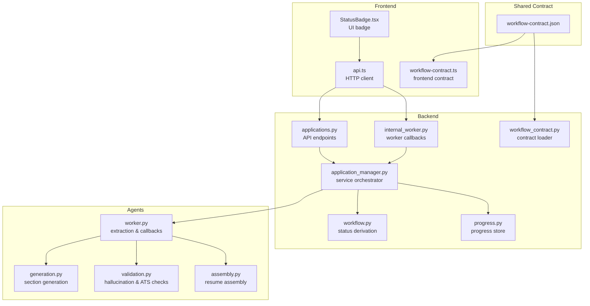
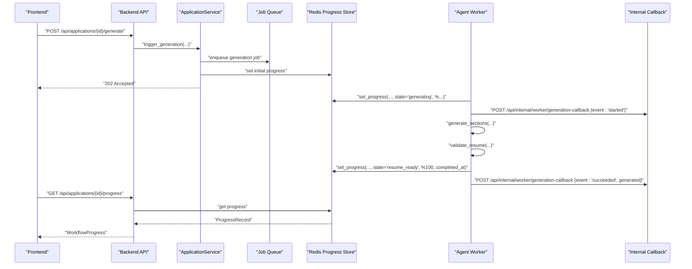
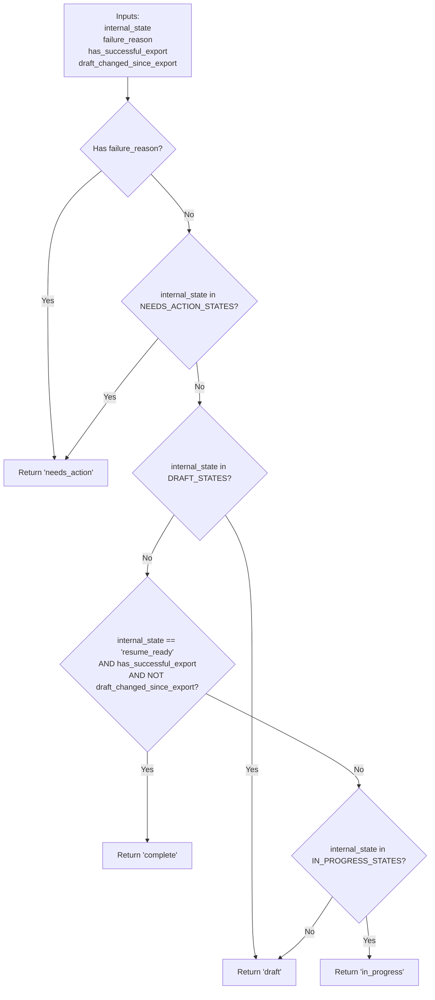
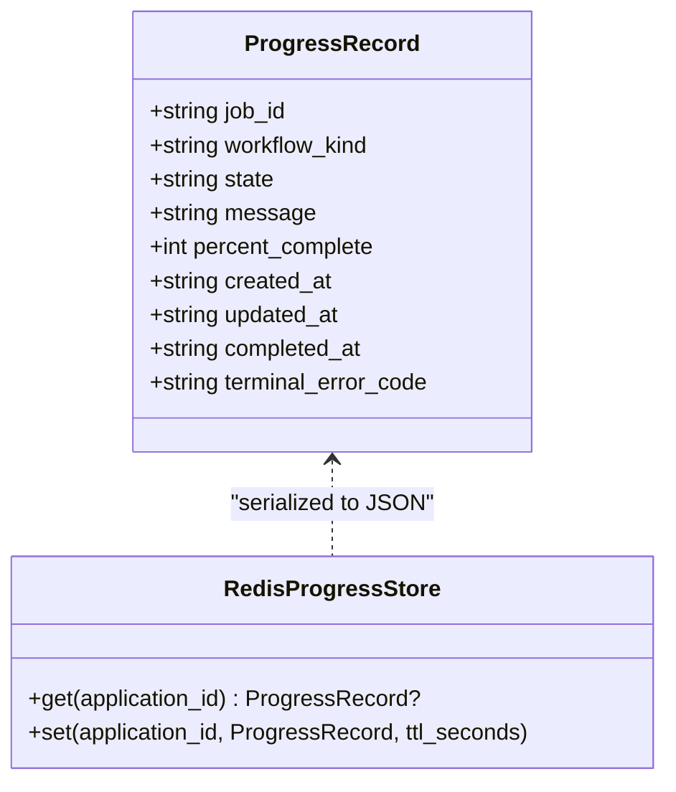
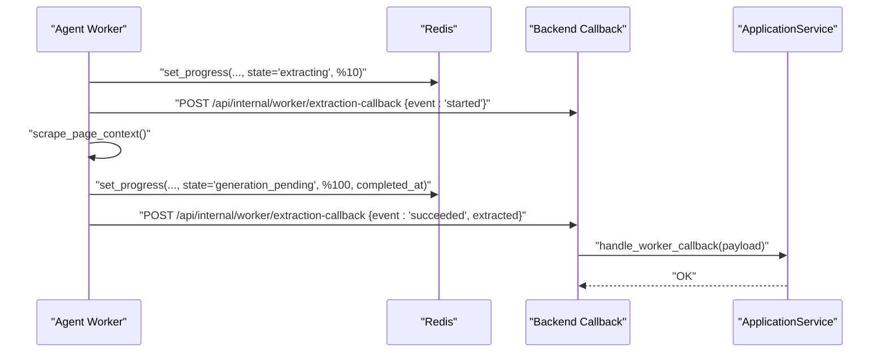
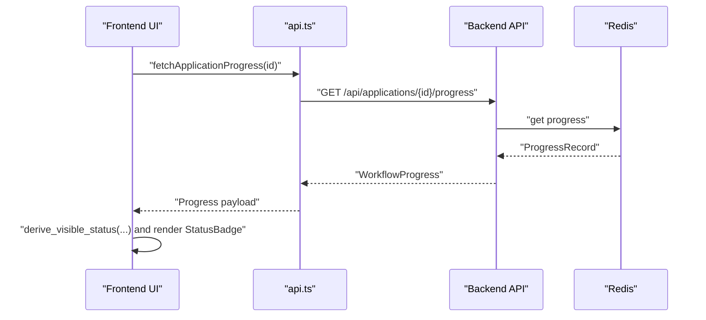
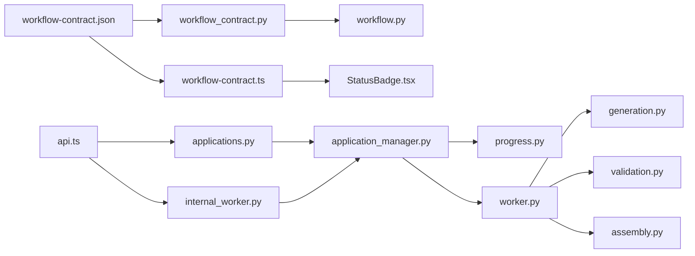

# Workflow Management

<cite>
**Referenced Files in This Document**
- [workflow-contract.json](file://shared/workflow-contract.json)
- [workflow_contract.py](file://backend/app/core/workflow_contract.py)
- [workflow-contract.ts](file://frontend/src/lib/workflow-contract.ts)
- [workflow.py](file://backend/app/services/workflow.py)
- [progress.py](file://backend/app/services/progress.py)
- [applications.py](file://backend/app/api/applications.py)
- [internal_worker.py](file://backend/app/api/internal_worker.py)
- [application_manager.py](file://backend/app/services/application_manager.py)
- [worker.py](file://agents/worker.py)
- [generation.py](file://agents/generation.py)
- [validation.py](file://agents/validation.py)
- [assembly.py](file://agents/assembly.py)
- [api.ts](file://frontend/src/lib/api.ts)
- [StatusBadge.tsx](file://frontend/src/components/StatusBadge.tsx)
- [test_workflow_contract.py](file://backend/tests/test_workflow_contract.py)
</cite>

## Table of Contents
1. [Introduction](#introduction)
2. [Project Structure](#project-structure)
3. [Core Components](#core-components)
4. [Architecture Overview](#architecture-overview)
5. [Detailed Component Analysis](#detailed-component-analysis)
6. [Dependency Analysis](#dependency-analysis)
7. [Performance Considerations](#performance-considerations)
8. [Troubleshooting Guide](#troubleshooting-guide)
9. [Conclusion](#conclusion)
10. [Appendices](#appendices)

## Introduction
This document explains the workflow management system that orchestrates application state transitions, progress reporting, and AI agent processing across the frontend and backend. It defines the workflow contract, the status derivation rules, the progress tracking mechanism, and the integration points between the frontend, backend, and agents. It also covers failure handling, recovery pathways, and operational guidance for monitoring and troubleshooting workflows.

## Project Structure
The workflow system spans three layers:
- Shared contract: Defines statuses, internal states, failure reasons, workflow kinds, mapping rules, and progress schema.
- Backend: Implements state machines, progress persistence, API endpoints, and worker callbacks.
- Agents: Execute extraction, generation, and validation tasks, reporting progress and outcomes.
- Frontend: Renders status badges, polls progress, and triggers workflow actions.

**Diagram sources**
- [workflow-contract.json:1-112](file://shared/workflow-contract.json#L1-L112)
- [workflow_contract.py:1-40](file://backend/app/core/workflow_contract.py#L1-L40)
- [workflow-contract.ts:1-33](file://frontend/src/lib/workflow-contract.ts#L1-L33)
- [workflow.py:1-31](file://backend/app/services/workflow.py#L1-L31)
- [progress.py:1-79](file://backend/app/services/progress.py#L1-L79)
- [applications.py:1-661](file://backend/app/api/applications.py#L1-L661)
- [internal_worker.py:1-71](file://backend/app/api/internal_worker.py#L1-L71)
- [application_manager.py:1-200](file://backend/app/services/application_manager.py#L1-L200)
- [worker.py:1-800](file://agents/worker.py#L1-L800)
- [generation.py:1-351](file://agents/generation.py#L1-L351)
- [validation.py:1-292](file://agents/validation.py#L1-L292)
- [assembly.py:1-63](file://agents/assembly.py#L1-L63)
- [api.ts:1-489](file://frontend/src/lib/api.ts#L1-L489)
- [StatusBadge.tsx:1-23](file://frontend/src/components/StatusBadge.tsx#L1-L23)

**Section sources**
- [workflow-contract.json:1-112](file://shared/workflow-contract.json#L1-L112)
- [workflow_contract.py:1-40](file://backend/app/core/workflow_contract.py#L1-L40)
- [workflow-contract.ts:1-33](file://frontend/src/lib/workflow-contract.ts#L1-L33)
- [workflow.py:1-31](file://backend/app/services/workflow.py#L1-L31)
- [progress.py:1-79](file://backend/app/services/progress.py#L1-L79)
- [applications.py:1-661](file://backend/app/api/applications.py#L1-L661)
- [internal_worker.py:1-71](file://backend/app/api/internal_worker.py#L1-L71)
- [application_manager.py:1-200](file://backend/app/services/application_manager.py#L1-L200)
- [worker.py:1-800](file://agents/worker.py#L1-L800)
- [generation.py:1-351](file://agents/generation.py#L1-L351)
- [validation.py:1-292](file://agents/validation.py#L1-L292)
- [assembly.py:1-63](file://agents/assembly.py#L1-L63)
- [api.ts:1-489](file://frontend/src/lib/api.ts#L1-L489)
- [StatusBadge.tsx:1-23](file://frontend/src/components/StatusBadge.tsx#L1-L23)

## Core Components
- Workflow contract: Defines visible statuses, internal states, failure reasons, workflow kinds, mapping rules, and progress schema. Both frontend and backend load this contract to maintain consistency.
- Status derivation: Backend computes visible status from internal state, failure reason, and export state.
- Progress tracking: Redis-backed progress storage with a strict schema for job_id, workflow_kind, state, message, percent_complete, timestamps, and terminal error code.
- Worker callbacks: Backend exposes internal endpoints for agents to report progress and outcomes; frontend polls progress endpoints.
- Agent orchestration: Extraction, generation, and validation agents update progress and notify backend via callbacks.

**Section sources**
- [workflow-contract.json:1-112](file://shared/workflow-contract.json#L1-L112)
- [workflow_contract.py:1-40](file://backend/app/core/workflow_contract.py#L1-L40)
- [workflow-contract.ts:1-33](file://frontend/src/lib/workflow-contract.ts#L1-L33)
- [workflow.py:1-31](file://backend/app/services/workflow.py#L1-L31)
- [progress.py:1-79](file://backend/app/services/progress.py#L1-L79)
- [applications.py:526-540](file://backend/app/api/applications.py#L526-L540)
- [internal_worker.py:1-71](file://backend/app/api/internal_worker.py#L1-L71)
- [worker.py:240-288](file://agents/worker.py#L240-L288)

## Architecture Overview
The workflow is a distributed state machine driven by:
- Shared contract ensuring frontend/backend parity.
- Backend APIs that enqueue jobs and expose progress.
- Agents that execute workloads and report progress and outcomes.
- Frontend that polls progress and triggers actions.

**Diagram sources**
- [applications.py:560-580](file://backend/app/api/applications.py#L560-L580)
- [application_manager.py:1-200](file://backend/app/services/application_manager.py#L1-L200)
- [progress.py:53-79](file://backend/app/services/progress.py#L53-L79)
- [worker.py:682-806](file://agents/worker.py#L682-L806)
- [internal_worker.py:37-52](file://backend/app/api/internal_worker.py#L37-L52)
- [api.ts:414-427](file://frontend/src/lib/api.ts#L414-L427)
- [api.ts:298-300](file://frontend/src/lib/api.ts#L298-L300)

## Detailed Component Analysis

### Workflow Contract
The contract defines:
- Visible statuses: draft, needs_action, in_progress, complete.
- Internal states: extraction_pending, extracting, manual_entry_required, duplicate_review_required, generation_pending, generating, resume_ready, regenerating_section, regenerating_full, export_in_progress.
- Failure reasons: extraction_failed, generation_failed, regeneration_failed, export_failed.
- Workflow kinds: extraction, generation, regeneration_section, regeneration_full, export.
- Mapping rules: deterministic transformations from internal state/failure reason to visible status.
- Progress schema: required fields and types for progress payloads.

**Diagram sources**
- [workflow-contract.json:1-112](file://shared/workflow-contract.json#L1-L112)
- [workflow_contract.py:32-40](file://backend/app/core/workflow_contract.py#L32-L40)
- [workflow-contract.ts:9-28](file://frontend/src/lib/workflow-contract.ts#L9-L28)

**Section sources**
- [workflow-contract.json:1-112](file://shared/workflow-contract.json#L1-L112)
- [workflow_contract.py:1-40](file://backend/app/core/workflow_contract.py#L1-L40)
- [workflow-contract.ts:1-33](file://frontend/src/lib/workflow-contract.ts#L1-L33)
- [test_workflow_contract.py:1-21](file://backend/tests/test_workflow_contract.py#L1-L21)

### Status Derivation and Mapping
Backend derives visible status from internal state, failure reason, and export conditions. The mapping rules in the contract define precedence and overrides.

**Diagram sources**
- [workflow.py:11-31](file://backend/app/services/workflow.py#L11-L31)
- [workflow-contract.json:34-87](file://shared/workflow-contract.json#L34-L87)

**Section sources**
- [workflow.py:1-31](file://backend/app/services/workflow.py#L1-L31)
- [workflow-contract.json:1-112](file://shared/workflow-contract.json#L1-L112)

### Progress Tracking System
Progress is stored in Redis with a strict schema:
- Fields: job_id, workflow_kind, state, message, percent_complete, created_at, updated_at, completed_at, terminal_error_code.
- Backend stores and retrieves progress via RedisProgressStore.
- Agents write progress during extraction and generation; backend exposes GET /progress endpoint.

**Diagram sources**
- [progress.py:13-79](file://backend/app/services/progress.py#L13-L79)
- [applications.py:526-540](file://backend/app/api/applications.py#L526-L540)
- [worker.py:272-288](file://agents/worker.py#L272-L288)

**Section sources**
- [progress.py:1-79](file://backend/app/services/progress.py#L1-L79)
- [applications.py:526-540](file://backend/app/api/applications.py#L526-L540)
- [worker.py:248-288](file://agents/worker.py#L248-L288)

### Agent Orchestration and Callbacks
Agents execute jobs and communicate with backend via:
- Redis progress writes during execution.
- HTTP callbacks to internal endpoints for start/success/failure events.
- Backend service handles callbacks and updates application state.

**Diagram sources**
- [worker.py:526-667](file://agents/worker.py#L526-L667)
- [internal_worker.py:19-34](file://backend/app/api/internal_worker.py#L19-L34)
- [application_manager.py:1-200](file://backend/app/services/application_manager.py#L1-L200)

**Section sources**
- [worker.py:526-667](file://agents/worker.py#L526-L667)
- [internal_worker.py:1-71](file://backend/app/api/internal_worker.py#L1-L71)
- [application_manager.py:1-200](file://backend/app/services/application_manager.py#L1-L200)

### Frontend Integration and UI
Frontend components:
- Load and validate the workflow contract.
- Poll progress via GET /api/applications/{id}/progress.
- Render status badges based on visible status.
- Trigger actions (generate, regenerate, export) and handle responses.

**Diagram sources**
- [api.ts:298-300](file://frontend/src/lib/api.ts#L298-L300)
- [applications.py:526-540](file://backend/app/api/applications.py#L526-L540)
- [progress.py:61-65](file://backend/app/services/progress.py#L61-L65)
- [StatusBadge.tsx:1-23](file://frontend/src/components/StatusBadge.tsx#L1-L23)
- [workflow-contract.ts:1-33](file://frontend/src/lib/workflow-contract.ts#L1-L33)

**Section sources**
- [api.ts:1-489](file://frontend/src/lib/api.ts#L1-L489)
- [StatusBadge.tsx:1-23](file://frontend/src/components/StatusBadge.tsx#L1-L23)
- [workflow-contract.ts:1-33](file://frontend/src/lib/workflow-contract.ts#L1-L33)

### End-to-End Workflow Execution Examples
- Extraction workflow:
  - Frontend triggers extraction; backend enqueues job and sets initial progress.
  - Agent scrapes page, detects blockage or insufficient text, reports failure, and transitions to manual entry required.
  - User completes manual entry or recovers from source; backend advances state and continues.

- Generation workflow:
  - Frontend triggers generation; backend enqueues job and sets progress.
  - Agent generates sections, validates, and notifies backend; backend persists resume and updates status.

- Export workflow:
  - On successful generation and export, status becomes complete; otherwise remains in-progress until export succeeds.

**Section sources**
- [applications.py:444-459](file://backend/app/api/applications.py#L444-L459)
- [applications.py:560-580](file://backend/app/api/applications.py#L560-L580)
- [applications.py:641-661](file://backend/app/api/applications.py#L641-L661)
- [worker.py:526-667](file://agents/worker.py#L526-L667)
- [worker.py:682-806](file://agents/worker.py#L682-L806)

## Dependency Analysis
Key dependencies and relationships:
- Shared contract is consumed by both backend and frontend to ensure consistent status mapping and progress schema.
- Backend service depends on repositories, queues, and progress store; it orchestrates state transitions and callback handling.
- Agents depend on the shared contract path and backend callback endpoints; they write progress and emit events.
- Frontend depends on backend APIs and the workflow contract to render status and poll progress.

**Diagram sources**
- [workflow-contract.json:1-112](file://shared/workflow-contract.json#L1-L112)
- [workflow_contract.py:1-40](file://backend/app/core/workflow_contract.py#L1-L40)
- [workflow-contract.ts:1-33](file://frontend/src/lib/workflow-contract.ts#L1-L33)
- [workflow.py:1-31](file://backend/app/services/workflow.py#L1-L31)
- [StatusBadge.tsx:1-23](file://frontend/src/components/StatusBadge.tsx#L1-L23)
- [applications.py:1-661](file://backend/app/api/applications.py#L1-L661)
- [internal_worker.py:1-71](file://backend/app/api/internal_worker.py#L1-L71)
- [application_manager.py:1-200](file://backend/app/services/application_manager.py#L1-L200)
- [progress.py:1-79](file://backend/app/services/progress.py#L1-L79)
- [worker.py:1-800](file://agents/worker.py#L1-L800)
- [generation.py:1-351](file://agents/generation.py#L1-L351)
- [validation.py:1-292](file://agents/validation.py#L1-L292)
- [assembly.py:1-63](file://agents/assembly.py#L1-L63)
- [api.ts:1-489](file://frontend/src/lib/api.ts#L1-L489)

**Section sources**
- [workflow-contract.json:1-112](file://shared/workflow-contract.json#L1-L112)
- [workflow_contract.py:1-40](file://backend/app/core/workflow_contract.py#L1-L40)
- [workflow-contract.ts:1-33](file://frontend/src/lib/workflow-contract.ts#L1-L33)
- [workflow.py:1-31](file://backend/app/services/workflow.py#L1-L31)
- [applications.py:1-661](file://backend/app/api/applications.py#L1-L661)
- [internal_worker.py:1-71](file://backend/app/api/internal_worker.py#L1-L71)
- [application_manager.py:1-200](file://backend/app/services/application_manager.py#L1-L200)
- [progress.py:1-79](file://backend/app/services/progress.py#L1-L79)
- [worker.py:1-800](file://agents/worker.py#L1-L800)
- [generation.py:1-351](file://agents/generation.py#L1-L351)
- [validation.py:1-292](file://agents/validation.py#L1-L292)
- [assembly.py:1-63](file://agents/assembly.py#L1-L63)
- [api.ts:1-489](file://frontend/src/lib/api.ts#L1-L489)
- [StatusBadge.tsx:1-23](file://frontend/src/components/StatusBadge.tsx#L1-L23)

## Performance Considerations
- Progress updates are lightweight JSON payloads stored in Redis; ensure TTL alignment with job lifetimes.
- Agent timeouts and retries are embedded in generation/validation steps; tune model fallbacks and timeouts for reliability.
- Frontend polling intervals should balance responsiveness with server load; consider exponential backoff on errors.
- Use the shared contract to avoid redundant validations and keep UI and backend logic aligned.

## Troubleshooting Guide
Common issues and resolutions:
- Extraction failures:
  - Blocked pages or insufficient text lead to manual entry required. Verify agent logs and callback payloads; ensure shared contract path is correct in agent settings.
- Generation failures:
  - Validation errors or hallucinations cause failure transitions. Inspect validation results and adjust generation settings or prompts.
- Progress not updating:
  - Confirm Redis connectivity and keyspace; verify progress store initialization and callback secret configuration.
- Status not reflecting changes:
  - Ensure frontend and backend share the same contract version; verify derive_visible_status inputs and mapping rules.

Operational checks:
- Contract completeness: Backend test asserts presence of required fields and schema.
- Callback secrets: Internal endpoints enforce worker secret verification.
- Progress schema: Strict schema ensures consistent payloads across agents and backend.

**Section sources**
- [worker.py:475-510](file://agents/worker.py#L475-L510)
- [worker.py:656-666](file://agents/worker.py#L656-L666)
- [internal_worker.py:19-34](file://backend/app/api/internal_worker.py#L19-L34)
- [test_workflow_contract.py:1-21](file://backend/tests/test_workflow_contract.py#L1-L21)

## Conclusion
The workflow management system provides a robust, contract-driven state machine that coordinates extraction, generation, validation, and export across frontend, backend, and agents. By adhering to the shared contract, persisting progress in Redis, and using worker callbacks, the system maintains consistency and enables real-time status updates. Proper monitoring, error propagation, and recovery mechanisms ensure reliable operation across distributed components.

## Appendices

### Status Mapping Reference
- needs_action: failure_reason present or internal_state indicates manual action required.
- draft: internal_state in pre-resume states.
- in_progress: resume_ready or regeneration/export states without successful export.
- complete: resume_ready with successful export and no draft changes.

**Section sources**
- [workflow-contract.json:34-87](file://shared/workflow-contract.json#L34-L87)
- [workflow.py:11-31](file://backend/app/services/workflow.py#L11-L31)

### Progress Payload Fields
- job_id: Unique identifier for the job.
- workflow_kind: One of extraction, generation, regeneration_section, regeneration_full, export.
- state: Internal state at the time of the update.
- message: Human-readable status message.
- percent_complete: Integer percentage of completion.
- created_at, updated_at: ISO 8601 timestamps.
- completed_at: Set upon job completion.
- terminal_error_code: Failure reason if terminal.

**Section sources**
- [workflow-contract.json:89-110](file://shared/workflow-contract.json#L89-L110)
- [progress.py:13-23](file://backend/app/services/progress.py#L13-L23)
- [worker.py:73-83](file://agents/worker.py#L73-L83)